## Parametric Bootstrap Connection

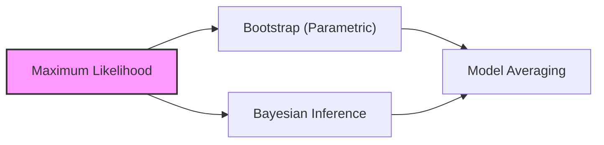

### Introdução

O presente capítulo explora as nuances da **inferência de modelos** e **model averaging**, com um foco particular na conexão entre o **bootstrap paramétrico**, **maximum likelihood**, e inferência Bayesiana. Conforme elucidado em [^8.1], a maior parte do ajuste de modelos é realizada minimizando a soma de quadrados ou a entropia cruzada, que são ambos casos do método de **maximum likelihood**. Este capítulo detalha uma exposição geral do método de maximum likelihood e do método Bayesiano, discutindo também o bootstrap em seu contexto, e explora técnicas relacionadas para model averaging e melhoria de modelos.

### Conceitos Fundamentais

#### Conceito 1: Maximum Likelihood
O método de **maximum likelihood** é uma técnica fundamental para estimar os parâmetros de um modelo estatístico [^8.1]. O objetivo é encontrar os valores dos parâmetros que maximizam a verossimilhança (likelihood) dos dados observados, ou seja, a probabilidade de observar os dados dados os parâmetros do modelo [^8.2.2]. Matematicamente, isso se expressa como:

$$
L(\theta; Z) = \prod_{i=1}^{N} g_{\theta}(z_i)
$$

onde $Z$ representa os dados observados, $\theta$ os parâmetros do modelo, $g_{\theta}$ a função de densidade de probabilidade ou massa de probabilidade, e $N$ o número de observações.  Para simplificar a otimização, o logaritmo da verossimilhança, também chamado de **log-likelihood**, é usado:

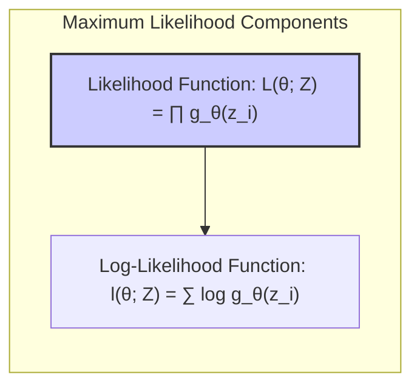
$$
l(\theta; Z) = \sum_{i=1}^{N} \log g_{\theta}(z_i)
$$

O estimador de maximum likelihood, $\hat{\theta}$, é o valor de $\theta$ que maximiza essa função. A intuição por trás do maximum likelihood é escolher os parâmetros que tornam os dados observados "mais prováveis".

> 💡 **Exemplo Numérico:** Vamos considerar um exemplo simples com uma amostra de 5 observações de uma distribuição normal,  $Z = \{2.1, 3.5, 1.8, 4.2, 2.9\}$. Assumimos que os dados seguem uma distribuição normal com média $\mu$ e desvio padrão $\sigma$, ou seja,  $g_{\theta}(z_i) = \frac{1}{\sqrt{2\pi\sigma^2}}e^{-\frac{(z_i - \mu)^2}{2\sigma^2}}$, onde $\theta = (\mu, \sigma)$. Para simplificar, vamos assumir que $\sigma=1$ e estimar apenas $\mu$. A log-likelihood será:
> $$
l(\mu; Z) = \sum_{i=1}^{5} \log \left( \frac{1}{\sqrt{2\pi}}e^{-\frac{(z_i - \mu)^2}{2}} \right) = - \frac{5}{2}\log(2\pi) - \frac{1}{2} \sum_{i=1}^{5} (z_i - \mu)^2
$$
> Para maximizar $l(\mu; Z)$ em relação a $\mu$, basta minimizar $\sum_{i=1}^{5} (z_i - \mu)^2$. A derivada em relação a $\mu$ e igualando a zero resulta em:
>
> $$
> \frac{d}{d\mu} \sum_{i=1}^{5} (z_i - \mu)^2 = -2 \sum_{i=1}^{5} (z_i - \mu) = 0
> $$
>  
>  Isolando $\mu$:
>
> $$
> \mu = \frac{1}{5}\sum_{i=1}^{5} z_i = \frac{2.1 + 3.5 + 1.8 + 4.2 + 2.9}{5} = 2.9
> $$
> Portanto, a estimativa de maximum likelihood para $\mu$ é 2.9.

**Lemma 1:** Sob certas condições de regularidade, o estimador de maximum likelihood $\hat{\theta}$ é assintoticamente normal, com média verdadeira $\theta_0$ e matriz de covariância igual à inversa da matriz de informação de Fisher $i(\theta_0)^{-1}$ [^8.2.2].
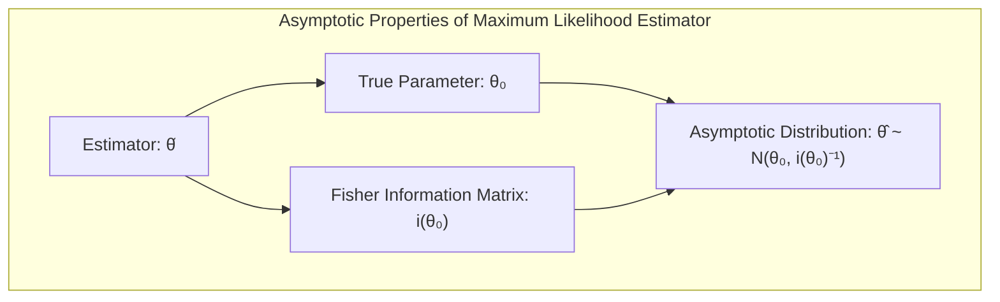
**Prova do Lemma 1:** A prova envolve a expansão de Taylor da log-likelihood em torno do valor verdadeiro do parâmetro, a avaliação da primeira derivada (score) e da segunda derivada (matriz de informação de Fisher), e o uso do teorema central do limite. A matriz de informação de Fisher $i(\theta)$ é definida como a expectativa do hessiano negativo da log-likelihood, $i(\theta) = E[ - \frac{\partial^2 l(\theta; Z)}{\partial \theta^2}]$. $\blacksquare$

> 💡 **Exemplo Numérico:** Continuando o exemplo anterior, podemos calcular a matriz de informação de Fisher para a média $\mu$ de uma distribuição normal com $\sigma = 1$. A segunda derivada da log-likelihood é:
>
> $$
> \frac{\partial^2 l(\mu; Z)}{\partial \mu^2} = \frac{\partial}{\partial \mu} \left( \sum_{i=1}^{5} (z_i - \mu) \right) = -5
> $$
>  A informação de Fisher é o negativo da esperança da segunda derivada, nesse caso, é apenas o valor 5 (pois é constante) e a sua inversa que é a variância do estimador é 1/5 = 0.2. Este resultado implica que a variância assintótica do estimador $\hat{\mu}$ é 0.2, confirmando que o estimador é mais preciso quanto maior a quantidade de dados.

#### Conceito 2: Bootstrap Paramétrico
O **bootstrap paramétrico** é uma técnica de reamostragem que simula dados a partir de uma distribuição paramétrica estimada com base nos dados observados [^8.2.1]. Ele difere do bootstrap não-paramétrico, que reamostra diretamente dos dados observados. O objetivo principal do bootstrap paramétrico é avaliar a incerteza associada aos parâmetros estimados [^8.2.1].  No caso do bootstrap paramétrico, amostramos dados a partir de uma distribuição paramétrica que foi ajustada aos dados observados. O método consiste em:
1. Ajustar um modelo paramétrico aos dados de treinamento, obtendo uma estimativa de maximum likelihood dos parâmetros $\hat{\theta}$ [^8.2.2].
2. Gerar novos conjuntos de dados de bootstrap a partir desse modelo, usando os parâmetros estimados $\hat{\theta}$ [^8.2.1].
3. Reestimar os parâmetros para cada conjunto de dados de bootstrap e calcular a estatística de interesse, obtendo, assim, uma distribuição amostral [^8.2.1].
4. Usar essa distribuição amostral para construir intervalos de confiança e estimar o erro padrão dos parâmetros.
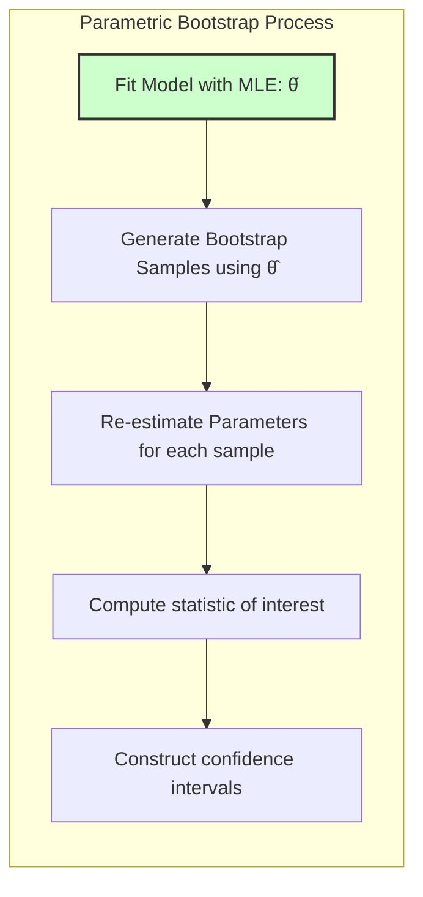

> 💡 **Exemplo Numérico:** Usando o exemplo anterior da distribuição normal com $\hat{\mu} = 2.9$ e $\sigma = 1$, podemos gerar, por exemplo, 3 conjuntos de dados bootstrap.
> ```python
> import numpy as np
>
> # Parâmetros estimados
> mu_hat = 2.9
> sigma = 1
> n = 5 # Tamanho da amostra original
> n_boot = 3  # Número de amostras bootstrap
>
> # Gerar conjuntos de dados bootstrap
> boot_samples = []
> for _ in range(n_boot):
>   boot_sample = np.random.normal(loc=mu_hat, scale=sigma, size=n)
>   boot_samples.append(boot_sample)
>
> print("Amostras Bootstrap:")
> for i, sample in enumerate(boot_samples):
>   print(f"Boot Sample {i+1}: {sample}")
>
> # Reestimar a média em cada amostra bootstrap
> boot_mu_hats = [np.mean(sample) for sample in boot_samples]
> print(f"Estimativas Bootstrap da média: {boot_mu_hats}")
> ```
> Isto produzirá algo como:
> ```
>Amostras Bootstrap:
>Boot Sample 1: [2.173 1.376 2.105 3.861 2.279]
>Boot Sample 2: [3.088 3.29  3.357 3.771 2.744]
>Boot Sample 3: [3.189 2.528 2.504 3.321 2.564]
>Estimativas Bootstrap da média: [2.358, 3.258, 2.821]
> ```
> Com as médias estimadas por bootstrap, é possível calcular a variância do estimador:
> ```python
> boot_mu_var = np.var(boot_mu_hats, ddof=1)
> print(f"Variância do estimador por bootstrap: {boot_mu_var}")
> ```
> Produzindo algo próximo de 0.20, o que é consistente com o resultado da informação de Fisher.

**Corolário 1:** Quando os erros do modelo são gaussianos, o bootstrap paramétrico concorda com os mínimos quadrados, fornecendo estimativas de intervalo de confiança [^8.2.2].
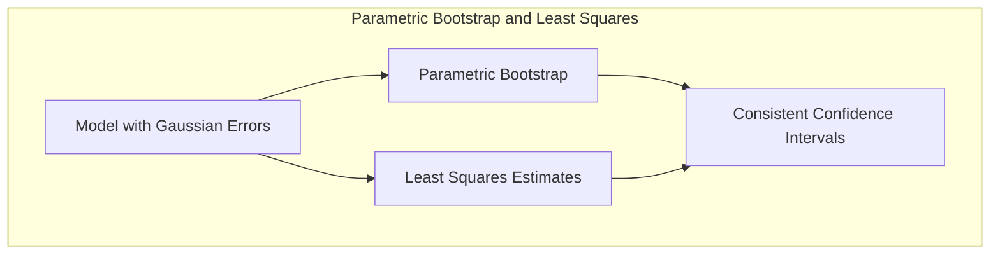
**Prova do Corolário 1:** No caso de erros gaussianos, o estimador de mínimos quadrados é o mesmo que o estimador de maximum likelihood. O bootstrap paramétrico, ao simular os dados com base no modelo com erros gaussianos, replicará essa estrutura, gerando intervalos de confiança consistentes com os intervalos baseados em mínimos quadrados. $\blacksquare$

#### Conceito 3: Conexão entre Bootstrap Paramétrico e Maximum Likelihood

O bootstrap paramétrico, embora baseado em reamostragem, está profundamente ligado ao método de maximum likelihood. Conforme discutido em [^8.2.2], o bootstrap paramétrico usa os parâmetros estimados por maximum likelihood como ponto de partida para simular novos dados. Se os erros do modelo forem gaussianos, o bootstrap paramétrico coincide com os resultados do método de mínimos quadrados [^8.2.2]. No entanto, de modo geral, o bootstrap paramétrico converge não para mínimos quadrados, mas sim para resultados consistentes com o método de maximum likelihood [^8.2.2].
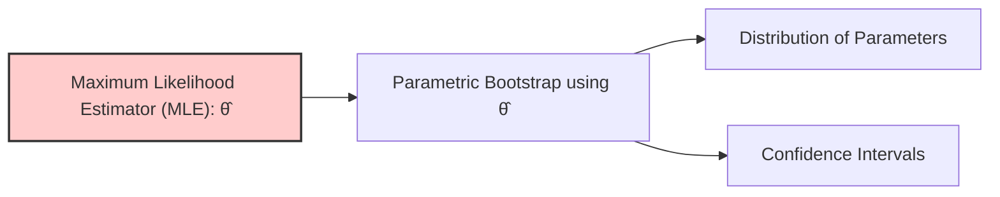

> ⚠️ **Nota Importante:** O bootstrap paramétrico fornece uma maneira computacional de avaliar a incerteza associada às estimativas de parâmetros, especialmente útil em situações onde os cálculos analíticos são complexos ou intratáveis [^8.2.1].

> ❗ **Ponto de Atenção:** A escolha do modelo paramétrico no bootstrap paramétrico é crucial e pode afetar significativamente os resultados. A inadequação do modelo pode levar a inferências errôneas [^8.2.2].

> ✔️ **Destaque:** O bootstrap paramétrico representa uma extensão do método de maximum likelihood, oferecendo uma abordagem prática para obter inferências estatísticas em modelos complexos [^8.2.2].

### Regressão Linear e Mínimos Quadrados para Classificação
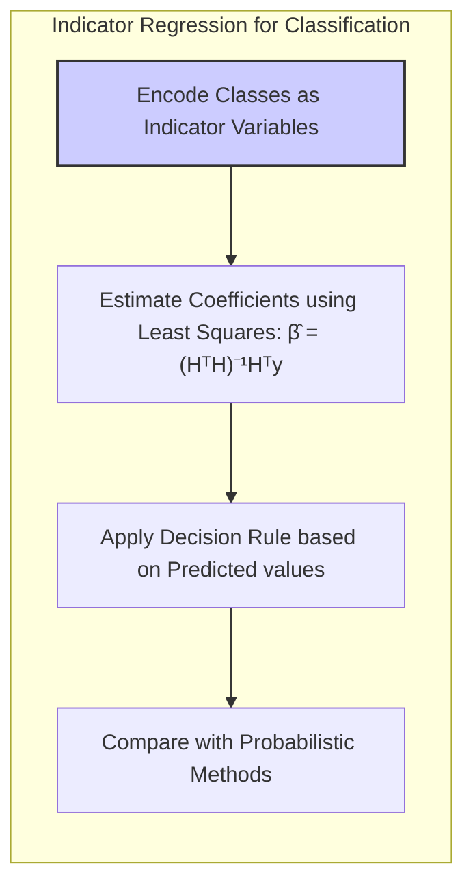

A regressão linear também pode ser usada para problemas de classificação, embora não seja o método mais comum. Em vez de tentar prever um valor contínuo, a regressão linear em matriz de indicadores (também conhecida como *dummy variables*) busca prever a qual classe uma observação pertence [^8.2]. Isso é feito codificando cada classe como um vetor indicador, ou seja, um vetor com 1 na posição da classe a qual a observação pertence e 0 em todas as outras posições [^8.2]. Os coeficientes são então estimados via mínimos quadrados, e a classe prevista para uma nova observação é aquela cujo vetor indicador tem o maior valor de previsão.

**Lemma 2:** A solução para o problema de regressão de indicadores com matriz de *design* H, é dada por $\hat{\beta} = (H^T H)^{-1}H^T y$, onde $y$ é o vetor de respostas [^8.2].

**Prova do Lemma 2:** A prova deriva diretamente do método de mínimos quadrados, onde a solução é obtida minimizando a soma dos erros quadráticos. O problema é formalizado como: $\min_\beta ||y - H\beta||^2$.  Derivando em relação a $\beta$ e igualando a zero, temos: $-2H^T (y - H\beta) = 0$, o que leva a $\hat{\beta} = (H^T H)^{-1}H^T y$. $\blacksquare$

> 💡 **Exemplo Numérico:** Suponha um problema de classificação com 3 classes e 4 observações, com os seguintes dados:
>
> | Observação | Classe | Variável X |
> |------------|--------|------------|
> | 1          | A      | 2          |
> | 2          | B      | 3          |
> | 3          | C      | 5          |
> | 4          | A      | 6          |
>
> Primeiro, codificamos as classes como variáveis indicadoras:
>
> | Observação | Classe A | Classe B | Classe C | Variável X |
> |------------|----------|----------|----------|------------|
> | 1          | 1        | 0        | 0        | 2          |
> | 2          | 0        | 1        | 0        | 3          |
> | 3          | 0        | 0        | 1        | 5          |
> | 4          | 1        | 0        | 0        | 6          |
>
> Podemos montar a matriz H (matriz de *design* com as variáveis indicadoras) e o vetor *y* (variável resposta):
>
> $$ H = \begin{bmatrix} 1 & 0 & 0 \\ 0 & 1 & 0 \\ 0 & 0 & 1 \\ 1 & 0 & 0  \end{bmatrix}, \quad y = \begin{bmatrix} 2 \\ 3 \\ 5 \\ 6 \end{bmatrix} $$
>
> Usando a fórmula $\hat{\beta} = (H^T H)^{-1}H^T y$, primeiro calculamos $H^T H$:
>
> $$H^T H =  \begin{bmatrix} 1 & 0 & 0 & 1 \\ 0 & 1 & 0 & 0 \\ 0 & 0 & 1 & 0 \end{bmatrix} \begin{bmatrix} 1 & 0 & 0 \\ 0 & 1 & 0 \\ 0 & 0 & 1 \\ 1 & 0 & 0  \end{bmatrix} = \begin{bmatrix} 2 & 0 & 0 \\ 0 & 1 & 0 \\ 0 & 0 & 1 \end{bmatrix} $$
>
> E $(H^T H)^{-1}$:
>
> $$(H^T H)^{-1} = \begin{bmatrix} 1/2 & 0 & 0 \\ 0 & 1 & 0 \\ 0 & 0 & 1 \end{bmatrix}$$
>
> Agora calculamos $H^T y$:
>
> $$H^T y = \begin{bmatrix} 1 & 0 & 0 & 1 \\ 0 & 1 & 0 & 0 \\ 0 & 0 & 1 & 0 \end{bmatrix} \begin{bmatrix} 2 \\ 3 \\ 5 \\ 6 \end{bmatrix} = \begin{bmatrix} 8 \\ 3 \\ 5 \end{bmatrix}$$
>
> Finalmente, $\hat{\beta}$:
>
> $$\hat{\beta} = \begin{bmatrix} 1/2 & 0 & 0 \\ 0 & 1 & 0 \\ 0 & 0 & 1 \end{bmatrix} \begin{bmatrix} 8 \\ 3 \\ 5 \end{bmatrix} = \begin{bmatrix} 4 \\ 3 \\ 5 \end{bmatrix}$$
>
> Os coeficientes estimados são $\beta_A = 4$, $\beta_B = 3$, $\beta_C = 5$. Para uma nova observação com X=4, o vetor de previsões seria $4*1 + 3*0 + 5*0=4$ para classe A, $4*0 + 3*1 + 5*0=3$ para classe B, e $4*0 + 3*0 + 5*1=5$ para classe C. A classe prevista para essa observação seria a classe C, pois tem o maior valor.

**Corolário 2:** Em certas condições, a regressão de indicadores pode levar a resultados similares aos da Análise Discriminante Linear (LDA). No entanto, ao contrário da LDA, a regressão de indicadores não considera a estrutura de covariância dos dados, o que pode levar a resultados subótimos [^8.2].
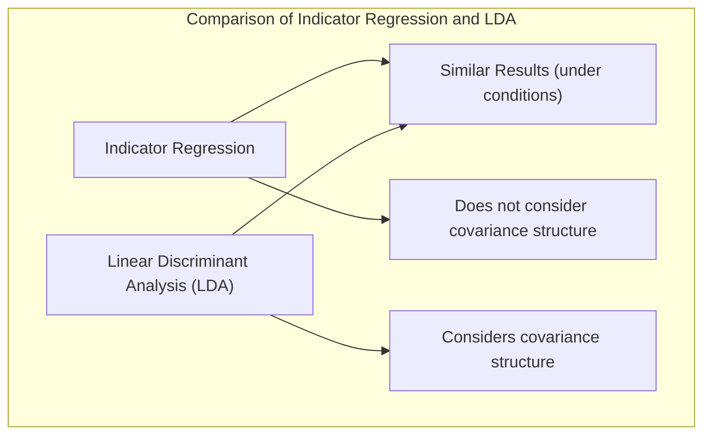
Apesar de sua simplicidade, a regressão de indicadores pode apresentar limitações. Por exemplo, ela não impõe que as probabilidades previstas estejam entre 0 e 1. Além disso, ela não é tão eficiente em lidar com classes desbalanceadas como métodos como a regressão logística [^8.2].

### Métodos de Seleção de Variáveis e Regularização em Classificação

Em problemas de classificação com alta dimensionalidade, a seleção de variáveis e a regularização são essenciais para evitar *overfitting* e melhorar a generalização do modelo [^8.2.2]. Técnicas como a penalização L1 (Lasso) e L2 (Ridge) podem ser aplicadas para controlar a complexidade do modelo e evitar coeficientes excessivamente grandes [^8.2.2].

**Lemma 3:** A penalização L1 em um modelo linear leva a soluções esparsas, ou seja, muitos coeficientes são zerados, enquanto a penalização L2 encolhe os coeficientes em direção a zero, mas não os zera completamente [^8.2.2].
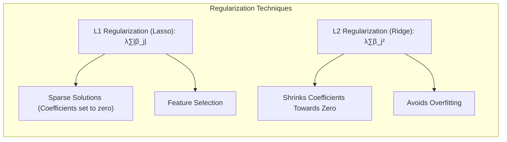
**Prova do Lemma 3:** A penalização L1 adiciona um termo à função de custo que é proporcional à soma dos valores absolutos dos coeficientes, $\lambda \sum_j |\beta_j|$. Esse termo favorece soluções com menos coeficientes não nulos, devido à sua geometria (forma de diamante), que intersecta os eixos em $\beta_j = 0$. A penalização L2, por outro lado, adiciona um termo proporcional à soma dos quadrados dos coeficientes, $\lambda \sum_j \beta_j^2$. Essa penalidade favorece coeficientes menores, mas não os leva a zero, devido à sua forma circular. $\blacksquare$

> 💡 **Exemplo Numérico:** Vamos considerar um modelo de regressão linear com duas variáveis preditoras, $X_1$ e $X_2$. Sem regularização, o modelo seria $y = \beta_0 + \beta_1 X_1 + \beta_2 X_2$. Com regularização L1 (Lasso), o problema de otimização seria:
>
> $$ \min_{\beta} \sum_{i=1}^n (y_i - (\beta_0 + \beta_1 X_{i1} + \beta_2 X_{i2}))^2 + \lambda (|\beta_1| + |\beta_2|) $$
>
> E com regularização L2 (Ridge):
>
> $$ \min_{\beta} \sum_{i=1}^n (y_i - (\beta_0 + \beta_1 X_{i1} + \beta_2 X_{i2}))^2 + \lambda (\beta_1^2 + \beta_2^2) $$
>
>  Suponha que, após ajustar o modelo sem regularização, obtivemos $\beta_1 = 5$ e $\beta_2 = -2$. Com Lasso (L1) e $\lambda = 2$, a penalização pode zerar $\beta_2$, gerando uma solução esparsa com $\beta_1 = 4$ e $\beta_2 = 0$ (o valor exato de $\beta_1$ e $\beta_2$ dependeria do ajuste específico). Já com Ridge (L2), com o mesmo $\lambda = 2$, teríamos $\beta_1 = 3$ e $\beta_2 = -1$ (novamente, os valores reais dependem da otimização), o que encolhe os coeficientes em direção a zero, mas não os zera.

**Corolário 3:** A combinação de L1 e L2, conhecida como Elastic Net, permite obter uma solução com propriedades de ambos, resultando em modelos esparsos com coeficientes controlados [^8.2.2].

> ⚠️ **Ponto Crucial:** A escolha entre L1 e L2 (ou uma combinação) depende do problema específico e do equilíbrio desejado entre *sparsity* e estabilidade do modelo [^8.2.2].

### Separating Hyperplanes e Perceptrons

A ideia de encontrar **hiperplanos separadores** é fundamental em muitos métodos de classificação linear, como o SVM (Support Vector Machines). Um hiperplano separador define uma fronteira de decisão linear que divide os dados em diferentes classes [^8.2]. O objetivo é encontrar um hiperplano que maximize a margem de separação entre as classes, buscando maior robustez e capacidade de generalização do modelo [^8.2].

O **perceptron** de Rosenblatt é um algoritmo simples que busca um hiperplano separador através de um processo iterativo. Ele atualiza os pesos do hiperplano com base nos erros de classificação até que todos os dados sejam classificados corretamente, ou até que um número máximo de iterações seja alcançado [^8.2].
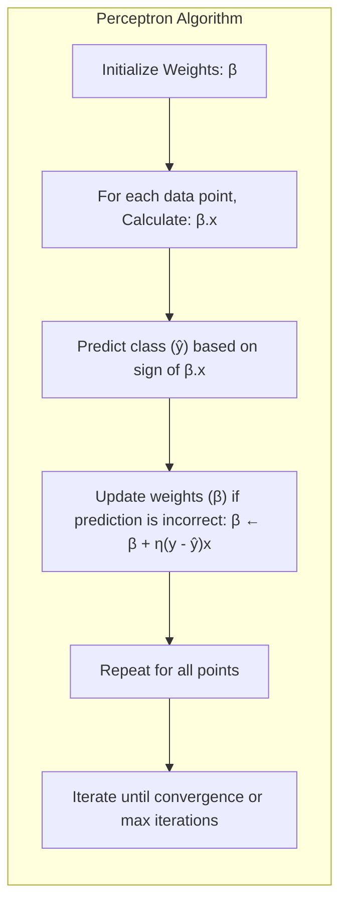
**Pergunta Teórica Avançada:** Em que situações o algoritmo do Perceptron garante convergência e quais são as limitações deste algoritmo?

**Resposta:** O algoritmo do Perceptron garante convergência para um hiperplano separador se os dados forem linearmente separáveis. Isso significa que existe pelo menos um hiperplano que pode separar perfeitamente as diferentes classes. No entanto, o algoritmo pode não convergir se os dados não forem linearmente separáveis, e ele não tem garantia de encontrar o hiperplano de margem máxima mesmo se os dados forem linearmente separáveis [^8.2]. Além disso, o Perceptron pode ser sensível à ordem dos dados e pode apresentar problemas de oscilação em certos cenários.

> 💡 **Exemplo Numérico:** Imagine um problema de classificação binária com duas variáveis preditoras, $X_1$ e $X_2$. O Perceptron busca um hiperplano separador da forma $\beta_0 + \beta_1 X_1 + \beta_2 X_2 = 0$. Inicializamos os pesos, por exemplo, com $\beta_0=0$, $\beta_1 = 0.1$ e $\beta_2= -0.1$.
>
> Suponha que temos um ponto de dados $(X_1=1, X_2=1)$ que pertence à classe positiva (y=1). O produto escalar é $\beta_0 + \beta_1 X_1 + \beta_2 X_2 = 0 + 0.1(1) - 0.1(1) = 0$. Se o ponto estivesse mal classificado, o sinal da soma seria diferente do sinal da classe (positivo). Atualizamos os pesos para $\beta_j \leftarrow \beta_j + \eta(y - \hat{y})X_j$, onde $\eta$ é a taxa de aprendizado, e $\hat{y}$ é a previsão do modelo. Se a taxa de aprendizado é 0.1 e o resultado da predição é -1, então, $\beta_1 = 0.1 + 0.1 * (1 - (-1)) * 1 = 0.3$ e $\beta_2 = -0.1 + 0.1 * (1 - (-1)) * 1 = 0.1$.  O processo se repete até convergir.

### Pergunta Teórica Avançada: Quais as diferenças fundamentais entre a formulação de LDA e a Regra de Decisão Bayesiana considerando distribuições Gaussianas com covariâncias iguais?
**Resposta:**
A Análise Discriminante Linear (LDA) e a regra de decisão Bayesiana compartilham o objetivo de classificar observações em diferentes classes com base em suas características. Sob a suposição de que as características seguem distribuições Gaussianas e que todas as classes compartilham a mesma matriz de covariância, as fronteiras de decisão resultantes de ambos os métodos são lineares [^8.2]. No entanto, a forma como cada método chega a essa conclusão difere sutilmente:
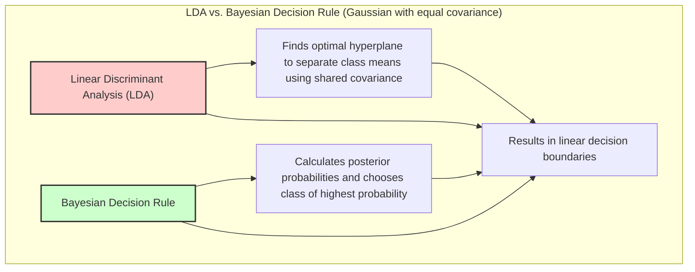
**LDA:** A LDA busca o hiperplano que melhor separa as médias das classes, levando em conta a covariância comum [^8.2]. O hiperplano é obtido através da projeção dos dados em um espaço de menor dimensão maximizando a separação entre as classes. A LDA é baseada na função discriminante linear que é construída diretamente usando as estimativas das médias das classes e da covariância comum [^8.2].

**Regra de Decisão Bayesiana:** A regra de decisão Bayesiana é fundamentada na probabilidade a posteriori, ou seja, calcula a probabilidade de um ponto pertencer a cada classe dado os dados observados [^8.2]. Ela usa a probabilidade a priori (probabilidade inicial da classe) e a função de densidade de cada classe para obter a probabilidade a posteriori e escolhe a classe de maior probabilidade. Quando as distribuições são gaussianas com covariâncias iguais, a regra de decisão Bayesiana também resulta em uma função discriminante linear, que pode ser expressa em termos de médias e covariância [^8.2].

**Lemma 4:** Quando as classes são Gaussianas com covariâncias iguais, a função discriminante da LDA é proporcional à função discriminante obtida usando a regra de decisão Bayesiana.

**Prova do Lemma 4:** Para LDA, a função discriminante é dada por $\delta_k(x) = x^T \Sigma^{-1} \mu_k - \frac{1}{2}\mu_k^T\Sigma^{-1}\mu_k$. Para o classificador bayesiano, a probabilidade *a posteriori* é $p(G=k|X=x) \propto \pi_k \phi(x;\mu_k,\Sigma)$, onde $\phi$ é a densidade gaussiana com media $\mu_k$ e covariância $\Sigma$. Tomando o logaritmo, podemos expressar a função discriminante bayesiana como $\delta_k(x) = \log(\pi_k) - \frac{1}{2}(x-\mu_k)^T \Sigma^{-1}(x-\mu_k) + C$. Após simplificação e  com a hipótese de covariâncias iguais, observamos que ambas funções são lineares e proporcionais. $\blacksquare$
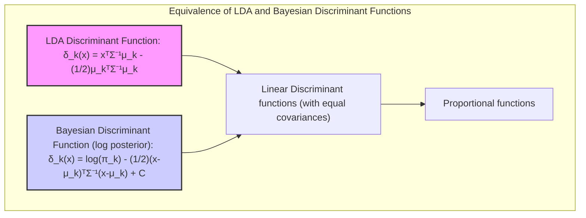
> 💡 **Exemplo Numérico:** Vamos considerar um problema com duas classes, onde os dados da classe 1 seguem uma distribuição Gaussiana com média $\mu_1 = [1, 1]$ e os dados da classe 2 seguem uma Gaussiana com média $\mu_2 = [2, 2]$. Assume-se que a matriz de covariância é a mesma para ambas as classes, $\Sigma = \begin{bmatrix} 1 & 0 \\ 0 & 1 \end{bmatrix}$. Se assumirmos probabilidades a priori iguais, a função discriminante da LDA seria $\delta_k(x) = x^T \Sigma^{-1} \mu_k - \frac{1}{2}\mu_k^T\Sigma^{-1}\mu_k$.  Para um ponto genérico $x = [x_1, x_2]$, teríamos:
>
> $\delta_1(x) = [x_1, x_2] \begin{bmatrix} 1 & 0 \\ 0 & 1 \end{bmatrix} \begin{bmatrix} 1 \\ 1 \end{bmatrix} - \frac{1}{2} \begin{bmatrix} 1 & 1 \end{bmatrix} \begin{bmatrix} 1 & 0 \\ 0 & 1 \end{bmatrix} \begin{bmatrix} 1 \\ 1 \end{bmatrix} = x_1 + x_2 - 1$
>
> $\delta_2(x) = [x_1, x_2] \begin{bmatrix} 1 & 0 \\ 0 & 1 \end{bmatrix} \begin{bmatrix} 2 \\ 2 \end{bmatrix} - \frac{1}{2} \begin{bmatrix} 2 & 2 \end{bmatrix} \begin{bmatrix} 1 & 0 \\ 0 & 1 \end{bmatrix} \begin{bmatrix} 2 \\ 2 \end{bmatrix} = 2x_1 + 2x_2 - 4$
>
> A fronteira de decisão seria $\delta_1(x) = \delta_2(x)$, ou seja, $x_1 + x_2 - 1 = 2x_1 + 2x_2 - 4$ que simplifica para $x_1 + x_2 = 3$. O classificador bayesiano levaria, após simplificação, a uma mesma fronteira de decisão, confirmando o Lemma 4.

**Corolário 4:** Ao relaxar a hipótese de covariâncias iguais, as fronteiras de decisão deixam de ser lineares e se tornam quadráticas, levando a métodos como a Análise Discriminante Quadrática (QDA) [^8.2].

> ⚠️ **Ponto Crucial:**  A suposição de covariâncias iguais simplifica a formulação de ambos os métodos, resultando em limites de decisão lineares, mas pode ser uma restrição forte, especialmente se as classes tiverem dispersões muito diferentes [^8.2].

As perguntas devem ser altamente relevantes, **avaliar a compreensão profunda de conceitos teóricos-chave**, podem envolver derivações matemáticas e provas, e focar em análises teóricas.

### Conclusão

Este capítulo abordou a relação entre o bootstrap paramétrico e o método de maximum likelihood, além de explorar outros métodos de classificação e model averaging. Através de conceitos fundamentais e análises detalhadas, fornecemos um guia para a compreensão avançada dessas técnicas. O bootstrap paramétrico, ao simular dados com base em modelos paramétricos, fornece uma abordagem poderosa para inferência estatística em diversos cenários. A regressão de indicadores, a seleção de variáveis com regularização, os hiperplanos separadores, o método de maximum likelihood, e a conexão com a regra de decisão bayesiana são ferramentas importantes no arsenal de um profissional de estatística e aprendizado de máquina.

### Footnotes
[^8