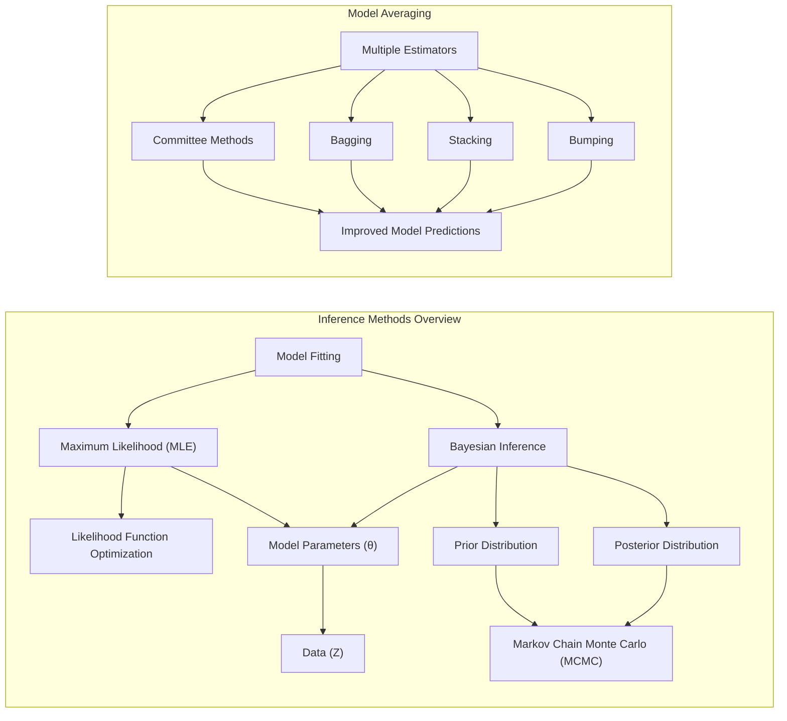
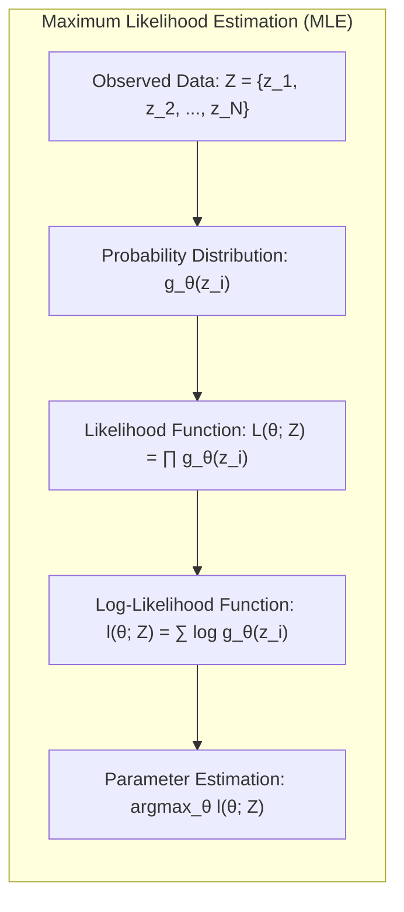
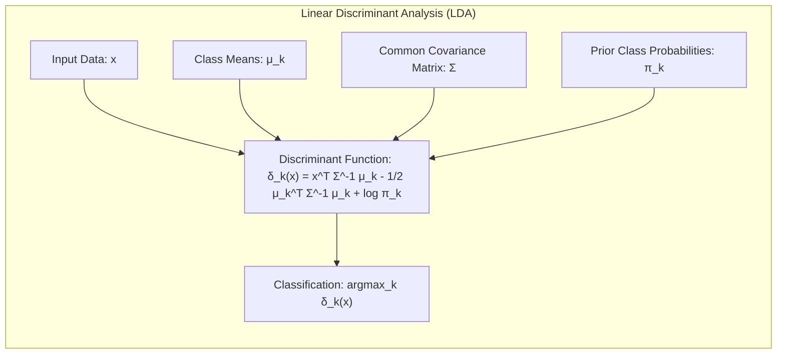
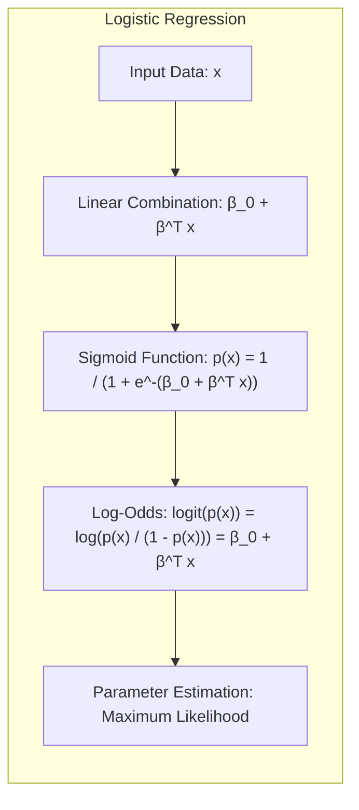
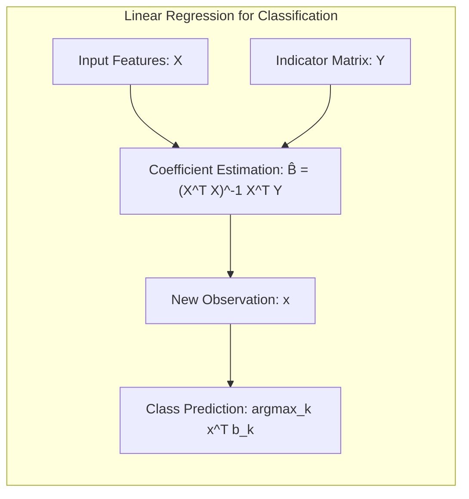
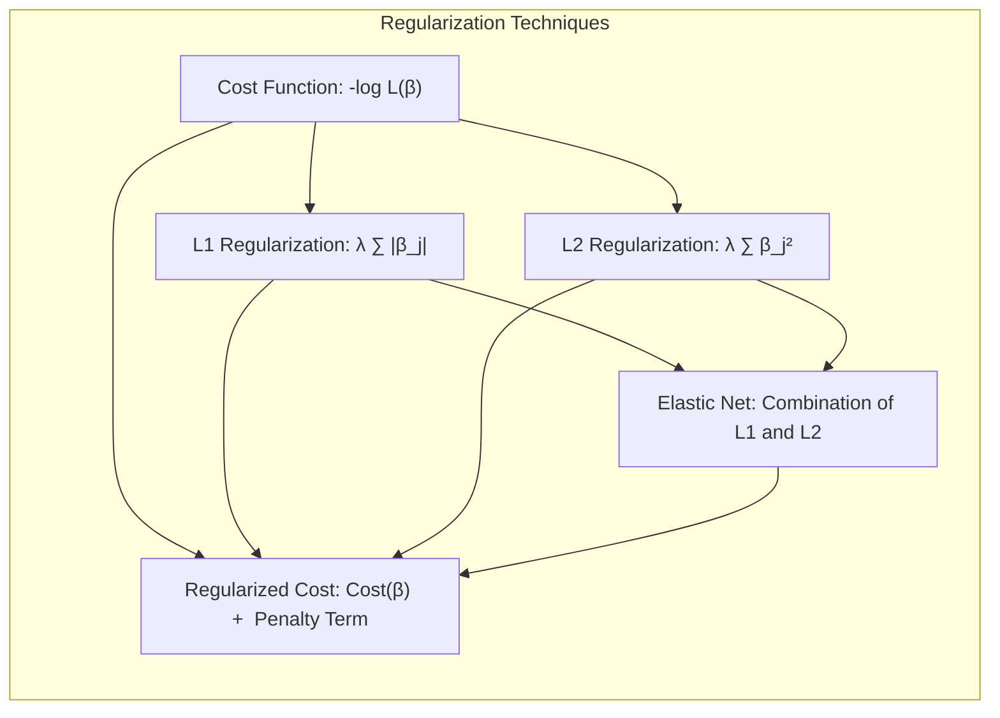
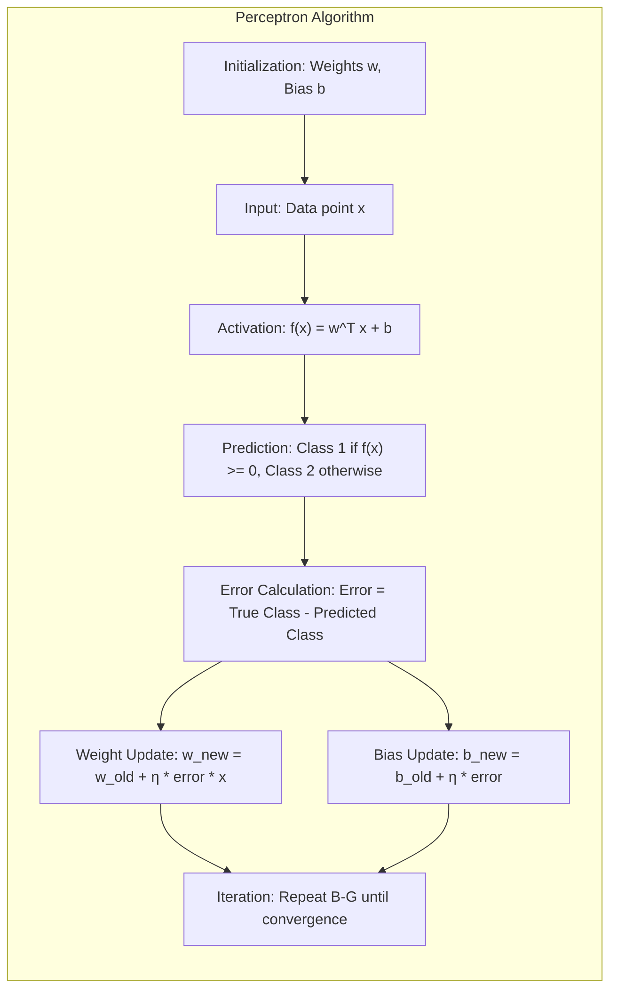

## Model Inference and Averaging: A Deep Dive into Likelihood, Bootstrap, and Bayesian Methods

### Introdução

Este capítulo explora as nuances da **inferência estatística e modelagem**, aprofundando-se em métodos que vão além da simples minimização de erros. Tradicionalmente, o ajuste de modelos é alcançado pela minimização da soma dos quadrados para problemas de regressão ou pela minimização da cross-entropy para problemas de classificação [^8.1]. No entanto, ambos representam casos particulares da abordagem de **máxima verossimilhança**. Aqui, examinaremos em detalhes essa abordagem, assim como o método Bayesiano para inferência, com foco na sua aplicação e conexão com o **bootstrap**. Além disso, exploraremos técnicas para aprimorar modelos através da combinação de múltiplos estimadores via *model averaging*, incluindo métodos como *committee methods*, *bagging*, *stacking* e *bumping* [^8.1].

### Conceitos Fundamentais

**Conceito 1: Máxima Verossimilhança (Maximum Likelihood)**

A abordagem de **máxima verossimilhança** (MLE) consiste em encontrar os valores dos parâmetros de um modelo que maximizam a probabilidade dos dados observados, sob a suposição de que os dados foram gerados a partir desse modelo [^8.1]. Formalmente, dado um conjunto de dados *Z*, o objetivo é encontrar o valor de *θ* que maximiza a função de verossimilhança *L(θ;Z)*, que representa a probabilidade dos dados observados, dado o valor do parâmetro *θ*. Em geral, essa probabilidade é expressa como o produto das probabilidades de cada observação, assumindo que elas são independentes e identicamente distribuídas (i.i.d.) [^8.2.2].

$$ L(\theta; Z) = \prod_{i=1}^{N} g_{\theta}(z_i) $$

onde *gθ(zi)* é a função de densidade ou massa de probabilidade que descreve a distribuição de cada observação *zi*, parametrizada por *θ*. A MLE frequentemente usa o log da verossimilhança, *l(θ;Z)*, para facilitar a otimização, que transforma o produto em uma soma [^8.2.2].

$$ l(\theta; Z) = \sum_{i=1}^{N} \log g_{\theta}(z_i) $$

> 💡 **Exemplo Numérico:** Suponha que temos um conjunto de dados com 3 observações *Z = {2, 3, 4}* que assumimos vir de uma distribuição normal com média *μ* (o parâmetro *θ* neste caso) e desvio padrão *σ* = 1. A função de densidade normal é:
>
> $$ g_\mu(z_i) = \frac{1}{\sqrt{2\pi}} e^{-\frac{(z_i - \mu)^2}{2}} $$
>
>A função de verossimilhança é:
>
> $$ L(\mu; Z) = \prod_{i=1}^{3} \frac{1}{\sqrt{2\pi}} e^{-\frac{(z_i - \mu)^2}{2}} $$
>
> O log da verossimilhança é:
>
> $$ l(\mu; Z) = \sum_{i=1}^{3} \log \left( \frac{1}{\sqrt{2\pi}} e^{-\frac{(z_i - \mu)^2}{2}} \right) = - \frac{3}{2} \log(2\pi) - \frac{1}{2}\sum_{i=1}^{3} (z_i - \mu)^2$$
>
> Para encontrar o valor de *μ* que maximiza *l(μ; Z)*, podemos derivar a função em relação a *μ* e igualar a zero:
>
> $$ \frac{dl}{d\mu} = \sum_{i=1}^{3} (z_i - \mu) = 0 $$
>
> $$ \mu = \frac{1}{3} \sum_{i=1}^{3} z_i = \frac{2 + 3 + 4}{3} = 3 $$
>
> Portanto, o estimador de máxima verossimilhança para a média *μ* é 3, que é a média amostral.

**Lemma 1:** Sob a suposição de que o modelo é correto e que os dados são i.i.d., o estimador de máxima verossimilhança é assintoticamente eficiente. Isso significa que, à medida que o tamanho da amostra aumenta, o estimador de máxima verossimilhança converge para o valor verdadeiro do parâmetro e sua variância atinge o limite inferior de Cramér-Rao, tornando-o um estimador ótimo entre todos os estimadores não viesados [^8.2.2].

**Prova do Lemma 1:** (Uma prova formal e detalhada envolve conceitos de teoria assintótica que estão fora do escopo do contexto atual. No entanto, podemos afirmar que o estimador de máxima verossimilhança alcança a eficiência assintótica, ou seja, sua variância converge para o limite mínimo possível dado pelo inverso da informação de Fisher, que quantifica a quantidade de informação sobre o parâmetro que o modelo contém.) $\blacksquare$

**Conceito 2: Linear Discriminant Analysis (LDA)**

A Análise Discriminante Linear (LDA) é uma técnica para classificar dados em classes predefinidas, encontrando combinações lineares das variáveis que melhor separam as classes. A LDA assume que cada classe segue uma distribuição normal com a mesma matriz de covariância, mas com médias diferentes [^4.3]. A função discriminante linear obtida é usada para alocar novas observações a uma das classes [^4.3.1].
A função discriminante para uma observação *x* é dada por:

$$ \delta_k(x) = x^T \Sigma^{-1} \mu_k - \frac{1}{2} \mu_k^T \Sigma^{-1} \mu_k + \log \pi_k$$

onde:
*   *x* é o vetor de variáveis preditoras.
*   *Σ* é a matriz de covariância comum para todas as classes.
*   *μk* é o vetor de médias para a classe *k*.
*   *πk* é a probabilidade a priori da classe *k*.

The class predicted for *x* is the one with the highest value of *δk(x)*.
A construção da fronteira de decisão na LDA depende da estimativa das médias de cada classe e da matriz de covariância compartilhada [^4.3.2].

> ⚠️ **Nota Importante**: A suposição de covariância igual entre as classes é crucial para a linearidade das fronteiras de decisão na LDA. **Referência ao tópico [^4.3.1]**.

> 💡 **Exemplo Numérico:** Considere um problema de classificação binária com duas classes, onde temos duas variáveis preditoras, *x1* e *x2*. Suponha que, após análise dos dados, estimamos:
>
> - Média da classe 1 (μ1):  [2, 2]
> - Média da classe 2 (μ2):  [4, 4]
> - Matriz de covariância comum (Σ): [[1, 0.5], [0.5, 1]]
> - Probabilidades a priori: π1 = 0.6, π2 = 0.4
>
> Vamos classificar uma nova observação *x* = [3, 3]. Primeiro, calculamos a inversa da matriz de covariância (Σ-1):
>
>  Σ-1 = [[1.33, -0.66], [-0.66, 1.33]]
>
> Agora, vamos calcular as funções discriminantes δ1(x) e δ2(x):
>
> $$
\begin{aligned}
\delta_1(x) &= x^T \Sigma^{-1} \mu_1 - \frac{1}{2} \mu_1^T \Sigma^{-1} \mu_1 + \log \pi_1 \\
&= [3, 3] \cdot \begin{bmatrix} 1.33 & -0.66 \\ -0.66 & 1.33 \end{bmatrix} \cdot \begin{bmatrix} 2 \\ 2 \end{bmatrix} - \frac{1}{2} [2, 2] \cdot \begin{bmatrix} 1.33 & -0.66 \\ -0.66 & 1.33 \end{bmatrix} \cdot \begin{bmatrix} 2 \\ 2 \end{bmatrix} + \log(0.6) \\
&= [3, 3] \cdot [1.33 \cdot 2 + (-0.66) \cdot 2, -0.66 \cdot 2 + 1.33 \cdot 2] - \frac{1}{2} [2, 2] \cdot [1.33 \cdot 2 + (-0.66) \cdot 2, -0.66 \cdot 2 + 1.33 \cdot 2] + \log(0.6)\\
&= [3, 3] \cdot [1.34, 1.34] - \frac{1}{2} [2, 2] \cdot [1.34, 1.34] + \log(0.6)\\
&= 3 \cdot 1.34 + 3 \cdot 1.34 - \frac{1}{2} (2 \cdot 1.34 + 2 \cdot 1.34) + \log(0.6) \\
&= 8.04 - 2.68 -0.51 \\
&= 4.85
\end{aligned}
$$
$$
\begin{aligned}
\delta_2(x) &= x^T \Sigma^{-1} \mu_2 - \frac{1}{2} \mu_2^T \Sigma^{-1} \mu_2 + \log \pi_2 \\
&= [3, 3] \cdot \begin{bmatrix} 1.33 & -0.66 \\ -0.66 & 1.33 \end{bmatrix} \cdot \begin{bmatrix} 4 \\ 4 \end{bmatrix} - \frac{1}{2} [4, 4] \cdot \begin{bmatrix} 1.33 & -0.66 \\ -0.66 & 1.33 \end{bmatrix} \cdot \begin{bmatrix} 4 \\ 4 \end{bmatrix} + \log(0.4) \\
&= [3, 3] \cdot [5.32, 5.32] - \frac{1}{2} [4, 4] \cdot [5.32, 5.32] + \log(0.4)\\
&= 15.96 + 15.96 - \frac{1}{2} (21.28+21.28) + \log(0.4)\\
&= 31.92 - 21.28 - 0.91 \\
&= 9.73
\end{aligned}
$$

> Como δ2(x) > δ1(x), a observação *x* = [3, 3] seria classificada como pertencente à classe 2.

**Corolário 1:** Ao projetar os dados em um subespaço linear, a LDA maximiza a separabilidade entre classes, ou seja, a razão entre a variância entre classes e a variância dentro das classes [^4.3]. Essa propriedade garante que as direções de projeção resultantes são as que melhor discriminam as classes, facilitando a classificação.

**Conceito 3: Regressão Logística (Logistic Regression)**

A Regressão Logística é um modelo estatístico para classificação binária que modela a probabilidade de um evento ocorrer através de uma função sigmoide (logit) da combinação linear das variáveis preditoras [^4.4]. A Regressão Logística, ao contrário da regressão linear, não gera diretamente valores numéricos, mas sim probabilidades que variam entre 0 e 1. A função logística, que transforma a combinação linear das variáveis preditoras em uma probabilidade, é dada por:

$$ p(x) = \frac{1}{1 + e^{-(\beta_0 + \beta^T x)}} $$

onde:
*  *p(x)* é a probabilidade de *y=1* dado *x*.
*  *x* é o vetor de variáveis preditoras.
*  *β0* é o intercepto.
*  *β* é o vetor de coeficientes.

A função logit, que é o log-odds, transforma a probabilidade em uma escala linear, facilitando a modelagem:

$$ \text{logit}(p(x)) = \log\left(\frac{p(x)}{1-p(x)}\right) = \beta_0 + \beta^T x $$
Os parâmetros *β0* e *β* são estimados via máxima verossimilhança, maximizando a função de verossimilhança dos dados observados [^4.4.3].

> ❗ **Ponto de Atenção**: Em casos de classes não balanceadas, a regressão logística pode sofrer de overfitting da classe majoritária, e a acurácia pode ser uma métrica enganosa. **Conforme indicado em [^4.4.2]**.

> 💡 **Exemplo Numérico:** Suponha que, após ajustar um modelo de regressão logística a um conjunto de dados, obtemos os seguintes coeficientes: β0 = -2.0 e β = [1.5, -0.8] para duas variáveis preditoras *x1* e *x2*, respectivamente. Para uma nova observação com *x* = [1, 2], a probabilidade de *y=1* seria:
>
> $$ p(x) = \frac{1}{1 + e^{-(-2.0 + 1.5 \cdot 1 + (-0.8) \cdot 2)}} $$
> $$ p(x) = \frac{1}{1 + e^{-(-2.0 + 1.5 -1.6)}} $$
> $$ p(x) = \frac{1}{1 + e^{2.1}} \approx \frac{1}{1 + 8.166} \approx 0.109$$
>
> Assim, a probabilidade estimada da observação pertencer à classe 1 é de aproximadamente 0.109 ou 10.9%.

A Regressão Logística não faz suposições sobre a distribuição das variáveis preditoras, o que é uma vantagem em relação à LDA. Em vez disso, ela assume que os dados são uma amostra aleatória da população e usa uma função sigmoide para modelar a probabilidade de pertença à classe [^4.4.1].
> ✔️ **Destaque**: Há uma forte correlação entre as estimativas dos parâmetros em LDA e na regressão logística, especialmente em casos onde a suposição de normalidade da LDA é válida e onde os dados podem ser separados linearmente. **Baseado no tópico [^4.5]**.

### Regressão Linear e Mínimos Quadrados para Classificação

A regressão linear pode ser aplicada para problemas de classificação através da utilização de uma matriz indicadora. Para um problema de classificação com *K* classes, é criada uma matriz indicadora *Y* de dimensão *N x K*, onde *N* é o número de observações, e cada linha de *Y* tem um '1' na coluna correspondente à classe da observação, e '0' nas demais [^4.2]. Ao aplicar uma regressão linear para prever esta matriz indicadora, busca-se um conjunto de coeficientes *B* que minimizem a soma dos quadrados dos erros entre os valores previstos e os valores observados da matriz indicadora [^4.2]:

$$ \hat{B} = (X^TX)^{-1}X^TY $$

onde *X* é a matriz de variáveis preditoras (design matrix). Cada coluna de *B* representa um vetor de coeficientes associado a uma classe específica. Após obter os coeficientes, uma nova observação *x* é classificada para a classe *k* que possui o maior valor de *xTbk*, onde *bk* é o vetor de coeficientes da classe *k*.

> 💡 **Exemplo Numérico:** Considere um problema de classificação com 3 classes e 2 variáveis preditoras. Temos 5 observações e a seguinte matriz de variáveis preditoras *X* e matriz indicadora *Y*:
>
> $$ X = \begin{bmatrix} 1 & 2 \\ 2 & 1 \\ 3 & 3 \\ 4 & 1 \\ 5 & 2 \end{bmatrix}  \quad Y = \begin{bmatrix} 1 & 0 & 0 \\ 0 & 1 & 0 \\ 0 & 0 & 1 \\ 1 & 0 & 0 \\ 0 & 1 & 0 \end{bmatrix} $$
>
> Adicionamos uma coluna de 1s para o intercepto:
>
> $$ X = \begin{bmatrix} 1 & 1 & 2 \\ 1 & 2 & 1 \\ 1 & 3 & 3 \\ 1 & 4 & 1 \\ 1 & 5 & 2 \end{bmatrix} $$
>
> $\text{Step 1: } X^TX$
>
> $$ X^TX = \begin{bmatrix} 5 & 15 & 9 \\ 15 & 55 & 35 \\ 9 & 35 & 19 \end{bmatrix} $$
>
> $\text{Step 2: } (X^TX)^{-1}$
>
> $$ (X^TX)^{-1} \approx \begin{bmatrix} 1.83 & -0.45 & -0.67 \\ -0.45 & 0.14 & 0.11 \\ -0.67 & 0.11 & 0.26 \end{bmatrix} $$
>
> $\text{Step 3: } X^TY$
>
> $$ X^TY = \begin{bmatrix} 2 & 2 & 1 \\ 9 & 7 & 9 \\ 5 & 14 & 11 \end{bmatrix} $$
>
> $\text{Step 4: } \hat{B} = (X^TX)^{-1}X^TY$
>
> $$ \hat{B} = \begin{bmatrix} 1.83 & -0.45 & -0.67 \\ -0.45 & 0.14 & 0.11 \\ -0.67 & 0.11 & 0.26 \end{bmatrix} \begin{bmatrix} 2 & 2 & 1 \\ 9 & 7 & 9 \\ 5 & 14 & 11 \end{bmatrix} $$
>
> $$ \hat{B} \approx \begin{bmatrix} -1.85 & -2.95 & -1.52 \\  0.62 & 0.41 & 0.46 \\ 0.24 & 0.97 & 0.36 \end{bmatrix} $$
>
>  Para classificar uma nova observação *x* = [3, 2], adicionamos o intercepto *x* = [1, 3, 2] e calculamos os valores de *xTbk*:
>
>  *xTb1* = 1 * -1.85 + 3 * 0.62 + 2 * 0.24 = 0.49
>  *xTb2* = 1 * -2.95 + 3 * 0.41 + 2 * 0.97 = -0.18
>  *xTb3* = 1 * -1.52 + 3 * 0.46 + 2 * 0.36 = 0.62
>
>  A observação *x* seria classificada como pertencente à classe 3, pois  *xTb3* é o maior valor.

**Lemma 2:** Em certas condições, a regressão linear de uma matriz indicadora com mínimos quadrados gera resultados equivalentes aos de uma função discriminante linear, resultando em hiperplanos de decisão similares, especialmente quando as classes são bem separadas. Ou seja, as projeções dos dados para determinar a classe com maior valor *xTbk*  são matematicamente equivalentes, sob certas suposições, às decisões obtidas por LDA [^4.2].

**Prova do Lemma 2:** (A prova formal envolveria a derivação da condição para que os hiperplanos de decisão gerados pela regressão linear se alinhem com os gerados por discriminantes lineares, que depende da relação entre as covariâncias dentro das classes e a covariância total dos dados. Em resumo, se as covariâncias das classes forem semelhantes ou iguais, a regressão de indicadores tende a gerar limites de decisão que se aproximam dos limites de LDA.) $\blacksquare$

**Corolário 2:** Esta equivalência entre regressão linear e discriminantes lineares sob certas condições simplifica a análise de modelos de classificação, especialmente quando se busca apenas a fronteira de decisão linear. Essa observação é crucial para entender a relação entre diferentes métodos lineares de classificação [^4.3].

Embora a regressão linear possa ser aplicada para classificação, ela possui algumas limitações. Por exemplo, a predição para a matriz indicadora pode gerar valores fora do intervalo [0,1], que não são diretamente interpretáveis como probabilidades. Além disso, ela não leva em consideração a estrutura de probabilidade das classes como a regressão logística ou a LDA [^4.4].
“Em alguns cenários, conforme apontado em [^4.4], a regressão logística pode fornecer estimativas mais estáveis de probabilidade, enquanto a regressão de indicadores pode levar a extrapolações fora de [0,1].”
“No entanto, há situações em que a regressão de indicadores, de acordo com [^4.2], é suficiente e até mesmo vantajosa quando o objetivo principal é a fronteira de decisão linear.”

### Métodos de Seleção de Variáveis e Regularização em Classificação

A seleção de variáveis e a regularização são técnicas importantes para melhorar o desempenho de modelos de classificação, especialmente quando há um grande número de variáveis preditoras ou quando se deseja obter modelos mais simples e interpretáveis [^4.5]. A regularização adiciona um termo de penalização à função de custo, que evita que os coeficientes do modelo assumam valores muito grandes, ajudando a reduzir o overfitting. As penalizações mais comuns são L1 (Lasso) e L2 (Ridge) [^4.4.4].

A penalização L1 adiciona a soma dos valores absolutos dos coeficientes à função de custo:

$$ \text{Custo}(\beta) = -\log L(\beta) + \lambda \sum_{j=1}^{p} |\beta_j| $$

onde *λ* é o parâmetro de regularização que controla a força da penalização, e *p* é o número de variáveis preditoras. A penalização L1 tem a propriedade de realizar seleção de variáveis, ou seja, ela tende a zerar alguns dos coeficientes, resultando em um modelo mais esparso e interpretável [^4.4.4].

A penalização L2 adiciona a soma dos quadrados dos coeficientes à função de custo:

$$ \text{Custo}(\beta) = -\log L(\beta) + \lambda \sum_{j=1}^{p} \beta_j^2 $$

A penalização L2 reduz os valores dos coeficientes, mas não os zera, diminuindo o impacto das variáveis menos relevantes e controlando a variância do modelo, o que leva a uma melhor generalização [^4.4.4].

> 💡 **Exemplo Numérico:** Suponha que estamos treinando um modelo de regressão logística com duas variáveis preditoras *x1* e *x2* e que o custo inicial sem regularização foi de 0.8. Após aplicar a regularização L1 e L2 temos:
>
>  **Regularização L1:**
>  *  *λ* = 0.1
>  *  *β1* = 0.5
>  *  *β2* = -0.2
>  * Custo = 0.8 + 0.1 * (|0.5| + |-0.2|) = 0.8 + 0.1 * 0.7 = 0.87
>
>  **Regularização L2:**
>  *  *λ* = 0.1
>  *  *β1* = 0.5
>  *  *β2* = -0.2
>  * Custo = 0.8 + 0.1 * (0.52 + (-0.2)2) = 0.8 + 0.1 * 0.29 = 0.829
>
> Observe que a regularização L1 adiciona um custo maior, incentivando a esparsidade dos coeficientes. Se aumentarmos *λ*, a influência da regularização aumenta, tornando alguns coeficientes iguais a zero.

**Lemma 3:** A penalização L1 na regressão logística leva a coeficientes esparsos porque a forma da penalidade favorece soluções em que alguns coeficientes são exatamente iguais a zero [^4.4.4]. Isso ocorre devido à não-diferenciabilidade da penalidade L1 na origem, o que faz com que o processo de otimização empurre alguns coeficientes para zero durante a busca pelo mínimo da função de custo [^4.4.3].

**Prova do Lemma 3:** (A prova formal envolveria a análise das condições de otimalidade para o problema de otimização com penalidade L1, mostrando que as condições de Karush-Kuhn-Tucker (KKT) resultam em coeficientes nulos para as variáveis menos relevantes quando o parâmetro *λ* é suficientemente grande. A demonstração completa requer cálculos de otimização que estão além do escopo da discussão atual.) $\blacksquare$

**Corolário 3:** A esparsidade dos coeficientes obtida pela penalização L1 facilita a identificação das variáveis mais relevantes para a classificação, melhorando a interpretabilidade do modelo e reduzindo o problema da "maldição da dimensionalidade". Isso é particularmente útil em cenários com um grande número de variáveis, onde apenas algumas contribuem significativamente para a resposta [^4.4.5].

A combinação das penalidades L1 e L2 é conhecida como Elastic Net e busca combinar as vantagens de ambas, resultando em um modelo esparso e com baixa variância [^4.5].

> ⚠️ **Ponto Crucial**: L1 e L2 podem ser combinadas (Elastic Net) para aproveitar vantagens de ambos os tipos de regularização, **conforme discutido em [^4.5]**.

### Separating Hyperplanes e Perceptrons

Um hiperplano separador é uma superfície linear que divide o espaço de variáveis em duas regiões distintas, correspondendo às classes de um problema de classificação binária [^4.5.2]. O objetivo é encontrar o hiperplano que melhor separa os dados, o que pode ser formulado como um problema de otimização. O conceito de maximizar a margem de separação entre as classes leva ao conceito de hiperplanos ótimos, que são os que possuem a maior distância entre as amostras de cada classe.

A formulação matemática do problema de encontrar o hiperplano ótimo envolve a minimização da norma dos pesos do hiperplano, sujeita a restrições que garantem a classificação correta dos dados. Este problema é frequentemente resolvido através do uso do *dual de Wolfe*, que simplifica a otimização, especialmente quando o número de amostras é muito grande. A solução é expressa como uma combinação linear dos chamados pontos de suporte [^4.5.2].

O *Perceptron de Rosenblatt* é um algoritmo para encontrar um hiperplano separador que se baseia em um processo iterativo. O Perceptron ajusta os pesos do hiperplano a cada iteração, de forma a reduzir o erro de classificação. Se as classes são linearmente separáveis, o Perceptron garante a convergência para um hiperplano que separa os dados. No entanto, se as classes não são linearmente separáveis, o Perceptron pode não convergir [^4.5.1].

> 💡 **Exemplo Numérico:** Suponha que temos um problema de classificação binária com duas variáveis preditoras *x1* e *x2*. Inicializamos os pesos do Perceptron com *w* = [0.1, -0.2] e *b* = 0.05. Temos os seguintes dados de treinamento:
>
> - Classe 1: (1, 1)
> - Classe 2: (2, 3)
>
>  A função de ativação do Perceptron é:
>
>  *f(x)* = *w*T*x* + *b*
>
>  Para a observação (1, 1):
>
>  *f*(1,1) = 0.1*1 + (-0.2)*1 + 0.05 = -0.05. A classe prevista é 2 (pois é < 0). A classe real é 1, então o erro é +1
>
>  Atualizamos os pesos:
>
>  *w*novo = *w*velho + *η* *erro* *x* = [0.1, -0.2] + 0.1 * 1 * [1, 1] = [0.2, -0.1]
>  *b*novo = *b*velho + *η* *erro* = 0.05 + 0.1 * 1 = 0.15
>
>  Onde *η* (taxa de aprendizagem) é 0.1.
>
>  Para a observação (2, 3):
>
>  *f*(2,3) = 0.2*2 + (-0.1)*3 + 0.15 = 0.25. A classe prevista é 1. A classe real é 2, então o erro é -1
>
>  Atualizamos os pesos:
>
> *w*novo = *w*velho + *η* *erro* *x* = [0.2, -0.1] + 0.1 * -1 * [2, 3] = [0, -0.4]
>  *