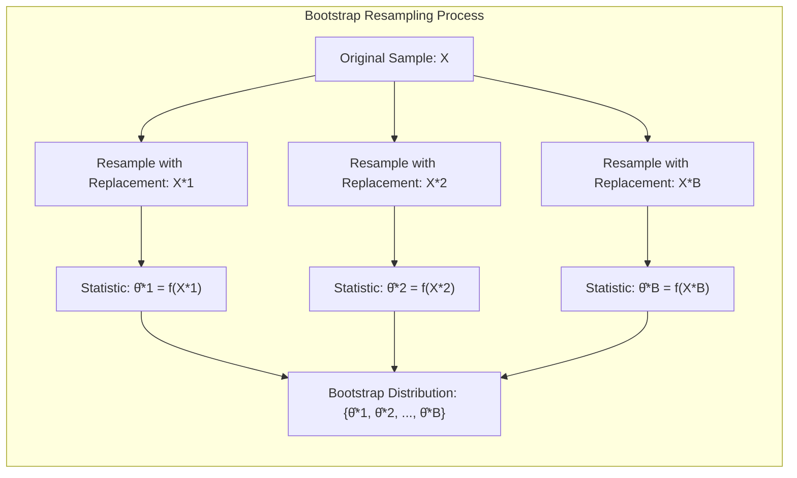
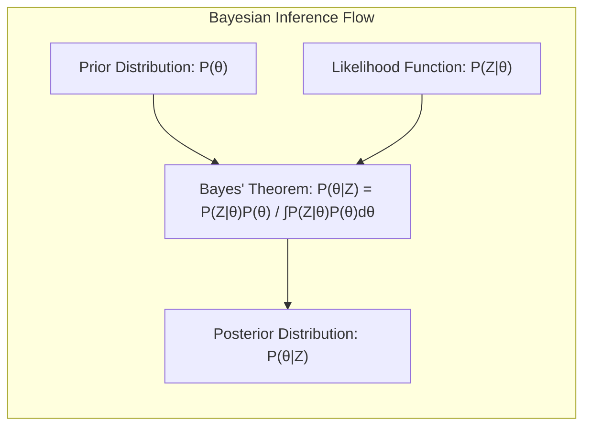
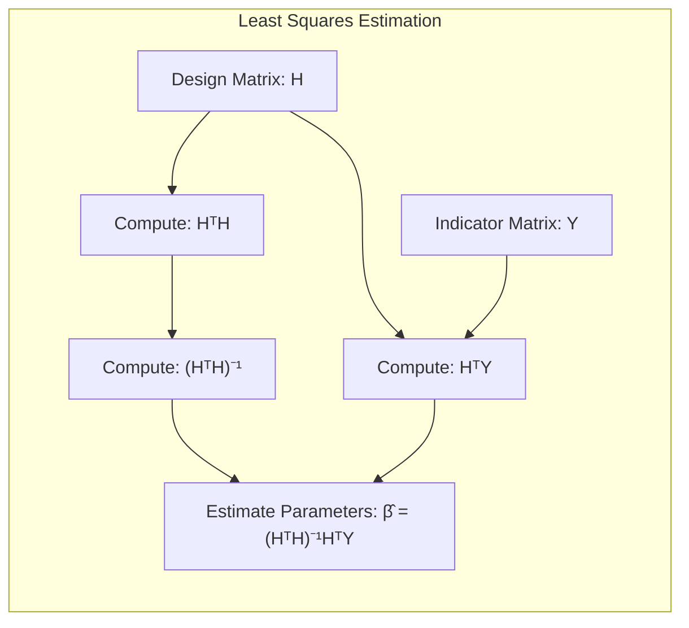
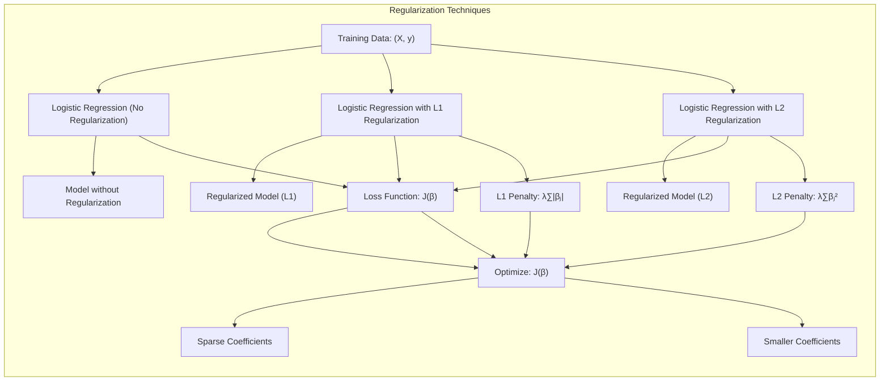

## Nonparametric Bootstrap and Bayes Correspondence

<imagem: Mapa mental abrangente conectando os métodos de inferência: Maximum Likelihood, Bootstrap (Paramétrico e Não Paramétrico), e Bayes. As setas devem mostrar as relações de equivalência e aproximação sob certas condições, destacando as diferenças no tratamento da incerteza e a incorporação de priors.>

### Introdução
Este capítulo explora a conexão profunda entre o **nonparametric bootstrap** e a inferência Bayesiana, dois métodos poderosos para quantificar a incerteza em estimativas de modelos [^8.1]. Enquanto o bootstrap, uma técnica de reamostragem computacional, avalia a variabilidade através da geração de amostras replicadas dos dados observados [^8.2.1], a inferência Bayesiana incorpora conhecimento *a priori* através de distribuições probabilísticas, atualizando essas crenças com a observação dos dados [^8.3]. Vamos detalhar a equivalência assintótica entre o bootstrap não paramétrico e o método Bayesiano com *prior* não informativa, fornecendo um entendimento abrangente e profundo sobre a base teórica e as nuances práticas de cada um.

### Conceitos Fundamentais
Para construir uma base sólida, é essencial explorar os conceitos fundamentais que sustentam o *nonparametric bootstrap* e a inferência Bayesiana.

**Conceito 1: Bootstrap Não Paramétrico** O bootstrap não paramétrico, introduzido em [^8.2.1], é um método de reamostragem que avalia a incerteza da estimativa, simulando amostras a partir dos dados de treinamento observados, em vez de assumir uma distribuição teórica dos dados. Ele permite que a variabilidade dos estimadores seja aproximada sem assumir uma forma paramétrica para a distribuição subjacente dos dados [^8.2.1]. Em essência, a reamostragem com reposição da amostra original, gera réplicas que replicam a distribuição empírica dos dados, e a partir dessas réplicas, a distribuição da estatística de interesse é estimada. O bootstrap se torna uma ferramenta útil para avaliar a incerteza em situações onde a teoria assintótica não pode ser aplicada, ou quando as distribuições amostrais exatas são desconhecidas. Por exemplo, na regressão não linear, o bootstrap pode simular a incerteza associada aos parâmetros do modelo [^8.2.1].

> 💡 **Exemplo Numérico:** Considere um conjunto de dados com 10 observações de uma variável $X = [2, 4, 5, 8, 9, 12, 14, 16, 18, 20]$. Queremos estimar a média da população ($\mu$) e sua incerteza.
>
> 1. **Amostra Original:** $X = [2, 4, 5, 8, 9, 12, 14, 16, 18, 20]$; Média da amostra $\hat{\mu} = 10.8$
> 2. **Reamostragem Bootstrap:**  Geramos, por exemplo, 5 amostras bootstrap ($B=5$) retirando com reposição da amostra original:
>    - $X^{*1} = [4, 8, 14, 2, 18, 9, 20, 5, 12, 14]$; $\hat{\mu}^{*1} = 10.6$
>    - $X^{*2} = [16, 5, 2, 20, 8, 12, 9, 14, 5, 18]$; $\hat{\mu}^{*2} = 10.9$
>    - $X^{*3} = [2, 14, 12, 4, 16, 8, 5, 18, 9, 20]$; $\hat{\mu}^{*3} = 10.8$
>    - $X^{*4} = [8, 9, 16, 20, 4, 12, 14, 18, 2, 5]$; $\hat{\mu}^{*4} = 10.8$
>    - $X^{*5} = [18, 12, 14, 2, 5, 9, 8, 20, 4, 16]$; $\hat{\mu}^{*5} = 10.8$
> 3. **Distribuição Bootstrap:** A distribuição empírica das médias bootstrap $\hat{\mu}^{*b} = [10.6, 10.9, 10.8, 10.8, 10.8]$ nos fornece uma ideia da variabilidade da média amostral.
> 4. **Estimativa da Incerteza:** Podemos usar o desvio padrão das médias bootstrap para estimar o erro padrão da média amostral, neste exemplo o desvio padrão amostral seria 0.11. Em geral, aumentamos o número de amostras bootstrap para obter uma estimativa mais precisa.
> ```python
> import numpy as np
>
> X = np.array([2, 4, 5, 8, 9, 12, 14, 16, 18, 20])
> B = 1000  # Número de amostras bootstrap
> bootstrap_means = []
>
> for _ in range(B):
>     X_star = np.random.choice(X, size=len(X), replace=True)
>     bootstrap_means.append(np.mean(X_star))
>
> std_error = np.std(bootstrap_means)
> print(f"Erro padrão estimado pelo bootstrap: {std_error:.4f}")
> ```



**Lemma 1:** A distribuição amostral do bootstrap não paramétrico converge, sob condições de regularidade, para a verdadeira distribuição assintótica do estimador, conforme o tamanho da amostra original aumenta [^8.2.1]. 
  
  *Prova:* Seja $\hat{\theta}$ um estimador de um parâmetro $\theta$, baseado em uma amostra $Z = \{z_1, \ldots, z_N\}$. O bootstrap não paramétrico gera B amostras bootstrap, $Z^{*b}$, $b = 1, \ldots, B$, cada uma com N amostras retiradas com reposição de Z. Seja $\hat{\theta}^{*b}$ o estimador de $\theta$ calculado com $Z^{*b}$. A distribuição amostral do bootstrap é a distribuição empírica de $\hat{\theta}^{*1}, \ldots, \hat{\theta}^{*B}$. Sob certas condições, a distribuição amostral do bootstrap $\hat{\theta}^{*}$ converge para a distribuição assintótica de $\hat{\theta}$. $\blacksquare$

**Conceito 2: Inferência Bayesiana** A inferência Bayesiana é uma abordagem para a inferência estatística que quantifica a incerteza sobre os parâmetros do modelo por meio de distribuições de probabilidade [^8.3].  Ao contrário da inferência clássica, que trata os parâmetros como valores fixos, a inferência Bayesiana modela os parâmetros como variáveis aleatórias com distribuições de *prior*. Estas representam as nossas crenças iniciais sobre o parâmetro antes de observar os dados [^8.3]. A distribuição *a posteriori* é calculada aplicando o Teorema de Bayes, combinando o *prior* com a função de verossimilhança, que quantifica a compatibilidade dos dados observados com os parâmetros do modelo [^8.3]. A distribuição *a posteriori* resume nossa crença atualizada sobre o parâmetro, dada a evidência dos dados.

> 💡 **Exemplo Numérico:** Vamos supor que queremos estimar a probabilidade de sucesso ($\theta$) de um evento binário (por exemplo, lançamento de uma moeda). Temos 10 lançamentos, com 7 sucessos ($s=7$) e 3 fracassos ($f=3$).
> 1. **Prior:** Começamos com uma *prior* Beta($\alpha=1$, $\beta=1$), que é uma distribuição uniforme sobre o intervalo [0,1], indicando que não temos muita informação inicial sobre o parâmetro.
> 2. **Verossimilhança:** A função de verossimilhança para dados binários é a distribuição binomial $P(Z|\theta) = \binom{N}{s} \theta^s (1-\theta)^f$. Nesse caso, $P(Z|\theta) = \binom{10}{7} \theta^7 (1-\theta)^3$
> 3. **Posterior:** A *posterior* é proporcional a $P(\theta|Z) \propto P(Z|\theta)P(\theta)$. Como a *prior* e a verossimilhança são distribuições conjugadas, a *posterior* também é uma distribuição Beta: $Beta(\alpha + s, \beta + f) = Beta(1+7, 1+3) = Beta(8, 4)$.
> 4. **Interpretação:** A *posterior* Beta(8,4) resume nossa crença atualizada sobre a probabilidade de sucesso. Podemos usar esta distribuição para obter um intervalo de credibilidade, por exemplo, com 95% de probabilidade, e calcular a média da distribuição *a posteriori* (que seria $\frac{8}{8+4}=0.66$)
> ```python
> import numpy as np
> import matplotlib.pyplot as plt
> from scipy.stats import beta
>
> alpha_prior = 1
> beta_prior = 1
> successes = 7
> failures = 3
>
> alpha_posterior = alpha_prior + successes
> beta_posterior = beta_prior + failures
>
> x = np.linspace(0, 1, 100)
> posterior_pdf = beta.pdf(x, alpha_posterior, beta_posterior)
> prior_pdf = beta.pdf(x, alpha_prior, beta_prior)
>
> plt.plot(x, prior_pdf, label='Prior Beta(1, 1)')
> plt.plot(x, posterior_pdf, label='Posterior Beta(8, 4)')
> plt.xlabel('Theta (Probability of Success)')
> plt.ylabel('Probability Density')
> plt.legend()
> plt.title('Bayesian Inference for Binomial Data')
> plt.grid(True)
> plt.show()
>
> posterior_mean = alpha_posterior / (alpha_posterior + beta_posterior)
> print(f"Média da posterior: {posterior_mean:.3f}")
> ```
>
> ```mermaid
> graph LR
> A[Prior Distribution P(θ)] --> B(Update with Data Z);
> C[Likelihood P(Z|θ)] --> B;
> B --> D[Posterior Distribution P(θ|Z)];
> ```


**Corolário 1:** A escolha de um *prior* não informativo resulta em uma distribuição *a posteriori* que é amplamente determinada pelos dados, com pouco impacto da distribuição *a priori* [^8.4]. A distribuição *a posteriori*,  $P(\theta|Z)$, pode ser expressa por:
$$P(\theta|Z) = \frac{P(Z|\theta)P(\theta)}{\int P(Z|\theta)P(\theta) \, d\theta}$$
  Quando $P(\theta)$ é não informativa (constante) a posteriori é $P(\theta|Z) \propto P(Z|\theta)$.

**Conceito 3: Maximum Likelihood (ML)** O método da máxima verossimilhança (ML), conforme introduzido em [^8.1], é um procedimento para estimar os parâmetros de um modelo probabilístico encontrando os valores que maximizam a probabilidade dos dados observados [^8.2.2]. Em outras palavras, escolhemos os parâmetros que tornam os dados observados "mais prováveis" sob o modelo adotado. Embora ML forneça estimativas pontuais de parâmetros, ele não quantifica diretamente a incerteza da estimativa. As abordagens de ML, juntamente com o bootstrap paramétrico e análises bayesianas com *priors* não informativos tendem a concordar [^8.2.3].

> 💡 **Exemplo Numérico:** Considere novamente o problema de estimar a probabilidade de sucesso de um evento binário. Temos os mesmos 10 lançamentos, com 7 sucessos ($s=7$) e 3 fracassos ($f=3$).
>
> 1. **Verossimilhança:** A função de verossimilhança para dados binários é a distribuição binomial $P(Z|\theta) = \binom{N}{s} \theta^s (1-\theta)^f$. Nesse caso, $P(Z|\theta) = \binom{10}{7} \theta^7 (1-\theta)^3$.
> 2. **Máxima Verossimilhança:** Para encontrar a estimativa de máxima verossimilhança, maximizamos a função de verossimilhança em relação a $\theta$. Equivalentemente podemos maximizar o log-verossimilhança: $\log L(\theta) = \log\binom{10}{7} + 7\log\theta + 3\log(1-\theta)$. A derivada em relação a $\theta$ é $7/\theta - 3/(1-\theta) = 0$ que resulta em $\hat{\theta}_{ML} = \frac{7}{10} = 0.7$.
> 3. **Interpretação:** A estimativa de máxima verossimilhança é a proporção de sucessos observados, que nesse caso é 0.7. ML nos fornece um único valor estimado, mas não uma medida de incerteza.
>
> ```python
> import numpy as np
> from scipy.optimize import minimize
>
> successes = 7
> failures = 3
>
> def neg_log_likelihood(theta):
>   return - (successes * np.log(theta) + failures * np.log(1-theta))
>
> # Maximizar a verossimilhança é equivalente a minimizar o negativo da log-verossimilhança
> result = minimize(neg_log_likelihood, 0.5, bounds=[(1e-6, 1-1e-6)])
>
> ml_estimate = result.x[0]
> print(f"Estimativa de máxima verossimilhança: {ml_estimate:.3f}")
> ```

> ⚠️ **Nota Importante**: O bootstrap não paramétrico é uma ferramenta de inferência flexível, que não requer suposições sobre a distribuição dos dados, sendo especialmente útil em modelos complexos [^8.2.3].

> ❗ **Ponto de Atenção**: A escolha de um *prior* não informativo em modelos Bayesianos leva a resultados assintoticamente equivalentes aos obtidos por ML, o que facilita a comparação com métodos frequentistas [^8.4].

> ✔️ **Destaque**: A inferência Bayesiana quantifica a incerteza sobre os parâmetros do modelo através da distribuição *a posteriori*, enquanto a ML fornece apenas estimativas pontuais [^8.3].

### Regressão Linear e Mínimos Quadrados para Classificação
<imagem: Diagrama comparativo mostrando o fluxo do processo de inferência: (a) Maximum Likelihood, focando na maximização da função de verossimilhança, (b) Bootstrap não paramétrico, destacando a reamostragem dos dados, e (c) Inferência Bayesiana, mostrando a atualização da *a priori* para a distribuição *a posteriori*. As setas devem ilustrar o fluxo de cada método, e caixas de texto resumir seus principais objetivos.>

A regressão linear, aplicada diretamente a uma matriz indicadora para tarefas de classificação, apresenta limitações e desafios, especialmente em comparação com outros métodos. No entanto, sua conexão com o bootstrap e inferência Bayesiana sob certas circunstâncias é notável [^8.2.1]. A regressão linear minimiza a soma dos erros quadráticos para um determinado conjunto de dados, obtendo parâmetros por mínimos quadrados [^8.2.1].
Em problemas de classificação, podemos aplicar regressão linear usando uma matriz de indicadores. Seja $Y$ uma variável resposta categórica com $K$ classes. Em vez de modelar diretamente a resposta, criamos uma matriz de indicadores $Y_{N \times K}$, onde $Y_{ik} = 1$ se a $i$-ésima observação pertence à classe $k$, e $0$ caso contrário. Podemos então ajustar modelos lineares para cada uma das $K$ colunas da matriz de indicadores, através de mínimos quadrados [^8.2.1].
A estimativa dos parâmetros $\beta$ é dada por:
$$\hat{\beta} = (H^T H)^{-1} H^T Y$$
onde $H$ é a matriz de design.
Uma das principais limitações é que este modelo não impõe necessariamente que as predições $\hat{Y}$ estejam entre 0 e 1, o que é necessário para interpretação como probabilidades. Além disso, esse modelo é sensível a outliers e não fornece diretamente uma medida de incerteza [^8.2.1].
Porém, sob certas condições, existe uma relação entre a regressão linear e outras abordagens, como o bootstrap e a inferência Bayesiana [^8.2.3]. O *nonparametric bootstrap*, ao reamostrar os dados de treino, pode ajudar a estimar a variabilidade das predições obtidas com a regressão linear. A inferência Bayesiana, por sua vez, pode quantificar a incerteza dos parâmetros através do uso de *prior*, levando a distribuições *a posteriori* que capturam as incertezas associadas aos parâmetros e, consequentemente, às predições.

> 💡 **Exemplo Numérico:** Considere um problema de classificação binária com 5 amostras e 2 features. A matriz de design é $H = \begin{bmatrix} 1 & 2 & 1 \\ 1 & 3 & 2 \\ 1 & 4 & 1 \\ 1 & 5 & 3 \\ 1 & 6 & 2 \end{bmatrix}$ e a matriz de indicadores é $Y = \begin{bmatrix} 1 \\ 0 \\ 1 \\ 0 \\ 1 \end{bmatrix}$.
>
> 1. **Mínimos Quadrados:** Primeiro, calculamos $H^T H$:
>    $$H^T H = \begin{bmatrix} 1 & 1 & 1 & 1 & 1 \\ 2 & 3 & 4 & 5 & 6 \\ 1 & 2 & 1 & 3 & 2 \end{bmatrix} \begin{bmatrix} 1 & 2 & 1 \\ 1 & 3 & 2 \\ 1 & 4 & 1 \\ 1 & 5 & 3 \\ 1 & 6 & 2 \end{bmatrix} = \begin{bmatrix} 5 & 20 & 9 \\ 20 & 90 & 41 \\ 9 & 41 & 19 \end{bmatrix}$$
> 2. Calculamos a inversa de $H^T H$: $(H^T H)^{-1} = \begin{bmatrix}  7.6  & -1.82  & -6.2 \\ -1.82  &  0.48 &  1.55 \\ -6.2    &  1.55 &  5.2  \end{bmatrix} $
> 3. Calculamos $H^T Y$: $H^T Y = \begin{bmatrix} 1 & 1 & 1 & 1 & 1 \\ 2 & 3 & 4 & 5 & 6 \\ 1 & 2 & 1 & 3 & 2 \end{bmatrix} \begin{bmatrix} 1 \\ 0 \\ 1 \\ 0 \\ 1 \end{bmatrix} = \begin{bmatrix} 3 \\ 12 \\ 4 \end{bmatrix}$
> 4. Finalmente calculamos os parâmetros $\hat{\beta}$:
>    $$\hat{\beta} = (H^T H)^{-1} H^T Y = \begin{bmatrix}  7.6  & -1.82  & -6.2 \\ -1.82  &  0.48 &  1.55 \\ -6.2    &  1.55 &  5.2  \end{bmatrix} \begin{bmatrix} 3 \\ 12 \\ 4 \end{bmatrix} = \begin{bmatrix} -18.34 \\ 4.26 \\ 15.38 \end{bmatrix}$$
> 5. **Interpretação:** Os valores de $\hat{\beta}$ obtidos são os parâmetros do modelo de regressão linear usado para classificar as observações. Esses coeficientes não garantem predições entre 0 e 1. Usando esses parâmetros, podemos obter a predição $\hat{y}_i = h_i^T \hat{\beta}$, onde $h_i$ é a i-ésima linha da matriz $H$.
> ```python
> import numpy as np
>
> H = np.array([[1, 2, 1],
>               [1, 3, 2],
>               [1, 4, 1],
>               [1, 5, 3],
>               [1, 6, 2]])
> Y = np.array([1, 0, 1, 0, 1])
>
> HT_H = H.T @ H
> HT_Y = H.T @ Y
> beta_hat = np.linalg.inv(HT_H) @ HT_Y
>
> print("Beta Estimado:", beta_hat)
> ```
>
> Para verificar os resultados, podemos calcular as previsões e o erro quadrático médio.
> ```python
> y_hat = H @ beta_hat
> mse = np.mean((Y - y_hat)**2)
> print("Previsões:", y_hat)
> print("Erro Quadrático Médio:", mse)
> ```



**Lemma 2:** Em problemas de regressão com erros Gaussianos, a estimativa de mínimos quadrados (LS) é idêntica à estimativa de máxima verossimilhança (ML), conforme demonstrado em [^8.2.2].
 *Prova:* Para um modelo de regressão linear $Y = X\beta + \epsilon$, onde $\epsilon \sim N(0, \sigma^2I)$, a função de verossimilhança é:
$$L(\beta,\sigma^2|Y) = \prod_{i=1}^N \frac{1}{\sqrt{2\pi\sigma^2}} \exp\left(-\frac{(y_i - x_i^T\beta)^2}{2\sigma^2}\right)$$
A maximização do logaritmo da verossimilhança em relação a $\beta$ resulta na mesma solução do problema de mínimos quadrados:
$$\hat{\beta}_{ML} = \text{argmax}_\beta \sum_{i=1}^N (y_i - x_i^T\beta)^2$$
O que é a solução de mínimos quadrados. $\blacksquare$

**Corolário 2:** Em modelos de regressão linear com erros Gaussianos, o bootstrap paramétrico, ao amostrar resíduos com distribuição normal, coincide com o método de mínimos quadrados [^8.2.2].
  *Prova:*  O bootstrap paramétrico amostra valores $y_i^*$ de acordo com $y_i^* = x_i^T\hat{\beta} + \epsilon_i^*$, onde $\epsilon_i^* \sim N(0, \hat{\sigma}^2)$. Ao repetir esse processo, a variação amostrada coincide com a variação proveniente do modelo linear de mínimos quadrados, portanto as distribuições são as mesmas [^8.2.2].

### Métodos de Seleção de Variáveis e Regularização em Classificação
<imagem: Diagrama de Venn mostrando as intersecções entre (a) Maximum Likelihood (ML), (b) Nonparametric Bootstrap, e (c) Inferência Bayesiana. A sobreposição representa os casos onde há equivalência ou aproximação entre os métodos. As áreas devem ser proporcionalmente dimensionadas com base na generalidade e aplicabilidade de cada técnica.>
Em contextos de classificação, técnicas de seleção de variáveis e regularização são vitais para lidar com *overfitting* e melhorar a interpretabilidade dos modelos. Essas abordagens podem ser vistas como restrições ou *priors* nos parâmetros do modelo, e podem ser exploradas através de *bootstrapping* ou inferência Bayesiana [^8.5]. 
Regularização, como as penalidades L1 (Lasso) e L2 (Ridge), impõe restrições aos parâmetros do modelo durante a estimativa, o que leva à esparsidade e/ou estabilidade dos coeficientes [^8.5.1]. A penalidade L1, por exemplo, tem o efeito de zerar alguns coeficientes, realizando automaticamente seleção de variáveis.
O bootstrap pode ser empregado para avaliar o efeito da regularização, gerando amostras reamostradas dos dados e ajustando os modelos regularizados em cada amostra [^8.2.3]. A distribuição da regularização nos resultados de várias amostras bootstrap indica a estabilidade dos parâmetros do modelo.
Na perspectiva Bayesiana, regularização pode ser vista como um *prior* sobre os parâmetros, que penaliza valores de coeficientes grandes, e modelos complexos. Por exemplo, usar um *prior* Laplace sobre os coeficientes em um modelo de regressão logística equivale a usar regularização L1. A escolha do *prior* afeta a distribuição *a posteriori* dos parâmetros, o que permite que as incertezas dos parâmetros, bem como o efeito da regularização, sejam avaliadas dentro do *framework* Bayesiano [^8.4].
A conexão entre esses métodos surge no sentido de que todos visam lidar com a complexidade do modelo e o *overfitting*, embora por meios diferentes [^8.5].

> 💡 **Exemplo Numérico:** Vamos demonstrar o uso de regularização L1 e L2 em um problema de classificação com regressão logística. Vamos usar dados simulados para ilustrar o efeito das regularizações.
>
> 1. **Dados Simulados:** Criamos dados com 5 features, onde apenas 2 features são relevantes para a classificação.
> ```python
> import numpy as np
> from sklearn.linear_model import LogisticRegression
> from sklearn.model_selection import train_test_split
> from sklearn.metrics import accuracy_score
>
> np.random.seed(42)
> X = np.random.rand(100, 5)
> beta_true = np.array([2, -3, 0, 0, 1])
> y_prob = 1 / (1 + np.exp(-X @ beta_true))
> y = np.random.binomial(1, y_prob)
>
> X_train, X_test, y_train, y_test = train_test_split(X, y, test_size=0.3, random_state=42)
> ```
> 2. **Regressão Logística sem Regularização:**
> ```python
> logistic_no_reg = LogisticRegression(penalty=None, solver='lbfgs', max_iter=1000)
> logistic_no_reg.fit(X_train, y_train)
> y_pred_no_reg = logistic_no_reg.predict(X_test)
> accuracy_no_reg = accuracy_score(y_test, y_pred_no_reg)
> print(f'Acurácia sem regularização: {accuracy_no_reg:.3f}')
> print(f'Coeficientes sem regularização: {logistic_no_reg.coef_}')
> ```
> 3. **Regressão Logística com Regularização L1 (Lasso):** Vamos usar um valor de $\lambda$ que força a seleção de variáveis (parâmetro C=1/$\lambda$).
> ```python
> logistic_l1 = LogisticRegression(penalty='l1', C=0.5, solver='liblinear', max_iter=1000)
> logistic_l1.fit(X_train, y_train)
> y_pred_l1 = logistic_l1.predict(X_test)
> accuracy_l1 = accuracy_score(y_test, y_pred_l1)
> print(f'Acurácia com regularização L1: {accuracy_l1:.3f}')
> print(f'Coeficientes com regularização L1: {logistic_l1.coef_}')
> ```
> 4. **Regressão Logística com Regularização L2 (Ridge):** Vamos usar um valor de $\lambda$ que penalize grandes coeficientes (parâmetro C=1/$\lambda$).
> ```python
> logistic_l2 = LogisticRegression(penalty='l2', C=0.5, solver='lbfgs', max_iter=1000)
> logistic_l2.fit(X_train, y_train)
> y_pred_l2 = logistic_l2.predict(X_test)
> accuracy_l2 = accuracy_score(y_test, y_pred_l2)
> print(f'Acurácia com regularização L2: {accuracy_l2:.3f}')
> print(f'Coeficientes com regularização L2: {logistic_l2.coef_}')
> ```
> 5. **Interpretação:** A regularização L1 zerou alguns coeficientes (seleção de variáveis) tornando o modelo mais simples. A regularização L2 reduziu o valor dos coeficientes, tornando o modelo mais estável. Podemos usar bootstrap para avaliar a variabilidade desses parâmetros.
> ```mermaid
>  graph LR
>     A[Dados de Treinamento] --> B(Ajustar Regressão Logística Sem Regularização);
>     A --> C(Ajustar Regressão Logística Com L1);
>     A --> D(Ajustar Regressão Logística Com L2);
>     B --> E[Acurácia e Coeficientes Sem Regularização];
>     C --> F[Acurácia e Coeficientes Com Regularização L1];
>     D --> G[Acurácia e Coeficientes Com Regularização L2];
>
> ```


**Lemma 3:** A penalidade L1 (Lasso) em regressão logística impõe esparsidade nos coeficientes, resultando em modelos mais simples e interpretáveis.
 *Prova:*  A regularização L1 adiciona a norma L1 dos parâmetros (soma dos valores absolutos) à função custo.  Em um contexto de regressão logística, a função custo é dada por:
  $$J(\beta) = -\sum_{i=1}^N \left( y_i \log(p_i) + (1-y_i)\log(1-p_i) \right) + \lambda \sum_{j=1}^p |\beta_j|$$
  onde $p_i = \frac{1}{1+e^{-x_i^T\beta}}$ e $\lambda$ é o parâmetro de regularização. A penalidade L1 leva a soluções esparsas, pois os contornos da função de penalidade são angulares e a solução ótima tende a ocorrer em ângulos que fazem alguns coeficientes serem nulos [^8.4.1]. $\blacksquare$

**Corolário 3:** A penalização L2 (Ridge) em regressão logística leva a coeficientes menores e modelos mais estáveis.
  *Prova:*  A penalidade L2 adiciona o quadrado dos parâmetros à função custo.  Em um contexto de regressão logística, a função custo é dada por:
  $$J(\beta) = -\sum_{i=1}^N \left( y_i \log(p_i) + (1-y_i)\log(1-p_i) \right) + \lambda \sum_{j=1}^p \beta_j^2$$
onde $p_i = \frac{1}{1+e^{-x_i^T\beta}}$ e $\lambda$ é o parâmetro de regularização. A penalidade L2 leva a coeficientes menores, pois ela penaliza grandes valores absolutos dos coeficientes de forma quadrática e assim os coeficientes são reduzidos de forma mais homogênea [^8.5].

> ⚠️ **Ponto Crucial**: Regularização L1 e L2 podem ser combinadas para aproveitar as vantagens de cada uma, conforme Elastic Net [^8.5], e podem ser exploradas usando o bootstrap.

### Separating Hyperplanes e Perceptrons
A ideia central por trás dos *separating hyperplanes* é encontrar um hiperplano que divida os pontos de dados em diferentes classes, maximizando a margem de separação [^8.5.2]. Este conceito é fundamental para a compreensão dos *support vector machines* (SVM). O problema de otimização pode ser resolvido usando métodos de programação quadrática, que são computacionalmente intensivos.
O *Perceptron* de Rosenblatt, por sua vez, é um algoritmo para encontrar um hiperplano que separe os dados linearmente, usando