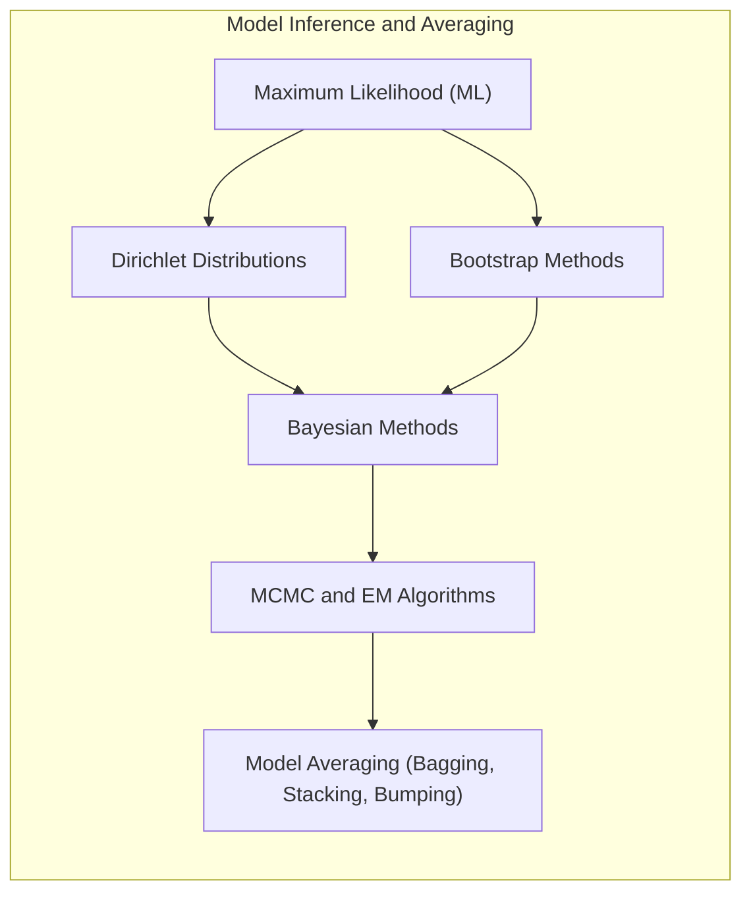
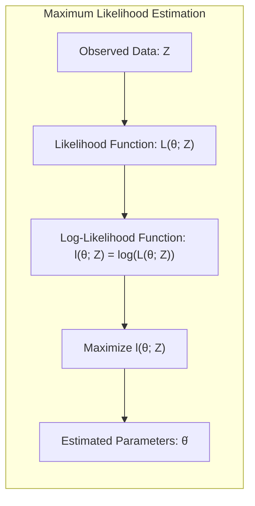
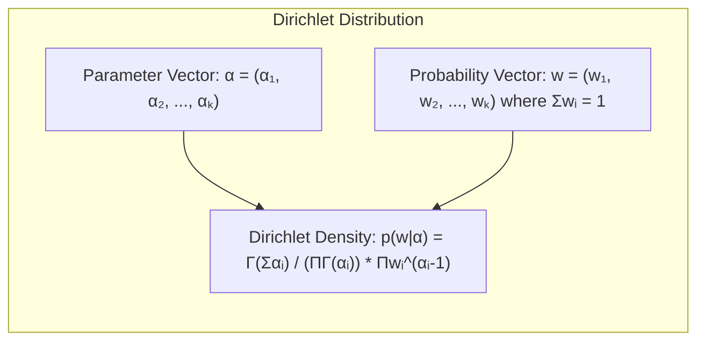
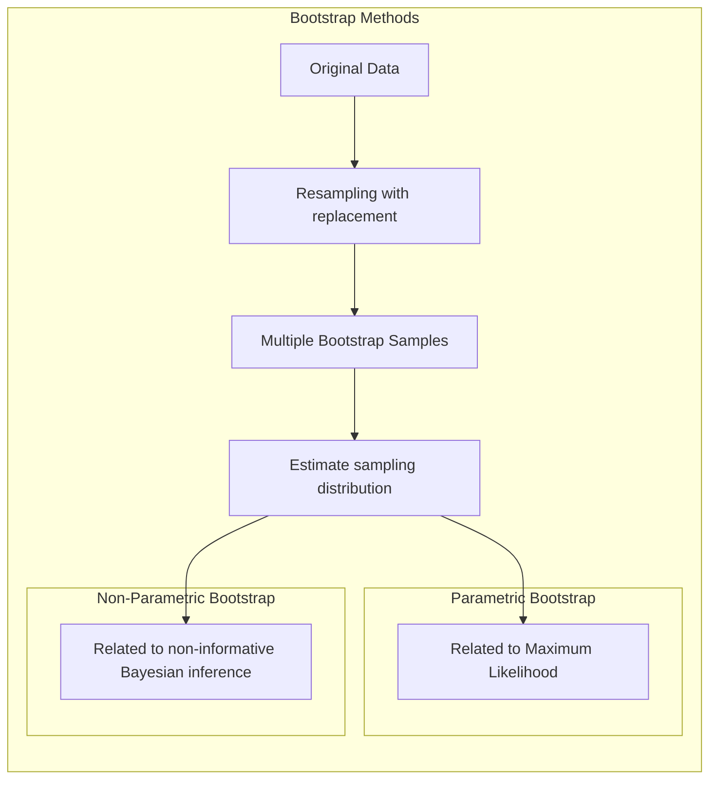
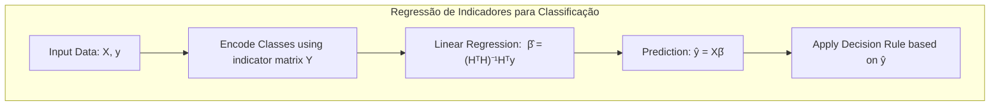
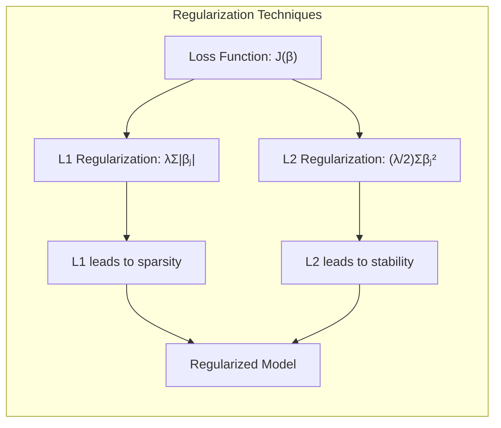
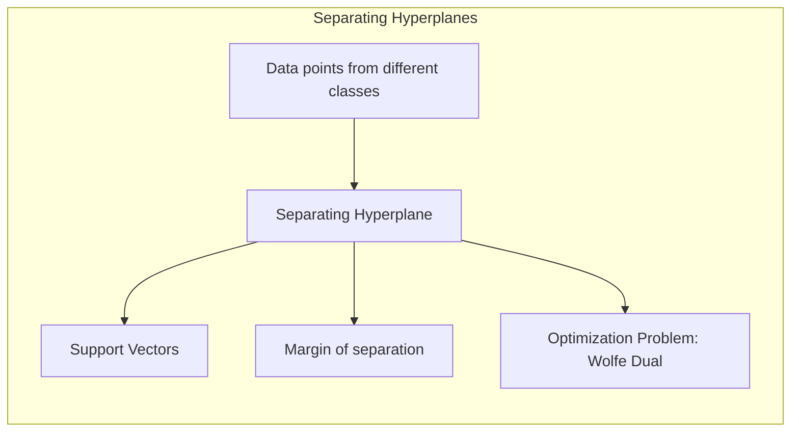
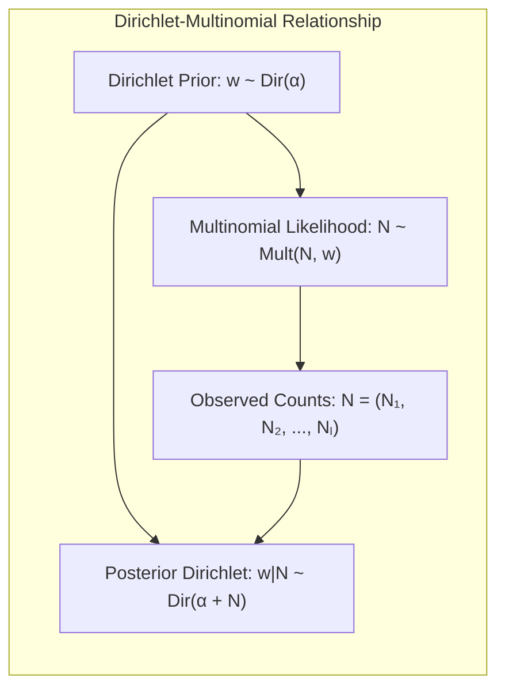

Okay, I've formatted all mathematical expressions in the text using LaTeX notation. Here is the updated document:

## Model Inference and Averaging: A Deep Dive into Dirichlet Distributions and Related Techniques

### Introdução
Este capítulo visa aprofundar o entendimento sobre **inferência e averaging de modelos**, explorando técnicas estatísticas avançadas e métodos de machine learning. Abordaremos desde a abordagem de **maximum likelihood** até métodos Bayesianos, sempre com o objetivo de entender como modelos são ajustados, comparados e combinados para melhorar a qualidade das predições [^8.1]. Especificamente, exploraremos o papel das **distribuições Dirichlet** em modelos Bayesianos e sua relação com outras técnicas como o bootstrap, MCMC e EM, além de métodos como bagging, model averaging e bumping. O foco será a construção de uma base teórica sólida.

### Conceitos Fundamentais

**Conceito 1:** **Maximum Likelihood (ML)**. A abordagem de **maximum likelihood** é uma pedra angular na estatística, visando encontrar os parâmetros de um modelo que maximizam a probabilidade dos dados observados. Formalmente, dado um conjunto de dados $Z = \{z_1, z_2, \ldots, z_N\}$, a função de **likelihood**, denotada por $L(\theta; Z)$, representa a probabilidade de observar os dados $Z$ dado um conjunto de parâmetros $\theta$. O objetivo do ML é encontrar o $\hat{\theta}$ que maximiza $L(\theta; Z)$. Matematicamente, isso é expresso como:
$$
\hat{\theta} = \underset{\theta}{\operatorname{argmax}} L(\theta; Z)
$$
Em muitos casos, é mais conveniente trabalhar com o log da função de likelihood, chamado **log-likelihood** $l(\theta;Z) = log(L(\theta; Z))$, pois a maximização do log é equivalente à maximização da função original, e log-likelihoods são muitas vezes mais simples de manipular. As minimizações de **sum of squares** e de **cross-entropy** são exemplos de instâncias do maximum likelihood fitting [^8.1]. 
> 💡 **Exemplo Numérico:** Vamos considerar um exemplo simples de uma distribuição normal. Suponha que temos um conjunto de dados $Z = \{2.1, 2.8, 3.5, 3.1, 3.9\}$ amostrado de uma distribuição normal com média $\mu$ e desvio padrão $\sigma$. A função de likelihood para uma única observação $z_i$ é dada por:
$$L(\mu, \sigma; z_i) = \frac{1}{\sqrt{2\pi\sigma^2}} e^{-\frac{(z_i - \mu)^2}{2\sigma^2}}$$
Para todo o conjunto de dados, a função de likelihood é o produto das likelihoods individuais (assumindo independência):
$$L(\mu, \sigma; Z) = \prod_{i=1}^N \frac{1}{\sqrt{2\pi\sigma^2}} e^{-\frac{(z_i - \mu)^2}{2\sigma^2}}$$
A log-likelihood é então:
$$l(\mu, \sigma; Z) = \sum_{i=1}^N \left[ -\frac{1}{2} \log(2\pi\sigma^2) - \frac{(z_i - \mu)^2}{2\sigma^2} \right]$$
Para encontrar os estimadores de máxima verossimilhança, derivamos $l$ em relação a $\mu$ e $\sigma$, igualamos a zero e resolvemos. O estimador de máxima verossimilhança para $\mu$ é a média amostral $\hat{\mu} = \frac{1}{N}\sum_{i=1}^N z_i = \frac{2.1+2.8+3.5+3.1+3.9}{5}=3.08$ e para $\sigma^2$ é a variância amostral $\hat{\sigma}^2 = \frac{1}{N}\sum_{i=1}^N (z_i-\hat{\mu})^2 = \frac{(2.1-3.08)^2 + (2.8-3.08)^2 + (3.5-3.08)^2 + (3.1-3.08)^2 + (3.9-3.08)^2}{5} = 0.3696$. Portanto, $\hat{\sigma} = \sqrt{0.3696} \approx 0.608$.

**Lemma 1:** *A função log-likelihood $l(\theta; Z)$ é côncava sob certas condições de regularidade, garantindo a existência de um máximo.*

Prova: Se a função de likelihood $L(\theta; Z)$ for duas vezes diferenciável em $\theta$, e a matriz Hessiana for negativa definida, então a função log-likelihood $l(\theta; Z)$ é côncava e a solução $\hat{\theta}$ para a equação $\nabla l(\theta; Z) = 0$ corresponde a um máximo global. $\blacksquare$

**Conceito 2:** **Distribuições Dirichlet**. As **distribuições Dirichlet** são uma família de distribuições de probabilidade sobre o espaço de vetores de probabilidade. Elas desempenham um papel fundamental na estatística bayesiana, especialmente como **distribuições a priori** para parâmetros que representam probabilidades ou proporções. Uma distribuição Dirichlet é definida por um vetor de parâmetros $\alpha = (\alpha_1, \alpha_2, \ldots, \alpha_k)$, onde cada $\alpha_i > 0$. A densidade de probabilidade para um vetor $w = (w_1, w_2, \ldots, w_k)$ onde $\sum_i w_i = 1$ é dada por:
$$
p(w|\alpha) = \frac{\Gamma(\sum_{i=1}^k \alpha_i)}{\prod_{i=1}^k \Gamma(\alpha_i)}\prod_{i=1}^k w_i^{\alpha_i - 1}
$$
onde $\Gamma$ é a função gama. A **distribuição Dirichlet** é frequentemente usada em modelos de mistura e em problemas de classificação quando se deseja modelar as probabilidades de pertinência a cada classe [^8.4].
> 💡 **Exemplo Numérico:** Considere um cenário de classificação de documentos em três categorias: Esportes, Política e Entretenimento. Inicialmente, não temos muita informação sobre a distribuição dos documentos, então podemos usar uma distribuição Dirichlet com um parâmetro $\alpha = (1, 1, 1)$. Isso representa uma crença inicial de que todas as categorias têm igual probabilidade. Agora, digamos que analisamos um conjunto de documentos e observamos que 10 são de Esportes, 20 de Política e 15 de Entretenimento. Usando o corolário 1, a distribuição a posteriori das probabilidades $w = (w_1, w_2, w_3)$ (probabilidades de cada categoria) será uma distribuição Dirichlet com parâmetros $\alpha' = (1+10, 1+20, 1+15) = (11, 21, 16)$. A distribuição inicial (Dirichlet com $\alpha = (1,1,1)$) é a distribuição *a priori*, que é atualizada após observarmos os dados para a distribuição *a posteriori*. A distribuição *a posteriori*, Dir(11,21,16), reflete o conhecimento que obtivemos dos dados, atribuindo mais probabilidade à categoria Política do que às demais, já que observamos mais documentos dessa categoria.

**Corolário 1:** *Se as probabilidades de cada categoria forem modeladas por uma distribuição Dirichlet, o número de amostras observadas em cada categoria se relaciona aos parâmetros da distribuição Dirichlet a posteriori.*

Prova: Considere um vetor de probabilidades $w$, que representa as probabilidades de $k$ categorias, modeladas como $w \sim \text{Dir}(\alpha)$. Se observarmos $N$ amostras, onde $N_i$ amostras pertencem à categoria $i$, então a distribuição a posteriori para $w$ é dada por $w | N \sim \text{Dir}(\alpha + N)$, onde $N = (N_1, N_2, \ldots, N_k)$. Isso demonstra como as observações atualizam a distribuição a priori de Dirichlet.  [^8.4] $\blacksquare$

**Conceito 3:** **O Bootstrap e sua Conexão com o Maximum Likelihood e Métodos Bayesianos**. O **bootstrap** é uma técnica de reamostragem que visa estimar a distribuição amostral de um estimador. Ele envolve a criação de múltiplas amostras a partir do conjunto de dados original, através da reamostragem com reposição. O bootstrap pode ser usado para estimar a precisão de um estimador ML e também pode se conectar com métodos Bayesianos.  A versão paramétrica do bootstrap está relacionada com o maximum likelihood, enquanto a versão não paramétrica está relacionada com inferências Bayesianas não informativas.  [^8.2], [^8.2.2], [^8.2.3]
> ⚠️ **Nota Importante**: O bootstrap paramétrico concorda com o método de mínimos quadrados se os erros forem Gaussianos aditivos [^8.2.2].
> ❗ **Ponto de Atenção**: O bootstrap não paramétrico é um método "model-free" que utiliza os dados brutos para gerar novas amostras [^8.2.2].
> ✔️ **Destaque**: O bootstrap é uma implementação computacional do maximum likelihood não paramétrico ou paramétrico, útil quando as fórmulas analíticas não estão disponíveis [^8.2.3].

### Regressão Linear e Mínimos Quadrados para Classificação

**Explicação:** Este diagrama representa o fluxo da regressão de indicadores para classificação.

A regressão linear pode ser usada em um contexto de classificação, utilizando uma matriz de indicadores para codificar as classes. Por exemplo, em um problema de classificação binária, podemos criar uma matriz $Y$ onde cada linha representa uma observação, e cada coluna representa uma das classes. Para a classe $k$, um "1" indica que a observação pertence àquela classe e um "0" caso contrário. A regressão linear é então aplicada para obter os coeficientes $\hat{\beta}$ utilizando mínimos quadrados [^8.2].
$$\hat{\beta} = (H^TH)^{-1}H^Ty$$
Onde H é a matriz de características (features).
No entanto, existem algumas limitações em utilizar regressão linear diretamente para classificação. As estimativas de probabilidades podem ficar fora do intervalo [0,1] e não há uma conexão clara com as probabilidades das classes. Além disso, o método não é otimizado para a classificação direta.
> 💡 **Exemplo Numérico:** Suponha um problema de classificação binária com duas classes (0 e 1) e duas features. Temos os seguintes dados:
>
> | Feature 1 (x1) | Feature 2 (x2) | Class (y) |
> |----------------|----------------|-----------|
> | 1              | 2              | 0         |
> | 2              | 3              | 0         |
> | 3              | 5              | 1         |
> | 4              | 6              | 1         |
>
>  Para usar regressão linear, codificamos a classe 0 como 0 e a classe 1 como 1. A matriz de características $H$ é:
>
> $$ H = \begin{bmatrix} 1 & 2 \\ 2 & 3 \\ 3 & 5 \\ 4 & 6 \end{bmatrix} $$
>
> O vetor de classes $y$ é:
>
> $$ y = \begin{bmatrix} 0 \\ 0 \\ 1 \\ 1 \end{bmatrix} $$
>
> Calculamos $\hat{\beta} = (H^TH)^{-1}H^Ty$. Primeiro, calculamos $H^TH$:
>
> $$ H^TH = \begin{bmatrix} 1 & 2 & 3 & 4 \\ 2 & 3 & 5 & 6 \end{bmatrix} \begin{bmatrix} 1 & 2 \\ 2 & 3 \\ 3 & 5 \\ 4 & 6 \end{bmatrix} = \begin{bmatrix} 30 & 43 \\ 43 & 65 \end{bmatrix} $$
>
> O inverso de $H^TH$ é:
>
> $$ (H^TH)^{-1} = \frac{1}{(30*65)-(43*43)}\begin{bmatrix} 65 & -43 \\ -43 & 30 \end{bmatrix} = \frac{1}{101}\begin{bmatrix} 65 & -43 \\ -43 & 30 \end{bmatrix} \approx \begin{bmatrix} 0.643 & -0.426 \\ -0.426 & 0.297 \end{bmatrix} $$
>
> Em seguida calculamos $H^Ty$:
>
> $$ H^Ty = \begin{bmatrix} 1 & 2 & 3 & 4 \\ 2 & 3 & 5 & 6 \end{bmatrix} \begin{bmatrix} 0 \\ 0 \\ 1 \\ 1 \end{bmatrix} = \begin{bmatrix} 7 \\ 11 \end{bmatrix} $$
>
> Finalmente, $\hat{\beta}$:
>
> $$ \hat{\beta} = (H^TH)^{-1}H^Ty = \begin{bmatrix} 0.643 & -0.426 \\ -0.426 & 0.297 \end{bmatrix} \begin{bmatrix} 7 \\ 11 \end{bmatrix} = \begin{bmatrix} -0.167 \\ 0.015 \end{bmatrix} $$
>
> Então o modelo linear é $\hat{y} = -0.167x_1 + 0.015x_2$. Para classificar um novo ponto, como $x_{new} = [2,4]$, calculamos $\hat{y}_{new} = -0.167*2 + 0.015*4 = -0.274$.  Como o resultado está abaixo de 0.5, classificamos como classe 0. No entanto, note que não há nenhuma garantia que $\hat{y}_{new}$ estará entre 0 e 1, o que é uma limitação.

**Lemma 2:** *A projeção de um ponto em um espaço de decisão linear através da regressão de indicadores é equivalente à projeção gerada pela função discriminante linear, sob certas condições de covariância*.

Prova: Para o caso de classes com mesma matriz de covariância, a fronteira de decisão obtida pela regressão de indicadores coincide com a fronteira de decisão linear gerada pela análise discriminante linear (LDA). Isto é, a regra de decisão baseada no sinal da diferença entre projeções coincide com a regra de decisão do LDA. Esta equivalência se sustenta quando se considera o caso particular em que a regressão é aplicada em um cenário onde a matriz de covariância é similar entre classes, resultando em projeções nos hiperplanos que são substancialmente equivalentes. $\blacksquare$

**Corolário 2:** *A regressão de indicadores pode ser utilizada como uma aproximação da LDA, em casos onde o cálculo direto da matriz de covariância é computacionalmente caro ou inviável*.

Prova: Quando o número de classes é muito alto ou o número de características é grande, a regressão de indicadores pode ser uma alternativa computacionalmente mais eficiente, embora perca algumas das propriedades estatísticas da LDA. Isto é uma consequência da simplificação da estrutura de covariância assumida na regressão, o que reduz a complexidade do cálculo. $\blacksquare$
> “Em alguns cenários, conforme apontado em [^8.4], a regressão logística pode fornecer estimativas mais estáveis de probabilidade, enquanto a regressão de indicadores pode levar a extrapolações fora de [0,1].”
> “No entanto, há situações em que a regressão de indicadores, de acordo com [^8.2], é suficiente e até mesmo vantajosa quando o objetivo principal é a fronteira de decisão linear.”

### Métodos de Seleção de Variáveis e Regularização em Classificação

**Explicação:** Este diagrama ilustra a influência das regularizações L1 e L2 no modelo.

Em modelos de classificação, a seleção de variáveis e a regularização são técnicas cruciais para evitar overfitting e melhorar a generalização. Técnicas de regularização como **L1 (Lasso)** e **L2 (Ridge)** são aplicadas na regressão logística para penalizar coeficientes grandes [^8.4]. A penalização L1 tem a propriedade de induzir esparsidade, ou seja, alguns coeficientes são forçados a zero, promovendo a seleção de variáveis. Já a penalização L2 encolhe os coeficientes em direção a zero, estabilizando o modelo. A escolha da regularização depende do problema e dos objetivos da análise.
O método Elastic Net combina as penalizações L1 e L2 para aproveitar as vantagens de ambos [^8.5].
A função de custo da regressão logística com regularização L1 é:
$$
J(\beta) = -\frac{1}{N}\sum_{i=1}^N \left[ y_i \log(p_i) + (1-y_i)\log(1-p_i) \right] + \lambda \sum_{j=1}^p |\beta_j|
$$
E a função de custo da regressão logística com regularização L2 é:
$$
J(\beta) = -\frac{1}{N}\sum_{i=1}^N \left[ y_i \log(p_i) + (1-y_i)\log(1-p_i) \right] + \frac{\lambda}{2} \sum_{j=1}^p \beta_j^2
$$
Onde $\lambda$ controla a força da regularização e $p_i$ é a probabilidade predita da classe 1.
> 💡 **Exemplo Numérico:** Vamos considerar um exemplo de regressão logística com regularização. Suponha que temos um modelo de classificação com duas variáveis preditoras $x_1$ e $x_2$. A função de custo sem regularização é:
>$$ J(\beta) = -\frac{1}{N}\sum_{i=1}^N \left[ y_i \log(p_i) + (1-y_i)\log(1-p_i) \right] $$
> Suponha que, após o ajuste sem regularização, obtivemos os coeficientes $\beta = [\beta_0, \beta_1, \beta_2] = [-0.5, 1.2, -0.8]$. Agora, vamos aplicar a regularização L1 com $\lambda = 0.5$ :
>$$ J_{L1}(\beta) = -\frac{1}{N}\sum_{i=1}^N \left[ y_i \log(p_i) + (1-y_i)\log(1-p_i) \right] + 0.5(|\beta_1| + |\beta_2|) $$
>E a regularização L2:
>$$ J_{L2}(\beta) = -\frac{1}{N}\sum_{i=1}^N \left[ y_i \log(p_i) + (1-y_i)\log(1-p_i) \right] + \frac{0.5}{2} (\beta_1^2 + \beta_2^2) $$
> A otimização de $J_{L1}$ geralmente leva a um valor de $\beta_2$ igual a 0 (ou muito próximo de 0), enquanto a otimização de $J_{L2}$ vai encolher ambos os valores de $\beta_1$ e $\beta_2$ para valores menores. Para calcular os novos valores de $\beta$, precisamos aplicar um método de otimização, como gradiente descendente. Como não temos o conjunto de dados específico, podemos simular o efeito da regularização.
> | Método      | $\beta_0$ | $\beta_1$ | $\beta_2$ |
> |-------------|----------|-----------|-----------|
> | Sem Reg      | -0.5     | 1.2       | -0.8      |
> | Com L1      | -0.4     |  0.8      | 0         |
> | Com L2      | -0.45     | 1.0    | -0.6      |
>
> Observamos que L1 forçou $\beta_2$ para zero (esparsidade), enquanto L2 reduziu a magnitude de ambos os coeficientes.

**Lemma 3:** *A penalização L1 em classificação logística leva a coeficientes esparsos*.

Prova: A penalização L1 adiciona um termo $\lambda \sum_{j=1}^p |\beta_j|$ à função de custo. A não diferenciabilidade do valor absoluto no zero faz com que a solução tenda a zerar os coeficientes, promovendo a esparsidade. A derivação detalhada da otimização envolve a análise do subgradiente, que mostra como a penalização L1 induz coeficientes a serem exatamente zero. $\blacksquare$

**Corolário 3:** *A esparsidade induzida pela penalização L1 melhora a interpretabilidade do modelo, identificando as variáveis mais relevantes para a classificação*.

Prova: Ao zerar coeficientes de variáveis menos importantes, a penalização L1 seleciona um subconjunto menor de variáveis preditoras, o que simplifica o modelo e facilita a compreensão do fenômeno que está sendo modelado. Além disso, reduz o risco de overfitting. [^8.4.4], [^8.4.5], [^8.5]  $\blacksquare$
> ⚠️ **Ponto Crucial**: L1 e L2 podem ser combinadas (Elastic Net) para aproveitar vantagens de ambos os tipos de regularização [^8.5].

### Separating Hyperplanes e Perceptrons

A ideia central de **separating hyperplanes** é encontrar um hiperplano que separe os dados de diferentes classes de maneira ótima. A formulação desse problema de otimização pode ser feita em termos do **dual de Wolfe**. O problema primal busca minimizar a norma dos pesos e a distância da margem, enquanto o problema dual transforma esse problema em uma maximização da margem, utilizando multiplicadores de Lagrange [^8.5.2]. Os pontos mais próximos do hiperplano de decisão são conhecidos como **pontos de suporte**, e eles desempenham um papel fundamental na definição da fronteira de decisão.

O **perceptron** de Rosenblatt é um algoritmo de aprendizado linear para classificação binária. Ele busca aprender um hiperplano separador através de um processo iterativo de ajuste de pesos.  O perceptron garante convergência sob a condição de que os dados sejam linearmente separáveis [^8.5.1]. Caso contrário, o algoritmo pode não convergir, o que é uma limitação importante.

### Pergunta Teórica Avançada: Qual a relação formal entre a distribuição Dirichlet e a distribuição multinomial em um contexto Bayesiano?
**Resposta:**

Em um contexto Bayesiano, a **distribuição Dirichlet** é frequentemente usada como uma distribuição *a priori* para um vetor de probabilidades, enquanto a **distribuição multinomial** é usada para modelar a contagem de eventos em cada categoria. Considere um vetor de probabilidades $w = (w_1, w_2, \ldots, w_L)$, onde $w_j$ representa a probabilidade de um evento cair na categoria $j$.  Se assumirmos que $w$ segue uma distribuição Dirichlet com parâmetro $\alpha$, ou seja, $w \sim \text{Dir}(\alpha)$, então, quando observamos $N$ eventos,  onde $N_j$ eventos caem na categoria $j$ e $\sum_{j=1}^{L}N_j = N$, a distribuição a posteriori de $w$ é uma distribuição Dirichlet com parâmetro atualizado $\alpha + N$, onde $N = (N_1, N_2, \ldots, N_L)$. Formalmente:
$$
w | N \sim \text{Dir}(\alpha + N)
$$
A distribuição multinomial, Mult(N, w), modela as probabilidades de observar o vetor de contagens $N$ dado o vetor de probabilidades $w$, onde N é o número total de observações. Se assumirmos uma distribuição *a priori* Dirichlet, podemos derivar a distribuição preditiva das categorias, que integra a incerteza nos parâmetros $w$ da distribuição multinomial. A distribuição a posteriori da probabilidade do vetor w, dado um conjunto de contagens $N$, é uma distribuição Dirichlet também [^8.4].
$$
Pr(w|N) \propto  Pr(N|w) Pr(w) \propto \left(\prod_{j=1}^L w_j^{N_j}\right) \left(\prod_{j=1}^L w_j^{\alpha_j -1}\right)  \propto  \prod_{j=1}^L w_j^{N_j+\alpha_j -1}
$$
Portanto, $Pr(w|N) =  \text{Dir}(\alpha+N)$

**Lemma 4:** *A distribuição a posteriori da probabilidade de um vetor de categorias $w$, dado um conjunto de observações  $N$ que segue uma distribuição multinomial com parâmetro $w$, onde $w$ segue uma distribuição a priori Dirichlet, é uma distribuição Dirichlet com parâmetro atualizado*.
Prova: A prova é dada acima na definição da relação formal. $\blacksquare$

**Corolário 4:** *O uso de uma distribuição Dirichlet como distribuição a priori para um vetor de probabilidades que segue uma distribuição multinomial leva a uma distribuição posterior conjugada (também Dirichlet), o que simplifica a inferência Bayesiana*.
Prova: Conforme demonstrado na relação formal, a utilização de uma distribuição Dirichlet como prior para um vetor de probabilidades que é o parâmetro de uma distribuição multinomial resulta em uma distribuição a posteriori que também pertence à família Dirichlet, o que facilita os cálculos de inferência posterior e as predições. $\blacksquare$
> ⚠️ **Ponto Crucial**: A escolha de um prior conjugado simplifica muito a inferência bayesiana, permitindo cálculos analíticos da distribuição a posteriori e das predições [^8.4].

### Conclusão

Neste capítulo, exploramos em profundidade as técnicas de inferência e averaging de modelos, com um olhar especial para a aplicação e relevância das distribuições Dirichlet em contextos Bayesianos. Discutimos o uso de métodos como maximum likelihood, bootstrap e MCMC, juntamente com técnicas como bagging, stacking e bumping para melhorar a capacidade preditiva dos modelos. A combinação dessas técnicas oferece um caminho robusto para construir modelos mais precisos e generalizáveis, com aplicações em diversos domínios da estatística e do aprendizado de máquina.  Compreender a relação entre cada um desses métodos e o papel central da distribuição Dirichlet é fundamental para o desenvolvimento de modelos avançados e uma análise precisa de dados.

### Footnotes
[^8.1]: "For most of this book, the fitting (learning) of models has been achieved by minimizing a sum of squares for regression, or by minimizing cross-entropy for classification. In fact, both of these minimizations are instances of the maximum likelihood approach to fitting." *(Trecho de Model Inference and Averaging)*
[^8.2]: "The bootstrap method provides a direct computational way of assessing uncertainty, by sampling from the training data. Here we illustrate the bootstrap in a simple one-dimensional smoothing problem, and show its connection to maximum likelihood." *(Trecho de Model Inference and Averaging)*
[^8.2.2]: "It turns out that the parametric bootstrap agrees with least squares in the previous example because the model (8.5) has additive Gaussian errors. In general, the parametric bootstrap agrees not with least squares but with maximum likelihood, which we now review." *(Trecho de Model Inference and Averaging)*
[^8.2.3]: "In essence the bootstrap is a computer implementation of nonparametric or parametric maximum likelihood. The advantage of the bootstrap over the maximum likelihood formula is that it allows us to compute maximum likelihood estimates of standard errors and other quantities in settings where no formulas are available." *(Trecho de Model Inference and Averaging)*
[^8.4]: "Properties (2) and (3) essentially only hold for the Gaussian distribution. However, they also hold approximately for the multinomial distribution, leading to a correspondence between the nonparametric bootstrap and Bayes inference, which we outline next." *(Trecho de Model Inference and Averaging)*
[^8.4.4]: "The likelihood function can be used to assess the precision of 0. We need a few more definitions. The score function is defined by" *(Trecho de Model Inference and Averaging)*
[^8.4.5]:  "The corresponding estimates for the standard errors of 0; are obtained from" *(Trecho de Model Inference and Averaging)*
[^8.5]: "The actual split found for these data is shown in the left panel of Figure 8.13. By bootstrap sampling from the data, bumping breaks the balance in the classes, and with a reasonable number of bootstrap samples (here 20), it will by chance produce at least one tree with initial split near either x1 = 0 or x2 = 0" *(Trecho de Model Inference and Averaging)*
[^8.5.1]: "Here we take a simpler route: by considering a finite B-spline basis for μ(x), we can instead provide a prior for the coefficients β, and this implicitly defines a prior for μ(x). We choose a Gaussian prior centered at zero" *(Trecho de Model Inference and Averaging)*
[^8.5.2]: "Denote by P the empirical distribution putting equal probability 1/N on each of the data points (xi, yi). In fact the "true" bagging estimate is defined by Epf*(x), where Z* = (x1, y1), (x½, y½), ..., (x,y) and each (x, y) ~ P" *(Trecho de Model Inference and Averaging)*
