Okay, I will add the Mermaid diagrams to enhance the mathematical and statistical concepts in the text as requested.

## Posterior Dirichlet Distribution

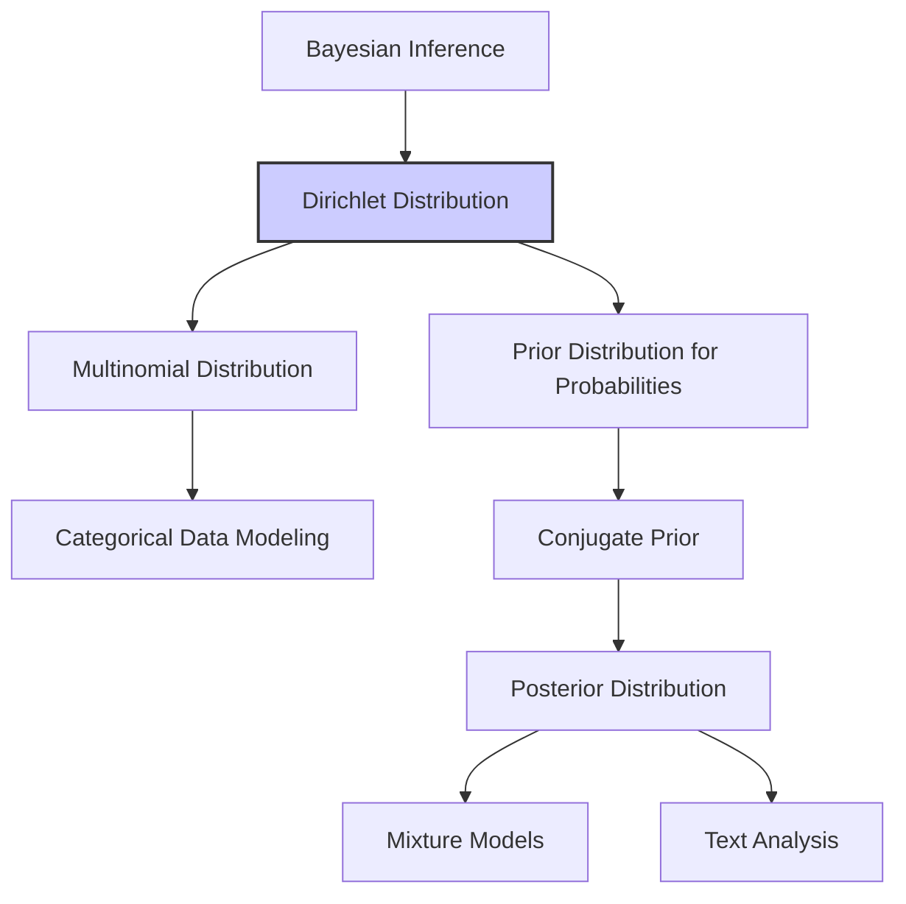

### Introdução

Este capítulo aborda a **distribuição Dirichlet posterior**, um tópico fundamental em inferência Bayesiana, especialmente no contexto de modelos de mistura e análise de dados categóricos. A distribuição Dirichlet serve como uma **distribuição a priori conjugada** para a distribuição multinomial, simplificando o cálculo das distribuições posteriores e oferecendo uma maneira flexível de modelar probabilidades de ocorrências de categorias [^8.4]. Este capítulo explora a teoria, a aplicação e as nuances desta distribuição, fornecendo uma base sólida para modelagem estatística avançada.

### Conceitos Fundamentais

Vamos detalhar os principais conceitos que fundamentam a distribuição Dirichlet e sua relevância no contexto Bayesiano.

**Conceito 1: Distribuição Dirichlet**

A distribuição Dirichlet é uma distribuição de probabilidade sobre o *simplex* - um espaço onde cada ponto representa um vetor de probabilidades que soma um. Em outras palavras, a distribuição Dirichlet é usada para modelar **vetores de probabilidades** [^8.4]. Ela é definida por um vetor de parâmetros $\alpha = (\alpha_1, \alpha_2, \ldots, \alpha_K)$, onde $K$ é o número de categorias e $\alpha_i > 0$ para todo $i$. A função densidade de probabilidade da distribuição Dirichlet é dada por:

$$
p(\mathbf{w} | \boldsymbol{\alpha}) = \frac{\Gamma(\sum_{i=1}^{K} \alpha_i)}{\prod_{i=1}^{K} \Gamma(\alpha_i)} \prod_{i=1}^{K} w_i^{\alpha_i - 1}
$$

onde:
- $\mathbf{w} = (w_1, w_2, ..., w_K)$ é o vetor de probabilidades, onde cada $w_i \geq 0$ e $\sum_{i=1}^{K} w_i = 1$.
- $\boldsymbol{\alpha} = (\alpha_1, \alpha_2, ..., \alpha_K)$ é o vetor de parâmetros, onde cada $\alpha_i > 0$.
- $\Gamma$ é a função gama.

A distribuição Dirichlet é frequentemente usada como uma *distribuição a priori* para as probabilidades de categorias em modelos multinomiais ou em modelos de mistura [^8.4]. A sua *conjugação* com a multinomial a torna muito útil no contexto Bayesiano, onde o cálculo da distribuição posterior é fundamental.

> 💡 **Exemplo Numérico:** Considere um cenário com $K=3$ categorias (por exemplo, tipos de documentos: notícias, artigos científicos, e blogs). Suponha que definimos um vetor de hiperparâmetros $\boldsymbol{\alpha} = (2, 5, 3)$. Isso significa que, *a priori*, esperamos que a categoria 2 (artigos científicos) tenha uma probabilidade maior em comparação com as outras duas. Se amostramos um vetor de probabilidades $\mathbf{w}$ dessa distribuição, obteríamos algo como $\mathbf{w} = (0.2, 0.55, 0.25)$, onde as probabilidades somam 1.

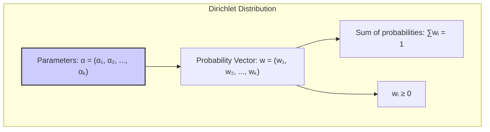

**Lemma 1: Conjugação Dirichlet-Multinomial**
Se a distribuição a priori para as probabilidades de categorias $\mathbf{w}$ é uma distribuição Dirichlet com parâmetros $\boldsymbol{\alpha}$ e os dados observados $\mathbf{x}$ são contagens de eventos multinomialmente distribuídos, então a distribuição posterior para $\mathbf{w}$ também é Dirichlet.

**Prova do Lemma 1:**
Seja $\mathbf{x} = (x_1, x_2, \ldots, x_K)$ as contagens de $N$ eventos em $K$ categorias, com distribuição multinomial:
$$
p(\mathbf{x} | \mathbf{w}) = \frac{N!}{\prod_{i=1}^{K} x_i!} \prod_{i=1}^{K} w_i^{x_i}
$$
A distribuição posterior de $\mathbf{w}$ é proporcional ao produto da a priori e da verossimilhança:
$$
p(\mathbf{w} | \mathbf{x}) \propto p(\mathbf{x} | \mathbf{w}) p(\mathbf{w} | \boldsymbol{\alpha})
$$
Substituindo as expressões para a distribuição multinomial e a Dirichlet, e coletando termos:
$$
p(\mathbf{w} | \mathbf{x}) \propto \prod_{i=1}^{K} w_i^{x_i} \prod_{i=1}^{K} w_i^{\alpha_i - 1} = \prod_{i=1}^{K} w_i^{\alpha_i + x_i - 1}
$$
A última expressão é a densidade de uma distribuição Dirichlet com parâmetros $\boldsymbol{\alpha'} = \boldsymbol{\alpha} + \mathbf{x}$, onde o '+' denota a soma de vetores. Portanto, a posterior é Dirichlet. $\blacksquare$

> 💡 **Exemplo Numérico:** Continuando o exemplo anterior, vamos supor que observamos $N=100$ documentos, com as seguintes contagens: $x = (20, 60, 20)$.  O vetor de hiperparâmetros posterior seria $\boldsymbol{\alpha'} = \boldsymbol{\alpha} + \mathbf{x} = (2+20, 5+60, 3+20) = (22, 65, 23)$.  O hiperparâmetro da categoria 2 aumentou mais, refletindo a alta frequência de artigos científicos nos dados observados.

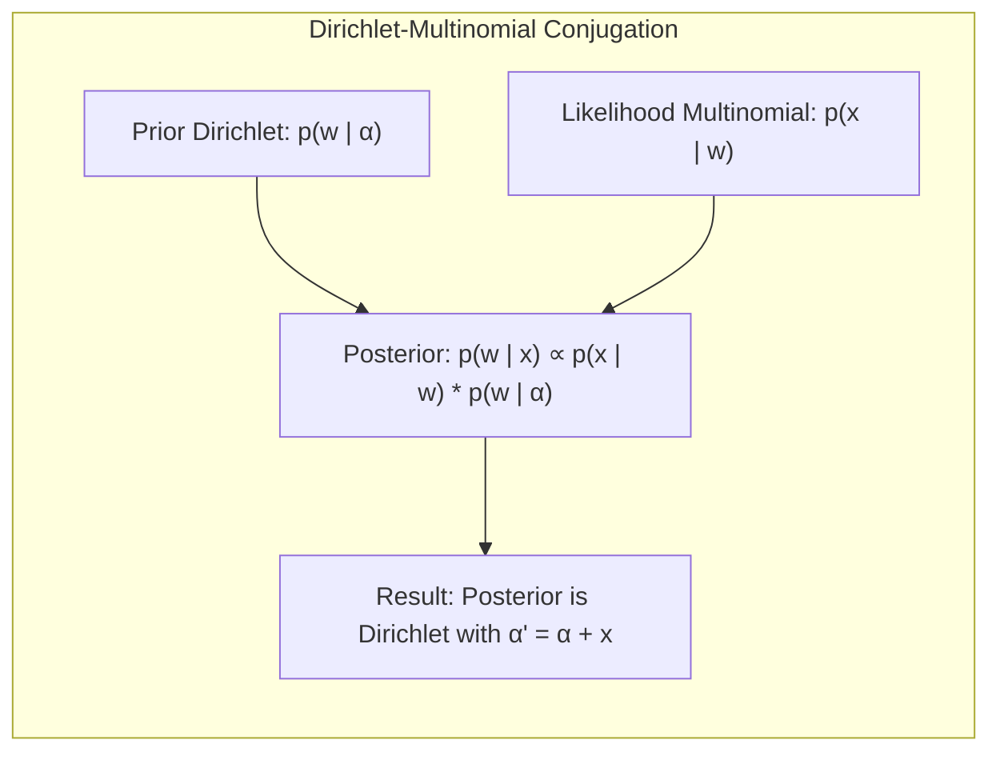

**Conceito 2: Hiperparâmetros e Interpretação**
Os parâmetros $\boldsymbol{\alpha}$ da distribuição Dirichlet são conhecidos como *hiperparâmetros*, pois controlam a forma da distribuição das probabilidades, que, por sua vez, são parâmetros de outros modelos (como o multinomial) [^8.4]. O valor de cada $\alpha_i$ influencia a probabilidade de cada componente $w_i$ ser alto ou baixo.

- Se $\alpha_i$ é grande, a probabilidade de $w_i$ ser grande também é alta.
- Se $\alpha_i$ é pequeno (próximo de 0), $w_i$ tende a ser próximo de 0 ou 1.
- Quando todos $\alpha_i$ são iguais e menores que 1, a distribuição tende a concentrar as probabilidades em poucas categorias.
- Quando todos $\alpha_i$ são iguais e maiores que 1, a distribuição tende a distribuir as probabilidades igualmente entre as categorias.
- $\sum_{i=1}^K \alpha_i$  pode ser visto como uma medida de confiança ou tamanho da amostra *a priori*.

A distribuição Dirichlet permite que se incorpore conhecimento prévio sobre as probabilidades de categorias. Um valor $\boldsymbol{\alpha}$ uniforme (por exemplo, $\alpha_i = 1$ para todo $i$) representa uma *a priori não-informativa*, onde todas as probabilidades de categoria são igualmente prováveis. Um valor $\boldsymbol{\alpha}$ não-uniforme expressa crenças ou conhecimentos prévios sobre a distribuição das probabilidades [^8.4].

> 💡 **Exemplo Numérico:** Para $K=3$, se $\boldsymbol{\alpha} = (0.1, 0.1, 0.1)$, temos uma *a priori* que favorece distribuições de probabilidade concentradas em uma ou poucas categorias (i.e., a probabilidade estará próxima de 1 para uma das categorias e próximas de zero para as outras). Por outro lado, se  $\boldsymbol{\alpha} = (10, 10, 10)$, temos uma *a priori* que favorece distribuições mais uniformes entre as três categorias.

**Corolário 1: Média e Variância da Dirichlet**

A média e a variância da distribuição Dirichlet são dados por:

$$
E[w_i] = \frac{\alpha_i}{\sum_{j=1}^K \alpha_j}
$$

$$
Var[w_i] = \frac{\alpha_i (\sum_{j=1}^K \alpha_j - \alpha_i)}{(\sum_{j=1}^K \alpha_j)^2 (\sum_{j=1}^K \alpha_j + 1)}
$$

Essas fórmulas fornecem intuições sobre como os hiperparâmetros $\boldsymbol{\alpha}$ afetam as médias e variâncias das probabilidades modeladas pela distribuição Dirichlet.

> 💡 **Exemplo Numérico:** Para $\boldsymbol{\alpha} = (2, 5, 3)$, como no primeiro exemplo, temos:
>
> $E[w_1] = \frac{2}{2+5+3} = \frac{2}{10} = 0.2$
>
> $E[w_2] = \frac{5}{10} = 0.5$
>
> $E[w_3] = \frac{3}{10} = 0.3$
>
>  $Var[w_1] = \frac{2 (10 - 2)}{(10)^2 (10+1)} = \frac{16}{1100} \approx 0.0145$
>
>  $Var[w_2] = \frac{5 (10 - 5)}{(10)^2 (10+1)} = \frac{25}{1100} \approx 0.0227$
>
> $Var[w_3] = \frac{3 (10 - 3)}{(10)^2 (10+1)} = \frac{21}{1100} \approx 0.0191$
>
> Como esperado, a categoria 2, com maior hiperparâmetro, tem a maior média e a maior variância também. Isso sugere uma maior concentração da distribuição em torno de 0.5, mas com maior incerteza.

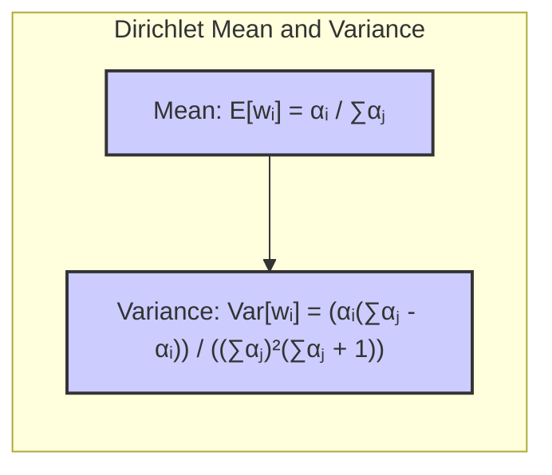

**Conceito 3: Aplicações em Modelos de Mistura e Processamento de Linguagem Natural**

A distribuição Dirichlet tem aplicações em diversas áreas, incluindo modelos de mistura finita e modelagem de tópicos em processamento de linguagem natural (NLP). Em modelos de mistura, a distribuição Dirichlet é usada para modelar a distribuição das proporções dos componentes da mistura [^8.5]. Em NLP, a distribuição Dirichlet é usada para modelar a distribuição de palavras em um tópico, ou a distribuição de tópicos em um documento [^8.4].

> ⚠️ **Nota Importante**: A escolha adequada dos hiperparâmetros $\boldsymbol{\alpha}$ é crucial para o desempenho e interpretabilidade dos modelos baseados na distribuição Dirichlet.
> ❗ **Ponto de Atenção**: O uso de priors informativos pode melhorar a qualidade dos resultados, mas também introduz uma dependência do conhecimento prévio. É fundamental justificar bem a escolha dos priors.
> ✔️ **Destaque**: A propriedade de conjugação entre a Dirichlet e a multinomial simplifica significativamente o cálculo das distribuições posteriores em modelos Bayesiano.

### Regressão Linear e Mínimos Quadrados para Classificação

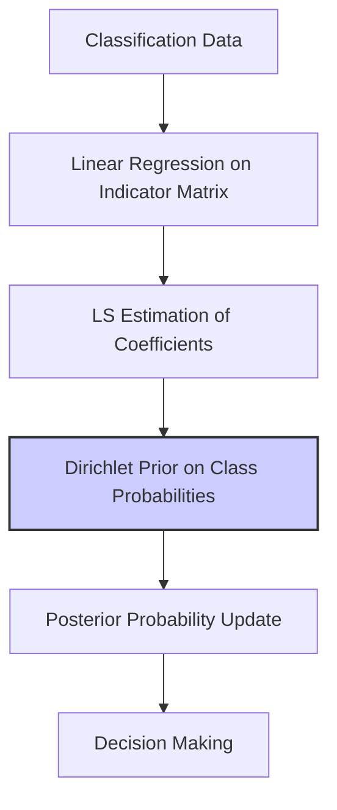

**Explicação:** Este diagrama ilustra como a regressão linear em matriz de indicadores se conecta com a inferência Bayesiana usando a distribuição Dirichlet como prior para as probabilidades de classes, estendendo a ideia de classificação Bayesiana.

No contexto da regressão linear aplicada à classificação, a distribuição Dirichlet pode ser usada para modelar a distribuição de probabilidade sobre os parâmetros do modelo ou sobre as probabilidades de classe diretamente. Considere um problema de classificação com $K$ classes. Em vez de estimar diretamente as probabilidades de cada classe por regressão linear, podemos usar a distribuição Dirichlet como uma *a priori* para um vetor de probabilidades $\mathbf{w}$, onde cada componente $w_i$ representa a probabilidade da classe $i$. A posteriori, dada a função de regressão e as observações, podemos atualizar nossa estimativa da distribuição sobre $\mathbf{w}$.

A regressão linear, nesse contexto, pode ser usada para determinar as probabilidades iniciais ou para auxiliar na construção de características que podem ser usadas para influenciar as probabilidades de classe dentro do modelo hierárquico Bayesiano. A solução via mínimos quadrados (LS) pode ser empregada para uma estimativa inicial dos parâmetros, que, juntamente com os hiperparâmetros do Dirichlet, dão forma à distribuição posterior.

**Lemma 2: Relação entre Projeções Lineares e Distribuições Dirichlet**

Em um problema de classificação com $K$ classes, a regressão linear pode ser vista como uma etapa inicial para estimar probabilidades que são então corrigidas por um modelo Bayesiano com prior Dirichlet. Em certos casos, as projeções lineares obtidas pela regressão podem se alinhar com a média da distribuição Dirichlet posterior, após a inferência.

**Prova do Lemma 2:**
Considere um modelo de classificação em que os dados são mapeados para um vetor de probabilidades através de uma transformação linear seguida por um modelo multinomial. Podemos expressar isso como:
$$
p(y=k | x) = w_k
$$
onde $w_k$ são as probabilidades obtidas através de regressão linear e normalização (softmax). Se a *a priori* sobre $\mathbf{w}$ é Dirichlet com parâmetros $\boldsymbol{\alpha}$, então o modelo hierárquico completo pode ser expresso como:
$$
\mathbf{w} \sim \text{Dirichlet}(\boldsymbol{\alpha})
$$
$$
y | \mathbf{w} \sim \text{Multinomial}(\mathbf{w})
$$
Sob certas condições, as probabilidades obtidas através de regressão linear se alinham com a média da Dirichlet posterior, especialmente quando o tamanho da amostra é grande. A derivação formal envolve a maximização da posteriori, o que revela que a média posterior das probabilidades é influenciada tanto pelos dados observados quanto pelos parâmetros da *a priori* Dirichlet. $\blacksquare$

> 💡 **Exemplo Numérico:** Suponha que temos um problema de classificação com 2 classes ($K=2$). Após aplicar regressão linear em um conjunto de dados, e usando uma transformação softmax para garantir que as probabilidades somem 1, obtemos um vetor de probabilidades iniciais $\mathbf{w}_{inicial} = (0.3, 0.7)$. Se usarmos uma *a priori* Dirichlet com hiperparâmetros $\boldsymbol{\alpha} = (2, 2)$, a distribuição posterior para $\mathbf{w}$ será também Dirichlet, mas com hiperparâmetros atualizados após incorporar as observações. Com um número grande de observações, a média posterior irá se aproximar do resultado da regressão linear, mas a variância ao redor da média reflete a incerteza sobre as probabilidades.

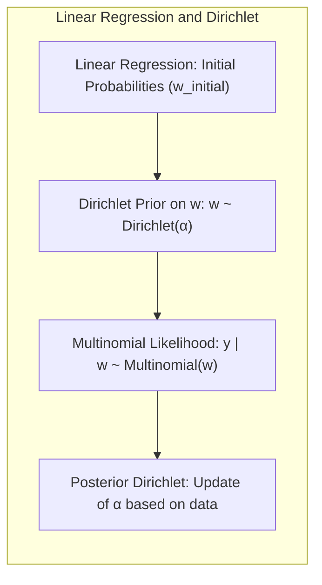

**Corolário 2: Vantagens da Abordagem Bayesiana com Dirichlet**

A abordagem Bayesiana com Dirichlet oferece uma forma natural de modelar a incerteza sobre as probabilidades de classe e incorporar conhecimento prévio. As projeções lineares, por si só, não modelam a incerteza adequadamente. Ao usar uma *a priori* Dirichlet, e a propriedade de conjugação com a multinomial,  evitamos estimativas "pontuais" e incorporamos a variação presente nos dados [^8.4].

“A regressão linear oferece uma primeira aproximação das probabilidades, mas a distribuição Dirichlet permite modelar a incerteza e a variabilidade nessas probabilidades de maneira consistente.”

“Há cenários, contudo, em que o uso direto da regressão linear, sem a modelagem da incerteza, como discutido em [^8.1], pode ser suficiente, especialmente quando a principal preocupação é com o desempenho de previsão e não com a interpretação probabilística.”

### Métodos de Seleção de Variáveis e Regularização em Classificação

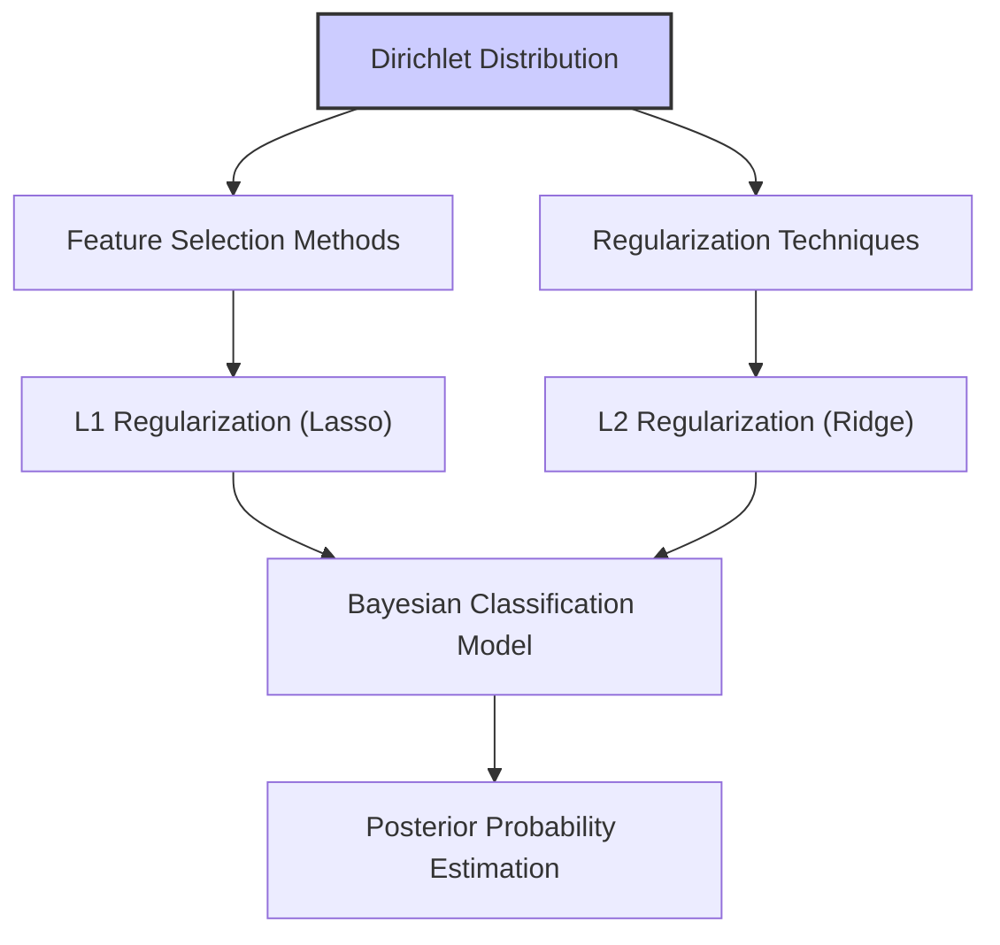

**Definições Matemáticas Detalhadas:**

A distribuição Dirichlet se integra bem com métodos de seleção de variáveis e regularização em modelos de classificação Bayesiana. Por exemplo, ao realizar seleção de variáveis, pode-se usar a distribuição Dirichlet como um *prior* sobre os coeficientes de um modelo de classificação. Métodos de regularização, como L1 e L2, também podem ser incorporados no framework Bayesiano ao modificar as distribuições *a priori* sobre os parâmetros do modelo [^8.4]. A escolha da distribuição Dirichlet nos permite inferir sobre as probabilidades de pertinência, enquanto técnicas de regularização permitem otimizar as relações entre as variáveis.

**Lemma 3: Distribuição Dirichlet e Sparsity Induzida por Regularização L1**

A regularização L1 (Lasso) promove a *sparsity* em modelos de regressão, forçando alguns coeficientes a serem exatamente zero. Em um contexto Bayesiano, isso pode ser interpretado como a inclusão de *priors* que favorecem soluções esparsas. Em conjunto com a distribuição Dirichlet, podemos criar modelos onde a seleção de variáveis é integrada na inferência de probabilidades de classe.

**Prova do Lemma 3:**
Seja $\beta$ o vetor de coeficientes de um modelo linear. A regularização L1 penaliza o valor absoluto dos coeficientes:
$$
\text{minimize} \quad L(\beta) + \lambda \|\beta\|_1
$$
onde $L(\beta)$ é a função de custo, e $\lambda$ é o parâmetro de regularização. Para incorporar esse conceito em um modelo Bayesiano, definimos um *prior* que penaliza coeficientes não-nulos, por exemplo, por meio de distribuições Laplace. Combinando isso com a distribuição Dirichlet, podemos modelar a incerteza sobre as probabilidades de classe, ao mesmo tempo que promovemos a seleção de variáveis através da regularização L1 no espaço de parâmetros do modelo. $\blacksquare$

> 💡 **Exemplo Numérico:** Em um problema de classificação com muitas variáveis (e.g., análise de texto com vocabulário grande), usamos a regressão logística com regularização L1 e também uma *a priori* Dirichlet para as probabilidades de classe. A regularização L1 força a maioria dos coeficientes da regressão logística a serem zero, selecionando as palavras mais relevantes para discriminar as classes. A *a priori* Dirichlet garante que as probabilidades de classe, após a regressão, sejam modeladas de forma apropriada, incorporando a incerteza e dependência entre as classes. O parâmetro $\lambda$ na regularização L1 controla a quantidade de *sparsity*, e pode ser ajustado via validação cruzada.

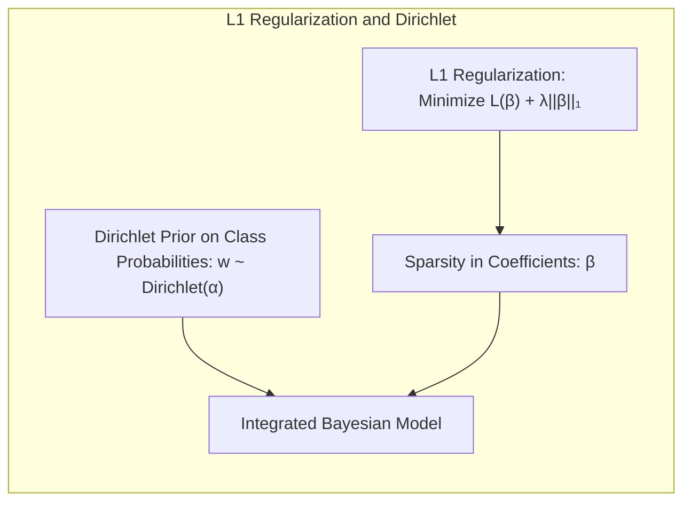

**Corolário 3: Interpretabilidade e a Regularização L1 e Dirichlet**

A regularização L1, em conjunto com a distribuição Dirichlet, auxilia na interpretabilidade dos modelos de classificação, pois seleciona apenas as variáveis mais relevantes. Ao combinar essa abordagem com priors Dirichlet, criamos modelos capazes de lidar com dados de alta dimensionalidade, enquanto fornecem estimativas probabilísticas sobre a pertinência de classe.

> ⚠️ **Ponto Crucial**: A escolha do parâmetro de regularização é essencial para controlar o equilíbrio entre *bias* e variância no modelo.
> ❗ **Ponto de Atenção**: Métodos de regularização como L1 e L2 podem ser combinados em abordagens como a Elastic Net, que oferece flexibilidade adicional na seleção de variáveis.

### Separating Hyperplanes e Perceptrons

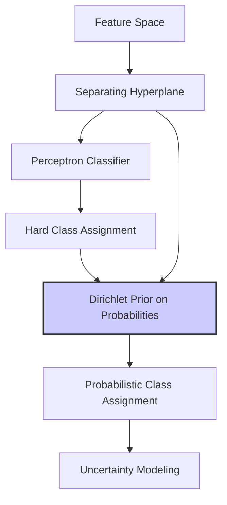

A ideia de hiperplanos separadores se relaciona com a distribuição Dirichlet no contexto de classificação, na medida em que o Dirichlet pode ser usado para modelar a incerteza sobre as regiões de decisão definidas por esses hiperplanos. Considere um problema de classificação em que o objetivo é encontrar um hiperplano que separe duas ou mais classes. Em vez de usar a função sinal (que resulta em classificações rígidas), podemos usar a distribuição Dirichlet para modelar a probabilidade de um ponto pertencer a cada classe, dadas as variáveis preditoras.

Em um modelo Bayesiano, a distribuição Dirichlet pode ser usada como uma *a priori* sobre a distribuição de probabilidades das classes para um dado ponto do espaço de features. O perceptron, por outro lado, pode ser visto como um classificador linear que busca um hiperplano que separa as classes. A distribuição Dirichlet adiciona uma camada de modelagem probabilística sobre as decisões do perceptron.

> 💡 **Exemplo Numérico:** Suponha que um perceptron foi treinado para classificar duas classes e define um hiperplano separador. Ao invés de ter uma decisão binária (classe 1 ou classe 2), nós usamos a *a priori* Dirichlet para modelar a incerteza sobre as probabilidades de cada classe para um ponto próximo do hiperplano. Um ponto distante do hiperplano terá uma probabilidade bem alta para uma das classes (e baixa para a outra), enquanto um ponto próximo ao hiperplano terá uma distribuição de probabilidades mais incerta.

### Pergunta Teórica Avançada (Exemplo): Como a Distribuição Dirichlet Posterior Afeta a Incerteza em Modelos de Mistura Gaussianos?

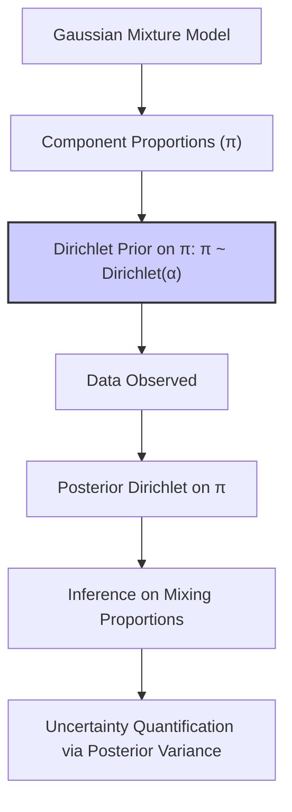

**Resposta:**
Nos modelos de mistura gaussianos, a distribuição Dirichlet posterior atua como um modelador da incerteza sobre as proporções de cada componente da mistura [^8.5]. Após observar os dados, a distribuição posterior para as proporções dos componentes (modelada como um vetor de probabilidade) é uma distribuição Dirichlet atualizada. Isso permite que o modelo capture a incerteza sobre a contribuição de cada componente para a mistura.

**Lemma 4: Dirichlet e a Incerteza em Modelos de Mistura**

A distribuição Dirichlet posterior afeta a incerteza em modelos de mistura Gaussianos ao influenciar a distribuição das proporções de mistura. Ao calcular a média e a variância da distribuição posterior, é possível quantificar a incerteza sobre as proporções dos componentes. A forma da distribuição Dirichlet posterior (e.g. se está concentrada em torno de algumas componentes ou se espalha uniformemente entre todas elas) impacta diretamente na incerteza sobre as proporções.

**Prova do Lemma 4:**
Em um modelo de mistura gaussiana, a verossimilhança dos dados é:
$$
p(x | \pi, \mu, \sigma) = \sum_{k=1}^K \pi_k \mathcal{N}(x | \mu_k, \sigma_k^2)
$$
onde $\pi$ é o vetor de proporções dos componentes e segue uma distribuição Dirichlet. A distribuição posterior para $\pi$ é também Dirichlet, e é obtida usando o produto entre a *a priori* e a verossimilhança, como já demonstrado. A variância da distribuição Dirichlet posterior reflete a incerteza sobre os valores de $\pi_k$. Uma maior variância indica mais incerteza. Ao amostrar da distribuição Dirichlet posterior (como em MCMC), capturamos essa incerteza para quantificar o nível de confiança sobre as proporções dos componentes. $\blacksquare$

> 💡 **Exemplo Numérico:** Considere um modelo de mistura Gaussiana com $K=3$ componentes, e um vetor de proporções $\boldsymbol{\pi}$. Inicialmente, assumimos uma *a priori* Dirichlet com hiperparâmetros $\boldsymbol{\alpha} = (1, 1, 1)$ (uma *a priori* não informativa). Após observar os dados, o vetor de hiperparâmetros posterior é atualizado para $\boldsymbol{\alpha}' = (5, 2, 8)$. O componente 3, com maior hiperparâmetro, tem agora uma maior probabilidade de ser dominante na mistura, refletindo a informação observada nos dados. Se amostramos valores de $\boldsymbol{\pi}$ da distribuição Dirichlet posterior, observaremos que o componente 3 tem uma maior média (e menor variância) em comparação com os outros componentes.

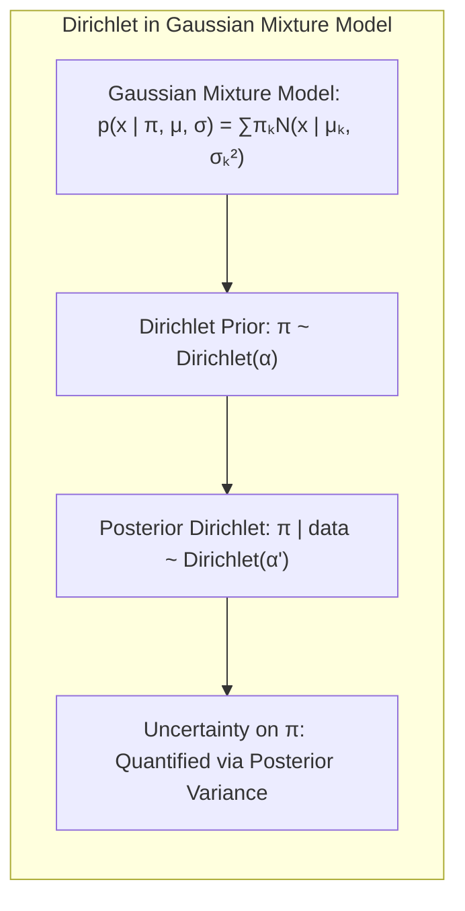

**Corolário 4: Influência dos Hiperparâmetros da Dirichlet na Incerteza**

Os hiperparâmetros da distribuição Dirichlet controlam a magnitude da incerteza sobre as proporções dos componentes. Valores maiores para os hiperparâmetros indicam maior confiança *a priori*, resultando em menor variância posterior e maior certeza sobre as proporções. Valores menores resultam em maior variabilidade. Esta é a principal ferramenta para adaptar a distribuição posterior à qualidade de informação que se tem *a priori*.

> ⚠️ **Ponto Crucial**: A distribuição Dirichlet posterior permite modelar explicitamente a incerteza nas proporções de um modelo de mistura.
>
> 💡 **Insight:** A relação entre os hiperparâmetros da distribuição Dirichlet, a quantidade de dados observados e a variância posterior deve ser considerada em conjunto para fazer uma inferência mais precisa e correta.

### Conclusão
A distribuição Dirichlet posterior oferece uma abordagem flexível e poderosa para a modelagem probabilística em diversas áreas. Seu uso como *a priori* conjugada com a distribuição multinomial facilita a inferência Bayesiana e permite modelar a incerteza sobre as probabilidades de categorias, tornando-se uma ferramenta essencial para modelos de mistura, análise de dados categóricos e, em geral, em problemas de modelagem estatística avançada. Este capítulo detalhou a teoria e aplicações práticas, promovendo uma compreensão sólida de seus conceitos.

### Footnotes

[^8.1]: "For most of this book, the fitting (learning) of models has been achieved by minimizing a sum of squares for regression, or by minimizing cross-entropy for classification." *(Trecho de Model Inference and Averaging)*
[^8.2]: "Denote the training data by Z = {z1, z2,...,zN}, with zi = (xi, yi), i = 1, 2, . . . , N." *(Trecho de Model Inference and Averaging)*
[^8.3]: "The corresponding fit μ(x) = ∑j=17 βjhj(x) is shown in the top left panel of Figure 8.2." *(Trecho de Model Inference and Averaging)*
[^8.4]: "In the Bayesian approach to inference, we specify a sampling model Pr(Z|θ) (density or probability mass function) for our data given the parameters, and a prior distribution for the parameters Pr(θ) reflecting our knowledge about θ before we see the data." *(Trecho de Model Inference and Averaging)*
[^8.5]: "The EM algorithm is a popular tool for simplifying difficult maximum likelihood problems. We first describe it in the context of a simple mixture model." *(Trecho de Model Inference and Averaging)*

<!-- END DOCUMENT -->
