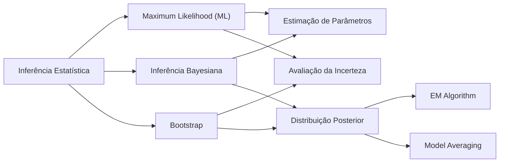
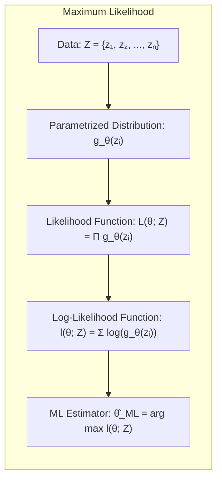
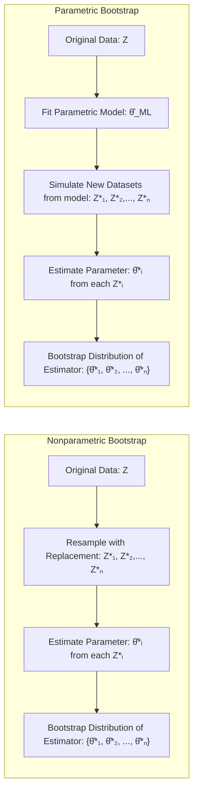
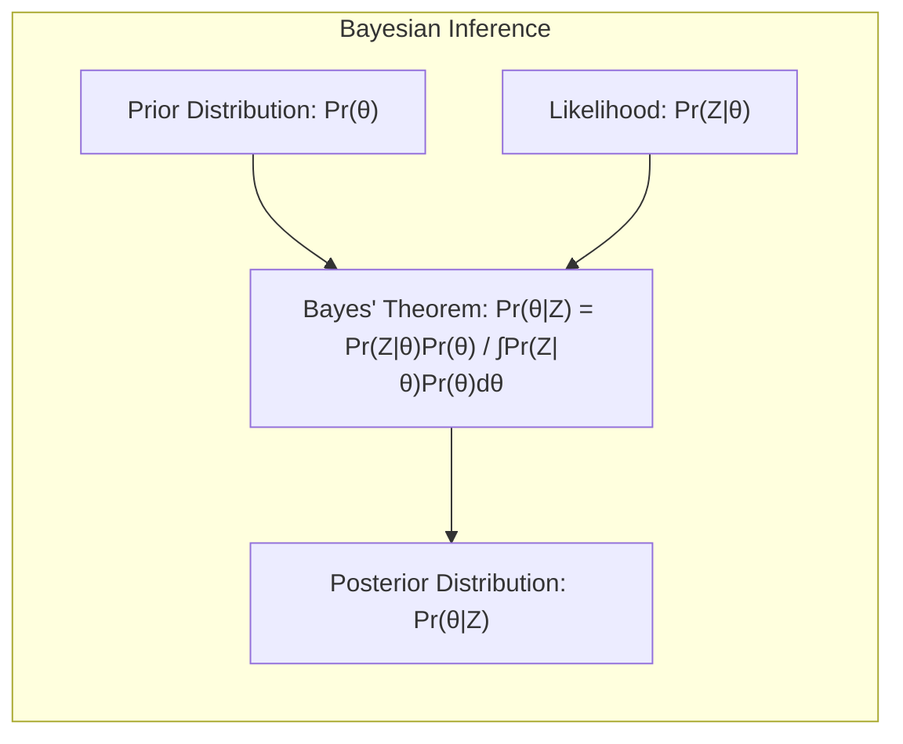
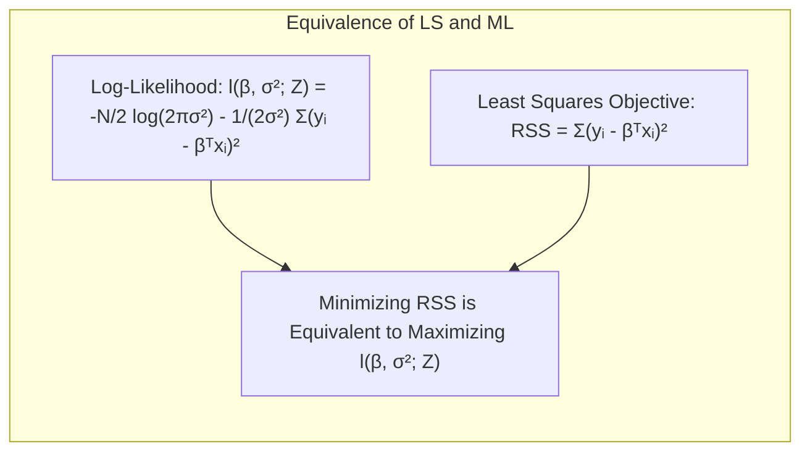
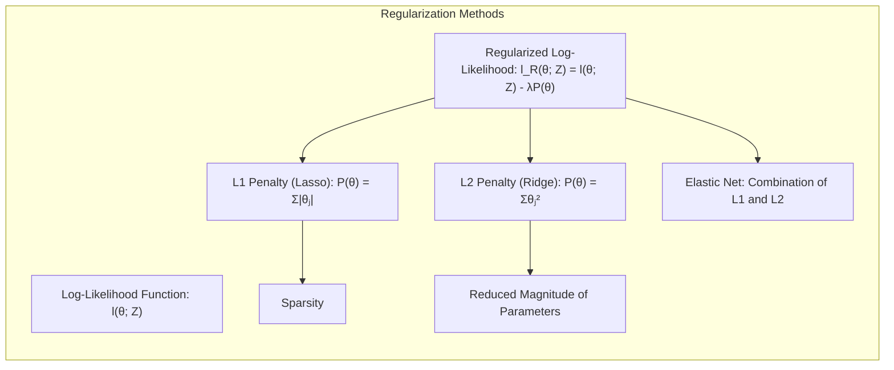
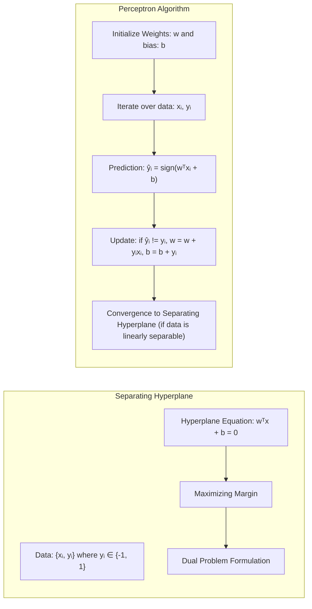

## Bootstrap Distribution as Posterior: Uma Análise Detalhada da Inferência Estatística e Modelagem



### Introdução
O presente capítulo aborda uma exploração aprofundada da **inferência e modelagem estatística**, com foco em técnicas que vão além da simples minimização de erros quadrados ou entropia cruzada, conforme mencionado em [^8.1]. A inferência estatística, em um sentido amplo, busca aprofundar nossa compreensão sobre os dados, indo além da mera descrição e focando na estimação de parâmetros, avaliação da incerteza e validação de modelos. Abordagens como **Maximum Likelihood (ML)** e a inferência Bayesiana fornecem arcabouços formais para lidar com essas questões, enquanto o **bootstrap** surge como uma ferramenta computacional poderosa para a avaliação da incerteza em diversas configurações. Este capítulo explora como o bootstrap pode ser interpretado como uma forma de aproximação da distribuição posterior Bayesiana, oferecendo uma alternativa computacionalmente atraente em situações onde abordagens analíticas são inviáveis. O capítulo também discute o **EM algorithm** como um método para estimar os parâmetros do modelo quando os dados estão incompletos ou quando há variáveis latentes, e os métodos de **model averaging** (como bagging e stacking) para melhorar a performance dos modelos.

### Conceitos Fundamentais
**Conceito 1: Maximum Likelihood (ML)**
A abordagem de **Maximum Likelihood (ML)** busca estimar os parâmetros de um modelo maximizando a **função de verossimilhança (likelihood function)**, que representa a probabilidade dos dados observados dado um conjunto de parâmetros [^8.1]. Formalmente, dado um conjunto de dados $Z = \{z_1, z_2, \ldots, z_N\}$ e uma família de distribuições de probabilidade parametrizadas por $\theta$, a verossimilhança é dada por
$$L(\theta; Z) = \prod_{i=1}^{N} g_{\theta}(z_i),$$
onde $g_{\theta}(z_i)$ é a função de densidade ou massa de probabilidade do $i$-ésimo dado. A função de log-verossimilhança é usualmente utilizada devido à sua propriedade de converter produtos em somas:
$$l(\theta; Z) = \sum_{i=1}^{N} \log g_{\theta}(z_i).$$
A estimativa de máximo verossimilhança ($\hat{\theta}_{ML}$) é o valor de $\theta$ que maximiza a função de log-verossimilhança:
$$\hat{\theta}_{ML} = \arg \max_{\theta} l(\theta; Z).$$
No contexto do capítulo, o ajuste de modelos por mínimos quadrados para regressão e a minimização da entropia cruzada para classificação, mencionados em [^8.1], são casos especiais de ML. A importância de ML reside em sua capacidade de fornecer estimativas consistentes e eficientes para os parâmetros do modelo, sob certas condições de regularidade [^8.2.2].

> 💡 **Exemplo Numérico:** Considere um conjunto de dados de alturas de 5 indivíduos, $Z = \{1.75, 1.80, 1.68, 1.85, 1.72\}$ (em metros), e que assumimos que as alturas são normalmente distribuídas com média $\mu$ e desvio padrão $\sigma$. A função de densidade de probabilidade é dada por $g_{\theta}(z_i) = \frac{1}{\sqrt{2\pi\sigma^2}}e^{-\frac{(z_i - \mu)^2}{2\sigma^2}}$, onde $\theta = (\mu, \sigma)$. Para encontrar os estimadores de máxima verossimilhança para $\mu$ e $\sigma$, primeiro computamos a log-verossimilhança:
>
> $l(\mu, \sigma; Z) = \sum_{i=1}^5 \log \left( \frac{1}{\sqrt{2\pi\sigma^2}}e^{-\frac{(z_i - \mu)^2}{2\sigma^2}} \right) = - \frac{5}{2} \log(2\pi\sigma^2) - \frac{1}{2\sigma^2}\sum_{i=1}^5 (z_i - \mu)^2$
>
> Para maximizar $l(\mu, \sigma; Z)$ em relação a $\mu$ e $\sigma$, calculamos as derivadas parciais e igualamos a zero. As soluções são:
>
> $\hat{\mu}_{ML} = \frac{1}{5}\sum_{i=1}^5 z_i = \frac{1.75+1.80+1.68+1.85+1.72}{5} = 1.76$
> $\hat{\sigma}_{ML}^2 = \frac{1}{5}\sum_{i=1}^5 (z_i - \hat{\mu}_{ML})^2 = \frac{(1.75-1.76)^2 + (1.80-1.76)^2 + (1.68-1.76)^2 + (1.85-1.76)^2 + (1.72-1.76)^2}{5} = 0.00332$
>
> Portanto, $\hat{\sigma}_{ML} = \sqrt{0.00332} \approx 0.0576$. Estes são os estimadores de máxima verossimilhança para a média e o desvio padrão das alturas.

**Lemma 1:** *Sob condições de regularidade, as estimativas de máxima verossimilhança são assintoticamente normais e eficientes.* Isso significa que, à medida que o tamanho da amostra aumenta, a distribuição das estimativas de ML se aproxima de uma distribuição normal, e essas estimativas atingem a menor variância possível para um estimador não viesado.

**Prova do Lemma 1:** A prova deste lemma envolve a expansão de Taylor da função de log-verossimilhança ao redor do verdadeiro valor do parâmetro, e então, usando propriedades das derivadas parciais da log-verossimilhança, mostrar que a distribuição das estimativas se aproxima de uma normal. $\blacksquare$

**Conceito 2: Bootstrap**
O **bootstrap** é uma técnica de reamostragem computacionalmente intensiva utilizada para estimar a distribuição amostral de um estimador, sem recorrer a suposições teóricas fortes sobre a distribuição dos dados [^8.2.1]. Existem duas formas principais do bootstrap:
*   **Nonparametric bootstrap:** Reamostra os dados com reposição do conjunto de dados original.
*   **Parametric bootstrap:** Simula novos dados a partir de um modelo paramétrico ajustado aos dados originais.

A ideia central é que, ao reamostrar os dados, criamos uma série de "pseudo-datasets" que refletem a variabilidade do processo gerador de dados original. Ao calcular o estimador de interesse (como a média ou desvio padrão) em cada um desses pseudo-datasets, obtemos uma aproximação da distribuição amostral do estimador [^8.2.1].
No contexto do exemplo de suavização por B-splines [^8.2.1], o bootstrap pode ser usado para gerar replicações da curva ajustada e, assim, calcular bandas de confiança para a função ajustada, conforme ilustrado nas figuras 8.2 e 8.3.

> 💡 **Exemplo Numérico:**  Considerando novamente os dados de altura $Z = \{1.75, 1.80, 1.68, 1.85, 1.72\}$. Para realizar o *nonparametric bootstrap*, vamos gerar 3 amostras com reposição:
>
> Amostra 1: $\{1.80, 1.72, 1.85, 1.75, 1.80\}$
> Amostra 2: $\{1.68, 1.72, 1.72, 1.80, 1.75\}$
> Amostra 3: $\{1.75, 1.85, 1.75, 1.68, 1.72\}$
>
> Agora, calculamos a média para cada uma dessas amostras:
>
> Média da Amostra 1:  $(1.80 + 1.72 + 1.85 + 1.75 + 1.80) / 5 = 1.784$
> Média da Amostra 2:  $(1.68 + 1.72 + 1.72 + 1.80 + 1.75) / 5 = 1.734$
> Média da Amostra 3: $(1.75 + 1.85 + 1.75 + 1.68 + 1.72) / 5 = 1.75$
>
> Repetindo este processo várias vezes (por exemplo, 1000 vezes), obtemos uma distribuição das médias amostrais que representa a incerteza sobre a média da população. O desvio padrão dessa distribuição pode ser usado para obter um intervalo de confiança para a média.

**Corolário 1:** O bootstrap fornece um método prático para quantificar a incerteza de um estimador em situações onde as formas analíticas da distribuição amostral são difíceis ou impossíveis de derivar.
Em particular, [^8.2.1] demonstra que, no caso de modelos com erros gaussianos aditivos, o parametric bootstrap concorda com os resultados obtidos por mínimos quadrados.

**Conceito 3: Bayesian Inference**
A **inferência Bayesiana** combina a verossimilhança dos dados com uma **distribuição *a priori* (prior distribution)**, que reflete nosso conhecimento prévio sobre os parâmetros, para obter uma **distribuição *a posteriori* (posterior distribution)**. A distribuição posterior representa nosso conhecimento atualizado sobre os parâmetros, após observar os dados [^8.3]. Matematicamente, a distribuição posterior é dada por:
$$Pr(\theta|Z) = \frac{Pr(Z|\theta)Pr(\theta)}{\int Pr(Z|\theta)Pr(\theta)d\theta},$$
onde $Pr(Z|\theta)$ é a verossimilhança dos dados dado $\theta$ e $Pr(\theta)$ é a distribuição *a priori*. A integral no denominador é chamada de evidência ou probabilidade marginal dos dados, e serve para normalizar a distribuição posterior.
A inferência Bayesiana difere da inferência frequentista, que usa o conceito de frequências de longo prazo e não incorpora a incerteza prévia sobre os parâmetros. A distribuição posterior fornece uma descrição completa da incerteza nos parâmetros, enquanto na inferência frequentista, a incerteza é geralmente quantificada por intervalos de confiança.
Um aspecto importante da inferência Bayesiana é a necessidade de especificar uma distribuição a priori para os parâmetros. Essa distribuição pode ser **informativa**, baseada em conhecimento prévio do domínio do problema, ou **não informativa**, que busca expressar o mínimo possível de influência no resultado final. [^8.3] discute a importância da escolha da distribuição *a priori* para o desempenho do modelo, especialmente em cenários onde se tem pouca informação sobre os parâmetros.

> 💡 **Exemplo Numérico:**  Vamos considerar um problema de inferência Bayesiana para a média de alturas. Suponha que acreditamos que a média de alturas é aproximadamente 1.75m e modelamos isso com uma distribuição *a priori* normal com média 1.75 e desvio padrão 0.1 (prior informativo). A verossimilhança dos dados, como no exemplo anterior, é também modelada com uma distribuição normal. Matematicamente:
> * *Prior*: $\mu \sim \mathcal{N}(1.75, 0.1^2)$
> * *Likelihood*: $Z|\mu, \sigma^2 \sim \mathcal{N}(\mu, \sigma^2)$, onde $Z = \{1.75, 1.80, 1.68, 1.85, 1.72\}$ e $\sigma^2=0.00332$ (estimado no exemplo de ML)
>
> A distribuição *a posteriori* de $\mu$ é proporcional ao produto da *a priori* e verossimilhança. Analiticamente, a *a posteriori* também é uma normal, com média ajustada para combinar a informação da *a priori* e dos dados:
>
> $\mu|Z \sim \mathcal{N}(\mu_{posterior}, \sigma_{posterior}^2)$
>
> $\mu_{posterior} = \frac{\frac{1.75}{0.1^2} + \frac{5 \times 1.76}{0.00332}}{\frac{1}{0.1^2} + \frac{5}{0.00332}} \approx 1.759$
>
> $\sigma_{posterior}^2 = (\frac{1}{0.1^2} + \frac{5}{0.00332})^{-1} \approx 0.00066$
>
> Observe que a média *a posteriori* (1.759) está entre a média *a priori* (1.75) e a média amostral (1.76), e a variância *a posteriori* é menor do que a variância da *a priori*. Isso indica que nossa certeza sobre $\mu$ aumentou ao observamos os dados.

### Regressão Linear e Mínimos Quadrados para Classificação


**Explicação:** O diagrama ilustra o processo de regressão de indicadores, onde as classes são transformadas em variáveis binárias (matriz de indicadores) e um modelo de regressão linear é ajustado. O bootstrap é aplicado para avaliar a incerteza nas previsões e parâmetros.
Na regressão de indicadores para classificação, as categorias da variável resposta são codificadas como variáveis binárias (indicadoras), e um modelo de regressão linear é ajustado a essas variáveis [^8.2]. Por exemplo, em um problema de classificação binária com classes $Y = \{0, 1\}$, a regressão de indicadores busca modelar a probabilidade de pertencer à classe 1, usando uma função linear dos preditores:
$$P(Y=1|X) = \beta_0 + \beta_1 X_1 + \ldots + \beta_p X_p$$.
As estimativas dos parâmetros $\beta$ são obtidas por mínimos quadrados, como em [^8.2]. Embora esta abordagem possa ser utilizada para gerar as fronteiras de decisão lineares, as probabilidades resultantes podem não estar bem calibradas, já que o modelo de regressão linear não garante que $P(Y=1|X)$ fique no intervalo $[0, 1]$. Além disso, a regressão de indicadores assume implicitamente homocedasticidade (variância constante do erro), o que pode não ser realista em problemas de classificação.

> 💡 **Exemplo Numérico:** Considere um problema de classificação com duas classes (0 e 1) e um único preditor. Temos os seguintes dados:
>
> | X   | Y |
> |-----|---|
> | 1   | 0 |
> | 2   | 0 |
> | 3   | 1 |
> | 4   | 1 |
> | 5   | 1 |
>
> A matriz de indicadores é simplesmente a coluna Y. Usando regressão linear, ajustamos o modelo $P(Y=1|X) = \beta_0 + \beta_1X$.
>
>  Podemos usar o método dos mínimos quadrados para encontrar $\beta_0$ e $\beta_1$:
>
>  $\beta = (X^TX)^{-1}X^Ty$
>
> Primeiro, construímos a matriz $X$:
> $X = \begin{bmatrix} 1 & 1 \\ 1 & 2 \\ 1 & 3 \\ 1 & 4 \\ 1 & 5 \end{bmatrix}$ e $y = \begin{bmatrix} 0 \\ 0 \\ 1 \\ 1 \\ 1 \end{bmatrix}$
>
> $X^TX = \begin{bmatrix} 5 & 15 \\ 15 & 55 \end{bmatrix}$
>
> $(X^TX)^{-1} = \frac{1}{50} \begin{bmatrix} 55 & -15 \\ -15 & 5 \end{bmatrix}$
>
> $X^Ty = \begin{bmatrix} 3 \\ 13 \end{bmatrix}$
>
> $\beta = \frac{1}{50} \begin{bmatrix} 55 & -15 \\ -15 & 5 \end{bmatrix} \begin{bmatrix} 3 \\ 13 \end{bmatrix} = \frac{1}{50}\begin{bmatrix} 165 - 195 \\ -45 + 65 \end{bmatrix} = \begin{bmatrix} -0.6 \\ 0.4 \end{bmatrix}$
>
> Assim, o modelo ajustado é $P(Y=1|X) = -0.6 + 0.4X$. Para classificar um novo dado $X=3.5$, por exemplo, teríamos  $P(Y=1|X=3.5) = -0.6 + 0.4*3.5 = 0.8$. Se a probabilidade for maior que 0.5, classificamos como classe 1. Note que o modelo de regressão linear pode prever probabilidades fora do intervalo [0, 1] se o X for muito alto ou baixo, o que é uma limitação da regressão linear para classificação.

**Lemma 2:** *Sob a hipótese de erros Gaussianos, o estimador de mínimos quadrados para o vetor de parâmetros $\beta$ no modelo de regressão linear de indicadores coincide com o estimador de máximo verossimilhança.*

**Prova do Lemma 2:** A função de log-verossimilhança para o modelo de regressão linear com erros gaussianos é dada por:
$$l(\beta, \sigma^2; Z) = -\frac{N}{2} \log(2\pi\sigma^2) - \frac{1}{2\sigma^2} \sum_{i=1}^N (y_i - \beta^T x_i)^2$$
Maximizar essa função em relação a $\beta$ é equivalente a minimizar a soma dos erros quadrados, que é exatamente o critério usado pelo método dos mínimos quadrados. $\blacksquare$

**Corolário 2:** A equivalência entre o estimador de mínimos quadrados e o estimador de máximo verossimilhança em modelos gaussianos, como demonstrado no Lemma 2, permite utilizar os resultados de inferência baseados em ML (como intervalos de confiança assintóticos) para o caso da regressão de indicadores.
É importante notar que a regressão de indicadores pode apresentar problemas como o “masking problem” [^8.2] e a dificuldade de lidar com classes não balanceadas, que podem levar a estimativas enviesadas e pouco confiáveis. Nesses casos, outros métodos como a regressão logística e o LDA, mencionados em [^8.1], podem ser mais apropriados.

### Métodos de Seleção de Variáveis e Regularização em Classificação

A seleção de variáveis e regularização são técnicas cruciais em modelagem estatística para evitar sobreajuste e melhorar a generalização dos modelos, como discutido nos contextos [^8.2], [^8.4]. A seleção de variáveis busca identificar um subconjunto dos preditores que seja mais relevante para o modelo, enquanto a regularização impõe penalidades aos parâmetros do modelo para reduzir sua complexidade e evitar o overfitting. Em modelos de classificação, como regressão logística, a regularização pode ser implementada por meio da adição de termos de penalização à função de log-verossimilhança [^8.4]:
$$l_R(\theta; Z) = l(\theta; Z) - \lambda P(\theta),$$
onde $\lambda$ é um parâmetro de regularização e $P(\theta)$ é uma função de penalização. As penalidades mais comuns são:

*   **Penalidade L1 (Lasso):** $P(\theta) = \sum_{j=1}^p |\theta_j|$ – incentiva soluções esparsas, ou seja, a maioria dos parâmetros são iguais a zero.
*   **Penalidade L2 (Ridge):** $P(\theta) = \sum_{j=1}^p \theta_j^2$ – reduz a magnitude dos parâmetros, evitando valores muito grandes.
*   **Elastic Net:** Combinação das penalidades L1 e L2.
Essas penalidades atuam sobre os coeficientes do modelo, reduzindo o viés e a variância, e aumentando a estabilidade das estimativas.

> 💡 **Exemplo Numérico:** Suponha que temos um problema de classificação com 10 preditores ($X_1, X_2, \ldots, X_{10}$) e usamos um modelo de regressão logística para classificar as instâncias em duas classes. Vamos considerar o uso de regularização L1 e L2 com diferentes valores de $\lambda$ para observar seu efeito sobre os coeficientes do modelo.
>
> Primeiro, vamos gerar dados simulados:
>
> ```python
> import numpy as np
> from sklearn.linear_model import LogisticRegression
> from sklearn.preprocessing import StandardScaler
>
> np.random.seed(42)
> X = np.random.rand(100, 10)
> y = np.random.randint(0, 2, 100)
>
> scaler = StandardScaler()
> X_scaled = scaler.fit_transform(X)
> ```
>
> Agora, vamos treinar três modelos de regressão logística: um sem regularização, um com L1 e outro com L2:
>
> ```python
> # Sem regularização
> model_none = LogisticRegression(penalty=None)
> model_none.fit(X_scaled, y)
>
> # Com regularização L1 (Lasso)
> model_l1 = LogisticRegression(penalty='l1', solver='liblinear', C=0.1)
> model_l1.fit(X_scaled, y)
>
> # Com regularização L2 (Ridge)
> model_l2 = LogisticRegression(penalty='l2', C=0.1)
> model_l2.fit(X_scaled, y)
>
> print("Coeficientes sem regularização:", model_none.coef_)
> print("Coeficientes com regularização L1:", model_l1.coef_)
> print("Coeficientes com regularização L2:", model_l2.coef_)
> ```
>
>  Ao executar o código, podemos observar que o modelo com regularização L1 tem alguns coeficientes exatamente iguais a zero, demonstrando a esparsidade induzida pela penalidade L1. O modelo com regularização L2 reduz os coeficientes para valores menores, mas não os torna zero. A escolha do valor de `C` (inverso de $\lambda$) afeta a intensidade da regularização. Valores menores de `C` correspondem a um $\lambda$ maior, o que leva a uma maior regularização e, portanto, a coeficientes menores ou iguais a zero.
>
> Podemos resumir o impacto da regularização em uma tabela:
>
> | Método        | Coeficientes  | Penalização | Esparsidade |
> | ------------- |-------------|------------|-------------|
> | Sem Reg        | Valores não restritos | Nenhuma      | Não |
> | L1 (Lasso)    | Alguns zerados   |  L1     | Sim      |
> | L2 (Ridge)    |  Valores menores   | L2  | Não  |

**Lemma 3:** *A penalização L1 leva a soluções esparsas, o que significa que ela zera alguns coeficientes, permitindo a seleção de variáveis.*

**Prova do Lemma 3:** A penalização L1 possui pontos não diferenciáveis na origem, o que faz com que a solução de otimização seja frequentemente encontrada nos eixos do espaço de parâmetros, ou seja, com coeficientes iguais a zero. Isso é uma consequência da geometria do problema de otimização e pode ser demonstrado com técnicas de otimização convexa. $\blacksquare$

**Corolário 3:** A esparsidade induzida pela penalização L1 resulta em modelos mais interpretáveis e que utilizam apenas as variáveis mais relevantes para a predição [^8.4].
Além disso, é importante notar que a escolha adequada do parâmetro de regularização $\lambda$ é crucial para o desempenho do modelo. Geralmente, esse parâmetro é escolhido via validação cruzada. A aplicação conjunta da seleção de variáveis e regularização permite construir modelos de classificação mais robustos, que generalizam bem para dados não observados.

### Separating Hyperplanes e Perceptrons

A ideia de **hiperplanos separadores** é central na classificação linear, com o objetivo de encontrar um hiperplano que separe as classes da melhor forma possível, geralmente maximizando a margem de separação [^8.2]. Formalmente, dado um conjunto de dados $Z = \{x_i, y_i\}$, onde $x_i$ é o vetor de preditores e $y_i \in \{-1, 1\}$ é a classe, o hiperplano é definido por:
$$w^T x + b = 0$$,
onde $w$ é o vetor normal ao hiperplano e $b$ é o deslocamento. A maximização da margem leva à formulação do problema de otimização em termos do dual de Wolfe.

O **Perceptron de Rosenblatt** é um algoritmo para encontrar o hiperplano separador em dados linearmente separáveis [^8.2]. O Perceptron é um algoritmo iterativo que atualiza os pesos do modelo com base nos erros de classificação. Sob condições de linear separabilidade, o Perceptron converge para uma solução em um número finito de iterações.

> 💡 **Exemplo Numérico:**  Considere um conjunto de dados 2D com duas classes (-1 e 1):
>
> $X = \begin{bmatrix} 1 & 2 \\ 2 & 1 \\ 3 & 3 \\ 4 & 2 \\ 5 & 4 \end{bmatrix}$, $y = \begin{bmatrix} -1 \\ -1 \\ 1 \\ 1 \\ 1 \end{bmatrix}$
>
> O objetivo é encontrar um hiperplano $w^Tx + b = 0$ que separe as classes. Inicializamos o vetor de pesos $w$ e o bias $b$ como vetores nulos $w = [0, 0]$ e $b = 0$. O algoritmo do perceptron consiste em iterar sobre os dados, atualizando os pesos quando houver um erro de classificação:
>
> 1. **Amostra 1:** $x_1 = [1, 2]$, $y_1 = -1$. Previsão: $\hat{y}_1 = sign(w^Tx_1 + b) = sign(0*1+0*2+0) = 0$, Erro: $-1$. Atualização: $w = w + y_1x_1 = [0, 0] + (-1)*[1, 2] = [-1, -2]$; $b = b + y_1 = 0 + (-1) = -1$
> 2. **Amostra 2:** $x_2 = [2, 1]$, $y_2 = -1$. Previsão: $\hat{y}_2 = sign(w^Tx_2 + b) = sign(-1*2-2*1-1) = -1$. Sem erro.
> 3. **Amostra 3:** $x_3 = [3, 3]$, $y_3 = 1$. Previsão: $\hat{y}_3 = sign(w^Tx_3 + b) = sign(-1*3-2*3-1) = -1$. Erro: $1$. Atualização: $w = w + y_3x_3 = [-1, -2] + 1*[3, 3] = [2, 1]$; $b = b + y_3 = -1 + 1 = 0$
> 4. **Amostra 4:** $x_4 = [4, 2]$, $y_4 = 1$. Previsão: $\hat{y}_4 = sign(w^Tx_4 + b) = sign(2*4 + 1*2 + 0) = 1$. Sem erro.
> 5. **Amostra 5:** $x_5 = [5, 4]$, $y_5 = 1$. Previsão: $\hat{y}_5 = sign(w^Tx_5 + b) = sign(2*5+1*4+0) = 1$. Sem erro.
>
> Repetindo as iterações, vemos que após algumas rodadas sobre os dados, o algoritmo converge para um conjunto de pesos que separa as classes. Esse hiperplano é um separador linear. A margem, neste caso, não é explicitamente maximizada, mas se os dados são linearmente separáveis, o perceptron encontra um hiperplano separador.

### Pergunta Teórica Avançada: Qual a relação entre o Parametric Bootstrap, o Maximum Likelihood e a Inferência Bayesiana sob a perspectiva da distribuição posterior?
**Resposta:**
O **parametric bootstrap** pode ser visto como um método para aproximar a distribuição posterior no caso em que a *a priori* é não informativa (ou seja, constante). Em outras palavras, quando a *a priori* é constante, a *a posteriori* é proporcional à verossimilhança, ou seja:
$$Pr(\theta|Z) \propto Pr(Z|\theta).$$
Sob essa condição, a estimativa de máximo verossimilhança $\hat{\theta}_{ML}$ coincide com o modo da distribuição posterior, e a distribuição amostral de $\hat{\theta}_{ML}$ (aproximada pelo bootstrap paramétrico) reflete a incerteza em $\theta$ expressa pela *a posteriori*.
The parametric bootstrap simulates data from the model adjusted by $\hat{\theta}_{ML}$, and the distribution of estimates $\theta$ obtained in these simulated data represents an approximation to the posterior distribution.

O parametric bootstrap coincide com a inferência Bayesiana quando usamos uma *a priori* não informativa e calculamos a *a posteriori* por simulação. Isso ocorre porque, no bootstrap paramétrico, estamos simulando distribuições que se comportam assintoticamente como a distribuição posterior [^8.2.3]. No entanto, se a distribuição a priori for informativa, o bootstrap não consegue captar esta informação adicional.