## O Algoritmo EM: Uma Introdução Detalhada

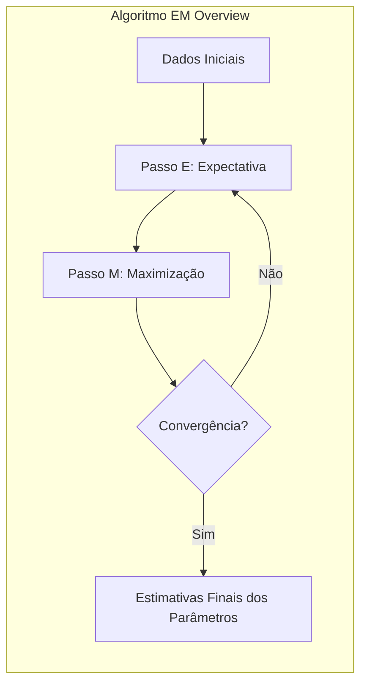

### Introdução

O presente capítulo tem como objetivo fornecer um estudo aprofundado do **algoritmo Expectation-Maximization (EM)**, uma ferramenta amplamente utilizada em estatística e aprendizado de máquina, especialmente em contextos onde os dados estão incompletos ou latentes. O algoritmo EM é um método iterativo para encontrar estimativas de máxima verossimilhança ou máxima *a posteriori* (MAP) de parâmetros em modelos estatísticos, onde a presença de variáveis latentes ou dados faltantes torna a otimização direta da verossimilhança um desafio [^8.1].

Este capítulo explorará em detalhes o algoritmo EM, sua aplicação em modelos de mistura, sua relação com o método de amostragem de Gibbs e sua conexão com outros métodos de inferência, como *model averaging*. Além disso, abordaremos as bases teóricas do algoritmo, exemplos de aplicação, bem como suas limitações e extensões. O objetivo é oferecer uma compreensão completa e aprofundada do algoritmo EM para profissionais com conhecimento avançado em estatística, otimização e análise de dados.

### Conceitos Fundamentais

Antes de aprofundarmos nos detalhes do algoritmo EM, é crucial estabelecer alguns conceitos fundamentais que serão utilizados ao longo deste capítulo.

**Conceito 1: Dados Observados e Dados Latentes**

Em muitos problemas estatísticos, estamos interessados em modelar a relação entre variáveis observadas e variáveis não observadas, também chamadas de latentes. Os **dados observados** ($Z$) são aqueles que coletamos diretamente, enquanto os **dados latentes** ($Z_m$) são variáveis que não são diretamente observadas, mas que desempenham um papel crucial na modelagem do processo gerador dos dados. O algoritmo EM é particularmente útil em situações onde os dados latentes são uma parte inerente do modelo. Um exemplo clássico são os modelos de mistura [^8.5.1], nos quais a pertença a um determinado cluster é uma variável latente.

**Lemma 1:** Em modelos com dados latentes, a verossimilhança observada $l(\theta; Z)$ é uma função da margem da verossimilhança conjunta $l(\theta; Z, Z_m)$ [^8.5.2], onde $Z$ são os dados observados, $Z_m$ são os dados latentes e $\theta$ são os parâmetros do modelo. Especificamente:
$$
l(\theta; Z) = \log \sum_{Z_m} p(Z, Z_m; \theta)
$$
onde $p(Z, Z_m; \theta)$ é a densidade conjunta dos dados observados e latentes, e a soma é sobre todos os possíveis valores de $Z_m$.

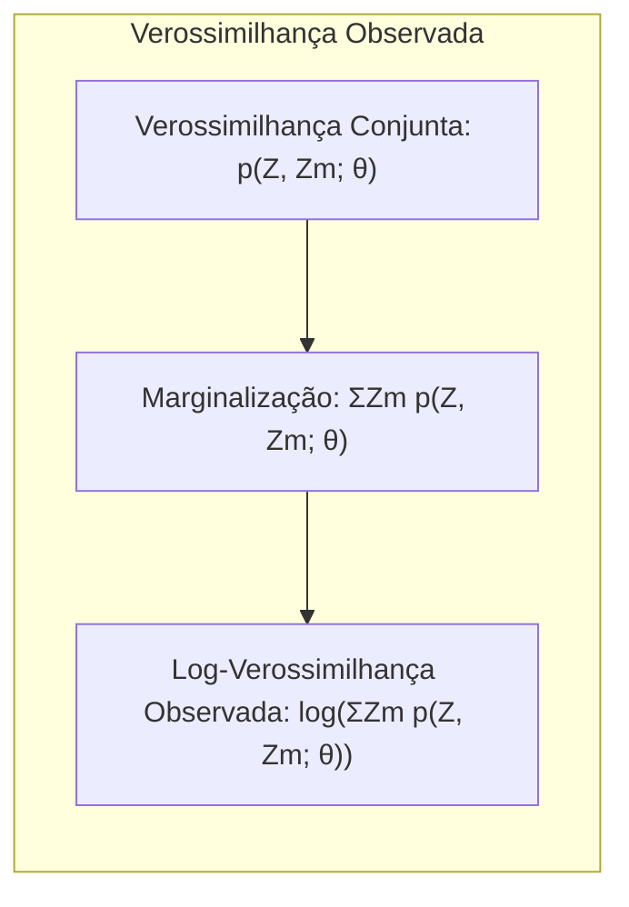

**Prova:** A relação acima surge diretamente da definição de margem de probabilidade. A densidade marginal de $Z$, dada $\theta$, é obtida pela soma (ou integral, no caso contínuo) da densidade conjunta sobre todas as realizações possíveis dos dados latentes $Z_m$. Tomando o logaritmo de ambos os lados, obtemos a expressão do lemma. $\blacksquare$

> 💡 **Exemplo Numérico:**
>
> Vamos supor que temos um conjunto de dados observados $Z = \{z_1, z_2\}$, e que esses dados são gerados por um modelo com duas variáveis latentes possíveis $Z_m = \{z_{m1}, z_{m2}\}$. Suponha também que temos um modelo com parâmetro $\theta$ e que as probabilidades conjuntas $p(Z, Z_m; \theta)$ são:
>
>   *   $p(Z, z_{m1}; \theta) = 0.3$
>   *   $p(Z, z_{m2}; \theta) = 0.7$
>
>   Então, a verossimilhança observada será:
>
>   $l(\theta; Z) = \log(p(Z, z_{m1}; \theta) + p(Z, z_{m2}; \theta)) = \log(0.3 + 0.7) = \log(1) = 0$
>
>  Este exemplo simples ilustra como a verossimilhança observada é calculada a partir da soma das verossimilhanças conjuntas sobre todas as possibilidades da variável latente.
>
> ```python
> import numpy as np
>
> # Probabilidades conjuntas
> p_zm1 = 0.3
> p_zm2 = 0.7
>
> # Verossimilhança observada
> likelihood_observed = np.log(p_zm1 + p_zm2)
> print(f"Verossimilhança observada: {likelihood_observed}")
> ```

**Conceito 2: Verossimilhança Completa e Verossimilhança Observada**

A **verossimilhança completa** ($l_c(\theta; Z, Z_m)$) é a verossimilhança que obteríamos se tivéssemos acesso tanto aos dados observados ($Z$) quanto aos dados latentes ($Z_m$). A **verossimilhança observada** ($l(\theta; Z)$), por sua vez, é a verossimilhança que calculamos com base nos dados observados, marginalizando sobre os dados latentes [^8.5.2]. O problema com a verossimilhança observada é que ela pode ser difícil de otimizar diretamente devido à presença da soma (ou integral) sobre as variáveis latentes. O algoritmo EM, portanto, busca otimizar a verossimilhança observada através da otimização iterativa de uma aproximação da mesma.

**Corolário 1:** O problema da maximização da verossimilhança observada é simplificado ao introduzir o conceito de verossimilhança completa, que pode ser mais facilmente otimizada na presença de variáveis latentes. A dificuldade reside na impossibilidade de avaliar a verossimilhança completa na ausência de dados latentes. Assim, o algoritmo EM itera entre passos de expectativa e maximização para encontrar uma solução para a otimização da verossimilhança observada [^8.5].

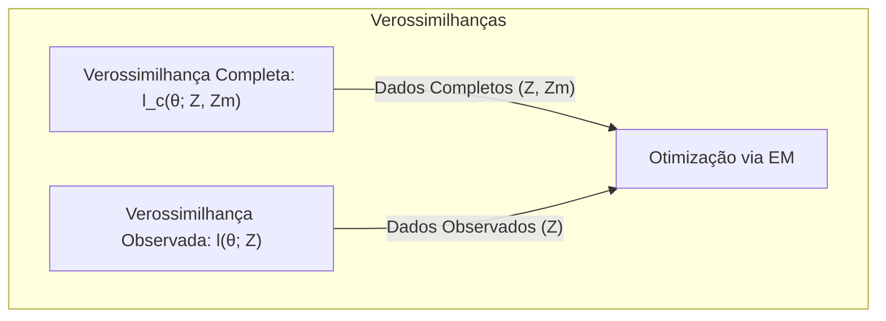

**Conceito 3: Expectativa e Maximização**

O algoritmo EM itera entre dois passos fundamentais: o passo de **Expectativa (E)** e o passo de **Maximização (M)** [^8.5.2]. No passo E, calculamos a esperança da verossimilhança completa, condicionada aos dados observados e à estimativa atual dos parâmetros. No passo M, maximizamos essa esperança em relação aos parâmetros, atualizando nossas estimativas dos parâmetros. Esses dois passos são repetidos até que os parâmetros convirjam para um valor estável.

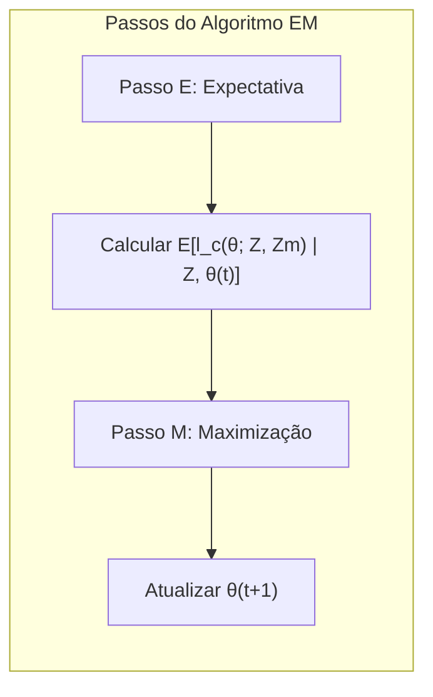

> ⚠️ **Nota Importante**: O algoritmo EM não garante encontrar o máximo global da verossimilhança. Ele pode convergir para máximos locais, e a escolha dos valores iniciais dos parâmetros pode ter um impacto significativo no resultado final.

> ❗ **Ponto de Atenção**: O algoritmo EM é um método para otimizar funções de verossimilhança em problemas com dados faltantes ou variáveis latentes, mas não se trata de uma solução única e universal. Existem diversos outros algoritmos e estratégias de otimização, cada um com suas vantagens e desvantagens.

> ✔️ **Destaque**: A beleza do algoritmo EM reside na sua capacidade de transformar um problema de otimização difícil (maximização da verossimilhança observada) em uma sequência de problemas mais fáceis (cálculo de esperança e maximização da esperança).

### Modelos de Mistura e o Algoritmo EM

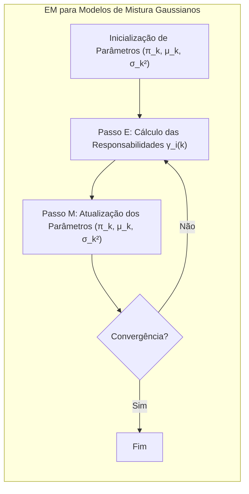

Modelos de mistura são uma aplicação exemplar do algoritmo EM. Um **modelo de mistura** assume que os dados são gerados a partir de uma combinação de várias distribuições, cada uma associada a uma componente ou cluster específico [^8.5.1]. O algoritmo EM é usado para estimar os parâmetros dessas distribuições, bem como a probabilidade de cada observação pertencer a cada componente.

Considere um modelo de mistura de duas Gaussianas [^8.5.1], onde cada observação $y_i$ é gerada por uma das duas distribuições Gaussianas com médias $\mu_1$ e $\mu_2$ e variâncias $\sigma_1^2$ e $\sigma_2^2$, respectivamente. A probabilidade de cada observação ser gerada pela componente 1 é $\pi$, e pela componente 2 é $1-\pi$. O objetivo é estimar os parâmetros $\theta = (\pi, \mu_1, \sigma_1^2, \mu_2, \sigma_2^2)$ a partir dos dados observados.

O algoritmo EM para modelos de mistura Gaussianos segue os seguintes passos:

1. **Inicialização:** Inicialize os parâmetros $\theta = (\pi, \mu_1, \sigma_1^2, \mu_2, \sigma_2^2)$ com valores arbitrários.
2. **Passo E (Expectativa):** Calcule as responsabilidades, que representam a probabilidade de cada observação $y_i$ ter sido gerada por cada componente $k$:
  $$
  \gamma_i(k) = \frac{\pi_k \phi(y_i; \mu_k, \sigma_k^2)}{\sum_{j=1}^K \pi_j \phi(y_i; \mu_j, \sigma_j^2)}
  $$
    onde $\phi(y_i; \mu_k, \sigma_k^2)$ é a densidade Gaussiana com média $\mu_k$ e variância $\sigma_k^2$, e $K$ é o número de componentes (no caso acima $K=2$).

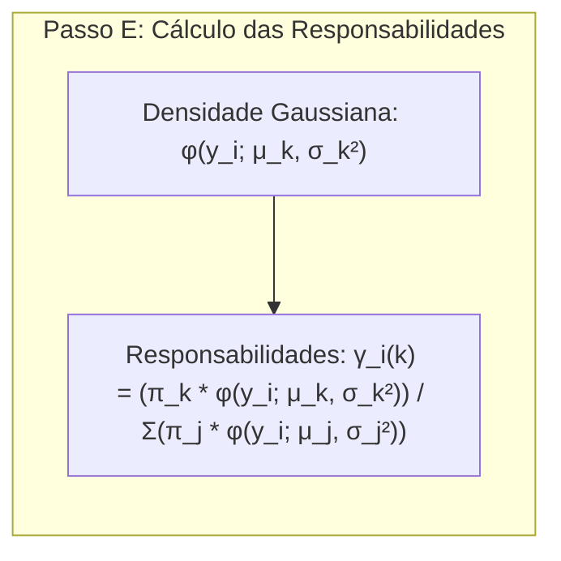

3.  **Passo M (Maximização):** Atualize os parâmetros $\theta$ com base nas responsabilidades calculadas no passo E:
  $$
  \mu_k = \frac{\sum_{i=1}^N \gamma_i(k) y_i}{\sum_{i=1}^N \gamma_i(k)}
  $$
  $$
  \sigma_k^2 = \frac{\sum_{i=1}^N \gamma_i(k) (y_i - \mu_k)^2}{\sum_{i=1}^N \gamma_i(k)}
  $$
  $$
  \pi_k = \frac{\sum_{i=1}^N \gamma_i(k)}{N}
  $$
    onde $N$ é o número total de observações.

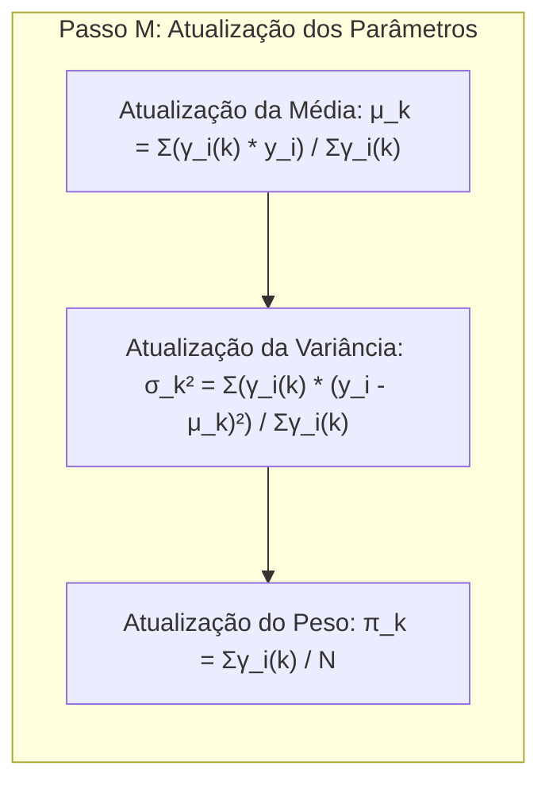
4.  **Repetição:** Repita os passos E e M até que os parâmetros convirjam ou até que um número máximo de iterações seja atingido.

> 💡 **Exemplo Numérico:**
>
>  Vamos considerar um exemplo com 10 observações ($N=10$) e um modelo de mistura com duas Gaussianas ($K=2$). Inicializamos os parâmetros com valores arbitrários: $\pi_1 = 0.5$, $\mu_1 = 2$, $\sigma_1^2 = 1$, $\mu_2 = 8$, e $\sigma_2^2 = 1.5$. As observações são $Y = [1.5, 2.1, 2.8, 7.8, 8.2, 8.8, 2.4, 7.5, 9.1, 1.9]$.
>
> **Passo E (Expectativa):** Vamos calcular as responsabilidades para a primeira observação $y_1 = 1.5$:
>
> $\phi(y_1; \mu_1, \sigma_1^2) = \frac{1}{\sqrt{2\pi}} e^{-\frac{(1.5 - 2)^2}{2*1}} \approx 0.352$
>
> $\phi(y_1; \mu_2, \sigma_2^2) = \frac{1}{\sqrt{2\pi*1.5}} e^{-\frac{(1.5 - 8)^2}{2*1.5}} \approx 0.0003$
>
> $\gamma_1(1) = \frac{0.5 * 0.352}{0.5 * 0.352 + 0.5 * 0.0003} \approx 0.999$
>
> $\gamma_1(2) = 1 - \gamma_1(1) \approx 0.001$
>
> Repetimos este cálculo para todas as observações.
>
> **Passo M (Maximização):** Após calcular as responsabilidades para todas as observações, vamos atualizar os parâmetros. Vamos usar as responsabilidades calculadas para atualizar $\mu_1$:
>
> Supondo que $\sum_{i=1}^{10} \gamma_i(1) y_i = 23.2$ e $\sum_{i=1}^{10} \gamma_i(1) = 9.8$, então:
>
> $\mu_1 = \frac{23.2}{9.8} \approx 2.37$
>
> Similarmente, recalculamos $\mu_2$, $\sigma_1^2$, $\sigma_2^2$, e $\pi_1$. Repetimos os passos E e M iterativamente até a convergência.
>
> ```python
> import numpy as np
> from scipy.stats import norm
>
> # Dados observados
> Y = np.array([1.5, 2.1, 2.8, 7.8, 8.2, 8.8, 2.4, 7.5, 9.1, 1.9])
>
> # Inicialização dos parâmetros
> pi1 = 0.5
> mu1 = 2
> sigma1_sq = 1
> mu2 = 8
> sigma2_sq = 1.5
>
> # Função para calcular densidade Gaussiana
> def gaussian_density(y, mu, sigma_sq):
>     return norm.pdf(y, loc=mu, scale=np.sqrt(sigma_sq))
>
> # Passo E
> def expectation_step(Y, pi1, mu1, sigma1_sq, mu2, sigma2_sq):
>     gamma1 = []
>     gamma2 = []
>     for y in Y:
>         phi1 = gaussian_density(y, mu1, sigma1_sq)
>         phi2 = gaussian_density(y, mu2, sigma2_sq)
>         gamma_i1 = (pi1 * phi1) / (pi1 * phi1 + (1 - pi1) * phi2)
>         gamma_i2 = 1 - gamma_i1
>         gamma1.append(gamma_i1)
>         gamma2.append(gamma_i2)
>     return np.array(gamma1), np.array(gamma2)
>
> # Passo M
> def maximization_step(Y, gamma1, gamma2):
>   N = len(Y)
>   mu1_new = np.sum(gamma1 * Y) / np.sum(gamma1)
>   mu2_new = np.sum(gamma2 * Y) / np.sum(gamma2)
>   sigma1_sq_new = np.sum(gamma1 * (Y - mu1_new)**2) / np.sum(gamma1)
>   sigma2_sq_new = np.sum(gamma2 * (Y - mu2_new)**2) / np.sum(gamma2)
>   pi1_new = np.sum(gamma1) / N
>
>   return pi1_new, mu1_new, sigma1_sq_new, mu2_new, sigma2_sq_new
>
> # Executando o algoritmo EM por 2 iterações
> for _ in range(2):
>    gamma1, gamma2 = expectation_step(Y, pi1, mu1, sigma1_sq, mu2, sigma2_sq)
>    pi1, mu1, sigma1_sq, mu2, sigma2_sq = maximization_step(Y, gamma1, gamma2)
>
> print(f"Parâmetros após 2 iterações: pi1={pi1:.2f}, mu1={mu1:.2f}, sigma1_sq={sigma1_sq:.2f}, mu2={mu2:.2f}, sigma2_sq={sigma2_sq:.2f}")
> ```

**Lemma 2:**  A cada iteração do algoritmo EM, a verossimilhança observada $l(\theta; Z)$ aumenta ou permanece constante [^8.5.2].

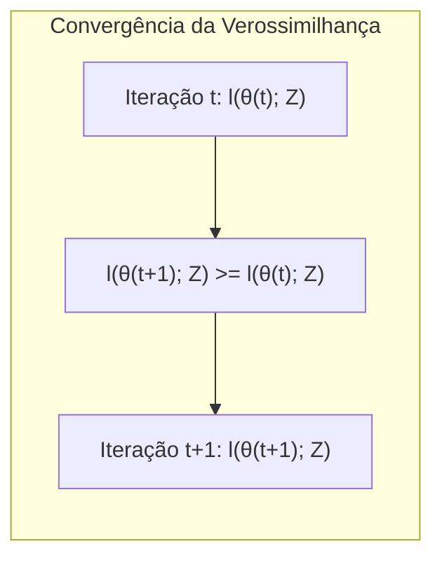
**Prova:**  A prova do aumento da verossimilhança observada em cada iteração é baseada na definição de Q-function e no uso da desigualdade de Jensen (veja Exercício 8.1 no contexto). O passo E calcula a esperança da log-verossimilhança completa, dada a estimativa atual dos parâmetros ($\theta^{(t)}$), i.e. $Q(\theta, \theta^{(t)}) = \mathbb{E} [\log p(Z, Z_m; \theta) | Z, \theta^{(t)}]$. No passo M, maximiza-se $Q(\theta, \theta^{(t)})$ com relação a $\theta$, obtendo a nova estimativa $\theta^{(t+1)} = argmax_{\theta} Q(\theta, \theta^{(t)})$. A desigualdade de Jensen garante que $l(\theta^{(t+1)}; Z) \ge l(\theta^{(t)}; Z)$, mostrando que a verossimilhança observada nunca diminui. $\blacksquare$

**Corolário 2:**  Em modelos de mistura Gaussianos, a convergência do algoritmo EM é garantida (em relação à verossimilhança observada), mas a solução pode ser um máximo local. Para evitar esse problema, é recomendado executar o algoritmo EM várias vezes com diferentes valores iniciais de parâmetros e escolher a solução que leva à maior verossimilhança observada.

### Métodos de Seleção de Variáveis e Regularização no contexto do EM

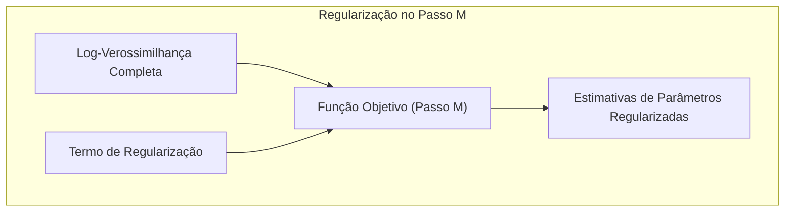

O algoritmo EM, em sua forma básica, não aborda diretamente a seleção de variáveis ou regularização, mas essas técnicas podem ser incorporadas no passo M para melhorar a generalização e a interpretabilidade do modelo. A regularização, por exemplo, pode ser aplicada para evitar o overfitting, o que é especialmente importante em modelos de mistura com um grande número de parâmetros.

Uma forma comum de regularização é adicionar um termo de penalidade à função objetivo no passo M. Por exemplo, em modelos de regressão logística, onde o passo M envolve a maximização da log-verossimilhança, podemos adicionar uma penalidade L1 (LASSO) ou L2 (Ridge) aos coeficientes para promover a esparsidade ou reduzir a magnitude dos coeficientes, respectivamente [^8.5].

Em modelos de mistura Gaussianos, a regularização pode ser aplicada para evitar que as variâncias das componentes se tornem muito pequenas, o que pode levar a soluções instáveis e overfitting. A regularização pode ser incorporada ao passo M do algoritmo EM, adicionando um termo de penalidade ao log da verossimilhança completa. Por exemplo, uma regularização de tipo L2 pode ser aplicada à inversa das variâncias, e essa regularização pode ser incorporada durante a derivação do passo M.

> 💡 **Exemplo Numérico:**
>
> Suponha que no passo M de um modelo de mistura gaussiana, estamos atualizando os parâmetros de variância $\sigma_k^2$. Sem regularização, usaríamos:
>
> $$
> \sigma_k^2 = \frac{\sum_{i=1}^N \gamma_i(k) (y_i - \mu_k)^2}{\sum_{i=1}^N \gamma_i(k)}
> $$
>
> Agora, vamos adicionar uma regularização L2, que penaliza variâncias pequenas, na atualização de $\sigma_k^2$. Um exemplo de regularização poderia ser adicionar um termo $\lambda \frac{1}{\sigma_k^2}$, com $\lambda > 0$:
>
> $$
>  \sigma_k^2 = \frac{\sum_{i=1}^N \gamma_i(k) (y_i - \mu_k)^2 + \lambda}{\sum_{i=1}^N \gamma_i(k) + \lambda/\sigma_k^4}
> $$
>
> Ou alternativamente, uma regularização que adiciona um termo penalizando a inversa da variância:
>
> $$
> \sigma_k^2  = \frac{\sum_{i=1}^N \gamma_i(k) (y_i - \mu_k)^2}{\sum_{i=1}^N \gamma_i(k)} + \lambda
> $$
>
> Por exemplo, se $\sum_{i=1}^N \gamma_i(k) (y_i - \mu_k)^2 = 10$, $\sum_{i=1}^N \gamma_i(k) = 5$, e $\lambda = 0.5$, sem regularização teríamos $\sigma_k^2 = 10/5 = 2$.
> Com a segunda regularização teríamos $\sigma_k^2 = 10/5 + 0.5 = 2.5$. Com a regularização, o valor da variância é "inflado" pela penalidade, prevenindo que a variância vá para um valor muito baixo, o que poderia levar a um overfitting.
>
> ```python
> import numpy as np
>
> # Exemplo sem regularização
> sum_weighted_sq_diff = 10
> sum_responsibilities = 5
> variance_no_reg = sum_weighted_sq_diff / sum_responsibilities
> print(f"Variância sem regularização: {variance_no_reg}")
>
> # Exemplo com regularização
> lambda_reg = 0.5
> variance_reg = sum_weighted_sq_diff / sum_responsibilities + lambda_reg
> print(f"Variância com regularização: {variance_reg}")
> ```

**Lemma 3:** A incorporação de penalidades de regularização no passo M do algoritmo EM pode levar a soluções mais estáveis e generalizáveis, reduzindo o risco de overfitting [^8.5].

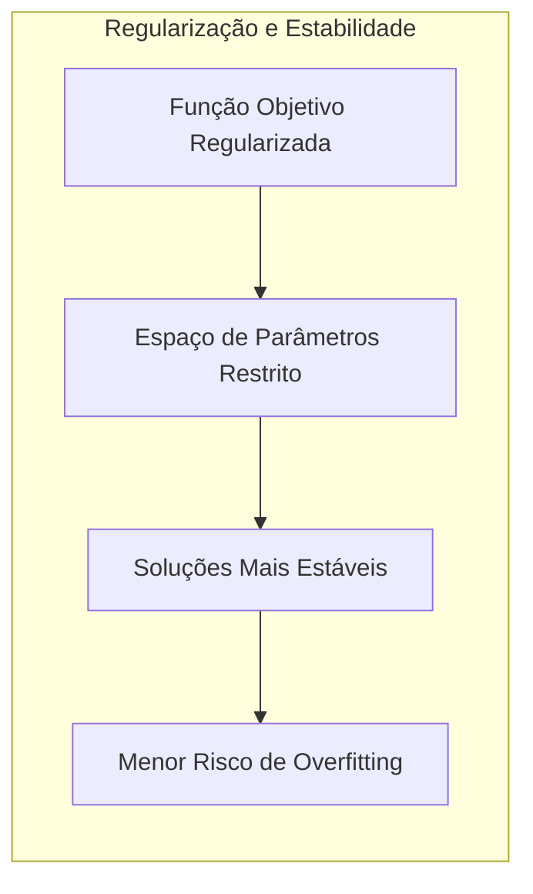
**Prova:** A prova da estabilização através da regularização é baseada na análise da função objetivo penalizada. No passo M do EM, onde originalmente maximizamos $Q(\theta, \theta^{(t)})$, agora maximizamos $Q(\theta, \theta^{(t)}) - \lambda R(\theta)$, onde $R(\theta)$ é o termo de regularização e $\lambda$ é o parâmetro de regularização. A adição do termo de regularização restringe a região de busca no espaço de parâmetros, evitando que a solução explore regiões com valores muito extremos ou instáveis. A escolha apropriada do tipo e do valor do parâmetro de regularização ajuda a controlar a complexidade do modelo e melhorar sua capacidade de generalização. $\blacksquare$

**Corolário 3:** A escolha do tipo e da intensidade da regularização (ou seja, o valor de $\lambda$) deve ser realizada de forma cuidadosa, muitas vezes usando técnicas de validação cruzada ou outras métricas de desempenho, para garantir que a regularização não introduza um viés excessivo e que o modelo seja capaz de generalizar bem para novos dados.

### Separating Hyperplanes e o Algoritmo EM

A relação entre **separating hyperplanes** e o algoritmo EM não é direta, mas em certos contextos, como em modelos de mistura, os hiperplanos podem surgir como fronteiras de decisão entre os componentes do modelo, onde as responsabilidades são usadas para definir a atribuição das amostras a cada grupo. Por exemplo, em modelos de mistura Gaussianos, as fronteiras de decisão entre dois componentes podem ser representadas por hiperplanos no espaço de características.

Em outros contextos, como *Support Vector Machines (SVM)*, os hiperplanos separadores são diretamente aprendidos através de uma maximização da margem, o que não está diretamente relacionado ao EM, mas é possível utilizar métodos de kernel para obter soluções não lineares que se aproximem dos resultados de algoritmos de mistura.

O algoritmo EM pode ser usado de forma indireta no aprendizado de hiperplanos separadores através de modelos latentes, onde a atribuição das amostras a um ou outro grupo é a variável latente. Nesse caso, as responsabilidades do algoritmo EM atuam como medidas de *soft-membership*, indicando a probabilidade de cada amostra pertencer a cada um dos hiperplanos separadores.

### Pergunta Teórica Avançada: Qual a relação entre o algoritmo EM e o método de amostragem de Gibbs?

**Resposta:**

O algoritmo EM e o método de amostragem de Gibbs são ambos métodos iterativos para inferência em modelos com dados latentes, mas eles operam de formas distintas. O algoritmo EM é um método de otimização que busca o máximo da verossimilhança, enquanto o método de Gibbs é um método de amostragem que busca amostras da distribuição *a posteriori*.

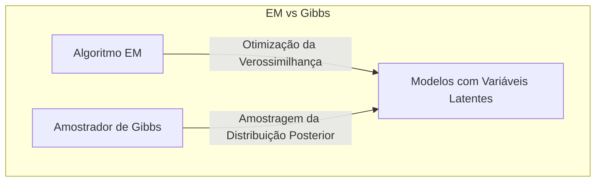
No contexto do algoritmo EM, em cada iteração busca-se a maximização da função $Q$, enquanto no Gibbs sampler busca-se amostrar a distribuição condicional. Apesar de metodologias distintas, ambos os algoritmos iteram sobre a variável latente e sobre os parâmetros do modelo, convergindo para uma solução.

O algoritmo EM, em sua essência, calcula o valor esperado da variável latente no passo E, enquanto o Gibbs sampler amostra a distribuição da variável latente em um processo iterativo. O passo M do algoritmo EM maximiza os parâmetros com base na esperança da variável latente, enquanto o Gibbs sampler amostra os parâmetros com base na distribuição condicional das variáveis latentes amostradas na iteração anterior.

**Lemma 4:** Em certos modelos de família exponencial, o passo E do algoritmo EM pode ser interpretado como o cálculo da esperança condicional das variáveis latentes, enquanto o método de Gibbs amostra dessas mesmas distribuições condicionais [^8.6].

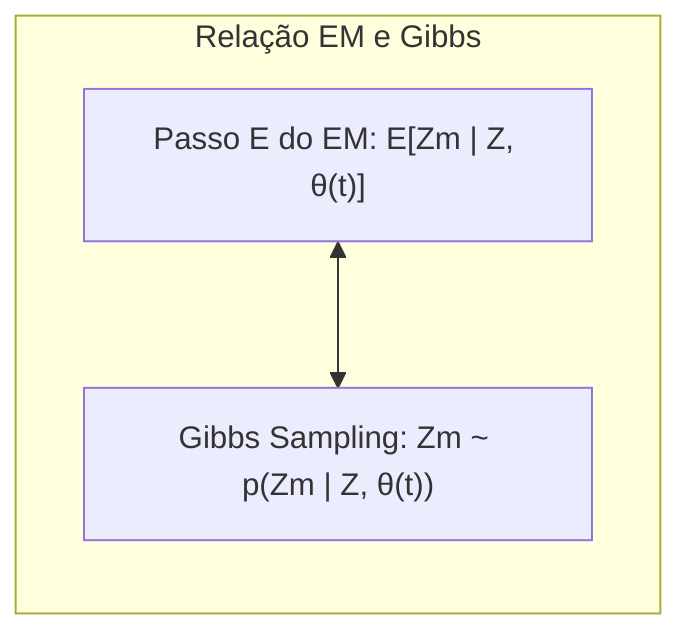
**Prova:**  A prova da relação entre EM e Gibbs sampler passa pela análise das equações de atualização de ambos os métodos. No EM, o passo E computa a esperança de uma função dos dados latentes condicionada aos dados observados e aos parâmetros atuais, enquanto que o Gibbs sampler amostra a variável latente de sua distribuição condicional. Ambos os métodos usam a função $Q$ na derivação, ou seja, ambos iteram sobre as mesmas distribuições condicionais. A diferença está no procedimento: EM busca um máximo, enquanto o Gibbs sampler gera amostras. $\blacksquare$

**Corolário 4:** A convergência do algoritmo EM para um máximo local da verossimilhança, enquanto que o Gibbs sampler, sob condições de ergodicidade, produz amostras da distribuição *a posteriori* que podem ser usadas para obter inferências bayesianas [^8.6].

> ⚠️ **Ponto Crucial:** A principal diferença entre o algoritmo EM e o método de Gibbs reside na sua natureza: o primeiro busca um ponto ótimo, enquanto o segundo busca amostras de uma distribuição.

### Conclusão

Neste capítulo, apresentamos uma introdução detalhada ao algoritmo EM, desde seus conceitos fundamentais até sua aplicação em modelos de mistura e sua relação com o método de Gibbs e regularização. Discutimos a importância do EM em problemas com dados latentes ou faltantes, bem como suas aplicações práticas e fundamentos teóricos.

<!-- END DOCUMENT -->
[^8.1]: "In this chapter we provide a general exposition of the maximum likeli- hood approach, as well as the Bayesian method for inference." *(Trecho de <Model Inference and Averaging>)*
[^8.2]: "Denote the training data by Z = {z1, z2,..., zn}, with zi = (xi, yi), i = 1, 2, ..., N. Here xi is a one-dimensional input, and y₁ the outcome, either continuous or categorical." *(Trecho de <Model Inference and Averaging>)*
[^8.3]: "Suppose we decide to fit a cubic spline to the data, with three knots placed at the quartiles of the X values." *(Trecho de <Model Inference and Averaging>)*
[^8.4]: "In the top right panel of Figure 8.2 we have plotted μ(x) ± 1.96·se[μ(x)]." *(Trecho de <Model Inference and Averaging>)*
[^8.5]: "In essence the bootstrap is a computer implementation of nonparametric or parametric maximum likelihood." *(Trecho de <Model Inference and Averaging>)*
[^8.5.1]: "In this section we describe a simple mixture model for density estimation, and the associated EM algorithm for carrying out maximum likelihood estimation." *(Trecho de <Model Inference and Averaging>)*
[^8.5.2]: "The above procedure is an example of the EM (or Baum-Welch) algorithm for maximizing likelihoods in certain classes of problems." *(Trecho de <Model Inference and Averaging>)*
[^8.6]: "Having defined a Bayesian model, one would like to draw samples from the resulting posterior distribution, in order to make inferences about the parameters." *(Trecho de <Model Inference and Averaging>)*
[^8.7]: "Earlier we introduced the bootstrap as a way of assessing the accuracy of a parameter estimate or a prediction." *(Trecho de <Model Inference and Averaging>)*
[^8.8]: "Here we discuss Bayesian model averaging more generally." *(Trecho de <Model Inference and Averaging>)*
[^8.9]: "The final method described in this chapter does not involve averaging or combining models, but rather is a technique for finding a better single model." *(Trecho de <Model Inference and Averaging>)*
