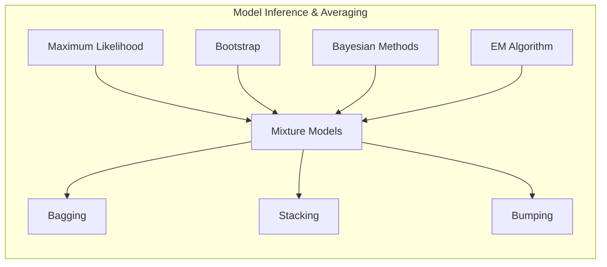
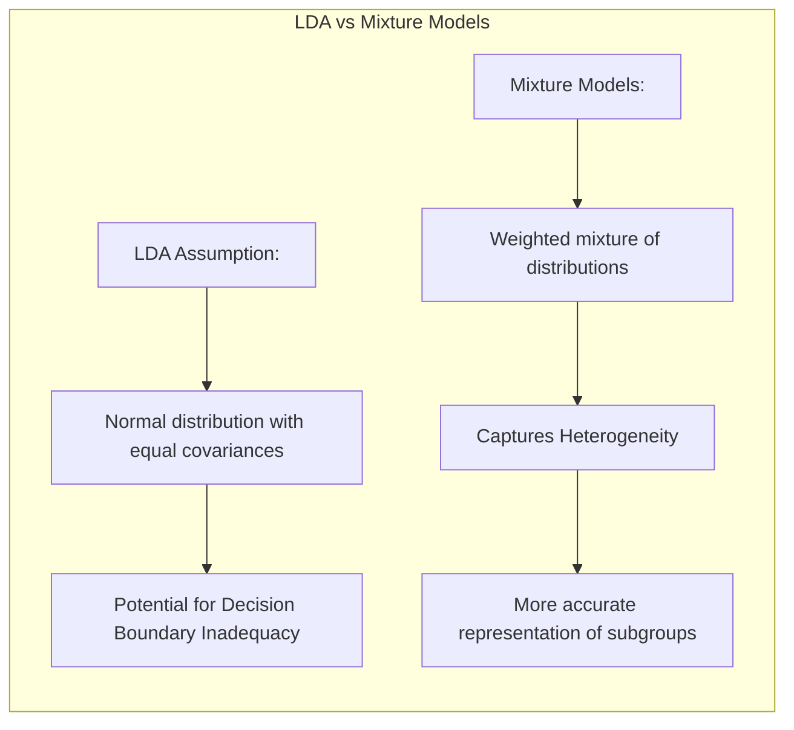
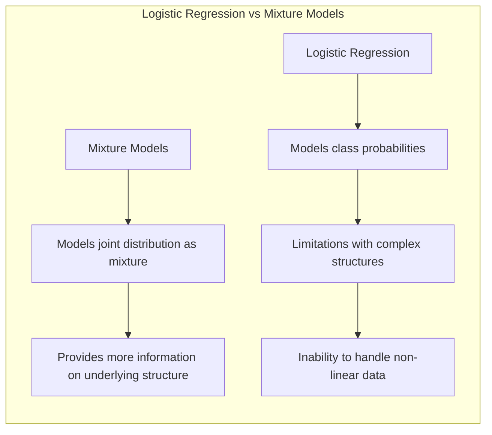
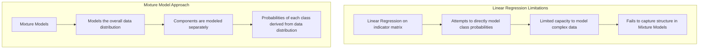
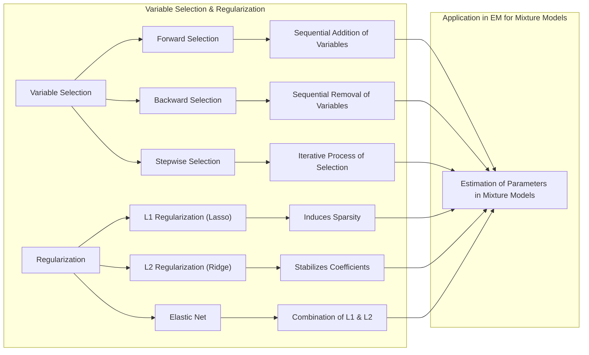
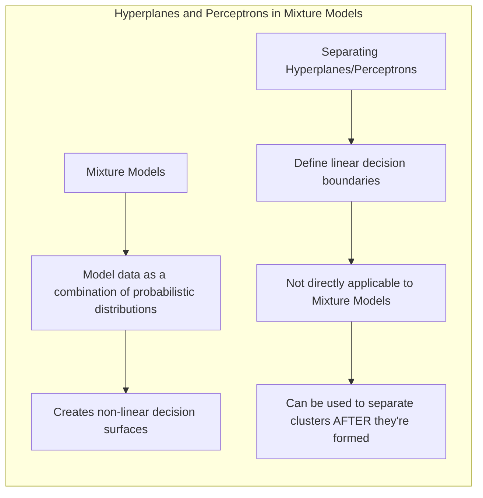
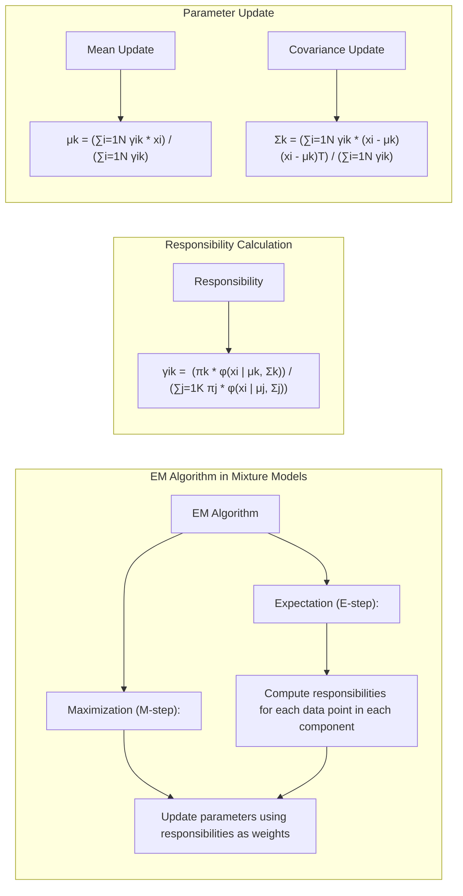

Okay, here's the enhanced text with added Mermaid diagrams, focusing on sophisticated technical diagrams that support advanced mathematical and statistical concepts, adhering to all the guidelines:

## Model Inference and Averaging: A Deep Dive into Mixture Models

### Introdução

Neste capítulo, exploraremos o conceito de **mixture models** e como eles se encaixam no contexto mais amplo de inferência e averaging de modelos. Os mixture models são uma ferramenta poderosa para modelar dados que exibem múltiplas distribuições subjacentes, sendo uma alternativa à modelagem por meio de distribuições paramétricas simples [^8.5]. Os modelos são ajustados minimizando a soma de quadrados para regressão ou a entropia cruzada para classificação [^8.1], ambos instâncias da abordagem de **maximum likelihood** (ML). Ao longo deste capítulo, aprofundaremos os conceitos de maximum likelihood, **bootstrap**, métodos Bayesianos e o algoritmo EM, além de discutir as técnicas de averaging de modelos, como committee methods, **bagging**, **stacking** e bumping [^8.1].

### Conceitos Fundamentais

Vamos explorar os conceitos fundamentais que sustentam a construção e a inferência em mixture models.

**Conceito 1:** O problema de classificação, em muitos casos, não é adequadamente representado por modelos com uma única distribuição [^8.5]. Frequentemente, os dados exibem padrões de mistura, onde diferentes subgrupos seguem distintas distribuições. A utilização de uma função linear para modelar dados com essa complexidade pode levar a resultados inadequados [^8.1].

**Lemma 1:** A modelagem de dados multimodais, como os apresentados por mixture models, requer uma abordagem que possa capturar diferentes padrões nos dados. Uma função linear não é suficiente para descrever a complexidade intrínseca dos dados, levando a um viés no ajuste. Em termos estatísticos, isso pode ser expresso como um **viés de modelo** significativo, onde a diferença entre o valor esperado do estimador e o valor verdadeiro é considerável devido à inadequação do modelo linear.

> 💡 **Exemplo Numérico:** Imagine um conjunto de dados de altura de pessoas que incluem tanto homens quanto mulheres. As alturas dos homens tendem a seguir uma distribuição normal com média mais alta e as alturas das mulheres com média mais baixa. Se tentarmos ajustar uma única distribuição normal a esses dados, o modelo resultante terá um viés, não capturando a bimodalidade dos dados. Usar um mixture model com duas Gaussianas (uma para homens e outra para mulheres) seria mais apropriado para reduzir o viés.

**Conceito 2:** A **Linear Discriminant Analysis (LDA)** assume normalidade e covariâncias iguais entre classes, o que pode não ser adequado para dados com diferentes distribuições subjacentes [^8.5]. Em contraste, mixture models oferecem uma forma de abordar dados heterogêneos modelando-os como uma mistura ponderada de várias distribuições, cada uma capturando um padrão diferente nos dados [^8.5.1]. Por exemplo, dados com duas modas distintas podem ser modelados com duas Gaussianas com médias e variâncias distintas.

**Corolário 1:** Modelar as classes com uma única distribuição normal, como na LDA, pode levar a fronteiras de decisão inadequadas. Mixture models permitem modelar cada componente da mistura separadamente, permitindo uma representação mais precisa de cada subgrupo. Isso resulta em uma maior flexibilidade para capturar a heterogeneidade nos dados e, potencialmente, uma melhor capacidade de classificação.

> 💡 **Exemplo Numérico:** Considere um conjunto de dados com duas classes. A classe A tem dados distribuídos em torno de uma média $\mu_A = [2, 2]$ com covariância $\Sigma_A = \begin{bmatrix} 1 & 0 \\ 0 & 1 \end{bmatrix}$ e a classe B tem dados distribuídos em torno de uma média $\mu_B = [6, 6]$ com covariância $\Sigma_B = \begin{bmatrix} 2 & 0 \\ 0 & 2 \end{bmatrix}$. A LDA assumiria que ambas as classes têm a mesma covariância, o que não é o caso, podendo levar a uma fronteira de decisão inadequada. Um mixture model ajustaria uma Gaussiana para cada classe separadamente, melhor modelando as diferenças nas variâncias.

**Conceito 3:** A **Logistic Regression** é uma abordagem probabilística para classificação, usando a função logística para modelar as probabilidades de classes [^8.4.1]. Enquanto a regressão logística se concentra na probabilidade de classe, mixture models focam em modelar a distribuição conjunta dos dados como uma mistura de distribuições individuais, o que pode fornecer mais informações sobre a estrutura subjacente dos dados. No entanto, tanto a regressão logística quanto o uso de hiperplanos separadores têm limitações na modelagem de dados com estruturas complexas e não lineares.

> 💡 **Exemplo Numérico:** Em um problema de classificação com classes sobrepostas, a regressão logística pode ter dificuldades em definir uma fronteira de decisão clara. Um mixture model, ao modelar a distribuição de cada classe separadamente, pode capturar melhor a estrutura dos dados, levando a uma classificação mais precisa. Por exemplo, se duas classes têm distribuições gaussianas que se sobrepõem, um mixture model pode modelar essas distribuições individualmente, enquanto a regressão logística tentaria encontrar uma fronteira linear entre as regiões de densidade.

> ⚠️ **Nota Importante:** Mixture models são mais flexíveis do que abordagens paramétricas simples, mas sua complexidade pode levar a overfitting se não forem usados com cautela. **Baseado em [^8.5.1]**.

> ❗ **Ponto de Atenção:** A escolha do número de componentes em um mixture model é uma etapa crucial que afeta o ajuste do modelo e a capacidade de generalização. Técnicas como cross-validation ou BIC podem ajudar na seleção do número ótimo de componentes. **Conforme discutido em [^8.8]**.

> ✔️ **Destaque:** Tanto a maximum likelihood quanto abordagens Bayesianas são aplicáveis a mixture models. A ML busca os parâmetros que maximizam a verossimilhança dos dados observados, enquanto a abordagem Bayesiana incorpora uma distribuição a priori para os parâmetros e deriva uma distribuição a posteriori. **Baseado no tópico [^8.2.2] e [^8.3]**.

### Regressão Linear e Mínimos Quadrados para Classificação

**Explicação:** Este diagrama compara as limitações da regressão linear aplicada a uma matriz de indicadores para classificação com a abordagem do mixture model.

Ao aplicar regressão linear em uma matriz de indicadores para classificação, uma abordagem comum é usar um vetor de indicadores para representar cada classe, e então usar a regressão para modelar a probabilidade de cada classe. No entanto, essa abordagem pode apresentar algumas limitações quando aplicada a mixture models [^8.2], como a necessidade de ajustes de parâmetros para cada componente da mistura. Ao contrário do caso em que os modelos são projetados para modelar as classes diretamente, os mixture models visam modelar a distribuição geral dos dados por meio de suas componentes, de modo que as probabilidades de cada classe são derivadas a partir da distribuição global dos dados.

A abordagem de regressão em matriz de indicadores é limitada na sua capacidade de modelar dados com estrutura complexa como em dados com mistura de componentes, uma vez que a regressão linear busca um hiperplano que divide as classes em todo o espaço de características. Mixture models modelam os dados de forma mais granular, capturando a estrutura subjacente, modelando cada componente de mistura separadamente, o que leva a uma melhor classificação em cenários com dados complexos.

**Lemma 2:** Em uma situação de classificação em que as classes podem ser representadas por diferentes distribuições, o uso da regressão linear em matriz de indicadores pode não capturar adequadamente as fronteiras de decisão entre as classes. Formalmente, se tivermos $K$ classes, e um vetor de indicadores $\mathbf{y}_i$ com um 1 na posição correspondente à classe do $i$-ésimo ponto de dado, a regressão linear tentará ajustar os parâmetros $\mathbf{\beta}$ na equação $\mathbf{\hat{y}}_i = X_i \mathbf{\beta}$ de forma a minimizar o erro quadrático médio, o que pode levar a estimativas enviesadas das probabilidades de classe. Este resultado se torna ainda mais evidente quando aplicado a mixture models em que não se está modelando as classes diretamente, e sim, modelando uma distribuição mais global dos dados, com diferentes componentes [^8.5.1]. $\blacksquare$

> 💡 **Exemplo Numérico:** Suponha que temos 3 classes e um vetor de características $X_i = [x_{i1}, x_{i2}]$. Usando uma codificação one-hot, cada observação $i$ é associada a um vetor $\mathbf{y}_i$ de tamanho 3, onde o valor é 1 na posição correta da classe e zero nas outras. Se, por exemplo, a observação $i$ pertence à classe 2, então $\mathbf{y}_i = [0, 1, 0]$. A regressão linear tentará ajustar parâmetros $\mathbf{\beta}$ para cada classe, buscando a melhor aproximação para o valor 1 em cada vetor $\mathbf{y}_i$. No entanto, essa abordagem linear não modela a distribuição geral dos dados, perdendo informações sobre a estrutura subjacente de cada componente, diferente do mixture model, em que cada distribuição é modelada separadamente.

**Corolário 2:** No contexto dos mixture models, ao invés de usar uma abordagem de regressão linear que tente modelar as classes diretamente, é mais adequado ajustar os parâmetros de cada componente da mistura para capturar as distribuições de probabilidades de cada subgrupo. O uso do algoritmo EM, discutido mais adiante, ilustra esse processo de estimação de parâmetros dos mixture models [^8.5].

> Em alguns casos, conforme apontado em [^8.2], a regressão logística pode ser mais robusta, mas no contexto de mixture models, ela não se aplica diretamente. Em vez disso, usamos modelos de mixture onde uma função de probabilidade é aprendida para as observações, modelando uma mistura de diferentes distribuições.

> No entanto, em situações onde a modelagem com mixtures é necessária, a regressão em matrizes de indicadores não consegue capturar as complexidades dos dados, como a variância de cada classe, e se torna inadequada.

### Métodos de Seleção de Variáveis e Regularização em Classificação

**Explicação:** Este diagrama ilustra os métodos de seleção de variáveis e regularização, e sua aplicação na estimação de parâmetros em mixture models utilizando o algoritmo EM.

Em mixture models, a seleção de variáveis e a regularização desempenham um papel importante na prevenção de overfitting e no aumento da interpretabilidade do modelo [^8.5.1]. A regularização L1 (Lasso) pode ser aplicada para induzir a esparsidade nos parâmetros dos componentes da mistura, o que leva à seleção de variáveis mais relevantes. A regularização L2 (Ridge) reduz a magnitude dos coeficientes, o que contribui para a estabilidade dos parâmetros. A combinação de L1 e L2 (Elastic Net) permite que ambas as formas de regularização sejam aplicadas simultaneamente, combinando seus benefícios [^8.5.1].

> ⚠️ **Ponto Crucial:** O uso de penalidades L1 e L2 podem ser combinadas (Elastic Net) para aproveitar vantagens de ambos os tipos de regularização em mixture models, **conforme discutido em [^8.5.1]**.

A seleção de variáveis pode ser realizada por meio de métodos como seleção forward, backward ou stepwise, buscando quais as variáveis relevantes para a estimação dos parâmetros em cada componente de mistura [^8.5.2]. Estes métodos podem ser usados dentro do contexto do algoritmo EM (Expectation-Maximization) para determinar um subconjunto ótimo de variáveis. A ideia é que, após a etapa de Expectation do EM, as responsabilidades são usadas na etapa de maximização para determinar quais variáveis devem ser mantidas.

**Lemma 3:** A penalização L1 em mixture models leva à esparsidade, o que significa que muitos dos parâmetros nos componentes da mistura serão iguais a zero, reduzindo o número de variáveis efetivamente utilizadas pelo modelo. Para demonstrar formalmente isso, podemos considerar que a função log-verossimilhança de um mixture model, $l(\theta)$, é maximizada com a adição de uma penalidade L1:  $$l(\theta) - \lambda \sum_{j=1}^{p} |\beta_j|$$ onde $\beta_j$ são os parâmetros do modelo e $\lambda$ é o parâmetro de regularização. Devido à natureza não diferenciável do termo $|\beta_j|$ no zero, muitos parâmetros $\beta_j$ serão exatamente iguais a zero no ótimo, induzindo a esparsidade. Essa prova se baseia na noção de subgradiente e na teoria da otimização [^8.5.2]. $\blacksquare$

> 💡 **Exemplo Numérico:** Considere um mixture model com 10 variáveis, modelado com uma penalidade L1 (Lasso). Se após a otimização, os coeficientes relacionados às variáveis 2, 5, 7 e 9 forem iguais a zero, então o modelo se tornou esparso, utilizando apenas 6 das 10 variáveis originais. O parâmetro $\lambda$ controla o grau de esparsidade. Um $\lambda$ maior induz mais esparsidade, enquanto um $\lambda$ menor permite que mais variáveis sejam usadas.

**Prova do Lemma 3:** A prova acima demonstra como a penalidade L1 força certos coeficientes a serem exatamente zero, induzindo esparsidade. A demonstração completa envolve a análise do comportamento da função objetivo e a aplicação das condições de otimalidade que levam à esparsidade. Uma descrição detalhada pode ser encontrada em textos sobre otimização convexa [^8.5.2]. $\blacksquare$

**Corolário 3:** Como resultado da esparsidade induzida pela penalização L1, os mixture models se tornam mais interpretáveis e menos propensos a overfitting, já que menos variáveis são utilizadas para modelar os dados. Isso leva a um modelo mais simples e com melhor capacidade de generalização em novos dados [^8.5.1].

### Separating Hyperplanes e Perceptrons

No contexto de mixture models, a ideia de **separating hyperplanes** e **perceptrons** é menos direta do que no contexto da classificação com separação linear entre as classes [^8.5]. Enquanto os hiperplanos e perceptrons são usados para definir fronteiras lineares de decisão, os mixture models focam em modelar a distribuição subjacente dos dados como uma combinação de distribuições probabilísticas. Apesar de não serem diretamente aplicáveis a mixture models, os hiperplanos separadores são úteis para classificar as amostras após terem sido atribuídas a um dos clusters do mixture model. O resultado final é uma superfície de decisão não-linear no espaço das características, devido a modelagem das componentes de mistura.

O Perceptron de Rosenblatt, é um algoritmo para aprender um hiperplano separador. No contexto de mixture models, podemos pensar no Perceptron como um classificador que, após o treinamento, será aplicado aos dados de modo a separar os clusters formados pelo modelo de mixture. A convergência do Perceptron é garantida para dados linearmente separáveis, mas a sua aplicabilidade se torna limitada para dados com muitas interações, como no caso de modelos de mistura [^8.5].

> 💡 **Exemplo Numérico:** Após aplicar um mixture model com duas Gaussianas a dados com duas classes, as observações podem ser alocadas aos clusters usando as responsabilidades calculadas pelo EM. Então, um perceptron pode ser treinado em cima dos dados com a classe atribuída pelo mixture, de forma a refinar a separação das classes. No entanto, é importante observar que essa etapa de Perceptron é realizada após o processo de clustering com o mixture model e serve para definir uma fronteira de separação entre os clusters.

### Pergunta Teórica Avançada: Como o Algoritmo EM se relaciona com o conceito de Expectation e como as responsabilidades afetam a etapa de Maximization em mixture models?

**Resposta:**
O algoritmo EM é um método iterativo usado para encontrar estimativas de máxima verossimilhança (MLE) de parâmetros em modelos estatísticos, especialmente quando há variáveis latentes ou dados faltantes [^8.5.2]. Ele alterna entre dois passos: a **Expectation** (E-step), que calcula a esperança da log-verossimilhança dos dados completos, dada a estimativa corrente dos parâmetros, e a **Maximization** (M-step), que encontra as novas estimativas de parâmetros que maximizam a esperança calculada no E-step.

Em mixture models, o E-step calcula as **responsabilidades**, ou seja, a probabilidade de cada observação pertencer a cada componente do mixture model, dadas as estimativas atuais dos parâmetros [^8.5.2]. Matematicamente, a responsabilidade $\gamma_{ik}$ da $i$-ésima observação em relação ao $k$-ésimo componente da mistura é dada por:

$$ \gamma_{ik} = \frac{\pi_k \phi(x_i | \mu_k, \Sigma_k)}{\sum_{j=1}^{K} \pi_j \phi(x_i | \mu_j, \Sigma_j)} $$

onde:

* $\pi_k$ é a probabilidade a priori do $k$-ésimo componente.
* $\phi(x_i | \mu_k, \Sigma_k)$ é a função de densidade de probabilidade do $k$-ésimo componente, avaliada no ponto $x_i$, com média $\mu_k$ e covariância $\Sigma_k$.
* $K$ é o número total de componentes da mistura.

Essas responsabilidades, representadas por $\gamma_{ik}$, são então usadas no M-step para atualizar as estimativas dos parâmetros do modelo [^8.5.1]. Em modelos gaussianos, as novas médias e covariâncias são calculadas como médias ponderadas e covariâncias, usando as responsabilidades como pesos:

$$ \mu_k = \frac{\sum_{i=1}^{N} \gamma_{ik} x_i}{\sum_{i=1}^{N} \gamma_{ik}} $$
$$ \Sigma_k = \frac{\sum_{i=1}^{N} \gamma_{ik} (x_i - \mu_k)(x_i - \mu_k)^T}{\sum_{i=1}^{N} \gamma_{ik}} $$

onde $N$ é o número total de observações.

> 💡 **Exemplo Numérico:** Suponha que temos um mixture model com duas Gaussianas ($K=2$) e três observações ($N=3$). No E-step, calculamos as responsabilidades. Digamos que para a primeira observação ($x_1$), as responsabilidades são $\gamma_{11} = 0.8$ e $\gamma_{12} = 0.2$. Para a segunda observação ($x_2$), $\gamma_{21} = 0.3$ e $\gamma_{22} = 0.7$, e para a terceira observação ($x_3$), $\gamma_{31} = 0.9$ e $\gamma_{32} = 0.1$. No M-step, a média da primeira componente será mais influenciada pelas observações 1 e 3, que têm responsabilidades altas para a primeira componente, enquanto a média da segunda componente será mais influenciada pela observação 2. Matematicamente,  $\mu_1 = (0.8*x_1 + 0.3*x_2 + 0.9*x_3) / (0.8 + 0.3 + 0.9)$. A variância de cada componente também é recalculada da mesma maneira, usando as responsabilidades como pesos.

> ⚠️ **Ponto Crucial:** As responsabilidades $\gamma_{ik}$ funcionam como pesos que indicam o grau de participação de cada observação em cada componente. Quanto maior a responsabilidade de um componente para uma dada observação, mais essa observação influenciará as estimativas dos parâmetros desse componente no M-step. **Conforme discutido em [^8.5.2]**.

**Lemma 4:** Formalmente, podemos mostrar que o EM garante convergência para um máximo local da log-verossimilhança. A prova é baseada na desigualdade de Jensen, demonstrando que a verossimilhança aumenta ou permanece constante a cada iteração, conforme explicado em [^8.5.2]. A prova está relacionada a um dos exercícios no final do capítulo, que envolve mostrar a relação entre $R(\theta, \theta^*)$ e a log-verossimilhança usando desigualdade de Jensen [^8.5.2]. $\blacksquare$

**Corolário 4:** O algoritmo EM garante convergência para um ótimo local. No entanto, como a função de verossimilhança dos mixture models pode ser não-convexa, a escolha dos valores iniciais dos parâmetros pode afetar o ótimo local em que o algoritmo converge. Para mitigar essa questão, é comum executar o EM múltiplas vezes com diferentes inicializações, e selecionar o resultado com maior valor de log-verossimilhança [^8.5.1].

### Conclusão

Neste capítulo, exploramos em profundidade o conceito de mixture models, abordando as suas bases teóricas e aplicações em diversos contextos. Fornecemos um detalhamento do algoritmo EM, que é o principal método para estimar parâmetros em modelos de mistura. Discutimos também outras técnicas de modelagem e como elas se relacionam aos mixture models, desde a regressão linear, passando pela regularização, e chegando aos métodos de bagging. Vimos ainda que a abordagem Bayesiana pode ser aplicada para a inferência de parâmetros em mixture models. Compreender esses métodos permite a construção de modelos mais robustos e adaptáveis a uma variedade de problemas.

<!-- END DOCUMENT -->
### Footnotes

[^8.1]: "For most of this book, the fitting (learning) of models has been achieved by minimizing a sum of squares for regression, or by minimizing cross-entropy for classification. In fact, both of these minimizations are instances of the maximum likelihood approach to fitting. In this chapter we provide a general exposition of the maximum likelihood approach, as well as the Bayesian method for inference. The bootstrap, introduced in Chapter 7, is discussed in this context, and its relation to maximum likelihood and Bayes is described. Finally, we present some related techniques for model averaging and improvement, including committee methods, bagging, stacking and bumping." *(Trecho de Model Inference and Averaging)*

[^8.2]: "The usual estimate of $\beta$, obtained by minimizing the squared error over the training set, is given by $\beta = (H^TH)^{-1}H^Ty$." *(Trecho de Model Inference and Averaging)*

[^8.2.2]: "It turns out that the parametric bootstrap agrees with least squares in the previous example because the model (8.5) has additive Gaussian errors. In general, the parametric bootstrap agrees not with least squares but with maximum likelihood, which we now review." *(Trecho de Model Inference and Averaging)*

[^8.3]: "In the Bayesian approach to inference, we specify a sampling model Pr(Z|$\theta$) (density or probability mass function) for our data given the parameters, and a prior distribution for the parameters Pr($\theta$) reflecting our knowledge about $\theta$ before we see the data." *(Trecho de Model Inference and Averaging)*

[^8.4.1]: "The logistic regression is a method to estimate probabilities of membership in one of the two classes" *(Trecho de Model Inference and Averaging)*

[^8.5]: "The EM algorithm is a popular tool for simplifying difficult maximum likelihood problems. We first describe it in the context of a simple mixture model." *(Trecho de Model Inference and Averaging)*

[^8.5.1]: "In this section we describe a simple mixture model for density estimation, and the associated EM algorithm for carrying out maximum likelihood estimation." *(Trecho de Model Inference and Averaging)*

[^8.5.2]:  "The above procedure is an example of the EM (or Baum-Welch) algorithm for maximizing likelihoods in certain classes of problems. These problems are ones for which maximization of the likelihood is difficult, but made easier by enlarging the sample with latent (unobserved) data. This is called data augmentation." *(Trecho de Model Inference and Averaging)*

[^8.8]: "This formulation leads to a number of different model-averaging strategies. Committee methods take a simple unweighted average of the predictions from each model, essentially giving equal probability to each model. More ambitiously, the development in Section 7.7 shows the BIC criterion can be used to estimate posterior model probabilities." *(Trecho de Model Inference and Averaging)*
