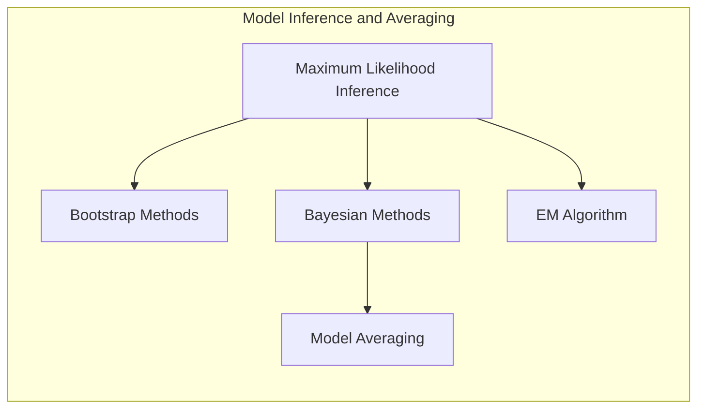
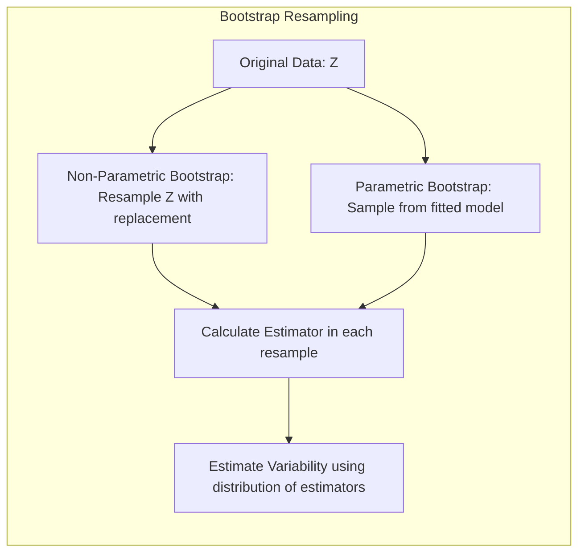
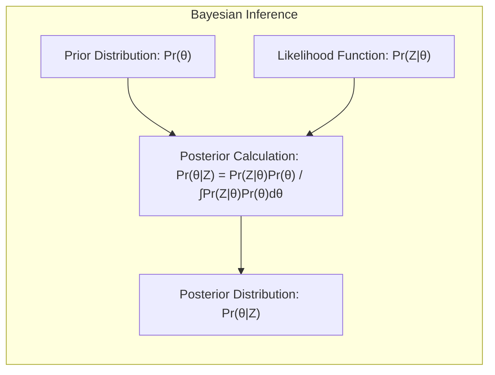
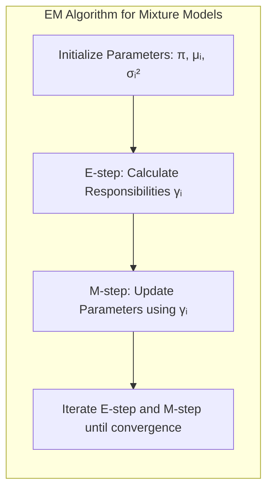
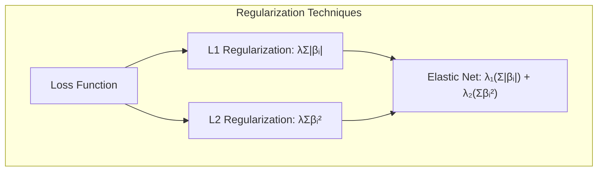

## Log-Likelihood e Modelos de Mistura: Uma Análise Detalhada



### Introdução

Neste capítulo, exploraremos a fundo a **inferência de modelos** e técnicas de **model averaging**, com foco particular em **modelos de mistura** e a maximização da função de **log-verossimilhança**. O conceito central, como apontado em [^8.1], é que muitos dos métodos de ajuste de modelos, como minimizar a soma de quadrados para regressão ou a entropia cruzada para classificação, são, na verdade, instâncias da abordagem de **máxima verossimilhança (maximum likelihood)**. Além disso, examinaremos métodos Bayesianos para inferência e abordaremos técnicas de *bootstrap* para avaliação de incertezas, conectando-as a estimativas de máxima verossimilhança e abordagens Bayesianas. Técnicas de model averaging, como committee methods, bagging, stacking e bumping serão exploradas [^8.1].

### Conceitos Fundamentais

**Conceito 1: Maximum Likelihood Inference**
A **maximum likelihood inference** busca encontrar os parâmetros de um modelo probabilístico que maximizam a verossimilhança dos dados observados [^8.1], [^8.2.2]. Dado um conjunto de dados $Z = \{z_1, z_2, \ldots, z_N\}$, onde cada $z_i$ é uma observação, e uma família de distribuições de probabilidade $g_\theta(z)$, parametrizada por $\theta$, a verossimilhança é dada por:

$$L(\theta; Z) = \prod_{i=1}^{N} g_\theta(z_i)$$

O objetivo é encontrar o valor de $\theta$ que maximiza $L(\theta; Z)$.  Para simplificar os cálculos, é comum trabalhar com o logaritmo da verossimilhança, a **log-likelihood** [^8.2.2]:

$$l(\theta; Z) = \sum_{i=1}^{N} \log g_\theta(z_i)$$

O método de **máxima verossimilhança (maximum likelihood)** escolhe o valor $\hat{\theta}$ que maximiza $l(\theta; Z)$. A log-verossimilhança é uma função que expressa a compatibilidade dos dados com os parâmetros do modelo.

> 💡 **Exemplo Numérico:** Suponha que temos um conjunto de dados com 3 observações, $Z = \{2, 3, 5\}$, e que nosso modelo assume que os dados são amostrados de uma distribuição normal com média $\mu$ e desvio padrão $\sigma = 1$. Queremos encontrar o valor de $\mu$ que maximiza a verossimilhança. A função de densidade normal é dada por $g_\mu(z_i) = \frac{1}{\sqrt{2\pi}} e^{-\frac{(z_i-\mu)^2}{2}}$. A log-verossimilhança para este problema é:
>
> $$l(\mu; Z) = \sum_{i=1}^{3} \log\left(\frac{1}{\sqrt{2\pi}} e^{-\frac{(z_i-\mu)^2}{2}}\right) =  -\frac{3}{2}\log(2\pi) - \frac{1}{2}\sum_{i=1}^{3} (z_i - \mu)^2 $$
>
> Maximizar a log-verossimilhança é equivalente a minimizar $\sum_{i=1}^{3} (z_i - \mu)^2$. A solução para este problema é a média amostral, $\hat{\mu} = \frac{2 + 3 + 5}{3} = \frac{10}{3} \approx 3.33$.  Este valor de $\hat{\mu}$ é o que maximiza a log-verossimilhança dos dados sob a suposição de que os dados seguem uma distribuição normal com desvio padrão 1.
>
> ```python
> import numpy as np
> from scipy.stats import norm
>
> data = np.array([2, 3, 5])
> mu_values = np.linspace(0, 7, 100)
> log_likelihoods = []
>
> for mu in mu_values:
>     log_likelihood = np.sum(norm.logpdf(data, loc=mu, scale=1))
>     log_likelihoods.append(log_likelihood)
>
> import matplotlib.pyplot as plt
> plt.plot(mu_values, log_likelihoods)
> plt.xlabel('Média (μ)')
> plt.ylabel('Log-Verossimilhança')
> plt.title('Log-Verossimilhança vs Média')
> plt.grid(True)
> plt.show()
>
> mle_mu = np.mean(data)
> print(f"Estimativa de Máxima Verossimilhança para μ: {mle_mu}")
> ```

**Lemma 1:** *Sob certas condições de regularidade, o estimador de máxima verossimilhança é consistente e assintoticamente normal.* A prova deste lemma envolve condições técnicas sobre a suavidade da função de verossimilhança e a identificabilidade dos parâmetros, garantindo a convergência do estimador para o verdadeiro valor do parâmetro com o aumento do tamanho da amostra e a convergência para uma distribuição normal [^8.2.2].

**Conceito 2: O Método Bootstrap**
O **bootstrap** é uma técnica de reamostragem computacional que permite estimar a variabilidade de um estimador estatístico [^8.1], [^8.2.1]. A ideia central é gerar múltiplas amostras a partir dos dados observados, replicando o processo de coleta de dados. Em cada uma dessas amostras, o estimador desejado é calculado. A variabilidade dos valores do estimador obtidos nessas réplicas bootstrap fornece uma estimativa da sua variabilidade na amostra original. Existem dois tipos principais de bootstrap: o **não paramétrico** e o **paramétrico**. No bootstrap não paramétrico, amostras são obtidas com reposição a partir dos dados originais. No bootstrap paramétrico, as amostras são geradas a partir do modelo ajustado aos dados. A distribuição dos estimadores bootstrap é então usada para calcular erros padrão ou intervalos de confiança. A importância do bootstrap reside em sua capacidade de fornecer estimativas de incerteza para situações onde abordagens analíticas são difíceis ou impossíveis de aplicar [^8.2.1].



> 💡 **Exemplo Numérico:** Vamos considerar o mesmo conjunto de dados $Z = \{2, 3, 5\}$ e calcular a variabilidade da média usando bootstrap não paramétrico.
>
> 1.  **Reamostragem:** Vamos gerar 5 amostras bootstrap com reposição:
>     *   Amostra 1: $\{2, 2, 3\}$
>     *   Amostra 2: $\{3, 5, 5\}$
>     *   Amostra 3: $\{2, 3, 5\}$
>     *   Amostra 4: $\{5, 2, 2\}$
>     *   Amostra 5: $\{3, 3, 3\}$
>
> 2.  **Cálculo do Estimador:** Calculamos a média de cada amostra:
>     *   $\bar{x}_1 = (2 + 2 + 3) / 3 = 2.33$
>     *   $\bar{x}_2 = (3 + 5 + 5) / 3 = 4.33$
>     *   $\bar{x}_3 = (2 + 3 + 5) / 3 = 3.33$
>     *   $\bar{x}_4 = (5 + 2 + 2) / 3 = 3$
>     *   $\bar{x}_5 = (3 + 3 + 3) / 3 = 3$
>
> 3.  **Variabilidade:** A variabilidade dessas médias bootstrap nos dá uma estimativa da variabilidade da média amostral.  Podemos calcular o desvio padrão das médias bootstrap para obter um erro padrão:
>
> $$ \text{Desvio padrão das médias bootstrap} \approx 0.76 $$
>
> Este valor nos dá uma ideia da precisão da nossa estimativa da média a partir da amostra original. Podemos aumentar o número de amostras bootstrap para obter uma estimativa mais precisa.
>
> ```python
> import numpy as np
>
> data = np.array([2, 3, 5])
> n_bootstrap_samples = 1000
> bootstrap_means = []
>
> for _ in range(n_bootstrap_samples):
>     bootstrap_sample = np.random.choice(data, size=len(data), replace=True)
>     bootstrap_mean = np.mean(bootstrap_sample)
>     bootstrap_means.append(bootstrap_mean)
>
> bootstrap_std = np.std(bootstrap_means)
> print(f"Desvio padrão das médias bootstrap: {bootstrap_std:.3f}")
>
> import matplotlib.pyplot as plt
> plt.hist(bootstrap_means, bins=30, density=True, alpha=0.7, color='skyblue', edgecolor='black')
> plt.xlabel('Médias Bootstrap')
> plt.ylabel('Densidade')
> plt.title('Histograma das Médias Bootstrap')
> plt.grid(True)
> plt.show()
> ```

**Corolário 1:** *Sob condições adequadas, o bootstrap paramétrico e o estimador de máxima verossimilhança convergem para a mesma distribuição assintótica.* Este resultado enfatiza a conexão entre as abordagens bootstrap e máxima verossimilhança, demonstrando como ambos os métodos levam a inferências similares para o comportamento assintótico dos parâmetros [^8.2.2].

**Conceito 3: Métodos Bayesianos**
A abordagem **Bayesiana** para inferência incorpora uma *prior distribution* sobre os parâmetros do modelo, expressando o conhecimento prévio antes de observar os dados [^8.1], [^8.3]. Dado um modelo estatístico com parâmetros $\theta$, uma *prior distribution* $Pr(\theta)$ e uma verossimilhança $Pr(Z|\theta)$, a distribuição *posterior* $Pr(\theta|Z)$ é dada por:

$$Pr(\theta|Z) = \frac{Pr(Z|\theta)Pr(\theta)}{\int Pr(Z|\theta)Pr(\theta)d\theta}$$

A *posterior distribution* representa o conhecimento atualizado sobre os parâmetros, levando em consideração tanto as informações prévias quanto os dados observados. A inferência Bayesiana envolve analisar a distribuição *posterior*, seja através de amostragem ou cálculo de momentos, ao invés de apenas um ponto estimado. Esta abordagem permite quantificar a incerteza sobre os parâmetros de maneira mais completa, incluindo tanto a incerteza a priori quanto aquela obtida com os dados [^8.3].



> 💡 **Exemplo Numérico:** Vamos usar o mesmo exemplo de dados $Z = \{2, 3, 5\}$ e assumir que eles seguem uma distribuição normal com desvio padrão $\sigma=1$ e média $\mu$. Vamos usar uma prior normal para $\mu$, com média 0 e desvio padrão 2. Ou seja, $Pr(\mu) = \mathcal{N}(0, 2^2)$. A verossimilhança é $Pr(Z|\mu) = \prod_{i=1}^3 \frac{1}{\sqrt{2\pi}} e^{-\frac{(z_i-\mu)^2}{2}}$. A *posterior* é:
>
> $$Pr(\mu|Z) \propto  Pr(Z|\mu)Pr(\mu) = \prod_{i=1}^3 \frac{1}{\sqrt{2\pi}} e^{-\frac{(z_i-\mu)^2}{2}} \cdot \frac{1}{\sqrt{2\pi \cdot 2^2}} e^{-\frac{\mu^2}{2\cdot 2^2}}$$
>
>  A distribuição *posterior* também será uma normal.  Após alguns cálculos algébricos, obtemos que a *posterior* é:
>
> $$Pr(\mu|Z) = \mathcal{N}\left(\frac{\sum_{i=1}^3 z_i/1^2 + 0/2^2}{\frac{3}{1^2}+\frac{1}{2^2}}, \left(\frac{3}{1^2} + \frac{1}{2^2}\right)^{-1}\right) = \mathcal{N}\left(\frac{10}{\frac{13}{4}}, \left(\frac{13}{4}\right)^{-1}\right) = \mathcal{N}\left(\frac{40}{13}, \frac{4}{13}\right)$$
>
> A média da *posterior* é $\frac{40}{13} \approx 3.08$, que é diferente da média de máxima verossimilhança de 3.33, devido à influência da prior. O desvio padrão da *posterior* é $\sqrt{\frac{4}{13}} \approx 0.55$, que quantifica a incerteza sobre $\mu$ após observar os dados e considerar a prior.
>
> ```python
> import numpy as np
> from scipy.stats import norm
>
> data = np.array([2, 3, 5])
> prior_mean = 0
> prior_std = 2
> data_std = 1
>
> posterior_mean = (np.sum(data) / data_std**2 + prior_mean / prior_std**2) / (len(data) / data_std**2 + 1 / prior_std**2)
> posterior_variance = 1 / (len(data) / data_std**2 + 1 / prior_std**2)
> posterior_std = np.sqrt(posterior_variance)
>
> print(f"Média da Posterior: {posterior_mean:.2f}")
> print(f"Desvio Padrão da Posterior: {posterior_std:.2f}")
>
> import matplotlib.pyplot as plt
>
> mu_values = np.linspace(-3, 8, 200)
> prior_density = norm.pdf(mu_values, loc=prior_mean, scale=prior_std)
> likelihood_values = np.prod(norm.pdf(data[:, None], loc=mu_values, scale=data_std), axis=0)
> posterior_density = norm.pdf(mu_values, loc=posterior_mean, scale=posterior_std)
>
> plt.plot(mu_values, prior_density, label='Prior', linestyle='--')
> plt.plot(mu_values, likelihood_values / np.max(likelihood_values), label='Verossimilhança', linestyle=':')
> plt.plot(mu_values, posterior_density, label='Posterior')
> plt.xlabel('Média (μ)')
> plt.ylabel('Densidade (normalizada)')
> plt.title('Prior, Verossimilhança e Posterior')
> plt.legend()
> plt.grid(True)
> plt.show()
> ```

> ⚠️ **Nota Importante**: Em contraste com a abordagem frequentista, a abordagem Bayesiana usa uma *prior distribution* para expressar incertezas antes de observar os dados, conforme descrito em [^8.3].
> ❗ **Ponto de Atenção**: A distribuição *posterior* expressa a incerteza após ver os dados, e é o foco da análise bayesiana, conforme indicado em [^8.3].
> ✔️ **Destaque**: Amostragem da *posterior distribution* permite a obtenção de intervalos de credibilidade, que são interpretados de forma diferente dos intervalos de confiança frequentistas [^8.3].

### Regressão Linear e Mínimos Quadrados para Modelos de Mistura



Em modelos de mistura, a abordagem de regressão linear usando matriz de indicadores pode ser útil para aproximar as probabilidades de pertencimento a cada componente da mistura. A regressão linear, no entanto, não impõe a restrição de que as probabilidades devam somar um e estar entre zero e um. A abordagem do **EM algorithm** é preferível para modelos de mistura pois lida de forma mais adequada com a natureza probabilística das probabilidades de pertencimento.

A regressão linear em matrizes de indicadores é usada como uma aproximação para a classificação e, quando aplicada diretamente a probabilidades, pode levar a extrapolações fora do intervalo [0,1] [^8.2]. O método de **máxima verossimilhança** para modelos de mistura define a verossimilhança em termos da densidade da mistura e maximiza esta verossimilhança para encontrar os parâmetros do modelo [^8.2.2]. A regressão linear usando matrizes de indicadores pode ser entendida como um passo inicial na otimização da verossimilhança em modelos de mistura.

**Lemma 2:** *Em modelos de mistura Gaussianas com variância constante, a solução do problema de máxima verossimilhança é equivalente à minimização da soma dos quadrados das distâncias entre as observações e as médias de seus respectivos componentes.* Esta equivalência permite entender melhor como a regressão linear se encaixa como uma aproximação, principalmente quando as observações são inicialmente classificadas para componentes com base na regressão linear [^8.2.2].

**Corolário 2:** *A aplicação direta de regressão linear a problemas de classificação, como no caso da matriz de indicadores, pode gerar probabilidades que não satisfazem a restrição de estarem entre 0 e 1.* Este corolário destaca uma das limitações da regressão linear em cenários de classificação e motiva o uso de abordagens como a regressão logística ou modelos de mistura para obter probabilidades mais bem calibradas [^8.2].

> 💡 **Exemplo Numérico:** Suponha que temos dados de alturas de pessoas e suspeitamos que haja dois grupos (homens e mulheres). Temos dados de 5 pessoas: $y = [1.60, 1.70, 1.85, 1.65, 1.75]$.  Podemos usar uma regressão linear com uma matriz de indicadores para tentar classificar cada pessoa em um dos dois grupos. Inicialmente, atribuímos aleatoriamente as 2 primeiras pessoas ao grupo 1 (mulheres) e as restantes ao grupo 2 (homens). Construímos a matriz de indicadores $X$, onde a primeira coluna é o vetor $[1, 1, 0, 0, 0]$ e a segunda coluna é $[0, 0, 1, 1, 1]$.  Podemos então realizar uma regressão linear $y = X\beta + \epsilon$, onde $\beta$ representa as médias de cada grupo:
>
> $$ \beta = (X^T X)^{-1} X^T y$$
>
> $\text{Passo 1: } X^T X = \begin{bmatrix} 1 & 1 & 0 & 0 & 0 \\ 0 & 0 & 1 & 1 & 1 \end{bmatrix} \begin{bmatrix} 1 & 0 \\ 1 & 0 \\ 0 & 1 \\ 0 & 1 \\ 0 & 1 \end{bmatrix} = \begin{bmatrix} 2 & 0 \\ 0 & 3 \end{bmatrix}$
>
> $\text{Passo 2: } (X^T X)^{-1} = \begin{bmatrix} 1/2 & 0 \\ 0 & 1/3 \end{bmatrix}$
>
> $\text{Passo 3: } X^T y = \begin{bmatrix} 1 & 1 & 0 & 0 & 0 \\ 0 & 0 & 1 & 1 & 1 \end{bmatrix} \begin{bmatrix} 1.60 \\ 1.70 \\ 1.85 \\ 1.65 \\ 1.75 \end{bmatrix} = \begin{bmatrix} 3.3 \\ 5.25 \end{bmatrix}$
>
> $\text{Passo 4: } \beta = \begin{bmatrix} 1/2 & 0 \\ 0 & 1/3 \end{bmatrix} \begin{bmatrix} 3.3 \\ 5.25 \end{bmatrix} = \begin{bmatrix} 1.65 \\ 1.75 \end{bmatrix}$
>
> A regressão linear estimou as médias dos grupos como 1.65 e 1.75. No entanto, se fizessemos uma classificação baseada em regressão linear, a atribuição das amostras a um grupo ou outro não seria clara, pois não temos uma probabilidade de pertencimento. Para resolver isso, podemos usar o EM algorithm, que fornece probabilidades de pertencimento entre 0 e 1.

A regressão linear pode ser usada como uma forma de obter valores iniciais para as médias e desvios padrão nas componentes de um modelo de mistura Gaussiana [^8.5.1]. A limitação da regressão linear é que ela não impõe a restrição de que as probabilidades devam somar 1 e estar entre 0 e 1. A importância do EM é que ele leva em conta essas restrições ao maximizar a verossimilhança.

### Métodos de Seleção de Variáveis e Regularização em Modelos de Mistura


A seleção de variáveis e a regularização são importantes para evitar overfitting e melhorar a interpretabilidade dos modelos, incluindo modelos de mistura [^8.5.1]. Em modelos de mistura, a regularização pode ser aplicada, por exemplo, sobre os parâmetros das médias, variâncias e também sobre as probabilidades de mistura. No entanto, a regularização em modelos de mistura é menos comum do que em modelos lineares ou de classificação, porque em modelos de mistura é importante manter todas as variáveis para descrever adequadamente a estrutura da mistura.

Uma maneira de selecionar variáveis em modelos de mistura é usar abordagens de seleção baseadas em critérios de informação, como AIC ou BIC, que penalizam a complexidade do modelo. Outra opção é selecionar variáveis através de métodos de busca, que buscam os subconjuntos de variáveis mais importantes para a descrição da mistura [^8.5.1].

**Lemma 3:** *A regularização L1 promove a esparsidade, levando a uma redução do número de parâmetros relevantes no modelo.* Em modelos de mistura, a esparsidade pode ser usada na seleção das componentes da mistura ou nas variáveis usadas para descrever cada componente. Esta esparsidade melhora a interpretação do modelo e reduz o overfitting [^8.5.1].

**Prova do Lemma 3:** A penalização L1, adicionada à função de custo, tem como característica impor uma taxa de decaimento constante sobre os parâmetros. A penalização L2, por outro lado, impõe um decaimento mais suave e não promove tanta esparsidade quanto a L1. O termo da penalização L1 na função de custo é dado por $\lambda \sum_{j=1}^p |\beta_j|$, onde $\beta_j$ são os parâmetros e $\lambda$ é o parâmetro de regularização. A minimização desta função leva a valores de $\beta_j$ iguais a zero para as variáveis menos relevantes, produzindo um modelo esparso [^8.5.1]. $\blacksquare$

> 💡 **Exemplo Numérico:** Suponha que temos um modelo de mistura com três componentes e 5 variáveis. Após aplicar o algoritmo EM sem regularização, obtivemos os seguintes parâmetros para a média de cada componente:
>
> $$ \mu_1 = [1, 2, 3, 4, 5]$$
> $$ \mu_2 = [5, 4, 3, 2, 1]$$
> $$ \mu_3 = [2, 3, 1, 5, 4]$$
>
>  Vamos aplicar regularização L1 com $\lambda = 0.5$. Isso vai adicionar um termo $\lambda \sum_{j=1}^{5} |\mu_{ij}|$ na função de custo para cada componente. Após otimizar com L1, podemos obter algo como:
>
> $$ \mu_1 = [0.8, 1.8, 2.5, 3.2, 0]$$
> $$ \mu_2 = [4.5, 3.6, 0, 0, 0.5]$$
> $$ \mu_3 = [0, 0, 0, 4, 3]$$
>
> A regularização L1 fez com que algumas variáveis tivessem suas médias reduzidas a zero, indicando que elas são menos relevantes na descrição de cada componente.
>
> | Componente | Variável 1 | Variável 2 | Variável 3 | Variável 4 | Variável 5 |
> |------------|------------|------------|------------|------------|------------|
> | $\mu_1$ sem L1   |  1         | 2          | 3          | 4          | 5          |
> | $\mu_1$ com L1   |  0.8       | 1.8        | 2.5        | 3.2        | 0          |
> | $\mu_2$ sem L1   |  5         | 4          | 3          | 2          | 1          |
> | $\mu_2$ com L1   |  4.5       | 3.6        | 0          | 0          | 0.5        |
> | $\mu_3$ sem L1   |  2         | 3          | 1          | 5          | 4          |
> | $\mu_3$ com L1   |  0         | 0          | 0          | 4          | 3          |

**Corolário 3:** *A aplicação da regularização L1 em modelos de mistura pode levar à identificação de estruturas de mistura mais simples e interpretáveis, especialmente quando o número de componentes da mistura é grande.* A esparsidade na seleção das componentes da mistura leva a modelos mais simples que podem ter melhor generalização [^8.5.1].

> ⚠️ **Ponto Crucial**: A escolha da regularização, seja L1 ou L2, deve ser feita considerando o trade-off entre a complexidade do modelo e sua capacidade de generalização [^8.5.1].
### EM Algorithm para Modelos de Mistura
O **EM algorithm (Expectation-Maximization)** é uma abordagem iterativa para encontrar estimativas de máxima verossimilhança para modelos com variáveis latentes, como modelos de mistura [^8.1], [^8.5].  O EM alterna entre um passo de Expectation (E-step), onde as probabilidades dos dados pertencerem a cada componente da mistura são estimadas, e um passo de Maximization (M-step), onde os parâmetros do modelo são atualizados usando as probabilidades do E-step como pesos [^8.5.1]. A verossimilhança do modelo é garantida de não diminuir em cada iteração [^8.5.2].

O algoritmo EM para um modelo de mistura Gaussiana com dois componentes pode ser descrito da seguinte forma [^8.5.1]:

1. **Inicialização:** Inicialize os parâmetros do modelo ($\pi$, $\mu_1$, $\sigma_1^2$, $\mu_2$, $\sigma_2^2$). $\pi$ é a proporção de mistura, $\mu_i$ são as médias e $\sigma_i^2$ as variâncias de cada componente.
2. **Expectation (E-step):** Calcule as responsabilidades $\gamma_{i}$:

$$\gamma_i = \frac{\pi \phi_{\mu_2, \sigma_2^2}(y_i)}{(1-\pi) \phi_{\mu_1, \sigma_1^2}(y_i) + \pi \phi_{\mu_2, \sigma_2^2}(y_i)}$$
onde $\phi_{\mu, \sigma^2}(y_i)$ é a função de densidade Gaussiana com média $\mu$ e variância $\sigma^2$ avaliada em $y_i$.
3. **Maximization (M-step):** Atualize os parâmetros do modelo usando as responsabilidades:
  
$$ \mu_1 = \frac{\sum_{i=1}^N (1 - \gamma_i)y_i}{\sum_{i=1}^N (1 - \gamma_i)}$$
$$ \mu_2 = \frac{\sum_{i=1}^N \gamma_i y_i}{\sum_{i=1}^N \gamma_i}$$
$$ \sigma_1^2 = \frac{\sum_{i=1}^N (1 - \gamma_i) (y_i - \mu_1)^2}{\sum_{i=1}^N (1 - \gamma_i)}$$
$$ \sigma_2^2 = \frac{\sum_{i=1}^N \gamma_i (y_i - \mu_2)^2}{\sum_{i=1}^N \gamma_i}$$
$$ \pi = \frac{1}{N} \sum_{i=1}^N \gamma_i$$

4. **Iteração:** Repita os passos 2 e 3 até a convergência dos parâmetros ou da verossimilhança.

> 💡 **Exemplo Numérico:** Vamos considerar o mesmo conjunto de dados $y = [1.60, 1.70, 1.85, 1.65, 1.75]$ e aplicar o EM para encontrar os parâmetros de uma mistura Gaussiana com 2 componentes.
>
> 1. **Inicialização:** Vamos inicializar os parâmetros como: $\pi = 0.5$, $\mu_1 = 1.65$, $\sigma_1^2 = 0.01$, $\mu_2 = 1.75$, $\sigma_2^2 = 0.01$
>
> 2. **E-step (Iteração 1):** Calculamos as responsabilidades $\gamma_i$ para cada ponto de dado.  Por exemplo, para $y_1 = 1.60$:
>
>    * $\phi_{\mu_1, \sigma_1^2}(1.60) = \frac{1}{\sqrt{2\pi \cdot 0.01}} \exp\left(-\frac{(1.60 - 1.65)^2}{2 \cdot 0.01}\right) \approx 2.42$
>   * $\phi_{\mu_2, \sigma_2^2}(1.60) = \frac{1}{\sqrt{2\pi \cdot 0.01}} \exp\left(-\frac{(1.60 - 1.75)^2}{2 \cdot 0.01}\right) \approx 0.000000013$
>   * $\gamma_1 = \frac{0.5 \cdot 0.000000013}{(1-0.5) \cdot 2.42 + 0.5 \cdot 0.000000013} \approx 0.00000001$
>
>   Repetimos esse cálculo para todos os pontos e obtemos as seguintes responsabilidades: $\gamma = [0.00, 0.00, 0.99, 0.02, 0.99]$
>
> 3. **M-step (Iteração 1):** Atualizamos os parâmetros usando as responsabilidades:
>
>    * $\mu_1 = \frac{(1-0.00) \cdot 1.60 + (1-0.00)\cdot 1.70 + (1-0.99)\cdot 1.85 + (1-0.02)\cdot 1.65 + (1-0.99)\cdot 1.75}{1-0.00 + 1-0.00 + 1-0.99 + 1-0.02 + 1-0.99} \approx 1.68$
>    * $\mu_2 = \frac{0.00 \cdot 1.60 + 0.00\cdot 1.70 + 0.99\cdot 1.85 + 0.02\cdot 1.65 + 0.99\cdot 1.75}{0.00 + 0.00 + 0.99 + 0.02 + 0.99} \approx 1.78$
>    * $\sigma_1^2 = ... \approx 0.005$
>    * $\sigma_2^2 = ... \approx 0.005$
>    * $\pi = \frac{0.00 + 0.00 + 0.99 + 0.02 + 0.99}{5} \approx 0.40$
>
> 4. **Iteração:** Repetimos os passos 2 e 3 até a convergência. Após algumas iterações, os parâmetros convergirão para os valores que maximizam a log-verossimilhança.

O algoritmo EM é utilizado na estimação de parâmetros de modelos de mistura [^8.5], e é um exemplo de um algoritmo de majorização-minimização (MM algorithm) [^8.5.3], [^8.7], como pode ser visto em [^8.7].

### Pergunta Teórica Avançada: Qual a Relação entre a Abordagem Bootstrap Paramétrica e o EM Algorithm em Modelos de Mistura Gaussianos?

**Resposta:**
A abordagem *parametric bootstrap* pode ser usada para aproximar a distribuição amostral dos parâmetros em modelos de mistura [^8