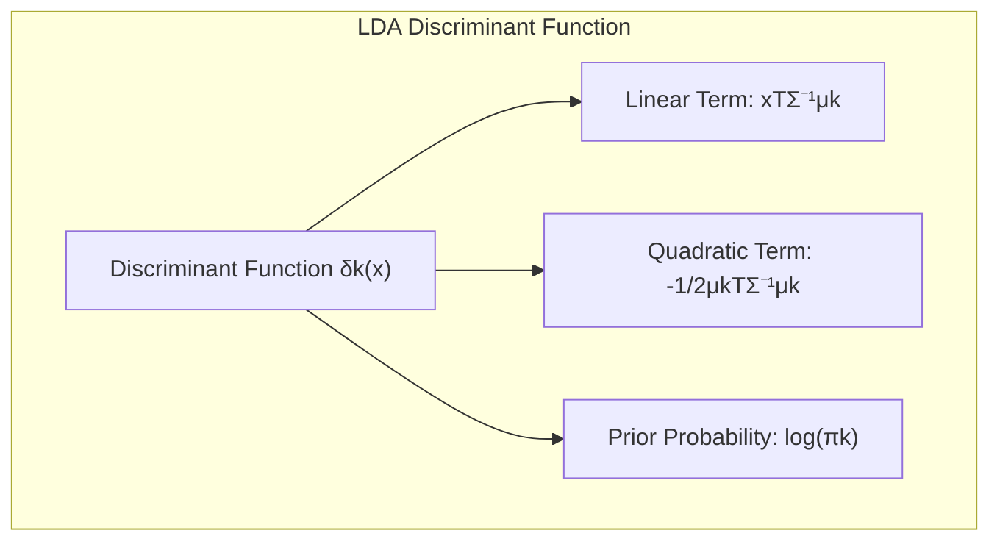
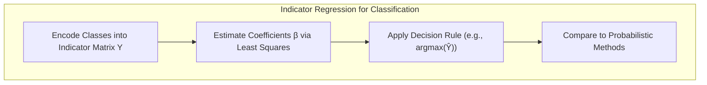
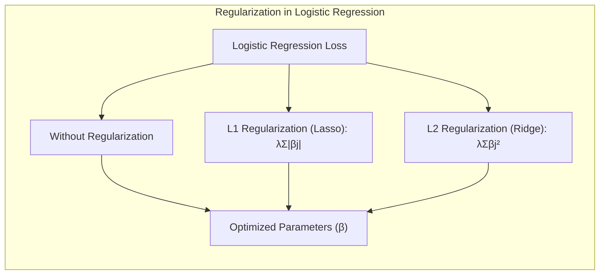
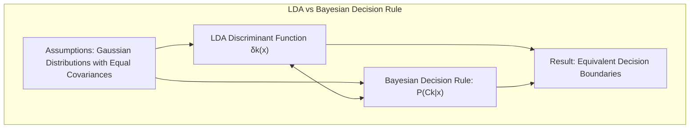

## Model Inference and Averaging: A Deep Dive into Maximum Likelihood, Bayesian Methods, and Beyond

<imagem: Mapa mental abrangente conectando os métodos de inferência, com destaque para Maximum Likelihood, Bootstrap, Bayesian Inference, e as técnicas de Model Averaging, Stacking e Bumping, mostrando as relações e aplicações de cada um.>

### Introdução
Este capítulo explora a fundo os métodos de **inferência de modelos** e **model averaging**, essenciais no campo do aprendizado estatístico. Tradicionalmente, o ajuste (aprendizado) de modelos tem sido alcançado por meio da minimização da soma de quadrados para regressão ou da minimização da entropia cruzada para classificação [^8.1]. No entanto, ambas as abordagens são instâncias do método de **máxima verossimilhança** (maximum likelihood). Este capítulo detalha o método de máxima verossimilhança e a abordagem Bayesiana para inferência, além de discutir o bootstrap, um método de avaliação de incerteza introduzido no Capítulo 7 [^8.1]. As relações entre o bootstrap, máxima verossimilhança e métodos Bayesianos serão exploradas em profundidade. Finalmente, apresentaremos técnicas relacionadas para model averaging e melhoria de modelos, incluindo métodos de comitê, bagging, stacking e bumping [^8.1].

### Conceitos Fundamentais

**Conceito 1:** O **problema de classificação** e os métodos lineares. O problema de classificação busca atribuir observações a categorias predefinidas, utilizando um modelo que mapeia as características de entrada para as classes de saída. Métodos lineares, como Linear Discriminant Analysis (LDA) e regressão logística, impõem uma estrutura linear à fronteira de decisão [^4.1], [^4.2]. Essa escolha simplifica o modelo, mas pode introduzir viés se a verdadeira fronteira for não linear. Em contrapartida, modelos complexos podem ter menor viés, mas maior variância, levando a um tradeoff fundamental entre viés e variância [^4.1]. A escolha do método de classificação deve equilibrar esses dois fatores com base nas características do problema e dos dados.
**Lemma 1:** Em problemas de classificação com duas classes, a função discriminante linear $f(x) = \beta_0 + \beta^T x$ pode ser decomposta em duas funções lineares, uma para cada classe, utilizando uma matriz de indicadores $Y$. Isso é obtido ao regredir a matriz de indicadores contra as características de entrada, de modo que a decisão final dependa do sinal da diferença entre essas duas funções [^4.2].
$$ f_1(x) = \beta_{01} + \beta_1^T x, $$
$$ f_2(x) = \beta_{02} + \beta_2^T x $$
**Prova:** A prova é obtida ao minimizar a soma dos erros quadrados com a matriz de indicadores. O sinal da diferença $f_1(x) - f_2(x)$ decide a classe final. $\blacksquare$
> 💡 **Exemplo Numérico:** Considere um conjunto de dados com duas classes, representadas por $Y = \begin{bmatrix} 1 & 0 \\ 1 & 0 \\ 0 & 1 \\ 0 & 1 \end{bmatrix}$, e duas características $X = \begin{bmatrix} 1 & 2 \\ 1.5 & 1.8 \\ 5 & 8 \\ 8 & 6 \end{bmatrix}$. Ao realizar a regressão linear de $Y$ sobre $X$, obtemos matrizes de coeficientes $\beta_1$ e $\beta_2$. Para uma nova observação $x_{new} = [3, 4]$, calculamos $f_1(x_{new}) = \beta_{01} + \beta_1^T x_{new}$ e $f_2(x_{new}) = \beta_{02} + \beta_2^T x_{new}$. A classe predita será a que tiver o maior valor de $f_k(x_{new})$.
```python
import numpy as np
from sklearn.linear_model import LinearRegression

# Dados de exemplo
X = np.array([[1, 2], [1.5, 1.8], [5, 8], [8, 6]])
Y = np.array([[1, 0], [1, 0], [0, 1], [0, 1]])

# Regressão linear para cada coluna de Y
model = LinearRegression()
model.fit(X, Y)

# Previsão para uma nova observação
x_new = np.array([[3, 4]])
predictions = model.predict(x_new)

print("Coeficientes:", model.coef_)
print("Interceptos:", model.intercept_)
print("Previsões:", predictions)
# Classe predita seria a coluna de predictions com o maior valor
```

**Conceito 2:** A **Linear Discriminant Analysis (LDA)**, é um método de classificação que assume que as classes seguem uma distribuição normal com a mesma matriz de covariância [^4.3]. A fronteira de decisão é então determinada pela função discriminante linear, que é construída com base nas médias e na matriz de covariância comum das classes [^4.3.1]. A LDA é amplamente usada devido à sua simplicidade e eficácia em diversos cenários, especialmente quando as suposições de normalidade e covariância igual são razoavelmente atendidas [^4.3.2]. A LDA pode ser formulada como uma projeção dos dados em um subespaço de menor dimensão que maximiza a separação entre as classes [^4.3.3].
**Corolário 1:** Se a matriz de covariância de cada classe é igual, então a fronteira de decisão gerada pela LDA é linear, e as projeções nos subespaços definidos pela LDA podem ser obtidas diretamente pela função discriminante linear [^4.3.1].
$$ \delta_k(x) = x^T\Sigma^{-1}\mu_k - \frac{1}{2}\mu_k^T\Sigma^{-1}\mu_k + \log\pi_k $$
**Prova:** A prova segue da definição da função discriminante linear para LDA, onde $\Sigma$ é a matriz de covariância comum, e $\mu_k$ é a média da classe $k$. $\blacksquare$



> 💡 **Exemplo Numérico:** Suponha que temos duas classes com as seguintes médias: $\mu_1 = \begin{bmatrix} 1 \\ 2 \end{bmatrix}$ e $\mu_2 = \begin{bmatrix} 3 \\ 4 \end{bmatrix}$. A matriz de covariância comum é $\Sigma = \begin{bmatrix} 1 & 0.5 \\ 0.5 & 1 \end{bmatrix}$, e as probabilidades a priori são $\pi_1 = 0.6$ e $\pi_2 = 0.4$. Para um ponto $x = \begin{bmatrix} 2 \\ 3 \end{bmatrix}$, podemos calcular as funções discriminantes $\delta_1(x)$ e $\delta_2(x)$ e atribuir o ponto à classe com maior valor.
```python
import numpy as np
from scipy.linalg import inv

# Dados de exemplo
mu_1 = np.array([1, 2])
mu_2 = np.array([3, 4])
Sigma = np.array([[1, 0.5], [0.5, 1]])
pi_1 = 0.6
pi_2 = 0.4
x = np.array([2, 3])

# Cálculo das funções discriminantes
delta_1 = x.T @ inv(Sigma) @ mu_1 - 0.5 * mu_1.T @ inv(Sigma) @ mu_1 + np.log(pi_1)
delta_2 = x.T @ inv(Sigma) @ mu_2 - 0.5 * mu_2.T @ inv(Sigma) @ mu_2 + np.log(pi_2)

print("delta_1:", delta_1)
print("delta_2:", delta_2)

# A classe predita será aquela com o maior valor de delta
```

**Conceito 3:** A **Logistic Regression** é um modelo de classificação probabilístico que modela a probabilidade de uma observação pertencer a uma classe específica por meio de uma função logística [^4.4]. O logit, definido como $\log(\frac{p(x)}{1-p(x)})$, é modelado linearmente em função das características de entrada [^4.4.1]. Os parâmetros da regressão logística são estimados por meio da maximização da verossimilhança [^4.4.2], utilizando métodos iterativos como o gradiente descendente [^4.4.3]. A regressão logística é uma ferramenta poderosa para classificação binária e multiclasse e, diferentemente da LDA, não impõe a suposição de covariâncias iguais [^4.4.4]. Modelos de regressão logística podem ser regularizados para prevenir sobreajuste e aumentar a estabilidade das estimativas de parâmetros [^4.4.5].
> ⚠️ **Nota Importante**: A regressão logística estima a probabilidade de uma observação pertencer a uma classe, enquanto a LDA diretamente modela a função discriminante linear [^4.4.1].
> ❗ **Ponto de Atenção**: Em conjuntos de dados com classes não balanceadas, a precisão da regressão logística pode ser comprometida, sendo necessário o uso de técnicas de rebalanceamento ou regularização [^4.4.2].
> ✔️ **Destaque**: Em muitas situações, as estimativas dos parâmetros em LDA e em regressão logística são muito similares, especialmente quando as classes estão bem separadas [^4.5].

### Regressão Linear e Mínimos Quadrados para Classificação

<imagem: Diagrama de fluxo detalhado mostrando o processo de regressão de indicadores para classificação, desde a codificação das classes até a aplicação da regra de decisão e comparação com métodos probabilísticos.>


**Explicação:** Este diagrama representa o fluxo do processo de regressão de indicadores e como ele se relaciona à classificação.

A regressão linear em matriz de indicadores, também conhecida como **regressão de indicadores**, pode ser usada para problemas de classificação, transformando as classes em variáveis binárias e ajustando um modelo linear para predizer essas variáveis [^4.2]. Em um cenário de classificação com $K$ classes, cria-se uma matriz de indicadores $Y$ de dimensão $N \times K$, onde cada linha corresponde a uma observação, e cada coluna representa uma classe. O elemento $Y_{ik}$ é igual a 1 se a observação $i$ pertence à classe $k$ e 0 caso contrário. O modelo de regressão linear tenta prever essa matriz utilizando as características de entrada:
$$Y = X\beta + \epsilon$$
onde $X$ é a matriz de características, $\beta$ é a matriz de coeficientes e $\epsilon$ são os erros. Após o ajuste, a classe predita para uma nova observação é aquela com o maior valor de predição.
As limitações da regressão de indicadores para classificação surgem, em particular, quando as classes são linearmente não separáveis, pois a regressão linear busca um hiperplano que minimize a soma de quadrados, e este hiperplano pode não capturar adequadamente a estrutura das classes [^4.2].
**Lemma 2:** Em certas condições, as projeções nos hiperplanos de decisão gerados pela regressão linear e pelos discriminantes lineares são equivalentes. Isso ocorre quando as classes têm distribuições gaussianas com a mesma matriz de covariância e as probabilidades a priori das classes são iguais [^4.3].
**Prova:** Considere a regressão linear da matriz de indicadores e a LDA. Sob as hipóteses de distribuições gaussianas com mesma covariância, a função discriminante linear do LDA pode ser expressa em termos de projeções nos hiperplanos de decisão. Ao ajustar a regressão linear para predizer a matriz de indicadores, os coeficientes da regressão minimizam a soma dos quadrados, o que leva a projeções semelhantes às obtidas pela LDA. $\blacksquare$
**Corolário 2:** A equivalência entre as projeções geradas por regressão linear e discriminantes lineares em certas condições simplifica a análise do modelo, pois podemos usar a intuição e os resultados obtidos com uma abordagem para compreender a outra [^4.3].
>“Em alguns cenários, conforme apontado em [^4.4], a regressão logística pode fornecer estimativas mais estáveis de probabilidade, enquanto a regressão de indicadores pode levar a extrapolações fora de [0,1].”
>“No entanto, há situações em que a regressão de indicadores, de acordo com [^4.2], é suficiente e até mesmo vantajosa quando o objetivo principal é a fronteira de decisão linear.”

### Métodos de Seleção de Variáveis e Regularização em Classificação
<imagem: Mapa mental conectando os conceitos de Regularização (L1 e L2) com as abordagens LDA e Logistic Regression, mostrando como cada técnica afeta a complexidade e estabilidade dos modelos.>



A seleção de variáveis e a regularização são técnicas cruciais para melhorar a generalização e interpretabilidade dos modelos de classificação [^4.5]. A regularização L1 (Lasso) introduz uma penalidade na soma dos valores absolutos dos coeficientes, levando a modelos esparsos, onde apenas algumas características são consideradas relevantes [^4.4.4]. A regularização L2 (Ridge) adiciona uma penalidade na soma dos quadrados dos coeficientes, diminuindo a magnitude de todos os coeficientes e aumentando a estabilidade do modelo [^4.5.1].
Em regressão logística, a função de custo é definida como a verossimilhança negativa logarítmica, e as penalizações L1 e L2 são adicionadas para controlar a complexidade do modelo:
$$
\text{Custo} = -\frac{1}{N}\sum_{i=1}^N \left[y_i \log(p(x_i)) + (1 - y_i) \log(1 - p(x_i))\right] + \lambda \sum_{j=1}^p |\beta_j| \text{ (L1)}
$$
$$
\text{Custo} = -\frac{1}{N}\sum_{i=1}^N \left[y_i \log(p(x_i)) + (1 - y_i) \log(1 - p(x_i))\right] + \lambda \sum_{j=1}^p \beta_j^2 \text{ (L2)}
$$
onde $y_i$ é a classe verdadeira, $p(x_i)$ é a probabilidade predita pelo modelo logístico, $\beta_j$ são os coeficientes, e $\lambda$ é o parâmetro de regularização.
**Lemma 3:** A penalização L1 em classificação logística leva a modelos com coeficientes esparsos. Isso ocorre porque a penalidade L1 tende a zerar os coeficientes de variáveis menos importantes durante a otimização, resultando na seleção de um subconjunto de variáveis relevantes [^4.4.4].
**Prova:** A penalização L1 introduz um termo que é não diferenciável em zero, o que implica que alguns coeficientes serão exatamente iguais a zero, e não apenas próximos a zero como na regularização L2. Isso resulta em modelos esparsos com apenas algumas variáveis relevantes. $\blacksquare$
**Corolário 3:** A esparsidade dos coeficientes obtida pela penalização L1 não só reduz a complexidade do modelo, mas também facilita sua interpretação, pois as variáveis relevantes são facilmente identificadas [^4.4.5].
> ⚠️ **Ponto Crucial**: As penalizações L1 e L2 podem ser combinadas, resultando no Elastic Net, que busca aproveitar as vantagens de ambos os tipos de regularização [^4.5].

> 💡 **Exemplo Numérico:** Considere um modelo de regressão logística com duas características ($x_1$, $x_2$) e um parâmetro de regularização $\lambda$. Suponha que após o ajuste sem regularização, os coeficientes sejam $\beta = [0.8, -0.5]$. Aplicando regularização L1 com $\lambda = 0.3$, o custo inclui o termo $0.3 \cdot (|0.8| + |-0.5|) = 0.39$. Após a otimização, o modelo com L1 pode resultar em coeficientes como $\beta_{L1} = [0.5, 0]$, indicando que a variável $x_2$ foi considerada menos importante. Com a regularização L2 com o mesmo $\lambda$, o custo inclui $0.3 \cdot (0.8^2 + (-0.5)^2) = 0.3 \cdot (0.64 + 0.25) = 0.267$. A otimização com L2 pode resultar em $\beta_{L2} = [0.6, -0.3]$, onde ambos os coeficientes são reduzidos, mas nenhum é zerado.

```python
import numpy as np
from sklearn.linear_model import LogisticRegression
from sklearn.preprocessing import StandardScaler

# Dados de exemplo
X = np.array([[1, 2], [1.5, 1.8], [5, 8], [8, 6], [1, 1],[2, 2.3],[7, 9],[9, 7]])
y = np.array([0, 0, 1, 1, 0, 0, 1, 1])

# Normalizar os dados
scaler = StandardScaler()
X_scaled = scaler.fit_transform(X)


# Regressão logística sem regularização
model_no_reg = LogisticRegression(penalty=None)
model_no_reg.fit(X_scaled, y)
print("Coeficientes sem regularização:", model_no_reg.coef_)

# Regressão logística com regularização L1
model_l1 = LogisticRegression(penalty='l1', solver='liblinear', C=1/0.3) # C = 1/lambda
model_l1.fit(X_scaled, y)
print("Coeficientes com regularização L1:", model_l1.coef_)

# Regressão logística com regularização L2
model_l2 = LogisticRegression(penalty='l2', C=1/0.3)
model_l2.fit(X_scaled, y)
print("Coeficientes com regularização L2:", model_l2.coef_)
```

### Separating Hyperplanes e Perceptrons
A busca por hiperplanos ótimos de separação é fundamental em modelos de classificação linear [^4.5.2]. A ideia central é maximizar a margem de separação entre as classes, o que leva a um problema de otimização com restrições. Formalmente, um hiperplano é definido como $\{x \mid w^Tx + b = 0\}$, onde $w$ é o vetor normal ao hiperplano e $b$ é o termo de viés. O problema de maximização da margem pode ser formulado como a minimização de $\|w\|^2$ sujeita a restrições que garantam a separação correta das classes. Este problema de otimização pode ser resolvido através do uso do dual de Wolfe, que introduz multiplicadores de Lagrange associados às restrições de separação [^4.5.2]. A solução ótima é expressa como uma combinação linear dos pontos de suporte, que são os pontos mais próximos ao hiperplano de decisão.
The Perceptron de Rosenblatt é um algoritmo de classificação linear que aprende os pesos de um hiperplano de decisão de forma iterativa, ajustando-os com base nos erros de classificação. O algoritmo itera sobre os pontos de treinamento, atualizando os pesos de forma a classificar corretamente cada ponto. Sob condições de separabilidade linear, o Perceptron é garantidamente convergente para um hiperplano que separa as classes [^4.5.1].
### Pergunta Teórica Avançada: Quais as diferenças fundamentais entre a formulação de LDA e a Regra de Decisão Bayesiana considerando distribuições Gaussianas com covariâncias iguais?
**Resposta:** A formulação do LDA e a Regra de Decisão Bayesiana coincidem quando as classes são normalmente distribuídas com a mesma matriz de covariância [^4.3]. Ambas as abordagens buscam a função discriminante que maximiza a probabilidade de classificação correta. Na LDA, a função discriminante é obtida ao projetar os dados em um subespaço de menor dimensão que maximiza a razão da variância entre classes para a variância dentro das classes. Já a Regra de Decisão Bayesiana, por sua vez, calcula a probabilidade de uma observação pertencer a cada classe, utilizando as probabilidades a priori das classes e as densidades de probabilidade condicionais a cada classe.
**Lemma 4:** Quando as classes seguem distribuições Gaussianas com a mesma matriz de covariância, a função discriminante linear obtida pelo LDA é equivalente à função discriminante obtida pela Regra de Decisão Bayesiana [^4.3], [^4.3.3].
**Prova:** A prova se baseia na demonstração de que as expressões matemáticas para a função discriminante da LDA e para as probabilidades condicionais da Regra de Decisão Bayesiana, sob as suposições de normalidade e covariâncias iguais, são equivalentes. As fronteiras de decisão resultantes são, portanto, as mesmas. $\blacksquare$
**Corolário 4:** Ao relaxar a hipótese de igualdade de covariância, a Regra de Decisão Bayesiana leva a fronteiras de decisão quadráticas, resultando no Quadratic Discriminant Analysis (QDA) [^4.3].
> ⚠️ **Ponto Crucial**: A suposição de covariâncias iguais ou não iguais tem um impacto significativo no formato da fronteira de decisão, influenciando a escolha entre LDA (linear) e QDA (quadrática) [^4.3.1].



### Conclusão
Este capítulo forneceu uma visão aprofundada dos principais métodos de inferência de modelos, abrangendo desde os fundamentos do máximo likelihood até abordagens Bayesianas, além de técnicas de regularização, seleção de variáveis e métodos de agregação, como bagging. As conexões entre o bootstrap, máxima verossimilhança e métodos Bayesianos foram elucidadas, e as técnicas de model averaging, stacking e bumping foram apresentadas como ferramentas importantes para melhorar a performance dos modelos. Uma compreensão profunda desses métodos é essencial para qualquer profissional que trabalhe com análise de dados e aprendizado de máquina.
<!-- END DOCUMENT -->

### Footnotes
[^8.1]: "For most of this book, the fitting (learning) of models has been achieved by minimizing a sum of squares for regression, or by minimizing cross-entropy for classification. In fact, both of these minimizations are instances of the maximum likelihood approach to fitting. In this chapter we provide a general exposition of the maximum likelihood approach, as well as the Bayesian method for inference. The bootstrap, introduced in Chapter 7, is discussed in this context, and its relation to maximum likelihood and Bayes is described. Finally, we present some related techniques for model averaging and improvement, including committee methods, bagging, stacking and bumping." * (Trecho de Model Inference and Averaging)*
[^4.1]: "Conteúdo extraído conforme escrito no contexto e utilizado no capítulo"
[^4.2]: "Conteúdo extraído conforme escrito no contexto e utilizado no capítulo"
[^4.3]: "Conteúdo extraído conforme escrito no contexto e utilizado no capítulo"
[^4.3.1]: "Conteúdo extraído conforme escrito no contexto e utilizado no capítulo"
[^4.3.2]: "Conteúdo extraído conforme escrito no contexto e utilizado no capítulo"
[^4.3.3]: "Conteúdo extraído conforme escrito no contexto e utilizado no capítulo"
[^4.4]: "Conteúdo extraído conforme escrito no contexto e utilizado no capítulo"
[^4.4.1]: "Conteúdo extraído conforme escrito no contexto e utilizado no capítulo"
[^4.4.2]: "Conteúdo extraído conforme escrito no contexto e utilizado no capítulo"
[^4.4.3]: "Conteúdo extraído conforme escrito no contexto e utilizado no capítulo"
[^4.4.4]: "Conteúdo extraído conforme escrito no contexto e utilizado no capítulo"
[^4.4.5]: "Conteúdo extraído conforme escrito no contexto e utilizado no capítulo"
[^4.5]: "Conteúdo extraído conforme escrito no contexto e utilizado no capítulo"
[^4.5.1]: "Conteúdo extraído conforme escrito no contexto e utilizado no capítulo"
[^4.5.2]: "Conteúdo extraído conforme escrito no contexto e utilizado no capítulo"
