## Inferência e Média de Modelos com Variáveis Latentes

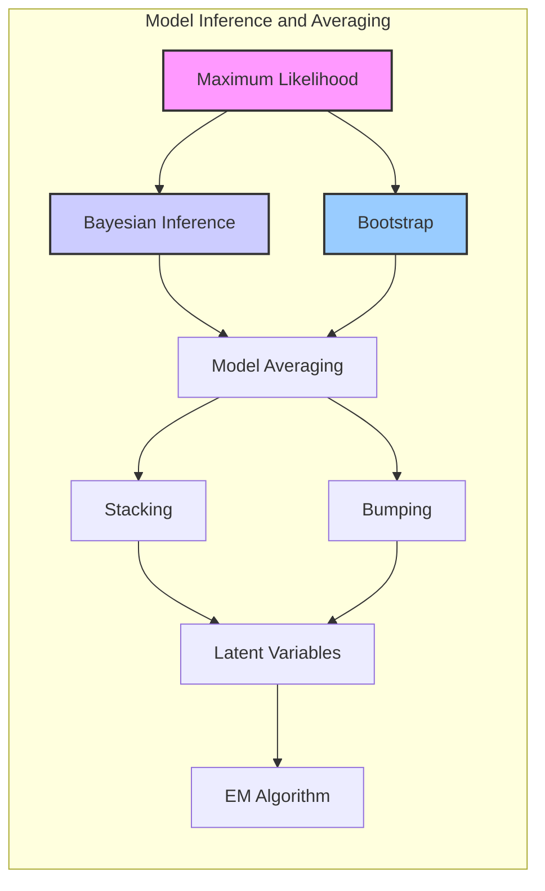

### Introdução
Este capítulo explora a **inferência de modelos** e técnicas de **model averaging**, com foco em métodos estatísticos e de aprendizado de máquina que lidam com **variáveis latentes**. Ao longo deste texto, discutiremos a conexão entre **Maximum Likelihood**, abordagens **Bayesianas**, o **Bootstrap**, e algoritmos como o **EM Algorithm**, enfatizando o papel das variáveis latentes na construção e inferência de modelos. Métodos de **model averaging** e **stacking**, juntamente com o método de busca estocástica, *bumping*, serão apresentados para aprimorar a capacidade preditiva dos modelos [^8.1].

### Conceitos Fundamentais

**Conceito 1: O Problema da Inferência de Modelos**

O objetivo da **inferência de modelos** é estimar os parâmetros de um modelo estatístico que melhor se ajusta aos dados observados [^8.1]. Frequentemente, essa estimativa envolve a minimização de uma função de perda, como a soma dos quadrados para regressão ou a entropia cruzada para classificação. Esses procedimentos são, na verdade, instâncias da abordagem de **Maximum Likelihood**, que busca encontrar os parâmetros que maximizam a probabilidade dos dados observados sob o modelo. Um exemplo clássico deste problema é o ajuste de uma curva suave através de um conjunto de dados, onde a forma da curva (definida por parâmetros) é inferida a partir dos dados [^8.2]. A escolha de métodos lineares ou não-lineares implica diferentes níveis de **bias** e **variância** do modelo, afetando a sua capacidade de generalizar para dados não vistos.

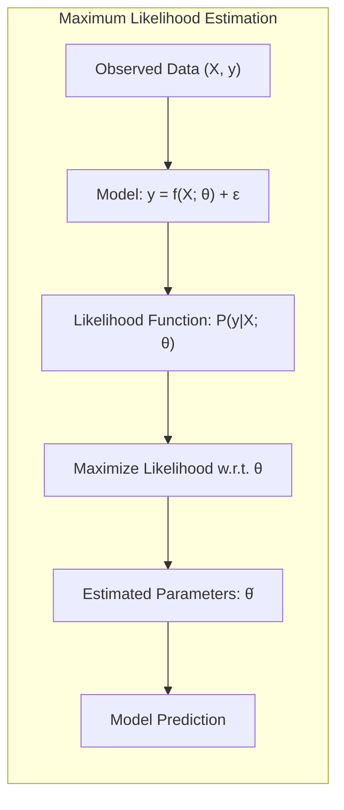

> 💡 **Exemplo Numérico:** Imagine que temos um conjunto de dados com pontos $(x_i, y_i)$ que seguem uma relação aproximadamente linear, mas com algum ruído. Queremos ajustar uma reta $y = \beta_0 + \beta_1x$ a esses dados. Usando o método de **Maximum Likelihood**, assumimos que os erros seguem uma distribuição normal, o que leva à minimização da soma dos quadrados dos resíduos. Os parâmetros $\beta_0$ e $\beta_1$ serão estimados de forma a maximizar a probabilidade de observar os dados $y_i$ dados os valores de $x_i$. Um modelo linear pode ter um alto bias se a relação verdadeira for não linear, e uma alta variância se os dados forem muito ruidosos.

**Lemma 1:** A estimativa de **Maximum Likelihood** dos parâmetros $\beta$ em um modelo de regressão linear é equivalente à solução obtida por **Ordinary Least Squares** (OLS) quando assumimos erros Gaussianos.

**Prova:** Dado o modelo linear $y = X\beta + \epsilon$, com $\epsilon \sim N(0, \sigma^2I)$, a função de **log-likelihood** é dada por $$l(\beta, \sigma^2) = -\frac{N}{2}log(2\pi\sigma^2) - \frac{1}{2\sigma^2}(y-X\beta)^T(y-X\beta).$$
Maximizando $l(\beta, \sigma^2)$ em relação a $\beta$ obtemos $\hat\beta = (X^TX)^{-1}X^Ty$, que corresponde à solução do problema de mínimos quadrados, onde $(y-X\beta)^T(y-X\beta)$ é minimizado. $\blacksquare$

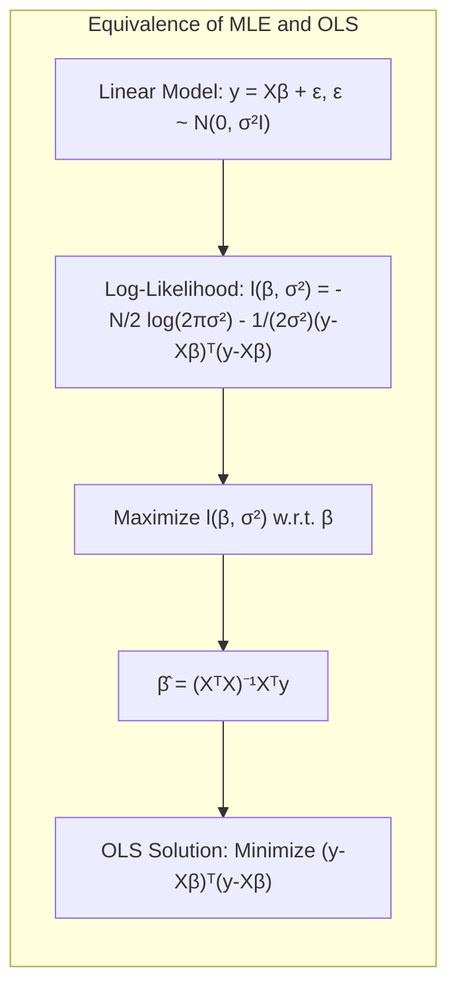

> 💡 **Exemplo Numérico:** Suponha que temos os seguintes dados: $X = \begin{bmatrix} 1 & 1 \\ 1 & 2 \\ 1 & 3 \end{bmatrix}$ e $y = \begin{bmatrix} 2 \\ 3 \\ 5 \end{bmatrix}$.  
>  $\text{Step 1: } X^TX = \begin{bmatrix} 1 & 1 & 1 \\ 1 & 2 & 3 \end{bmatrix} \begin{bmatrix} 1 & 1 \\ 1 & 2 \\ 1 & 3 \end{bmatrix} = \begin{bmatrix} 3 & 6 \\ 6 & 14 \end{bmatrix}$
>  $\text{Step 2: } (X^TX)^{-1} = \frac{1}{3*14 - 6*6}\begin{bmatrix} 14 & -6 \\ -6 & 3 \end{bmatrix} = \frac{1}{6}\begin{bmatrix} 14 & -6 \\ -6 & 3 \end{bmatrix} = \begin{bmatrix} 7/3 & -1 \\ -1 & 1/2 \end{bmatrix}$
> $\text{Step 3: } X^Ty = \begin{bmatrix} 1 & 1 & 1 \\ 1 & 2 & 3 \end{bmatrix} \begin{bmatrix} 2 \\ 3 \\ 5 \end{bmatrix} = \begin{bmatrix} 10 \\ 23 \end{bmatrix}$
> $\text{Step 4: } \hat\beta = (X^TX)^{-1}X^Ty = \begin{bmatrix} 7/3 & -1 \\ -1 & 1/2 \end{bmatrix} \begin{bmatrix} 10 \\ 23 \end{bmatrix} = \begin{bmatrix} 70/3 - 23 \\ -10 + 23/2 \end{bmatrix} = \begin{bmatrix} 1/3 \\ 3/2 \end{bmatrix}$
>  Assim, a reta que melhor se ajusta aos dados é $\hat{y} = \frac{1}{3} + \frac{3}{2}x$. Este exemplo numérico ilustra como a formulação de mínimos quadrados encontra os melhores parâmetros para ajustar um modelo linear aos dados.

**Conceito 2: Linear Regression e B-splines**

A **Linear Regression**, ou regressão linear, é usada para modelar a relação entre uma variável dependente e uma ou mais variáveis independentes através de uma equação linear. Em cenários de suavização, como exemplificado com os *B-splines* [^8.2], a **regressão linear** se adapta através de expansões lineares de funções base. As *B-splines* oferecem flexibilidade para ajustar curvas complexas, onde o número e localização dos nós definem a capacidade do modelo de se adaptar aos dados. A minimização do erro quadrático sobre os dados de treino leva à solução de mínimos quadrados, onde o coeficiente $\beta$ é estimado através de $\hat{\beta} = (H^TH)^{-1}H^Ty$, onde $H$ é a matriz com a avaliação das funções base nos pontos amostrais.

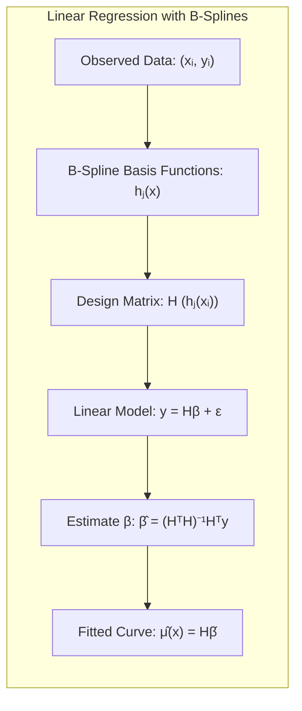

**Corolário 1:** A matriz de covariância estimada para $\beta$, dada por $Var(\hat\beta) = (H^TH)^{-1}\hat\sigma^2$, fornece uma medida da incerteza associada à estimativa dos coeficientes e permite avaliar a precisão da função ajustada [^8.2]. A variância do ruído, $\hat\sigma^2$, é estimada através de $\hat\sigma^2 = \sum_{i=1}^N (y_i - \hat\mu(x_i))^2/N$.

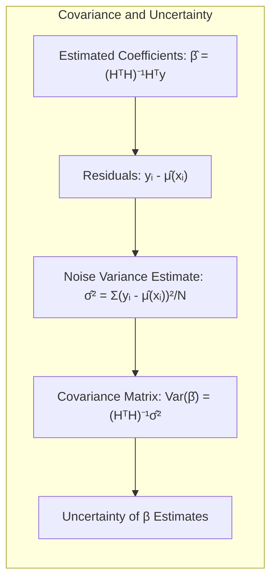

> 💡 **Exemplo Numérico:** Suponha que queremos ajustar uma curva usando B-splines com três funções base. Seja $H$ a matriz que contém a avaliação dessas funções base em cada ponto de dados, e seja $y$ o vetor de valores correspondentes. Se $(H^TH)^{-1} = \begin{bmatrix} 0.5 & 0.1 & 0.2 \\ 0.1 & 0.3 & 0.1 \\ 0.2 & 0.1 & 0.4 \end{bmatrix}$ e $H^Ty = \begin{bmatrix} 10 \\ 12 \\ 15 \end{bmatrix}$, então $\hat\beta = (H^TH)^{-1}H^Ty = \begin{bmatrix} 0.5 & 0.1 & 0.2 \\ 0.1 & 0.3 & 0.1 \\ 0.2 & 0.1 & 0.4 \end{bmatrix} \begin{bmatrix} 10 \\ 12 \\ 15 \end{bmatrix} = \begin{bmatrix} 6.2 \\ 6.1 \\ 8.2 \end{bmatrix}$.  Se $\hat\sigma^2 = 0.5$, então a matriz de covariância para os coeficientes é $Var(\hat\beta) = (H^TH)^{-1}\hat\sigma^2 = 0.5 \begin{bmatrix} 0.5 & 0.1 & 0.2 \\ 0.1 & 0.3 & 0.1 \\ 0.2 & 0.1 & 0.4 \end{bmatrix} = \begin{bmatrix} 0.25 & 0.05 & 0.1 \\ 0.05 & 0.15 & 0.05 \\ 0.1 & 0.05 & 0.2 \end{bmatrix}$.  Os elementos diagonais de $Var(\hat\beta)$ representam a variância das estimativas para cada coeficiente, indicando a incerteza na estimativa de cada parâmetro da curva B-spline.

**Conceito 3: Modelos com Variáveis Latentes**

Em muitos problemas de modelagem, nem todas as variáveis relevantes são observadas diretamente. As **variáveis latentes** são aquelas que influenciam o processo gerador dos dados, mas não são medidas diretamente. Modelos como o *Gaussian Mixture Model* (GMM) [^8.5] utilizam **variáveis latentes** para representar a pertença de cada observação a um componente específico da mistura, como representado pela variável $\Delta_i$ em [^8.5]. A inferência em modelos com **variáveis latentes** geralmente envolve o uso de algoritmos iterativos, como o **EM Algorithm**, que alternam entre a estimação das variáveis latentes (passo E) e a otimização dos parâmetros do modelo (passo M). A incorporação de **variáveis latentes** permite modelar a heterogeneidade nos dados, facilitando a identificação de padrões complexos e subgrupos.

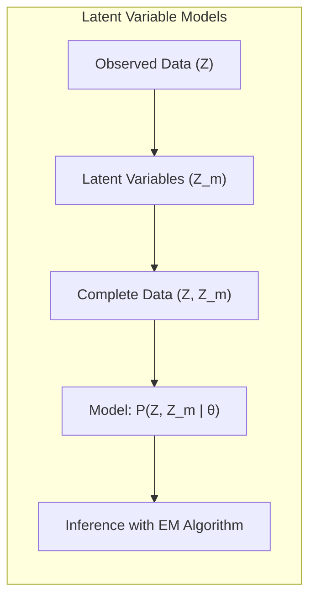

> ⚠️ **Nota Importante**: A identificação de **variáveis latentes** e sua correta modelagem são essenciais para uma análise robusta dos dados e para a construção de modelos mais precisos. **Referência ao tópico [^8.5]**.

> ❗ **Ponto de Atenção**: A modelagem inadequada de **variáveis latentes** pode levar a conclusões errôneas e resultados subótimos. **Conforme indicado em [^8.5.1]**.

> ✔️ **Destaque**:  O uso de **variáveis latentes** oferece flexibilidade para modelar dados com dependência e heterogeneidade, além de melhorar a capacidade de generalização dos modelos. **Baseado no tópico [^8.5.2]**.

> 💡 **Exemplo Numérico:** Considere um GMM com dois componentes Gaussianos para modelar dados de alturas de uma população. A variável latente $\Delta_i$ indica a qual dos dois grupos (e.g., homens ou mulheres) cada pessoa pertence. Não sabemos a priori a qual grupo cada altura pertence, mas o EM Algorithm estima essas probabilidades, além dos parâmetros de cada Gaussiana (média e variância), alternando entre estimar a probabilidade de cada ponto pertencer a cada gaussiana (Passo E) e atualizar os parâmetros das gaussianas (Passo M).

### Regressão Linear e Mínimos Quadrados para Classificação
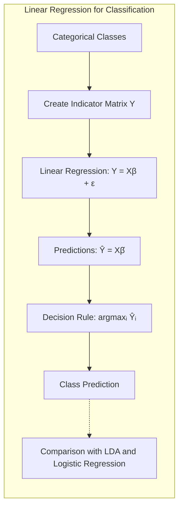

A aplicação da **regressão linear** em matrizes de indicadores para classificação envolve a criação de variáveis dummy que representam cada classe. A regressão linear é então aplicada a essas variáveis, e a classe predita para um dado ponto é a correspondente à variável dummy com o maior valor predito. Este método, apesar de simples, pode apresentar limitações, especialmente quando as classes não são bem separadas ou quando há muitas classes, como explicitado em [^8.2]. A regressão de indicadores tenta encontrar um hiperplano que separa as classes, de forma similar ao que é feito pela **Linear Discriminant Analysis (LDA)** [^8.3]. No entanto, a regressão linear não garante que as predições estarão entre 0 e 1, o que é uma limitação quando interpretamos os valores preditos como probabilidades.

**Lemma 2:** A minimização do erro quadrático em uma regressão linear para a predição de uma variável indicadora de classe é matematicamente equivalente a uma projeção ortogonal em um subespaço que separa as classes.

**Prova:** Em uma regressão linear de indicadores, minimizamos a soma dos erros quadráticos $||Y - X\beta||^2$, onde $Y$ é uma matriz de indicadores de classe, com cada coluna correspondendo a uma classe. A solução é dada por $\hat\beta=(X^TX)^{-1}X^TY$, e as predições são $\hat Y = X\hat\beta$. Essas predições correspondem às projeções de $Y$ no subespaço gerado pelas colunas de $X$, e o vetor de erros $Y - \hat Y$ é ortogonal a esse subespaço. Quando $X$ contém informações sobre as classes, a projeção separa as classes em espaços distintos, definindo os limites de decisão. $\blacksquare$

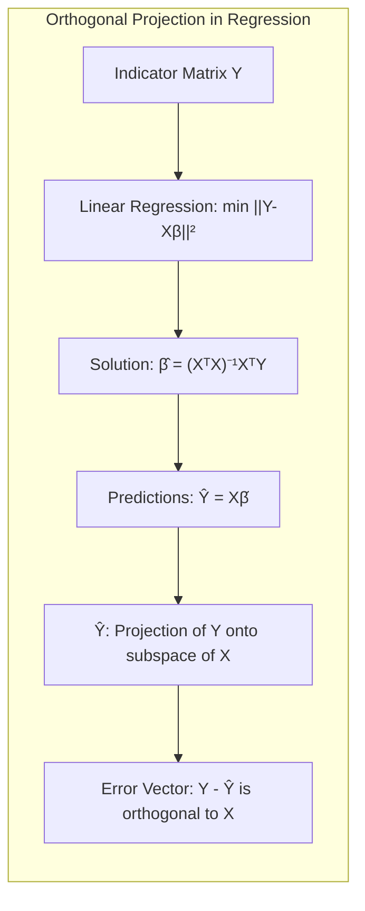

**Corolário 2:** Sob certas condições, como classes bem separadas e sem ruído excessivo, a regressão de indicadores pode gerar uma fronteira de decisão semelhante a uma **LDA**, especialmente se utilizarmos um critério de decisão que seleciona a classe com o maior valor predito. A regressão linear, nesse contexto, encontra os parâmetros do hiperplano, que é uma função linear das *features*, de maneira a minimizar a soma dos quadrados dos resíduos, enquanto a LDA encontra o hiperplano de maneira a maximizar a separação entre as classes [^8.3].

> 💡 **Exemplo Numérico:** Considere um problema de classificação com duas classes e duas features. Codificamos as classes como $y_1 = [1, 0]$ para classe 1 e $y_2 = [0, 1]$ para classe 2.  Se tivermos dados $X = \begin{bmatrix} 1 & 2 \\ 2 & 1 \\ 3 & 4 \\ 4 & 3 \end{bmatrix}$ correspondendo às classes $Y = \begin{bmatrix} 1 & 0 \\ 1 & 0 \\ 0 & 1 \\ 0 & 1 \end{bmatrix}$.  Após a regressão linear, podemos obter predições $\hat{Y} = \begin{bmatrix} 0.8 & 0.2 \\ 0.7 & 0.3 \\ 0.3 & 0.7 \\ 0.2 & 0.8 \end{bmatrix}$. A regra de decisão seria atribuir a classe 1 se a primeira coluna da predição for maior do que a segunda, e vice-versa.

Em alguns casos, a **regressão logística** pode oferecer estimativas de probabilidade mais estáveis, pois usa a função sigmóide para mapear a saída em um intervalo entre 0 e 1 [^8.4]. A regressão de indicadores pode levar a valores fora desse intervalo, o que dificulta a interpretação como probabilidades. No entanto, a regressão de indicadores pode ser preferível em cenários onde o foco principal é a fronteira de decisão linear, sendo uma alternativa mais simples e computacionalmente mais eficiente [^8.2].

### Métodos de Seleção de Variáveis e Regularização em Classificação

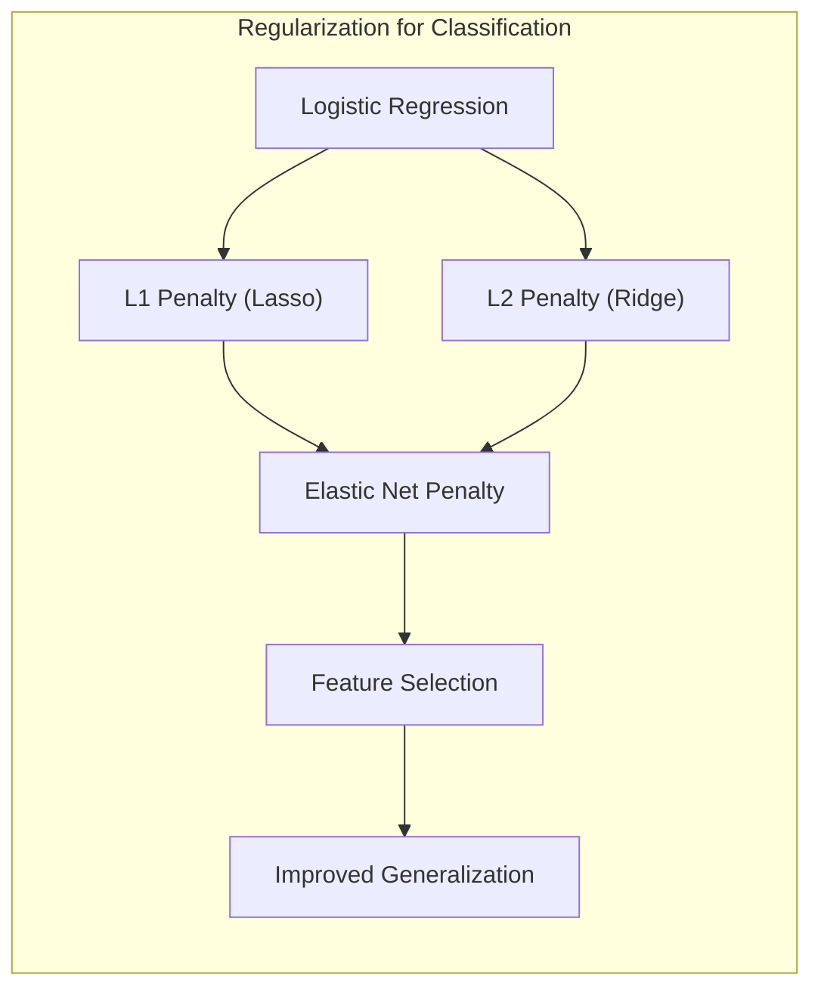

A seleção de variáveis e a **regularização** são técnicas fundamentais para melhorar a generalização de modelos classificatórios, controlando a complexidade e o *overfitting*. No contexto da **regressão logística**, as penalizações L1 e L2 são frequentemente utilizadas. A penalização L1, ou Lasso, introduz um termo de penalidade proporcional à soma dos valores absolutos dos coeficientes, promovendo a esparsidade e a seleção de variáveis [^8.4.4]. A penalização L2, ou Ridge, penaliza a soma dos quadrados dos coeficientes, reduzindo o efeito de coeficientes muito grandes e, assim, controlando a variância do modelo. A combinação das penalizações L1 e L2, conhecida como *Elastic Net*, permite aproveitar as vantagens de ambas as abordagens, equilibrando a esparsidade e a estabilidade [^8.5].

**Lemma 3:** A penalização L1 na regressão logística leva a coeficientes esparsos porque o termo da penalidade é não-diferenciável em $\beta=0$, o que incentiva os coeficientes a serem zerados.

**Prova:** A função de custo na regressão logística com regularização L1 é $$J(\beta) = - \sum_{i=1}^N [y_i \log(p_i) + (1 - y_i)\log(1 - p_i)] + \lambda \sum_{j=1}^p |\beta_j|$$ onde $p_i$ é a probabilidade predita e $\lambda$ é o parâmetro de regularização. A função $|x|$ tem uma não-diferenciabilidade em $x = 0$. A otimização da função de custo tende a levar a coeficientes esparsos ($\beta_j=0$) para reduzir o termo $\lambda \sum_{j=1}^p |\beta_j|$. $\blacksquare$

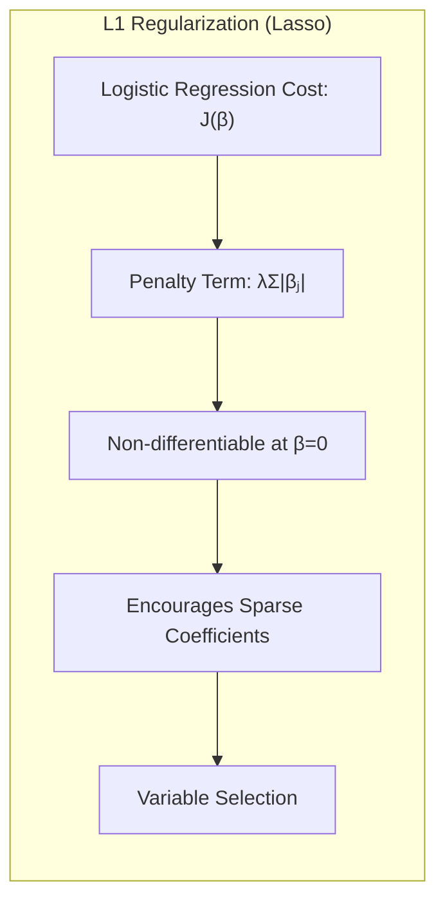

> 💡 **Exemplo Numérico:** Considere um modelo de regressão logística com 5 features,  $\beta = [\beta_0, \beta_1, \beta_2, \beta_3, \beta_4, \beta_5]$. Sem regularização, podemos ter coeficientes como $\beta = [0.5, 2.1, -3.2, 0.8, -1.5, 1.0]$. Com regularização L1 (Lasso) com $\lambda = 1.0$, alguns coeficientes podem ser zerados, resultando em $\beta = [0.2, 1.5, 0, 0, -0.8, 0]$. Isso mostra como o Lasso faz a seleção de variáveis, eliminando as menos relevantes. Com regularização L2 (Ridge), os coeficientes podem ser reduzidos, mas não zerados, como por exemplo $\beta = [0.4, 1.8, -2.5, 0.7, -1.2, 0.8]$, reduzindo o impacto de outliers.

**Corolário 3:** A esparsidade induzida pela regularização L1 facilita a interpretação dos modelos classificatórios, pois identifica as *features* mais relevantes para a predição da classe. Um modelo mais simples, com menos variáveis, é mais fácil de entender e pode generalizar melhor para novos dados [^8.4.5].

> ⚠️ **Ponto Crucial**: A escolha adequada do parâmetro de regularização, $\lambda$, é crucial para o bom desempenho do modelo, e geralmente é feita por meio de validação cruzada [^8.5].

### Separating Hyperplanes e Perceptrons

A ideia de maximizar a margem de separação entre as classes conduz ao conceito de **hiperplanos** ótimos. Métodos como **Support Vector Machines (SVM)** buscam encontrar um hiperplano que separa as classes com a maior margem possível, minimizando o risco de classificação incorreta [^8.5.2]. A solução para o problema de otimização da **SVM** pode ser obtida através da formulação dual de Wolfe, onde os hiperplanos são definidos por combinações lineares dos pontos de suporte, que são as observações mais próximas à fronteira de decisão. O Perceptron, um algoritmo de aprendizado linear, busca encontrar um hiperplano que separa linearmente as classes, adaptando iterativamente os pesos até atingir a separação, quando ela existe [^8.5.1].

### Pergunta Teórica Avançada (Exemplo): Como o EM Algorithm se relaciona com o conceito de "Minorization-Maximization" e porque isso garante o aumento da likelihood?
**Resposta:**
O **EM Algorithm**, ou algoritmo Expectation-Maximization, é um método iterativo para encontrar o máximo da **likelihood** em modelos com **variáveis latentes**. A ideia principal é que, em vez de maximizar diretamente a **likelihood**, nós maximizamos uma aproximação da **likelihood**. Essa aproximação é obtida através da função $Q(\theta',\theta)$, que é a esperança do log-likelihood dos dados completos, dada a observação e o parâmetro atual $\theta$ [^8.5.2]. O algoritmo alterna entre dois passos: (E) calcula $Q(\theta',\theta)$ e (M) maximiza $Q(\theta',\theta)$ em relação a $\theta'$.
Este processo pode ser visto como um método de “Minorization-Maximization” (MM), em que a função $Q(\theta',\theta)$ minoriza a função do log-likelihood dos dados incompletos [^8.5.3]. A minorização garante que, ao otimizar $Q(\theta',\theta)$, estamos, indiretamente, aumentando o valor da função objetivo original. Matematicamente, a função $Q(\theta',\theta)$ é definida como:
$$Q(\theta',\theta) = E[log P(Z,Z_m|\theta')|Z,\theta]$$ onde $Z$ representa os dados observados e $Z_m$ as **variáveis latentes**. A função $Q(\theta',\theta)$ minoriza a função de log-likelihood dos dados observados $l(\theta;Z)$ no ponto $\theta = \theta'$, isto é, $Q(\theta',\theta) \le l(\theta';Z)$ e $Q(\theta',\theta') = l(\theta';Z)$. Ao maximizarmos $Q(\theta',\theta)$ a cada passo do EM, garantimos que estamos movendo para um ponto com log-likelihood maior, pois $l(\theta^{t+1};Z) \ge Q(\theta^{t+1},\theta^t) \ge Q(\theta^t,\theta^t) = l(\theta^t;Z)$.
A demonstração de que a diferença $l(\theta'; Z) - Q(\theta', \theta)$ define uma função que é sempre maior ou igual ao valor do log-likelihood (e que a diferença é nula quando $\theta' = \theta$), combinada com o fato de que o passo M maximiza Q, é o que garante que a sequência de valores do log-likelihood não diminua [^8.5.2].

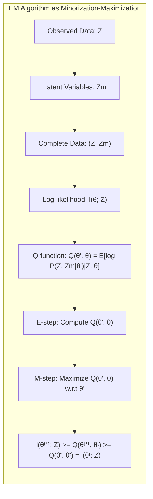

**Lemma 4:** A cada iteração do **EM Algorithm**, o valor do log-likelihood $l(\theta; Z)$ para os dados observados não diminui.

**Prova:** O **EM Algorithm** atualiza os parâmetros do modelo de acordo com $\theta^{t+1} = \text{argmax}_{\theta'} Q(\theta',\theta^t)$, onde $Q(\theta',\theta^t) = E[log p(Z,Z_m|\theta')|Z,\theta^t]$ é a esperança do log-likelihood dos dados completos, condicional aos dados observados e aos parâmetros atuais. Definindo $R(\theta',\theta^t) = E[log p(Z_m|Z,\theta')|Z,\theta^t]$, temos que o log-likelihood dos dados observados pode ser expresso como $l(\theta;Z) = Q(\theta',\theta^t) - R(\theta',\theta^t)$. Dado que $R(\theta',\theta^t)$ é maximizado quando $\theta'=\theta^t$ (desigualdade de Jensen), e que o passo M maximiza $Q(\theta',\theta^t)$, concluímos que $l(\theta^{t+1};Z) \ge l(\theta^t;Z)$. $\blacksquare$

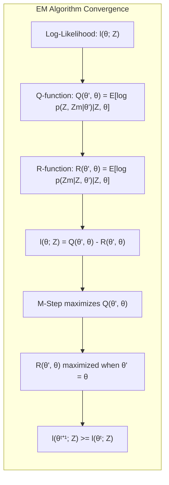

**Corolário 4:** Em casos onde o log-likelihood possui múltiplos máximos locais, a inicialização dos parâmetros pode influenciar para qual máximo o EM Algorithm converge.

> ⚠️ **Ponto Crucial**: A interpretação do **EM Algorithm** como um método de *minorization-maximization* explica porque o algoritmo converge para um máximo local da função do log-likelihood.

### Conclusão
Neste capítulo, exploramos as interseções entre a inferência estatística, a computação e o aprendizado de máquina. As técnicas apresentadas, como o uso de variáveis latentes, o **EM Algorithm**, *Bootstrap*, e o model averaging são ferramentas valiosas para modelar dados complexos e melhorar a capacidade preditiva de modelos estatísticos. Através da modelagem cuidadosa de **variáveis latentes**, combinada com métodos de regularização, podemos desenvolver modelos mais robustos, precisos e generalizáveis. O objetivo principal desses métodos é usar modelos estatísticos e aprendizado de máquina para inferir conhecimento a partir de dados observados, especialmente em contextos onde nem toda a informação relevante é diretamente acessível. Os métodos apresentados neste capítulo permitem um uso mais eficaz da informação presente nos dados para construir modelos preditivos mais robustos. Métodos como o *bagging*, *stacking*, e *bumping* aprimoram modelos, combinando ou perturbando as estimativas de um único modelo, levando a um melhor desempenho na prática.

### Footnotes
[^8.1]: "In this chapter we provide a general exposition of the maximum likeli-hood approach, as well as the Bayesian method for inference. The boot-strap, introduced in Chapter 7, is discussed in this context, and its relation to maximum likelihood and Bayes is described. Finally, we present some related techniques for model averaging and improvement, including com-mittee methods, bagging, stacking and bumping." *(Trecho de Model Inference and Averaging)*
[^8.2]: "Suppose we decide to fit a cubic spline to the data, with three knots placed at the quartiles of the X values. This is a seven-dimensional lin-ear space of functions, and can be represented, for example, by a linear expansion of B-spline basis functions (see Section 5.9.2): Here the h;(x), j = 1, 2, ..., 7 are the seven functions shown in the right panel of Figure 8.1." *(Trecho de Model Inference and Averaging)*
[^8.3]: "In this expression 0 represents one or more unknown parameters that gov-ern the distribution of Z. This is called a parametric model for Z. As an example, if Z has a normal distribution with mean µ and variance σ², then 0 = (μ, σ²)." *(Trecho de Model Inference and Averaging)*
[^8.4]: "In general, the parametric bootstrap agrees not with least squares but with maximum likelihood, which we now review." *(Trecho de Model Inference and Averaging)*
[^8.5]: "The EM algorithm is a popular tool for simplifying difficult maximum likelihood problems. We first describe it in the context of a simple mixture model." *(Trecho de Model Inference and Averaging)*
[^8.5.1]: "In this section we describe a simple mixture model for density estimation, and the associated EM algorithm for carrying out maximum likelihood estimation." *(Trecho de Model Inference and Averaging)*
[^8.5.2]: "Algorithm 8.2 gives the general formulation of the EM algorithm. Our observed data is Z, having log-likelihood ((0; Z) depending on parameters 0. The latent or missing data is Zm, so that the complete data is T = (Z, Zm) with log-likelihood lo(0; T), lo based on the complete density." *(Trecho de Model Inference and Averaging)*
[^8.5.3]: "Here is a different view of the EM procedure, as a joint maximization algorithm. Consider the function F(0', P) = Ep[lo(0'; T)] – Ep [log P(Zm)]." *(Trecho de Model Inference and Averaging)*
<!-- END DOCUMENT -->
