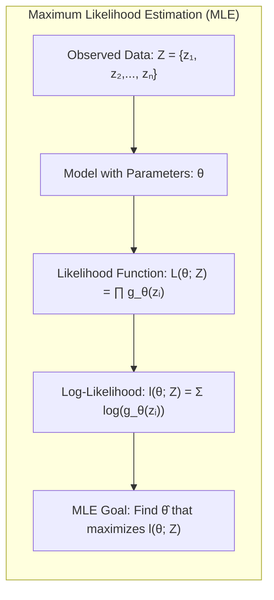
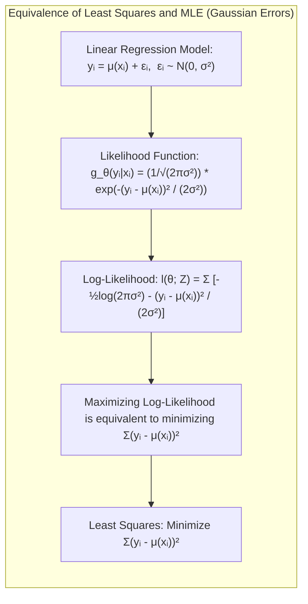
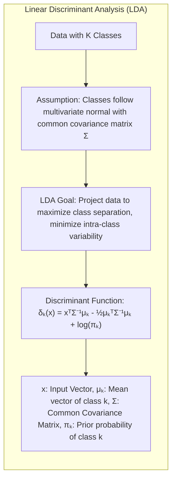
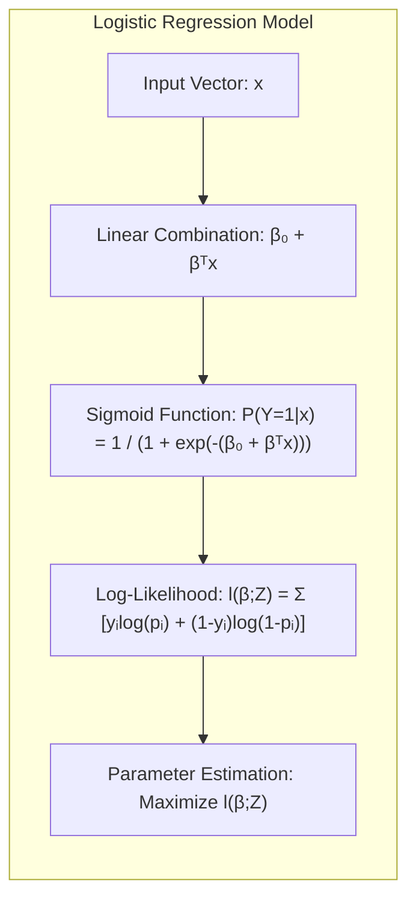
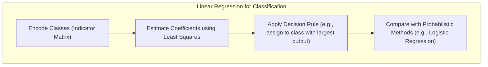
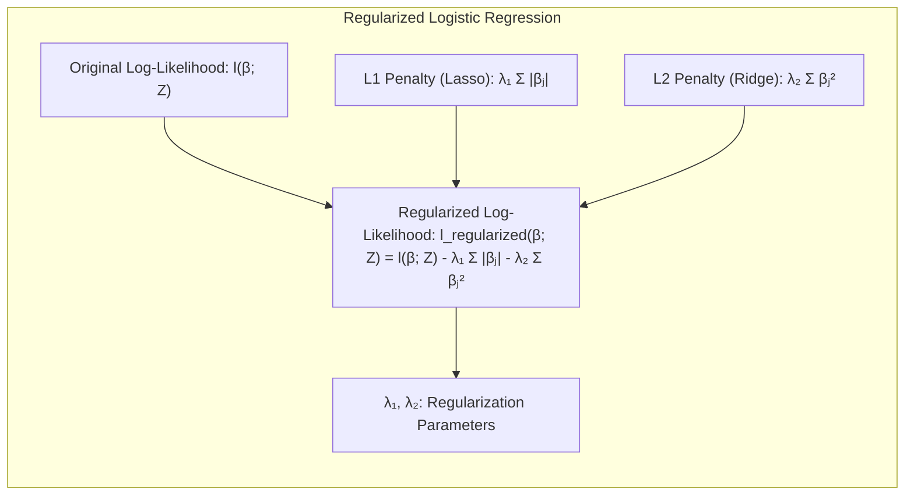
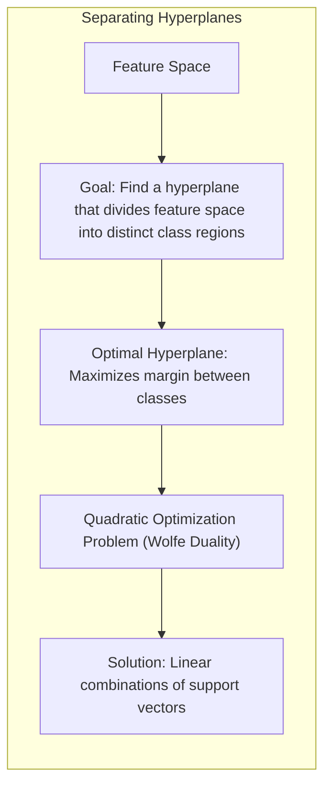

## Model Inference and Averaging: A Deep Dive into Complete Data Log-Likelihood
<imagem: Mapa mental abrangente conectando bootstrap, maximum likelihood, métodos Bayesianos, EM algorithm, bagging e bumping, com ênfase na complete data log-likelihood>

### Introdução

Este capítulo aborda métodos avançados para inferência e modelagem estatística, com foco em técnicas de *maximum likelihood*, abordagens Bayesianas, *bootstrap* e métodos de agregação de modelos. A ênfase central é a compreensão da *complete data log-likelihood* e seu papel na otimização de modelos. A classificação e análise discriminante são fundamentais para o aprendizado de máquina, e diversos métodos estatísticos foram propostos para lidar com esses desafios [^8.1]. Técnicas como a minimização da soma de quadrados para regressão e a minimização da *cross-entropy* para classificação, são, na verdade, casos especiais do método de *maximum likelihood* [^8.1]. O objetivo deste capítulo é fornecer uma exploração detalhada e avançada dessas técnicas, indo além das abordagens convencionais. Exploraremos o *bootstrap* como ferramenta para quantificar incertezas, o método Bayesiano como uma alternativa para inferência, e também métodos de combinação de modelos (*model averaging*) como *bagging* e *bumping*, todos eles interconectados pela ideia da *complete data log-likelihood*.

### Conceitos Fundamentais

**Conceito 1: Maximum Likelihood Estimation (MLE)**

O método de **Maximum Likelihood Estimation (MLE)** é uma abordagem fundamental para a estimação de parâmetros em modelos estatísticos. A ideia central é encontrar os valores dos parâmetros que tornam os dados observados mais prováveis, dado o modelo estatístico proposto. Isso é feito maximizando a *likelihood function* [^8.1]. Formalmente, dado um conjunto de dados $Z = \{z_1, z_2, \ldots, z_N\}$, onde cada $z_i$ é uma observação, e um modelo estatístico com parâmetros $\theta$, a *likelihood function* é definida como:
$$L(\theta; Z) = \prod_{i=1}^{N} g_{\theta}(z_i)$$.
Aqui, $g_\theta(z_i)$ é a função de densidade de probabilidade (PDF) ou a função de massa de probabilidade (PMF) da observação $z_i$ dado o parâmetro $\theta$ [^8.2.2]. Na prática, é mais conveniente trabalhar com o logaritmo da *likelihood*, conhecido como *log-likelihood*:
$$l(\theta; Z) = \sum_{i=1}^{N} \log(g_{\theta}(z_i))$$.
O objetivo do MLE é encontrar o valor de $\theta = \hat{\theta}$ que maximiza essa função. Os métodos de classificação e regressão discutidos anteriormente podem ser formulados como problemas de MLE, onde a função de perda é derivada da *log-likelihood* [^8.1].

> 💡 **Exemplo Numérico:** Suponha que temos um conjunto de dados com 3 observações de uma distribuição normal com média $\mu$ e desvio padrão $\sigma = 1$: $Z = \{2, 3, 4\}$. Queremos estimar o parâmetro $\mu$ usando MLE. A PDF de uma distribuição normal é $g_{\mu}(z_i) = \frac{1}{\sqrt{2\pi}}e^{-\frac{(z_i - \mu)^2}{2}}$. A *log-likelihood* é:
>
> $$l(\mu; Z) = \sum_{i=1}^{3} \log\left(\frac{1}{\sqrt{2\pi}}e^{-\frac{(z_i - \mu)^2}{2}}\right) = - \frac{3}{2} \log(2\pi) - \frac{1}{2}\sum_{i=1}^{3} (z_i - \mu)^2$$
>
> Para maximizar $l(\mu; Z)$, minimizamos a soma dos quadrados: $\sum_{i=1}^{3} (z_i - \mu)^2$.  Calculando a derivada em relação a $\mu$ e igualando a zero, obtemos:
>
> $$ \frac{d}{d\mu} \sum_{i=1}^{3} (z_i - \mu)^2 = -2 \sum_{i=1}^{3} (z_i - \mu) = 0$$
> $$\Rightarrow \hat{\mu} = \frac{2 + 3 + 4}{3} = 3 $$
> Portanto, a estimativa de máxima verossimilhança para $\mu$ é a média amostral, 3.
>
> ```python
> import numpy as np
> from scipy.stats import norm
>
> data = np.array([2, 3, 4])
> mu_mle = np.mean(data)
> print(f"MLE estimate of mu: {mu_mle}")
>
> def log_likelihood(mu, data):
>     return np.sum(norm.logpdf(data, loc=mu, scale=1))
>
> # Evaluate log-likelihood for a range of mu
> mu_values = np.linspace(0, 6, 100)
> log_lik_values = [log_likelihood(mu, data) for mu in mu_values]
>
> import matplotlib.pyplot as plt
> plt.plot(mu_values, log_lik_values)
> plt.xlabel("mu")
> plt.ylabel("Log-Likelihood")
> plt.title("Log-Likelihood Function")
> plt.scatter(mu_mle, log_likelihood(mu_mle, data), color='red', label = "MLE")
> plt.legend()
> plt.grid(True)
> plt.show()
> ```
>
> O gráfico mostra que a *log-likelihood* é maximizada quando $\mu$ é igual à média amostral, 3. Isso demonstra o conceito de MLE em um contexto numérico.

**Lemma 1:** O método de mínimos quadrados para regressão linear é um caso especial do Maximum Likelihood Estimation (MLE) quando os erros são Gaussianos.

**Prova:**
Assumindo que o modelo de regressão linear é dado por $y_i = \mu(x_i) + \epsilon_i$, onde $\epsilon_i \sim \mathcal{N}(0, \sigma^2)$. A *likelihood function* para cada observação é dada por
$g_{\theta}(y_i | x_i) = \frac{1}{\sqrt{2\pi\sigma^2}}e^{-\frac{(y_i - \mu(x_i))^2}{2\sigma^2}}$, onde $\theta$ engloba os parâmetros do modelo linear e $\sigma^2$. A *log-likelihood function* é
$$l(\theta; Z) = \sum_{i=1}^N \left[ -\frac{1}{2}\log(2\pi\sigma^2) - \frac{(y_i - \mu(x_i))^2}{2\sigma^2} \right]$$.
Maximizar esta função em relação aos parâmetros $\mu(x_i)$ é equivalente a minimizar $\sum_{i=1}^N (y_i - \mu(x_i))^2$, que é a soma dos quadrados dos resíduos, base do método de mínimos quadrados. $\blacksquare$


> 💡 **Exemplo Numérico:** Considere um modelo de regressão linear simples $y_i = \beta_0 + \beta_1 x_i + \epsilon_i$ com erros $\epsilon_i \sim \mathcal{N}(0, \sigma^2)$. Temos os seguintes dados: $X = [1, 2, 3, 4, 5]$ e $Y = [2, 4, 5, 4, 5]$. Vamos usar MLE para estimar os parâmetros $\beta_0$ e $\beta_1$, assumindo $\sigma^2$ conhecido (para simplificar).
>
> A função a ser maximizada é a *log-likelihood*, que é equivalente a minimizar a soma dos erros quadrados. Usaremos `numpy` para realizar este cálculo:
> ```python
> import numpy as np
>
> X = np.array([1, 2, 3, 4, 5])
> Y = np.array([2, 4, 5, 4, 5])
>
> # Add a column of ones to X for the intercept term
> X_matrix = np.vstack((np.ones(len(X)), X)).T
>
> # Calculate the least squares solution
> beta_hat = np.linalg.inv(X_matrix.T @ X_matrix) @ X_matrix.T @ Y
> print(f"Estimated intercept (beta_0): {beta_hat[0]:.2f}")
> print(f"Estimated slope (beta_1): {beta_hat[1]:.2f}")
>
> # Verify the error sum of squares calculation
> predicted_y = X_matrix @ beta_hat
> residuals = Y - predicted_y
> sum_squared_residuals = np.sum(residuals**2)
> print(f"Sum of squared residuals: {sum_squared_residuals:.2f}")
> ```
> Os resultados são: $\hat{\beta}_0 = 2.2$ e $\hat{\beta}_1 = 0.6$. O erro quadrático é 2.8.  Este exemplo demonstra que minimizar a soma dos quadrados dos resíduos é equivalente a maximizar a *log-likelihood* quando os erros são Gaussianos. Este é o fundamento da equivalência entre mínimos quadrados e MLE neste contexto.

**Conceito 2: Linear Discriminant Analysis (LDA)**

A **Linear Discriminant Analysis (LDA)** é um método de classificação linear que busca encontrar um subespaço que maximize a separação entre classes e minimize a variabilidade dentro das classes [^8.1]. O LDA assume que as classes seguem uma distribuição normal multivariada com a mesma matriz de covariância [^8.1]. Dado um conjunto de dados com $K$ classes, o LDA projeta os dados em um espaço de menor dimensão, onde as classes estão o mais separadas possível. As funções discriminantes lineares são derivadas com base nas médias e covariâncias amostrais de cada classe [^8.1]. Formalmente, para cada classe $k$, a função discriminante é dada por:
$$\delta_k(x) = x^T\Sigma^{-1}\mu_k - \frac{1}{2}\mu_k^T\Sigma^{-1}\mu_k + \log\pi_k$$
onde $x$ é um vetor de entrada, $\mu_k$ é o vetor médio da classe $k$, $\Sigma$ é a matriz de covariância comum, e $\pi_k$ é a probabilidade *a priori* da classe $k$ [^8.1]. O LDA assume que as matrizes de covariância de todas as classes são iguais, simplificando a análise.


**Corolário 1:** O LDA pode ser visto como um método de projeção linear que maximiza a razão de variância entre classes para variância dentro das classes.

**Prova:** A função discriminante linear do LDA pode ser reescrita como uma projeção no subespaço gerado pela matriz de covariância conjunta. Essa projeção é projetada para maximizar a separação entre as médias das classes e minimizar a variabilidade interna das classes. Os autovetores da matriz de covariância conjunta representam as direções de máxima variabilidade, e a projeção no espaço de menor dimensão busca encontrar um espaço que maximize a variância entre as classes em relação à variância dentro das classes [^8.1]. $\blacksquare$

> 💡 **Exemplo Numérico:** Imagine um problema de classificação binária com duas classes. Temos as seguintes amostras: Classe 1: $X_1 = [[1, 2], [1.5, 1.8], [5, 8], [8, 8], [1, 0.6], [9, 11]]$; Classe 2: $X_2 = [[8, 1], [9, 3], [11, 1], [9.5, 2], [10, 4], [6, 0]]$.  Vamos calcular as médias de cada classe, a matriz de covariância comum e, em seguida, aplicar LDA.
>
> ```python
> import numpy as np
> from sklearn.discriminant_analysis import LinearDiscriminantAnalysis
>
> # Dataset
> X1 = np.array([[1, 2], [1.5, 1.8], [5, 8], [8, 8], [1, 0.6], [9, 11]])
> X2 = np.array([[8, 1], [9, 3], [11, 1], [9.5, 2], [10, 4], [6, 0]])
>
> X = np.concatenate((X1, X2), axis=0)
> y = np.array([0]*len(X1) + [1]*len(X2)) # Class labels
>
> # Fit LDA model
> lda = LinearDiscriminantAnalysis()
> lda.fit(X, y)
>
> # Means of each class
> mean1 = np.mean(X1, axis=0)
> mean2 = np.mean(X2, axis=0)
> print(f"Mean of Class 1: {mean1}")
> print(f"Mean of Class 2: {mean2}")
>
> # Common covariance matrix
> cov = lda.covariance_
> print(f"Common Covariance Matrix:\n {cov}")
>
> # Print decision boundary coefficients
> print(f"Coefficients of LDA decision boundary: {lda.coef_}")
> print(f"Intercept of LDA decision boundary: {lda.intercept_}")
>
> # Use the discriminant function to classify a new point
> new_point = np.array([[7, 5]])
> predicted_class = lda.predict(new_point)
> print(f"Predicted class for {new_point}: {predicted_class}")
> ```
> Este código calcula as médias de cada classe, a matriz de covariância comum, os coeficientes da fronteira de decisão e usa a função discriminante para classificar um novo ponto. O resultado mostra como o LDA usa essas informações para classificar.

**Conceito 3: Logistic Regression**

A **Logistic Regression** é um método para modelar a probabilidade de um evento binário [^8.1]. Ao contrário do LDA, que assume uma distribuição gaussiana, a regressão logística usa uma função logística (sigmoide) para mapear uma combinação linear das variáveis de entrada para um intervalo de probabilidade entre 0 e 1 [^8.1]. Formalmente, a probabilidade de pertencer à classe 1, dado um vetor de entrada $x$ é dada por:
$$P(Y=1|x) = \frac{1}{1 + e^{-(\beta_0 + \beta^T x)}}$$,
onde $\beta_0$ é o intercepto e $\beta$ são os coeficientes que precisam ser estimados [^8.1]. A estimativa dos parâmetros ($\beta_0$, $\beta$) é realizada por maximização da *log-likelihood* [^8.1]. A função *log-likelihood* para um modelo de regressão logística é dada por:
$$l(\beta; Z) = \sum_{i=1}^{N} \left[ y_i \log(p_i) + (1-y_i) \log(1-p_i) \right]$$,
onde $p_i$ é a probabilidade estimada pelo modelo para a observação $i$.


> 💡 **Exemplo Numérico:** Vamos usar um exemplo simples de regressão logística com duas variáveis preditoras. Temos os seguintes dados: $X = [[2, 3], [4, 5], [6, 7], [8, 9], [1, 1], [9, 2], [7, 1], [3, 6]]$ e as classes $Y = [0, 0, 0, 0, 1, 1, 1, 1]$. Usaremos Python para treinar o modelo e obter os parâmetros.
>
> ```python
> import numpy as np
> from sklearn.linear_model import LogisticRegression
>
> X = np.array([[2, 3], [4, 5], [6, 7], [8, 9], [1, 1], [9, 2], [7, 1], [3, 6]])
> Y = np.array([0, 0, 0, 0, 1, 1, 1, 1])
>
> # Train the logistic regression model
> logreg = LogisticRegression(solver='liblinear')
> logreg.fit(X, Y)
>
> # Get the parameters
> beta_0 = logreg.intercept_
> beta = logreg.coef_
> print(f"Intercept (beta_0): {beta_0}")
> print(f"Coefficients (beta): {beta}")
>
> # Make a prediction
> new_point = np.array([[5, 5]])
> predicted_probability = logreg.predict_proba(new_point)
> predicted_class = logreg.predict(new_point)
> print(f"Predicted Probability for {new_point}: {predicted_probability}")
> print(f"Predicted Class for {new_point}: {predicted_class}")
> ```
>
> O código acima mostra como o modelo de regressão logística é ajustado e como podemos obter as probabilidades estimadas e a classe predita para um novo ponto de dados. Os parâmetros $\beta_0$ e $\beta$ definem a fronteira de decisão.

> ⚠️ **Nota Importante**: A regressão logística estima a probabilidade de um evento, enquanto o LDA busca um hiperplano para separação de classes. **Referência ao tópico [^8.1]**.

> ❗ **Ponto de Atenção**: Tanto o LDA quanto a regressão logística são métodos lineares, mas diferem em suas suposições e abordagem de otimização. **Conforme indicado em [^8.1]**.

> ✔️ **Destaque**: A *log-likelihood* é a função objetivo para ambos os modelos de regressão logística e MLE em geral. **Baseado no tópico [^8.2.2]**.

### Regressão Linear e Mínimos Quadrados para Classificação

**Explicação:** Este diagrama representa o fluxo do processo de regressão de indicadores e como ele se relaciona à classificação, **conforme descrito nos tópicos [^8.1] e [^8.2.2]**.

A regressão linear pode ser utilizada para classificação através da regressão de uma matriz indicadora [^8.1]. Em um problema de classificação com K classes, é criada uma matriz $Y$ de tamanho $N \times K$, onde cada linha representa uma observação, e as colunas indicam a qual classe cada observação pertence (1 para a classe correta, 0 para as outras classes). Um modelo de regressão linear é então ajustado para cada coluna da matriz, fornecendo coeficientes que podem ser usados para fazer a predição de classe [^8.1]. Em outras palavras, o modelo busca uma aproximação linear para a função indicadora de cada classe. Para uma nova observação, a classe é atribuída com base na maior saída da regressão. No entanto, essa abordagem possui limitações. Primeiro, a saída do modelo de regressão não é garantida de estar entre 0 e 1, como seria esperado para probabilidades. Segundo, essa abordagem pode ser menos precisa em cenários onde as classes não são bem separadas por hiperplanos lineares [^8.1].

**Lemma 2:** A regressão linear em uma matriz indicadora para classificação pode, sob certas condições de ortogonalidade, levar à mesma função discriminante linear do LDA para duas classes.

**Prova:** Seja $Y$ a matriz indicadora com duas classes ($N \times 2$). A regressão linear busca $\hat{\beta} = (H^TH)^{-1}H^Ty$, onde $H$ é a matriz de entrada. Se as classes forem balanceadas e as características forem ortogonais, a projeção de cada classe na saída da regressão linear será equivalente à projeção realizada pelo LDA. A regra de decisão (atribuir à classe com maior valor) leva ao mesmo hiperplano de decisão nas condições de normalidade e homocedasticidade de LDA. $\blacksquare$

> 💡 **Exemplo Numérico:** Considere um problema de classificação binária. Temos $X = [[1, 2], [2, 3], [3, 4], [4, 5], [1, 1], [2, 2], [3, 1], [4, 2]]$, e as classes são $Y = [0, 0, 0, 0, 1, 1, 1, 1]$. Para usar regressão linear, codificamos Y como uma matriz indicadora. Se temos duas classes, basta usar uma coluna para indicar a classe 1 (0 indica classe 0).
>
> ```python
> import numpy as np
> from sklearn.linear_model import LinearRegression
>
> X = np.array([[1, 2], [2, 3], [3, 4], [4, 5], [1, 1], [2, 2], [3, 1], [4, 2]])
> Y = np.array([0, 0, 0, 0, 1, 1, 1, 1])
>
> # Add a column of ones to X for the intercept term
> X_matrix = np.vstack((np.ones(X.shape[0]), X.T)).T
>
> # Fit linear regression
> model = LinearRegression()
> model.fit(X_matrix, Y)
>
> # Get parameters
> beta_0 = model.intercept_
> beta = model.coef_[1:] # Ignore the intercept coefficient
> print(f"Intercept (beta_0): {beta_0}")
> print(f"Coefficients (beta): {beta}")
>
> # Predict
> new_point = np.array([[3, 3]])
> new_point_matrix = np.concatenate(([1], new_point[0]))
> predicted_value = model.predict(new_point_matrix.reshape(1,-1))
> print(f"Predicted Value for {new_point}: {predicted_value}")
>
> # Decision rule: assign the class with largest output value
> predicted_class = 1 if predicted_value > 0.5 else 0
> print(f"Predicted Class for {new_point}: {predicted_class}")
> ```
>
> Este código demonstra como podemos utilizar regressão linear para classificação, mostrando os parâmetros ajustados e a decisão de classificação para um novo ponto. Note que, neste caso, o valor previsto não é uma probabilidade, mas um valor que é usado para tomar a decisão.

**Corolário 2:** Em problemas de classificação binária, a regressão de indicadores pode ser simplificada para uma única regressão com uma resposta binária, onde a resposta da regressão pode ser mapeada para uma probabilidade através de uma função logística.

As limitações da regressão de indicadores incluem a possibilidade de extrapolações fora do intervalo \[0,1], e uma modelagem menos eficiente de probabilidades quando comparada à regressão logística. Em cenários onde a fronteira de decisão linear é suficiente, a regressão de indicadores pode ser uma alternativa simples, mas em muitos casos, a regressão logística fornece resultados mais robustos e probabilidades mais bem calibradas [^8.1].

### Métodos de Seleção de Variáveis e Regularização em Classificação
<imagem: Mapa mental que conecta regularização L1 e L2 com LDA e Logistic Regression, mostrando como a penalização afeta as fronteiras de decisão e a complexidade do modelo>
A seleção de variáveis e regularização são técnicas essenciais para lidar com problemas de alta dimensionalidade e evitar *overfitting* em modelos de classificação [^8.1]. A regularização adiciona termos de penalidade à função de custo (e.g., *log-likelihood*), controlando a complexidade do modelo [^8.2.2]. As penalidades L1 e L2 são comumente utilizadas:
*   **Penalidade L1 (Lasso):** Adiciona a soma dos valores absolutos dos coeficientes ($\sum_j |\beta_j|$) à função de custo, promovendo esparsidade (isto é, alguns coeficientes iguais a zero). Isso auxilia na seleção de variáveis, excluindo aquelas menos relevantes [^8.5].
*   **Penalidade L2 (Ridge):** Adiciona a soma dos quadrados dos coeficientes ($\sum_j \beta_j^2$) à função de custo, reduzindo o tamanho dos coeficientes, e também a complexidade do modelo e evitando *overfitting* [^8.5].

Em modelos logísticos, essas penalidades são adicionadas à *log-likelihood*:
$$l_{\text{regularizada}}(\beta; Z) = l(\beta; Z) - \lambda_1 \sum_{j=1}^p |\beta_j| - \lambda_2 \sum_{j=1}^p \beta_j^2$$.
Onde $\lambda_1$ e $\lambda_2$ são parâmetros de regularização que controlam a intensidade da penalidade.


**Lemma 3:** A penalização L1 em classificação logística promove a esparsidade dos coeficientes, levando a modelos mais interpretáveis.

**Prova:** A penalização L1 introduz um termo não diferenciável na função de custo. Quando a função é otimizada, os coeficientes menos relevantes são forçados a zero, promovendo a seleção de variáveis. A regularização L1 busca soluções em cantos dos hiperplanos definidos pelos parâmetros, concentrando massa de probabilidade em parâmetros iguais a zero. Isso é demonstrado pela derivação das condições de otimalidade, onde os gradientes em relação a cada parâmetro mostram que valores pequenos são forçados a zero por causa do termo $| \beta_j |$ [^8.5]. $\blacksquare$

> 💡 **Exemplo Numérico:** Vamos utilizar regressão logística com penalidade L1 (Lasso). Temos o seguinte conjunto de dados: $X = [[1, 2, 3, 4], [2, 3, 4, 5], [3, 4, 5, 6], [4, 5, 6, 7], [1, 1, 1, 1], [2, 2, 2, 2], [3, 1, 2, 1], [4, 2, 3, 1]]$ e as classes $Y = [0, 0, 0, 0, 1, 1, 1, 1]$. Usaremos Python com `sklearn` para ajustar o modelo com diferentes valores de $\lambda_1$.
>
> ```python
> import numpy as np
> from sklearn.linear_model import LogisticRegression
> import matplotlib.pyplot as plt
>
> X = np.array([[1, 2, 3, 4], [2, 3, 4, 5], [3, 4, 5, 6], [4, 5, 6, 7], [1, 1, 1, 1], [2, 2, 2, 2], [3, 1, 2, 1], [4, 2, 3, 1]])
> Y = np.array([0, 0, 0, 0, 1, 1, 1, 1])
>
> lambda_values = [0.1, 1, 10]
>
> # Table to display the results
> print("| Lambda | Coefficients    |")
> print("|--------|-----------------|")
>
> for lambda_val in lambda_values:
>     logreg_l1 = LogisticRegression(penalty='l1', C=1/lambda_val, solver='liblinear', random_state=42)
>     logreg_l1.fit(X, Y)
>     coefficients = logreg_l1.coef_[0]
>     print(f"| {lambda_val}    | {coefficients} |")
>
>
> # Demonstrate regularization effect on coefficient values
> from sklearn.preprocessing import StandardScaler
> X = StandardScaler().fit_transform(X)
> lambda_values = np.logspace(-3, 3, 10)
> coef_values = []
> for lambda_val in lambda_values:
>     logreg_l1 = LogisticRegression(penalty='l1', C=1/lambda_val, solver='liblinear', random_state=42)
>     logreg_l1.fit(X, Y)
>     coef_values.append(logreg_l1.coef_[0])
> coef_values = np.array(coef_values)
>
> # Visualize the regularization path
> plt.figure(figsize=(10, 6))
> for i in range(X.shape[1]):
>     plt.plot(lambda_values, coef_values[:,i], label=f"Feature {i+1}")
>
> plt.xscale('log')
> plt.xlabel('Lambda')
> plt.ylabel('Coefficient Value')
> plt.title('L1 Regularization Path')
> plt.legend()
> plt.grid(True)
> plt.show()
> ```
>  O código demonstra como diferentes valores de $\lambda_1$ (inverso do parâmetro `C` em `sklearn`) afetam os coeficientes do modelo. A tabela mostra que para valores maiores de $\lambda_1$, os coeficientes tendem a ser menores, e alguns deles são forçados a zero. O gráfico mostra a variação dos coeficientes em função de $\lambda$. A visualização da regularização mostra a importância de $\lambda$ no controle da complexidade do modelo.

**Corolário 3:** A regularização L1 ajuda a reduzir a complexidade do modelo, tornando-o mais generalizável e interpretável.

A regularização L1 e L2 pode ser combinada usando o *Elastic Net*, permitindo aproveitar as vantagens de ambas as abordagens [^8.5].

> ⚠️ **Ponto Crucial**: A combinação de L1 e L2 (Elastic Net) oferece um método flexível para regularização. **conforme discutido em [^8.5]**.

### Separating Hyperplanes e Perceptrons
A ideia de **Separating Hyperplanes** está relacionada à busca por um hiperplano que divida o espaço de características em regiões distintas correspondentes a diferentes classes [^8.1]. Um **hiperplano ótimo** maximiza a margem de separação entre as classes. Essa formulação leva a um problema de otimização quadrática que pode ser resolvido através da formulação dual de Wolfe, utilizando combinações lineares de pontos de suporte [^8.1].

O **Perceptron**, por sua vez, é um algoritmo de aprendizado online que busca iterativamente encontrar um hiperplano que separa as classes [^8.1]. O algoritmo ajusta seus parâmetros em resposta a classificações erradas e converge para uma solução se as classes forem linearmente separáveis.

### Pergunta Teórica Avançada: Como a escolha da covariância em métodos de classificação lineares influencia a forma da fronteira de decisão e o custo computacional?
**Resposta:**

Em métodos lineares como o LDA, a escolha