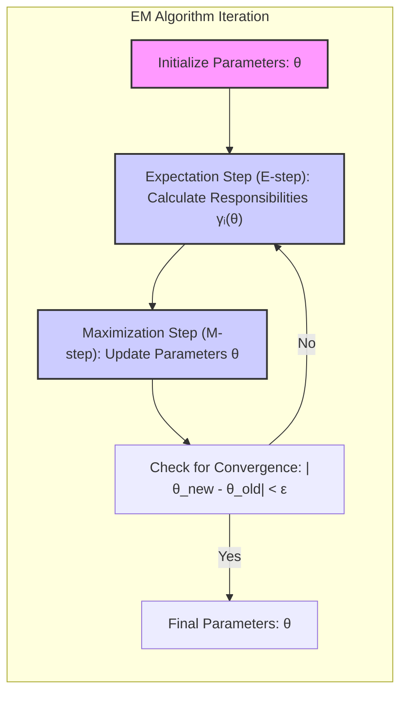
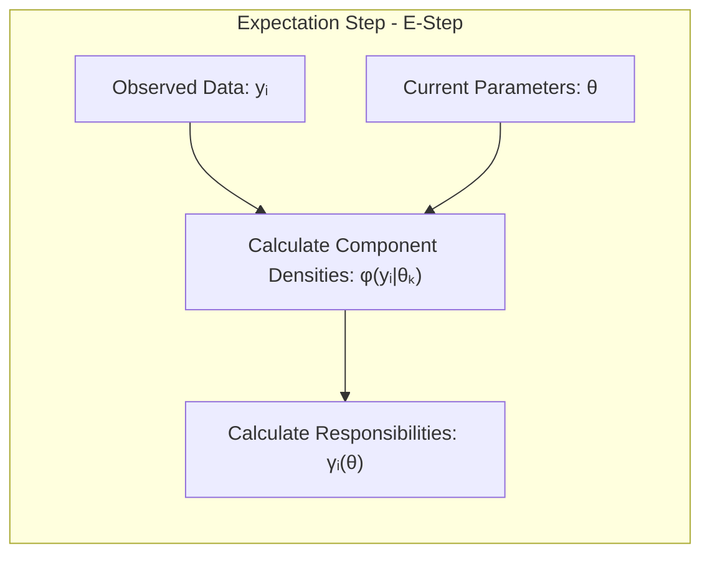
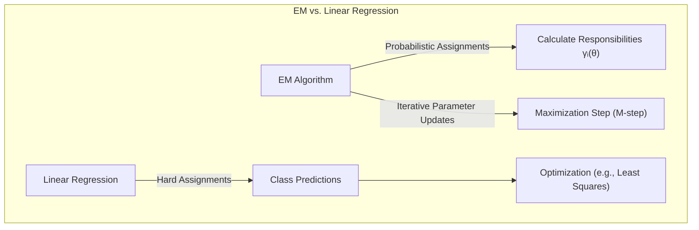
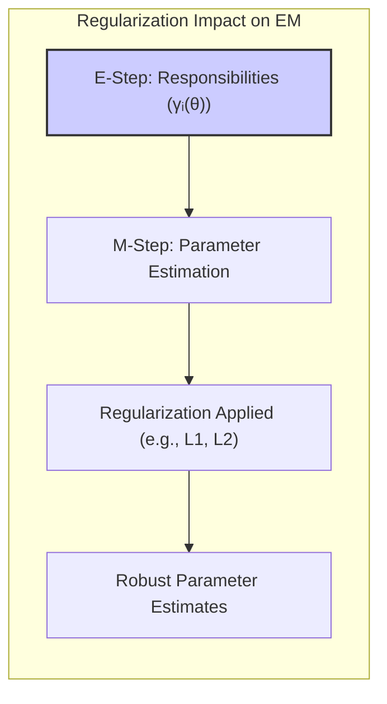
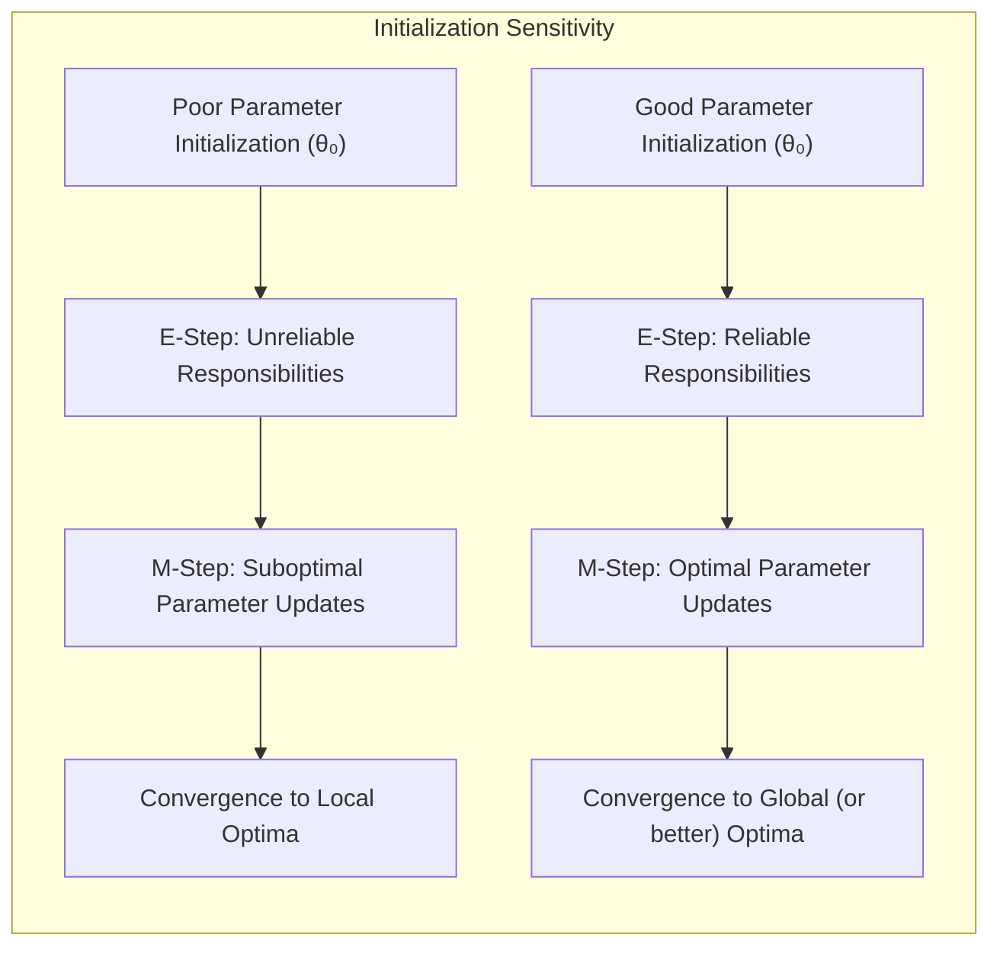

Okay, let's add some practical numerical examples to enhance the understanding of the Expectation Step, while preserving the existing content and format.

## Expectation Step: Unveiling the Latent Structures

### Introdução
Este capítulo aborda profundamente os métodos de **inferência e média de modelos**, com ênfase nas técnicas de **Maximum Likelihood**, **Bootstrap** e **Bayesian**. O objetivo é entender como esses métodos podem ser usados para aprimorar o ajuste de modelos, avaliar a incerteza e combinar diferentes abordagens. A **Expectation Step**, um componente chave do algoritmo EM, será explorada em detalhes, demonstrando sua relevância em modelos de mistura e outros cenários complexos [^8.5].

### Conceitos Fundamentais

**Conceito 1: Modelos de Mistura e Variáveis Latentes**
O ponto de partida para entender a Expectation Step é o conceito de **modelos de mistura**, onde a distribuição observada é uma combinação de outras distribuições mais simples. Por exemplo, em um cenário com duas distribuições normais, cada observação pode ter origem em uma dessas distribuições, mas não sabemos qual delas. A introdução de **variáveis latentes** (como a variável Δ no contexto do documento [^8.5.1]), que indicam de qual componente cada observação se origina, simplifica o problema. Assim, o problema de ajuste da mistura se transforma em um problema de imputação de dados ausentes e de estimação de parâmetros.
**Lemma 1:** Em um modelo de mistura gaussiana de duas componentes, a probabilidade de uma observação $y_i$ pertencer à componente 2, dado o conjunto de parâmetros $\theta$, pode ser expressa como:
$$
\gamma_i(\theta) = \frac{\pi \phi_{\theta_2}(y_i)}{(1-\pi)\phi_{\theta_1}(y_i) + \pi \phi_{\theta_2}(y_i)}
$$
Onde $\pi$ é a probabilidade de uma observação pertencer à componente 2, $\phi_{\theta_1}$ e $\phi_{\theta_2}$ são as densidades gaussianas com parâmetros $\theta_1$ e $\theta_2$, respectivamente [^8.5.1].
$\blacksquare$
> 💡 **Exemplo Numérico:** Vamos considerar um modelo de mistura com duas gaussianas. Suponha que temos uma observação $y_i = 2$. Os parâmetros iniciais são:
> - $\pi = 0.4$ (probabilidade de pertencer à componente 2)
> - $\theta_1 = (\mu_1 = 0, \sigma_1 = 1)$ (parâmetros da gaussiana 1)
> - $\theta_2 = (\mu_2 = 3, \sigma_2 = 1)$ (parâmetros da gaussiana 2)
>
> Calculando as densidades gaussianas:
> $\phi_{\theta_1}(y_i) = \frac{1}{\sqrt{2\pi}}e^{-\frac{(2-0)^2}{2}} \approx 0.054$
>
> $\phi_{\theta_2}(y_i) = \frac{1}{\sqrt{2\pi}}e^{-\frac{(2-3)^2}{2}} \approx 0.242$
>
> Agora, calculando a responsabilidade $\gamma_i(\theta)$:
>
> $\gamma_i(\theta) = \frac{0.4 \times 0.242}{(0.6 \times 0.054) + (0.4 \times 0.242)} \approx \frac{0.0968}{0.0324 + 0.0968} \approx  \frac{0.0968}{0.1292} \approx 0.749$
>
> Isto significa que, com os parâmetros atuais, a observação $y_i = 2$ tem uma probabilidade de aproximadamente 74.9% de ter sido gerada pela componente 2 e 25.1% pela componente 1.

**Conceito 2: Expectation Step**
A **Expectation Step** (Passo E) do algoritmo EM tem como objetivo calcular as probabilidades ou **responsabilidades** dos dados observados em relação a cada componente do modelo de mistura. Essas responsabilidades são valores esperados das variáveis latentes, condicionais aos dados observados e aos valores atuais dos parâmetros do modelo. No contexto de um modelo de mistura, a responsabilidade $\gamma_i(\theta)$ representa a probabilidade de que a observação $y_i$ seja proveniente da componente 2, dado o conjunto atual de parâmetros $\theta$ [^8.5.1]. O passo E do algoritmo EM calcula essa probabilidade para cada observação $i$ e cada componente [^8.5.2].

**Corolário 1:** A Expectation Step não maximiza diretamente a log-verossimilhança. Ao contrário, ela calcula um valor esperado das variáveis latentes condicionais aos parâmetros atuais e aos dados observados, criando um cenário para a otimização no passo seguinte. Essa abordagem iterativa é que permite o algoritmo EM convergir para uma solução estável para problemas com dados latentes [^8.5.2].

**Conceito 3: O Papel da Log-Verossimilhança**
A **log-verossimilhança** (log-likelihood) do modelo completo (dados observados e latentes), denotada como $l_c(\theta; T)$ no texto [^8.5.2], é fundamental no algoritmo EM. O passo E computa a esperança condicional da log-verossimilhança completa, dada pelos valores atuais dos parâmetros. Isso resulta em uma função que o passo M (Maximization Step) tentará maximizar. Essa abordagem contorna o problema de maximizar diretamente a log-verossimilhança incompleta (dados apenas observados), que é muito difícil devido à presença de termos de soma dentro do logaritmo.

### Regressão Linear e Mínimos Quadrados para Classificação

Em modelos de mistura, cada observação é atribuída a cada componente com um certo nível de **responsabilidade**. Essa responsabilidade pode ser vista como uma versão probabilística da variável latente, que, de forma binária, atribuiria cada observação a um componente específico [^8.5.1].
**Lemma 2:** A regressão linear em uma matriz de indicadores não resolve o problema de incerteza na atribuição de classe como o algoritmo EM faz ao calcular as responsabilidades, visto que ela realiza uma atribuição "hard" e não probabilística.
**Prova do Lemma 2:** Ao aplicar a regressão linear em uma matriz de indicadores para o problema de classificação, se observa que as predições acabam sendo projeções sobre hiperplanos, e as classes são definidas de forma categórica. O algoritmo EM, por outro lado, calcula a probabilidade de um dado pertencer a cada classe, o que permite modelar incerteza. $\blacksquare$

**Corolário 2:**  O algoritmo EM, através do cálculo das responsabilidades, oferece uma solução mais flexível e robusta em cenários com incerteza, enquanto a regressão linear de matrizes de indicadores não considera a incerteza e pode não modelar adequadamente dados não linearmente separáveis [^8.5.1], [^8.5.2].

No passo E, o algoritmo EM itera, computando, as responsabilidades $\gamma_i(\theta)$ que são essenciais para calcular novas estimativas de parâmetros no próximo passo (Maximization Step), como descrito em [^8.5.1].

### Métodos de Seleção de Variáveis e Regularização em Classificação
> ⚠️ **Ponto Crucial**: É importante destacar que o passo E não faz diretamente seleção de variáveis ou regularização. Ele é um passo de atribuição de pesos ou responsabilidades a cada um dos dados nos componentes do modelo de mistura [^8.5.1], [^8.5.2]. No entanto, as estimativas de parâmetros geradas nos passos M podem ser regularizadas.

A Expectation Step é crucial para o funcionamento do algoritmo EM [^8.5.2]. A qualidade das responsabilidades calculadas tem um impacto direto no desempenho do algoritmo, com impacto na velocidade da convergência e nos parâmetros finais do modelo. Uma implementação incorreta ou uma escolha inadequada do modelo de mistura podem levar a resultados subótimos.

**Lemma 3:** As estimativas obtidas por meio do algoritmo EM, ainda que sejam baseadas na estrutura de um modelo de mistura, não são robustas a ruídos e outliers, necessitando de métodos de regularização, que podem ser aplicadas no passo M.

> 💡 **Exemplo Numérico:** Imagine que temos um conjunto de dados com algumas observações muito discrepantes. No passo E, essas observações podem receber uma responsabilidade alta em uma das componentes do modelo de mistura se os parâmetros iniciais não forem adequados. No passo M, isso pode fazer com que os parâmetros daquela componente se ajustem desproporcionalmente a esses outliers. Métodos de regularização no passo M, como penalizar grandes valores de parâmetros, podem evitar isso, mesmo que o passo E não lide com a robustez em si.

**Prova do Lemma 3:** O algoritmo EM busca o máximo da log-verossimilhança ou o máximo de uma função relacionada à log-verossimilhança, e essa função pode ser sensível a pontos discrepantes nos dados [^8.5.2].

**Corolário 3:** A regularização, mesmo não fazendo parte do passo E, é essencial para assegurar a robustez do modelo de mistura aprendido através do algoritmo EM, e pode ser implementada no passo M [^8.5.2].

### Separating Hyperplanes e Perceptrons

O conceito de hiperplanos separadores, apesar de ser aplicado para classificação, não possui um passo E equivalente ao do EM. Modelos lineares clássicos não possuem um conceito de probabilidade de pertinência a uma classe, mas sim uma decisão binária sobre cada dado [^8.5]. A **Expectation Step** em algoritmos de mistura é essencialmente um método para computar o nível de incerteza da pertença de cada dado aos diferentes modelos do conjunto [^8.5.1]. Essa noção de incerteza não é utilizada em separadores lineares.

### Pergunta Teórica Avançada: Como a Expectation Step lida com o problema de inicialização de parâmetros em modelos de mistura?

**Resposta:**
A Expectation Step, ao computar as responsabilidades $\gamma_i(\theta)$, utiliza os valores atuais dos parâmetros, incluindo a inicialização. Se a inicialização for inadequada, a Expectation Step poderá levar o algoritmo a uma solução local subótima, pois o processo de convergência é influenciado pelos valores iniciais das responsabilidades [^8.5.2]. A escolha de uma boa inicialização é crucial para o sucesso do algoritmo EM. Os autores mencionam que uma maneira de construir esses chutes é tomar dois valores dos dados como centros de mistura [^8.5.1].
**Lemma 4:** A convergência do algoritmo EM para um máximo local é influenciada pela inicialização dos parâmetros, e portanto não garante a obtenção de um máximo global [^8.5.2].

> 💡 **Exemplo Numérico:** Suponha que, em um problema de mistura com duas gaussianas, inicializamos os centros das gaussianas muito perto um do outro. O passo E calculará responsabilidades que podem levar o algoritmo a convergir para uma solução onde ambas gaussianas se sobrepõem, o que não é o ideal. Uma inicialização melhor, com centros mais espaçados e representando diferentes grupos de dados, levaria a um resultado melhor.

**Corolário 4:** Uma abordagem para lidar com a influência da inicialização é executar o algoritmo EM múltiplas vezes com diferentes inicializações e escolher a solução com a maior verossimilhança [^8.5.1].

> ⚠️ **Ponto Crucial:** A escolha dos valores iniciais dos parâmetros em algoritmos como o EM tem um impacto fundamental sobre o resultado do processo de otimização, podendo levar a resultados subótimos.

### Conclusão
A Expectation Step é um componente essencial do algoritmo EM, que permite lidar com modelos de mistura e outros cenários com dados latentes. Ela computa as probabilidades de pertinência de cada dado a cada componente do modelo, usando os valores atuais dos parâmetros, criando as bases para a otimização de parâmetros no passo seguinte. Este processo iterativo permite o algoritmo EM encontrar soluções estáveis e eficientes em problemas complexos de modelagem [^8.5].

### Referências

[^8.5]: "Conteúdo extraído conforme escrito no contexto e utilizado no capítulo" *(Trecho de Model Inference and Averaging)*
[^8.5.1]: "In this section we describe a simple mixture model for density estimation, and the associated EM algorithm for carrying out maximum likelihood estimation." *(Trecho de Model Inference and Averaging)*
[^8.5.2]: "The above procedure is an example of the EM (or Baum-Welch) algorithm for maximizing likelihoods in certain classes of problems." *(Trecho de Model Inference and Averaging)*
