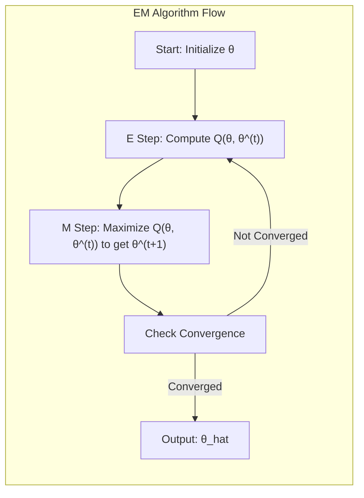
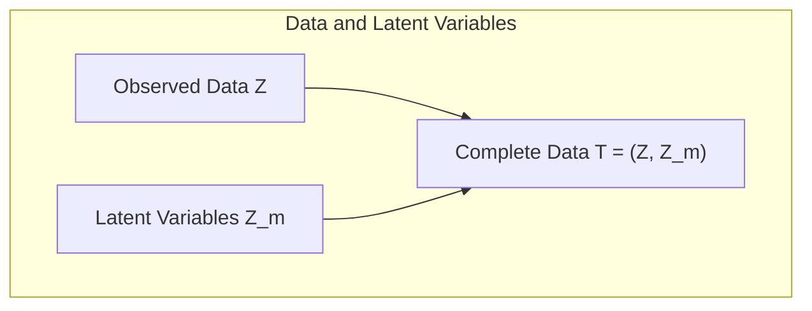
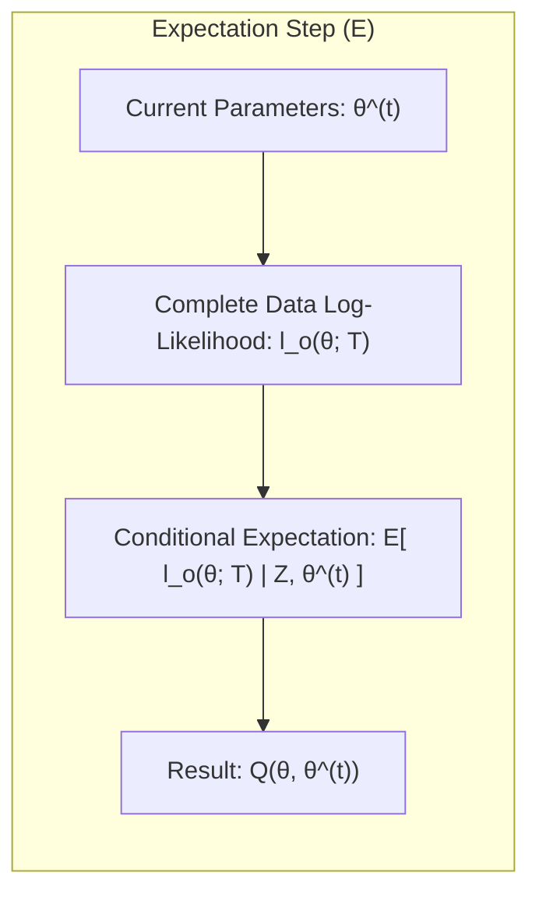
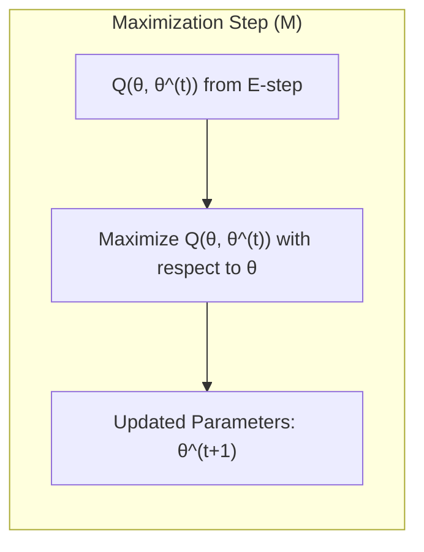
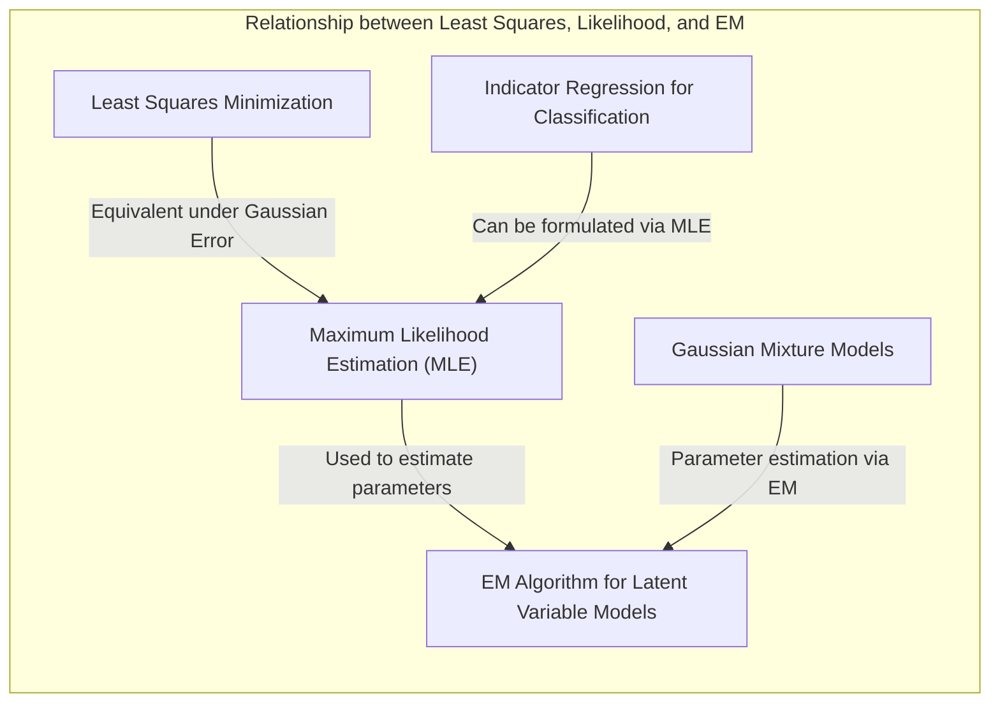
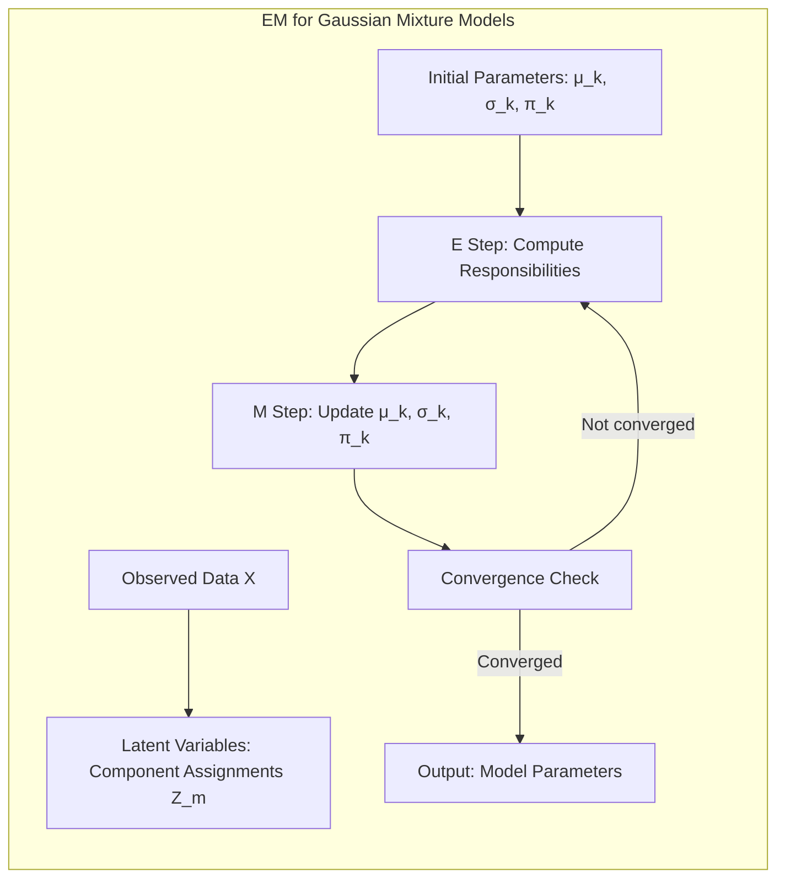
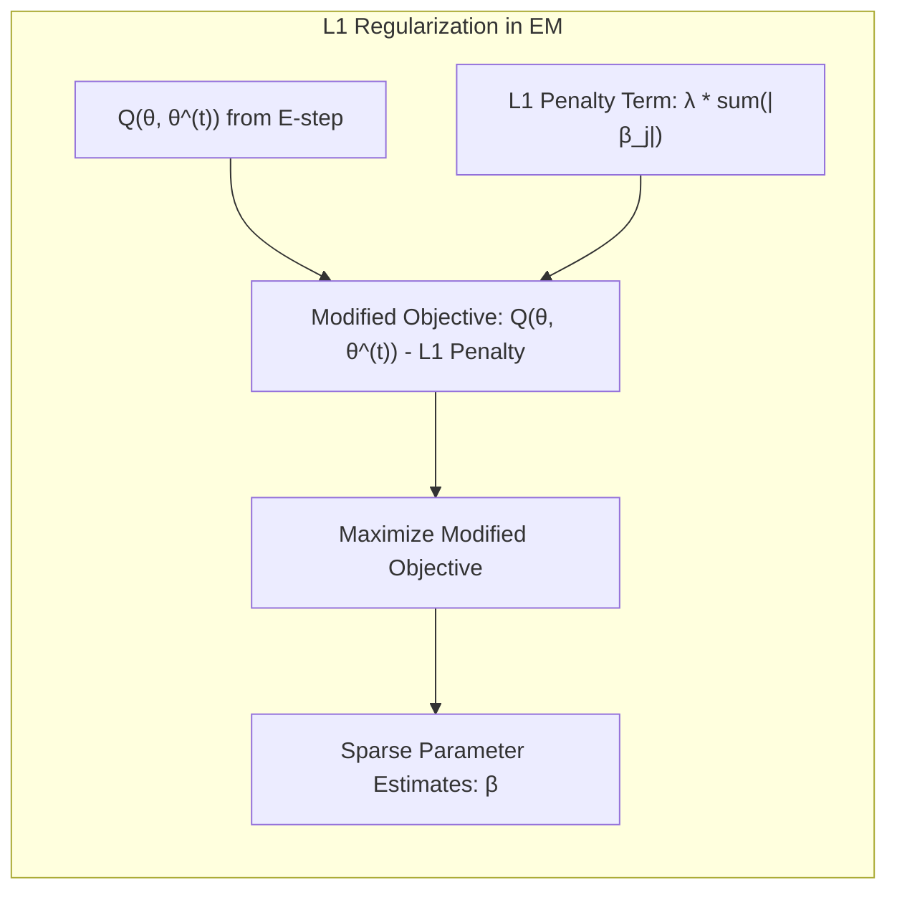
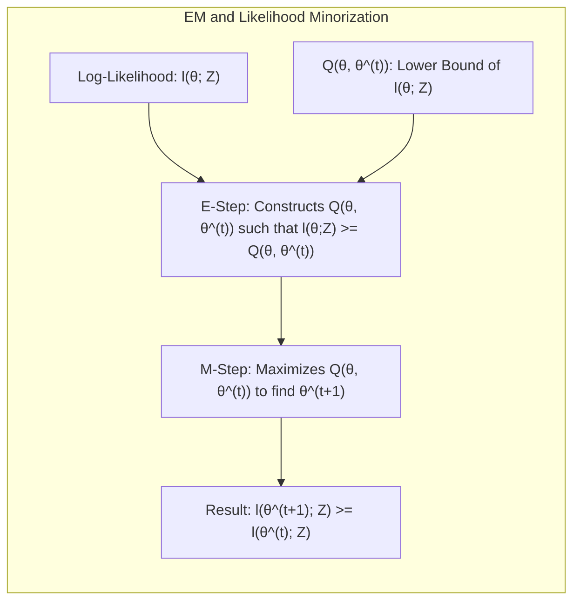
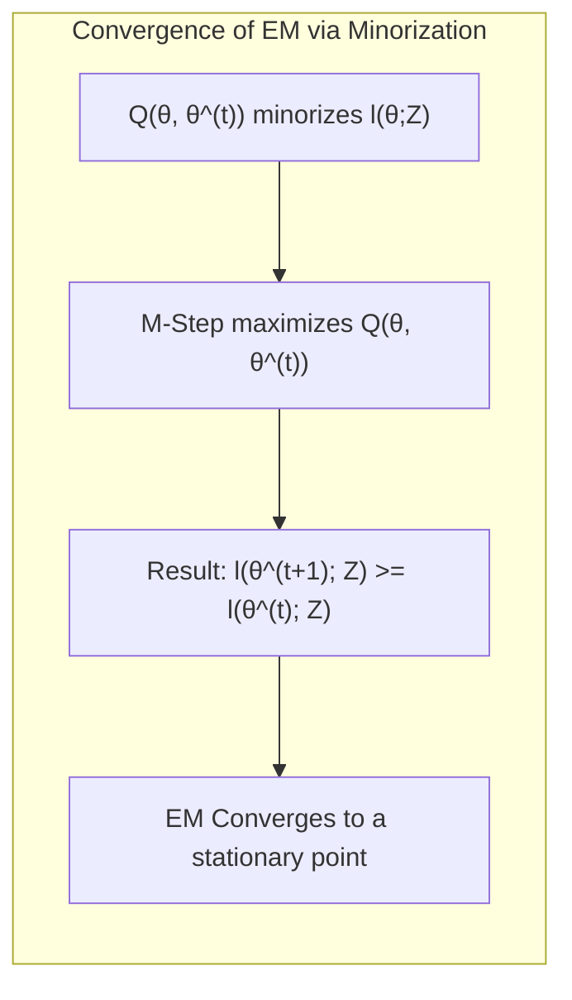

## Model Inference and Averaging: A Deep Dive into EM Convergence


### Introdução

O algoritmo Expectation-Maximization (EM) é uma ferramenta iterativa poderosa e amplamente utilizada para encontrar estimativas de máxima verossimilhança (MLE) em modelos estatísticos que envolvem variáveis latentes ou dados faltantes [^8.5]. Conforme mencionado em [^8.1], muitos métodos de ajuste de modelos, como a minimização de soma de quadrados ou entropia cruzada, são, na verdade, instâncias da abordagem de máxima verossimilhança. O algoritmo EM se torna particularmente valioso quando a maximização direta da verossimilhança é intratável devido à complexidade da função de verossimilhança ou à presença de dados incompletos [^8.5.1]. Este capítulo explora em profundidade o funcionamento do algoritmo EM, especialmente no contexto da sua convergência, utilizando como base as informações fornecidas nas seções 8.1 a 8.5.2.

### Conceitos Fundamentais

O algoritmo EM é especialmente útil em problemas onde a função de verossimilhança, $L(\theta; Z)$, é difícil de maximizar diretamente. Isso frequentemente acontece quando os dados observados $Z$ são vistos como uma versão incompleta de dados completos $T = (Z, Z_m)$, onde $Z_m$ representa as variáveis latentes ou os dados faltantes [^8.5.2].

**Conceito 1:** *Dados Incompletos e Variáveis Latentes:* A essência do algoritmo EM reside na ideia de tratar dados incompletos, $Z$, como dados completos $T = (Z, Z_m)$, onde $Z_m$ são as **variáveis latentes** não observadas [^8.5.2]. O objetivo é encontrar o valor de $\theta$ que maximiza a verossimilhança dos dados observados $L(\theta; Z)$, mesmo com a presença dessas variáveis latentes. Um exemplo prático disso, conforme citado em [^8.5.1], é a modelagem de densidades através de misturas Gaussianas, onde a pertença de cada ponto aos componentes da mistura é desconhecida. Nesse cenário, as variáveis latentes $Z_m$ representariam a identidade do componente gaussiano de cada observação. Em termos matemáticos, o problema original é encontrar:

$$ \hat{\theta} = \underset{\theta}{\operatorname{argmax}} L(\theta; Z) = \underset{\theta}{\operatorname{argmax}} P(Z|\theta) $$

onde $P(Z|\theta)$ é a verossimilhança dos dados observados dada a parametrização $\theta$. A dificuldade surge da complexidade de $P(Z|\theta)$, já que $Z$ é uma versão incompleta do conjunto de dados completo $T$.

**Lemma 1:** *Relação entre a Verossimilhança dos Dados Observados e dos Dados Completos:* Se temos uma densidade conjunta $P(T|\theta)$ para o conjunto de dados completo $T$, podemos obter a verossimilhança dos dados observados $P(Z|\theta)$ integrando sobre todas as possíveis configurações de variáveis latentes $Z_m$:

$$P(Z|\theta) = \int P(Z, Z_m|\theta)dZ_m = \int P(T|\theta)dZ_m$$

O problema é que maximizar a verossimilhança dos dados observados diretamente pode ser difícil [^8.5.1]. O algoritmo EM oferece uma maneira iterativa de lidar com essa dificuldade.

> 💡 **Exemplo Numérico:** Considere um exemplo simplificado com duas observações $Z = \{z_1, z_2\}$, que poderiam ser resultados de dois lançamentos de uma moeda com probabilidade $\theta$ de dar cara. A variável latente $Z_m$ é desconhecida, mas vamos supor que cada observação vem de uma de duas moedas com probabilidades diferentes $\theta_1$ e $\theta_2$. Portanto, nosso dado completo seria $T = \{(z_1, m_1), (z_2, m_2)\}$, onde $m_i \in \{1, 2\}$ indica de qual moeda veio a observação $z_i$. Se $z_1$ é cara e $z_2$ é coroa,  a verossimilhança dos dados observados é dada por $P(Z|\theta) = \sum_{m_1} \sum_{m_2} P(z_1,m_1,z_2,m_2|\theta_1, \theta_2)$, que se torna mais complexo. O algoritmo EM nos ajudaria a iterativamente estimar $\theta_1$ e $\theta_2$ (e as probabilidades de cada observação vir de cada moeda) sem precisar resolver a integral explicitamente.

**Conceito 2:** *O Algoritmo EM:* O algoritmo EM alterna entre dois passos cruciais: Expectation (E) e Maximization (M), conforme detalhado em [^8.5.2]. O passo E computa a expectativa do log-verossimilhança dos dados completos dada uma estimativa atual de $\theta$. O passo M encontra a estimativa de $\theta$ que maximiza essa expectativa.

**Passo E (Expectation):** Dado o valor atual dos parâmetros $\theta^{(t)}$, computa a expectativa do log-verossimilhança dos dados completos, $l_o(\theta; T)$, sobre a distribuição das variáveis latentes dadas os dados observados e a estimativa atual dos parâmetros:

$$ Q(\theta, \theta^{(t)}) = \mathbb{E}[l_o(\theta; T)| Z, \theta^{(t)}] $$

onde $l_o(\theta; T) = \log P(T|\theta)$ é o log-verossimilhança dos dados completos. Esta expectativa, $Q(\theta, \theta^{(t)})$, é um limite inferior para o log-verossimilhança dos dados observados, $l(\theta; Z)$, que pode ser derivado utilizando a desigualdade de Jensen. [^8.5.2]

**Corolário 1:** *A Função Q como Limite Inferior:* Usando a desigualdade de Jensen e a decomposição da log-verossimilhança, mostramos que $Q(\theta, \theta^{(t)})$ serve como um limite inferior para a verossimilhança marginal, conforme citado em [^8.5.2]:

$$ l(\theta; Z) = \mathbb{E}[l_o(\theta; T) | Z, \theta] - \mathbb{E}[l_1(\theta; Z_m | Z) | Z, \theta] $$

onde $l_1(\theta; Z_m | Z)$ é o logaritmo da densidade condicional das variáveis latentes dados os dados observados e os parâmetros. O passo E essencialmente computa o primeiro termo.

> 💡 **Exemplo Numérico:** Continuando com o exemplo das moedas, no Passo E, dado valores iniciais para $\theta_1^{(t)}$ e $\theta_2^{(t)}$ (por exemplo, $\theta_1^{(0)} = 0.3$ e $\theta_2^{(0)} = 0.7$), calculamos a probabilidade de cada observação vir da moeda 1 ou da moeda 2. Se $z_1$ foi cara, a probabilidade de $z_1$ vir da moeda 1 seria $p(m_1=1|z_1, \theta_1^{(0)}, \theta_2^{(0)}) \propto \theta_1^{(0)}$, e de vir da moeda 2 seria  $p(m_1=2|z_1, \theta_1^{(0)}, \theta_2^{(0)}) \propto \theta_2^{(0)}$. Essas probabilidades (responsabilidades) são então usadas para calcular $Q(\theta, \theta^{(t)})$. Por exemplo, se tivermos 10 observações, 6 caras e 4 coroas, e calcularmos que a responsabilidade da moeda 1 para as 6 caras é de 0.7 e para as coroas é de 0.2, e para a moeda 2 0.3 para caras e 0.8 para coroas, o passo E calcula a expectativa ponderada dos logs de verossimilhança.
```python
import numpy as np
# Dados de exemplo
n_heads = 6
n_tails = 4
responsibilities_coin1_heads = 0.7
responsibilities_coin1_tails = 0.2
responsibilities_coin2_heads = 0.3
responsibilities_coin2_tails = 0.8

# Função log-verossimilhança para uma moeda (binomial)
def log_likelihood_coin(n_heads, n_tails, p):
  return n_heads * np.log(p) + n_tails * np.log(1-p)

# Cálculo da função Q (apenas os valores esperados)
Q_value_coin1 = (responsibilities_coin1_heads * log_likelihood_coin(1, 0, 0.3) + responsibilities_coin1_tails * log_likelihood_coin(0, 1, 0.3)) * n_heads + (responsibilities_coin1_tails * log_likelihood_coin(0, 1, 0.3)+responsibilities_coin1_heads*log_likelihood_coin(1,0,0.3))*n_tails
Q_value_coin2 = (responsibilities_coin2_heads * log_likelihood_coin(1, 0, 0.7)+responsibilities_coin2_tails * log_likelihood_coin(0, 1, 0.7))*n_heads + (responsibilities_coin2_tails*log_likelihood_coin(0,1,0.7)+responsibilities_coin2_heads*log_likelihood_coin(1,0,0.7))*n_tails

print(f"Q(theta, theta^(t)) para a moeda 1: {Q_value_coin1:.2f}")
print(f"Q(theta, theta^(t)) para a moeda 2: {Q_value_coin2:.2f}")
```

**Passo M (Maximization):** Encontra o valor de $\theta$ que maximiza a função $Q(\theta, \theta^{(t)})$:

$$ \theta^{(t+1)} = \underset{\theta}{\operatorname{argmax}} Q(\theta, \theta^{(t)}) $$

O algoritmo EM alterna iterativamente entre os passos E e M, com a garantia de que a verossimilhança marginal dos dados observados, $l(\theta; Z)$, aumenta ou permanece constante em cada iteração.

> 💡 **Exemplo Numérico:** Continuando com o exemplo anterior, no Passo M, maximizamos a função $Q$ calculada no Passo E para obter novas estimativas dos parâmetros. Se as responsabilidades calculadas no Passo E indicam que as observações "caras" têm maior probabilidade de vir da moeda 2 (e as "coroas" da moeda 1), as novas estimativas seriam, por exemplo, $\theta_1^{(1)} =  (0.7*6 + 0.2*4)/(6+4) = 0.5$ e  $\theta_2^{(1)} =  (0.3*6 + 0.8*4)/(6+4)=0.5$. Essas novas estimativas são então usadas no próximo passo E e o ciclo se repete até a convergência.

**Conceito 3:** *Convergência do EM:* A convergência do algoritmo EM é garantida, conforme descrito em [^8.5.2]. A cada iteração, a verossimilhança dos dados observados, $L(\theta; Z)$, não diminui. O algoritmo converge para um ponto estacionário da função de verossimilhança, que pode ser um máximo local ou um ponto de sela. No entanto, não há garantia de convergência para o máximo global da função de verossimilhança [^8.5.1].

> ⚠️ **Nota Importante**: A convergência do EM para um máximo local destaca a importância de inicializar os parâmetros de forma adequada, pois diferentes inicializações podem levar a diferentes pontos de convergência [^8.5.1].

### Regressão Linear e Mínimos Quadrados para Classificação


O algoritmo EM também está relacionado a métodos como a regressão de indicadores em problemas de classificação. Embora a regressão de indicadores possa ser implementada diretamente via mínimos quadrados, a formulação usando o algoritmo EM revela uma visão mais profunda da sua ligação com modelos probabilísticos.

O método de regressão de indicadores codifica cada classe como um vetor binário, e a regressão linear é aplicada para estimar probabilidades de classe. Essa técnica pode apresentar limitações devido à possibilidade de gerar estimativas de probabilidade fora do intervalo [0,1] [^8.2].  Um tratamento probabilístico mais formal, como o da regressão logística, conforme discutido em [^8.4], geralmente oferece estimativas mais estáveis.

**Lemma 2:** *Equivalência sob Suposições Gaussianas:* Se assumirmos que os erros do modelo são Gaussianos e o modelo em si é linear, o problema de minimização de mínimos quadrados coincide com a maximização de verossimilhança Gaussiana. No contexto de regressão de indicadores, se assumirmos que a variável resposta $y$ segue uma distribuição normal dada a entrada $x$ e o vetor de parâmetros $\beta$ ($y|x, \beta \sim N(h(x)^T \beta, \sigma^2)$), o estimador de mínimos quadrados também será o estimador de máxima verossimilhança.

> 💡 **Exemplo Numérico:** Suponha um problema de classificação binária onde a classe 1 é representada por $y=1$ e a classe 0 por $y=0$. Na regressão de indicadores, se tivermos 3 pontos de dados com características $x_1 = 1, x_2 = 2, x_3 = 3$ e classes $y_1 = 1, y_2 = 0, y_3 = 1$, usaríamos mínimos quadrados para ajustar um modelo linear.  Se o modelo resultante fosse $\hat{y} = 0.1 + 0.3x$,  para $x=1$, $\hat{y} = 0.4$, para $x=2$, $\hat{y}=0.7$, e para $x=3$, $\hat{y}=1.0$.  Se considerarmos um modelo gaussiano, com desvio padrão $\sigma=0.5$, o resultado da regressão linear via mínimos quadrados seria equivalente à MLE se calcularmos a verossimilhança de cada ponto dada a gaussiana. O EM poderia então ser usado para calcular os parâmetros dos Gaussianos, dado um conjunto de dados incompleto (por exemplo, se houvesse variáveis latentes como incerteza no rótulo da classe).

**Corolário 2:** *Otimização via EM para Modelos de Misturas Gaussianas:* Para um modelo de mistura Gaussiana, a função de verossimilhança completa envolve as variáveis de pertença a cada componente, que são, por sua vez, as variáveis latentes. Aqui, o algoritmo EM torna-se crucial para encontrar os estimadores de máxima verossimilhança dos parâmetros da mistura, pois a maximização direta da verossimilhança é dificultada pela soma sob a logaritmo [^8.5.1]. No passo E, as responsabilidades de cada ponto aos componentes da mistura são computadas e, no passo M, os parâmetros da mistura são atualizados [^8.5.1].

> 💡 **Exemplo Numérico:** Considere um conjunto de dados unidimensional com 10 pontos que parecem vir de duas Gaussianas distintas. Suponha que inicialmente definimos os parâmetros como $\mu_1 = 2$, $\sigma_1 = 1$, $\mu_2 = 8$, $\sigma_2 = 1$, e a proporção de mistura $\pi = 0.5$. No passo E, para cada ponto $x_i$, calculamos a probabilidade de pertencer à gaussiana 1, $P(z_i = 1 | x_i, \mu_1, \mu_2, \sigma_1, \sigma_2, \pi)$ e à gaussiana 2, $P(z_i = 2 | x_i, \mu_1, \mu_2, \sigma_1, \sigma_2, \pi)$. No passo M, usamos essas responsabilidades para recalcular $\mu_1, \mu_2, \sigma_1, \sigma_2$ e $\pi$, atualizando as estimativas dos parâmetros da mistura. Por exemplo, $\mu_1^{novo} = \sum_i P(z_i=1|x_i, \theta) x_i / \sum_i P(z_i=1|x_i, \theta)$.
```python
import numpy as np
from scipy.stats import norm

# Dados de exemplo
data = np.array([1.5, 2.0, 2.5, 7.5, 8.0, 8.5, 3.0, 7.0, 9.0, 1.0])

# Inicialização dos parâmetros
mu1 = 2.0
sigma1 = 1.0
mu2 = 8.0
sigma2 = 1.0
pi = 0.5 # proporção de mistura

# Passo E
def e_step(data, mu1, sigma1, mu2, sigma2, pi):
    r1 = pi * norm.pdf(data, mu1, sigma1)
    r2 = (1 - pi) * norm.pdf(data, mu2, sigma2)
    responsibilities = r1 / (r1 + r2)
    return responsibilities

# Passo M
def m_step(data, responsibilities):
    mu1 = np.sum(responsibilities * data) / np.sum(responsibilities)
    mu2 = np.sum((1-responsibilities) * data) / np.sum(1-responsibilities)
    sigma1 = np.sqrt(np.sum(responsibilities * (data - mu1)**2) / np.sum(responsibilities))
    sigma2 = np.sqrt(np.sum((1 - responsibilities) * (data - mu2)**2) / np.sum(1-responsibilities))
    pi = np.mean(responsibilities)
    return mu1, sigma1, mu2, sigma2, pi

# Iterações do EM
for i in range(5):
    responsibilities = e_step(data, mu1, sigma1, mu2, sigma2, pi)
    mu1, sigma1, mu2, sigma2, pi = m_step(data, responsibilities)
    print(f"Iteration {i+1}: mu1={mu1:.2f}, mu2={mu2:.2f}, sigma1={sigma1:.2f}, sigma2={sigma2:.2f}, pi={pi:.2f}")
```

### Métodos de Seleção de Variáveis e Regularização em Classificação

Em problemas de classificação, assim como em modelos de regressão, pode ser crucial incorporar métodos de seleção de variáveis e regularização, conforme discutido em [^8.2]. O algoritmo EM pode ser adaptado para acomodar métodos de regularização, por exemplo, impondo penalidades na função de verossimilhança. No entanto, a regularização geralmente é implementada no passo M, e não no passo E.

A regularização é importante para controlar a complexidade do modelo e prevenir o overfitting. Conforme abordado em [^8.4.4], penalidades L1 e L2 são frequentemente usadas em modelos logísticos para gerar modelos esparsos e estáveis.

**Lemma 3:** *Efeito da Regularização L1 na Esparsidade:* A penalização L1 (Lasso) introduzida na função de verossimilhança (ou na função Q no passo M do EM) resulta em estimativas de parâmetros esparsas, forçando alguns coeficientes a serem exatamente zero.

**Prova do Lemma 3:** A penalidade L1, dada por $\lambda \sum_{j=1}^{p} |\beta_j|$, tem uma derivada com um sinal que depende do sinal do parâmetro $\beta_j$. Este termo, ao ser incluído na função de custo, promove a zeragem de certos coeficientes $\beta_j$. O efeito da penalidade L1 é tal que, durante a otimização, alguns coeficientes são levados exatamente a zero, resultando em um modelo esparso e, portanto, com menos variáveis, onde somente as mais relevantes permanecem. $\blacksquare$

> 💡 **Exemplo Numérico:** Suponha que estamos usando regressão logística com EM e temos 5 variáveis preditoras. Sem regularização, os coeficientes podem ser $\beta = [0.5, -0.3, 0.8, 0.2, -0.1]$. Se aplicarmos uma regularização L1 com $\lambda = 0.5$, no passo M, a otimização da função Q incluiria um termo de penalidade que favorece coeficientes nulos. Depois de algumas iterações, os coeficientes podem se tornar $\beta = [0.4, 0, 0.7, 0, 0]$. A penalidade L1 empurrou os coeficientes para 0, selecionando apenas as variáveis mais importantes para o modelo.
```python
import numpy as np
from scipy.optimize import minimize

# Dados de exemplo
X = np.array([[1, 2, 3, 4, 5],
              [2, 3, 4, 5, 6],
              [3, 4, 5, 6, 7],
              [4, 5, 6, 7, 8],
              [5, 6, 7, 8, 9]])
y = np.array([0, 1, 0, 1, 0])

# Função de custo da regressão logística
def logistic_cost(beta, X, y, lambda_l1):
  logits = X @ beta
  probabilities = 1 / (1 + np.exp(-logits))
  cross_entropy = -np.sum(y * np.log(probabilities) + (1 - y) * np.log(1 - probabilities))
  l1_penalty = lambda_l1 * np.sum(np.abs(beta))
  return cross_entropy + l1_penalty

# Exemplo com regularização L1 no passo M
initial_beta = np.zeros(5)
lambda_l1 = 0.5

# Otimização usando scipy
result = minimize(logistic_cost, initial_beta, args=(X, y, lambda_l1), method='L-BFGS-B')
optimized_beta = result.x
print("Beta Regularizado L1:", optimized_beta)

# O mesmo processo seria feito no Passo M do algoritmo EM, otimizando a função Q
```

**Corolário 3:** *Implementação da Regularização no EM:* Ao usar o algoritmo EM com regularização, a regularização é geralmente adicionada ao passo M, que envolve a maximização da função Q, de forma a obter o melhor valor de $\theta$ dados os dados e a expectativa computada no passo E. A regularização geralmente é adicionada como um termo adicional da função a ser maximizada no passo M, levando a um problema de otimização regularizado.

### Separating Hyperplanes e Perceptrons

O conceito de hiperplanos separadores é fundamental em problemas de classificação, conforme discutido em [^8.5.2]. Um hiperplano é uma superfície que divide o espaço de características em regiões correspondentes às diferentes classes. A ideia de maximizar a margem de separação leva ao conceito de hiperplanos ótimos, que podem ser encontrados usando métodos de otimização que envolvem a dualidade de Wolfe.

O Perceptron de Rosenblatt, conforme mencionado em [^8.5.1], é um algoritmo simples para aprendizado de classificadores lineares que pode ser visto como uma versão simplificada do algoritmo EM para um caso específico. No entanto, sua convergência é garantida apenas para dados linearmente separáveis.

### Pergunta Teórica Avançada: Qual a Relação entre a Otimização do EM e a Minorização da Função de Verossimilhança?
**Resposta:**

A convergência do algoritmo EM pode ser compreendida em termos de minorização da função de verossimilhança, conforme citado em [^8.5.2]. O passo E do EM constrói uma função $Q(\theta, \theta^{(t)})$ que minoriza a função de verossimilhança, ou seja, $l(\theta;Z) \geq Q(\theta; \theta^{(t)})$, e $l(\theta^{(t)};Z) = Q(\theta^{(t)}; \theta^{(t)})$. O passo M maximiza $Q(\theta, \theta^{(t)})$ em relação a $\theta$.

**Lemma 4:** *Minorização da Verossimilhança:* Podemos demonstrar que a função $Q(\theta; \theta^{(t)})$ minoriza a log-verossimilhança dos dados observados $l(\theta;Z)$, usando a desigualdade de Jensen para o segundo termo no log-verossimilhança, como mostrado em [^8.5.2]:

$$
l(\theta;Z) = \mathbb{E}[l_o(\theta;T) | Z, \theta] - \mathbb{E}[l_1(\theta; Z_m | Z) | Z, \theta]
$$
$$
\mathbb{E}[l_1(\theta; Z_m | Z) | Z, \theta] \geq \mathbb{E}[l_1(\theta^{(t)}; Z_m | Z) | Z, \theta^{(t)}]
$$
Dessa forma, $Q(\theta; \theta^{(t)}) \leq l(\theta;Z)$ e $Q(\theta^{(t)}; \theta^{(t)}) = l(\theta^{(t)};Z)$.

**Corolário 4:** *Garantia de Convergência via Minorização:* Como o passo M maximiza $Q(\theta, \theta^{(t)})$ e $Q(\theta, \theta^{(t)})$ minoriza $l(\theta; Z)$, cada iteração do EM aumenta ou mantém constante a log-verossimilhança dos dados observados, garantindo a convergência para um ponto estacionário, como mostrado na seção 8.5.2 [^8.5.2].

> ⚠️ **Ponto Crucial:** A perspectiva de minorização da verossimilhança fornece um entendimento profundo da garantia de convergência do algoritmo EM e oferece também uma justificativa teórica para o funcionamento do algoritmo EM.

### Conclusão

O algoritmo EM é uma ferramenta poderosa para encontrar estimativas de máxima verossimilhança em problemas com variáveis latentes ou dados faltantes. Sua convergência é garantida através de iterações que aumentam (ou mantém constante) a verossimilhança dos dados observados. A formulação do EM e sua relação com a minorização da verossimilhança revelam sua natureza teórica profunda e oferecem insights valiosos para sua aplicação em diversos problemas práticos, como modelagem de misturas gaussianas e regressão de indicadores [^8.5.1]. A compreensão detalhada de seus mecanismos de convergência, assim como sua relação com outros métodos como mínimos quadrados e regularização, oferece uma base sólida para a aplicação e adaptação do algoritmo EM em problemas de aprendizado de máquina e estatística avançada.

### Footnotes

[^8.1]: "For most of this book, the fitting (learning) of models has been achieved by minimizing a sum of squares for regression, or by minimizing cross-entropy for classification. In fact, both of these minimizations are instances of the maximum likelihood approach to fitting."
[^8.2]: "The bootstrap method provides a direct computational way of assessing uncertainty, by sampling from the training data."
[^8.5]: "The EM algorithm is a popular tool for simplifying difficult maximum likelihood problems."
[^8.5.1]: "In this section we describe a simple mixture model for density estimation, and the associated EM algorithm for carrying out maximum likelihood estimation."
[^8.5.2]: "The above procedure is an example of the EM (or Baum-Welch) algorithm for maximizing likelihoods in certain classes of problems. These problems are ones for which maximization of the likelihood is difficult, but made easier by enlarging the sample with latent (unobserved) data."
