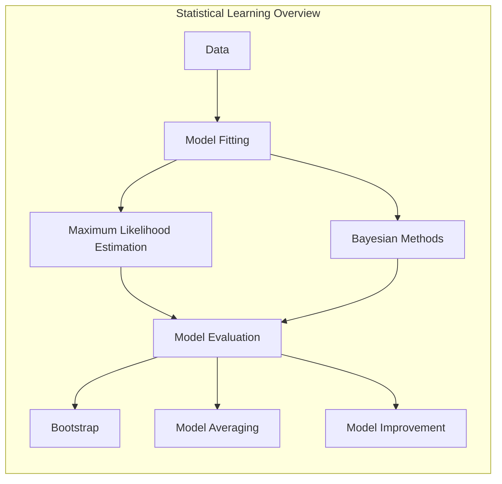
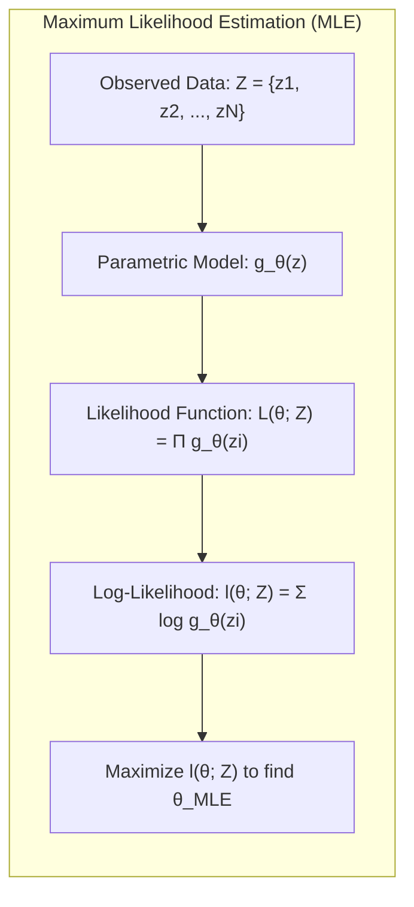
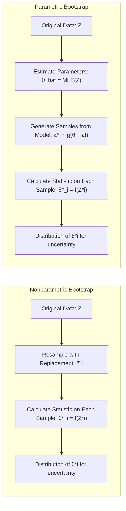
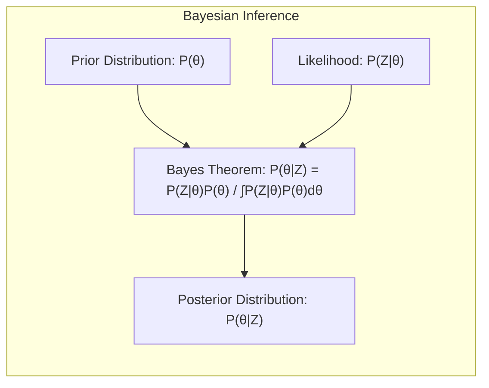
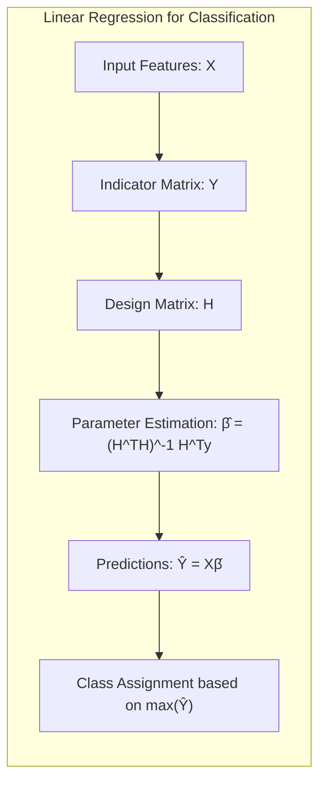
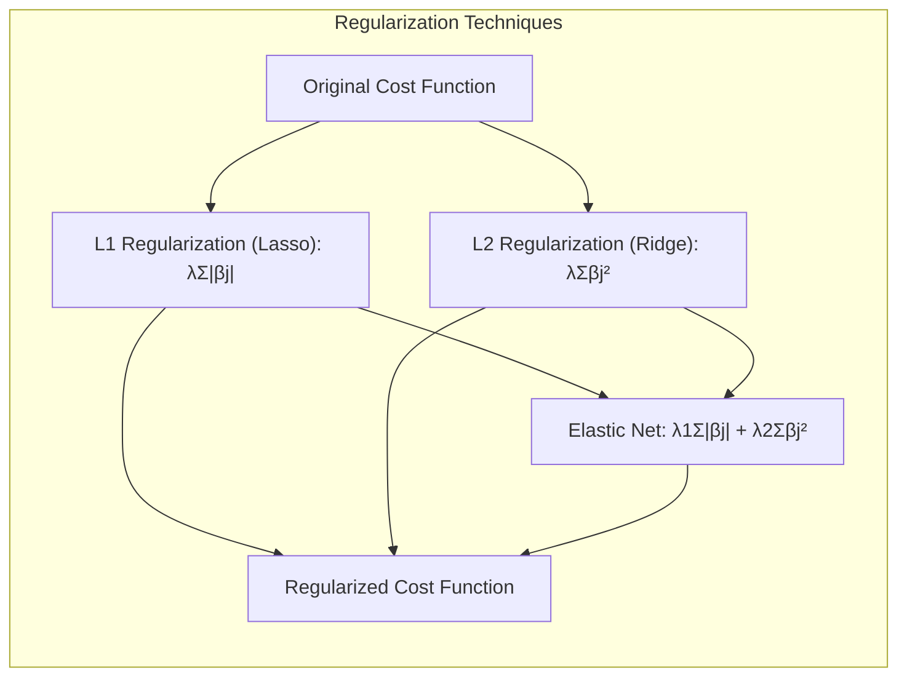

## Model Inference and Averaging: A Deep Dive into Statistical Learning Techniques



### Introdução
Este capítulo explora em profundidade os métodos de inferência e modelagem estatística, focando em abordagens tanto frequentistas quanto bayesianas. O fitting, ou aprendizado de modelos, usualmente envolve a minimização de alguma função de erro, como a soma de quadrados para regressão ou a cross-entropy para classificação. Esses procedimentos, na verdade, são casos específicos da abordagem de **Maximum Likelihood** [^8.1]. Adicionalmente, exploraremos técnicas para avaliar a incerteza dos modelos usando o **Bootstrap** [^8.1] e outros métodos relacionados como model averaging e model improvement.

### Conceitos Fundamentais

**Conceito 1: Maximum Likelihood Estimation (MLE)**

A **Maximum Likelihood Estimation (MLE)** é uma abordagem fundamental na estatística para estimar os parâmetros de um modelo a partir de dados observados. A ideia central é encontrar os valores dos parâmetros que maximizam a probabilidade dos dados terem sido gerados pelo modelo. Em essência, busca-se o modelo que melhor explica os dados observados, conforme mencionado em [^8.1]. Formalmente, dado um conjunto de dados $Z = \{z_1, z_2, \ldots, z_N\}$, onde cada $z_i$ é uma observação, e um modelo paramétrico que descreve a distribuição desses dados como $g_{\theta}(z)$, onde $\theta$ são os parâmetros do modelo, a função de **likelihood** é dada por:

$$L(\theta; Z) = \prod_{i=1}^{N} g_{\theta}(z_i)$$

O objetivo da MLE é encontrar o valor de $\theta$ que maximiza essa função de likelihood. Em muitos casos, é mais fácil trabalhar com o logaritmo da função de likelihood, denominado log-likelihood:

$$l(\theta; Z) = \sum_{i=1}^{N} \log g_{\theta}(z_i)$$

A MLE é um método bastante utilizado devido a suas boas propriedades assintóticas, como consistência e eficiência, sob certas condições de regularidade [^8.5.2].

> 💡 **Exemplo Numérico:**
> Suponha que temos um conjunto de dados $Z$ de 5 amostras, $Z = \{2.1, 2.8, 3.5, 4.2, 4.9\}$, e queremos modelar esses dados usando uma distribuição normal com média $\mu$ e desvio padrão $\sigma$. Assumimos que $\sigma = 1$ para simplificar, e queremos estimar $\mu$ usando MLE.
>
> A função de densidade de probabilidade (PDF) para uma distribuição normal é:
>
> $$g_{\mu}(z_i) = \frac{1}{\sqrt{2\pi\sigma^2}} e^{-\frac{(z_i - \mu)^2}{2\sigma^2}}$$
>
> Como $\sigma = 1$, a log-likelihood é:
>
> $$l(\mu; Z) = \sum_{i=1}^{5} \log\left(\frac{1}{\sqrt{2\pi}} e^{-\frac{(z_i - \mu)^2}{2}}\right) = - \frac{5}{2}\log(2\pi) - \frac{1}{2}\sum_{i=1}^{5} (z_i - \mu)^2$$
>
> Para maximizar $l(\mu; Z)$, podemos minimizar a soma dos quadrados $\sum_{i=1}^{5} (z_i - \mu)^2$. A solução para isso é a média amostral:
>
> $$\hat{\mu} = \frac{1}{5} \sum_{i=1}^{5} z_i = \frac{2.1 + 2.8 + 3.5 + 4.2 + 4.9}{5} = 3.5$$
>
> Portanto, a estimativa de máxima verossimilhança para $\mu$ é 3.5.
>
> ```python
> import numpy as np
> from scipy.stats import norm
>
> data = np.array([2.1, 2.8, 3.5, 4.2, 4.9])
> mu_mle = np.mean(data)
> print(f"MLE estimate of mu: {mu_mle}")
> ```



**Lemma 1:** Sob condições de regularidade, o estimador de máxima verossimilhança (MLE) é consistente, ou seja, converge para o verdadeiro valor do parâmetro à medida que o tamanho da amostra aumenta.

*Prova:* Seja $\theta_0$ o verdadeiro valor do parâmetro e $\hat{\theta}_N$ o estimador de máxima verossimilhança baseado em $N$ observações. Sob condições de regularidade, temos que:

$$\lim_{N\to\infty} P(|\hat{\theta}_N - \theta_0| > \epsilon) = 0$$

para qualquer $\epsilon > 0$. Isso significa que o estimador MLE se torna arbitrariamente próximo do verdadeiro valor do parâmetro à medida que o tamanho da amostra $N$ tende ao infinito. $\blacksquare$

**Conceito 2: Bootstrap**

O **Bootstrap** é um método de reamostragem computacional para avaliar a incerteza em estimativas estatísticas. Em vez de fazer suposições teóricas sobre a distribuição dos dados, o bootstrap simula o processo de amostragem utilizando os dados observados [^8.2.1]. Existem duas abordagens principais: **nonparametric bootstrap** e **parametric bootstrap**.

No nonparametric bootstrap, amostras são geradas com reposição a partir dos dados originais, criando conjuntos de dados sintéticos que imitam a variabilidade da amostra original [^8.2.1]. Para cada amostra bootstrap, a estimativa estatística de interesse é calculada, e a distribuição dessas estimativas bootstrapped é utilizada para avaliar a incerteza da estimativa original. O parametric bootstrap, por outro lado, envolve a geração de dados a partir de um modelo paramétrico, utilizando estimativas dos parâmetros obtidas a partir dos dados originais [^8.2.2].

> 💡 **Exemplo Numérico:**
> Considere os mesmos dados $Z = \{2.1, 2.8, 3.5, 4.2, 4.9\}$ do exemplo anterior. Vamos usar o bootstrap não paramétrico para estimar a incerteza da média amostral.
>
> 1. **Reamostragem:** Criamos, digamos, 1000 amostras bootstrap, cada uma com 5 pontos amostrados com reposição de $Z$.
> 2. **Estimativa da média:** Calculamos a média amostral para cada amostra bootstrap.
> 3. **Incerteza:** Avaliamos a distribuição das médias bootstrapped para obter intervalos de confiança.
>
> ```python
> import numpy as np
>
> data = np.array([2.1, 2.8, 3.5, 4.2, 4.9])
> n_bootstrap = 1000
> bootstrap_means = []
>
> for _ in range(n_bootstrap):
>     bootstrap_sample = np.random.choice(data, size=len(data), replace=True)
>     bootstrap_means.append(np.mean(bootstrap_sample))
>
> bootstrap_means = np.array(bootstrap_means)
> confidence_interval = np.percentile(bootstrap_means, [2.5, 97.5])
> print(f"Bootstrap 95% confidence interval: {confidence_interval}")
> ```
>
> A saída mostrará um intervalo de confiança para a média, que quantifica a incerteza da estimativa.



**Corolário 1:** O bootstrap converge para a distribuição assintótica da estatística sob condições de regularidade e conforme o número de reamostragens aumenta.

*Prova:* Pelo Teorema de Glivenko-Cantelli, a distribuição empírica converge para a distribuição real à medida que o tamanho da amostra aumenta. Assim, as amostras bootstrap tornam-se mais representativas da distribuição real. Além disso, pela continuidade da estatística, a distribuição das estimativas bootstrapped converge para a distribuição assintótica da estatística de interesse. $\blacksquare$

**Conceito 3: Bayesian Methods**

Os **Métodos Bayesianos** fornecem uma abordagem diferente para a inferência estatística, integrando conhecimento prévio (prior) sobre os parâmetros com a informação dos dados observados (likelihood), resultando em uma distribuição posterior dos parâmetros [^8.3]. Em contraste com os métodos frequentistas, que tratam os parâmetros como fixos e desconhecidos, a abordagem bayesiana trata os parâmetros como variáveis aleatórias que seguem uma distribuição de probabilidade.

O teorema de Bayes fornece a base para a inferência bayesiana:

$$P(\theta|Z) = \frac{P(Z|\theta)P(\theta)}{\int P(Z|\theta)P(\theta)d\theta}$$

Onde:
-   $P(\theta|Z)$ é a distribuição posterior dos parâmetros, dados os dados observados.
-   $P(Z|\theta)$ é a likelihood, ou verossimilhança, da observação dos dados dado os parâmetros.
-   $P(\theta)$ é a distribuição prior, expressando nosso conhecimento prévio sobre os parâmetros antes da observação dos dados.
-   A integral no denominador é uma constante de normalização.

Os métodos bayesianos são particularmente úteis quando há informação prévia disponível, e a incerteza dos parâmetros pode ser explicitamente quantificada através da distribuição posterior. [^8.3]

> ⚠️ **Nota Importante**: A escolha da distribuição prior é crucial na inferência bayesiana e influencia os resultados.
> ❗ **Ponto de Atenção**: A distribuição posterior representa nossa incerteza sobre os parâmetros após observar os dados.
> ✔️ **Destaque**: Métodos bayesianos incorporam tanto dados quanto conhecimento prévio na inferência.



### Regressão Linear e Mínimos Quadrados para Classificação

A regressão linear, embora originalmente concebida para problemas de regressão, pode ser adaptada para tarefas de classificação, especialmente para problemas com duas classes ou mais. Na abordagem de **regressão linear para classificação**, as classes são codificadas usando uma **matriz indicadora** e, em seguida, um modelo linear é ajustado aos dados usando o método dos mínimos quadrados.

A ideia central é expressar a classe de um dado ponto como uma combinação linear de suas características (features). Por exemplo, em um problema com K classes, podemos criar uma matriz de indicadores Y de dimensão N x K, onde N é o número de amostras. Cada linha de Y corresponde a uma amostra, e cada coluna representa uma classe. Se a amostra i pertence à classe k, então $Y_{ik}$ = 1, e as outras entradas na linha i são zero. Em seguida, um modelo linear é ajustado, como:

$$\hat{Y} = X\beta$$

Onde X é a matriz de features (design matrix), $\beta$ é a matriz de coeficientes, e $\hat{Y}$ são as classes preditas. As estimativas dos coeficientes $\beta$ são calculadas usando o método dos mínimos quadrados, como em [^8.2]:

$$\hat{\beta} = (H^TH)^{-1}H^Ty$$

Onde $H$ é a matriz de features. Após obter as predições $\hat{Y}$, a classe de cada amostra é atribuída com base na coluna de $\hat{Y}$ com maior valor.

Entretanto, a abordagem de regressão linear para classificação apresenta limitações, especialmente quando se trata de problemas com mais de duas classes [^8.1]. Embora possa fornecer uma fronteira de decisão linear, não garante que as predições estarão entre 0 e 1, o que é ideal para interpretar como probabilidades de classe. A regressão linear também não é inerentemente probabilística e não modela a variabilidade da predição. Além disso, a regressão linear tende a ser sensível a outliers e pode levar a extrapolações fora do intervalo [0,1]. O contexto [^8.2] menciona a estimativa do desvio padrão em modelos de regressão para análise de incerteza:

$$\text{Var}(\hat{\beta}) = (H^TH)^{-1}\hat{\sigma}^2$$

Onde $\hat{\sigma}^2$ é a variância dos erros.

> 💡 **Exemplo Numérico:**
> Considere um problema de classificação binária com duas classes, representadas por 0 e 1. Temos os seguintes dados:
>
> | Feature (x) | Class (y) |
> |-------------|-----------|
> | 1           | 0         |
> | 2           | 0         |
> | 3           | 1         |
> | 4           | 1         |
> | 5           | 1         |
>
>  Nossa matriz de features $X$ e o vetor de classes $y$ são:
>
> $$X = \begin{bmatrix} 1 \\ 2 \\ 3 \\ 4 \\ 5 \end{bmatrix}, \quad y = \begin{bmatrix} 0 \\ 0 \\ 1 \\ 1 \\ 1 \end{bmatrix}$$
> Para aplicar regressão linear, adicionamos um bias (intercepto) na matriz X.
>
> $$H = \begin{bmatrix} 1 & 1 \\ 1 & 2 \\ 1 & 3 \\ 1 & 4 \\ 1 & 5 \end{bmatrix}$$
>
> Agora podemos calcular os coeficientes $\beta$ usando mínimos quadrados:
>
> $\text{Step 1: } H^TH = \begin{bmatrix} 5 & 15 \\ 15 & 55 \end{bmatrix}$
>
> $\text{Step 2: } (H^TH)^{-1} = \begin{bmatrix} 1.1 & -0.3 \\ -0.3 & 0.1 \end{bmatrix}$
>
> $\text{Step 3: } H^Ty = \begin{bmatrix} 3 \\ 12 \end{bmatrix}$
>
> $\text{Step 4: } \hat{\beta} = (H^TH)^{-1}H^Ty = \begin{bmatrix} 1.1 & -0.3 \\ -0.3 & 0.1 \end{bmatrix} \begin{bmatrix} 3 \\ 12 \end{bmatrix} = \begin{bmatrix} -0.3 \\ 0.3 \end{bmatrix}$
>
> Nosso modelo linear é então $\hat{y} = -0.3 + 0.3x$.
>
> Para classificar um novo ponto, digamos $x=2.5$, calculamos $\hat{y} = -0.3 + 0.3*2.5 = 0.45$. Como este valor está mais próximo de 0 que de 1, prediríamos a classe 0.
>
> ```python
> import numpy as np
> from sklearn.linear_model import LinearRegression
>
> X = np.array([[1], [2], [3], [4], [5]])
> y = np.array([0, 0, 1, 1, 1])
>
> model = LinearRegression()
> model.fit(X, y)
>
> H = np.c_[np.ones(X.shape[0]), X]
> beta = np.linalg.inv(H.T @ H) @ H.T @ y
>
> x_new = np.array([[2.5]])
> y_pred = model.predict(x_new)
>
> y_pred_manual = beta[0] + beta[1]*x_new
>
> print(f"Beta coefficients (sklearn): {model.intercept_}, {model.coef_}")
> print(f"Beta coefficients (manual): {beta}")
> print(f"Predicted value for x=2.5 (sklearn): {y_pred}")
> print(f"Predicted value for x=2.5 (manual): {y_pred_manual}")
> ```



**Lemma 2:** Se as classes forem separáveis por um hiperplano, a solução por mínimos quadrados da regressão de matriz indicadora irá convergir para o hiperplano de separação.

*Prova:* Suponha que as classes possam ser separadas por um hiperplano definido por $w^Tx + b = 0$. Ao aplicar regressão linear com uma codificação indicadora para cada classe, os coeficientes $\hat{\beta}$ vão convergir para uma projeção dos dados em um espaço onde as classes são separáveis, ou seja, o hiperplano definido por $w^Tx + b = 0$ [^8.2]. $\blacksquare$

**Corolário 2:** Em um problema de classificação binária, a regressão linear com matriz indicadora pode levar a decisões similares a uma análise discriminante linear, desde que a separabilidade das classes seja boa.

*Prova:* Em um problema de classificação binária, a projeção dos dados no espaço discriminante obtido pela regressão linear é tal que os pontos pertencentes a diferentes classes ficam o mais separados possível, de forma análoga ao que acontece em LDA [^8.2, 8.3]. $\blacksquare$

> "Em alguns cenários, conforme apontado em [^8.3], a regressão logística pode fornecer estimativas mais estáveis de probabilidade, enquanto a regressão de indicadores pode levar a extrapolações fora de [0,1]."
>
> “No entanto, há situações em que a regressão de indicadores, de acordo com [^8.2], é suficiente e até mesmo vantajosa quando o objetivo principal é a fronteira de decisão linear.”

### Métodos de Seleção de Variáveis e Regularização em Classificação


A seleção de variáveis e a regularização são técnicas cruciais em modelos de classificação para evitar overfitting e melhorar a generalização do modelo. Modelos com muitas variáveis podem se ajustar bem aos dados de treinamento, mas podem ter um desempenho ruim em dados não vistos. A regularização impõe restrições aos parâmetros do modelo, promovendo modelos mais simples e estáveis.

A regularização L1 (Lasso) adiciona um termo de penalidade que é a soma dos valores absolutos dos coeficientes ao custo do modelo. Isso tende a empurrar alguns coeficientes para zero, promovendo esparsidade e seleção de variáveis [^8.2, 8.4]. Formalmente, a função custo é modificada para incluir o termo de penalidade L1:

$$J(\beta) =  \text{custo original} + \lambda \sum_{j=1}^{p} |\beta_j|$$

Onde $\lambda$ é um hiperparâmetro que controla a força da regularização e $p$ é o número de variáveis.

A regularização L2 (Ridge) adiciona um termo de penalidade que é a soma dos quadrados dos coeficientes ao custo do modelo. Isso tende a reduzir a magnitude dos coeficientes, tornando o modelo menos sensível a variações nos dados e melhorando a estabilidade [^8.5]. A função custo é modificada da seguinte forma:

$$J(\beta) = \text{custo original} + \lambda \sum_{j=1}^{p} \beta_j^2$$

A regularização Elastic Net combina as penalidades L1 e L2, buscando um equilíbrio entre esparsidade e estabilidade. Ela é dada por:

$$J(\beta) = \text{custo original} + \lambda_1 \sum_{j=1}^{p} |\beta_j| + \lambda_2 \sum_{j=1}^{p} \beta_j^2$$

Essas técnicas de regularização são comumente utilizadas em modelos de regressão logística para melhorar a performance e a interpretabilidade. Como mencionado no tópico [^8.4.4], o modelo da regressão logística com regularização é dado por:

$$ \text{logit}(p(x)) = \beta_0 + \sum_{i=1}^{p} \beta_i x_i + \text{penalidade}(\beta)$$

> 💡 **Exemplo Numérico:**
> Suponha que temos um problema de regressão logística com duas features $x_1$ e $x_2$. O modelo original (sem regularização) é:
>
> $$\text{logit}(p(x)) = \beta_0 + \beta_1 x_1 + \beta_2 x_2$$
>
> Suponha que os coeficientes estimados via MLE sem regularização foram $\beta_0 = 0.5$, $\beta_1 = 1.2$ e $\beta_2 = -0.8$.
>
> Agora, vamos aplicar regularização L1 (Lasso) com $\lambda = 0.5$. A função de custo a ser minimizada torna-se:
>
> $$J(\beta) = \text{custo original} + 0.5(|\beta_1| + |\beta_2|)$$
>
> Após a otimização com L1, supomos que os novos coeficientes são $\beta_0 = 0.4$, $\beta_1 = 0.9$ e $\beta_2 = 0$. Note que o $\beta_2$ foi zerado, indicando que essa feature é menos importante para o modelo.
>
> Para regularização L2 (Ridge) com $\lambda = 0.5$, a função de custo torna-se:
>
> $$J(\beta) = \text{custo original} + 0.5(\beta_1^2 + \beta_2^2)$$
>
>  Após a otimização com L2, supomos que os novos coeficientes são $\beta_0 = 0.45$, $\beta_1 = 1.0$ e $\beta_2 = -0.6$. Note que os valores dos coeficientes foram reduzidos em comparação com o modelo sem regularização, mas nenhum deles foi zerado.
>
> Podemos também usar Elastic Net com $\lambda_1 = 0.25$ e $\lambda_2 = 0.25$:
>
> $$J(\beta) = \text{custo original} + 0.25(|\beta_1| + |\beta_2|) + 0.25(\beta_1^2 + \beta_2^2)$$
>
> Após a otimização com Elastic Net, supomos que os novos coeficientes são $\beta_0 = 0.42$, $\beta_1 = 0.85$ e $\beta_2 = -0.1$. O Elastic Net busca um compromisso entre a esparsidade do Lasso e a estabilidade do Ridge.
>
>
> | Método       | $\beta_0$ | $\beta_1$ | $\beta_2$ |
> |--------------|-----------|-----------|-----------|
> | Sem Reg.     | 0.5       | 1.2       | -0.8      |
> | Lasso        | 0.4       | 0.9       | 0         |
> | Ridge        | 0.45      | 1.0       | -0.6      |
> | Elastic Net | 0.42      | 0.85      | -0.1     |
>
>
> ```python
> import numpy as np
> from sklearn.linear_model import LogisticRegression
> from sklearn.preprocessing import StandardScaler
> from sklearn.pipeline import Pipeline
>
> # Generate some sample data
> np.random.seed(0)
> X = np.random.randn(100, 2)
> y = (X[:, 0] + X[:, 1] > 0).astype(int)
>
> # Logistic Regression with no regularization
> model_no_reg = Pipeline([('scaler', StandardScaler()), ('logreg', LogisticRegression(penalty=None))])
> model_no_reg.fit(X, y)
>
> # Logistic Regression with L1 (Lasso) regularization
> model_l1 = Pipeline([('scaler', StandardScaler()), ('logreg', LogisticRegression(penalty='l1', solver='liblinear', C=1))])
> model_l1.fit(X, y)
>
> # Logistic Regression with L2 (Ridge) regularization
> model_l2 = Pipeline([('scaler', StandardScaler()), ('logreg', LogisticRegression(penalty='l2', C=1))])
> model_l2.fit(X, y)
>
> # Logistic Regression with Elastic Net regularization
> model_elastic = Pipeline([('scaler', StandardScaler()), ('logreg', LogisticRegression(penalty='elasticnet', solver='saga', l1_ratio=0.5, C=1))])
> model_elastic.fit(X, y)
>
> print(f"No Reg - Intercept: {model_no_reg.named_steps['logreg'].intercept_}, Coefficients: {model_no_reg.named_steps['logreg'].coef_}")
> print(f"L1 Reg - Intercept: {model_l1.named_steps['logreg'].intercept_}, Coefficients: {model_l1.named_steps['logreg'].coef_}")
> print(f"L2 Reg - Intercept: {model_l2.named_steps['logreg'].intercept_}, Coefficients: {model_l2.named_steps['logreg'].coef_}")
> print(f"Elastic Net - Intercept: {model_elastic.named_steps['logreg'].intercept_}, Coefficients: {model_elastic.named_steps['logreg'].coef_}")
> ```

**Lemma 3:** A penalização L1 em modelos de classificação logística resulta em soluções esparsas, onde vários coeficientes são exatamente zero.

*Prova:* A penalização L1 adiciona um termo de valor absoluto aos coeficientes na função de custo, resultando em uma otimização que favorece soluções onde muitos coeficientes são iguais a zero, promovendo assim a esparsidade [^8.4.4]. $\blacksquare$

**Corolário 3:** A esparsidade induzida pela regularização L1 em modelos de classificação melhora a interpretabilidade do modelo, destacando as variáveis mais relevantes para a classificação.

*Prova:* Com coeficientes iguais a zero, apenas algumas features contribuem para a decisão, facilitando a interpretação das variáveis mais importantes [^8.4.5]. $\blacksquare$

> ⚠️ **Ponto Crucial**: L1 e L2 podem ser combinadas (Elastic Net) para aproveitar vantagens de ambos os tipos de regularização.

### Separating Hyperplanes e Perceptrons

O conceito de **separating hyperplanes** surge em problemas de classificação quando se busca uma fronteira linear que divide as diferentes classes no espaço de features. Um **hiperplano** é uma generalização de uma linha em duas dimensões e um plano em três dimensões, para espaços de dimensões arbitrárias. A formulação matemática de um hiperplano separador é dada por:

$$w^T x + b = 0$$

Onde $w$ é o vetor normal ao hiperplano, $x$ é um vetor de features, e $b$ é um bias ou termo de deslocamento. O hiperplano divide o espaço de features em duas regiões: uma onde $w^T x + b > 0$ e outra onde $w^T x + b < 0$.

A **margem** de um hiperplano é a distância entre o hiperplano e os pontos de dados mais próximos de cada classe. O conceito de maximizar a margem de separação leva ao conceito de hiperplanos ótimos, que buscam maximizar a distância entre as classes e o hiperplano decisor. A formulação do problema de otimização para encontrar o hiperplano ótimo geralmente envolve o uso de **duais de Wolfe** [^8.5.2]. Os pontos que determinam a posição e a orientação do hiperplano são chamados de **support vectors**.

The **Perceptron**, proposed by Rosenblatt, is a supervised learning algorithm that aims to find a hyperplane that separates different classes in a classification problem. The perceptron adjusts the weights of the linear combination of features based on classification errors. If the dataset is linearly separable, the perceptron algorithm converges to a solution that separates the classes [^8.5.1]. In mathematical terms, the weight update in the perceptron can be expressed as:

$$w_{t+1} = w_t + \alpha (y_i - \hat{y}_i)x_i$$

onde $w_t$ é o peso no instante $t$, $\alpha$ é a taxa de aprendizagem, $y_i$ é o valor verdadeiro da classe, $\hat{y}_i$ é a predição do perceptron, e $x_i$ são as features.

> 💡 **Exemplo Numérico:**
> Vamos considerar um problema de classificação com duas classes e duas features, onde os dados são linearmente separáveis.
>
> Dados:
> - Classe 1:  $x_1 = (1,1), x_2 = (2,1)$
> - Classe 2:  $x_3 = (1,3), x_4 = (2,3)$
>
> Inicializamos os pesos $w = (0,0)$ e o bias $b = 0$ e taxa de aprendizagem $\alpha = 0.1$.
>
> **Iteração 1:**
> - Amostra $x_1$: $\hat{y_1} = \text{sign}(w^T x_1 + b) = \text{sign}(0) = 0$. Erro: $y_1 - \hat{y_1} = 1 - 0 = 1$.
> - Atualização: $w = (0,0) + 0.1 * 1 * (1,1) = (0.1, 0.1)$ e $b = 0 + 0.1*1 = 0.1$.
>
> **Iteração 2:**
> - Amostra $x_2$: $\hat{y_2} = \text{sign}(w^T x_2 + b) = \text{sign}(0.1*2+0.1*1+0.1) = \text{sign}(0.4) = 1$. Erro: $y_2 - \hat{y_2} = 1 - 1 = 0$.
> - Atualização: $w = (0.1, 0.1)$, $b = 0.1$.
>
> **Iteração 3:**
> - Amostra $x_3$: $\hat{y_3} = \text{sign}(w^T x_3 + b) = \text{sign}(0.1*1+0.1*3+0.1) = \text{sign}(0.5) = 1$. Erro: $y_3 - \hat{y_3} = -1 - 1 = -2$.
> - Atualização: $w = (0.1, 0.1) + 0.1 * -2 * (1,3) = (-0.1, -0.5)$, $b = 0.1 + 0.1*(-2) = -0.1$.
>
>  ... Após várias iterações, o perceptron irá convergir para um hiperplano separador. Note que a representação das classes é -1 e 1, onde anteriormente era 0 e 1.
>
> ```python
> import numpy as np
>
> def perceptron_update(w, b, x, y, alpha):
>    y_hat = np.sign(np.dot(w,x) + b)
>    w_new = w + alpha * (y - y_hat) * x
>    b_new = b + alpha * (y - y_hat)
>    return w_new, b_new
>
> def perceptron(X, y, alpha, iterations):
>    w = np.zeros(X.shape[1])
>    b = 0
>    for _ in range(iterations):
>        for i in range(X.shape[0]):
>            w, b = perceptron_update(w, b, X[i], y[i], alpha)
>    return w, b
>
> X = np.array([[1, 1], [2, 1], [1, 3], [2, 3]])
>