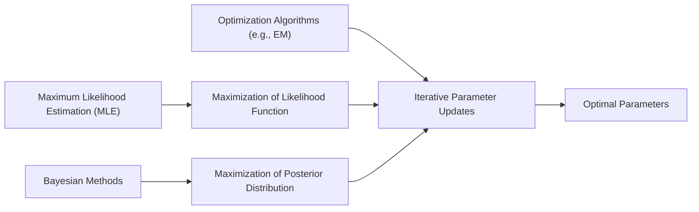
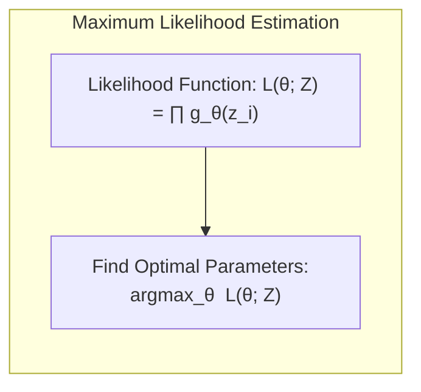
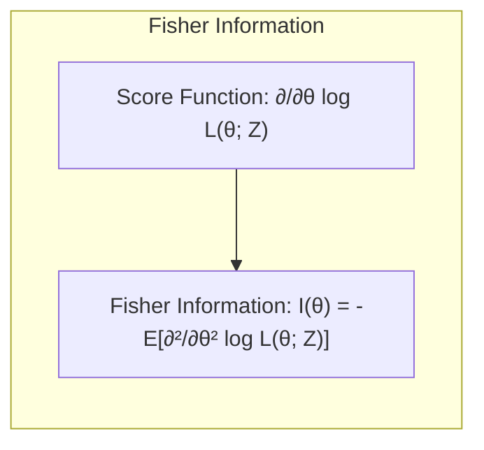
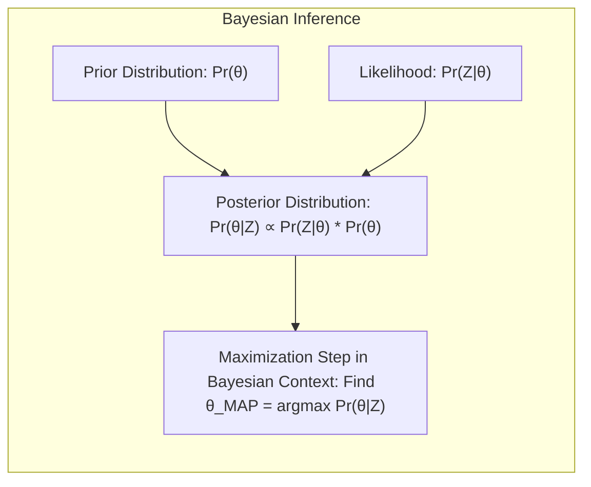
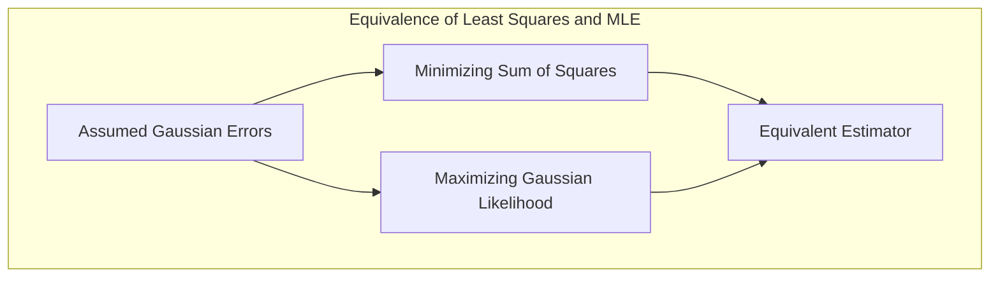
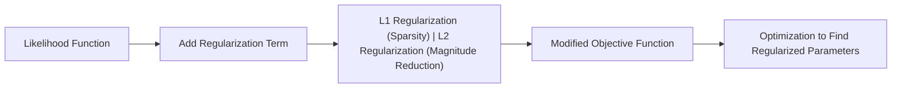
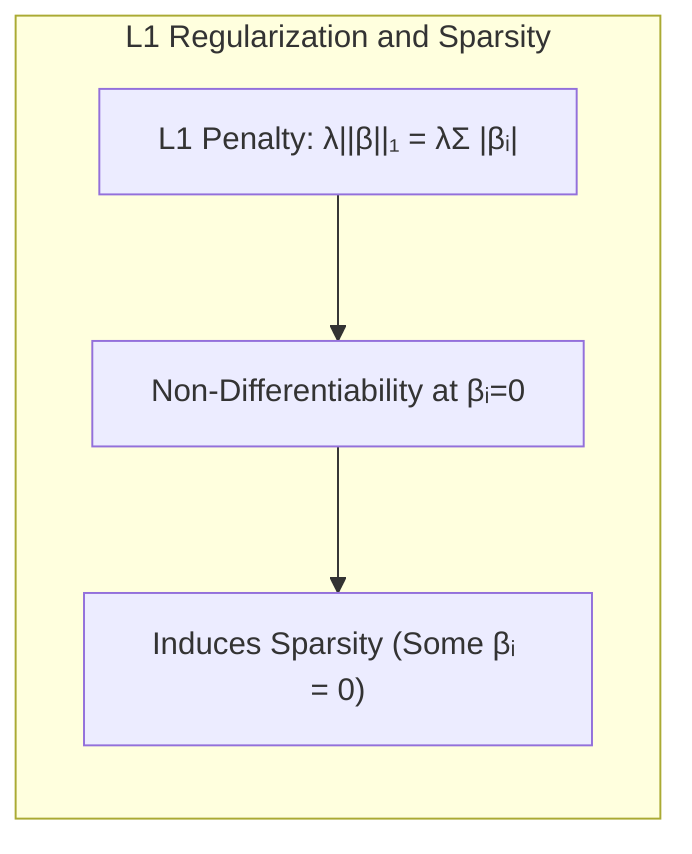
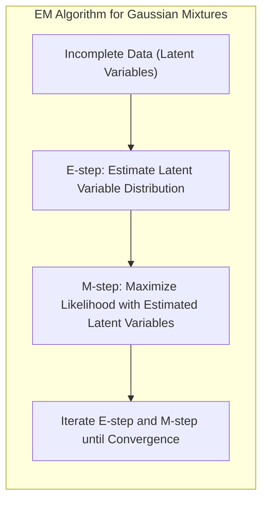
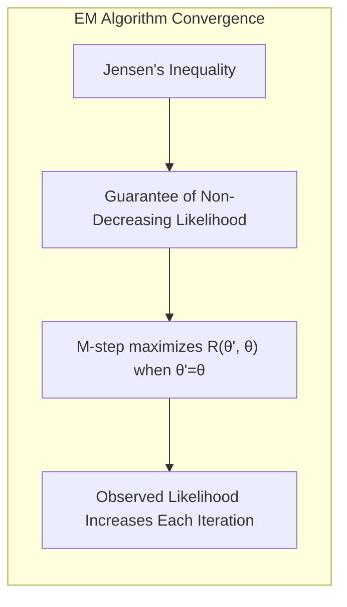

## Maximization Step: Métodos de Otimização e Inferência em Modelos Estatísticos



### Introdução

A inferência de modelos estatísticos, como discutido em [^8.1], envolve a estimação de parâmetros que melhor se ajustam aos dados observados. Tradicionalmente, essa estimação tem sido realizada por meio da minimização de funções de erro, como a soma de quadrados ou a entropia cruzada. No entanto, muitos modelos exigem abordagens mais sofisticadas, como a **Maximum Likelihood Estimation (MLE)** e métodos Bayesianos, onde a maximização de funções de verossimilhança ou a análise de distribuições posteriores se tornam cruciais. O processo de **Maximization Step** é fundamental nesses métodos, desempenhando um papel central na busca pelos parâmetros ótimos. Este capítulo explora em detalhes esses conceitos, focando em técnicas de otimização e suas aplicações em diversos contextos de inferência estatística.

### Conceitos Fundamentais

A otimização de parâmetros é um processo iterativo que busca os valores dos parâmetros que maximizam uma função de objetivo, tipicamente a verossimilhança ou uma função relacionada, conforme discutido em [^8.2.2]. Para entender a fundo as técnicas usadas na **Maximization Step**, precisamos definir alguns conceitos chave:

**Conceito 1:** **Maximum Likelihood Estimation (MLE)**: A MLE é um método para estimar os parâmetros de um modelo estatístico, buscando os valores que maximizam a função de verossimilhança, que representa a probabilidade dos dados observados dado o modelo, como definido em [^8.2.2]. Em termos matemáticos, se temos dados $Z = \{z_1, z_2, \ldots, z_N\}$ e um modelo com parâmetros $\theta$, a função de verossimilhança é dada por:
$$ L(\theta; Z) = \prod_{i=1}^{N} g_\theta(z_i) $$
O objetivo da MLE é encontrar $\hat{\theta}$ tal que:
$$\hat{\theta} = \arg \max_{\theta} L(\theta; Z)$$
onde $g_\theta(z_i)$ é a densidade ou massa de probabilidade dos dados sob o modelo.

> 💡 **Exemplo Numérico:** Suponha que temos uma amostra de 5 lançamentos de uma moeda, resultando em `Z = [1, 0, 1, 1, 0]`, onde 1 representa cara e 0 coroa. Queremos estimar a probabilidade $\theta$ de sair cara usando MLE. Assumindo que cada lançamento é uma Bernoulli, a função de verossimilhança é: $L(\theta; Z) = \theta^3(1-\theta)^2$.  Para encontrar o $\hat{\theta}$ que maximiza essa função,  calculamos a derivada com relação a $\theta$ e igualamos a zero:
>
> $\frac{dL}{d\theta} = 3\theta^2(1-\theta)^2 - 2\theta^3(1-\theta) = 0$.
>
> Simplificando, temos:  $\theta^2(1-\theta)(3(1-\theta) - 2\theta) = 0$
>
> Isso leva a $\theta = 0, \theta = 1,$ ou $3 - 5\theta = 0$, o que dá $\hat{\theta} = 3/5 = 0.6$. Portanto, a estimativa de máxima verossimilhança para a probabilidade de sair cara é 0.6. Este valor maximiza a probabilidade dos dados observados.



**Lemma 1:** Sob certas condições de regularidade, o estimador de máxima verossimilhança é consistente e assintoticamente normal, conforme demonstrado em [^8.2.2]. Isso significa que, com um número crescente de observações, o estimador converge para o valor verdadeiro do parâmetro e a sua distribuição se aproxima de uma normal.

**Conceito 2:** **Função Score e Informação de Fisher**: A **função score** é o gradiente do logaritmo da verossimilhança em relação aos parâmetros, dada por $\ell(\theta; z_i) = \frac{\partial \log g_\theta(z_i)}{\partial \theta}$, conforme [^8.2.2]. A **informação de Fisher**, por sua vez, é uma medida da quantidade de informação que os dados fornecem sobre os parâmetros. Matematicamente:
$$I(\theta) = - \mathbb{E}\left[ \frac{\partial^2}{\partial \theta^2} \log L(\theta; Z) \right]$$
ou
$$I(\theta) =  \sum_{i=1}^{N} \mathbb{E}\left[  \left(\frac{\partial \log g_\theta(z_i)}{\partial \theta} \right)^2 \right]$$
A informação de Fisher desempenha um papel crucial na avaliação da precisão dos estimadores de MLE.

> 💡 **Exemplo Numérico:** Usando o exemplo da moeda, a log-verossimilhança é $\log L(\theta; Z) = 3\log(\theta) + 2\log(1-\theta)$. A função score é a primeira derivada:
>
> $\ell(\theta; Z) = \frac{3}{\theta} - \frac{2}{1-\theta}$
>
> A segunda derivada é:
>
> $\frac{\partial^2 \log L}{\partial \theta^2} = -\frac{3}{\theta^2} - \frac{2}{(1-\theta)^2}$
>
> A informação de Fisher (esperada) é:
>
> $I(\theta) = - \mathbb{E}\left[  -\frac{3}{\theta^2} - \frac{2}{(1-\theta)^2} \right] = \frac{5}{\theta(1-\theta)}$
>
>  Substituindo $\hat{\theta} = 0.6$, temos $I(0.6) = \frac{5}{0.6(0.4)} \approx 20.83$. Isso nos diz que a precisão da nossa estimativa aumenta com mais dados.
>



**Corolário 1:** A variância do estimador de máxima verossimilhança é inversamente proporcional à informação de Fisher, como mostrado em [^8.2.2]. Isso implica que quanto maior a informação de Fisher, menor a variância do estimador e, portanto, maior a precisão da estimativa.

**Conceito 3:** **Métodos Bayesianos**: Em contraste com a MLE, os métodos Bayesianos incorporam um conhecimento prévio sobre os parâmetros por meio de uma distribuição *prior* $Pr(\theta)$. A inferência Bayesiana leva em consideração tanto a verossimilhança dos dados quanto a distribuição *prior* para obter a distribuição *posterior* $Pr(\theta|Z)$, como visto em [^8.3]:
$$ Pr(\theta|Z) = \frac{Pr(Z|\theta) Pr(\theta)}{\int Pr(Z|\theta) Pr(\theta) d\theta} $$
A distribuição *posterior* representa nossa crença atual sobre os parâmetros, dado os dados e o conhecimento prévio. A **Maximization Step** em um contexto Bayesiano pode envolver a busca por um estimador *MAP* (Maximum a Posteriori), que maximiza a distribuição *posterior*.

> 💡 **Exemplo Numérico:**  Usando o exemplo da moeda, vamos adicionar uma *prior* Beta com parâmetros $\alpha=2$ e $\beta=2$, que é uma *prior* não informativa que favorece valores de probabilidade próximos a 0.5. A distribuição *prior* é $Pr(\theta) \propto \theta^{\alpha-1}(1-\theta)^{\beta-1} = \theta(1-\theta)$.  A distribuição *posterior* é proporcional ao produto da *prior* com a verossimilhança:
>
> $Pr(\theta|Z) \propto \theta^3(1-\theta)^2 \cdot \theta(1-\theta) = \theta^4(1-\theta)^3$.
>
> Para encontrar o estimador *MAP*, maximizamos a *posterior*, derivando em relação a $\theta$ e igualando a zero.
>
> $\frac{d}{d\theta}(\theta^4(1-\theta)^3) = 4\theta^3(1-\theta)^3 - 3\theta^4(1-\theta)^2 = 0$.
>
> Resolvendo para $\theta$, obtemos $\hat{\theta}_{MAP} = \frac{4}{7} \approx 0.571$. Note que, por causa da *prior*, o estimador *MAP* é ligeiramente diferente do estimador MLE.



> ⚠️ **Nota Importante**: Em um contexto Bayesiano, a **Maximization Step** geralmente busca o *MAP*, que é o modo da distribuição posterior, enquanto em MLE o objetivo é o estimador que maximiza a função de verossimilhança.
> ❗ **Ponto de Atenção**: A escolha da *prior* influencia significativamente o resultado da inferência Bayesiana e, portanto, a **Maximization Step** neste contexto.
> ✔️ **Destaque**: O processo de **Maximization Step** pode envolver otimização numérica, especialmente quando as soluções analíticas não são viáveis.

### Regressão Linear e Mínimos Quadrados para Classificação


A regressão linear, quando aplicada a uma matriz de indicadores para classificação, também pode ser interpretada como um caso de MLE sob a suposição de erros Gaussianos, conforme discutido em [^8.2.2]. Ao aplicar mínimos quadrados para estimar os coeficientes de regressão, estamos implicitamente maximizando a função de verossimilhança, o que faz do processo de ajuste uma **Maximization Step**. As soluções para $\beta$ em (8.2) e (8.21), são os valores que minimizam o erro quadrático médio e maximizam a função de verossimilhança Gaussianas, o que pode ser visto por meio de suas derivações.

A função de verossimilhança nesse contexto é definida como:
$$L(\beta, \sigma^2; Z) = \prod_{i=1}^N \frac{1}{\sqrt{2\pi\sigma^2}} \exp\left(-\frac{(y_i - h(x_i)^T \beta)^2}{2\sigma^2}\right)$$
onde $h(x_i)$ são as bases, $\beta$ são os parâmetros e $\sigma^2$ é a variância. A maximização dessa função em relação a $\beta$ leva ao estimador de mínimos quadrados:
$$\hat{\beta} = (H^T H)^{-1} H^T y$$
O que mostra que o método de mínimos quadrados é uma forma de executar uma **Maximization Step** sob certas suposições, como a normalidade dos erros, e com a função de verossimilhança sendo Gaussianas.

> 💡 **Exemplo Numérico:** Suponha que temos um conjunto de dados com dois preditores e um alvo:
> ```python
> import numpy as np
>
> X = np.array([[1, 2], [1, 3], [1, 4], [1,5]])
> y = np.array([3, 5, 6, 8])
> ```
>  Nesse caso, $H = X$. Para calcular $\hat{\beta}$,  primeiro calculamos $H^T H$ e $(H^T H)^{-1}$.
>
> ```python
> HTH = X.T @ X
> HTH_inv = np.linalg.inv(HTH)
> ```
> Em seguida, calculamos $H^T y$:
>
> ```python
> HTy = X.T @ y
> ```
> Finalmente, calculamos $\hat{\beta}$:
>
> ```python
> beta_hat = HTH_inv @ HTy
> print(f"Beta estimativo: {beta_hat}")
> ```
>  O resultado será $\hat{\beta} \approx [1, 1.4]$, o que significa que a reta ajustada será aproximadamente $y = 1 + 1.4x$. Os valores encontrados para $\hat{\beta}$ maximizam a verossimilhança dos dados sob a suposição de erros Gaussianos.

**Lemma 2:** O estimador de mínimos quadrados é o estimador de máxima verossimilhança sob a suposição de erros Gaussianos, o que demonstra a equivalência entre a minimização do erro quadrático e a maximização da verossimilhança nesse contexto, com base no que foi discutido em [^8.2.2].



**Corolário 2:** A variância dos estimadores $\beta$ pode ser estimada usando o estimador de variância residual, ou seja, $Var(\hat{\beta}) = \hat{\sigma}^2(H^TH)^{-1}$, confirmando a relação entre MLE e mínimos quadrados.

> 💡 **Exemplo Numérico:** Continuando o exemplo anterior, podemos estimar $\hat{\sigma}^2$ como:
>
> ```python
> y_hat = X @ beta_hat
> residuals = y - y_hat
> sigma_squared_hat = np.sum(residuals**2) / (len(y) - X.shape[1])
> print(f"sigma_squared_hat: {sigma_squared_hat}")
> ```
> O resultado será $\hat{\sigma}^2 \approx 0.2$, que é a estimativa da variância dos erros. A variância dos estimadores de $\beta$ é então:
> ```python
> var_beta = sigma_squared_hat * HTH_inv
> print(f"Variance of beta: {var_beta}")
> ```
> Isso fornece uma medida da incerteza nos nossos estimadores de $\beta$.

Em geral, a **Maximization Step** em métodos de classificação com regressão linear envolve encontrar os parâmetros $\beta$ que maximizam a verossimilhança ou minimizam o erro quadrático médio, conforme o caso, garantindo que os parâmetros estimados estejam alinhados com a melhor representação dos dados.

### Métodos de Seleção de Variáveis e Regularização em Classificação



A seleção de variáveis e a regularização são importantes na classificação para lidar com o *overfitting* e para melhorar a interpretabilidade dos modelos, conforme mencionado em [^8.2]. Em ambos os casos, uma **Maximization Step** é necessária, mas ela é feita em conjunto com termos de penalização na função objetivo, como em [^8.2.2].

Em vez de apenas maximizar a verossimilhança, métodos de regularização adicionam um termo de penalização que impede que os parâmetros assumam valores muito grandes. Por exemplo, na regressão logística, podemos adicionar um termo de regularização L1 ou L2 na função de log-verossimilhança:
$$\ell(\beta) = \sum_{i=1}^N y_i \log(\sigma(\beta^Tx_i)) + (1-y_i)\log(1-\sigma(\beta^Tx_i)) - \lambda ||\beta||_p $$
onde $\sigma(\beta^Tx_i)$ é a função sigmóide, $\lambda$ é o parâmetro de regularização e $p = 1$ ou $2$ para L1 ou L2 respectivamente. A **Maximization Step** nesse caso envolve maximizar a função de log-verossimilhança penalizada.

> 💡 **Exemplo Numérico:** Considere a regressão logística com regularização L2 (Ridge). Vamos usar um conjunto de dados simulado:
> ```python
> import numpy as np
> from sklearn.linear_model import LogisticRegression
> from sklearn.preprocessing import StandardScaler
>
> np.random.seed(42)
> X = np.random.randn(100, 5)
> y = np.random.randint(0, 2, 100)
>
> scaler = StandardScaler()
> X_scaled = scaler.fit_transform(X)
> ```
> Agora, vamos treinar dois modelos, um sem regularização e um com L2:
> ```python
> model_no_reg = LogisticRegression(penalty=None)
> model_no_reg.fit(X_scaled, y)
>
> model_l2_reg = LogisticRegression(penalty='l2', C=0.1) # C=1/lambda
> model_l2_reg.fit(X_scaled, y)
> ```
> Os coeficientes serão:
> ```python
> print("Coeficientes sem regularização:", model_no_reg.coef_)
> print("Coeficientes com regularização L2:", model_l2_reg.coef_)
> ```
>  Observe como a regularização L2 encolhe os coeficientes em direção a zero.
>
> A **Maximization Step** aqui é realizada pelo algoritmo de otimização (como o gradiente descendente) usado pelo `LogisticRegression`. A função objetivo que o algoritmo minimiza inclui o termo de regularização, o que leva a um modelo que generaliza melhor em novos dados.
>
>
>
> ```mermaid
>  graph LR
>      A["Função de Log-Verossimilhança"] --> B(Otimização)
>      B --> C{Regularização L1 ou L2}
>      C --> D[Parâmetros \(\beta\) Regularizados]
>
> ```

**Lemma 3:** A penalização L1 induz a esparsidade nos coeficientes, ou seja, alguns coeficientes são exatamente zero, o que ajuda na seleção de variáveis, conforme [^8.2.2].

**Prova do Lemma 3:** A penalização L1 tem a forma $\lambda||\beta||_1 = \lambda\sum_j |\beta_j|$. A não diferenciabilidade em $\beta_j=0$ causa os coeficientes serem exatamente zero quando se tenta minimizar a função de custo. A penalização L2, por outro lado, tem a forma $\lambda||\beta||_2^2 = \lambda\sum_j \beta_j^2$, que é diferenciável e não induz esparsidade, como explicado em [^8.2.2]. $\blacksquare$


**Corolário 3:** A combinação de penalizações L1 e L2, conhecida como Elastic Net, permite obter um compromisso entre esparsidade e regularização, controlando o número de variáveis relevantes e a magnitude dos coeficientes, como discutido em [^8.2.2].

A **Maximization Step** em métodos de classificação regularizados envolve a busca pelos parâmetros $\beta$ que equilibram o ajuste aos dados e a complexidade do modelo, alcançando um bom desempenho de generalização.

### Separating Hyperplanes e Perceptrons


A ideia de **separating hyperplanes** e perceptrons também envolvem um processo de otimização que é parte do conceito de uma **Maximization Step**, de forma indireta, como em [^8.5.2] e [^8.5.1]. Em um contexto de *Separating Hyperplanes*, o objetivo é encontrar o hiperplano que maximiza a margem de separação entre as classes. A formulação matemática desse problema leva a uma otimização de parâmetros que define o hiperplano.
$$ \max_{w,b} \frac{1}{||w||} \min_{i} y_i(w^T x_i + b) $$
onde $w$ é o vetor normal do hiperplano e $b$ é o termo de viés.

Os perceptrons, por sua vez, ajustam iterativamente os pesos para minimizar os erros de classificação, como em [^8.5.1]. O algoritmo do perceptron tenta achar um hiperplano que separa as classes utilizando uma função de custo. A **Maximization Step** aqui pode envolver a atualização dos parâmetros $w$ usando um algoritmo de otimização, como o gradiente descendente:
$$ w_{t+1} = w_t + \alpha y_i x_i$$
onde $\alpha$ é a taxa de aprendizado.

> 💡 **Exemplo Numérico:** Vamos criar um dataset simples linearmente separável e treinar um perceptron:
> ```python
> import numpy as np
>
> # Dados linearmente separáveis
> X = np.array([[1, 1], [2, 1], [1, 2], [2, 2], [4, 5], [5, 4], [5, 5], [6, 4]])
> y = np.array([-1, -1, -1, -1, 1, 1, 1, 1]) # -1 para classe 1 e 1 para classe 2
>
> # Inicialização dos pesos
> w = np.array([0.1, -0.1])
> b = 0.1
> alpha = 0.1
> num_epochs = 10
>
> for epoch in range(num_epochs):
>    for i in range(len(X)):
>        if y[i] * (np.dot(w, X[i]) + b) <= 0:
>            w = w + alpha * y[i] * X[i]
>            b = b + alpha * y[i]
>            print(f'Updated w:{w}, b:{b}')
> ```
>
> O loop acima representa a **Maximization Step** do perceptron. A cada iteração, os pesos `w` são atualizados na direção que minimiza os erros de classificação. O processo converge para um hiperplano que separa os dados.
>

A otimização de um perceptron tem o objetivo de maximizar uma função objetivo que minimiza os erros de classificação, mesmo que não explicitamente uma função de verossimilhança. A convergência do algoritmo depende da separabilidade dos dados.

### Pergunta Teórica Avançada: Como a abordagem EM se relaciona com o conceito de Maximum Likelihood em modelos de mistura Gaussianos?



**Resposta:** A abordagem EM (Expectation-Maximization) é um método iterativo que busca a solução de máxima verossimilhança em modelos onde os dados observados não são completos. No caso de modelos de mistura Gaussianos, a variável latente é a qual componente gerou cada ponto de dado, conforme visto em [^8.5]. A **Maximization Step** do EM envolve encontrar os parâmetros que maximizam a verossimilhança dos dados completos, mas como a atribuição das variáveis latentes não é conhecida, ela é feita de forma iterativa.

A ideia central do algoritmo EM é alternar entre duas etapas: a etapa de Expectation (E-step) e a etapa de Maximization (M-step). A etapa E consiste em estimar a distribuição das variáveis latentes dado os parâmetros correntes do modelo, enquanto a etapa M consiste em encontrar os parâmetros que maximizam a verossimilhança dos dados completados na etapa E.

No contexto de modelos de mistura Gaussianos, a função de verossimilhança é dada por:
$$ L(\theta; Z) = \prod_{i=1}^{N} \sum_{k=1}^K \pi_k \phi(\mathbf{x}_i|\mu_k, \Sigma_k) $$
onde $\pi_k$ é a probabilidade de cada componente, $\mu_k$ é a média e $\Sigma_k$ é a matriz de covariância para cada componente $k$. O algoritmo EM itera entre as seguintes etapas:
1. **E-step**: Calcula as responsabilidades $\gamma_{ik}$ de cada ponto de dados para cada componente, usando os parâmetros atuais.
$$ \gamma_{ik} = \frac{\pi_k \phi(\mathbf{x}_i|\mu_k, \Sigma_k)}{\sum_{j=1}^K \pi_j \phi(\mathbf{x}_i|\mu_j, \Sigma_j)} $$
2. **M-step**: Atualiza os parâmetros $\pi_k$, $\mu_k$ e $\Sigma_k$ usando as responsabilidades calculadas na etapa E.
$$ \pi_k = \frac{1}{N} \sum_{i=1}^N \gamma_{ik} $$
$$ \mu_k = \frac{\sum_{i=1}^N \gamma_{ik}\mathbf{x}_i}{\sum_{i=1}^N \gamma_{ik}} $$
$$ \Sigma_k = \frac{\sum_{i=1}^N \gamma_{ik}(\mathbf{x}_i - \mu_k)(\mathbf{x}_i - \mu_k)^T}{\sum_{i=1}^N \gamma_{ik}} $$

> 💡 **Exemplo Numérico:** Vamos usar um exemplo simplificado para ilustrar o algoritmo EM com duas Gaussianas. Suponha que temos um conjunto de dados unidimensional e dois componentes Gaussianos com médias $\mu_1$, $\mu_2$ e variâncias $\sigma^2_1$, $\sigma^2_2$. Inicializamos aleatoriamente $\mu_1=0$, $\mu_2=5$, $\sigma^2_1=1$, $\sigma^2_2=1$ e $\pi_1=\pi_2=0.5$.  Vamos criar alguns dados misturados:
>
> ```python
> import numpy as np
> from scipy.stats import norm
>
> np.random.seed(42)
> X = np.concatenate([np.random.normal(0, 1, 50), np.random.normal(5, 1, 50)])
>
> mu1, mu2 = 0, 5
> sigma1_sq, sigma2_sq = 1, 1
> pi1, pi2 = 0.5, 0.5
>
> for iteration in range(10):
>     # E-step
>     gamma1 = pi1 * norm.pdf(X, mu1, np.sqrt(sigma1_sq))
>     gamma2 = pi2 * norm.pdf(X, mu2, np.sqrt(sigma2_sq))
>     gamma_sum = gamma1 + gamma2
>     gamma1 = gamma1 / gamma_sum
>     gamma2 = gamma2 / gamma_sum
>
>     # M-step
>     pi1 = np.mean(gamma1)
>     pi2 = np.mean(gamma2)
>     mu1 = np.sum(gamma1 * X) / np.sum(gamma1)
>     mu2 = np.sum(gamma2 * X) / np.sum(gamma2)
>     sigma1_sq = np.sum(gamma1 * (X - mu1)**2) / np.sum(gamma1)
>     sigma2_sq = np.sum(gamma2 * (X - mu2)**2) / np.sum(gamma2)
>
>     print(f'Iteration {iteration}: mu1={mu1:.2f}, mu2={mu2:.2f}, sigma1_sq={sigma1_sq:.2f}, sigma2_sq={sigma2_sq:.2f}')
>
> ```
>
> A cada iteração do loop, primeiro calculamos as responsabilidades de cada ponto aos componentes (E-step), e em seguida atualizamos as médias e variâncias dos componentes, além dos pesos (M-step). O algoritmo converge para os parâmetros que maximizam a verossimilhança dos dados. A **Maximization Step** dentro de cada iteração garante que a verossimilhança dos dados complete aumente.
>

Essa iteração continua até a convergência dos parâmetros e da função de verossimilhança. O **Maximization Step** na iteração do EM garante que a função de verossimilhança aumente ou permaneça a mesma a cada iteração, garantindo a convergência.

**Lemma 4:** O algoritmo EM garante que a verossimilhança observada aumente em cada iteração, o que pode ser demonstrado utilizando a desigualdade de Jensen [^8.5.2] e o fato de que $R(\theta', \theta)$ é maximizado quando $\theta'=\theta$ [^8.5.2].



**Corolário 4:** A **Maximization Step** do EM é realizada na verossimilhança completa, mas com as variáveis latentes sendo estimadas na etapa de Expectation, mostrando que o EM é um método para otimização de modelos com variáveis latentes, e também um processo para encontrar parâmetros que maximizam a verossimilhança [^8.5.2].

> ⚠️ **Ponto Crucial**: A complexidade da função de verossimilhança nos modelos de mistura Gaussianos exige uma abordagem iterativa, como o EM, para encontrar parâmetros que maximizam a verossimilhança.

### Conclusão

A **Maximization Step** é um componente essencial em muitos métodos de inferência estatística, incluindo a MLE, métodos Bayesianos, modelos lineares de classificação, modelos regularizados, *separating hyperplanes* e modelos de mistura. A otimização, seja por meio de métodos analíticos ou numéricos, garante que os parâmetros estimados estejam alinhados com os dados observados, maximizando a função de verossimilhança ou uma função relacionada. Técnicas como o algoritmo EM, *bumping* [^8.9] e *model averaging* [^8.8] permitem lidar com problemas mais complexos, como modelos com variáveis latentes e modelos instáveis, permitindo obter soluções ótimas e estáveis.

[^8.1]: "For most of this book, the fitting (learning) of models has been achieved by minimizing a sum of squares for regression, or by minimizing cross-entropy for classification. In fact, both of these minimizations are instances of the maximum likelihood approach to fitting." *(Trecho de "Model Inference and Averaging")*
[^8.2.2]: "Maximum likelihood is based on the likelihood function, given by $L(θ; Z) = \prod_i g_θ(z_i)$, the probability of the observed data under the model $g_θ$. The likelihood is defined only up to a positive multiplier, which we have taken to be one. We think of $L(θ; Z)$ as a function of θ, with our data Z fixed." *(Trecho de "Model Inference and Averaging")*
[^8.3]: "In the Bayesian approach to inference, we specify a sampling model Pr(Z|θ) (density or probability mass function) for our data given the parameters, and a prior distribution for the parameters Pr(θ) reflecting our knowledge about θ before we see the data. We then compute the posterior distribution Pr(θ|Z) = Pr(Z|θ).Pr(θ) / ∫ Pr(Z|θ).Pr(θ)dθ' which represents our updated knowledge about θ after we see the data." *(Trecho de "Model Inference and Averaging")*
[^8.5.2]:  "The above procedure is an example of the EM (or Baum-Welch) algorithm for maximizing likelihoods in certain classes of problems. These problems are ones for which maximization of the likelihood is difficult, but made easier by enlarging the sample with latent (unobserved) data." *(Trecho de "Model Inference and Averaging")*
[^8.5.1]:  "In this section we describe a simple mixture model for density estimation, and the associated EM algorithm for carrying out maximum likelihood estimation." *(Trecho de "Model Inference and Averaging")*
[^8.5]: "The EM algorithm is a popular tool for simplifying difficult maximum likelihood problems. We first describe it in the context of a simple mixture model." *(Trecho de "Model Inference and Averaging")*
[^8.9]: "The final method described in this chapter does not involve averaging or combining models, but rather is a technique for finding a better single model. Bumping uses bootstrap sampling to move randomly through model space. For problems where fitting method finds many local minima, bumping can help the method to avoid getting stuck in poor solutions." *(Trecho de "Model Inference and Averaging")*
[^8.8]: "Here we discuss Bayesian model averaging more generally. We have a set of candidate models Mm, m = 1,..., M for our training set Z. These models may be of the same type with different parameter values (e.g., subsets in linear regression), or different models for the same task (