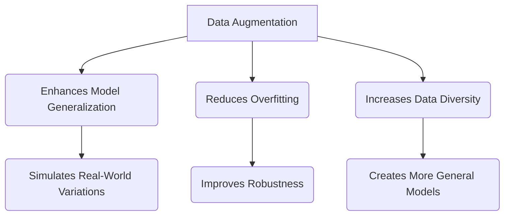
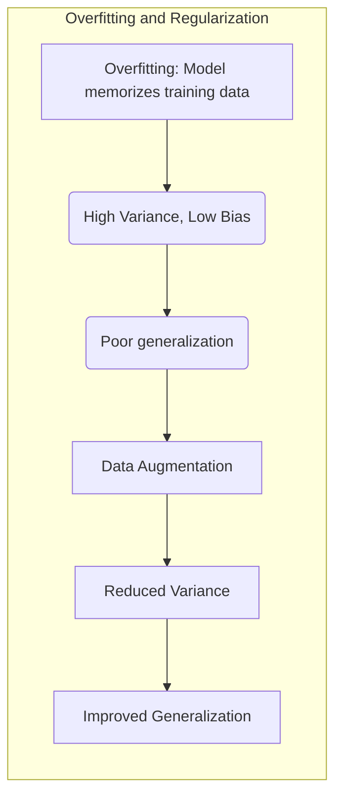
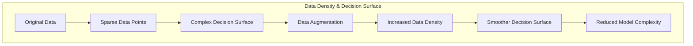
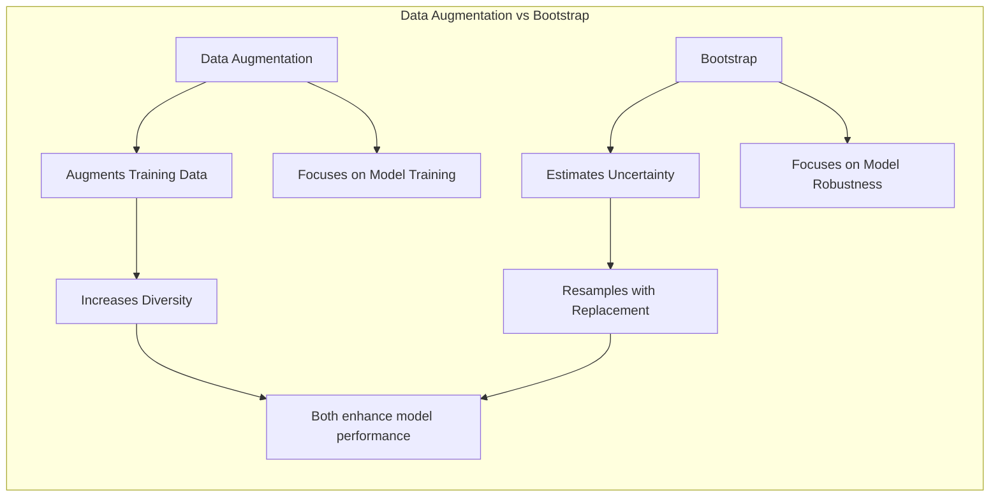
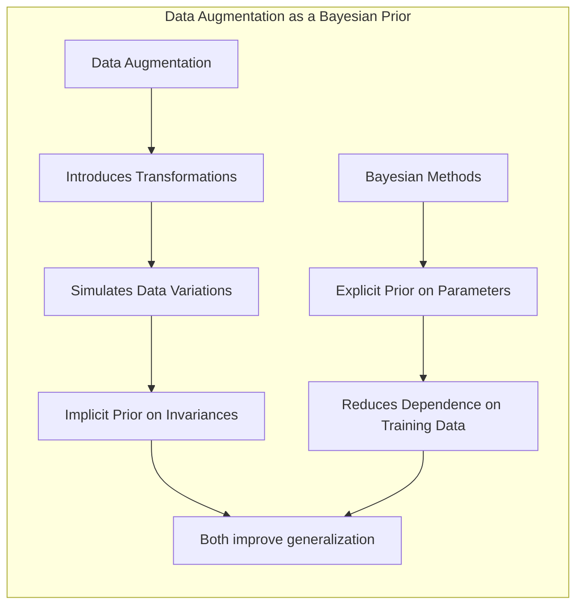
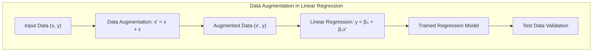
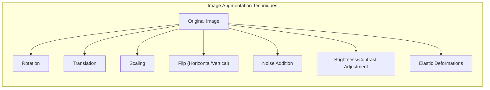
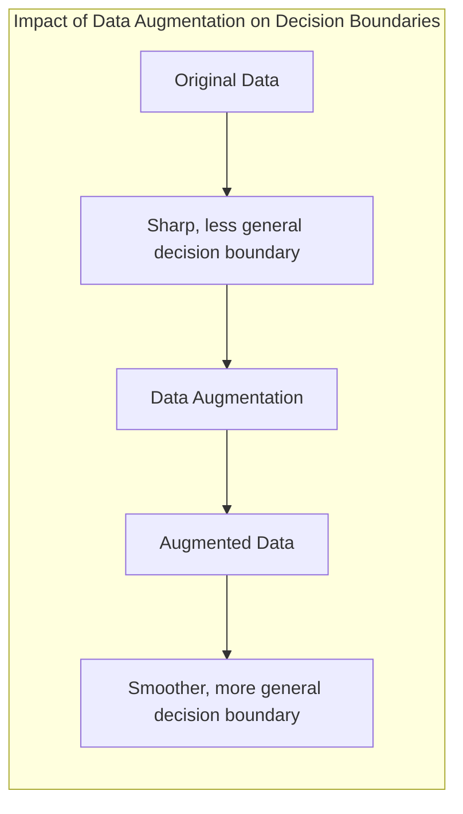
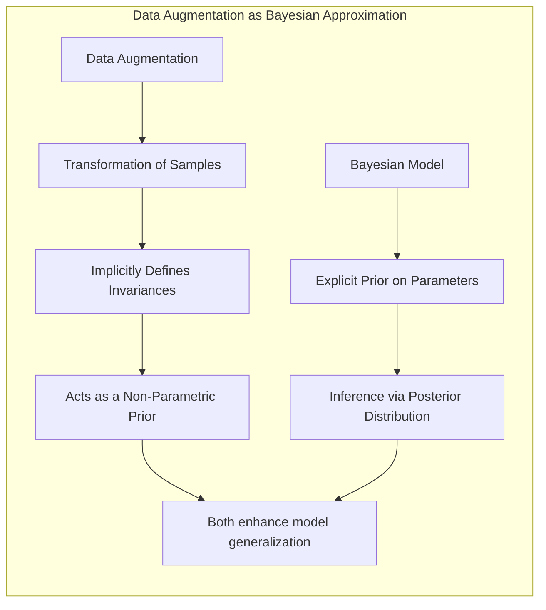

## Data Augmentation: Enhancing Model Generalization Through Strategic Data Expansion



### Introdução

Neste capítulo, exploraremos o conceito de **data augmentation**, uma técnica essencial no arsenal do aprendizado de máquina moderno, especialmente útil em cenários onde a disponibilidade de dados rotulados é limitada [^8.1]. Data augmentation, como o nome sugere, envolve a criação de novas amostras de dados a partir das existentes, aplicando transformações específicas. Estas transformações, que podem ser lineares ou não lineares, são projetadas para simular variações realistas nos dados que o modelo pode encontrar em ambientes reais, melhorando assim sua capacidade de generalização e reduzindo o risco de overfitting. Data augmentation não apenas aumenta a quantidade de dados para treinamento, mas também adiciona diversidade ao conjunto de dados, o que é fundamental para a criação de modelos robustos. As técnicas de data augmentation se tornaram cada vez mais importantes no aprendizado de máquina, sendo aplicáveis em diversas áreas, incluindo visão computacional, processamento de linguagem natural, e reconhecimento de voz [^8.1]. Este capítulo irá detalhar como funciona a data augmentation, suas relações com outras técnicas como bootstrap e abordagens bayesianas, e suas implicações em diversos cenários práticos.

### Conceitos Fundamentais

A **necessidade da data augmentation** surge da observação de que modelos de aprendizado de máquina, especialmente os mais complexos, tendem a apresentar um bom desempenho no conjunto de dados de treinamento, mas podem falhar ao encontrar dados novos ou ligeiramente diferentes, o que caracteriza um cenário de *overfitting* [^8.1]. Isso ocorre porque o modelo aprende não apenas os padrões gerais, mas também o ruído específico nos dados de treinamento, fazendo com que ele se torne excessivamente especializado nesses dados particulares. A data augmentation procura mitigar esse problema, apresentando ao modelo uma variedade maior de exemplos, que ajudam a criar uma representação mais robusta dos dados.

**Conceito 1:** O problema do *overfitting* e a necessidade de **regularização** são o ponto de partida para o entendimento da importância da data augmentation. Aumentar o conjunto de dados de treinamento através da data augmentation é uma forma de regularizar o modelo, impedindo-o de memorizar o conjunto de treinamento e generalizando melhor para dados não vistos [^8.1]. Isso se relaciona intrinsecamente com o tradeoff entre viés e variância. Modelos com alta variância tendem a overfit, e data augmentation ajuda a reduzir a variância, sem aumentar excessivamente o viés.



> 💡 **Exemplo Numérico:** Imagine um modelo de regressão linear que tenta ajustar uma linha a apenas 3 pontos de dados. Esse modelo pode se ajustar perfeitamente aos dados, mas provavelmente terá um desempenho ruim em novos dados, caracterizando *overfitting*. Ao aplicarmos data augmentation, adicionando pequenos ruídos a cada ponto (e.g., adicionando um valor aleatório entre -0.5 e 0.5 a cada coordenada), podemos criar mais pontos ao redor de cada ponto original. Isso força o modelo a encontrar uma linha que se ajuste aos dados com ruído, evitando que a linha se ajuste aos pontos originais de forma excessivamente precisa. Essa abordagem reduz a variância do modelo, ajudando-o a generalizar melhor.

**Lemma 1:** *A data augmentation, ao gerar amostras similares às existentes, aumenta a densidade de dados na vizinhança de pontos de treinamento, suavizando a função de decisão do modelo e reduzindo a complexidade efetiva do modelo.* Este lemma pode ser derivado da análise de como as transformações (e.g. rotações e pequenas translações) alteram a função de custo e a superfície de decisão dos modelos lineares. Ao aumentar a densidade de pontos na vizinhança de um ponto de treinamento, a necessidade de modelar comportamentos complexos nessa área diminui, levando o modelo para uma solução mais generalizável e menos suscetível a variações de dados próximos.



**Conceito 2:** O **bootstrap** é outra técnica de reamostragem que compartilha o objetivo de data augmentation de gerar novos dados, mas com uma abordagem diferente [^8.2.1]. Enquanto o bootstrap é usado para avaliar a incerteza de uma estimativa, ou uma função de decisão, a data augmentation é usada para aumentar o tamanho e a diversidade do conjunto de dados de treinamento. Contudo, ambas as técnicas buscam aprimorar a robustez dos modelos.



> 💡 **Exemplo Numérico:** Suponha que temos um conjunto de dados pequeno de 10 pontos para treinar um modelo. Usando o bootstrap, poderíamos amostrar com substituição para criar vários conjuntos de dados de 10 pontos, cada um ligeiramente diferente do original. Cada um desses conjuntos seria usado para treinar um modelo, e as previsões desses modelos poderiam ser agregadas para obter uma estimativa mais robusta (e.g., usando *bagging*). Por outro lado, data augmentation transformaria as 10 amostras originais em um conjunto maior, que poderia ser usado diretamente para treinar um único modelo. Ambas as técnicas aumentam a robustez, mas usando abordagens diferentes para obter dados adicionais.

**Corolário 1:** *Em cenários onde a quantidade de dados é limitada, tanto o bootstrap quanto data augmentation podem ser utilizadas em conjunto para mitigar problemas de overfitting e aprimorar a capacidade de generalização do modelo*. O corolário deriva do fato que data augmentation e bootstrap são técnicas com enfoques ligeiramente diferentes: data augmentation cria amostras no espaço de features, e bootstrap cria amostras no espaço de dados. A combinação destas duas técnicas pode ser benéfica no treinamento de modelos robustos e generalizáveis.

**Conceito 3:** A **relação entre data augmentation e métodos bayesianos** se encontra na ideia de que data augmentation pode ser vista como uma forma de introduzir *priors* no treinamento do modelo. Ao usar uma variedade de transformações, o modelo se torna menos sensível a detalhes específicos das amostras de treinamento, de forma semelhante a como a escolha de um prior adequado reduz a dependência das estimativas nos dados [^8.3, 8.4].



> 💡 **Exemplo Numérico:** No contexto de visão computacional, considere que estamos treinando um modelo para reconhecer gatos. Usar data augmentation, como rotações e flips horizontais, é equivalente a assumir que a identidade de um gato não muda se ele está virado para a esquerda ou para a direita, ou se ele está ligeiramente inclinado. Esta é uma forma de *prior* que nós estamos introduzindo no modelo. Em termos bayesianos, um *prior* expressaria nossas crenças iniciais sobre os parâmetros do modelo, antes de ver os dados. Analogamente, data augmentation introduz um *prior* sobre as invariâncias que o modelo deve aprender, como a invariância a rotações no caso do exemplo dos gatos.

> ⚠️ **Nota Importante**: Data augmentation não cria informação nova sobre o problema. Ela simplesmente apresenta o mesmo conjunto de informações de formas diferentes, o que força o modelo a aprender características mais genéricas e invariantes, similar ao efeito de regularização.

> ❗ **Ponto de Atenção**: É crucial ter cuidado na escolha das transformações, pois transformações irreais ou muito agressivas podem levar o modelo a aprender falsos padrões ou a perder informação importante.

> ✔️ **Destaque**: A data augmentation deve ser aplicada de forma a simular variações reais nos dados e não simplesmente para aumentar o número de amostras de treino.

### Regressão Linear e Data Augmentation



**Explicação:** Este diagrama representa o fluxo de trabalho do uso de Data Augmentation, que consiste em transformar os dados originais e aplicar a regressão linear para gerar o modelo, e por fim, fazer a validação no conjunto de teste.

Em contextos de regressão linear, a data augmentation pode ser aplicada de diversas formas, criando novas amostras que, embora relacionadas às originais, adicionam alguma variação [^8.2.1].

Por exemplo, para um problema de regressão com uma única variável de entrada, podemos adicionar um pequeno ruído gaussiano a cada valor de entrada (e.g. adicionar um ruído amostrado de uma distribuição normal $x_i' = x_i + \epsilon$, onde $\epsilon \sim \mathcal{N}(0, \sigma^2)$) e calcular a saída correspondente, mantendo o mesmo valor de saída. Alternativamente, pode-se aplicar pequenas variações nos valores de saída, usando a mesma abordagem para simular um problema com alguma forma de erro nas medidas da saída. Estas modificações não apenas aumentam o número de pontos, mas também ajudam a criar uma função de regressão que seja menos sensível a pequenas variações nos valores de entrada. Em contextos onde os dados de entrada são imagens ou outros tipos de dados multidimensionais, técnicas como rotações, escalas, translações, ou pequenas deformações podem ser utilizadas para criar novos exemplos.

> 💡 **Exemplo Numérico:** Vamos considerar um problema simples de regressão linear com uma única variável de entrada $x$ e saída $y$. Suponha que temos os seguintes dados:

| $x$ | $y$ |
|-----|-----|
| 1   | 2   |
| 2   | 4   |
| 3   | 5   |

Podemos aplicar data augmentation adicionando ruído gaussiano aos valores de $x$. Por exemplo, se $\epsilon \sim \mathcal{N}(0, 0.2^2)$, podemos gerar novas amostras:

| $x$       | $y$ |
|-----------|-----|
| 1.15      | 2   |
| 1.05      | 2   |
| 1.20      | 2   |
| 1.10      | 2   |
| 2.1       | 4   |
| 1.9      | 4   |
| 2.05      | 4   |
| 2.15     | 4   |
| 3.20      | 5   |
| 2.9     | 5   |
| 3.15     | 5   |
| 2.95    | 5   |

Agora temos um conjunto de dados maior e mais diverso. Ajustando um modelo de regressão linear tanto ao conjunto de dados original quanto ao conjunto de dados aumentado, podemos ver que a regressão linear no conjunto de dados aumentado tende a ser mais robusta em relação a variações em $x$.
```python
import numpy as np
import matplotlib.pyplot as plt
from sklearn.linear_model import LinearRegression

# Dados originais
X_orig = np.array([[1], [2], [3]])
y_orig = np.array([2, 4, 5])

# Data Augmentation
np.random.seed(42)
noise = np.random.normal(0, 0.2, size=X_orig.shape)
X_aug = X_orig + noise
y_aug = np.repeat(y_orig, 4)

X_aug = np.concatenate([X_orig, X_aug])
y_aug = np.concatenate([y_orig, y_aug])


# Regressão Linear nos dados originais
model_orig = LinearRegression()
model_orig.fit(X_orig, y_orig)
x_plot = np.linspace(0,4,100).reshape(-1,1)
y_plot_orig = model_orig.predict(x_plot)

# Regressão Linear nos dados aumentados
model_aug = LinearRegression()
model_aug.fit(X_aug, y_aug)
y_plot_aug = model_aug.predict(x_plot)


# Plot dos resultados
plt.figure(figsize=(10, 6))
plt.scatter(X_orig, y_orig, color='blue', label='Dados Originais')
plt.scatter(X_aug[3:], y_aug[3:], color='green', marker='.', alpha=0.5, label='Dados Aumentados')
plt.plot(x_plot,y_plot_orig, color='red', label='Regressão Linear (Dados Originais)')
plt.plot(x_plot,y_plot_aug, color='purple', label='Regressão Linear (Dados Aumentados)')

plt.xlabel('x')
plt.ylabel('y')
plt.title('Regressão Linear com e sem Data Augmentation')
plt.legend()
plt.grid(True)
plt.show()

```
Este código ilustra como a data augmentation, ao adicionar pequenas variações nos valores de entrada, produz um modelo de regressão linear mais robusto às variações nos dados de entrada.

**Lemma 2:** *A adição de ruído gaussiano aos dados de entrada pode ser formalmente descrita como uma forma de regularização que penaliza a curvatura da função de regressão*. Isso se dá pela razão que o modelo deve acomodar as diferentes variações induzidas pelo ruído. Formalmente, pode-se mostrar que adicionar ruído gaussianos aos dados de entrada é equivalente a adicionar um termo de penalização na função de custo da regressão linear, na forma de um termo que penaliza a segunda derivada da função de regressão.

**Corolário 2:** *Quando o data augmentation é implementada com transformações que preservam a informação, como rotações e escalas em problemas de reconhecimento de objetos, a regressão linear pode se beneficiar da capacidade de modelar funções mais complexas, mesmo que cada uma das transformações aplicadas individualmente não acrescente informação nova*.

"Em alguns casos, conforme indicado em [^8.2.2], onde os dados podem ser escassos, a data augmentation pode complementar as capacidades de modelagem de um modelo linear, ao melhorar a robustez dos modelos e aumentar a generalização para dados não vistos".

"No entanto, é crucial observar, conforme apontado em [^8.2.3], que a eficácia do data augmentation não é universal. Em cenários onde as transformações não simulam variações realísticas nos dados ou onde o modelo já possui boa capacidade de generalização, data augmentation pode não apresentar ganhos significativos ou até mesmo piorar o desempenho do modelo."

### Métodos de Data Augmentation e sua Implementação



A implementação prática da data augmentation depende do tipo de dado e do problema específico. Em problemas de visão computacional, algumas das técnicas mais comuns incluem:

-   **Rotação**: Girar a imagem por um ângulo aleatório, simulando diferentes orientações do objeto.

-   **Translação**: Deslocar a imagem horizontal ou verticalmente, para treinar o modelo a ser invariante à posição do objeto.

-   **Escala**: Ampliar ou reduzir a imagem, simulando objetos em diferentes distâncias.

-   **Flip (espelhamento)**: Espelhar a imagem horizontal ou verticalmente, o que pode ser útil em algumas aplicações.

-   **Adição de Ruído**: Adicionar um ruído aleatório, simulando dados com menor qualidade.

-   **Ajustes de Brilho e Contraste**: Alterar a intensidade e o contraste da imagem, simulando condições de iluminação diferentes.

-  **Deformações Elásticas**: Aplicar pequenas deformações que simulem variações nos objetos, como se eles fossem flexíveis.

Em problemas de processamento de linguagem natural, a data augmentation pode ser feita através de:

-  **Substituição de Sinônimos**: Substituir palavras por seus sinônimos, mantendo o significado do texto.

-  **Inversão de Ordem de Palavras**: Trocar a ordem de palavras ou frases, mantendo a coerência do texto.

- **Inserção de Ruído**: Inserir erros de digitação ou pequenas variações sintáticas.

Em outros tipos de dados, como dados temporais (séries temporais), a data augmentation pode incluir técnicas como:

- **Time Warping**: Deformar a série temporal, para simular variações na velocidade dos eventos.

-  **Magnitude Scaling**: Alterar a escala da magnitude dos valores, para simular variações na intensidade dos sinais.

**Lemma 3:** *As transformações de data augmentation, quando aplicadas em conjunto, podem criar um espaço de dados aumentado muito maior do que o conjunto de treinamento original, sem requerer novos dados*.

**Prova do Lemma 3**: Seja o espaço de transformações $T$, e um conjunto de amostras de treino $X = \{x_1, x_2, \ldots, x_n\}$. Se aplicamos um conjunto de transformações $t_i \in T$, cada amostra $x_i$ pode ser transformado em $t_1(x_i), t_2(x_i), \ldots, t_{|T|}(x_i)$. Portanto, ao aplicar o conjunto de transformações a cada amostra original, obtemos um conjunto de amostras aumentado da ordem de $|X| \times |T|$, que geralmente é muito maior que o número original de amostras. $\blacksquare$

**Corolário 3:** *A data augmentation, quando aplicada de forma sistemática, pode levar a uma melhoria considerável na performance de diversos modelos de aprendizado de máquina, especialmente quando o conjunto de treinamento original é escasso*. O corolário segue do Lemma 3, visto que o número de amostras após data augmentation é muito maior que o número de amostras original, aprimorando a capacidade de generalização dos modelos treinados com os dados aumentados.

> ⚠️ **Ponto Crucial**: A escolha das transformações de data augmentation deve ser feita com base no conhecimento do domínio do problema e na forma como os dados reais podem variar.

### Separating Hyperplanes e Data Augmentation



Em problemas de classificação, a data augmentation desempenha um papel fundamental na criação de modelos que são robustos a variações nos dados de entrada e generalizam bem para dados não vistos. Ao aplicar transformações relevantes, estamos efetivamente introduzindo *invariâncias* no modelo. Para modelos lineares, como separação por hiperplanos (separating hyperplanes), a data augmentation pode ajudar a gerar fronteiras de decisão mais generalizáveis.

Por exemplo, se temos um problema de classificação de imagens com apenas alguns exemplos de cada classe, ao aplicar transformações como rotações, translações e zoom, podemos aumentar o número de amostras e, ao mesmo tempo, ensinar o modelo a ser invariante a essas transformações. Isso faz com que a fronteira de decisão se torne mais robusta, e menos propensa a overfit nos dados de treinamento.

Se aplicarmos data augmentation durante o treinamento de um separador por hiperplanos, o otimizador vai buscar um hiperplano que generalize bem para as amostras originais e as transformações que foram aplicadas. Ao treinar o modelo com uma variedade de exemplos de cada classe, a fronteira de decisão se torna menos sensível a variações dos dados, e mais focada em características relevantes das classes.

> 💡 **Exemplo Numérico**: Considere um problema de classificação binária com duas classes, "A" e "B", no plano 2D. Inicialmente, temos poucos exemplos:

Classe A: (1, 1), (2, 1)
Classe B: (1, 2), (2, 2)

Um separador por hiperplano (neste caso, uma reta) pode facilmente separar estes pontos, mas pode ser muito sensível a pequenas variações nos dados. Ao aplicar data augmentation com pequenas translações e rotações, podemos gerar mais exemplos:

Classe A (após data augmentation): (1, 1), (1.1, 0.9), (1.2, 1.1), (2, 1), (2.1, 0.95), (1.9, 1.1)
Classe B (após data augmentation): (1, 2), (1.1, 2.1), (0.9, 1.9), (2, 2), (2.1, 2.2), (1.9, 1.8)

Ao treinar o separador por hiperplano com os dados aumentados, a fronteira de decisão se tornará mais robusta e menos sensível a pequenas perturbações. A data augmentation faz com que a fronteira de decisão se ajuste a uma região e não a pontos específicos.

### Pergunta Teórica Avançada: Como a data augmentation pode ser vista como uma forma de aproximação de um modelo Bayesiano?



**Resposta:**

A data augmentation pode ser vista como uma forma de introduzir *priors* não-paramétricos no treinamento do modelo. Em modelos Bayesianos, a escolha do *prior* reflete nossas crenças sobre a distribuição dos parâmetros antes de ver os dados [^8.3]. Data augmentation introduz indiretamente um *prior* sobre a forma como as amostras podem variar.

Por exemplo, se aplicamos uma rotação, estamos implicitamente dizendo ao modelo que os objetos podem aparecer em diferentes orientações, e que a identidade do objeto não é afetada pela sua rotação. Analogamente, ao introduzir transformações como pequenos ruídos, deformações ou ajustes de brilho, estamos dizendo que variações nesse tipo podem ocorrer e que o modelo deve ser robusto a elas. Estas invariâncias, geradas pelas transformações, formam um *prior* sobre a forma como o modelo deve generalizar.

Em modelos Bayesianos, o processo de inferência combina o *prior* com a função de verossimilhança para obter a distribuição *posterior*. De forma similar, data augmentation adiciona amostras adicionais que alteram a forma como a função de verossimilhança "enxerga" os dados, e o modelo acaba aprendendo um *posterior* mais generalizável e robusto, de forma similar ao processo Bayesiano.

**Lemma 4:** *Em contextos onde o modelo é incapaz de modelar transformações lineares e não lineares nos dados de entrada, a data augmentation pode ser utilizada para auxiliar o modelo a captar as invariâncias do problema, gerando resultados similares aos de uma modelagem Bayesiana com *priors* não-paramétricos.*

**Corolário 4:** A similaridade entre os efeitos da data augmentation e a modelagem Bayesiana é observada quando consideramos transformações que não introduzem informações adicionais, como rotações e translações. Nestes casos, o modelo é levado a aprender uma representação mais robusta dos dados, com um efeito semelhante ao da utilização de um *prior* adequado no modelo Bayesiano.

> ⚠️ **Ponto Crucial:** É importante observar que data augmentation não cria informações novas, e as amostras criadas não são amostras independentes e identicamente distribuídas, o que difere da estrutura estatística dos dados em modelagens Bayesianas. Contudo, é possível aproximar algumas das vantagens da modelagem Bayesiana, usando as amostras aumentadas para treinar modelos com *priors* implícitos, sem a necessidade de inferência Bayesiana.

### Conclusão

Data augmentation é uma técnica essencial no arsenal do aprendizado de máquina, particularmente em cenários onde os dados disponíveis são limitados. Ela não apenas aumenta o número de amostras para treinamento, mas também adiciona diversidade ao conjunto de dados, o que é fundamental para construir modelos mais robustos e generalizáveis. A data augmentation pode ser vista como uma forma de regularização, pois impede o modelo de sobreajustar aos dados de treinamento, e como uma aproximação de modelagens Bayesianas, induzindo *priors* implícitos na forma como o modelo generaliza. A escolha das técnicas de data augmentation deve ser feita com base no problema e no conhecimento do domínio, buscando sempre a simulação de variações realistas nos dados. Ao longo deste capítulo, exploramos os fundamentos teóricos, as diversas abordagens práticas e a relação entre data augmentation e outras técnicas, como o bootstrap e as abordagens Bayesianas. A correta implementação da data augmentation é fundamental para o sucesso do treinamento de modelos de aprendizado de máquina em uma variedade de aplicações.

### Footnotes

[^8.1]: "In this chapter we provide a general exposition of the maximum likeli-
hood approach, as well as the Bayesian method for inference. The boot-
strap, introduced in Chapter 7, is discussed in this context, and its relation
to maximum likelihood and Bayes is described. Finally, we present some
related techniques for model averaging and improvement, including com-
mittee methods, bagging, stacking and bumping." *(Trecho de Model Inference and Averaging)*

[^8.2.1]: "The bootstrap method provides a direct computational way of assessing
uncertainty, by sampling from the training data. Here we illustrate the
bootstrap in a simple one-dimensional smoothing problem, and show its
connection to maximum likelihood." *(Trecho de Model Inference and Averaging)*

[^8.2.2]: "It turns out that the parametric bootstrap agrees with least squares in the
previous example because the model (8.5) has additive Gaussian errors. In
general, the parametric bootstrap agrees not with least squares but with
maximum likelihood, which we now review." *(Trecho de Model Inference and Averaging)*

[^8.2.3]: "In essence the bootstrap is a computer implementation of nonparametric or
parametric maximum likelihood. The advantage of the bootstrap over the
maximum likelihood formula is that it allows us to compute maximum like-
lihood estimates of standard errors and other quantities in settings where
no formulas are available." *(Trecho de Model Inference and Averaging)*

[^8.3]: "In the Bayesian approach to inference, we specify a sampling model Pr(Z|0)
(density or probability mass function) for our data given the parameters,
and a prior distribution for the parameters Pr(0) reflecting our knowledge
about @ before we see the data. We then compute the posterior distribution" *(Trecho de Model Inference and Averaging)*

[^8.4]: "The distribution (8.25) with т → ∞ is called a noninformative prior for
0. In Gaussian models, maximum likelihood and parametric bootstrap anal-
yses tend to agree with Bayesian analyses that use a noninformative prior
for the free parameters. These tend to agree, because with a constant prior,
the posterior distribution is proportional to the likelihood." *(Trecho de Model Inference and Averaging)*
