## Expectation Step em Modelos de Inferência e Média

<image: Diagrama complexo mostrando o fluxo do algoritmo EM, com os passos de Expectation e Maximization, e um mapa mental conectando a sua aplicação em diferentes contextos (Gaussian mixtures, Bayesian inference, etc.)>

### Introdução
O capítulo 8, intitulado "Model Inference and Averaging," apresenta uma visão geral das técnicas de inferência e modelagem, destacando métodos como maximum likelihood, bootstrap e abordagens bayesianas [^8.1]. Este capítulo explorará detalhadamente o conceito do **Expectation Step** (Passo de Expectativa), um componente fundamental do algoritmo EM (Expectation-Maximization), que é introduzido no contexto de modelos de mistura [^8.5]. Este passo de expectativa, crucial na abordagem EM, permite lidar com problemas de otimização complexos envolvendo dados latentes ou não observados, oferecendo uma maneira iterativa de encontrar estimativas de máxima verossimilhança [^8.5.2].

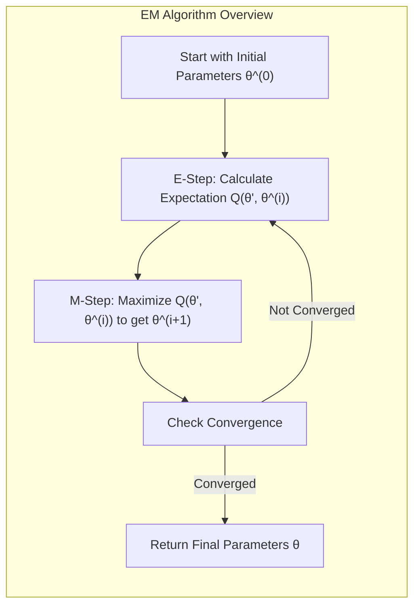

### Conceitos Fundamentais

**Conceito 1:** **Dados Latentes e o Problema de Incompletude**.  No contexto do algoritmo EM, o conceito de **dados latentes** (ou *unobserved data*) é central [^8.5.2]. Estes dados, denotados por $Z_m$, são valores que não são diretamente observados, mas que, se conhecidos, simplificariam o problema de inferência. A presença de dados latentes transforma um problema de máxima verossimilhança complexo em um que pode ser resolvido iterativamente. O algoritmo EM, por meio do seu passo de expectativa, lida com essa incompletude atribuindo responsabilidades ou probabilidades aos dados observados, baseando-se nos parâmetros atuais [^8.5.2].

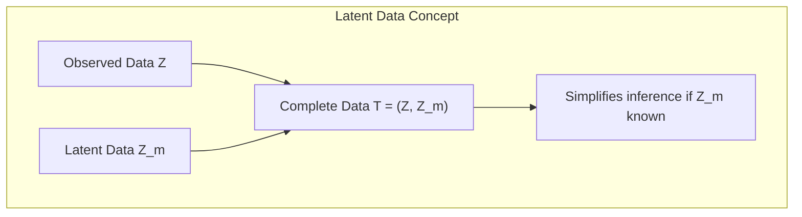

**Lemma 1:** A introdução dos dados latentes $Z_m$ permite a decomposição da verossimilhança observada $l(\theta; Z)$ em termos que envolvem a verossimilhança completa $l_0(\theta; T)$, onde $T = (Z, Z_m)$, e um termo adicional que reflete a incerteza sobre os dados latentes, conforme indicado em [^8.5.2] e [^8.45]:

$$l(\theta'; Z) = E[l_0(\theta'; T)|Z, \theta] - E[l_1(\theta'; Z_m|Z)|Z, \theta]$$

onde  $l_1$ é baseado na densidade condicional  $Pr(Z_m | Z, \theta')$. A importância deste Lemma reside em que ele transforma um problema de otimização direta (que é geralmente difícil) em um problema que pode ser resolvido iterativamente, ao focar na verossimilhança completa, que é mais tratável quando $Z_m$ é conhecido [^8.5.2].

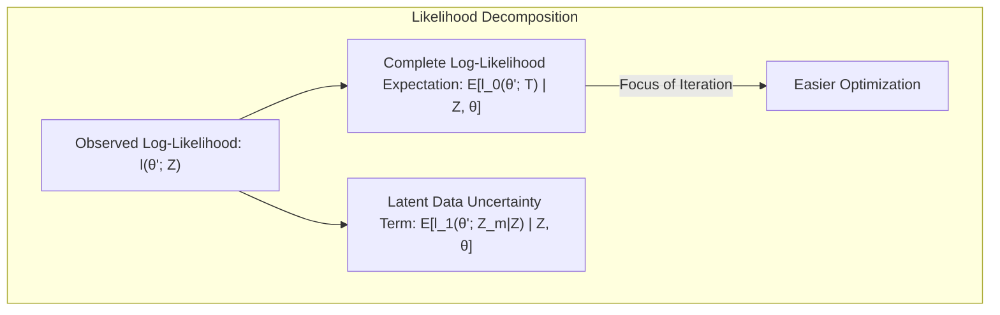

> 💡 **Exemplo Numérico:** Suponha que temos dados observados $Z = \{1.2, 2.5, 3.1, 4.8, 5.3\}$ que acreditamos vir de uma mistura de duas Gaussianas. Os dados latentes $Z_m$ seriam a informação de qual Gaussiana gerou cada ponto (0 ou 1). Se soubéssemos $Z_m$, poderíamos calcular as médias e variâncias das duas gaussianas com relativa facilidade. O Lemma 1 indica que, em vez de trabalharmos com a verossimilhança observada diretamente, podemos usar a verossimilhança dos dados completos (incluindo $Z_m$), e lidar com a incerteza de $Z_m$ através do Expectation step.

**Conceito 2:** **Definição e Função do Passo de Expectativa**.  O **Expectation Step** no algoritmo EM calcula a **expectativa** da *verossimilhança completa* dos dados, considerando os valores atuais dos parâmetros [^8.5.2]. Matematicamente, a Expectation, denotada por $Q(\theta', \theta^{(i)})$, é definida como:

$$Q(\theta', \theta^{(i)}) = E(l_0(\theta'; T)|Z, \theta^{(i)})$$
Onde $l_0$ é a verossimilhança dos dados completos $T=(Z, Z_m)$,  $\theta'$ são os parâmetros a serem otimizados, e $\theta^{(i)}$ são os parâmetros atuais [^8.5.2].  Essa expectativa condicional é calculada com base nos dados observados $Z$ e os parâmetros do modelo na iteração atual $\theta^{(i)}$. Em essência, este passo atribui pesos ou probabilidades (responsabilidades) aos dados observados, com base nos parâmetros estimados na iteração anterior do algoritmo.

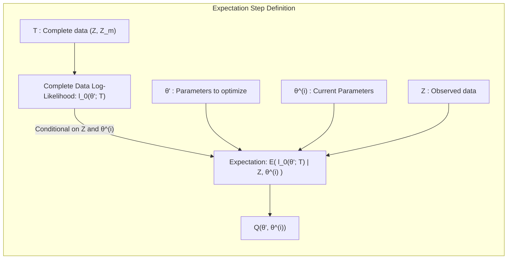

> 💡 **Exemplo Numérico:** Continuando o exemplo anterior, $Q(\theta', \theta^{(i)})$ calcula a média da verossimilhança completa *considerando* que os parâmetros da Gaussiana são $\theta^{(i)}$, que foi estimado na iteração anterior.  A verossimilhança é calculada usando a informação de *todos os dados*, observados ($Z$) e latentes ($Z_m$).  No primeiro passo do EM, quando ainda não sabemos os valores dos dados latentes, calculamos a esperança considerando a probabilidade de cada ponto ter vindo de cada uma das gaussianas.

**Corolário 1:** Em um modelo de mistura Gaussiana, como exemplificado em [^8.5.1],  a responsabilidade  $\gamma_i$ de cada observação $y_i$ para cada componente da mistura é calculada no Expectation Step [^8.41] como:

$$\gamma_i = \frac{\pi \phi_{\theta_2}(y_i)}{(1 - \pi)\phi_{\theta_1}(y_i) + \pi \phi_{\theta_2}(y_i)}$$

onde $\pi$ é a probabilidade de um ponto pertencer ao componente 2, e $\phi_{\theta_1}(y_i)$ e $\phi_{\theta_2}(y_i)$ são as densidades gaussianas para cada componente. Estas responsabilidades, que servem como pesos, são cruciais para o passo de Maximização subsequente.

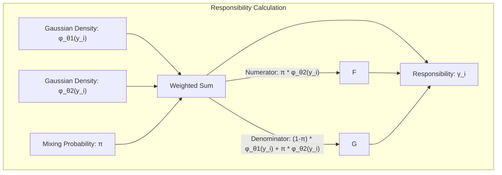

> 💡 **Exemplo Numérico:** Suponha que temos dois componentes gaussianos com parâmetros iniciais $\mu_1 = 2$, $\sigma_1 = 1$, $\mu_2 = 5$, $\sigma_2 = 1$ e $\pi = 0.5$. Para um ponto $y_i = 3$, podemos calcular $\phi_{\theta_1}(3)$ e $\phi_{\theta_2}(3)$ usando a função de densidade gaussiana.
>
> $\phi_{\theta_1}(3) = \frac{1}{\sqrt{2\pi(1)^2}}e^{-\frac{(3-2)^2}{2(1)^2}} \approx 0.242$
> $\phi_{\theta_2}(3) = \frac{1}{\sqrt{2\pi(1)^2}}e^{-\frac{(3-5)^2}{2(1)^2}} \approx 0.054$
>
>  Então:
>
> $\gamma_i = \frac{0.5 * 0.054}{(1 - 0.5) * 0.242 + 0.5 * 0.054} \approx \frac{0.027}{0.121 + 0.027} \approx 0.182$.
>
> Isso significa que o ponto 3 tem aproximadamente 18.2% de chance de pertencer à segunda gaussiana e 81.8% de chance de pertencer à primeira gaussiana neste passo da iteração.

**Conceito 3:** **Interpretação Probabilística**.  O **Expectation Step** pode ser visto como uma etapa onde o modelo atual “adivinha” os dados latentes $Z_m$, atribuindo uma distribuição de probabilidade a esses dados, conforme descrito em [^8.5.2]. A expectativa (ou responsabilidade) calculada reflete a probabilidade de que um dado ponto observado seja gerado por um determinado componente ou estado latente. Essa interpretação é fundamental para entender a natureza iterativa do algoritmo EM, onde a expectativa e a maximização se alternam para refinar iterativamente a estimativa dos parâmetros e dos dados latentes [^8.5.2].

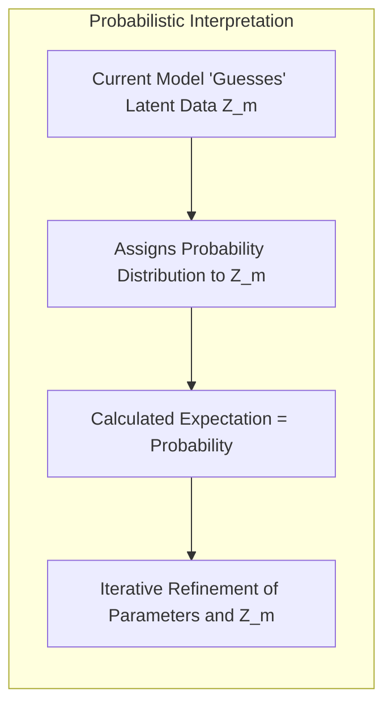

> 💡 **Exemplo Numérico:** No exemplo das duas Gaussianas, o Expectation step calcula a probabilidade de cada ponto ter sido gerado por cada uma das Gaussianas. A probabilidade (ou responsabilidade) não é uma atribuição binária (i.e., um ponto pertence a um cluster ou ao outro), mas sim uma probabilidade de pertinência. Essa probabilidade será usada no passo de Maximization para ajustar os parâmetros de cada gaussiana.

> ⚠️ **Nota Importante**: O Expectation Step não maximiza a verossimilhança. Ele prepara o terreno para o passo de Maximização subsequente, através do cálculo das responsabilidades [^8.5.2].
> ❗ **Ponto de Atenção**: A escolha inicial dos parâmetros ($\theta^{(0)}$) pode influenciar a convergência do algoritmo EM. Diferentes escolhas podem levar a diferentes máximos locais da função de verossimilhança [^8.5.1], [^8.5.2].
> ✔️ **Destaque**: No passo de Expectation, as responsabilidades ($\gamma_i$) servem como "pesos" para ajustar os parâmetros do modelo no passo de Maximização [^8.5.1].

### Expectation Step e o Algoritmo EM em Modelos de Mistura Gaussiana

<image: Diagrama do Algoritmo EM aplicado a Modelos de Mistura Gaussianas, mostrando os passos iterativos, desde a inicialização dos parâmetros, passando pelo Expectation Step (cálculo das responsabilidades) até o passo de Maximization (atualização dos parâmetros), e critério de convergência.>

No contexto de um **modelo de mistura gaussiana**, como discutido em [^8.5.1], o passo de Expectation é usado para calcular as *responsabilidades* (ou probabilidades posteriores) de cada observação pertencer a cada componente da mistura [^8.41]. Matematicamente, para um modelo de duas componentes (como em [^8.5.1]),  a responsabilidade $\gamma_i$ para a componente 2 é dada por:
$$ \gamma_i =  \frac{\pi \phi_{\theta_2}(y_i)}{(1 - \pi)\phi_{\theta_1}(y_i) + \pi \phi_{\theta_2}(y_i)}$$

onde $\phi_{\theta_1}$ e $\phi_{\theta_2}$ são as funções de densidade gaussiana para os dois componentes com parâmetros $\theta_1 = (\mu_1, \sigma_1^2)$ e $\theta_2 = (\mu_2, \sigma_2^2)$, respectivamente e $\pi$ é a probabilidade de um ponto pertencer ao componente 2. As responsabilidades $\gamma_i$ formam a base para o próximo passo de Maximização, pois são usadas para ponderar as estimativas dos parâmetros.

**Lemma 2:** A probabilidade posterior da observação $y_i$ pertencer ao componente 2, denotada por $\gamma_i$, pode ser derivada usando a regra de Bayes, e representa a expectativa condicional dos dados latentes (a variável binária $\Delta_i$), dado os dados observados $y_i$ e as estimativas atuais dos parâmetros $\theta^{(i)}$, conforme indicado em [^8.41]:

$$ \gamma_i =  E[\Delta_i | \theta, Z] = Pr(\Delta_i = 1 | \theta, y_i) =  \frac{Pr(y_i | \Delta_i = 1, \theta)Pr(\Delta_i = 1|\theta)}{Pr(y_i|\theta)}$$

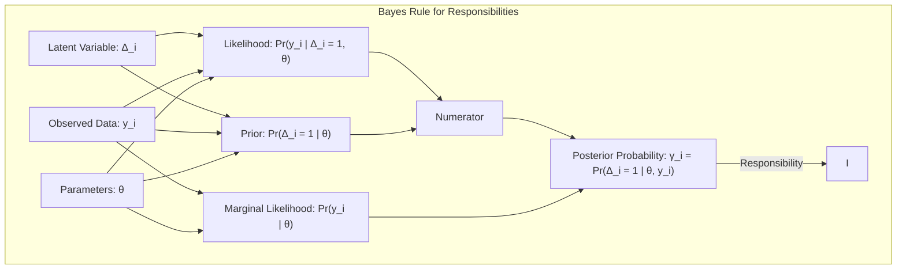

> 💡 **Exemplo Numérico:**  Usando o mesmo exemplo anterior, $\gamma_i$ pode ser visto como a probabilidade de que o ponto $y_i = 3$ tenha sido gerado pela segunda gaussiana dado os dados observados e os parâmetros atuais. Lemma 2 indica como essa probabilidade é derivada usando a regra de Bayes.

**Corolário 2:** A computação das responsabilidades no Expectation Step transforma o problema de alocação discreta de cada observação a um componente em um problema de alocação "soft," onde cada observação tem uma probabilidade de pertencer a cada componente [^8.41]. Isso permite que o algoritmo EM explore todo o espaço de parâmetros, evitando escolhas rígidas de alocação no início das iterações.

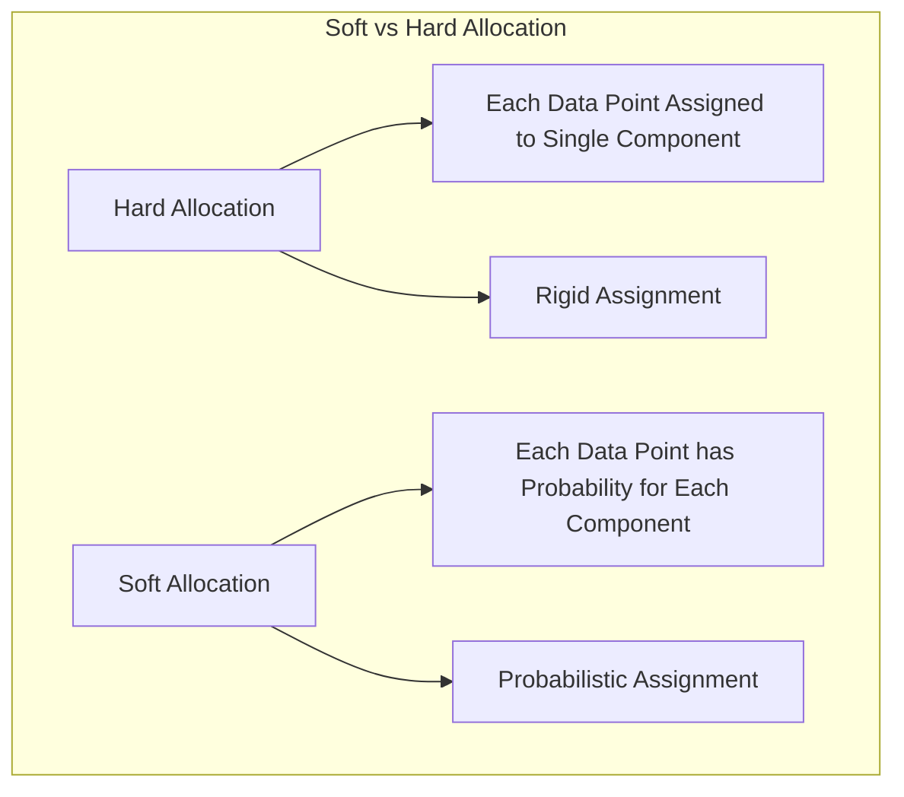

> 💡 **Exemplo Numérico:** Em vez de atribuir o ponto $y_i = 3$ à gaussiana 1 ou à gaussiana 2 logo no início, o Expectation step atribui uma probabilidade, como calculado anteriormente (18.2% para a gaussiana 2 e 81.8% para a gaussiana 1).  Essa atribuição probabilística é o que chamamos de "soft allocation", e permite que o algoritmo ajuste os parâmetros das gaussianas de forma mais eficiente.

A importância do Expectation Step reside em sua capacidade de lidar com a incerteza em relação aos dados latentes, de uma maneira probabilística. Ele não força uma atribuição rígida de observações a componentes, mas, em vez disso, permite uma alocação flexível que é atualizada iterativamente à medida que os parâmetros do modelo se tornam mais precisos [^8.41]. Este mecanismo iterativo é fundamental para a convergência do algoritmo EM.

### Expectation Step em uma Perspectiva Mais Geral do EM

<image: Representação visual do EM como um processo de maximização-maximização, destacando como o Expectation Step prepara o terreno para o passo de Maximização, com os parâmetros de dados latentes e modelos convergindo para um ótimo local.>

Em termos mais gerais, conforme descrito em [^8.5.2],  o **Expectation Step** calcula a expectativa da *verossimilhança completa*  $l_0(\theta'; T)$, dado os parâmetros atuais $\theta^{(i)}$ e os dados observados $Z$. Formalmente,  $Q(\theta', \theta^{(i)})$ representa a média do logaritmo da verossimilhança dos dados completos $T$, onde $T = (Z, Z_m)$ é a junção dos dados observados $Z$ e dos dados latentes $Z_m$ :

$$Q(\theta', \theta^{(i)}) = E[l_0(\theta'; T) | Z, \theta^{(i)}]$$

Essa etapa é crucial para simplificar um problema complexo, transformando-o em uma sequência de etapas de maximização mais simples. O cálculo da expectativa é feito *condicionalmente* aos parâmetros $\theta^{(i)}$ atuais e aos dados observados $Z$.

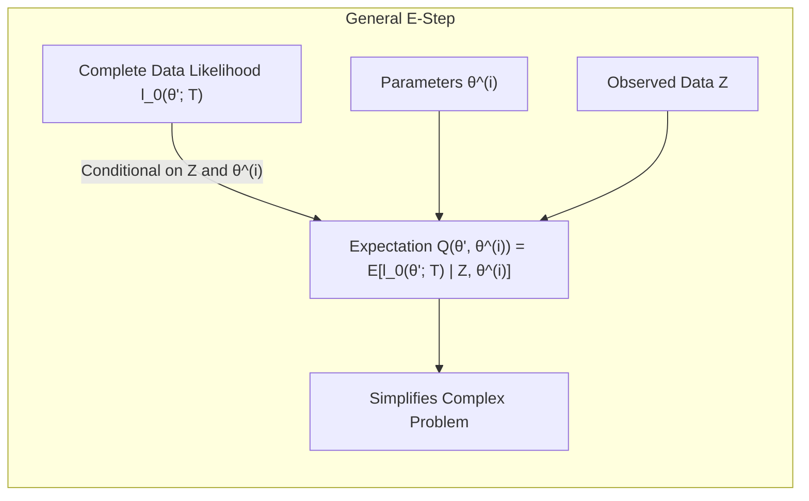

> 💡 **Exemplo Numérico:**  Em um contexto mais geral, imagine um modelo com dados observados (e.g., dados de saúde de pacientes) e dados latentes (e.g., a presença de uma doença não diagnosticada). O Expectation Step calcula a esperança da verossimilhança de *todos os dados* (observados e latentes) dado os parâmetros atuais do modelo (e.g., probabilidade de desenvolver a doença) e os dados observados. A expectativa é calculada *condicionalmente* a esses parâmetros.

**Lemma 3:** No contexto geral do algoritmo EM, o Expectation Step tem um papel crucial na determinação de uma função auxiliar $Q(\theta', \theta)$ que, ao ser maximizada no passo de Maximização, garante o aumento da verossimilhança observada $l(\theta;Z)$, conforme indicado em [^8.46].  Essa função auxiliar é construída através do cálculo da expectativa da verossimilhança completa $l_0(\theta'; T)$, condicionalmente aos dados observados e aos parâmetros correntes.

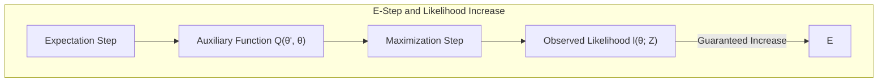

> 💡 **Exemplo Numérico:**  O Lemma 3 afirma que ao usar a expectativa da verossimilhança completa (calculada no Expectation Step) como a função a ser maximizada, garantimos que a verossimilhança dos dados observados aumentará. O Expectation step então nos prepara para o passo de Maximização, garantindo que cada iteração melhore nossa estimativa dos parâmetros.

**Corolário 3:** A forma como a Expectation é realizada permite, muitas vezes, que o problema de maximização seja transformado em uma solução analítica, como ocorre no modelo de mistura gaussiana, simplificando significativamente o problema computacional [^8.5.1]. Isso é possível devido à propriedade das distribuições exponenciais e suas derivadas.

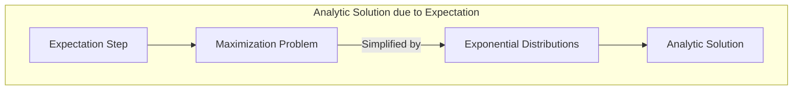

> 💡 **Exemplo Numérico:** No caso das misturas gaussianas, o cálculo de $\gamma_i$ envolve exponenciais e a maximização no passo M se transforma numa operação de médias ponderadas (usando os $\gamma_i$), o que leva a uma solução analítica (e.g., para a média e variância de cada componente). Isso é uma consequência da escolha da verossimilhança completa e do uso da função de densidade gaussiana, que tem boas propriedades matemáticas.

### Pergunta Teórica Avançada: Qual a conexão formal entre o Expectation Step e a ideia de penalização na função objetivo do EM para evitar que o modelo encontre soluções triviais?

**Resposta:**
O passo de Expectation no EM não introduz uma penalização explicitamente na função objetivo, mas de maneira implícita evita soluções triviais através do uso da verossimilhança completa e a sua expectativa condicional. A forma como o EM itera entre o passo de Expectativa e Maximização garante que, através de suas iterações, as responsabilidades (e consequentemente os parâmetros do modelo) são atualizados, levando a estimativas mais precisas. A forma como a verossimilhança completa é usada e a aplicação do princípio da expectativa condicional impedem, indiretamente, que o modelo caia em soluções triviais, como a alocação de todo o peso em um único componente ou a atribuição de variância zero a um componente [^8.5.1].

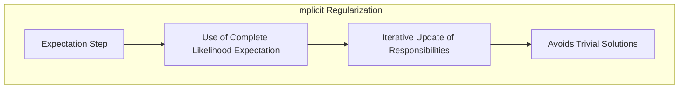

> 💡 **Exemplo Numérico:** Se, por exemplo, os pesos $\pi$ no modelo de mistura Gaussiana forem mal inicializados, o Expectation Step calcula as responsabilidades $\gamma_i$ considerando essa inicialização. O passo de Maximização, usando os $\gamma_i$, irá ajustar os parâmetros dos componentes (médias e variâncias) para refletir os dados, evitando que a probabilidade de um dos componentes "se apague", algo que ocorreria se fizéssemos atribuições diretas, sem considerar a verossimilhança completa.

**Lemma 4:** No contexto do algoritmo EM, a escolha da função objetivo $Q(\theta',\theta)$ no passo de Maximização é crucial para garantir a convergência da verossimilhança observada. Esta escolha não é arbitrária, mas derivada da expectativa da verossimilhança completa, garantindo que a maximização de $Q(\theta',\theta)$ leve a um aumento da verossimilhança observada [^8.47].

**Prova do Lemma 4:**
A convergência do EM pode ser demonstrada através do uso da desigualdade de Jensen [^Ex. 8.1]. Em particular, ao escolher $Q(\theta', \theta)$ como a expectativa da verossimilhança completa, o EM garante que: $l(\theta'; Z) - l(\theta;Z) \geq Q(\theta', \theta) - Q(\theta, \theta)$, onde a diferença entre o lado esquerdo e direito é um termo que é maximizado quando $\theta'=\theta$. Ao maximizar a função auxiliar $Q(\theta',\theta)$ no passo de Maximização, o algoritmo efetivamente maximiza a verossimilhança observada $l(\theta;Z)$ de maneira iterativa. $\blacksquare$

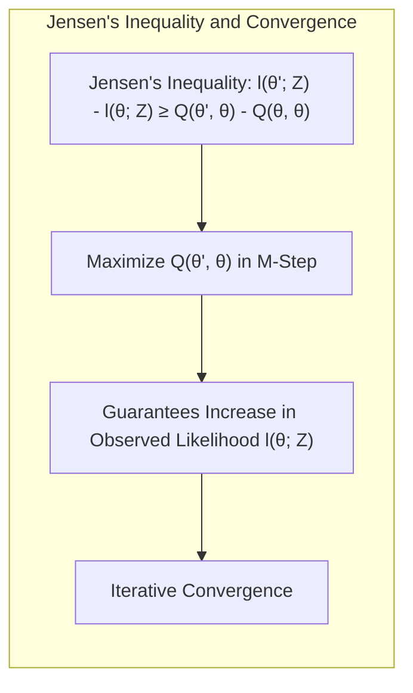

> 💡 **Exemplo Numérico:**  A desigualdade de Jensen (Lemma 4) garante que a cada iteração do EM, a verossimilhança dos dados observados nunca diminui. O passo de Expectation calcula a função $Q$ de forma a garantir essa propriedade, o que faz do EM um método confiável para encontrar ótimos locais da função de verossimilhança.

**Corolário 4:** A convergência do EM para um máximo local (e não necessariamente global) decorre do fato de que, em cada iteração, o algoritmo garante um aumento ou não-diminuição da verossimilhança observada, conforme demonstrado na prova do Lemma 4, o que também demonstra a importância do passo Expectation no processo iterativo do algoritmo EM.

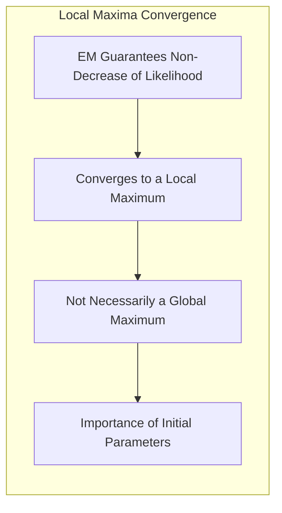

> 💡 **Exemplo Numérico:** O Corolário 4 indica que, como o EM garante que a verossimilhança observada não diminui a cada passo, o algoritmo converge para um ótimo local da função de verossimilhança. Entretanto, a convergência para um ótimo global não é garantida, o que significa que a escolha dos parâmetros iniciais é importante.

### Conclusão

Em resumo, o **Expectation Step** é um componente central do algoritmo EM, permitindo que modelos sejam ajustados a dados incompletos ou com variáveis latentes. Ele calcula as responsabilidades ou probabilidades posteriores, preparando o terreno para o passo de Maximização. Este passo garante que a verossimilhança observada aumente iterativamente até a convergência. A interpretação probabilística do passo de Expectation fornece uma compreensão intuitiva de como o algoritmo EM lida com incertezas, tornando-o uma ferramenta poderosa em diversas áreas da modelagem estatística e aprendizado de máquina. O algoritmo EM e seu passo de Expectation mostram como a modelagem estatística pode lidar com dados incompletos e incertezas de maneira elegante e eficiente.
<!-- END DOCUMENT -->

### Footnotes
[^8.1]: "In this chapter we provide a general exposition of the maximum likelihood approach, as well as the Bayesian method for inference."
[^8.5]: "The EM algorithm is a popular tool for simplifying difficult maximum likelihood problems."
[^8.5.2]: "The above procedure is an example of the EM (or Baum-Welch) algorithm for maximizing likelihoods in certain classes of problems."
[^8.45]: "In terms of log-likelihoods, we have l(θ′; Z) = l0(θ′; T) − l1(θ′; Zm|Z), where l1 is based on the conditional density Pr(Zm|Z, θ′)."
[^8.41]: "γi = E(Δi|θ, Z) = Pr(Δi = 1|θ, Z),"
[^8.46]: " = Q(θ′, θ) – R(θ′, θ)."
[^Ex. 8.1]: "Use Jensen’s inequality to show that Eq log[r(Y)/q(Y)] is maximized as a function of r(y) when r(y) = q(y)."
[^8.47]: "Hence the EM iteration never decreases the log-likelihood."
