## O Algoritmo EM em Geral
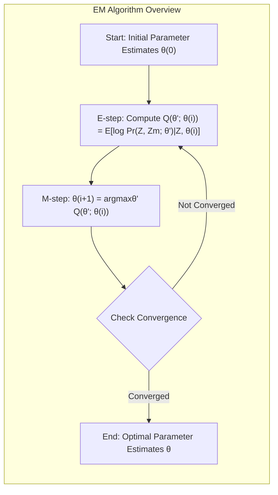

### Introdução
O algoritmo Expectation-Maximization (EM) é uma ferramenta poderosa para lidar com problemas de máxima verossimilhança quando os dados estão incompletos ou existem variáveis latentes [^8.5]. Em essência, o algoritmo EM oferece uma abordagem iterativa para encontrar estimativas de máxima verossimilhança em modelos com dados incompletos. A ideia central é tratar as variáveis latentes como se fossem parâmetros a serem estimados, alternando entre duas etapas: a etapa de Expectation (E-step) e a etapa de Maximization (M-step) [^8.5.2].

### Conceitos Fundamentais
**Conceito 1: Dados Observados e Latentes** O ponto de partida do algoritmo EM é a distinção entre dados observados (Z) e dados latentes ou variáveis não observadas (Zm). Os dados observados são aqueles disponíveis para análise, enquanto os dados latentes são aqueles que, se conhecidos, simplificariam a análise [^8.5.2]. No contexto do modelo de mistura Gaussiana, discutido anteriormente [^8.5.1], os dados observados seriam as amostras, e os dados latentes seriam as "responsabilidades" de cada amostra em relação a cada componente da mistura. A introdução de dados latentes permite que o problema de otimização se torne mais tratável, transformando um problema de otimização complexo em uma sequência de problemas de otimização mais simples.

> 💡 **Exemplo Numérico:** Imagine que estamos analisando dados de altura de pessoas, mas não sabemos a qual gênero cada pessoa pertence. As alturas são os dados observados (Z), e o gênero (masculino/feminino) é o dado latente (Zm). Se soubéssemos o gênero de cada pessoa, poderíamos modelar a distribuição das alturas separadamente para cada gênero, o que seria mais simples. O algoritmo EM nos permite estimar as médias e desvios padrão das alturas para cada gênero, mesmo sem saber o gênero de cada pessoa, através da estimação das probabilidades de cada pessoa pertencer a cada gênero (E-step) e a atualização dos parâmetros de cada distribuição (M-step).
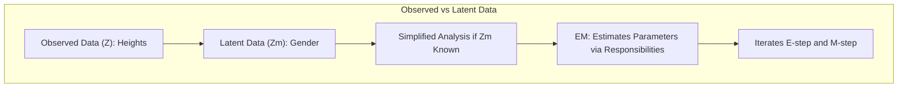

**Lemma 1:** *A probabilidade dos dados observados e latentes* é definida como *$Pr(Z, Z_m; \theta)$*, onde $\theta$ são os parâmetros do modelo. A log-verossimilhança dos dados completos é dada por *$l(\theta; T) = \log Pr(Z, Z_m; \theta)$*, onde $T = (Z, Z_m)$. A log-verossimilhança dos dados observados, *$l(\theta; Z)$*, é então marginalizada sobre os dados latentes: *$l(\theta; Z) = \log \sum_{z_m} Pr(Z, Z_m; \theta)$*, ou equivalentemente *$l(\theta; Z) = \log \int Pr(Z, Z_m; \theta)dZ_m$*, dependendo se os dados latentes são discretos ou contínuos [^8.5.2].
$$\text{Prova do Lemma 1:} \text{A log-verossimilhança dos dados observados é definida como: }$$
$$l(\theta; Z) = \log Pr(Z; \theta) = \log \sum_{Z_m} Pr(Z, Z_m; \theta) $$
$$\text{onde a soma é sobre todas as possíveis realizações de } Z_m \text{, demonstrando que os dados latentes estão marginalizados da log-verossimilhança observada. } \blacksquare $$
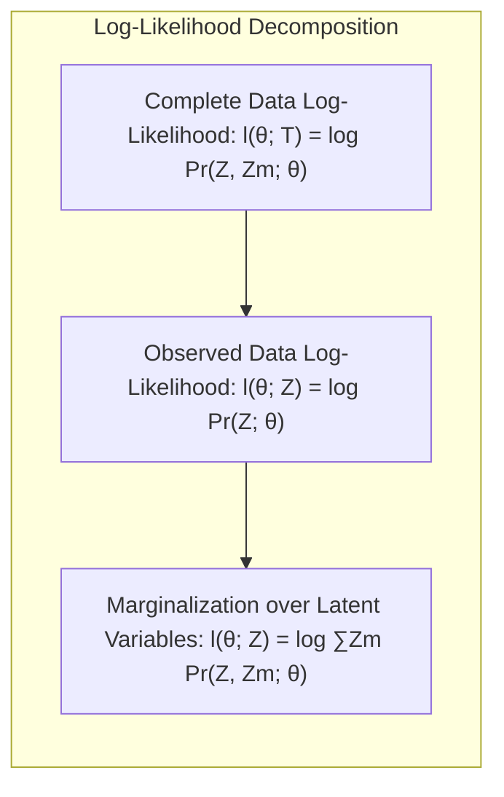

**Conceito 2: Etapa de Expectation (E-step)** A etapa de Expectation (E-step) envolve o cálculo da esperança da log-verossimilhança dos dados completos, dada a distribuição atual dos dados latentes e os parâmetros do modelo [^8.5.2]. Formalmente, essa esperança é denotada como *$Q(\theta'; \theta^{(i)}) = E[l(\theta'; T)|Z, \theta^{(i)}]$*, onde $\theta^{(i)}$ representa os parâmetros estimados na iteração anterior, e $\theta'$ é um argumento fictício representando os parâmetros a serem atualizados. No contexto do modelo de mistura Gaussiana, o E-step calcula as "responsabilidades" de cada amostra em relação a cada componente da mistura, usando os parâmetros estimados na iteração anterior [^8.5.1]. A função *$Q(\theta'; \theta^{(i)})$* quantifica o quão bem os dados completos "se encaixariam" sob um dado valor dos parâmetros do modelo.

> 💡 **Exemplo Numérico:** Continuando o exemplo das alturas, suponha que temos duas Gaussianas representando a distribuição das alturas masculinas e femininas. Na iteração *$i$*, temos estimativas *$\theta^{(i)}$* para as médias e desvios padrão de cada Gaussiana. O E-step calcularia, para cada pessoa, a probabilidade de sua altura ser gerada pela Gaussiana masculina e pela Gaussiana feminina. Essas probabilidades são as "responsabilidades". Por exemplo, uma pessoa com 1.80m teria uma alta probabilidade de ser do sexo masculino e uma baixa probabilidade de ser do sexo feminino. Essas probabilidades seriam usadas no próximo M-step.
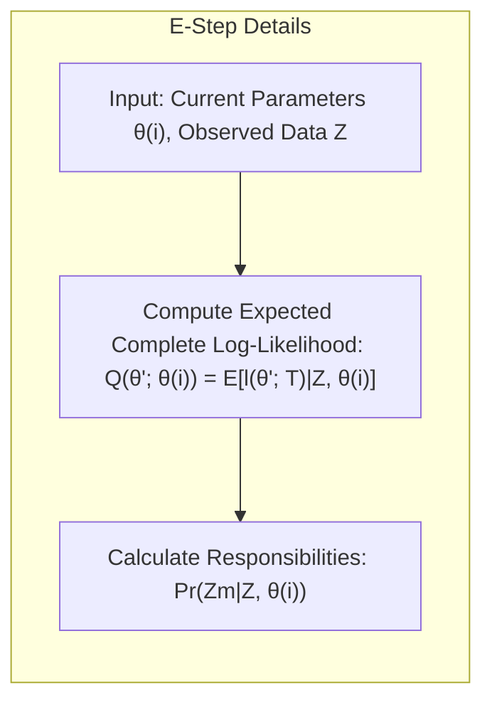

**Corolário 1:** *A função $Q(\theta'; \theta^{(i)})$ pode ser expressa como uma esperança condicional*, dada por *$Q(\theta'; \theta^{(i)}) = E[l(\theta'; T)|Z, \theta^{(i)}] = \sum_{z_m} l(\theta'; (Z, Z_m)) Pr(Z_m|Z, \theta^{(i)})$* para dados latentes discretos, ou equivalentemente, uma integral para dados latentes contínuos. Esta esperança é calculada usando a distribuição condicional das variáveis latentes, dados os dados observados e os parâmetros estimados atualmente.  A função Q é usada para encontrar uma melhor estimativa dos parâmetros.
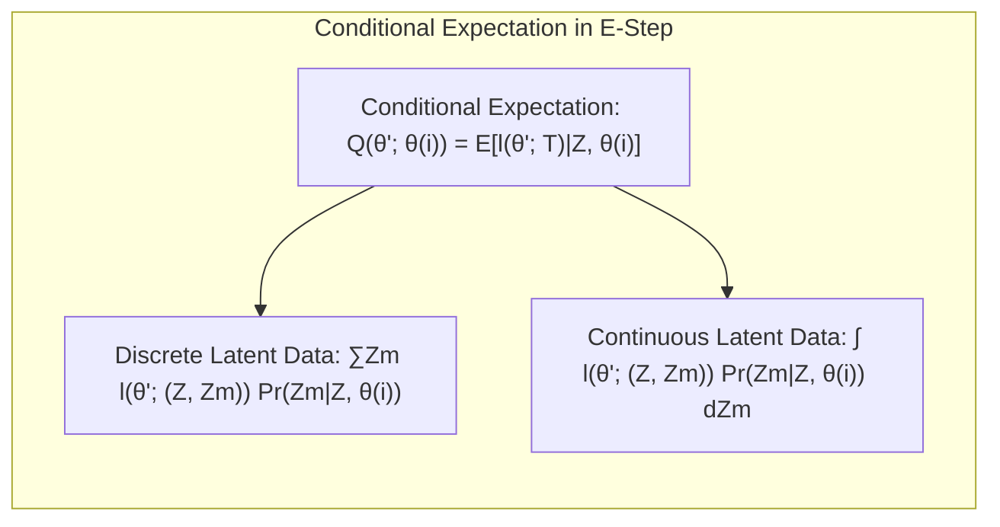

**Conceito 3: Etapa de Maximization (M-step)** A etapa de Maximization (M-step) envolve a determinação dos novos parâmetros do modelo, maximizando a função *$Q(\theta'; \theta^{(i)})$* com relação a $\theta'$ [^8.5.2]. Formalmente, isso é expresso como *$\theta^{(i+1)} = \text{argmax}_{\theta'} Q(\theta'; \theta^{(i)})$*. No modelo de mistura Gaussiana, o M-step atualiza os parâmetros de cada componente (média, variância e peso) usando as "responsabilidades" calculadas no E-step. O M-step tem como objetivo encontrar os parâmetros que melhor se ajustam aos dados observados e aos dados latentes sob o modelo [^8.5.1].

> 💡 **Exemplo Numérico:** No exemplo das alturas, o M-step usaria as "responsabilidades" calculadas no E-step para recalcular as médias e desvios padrão de cada Gaussiana. Por exemplo, a média da Gaussiana masculina seria atualizada para ser a média ponderada de todas as alturas, onde o peso de cada altura seria a probabilidade de essa pessoa ser do sexo masculino (sua "responsabilidade"). O mesmo processo seria usado para atualizar a média e desvio padrão da Gaussiana feminina, bem como o peso de cada Gaussiana na mistura.
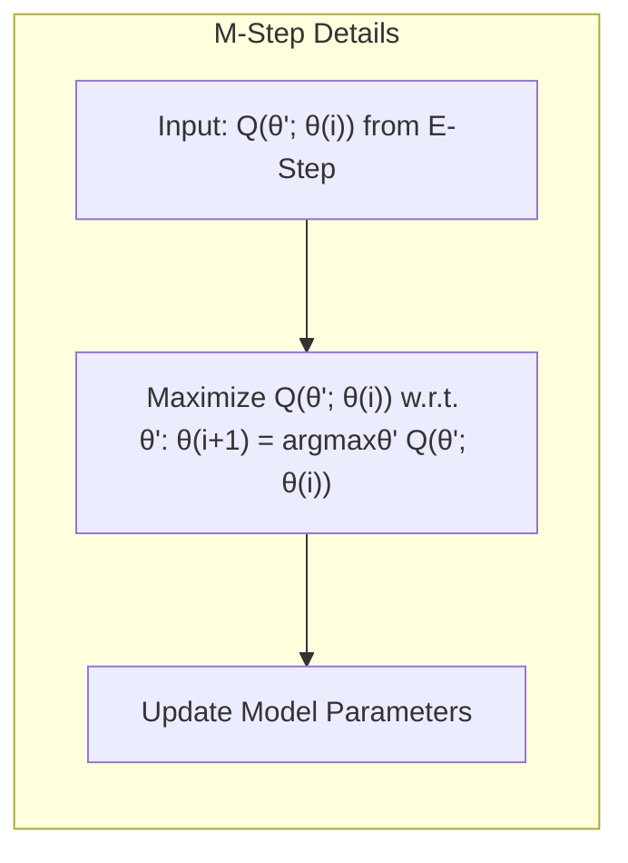

> ⚠️ **Nota Importante**: O algoritmo EM garante que a verossimilhança dos dados observados (não dos dados completos) aumenta a cada iteração ou permanece constante. Isso garante a convergência para um máximo local da função de verossimilhança. [^8.5.2]

> ❗ **Ponto de Atenção**: O algoritmo EM pode convergir para um máximo local, não necessariamente o máximo global da função de verossimilhança. A escolha de bons parâmetros iniciais e a exploração de múltiplas inicializações podem ajudar a mitigar esse problema. [^8.5.1]

> ✔️ **Destaque**: O algoritmo EM é uma ferramenta flexível e amplamente aplicável a diversos problemas com dados incompletos, incluindo modelos de mistura, análise de componentes principais, redes neurais, modelos ocultos de Markov (Hidden Markov Models - HMM) e muitos outros.

### O Algoritmo EM em Detalhe
O algoritmo EM é um método iterativo para encontrar estimativas de máxima verossimilhança quando temos dados incompletos ou variáveis latentes. A ideia básica do algoritmo é aumentar iterativamente a verossimilhança observada alternando entre dois passos:
1. **E-step (Expectation Step):** Calcula a esperança da log-verossimilhança dos dados completos *$l(\theta;T)$*, dados os dados observados e uma estimativa corrente dos parâmetros *$\theta^{(i)}$* [^8.5.2]. Formalmente, isso é expresso como:
$$ Q(\theta'; \theta^{(i)}) = E[l(\theta'; T) | Z, \theta^{(i)}]. $$
Aqui, *$\theta'$* é um parâmetro fictício sobre o qual maximizaremos no passo M, e *$\theta^{(i)}$* é a estimativa dos parâmetros na i-ésima iteração. O objetivo deste passo é calcular a distribuição das variáveis latentes, dadas as variáveis observadas e os parâmetros correntes [^8.5.1].
2. **M-step (Maximization Step):** Encontra os novos parâmetros que maximizam a função *$Q(\theta'; \theta^{(i)})$* [^8.5.2]. Ou seja:
$$ \theta^{(i+1)} = \text{argmax}_{\theta'} Q(\theta'; \theta^{(i)}). $$
Este passo usa as informações do E-step para melhorar as estimativas dos parâmetros. O objetivo é ajustar os parâmetros do modelo para melhor se ajustarem aos dados observados e latentes.

O algoritmo EM itera entre essas duas etapas até que a log-verossimilhança não aumente mais, ou até que outro critério de convergência seja atingido [^8.5.1]. É importante notar que o algoritmo EM garante que a log-verossimilhança observada aumente ou permaneça constante a cada iteração, mas não necessariamente encontra um máximo global.
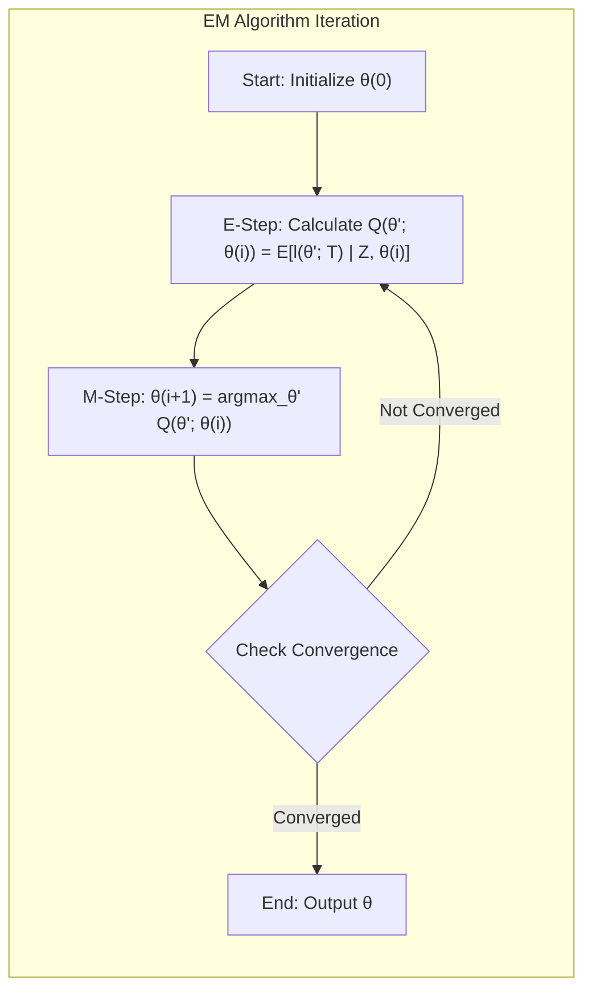

### Regressão Linear e Mínimos Quadrados para Classificação (Analogia com Algoritmo EM)
O algoritmo EM tem analogia com o uso de regressão linear e mínimos quadrados em classificação. Quando usamos regressão linear para classificar dados, o objetivo é encontrar um hiperplano que separe as classes o máximo possível. Ao usar mínimos quadrados, o objetivo é minimizar o erro quadrático entre os valores preditos e os valores reais [^4.2]. De maneira similar, o algoritmo EM tem como objetivo maximizar a verossimilhança dos dados, e o E-step e o M-step podem ser vistos como otimizações dentro desse objetivo maior.
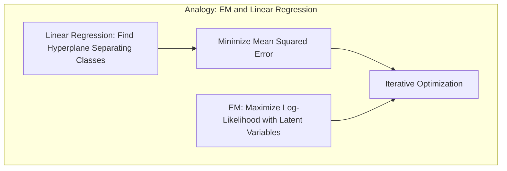

**Lemma 2:** *A relação entre o algoritmo EM e a regressão linear pode ser entendida* através da interpretação dos dados latentes como "pesos" ou "responsabilidades" das amostras em relação a cada classe [^8.5.1]. Assim como a regressão linear ajusta os coeficientes de um modelo para minimizar o erro nos dados observados, o algoritmo EM ajusta os parâmetros do modelo para maximizar a verossimilhança dos dados, usando a esperança dos dados latentes para guiar a otimização.
$$\text{Prova do Lemma 2: } \text{Na regressão linear, o erro quadrático } (y - \hat{y})^2 \text{ é minimizado, enquanto no EM, a log-verossimilhança } l(\theta; Z) \text{ é maximizada. Ambos os processos são iterativos e buscam o melhor ajuste aos dados, ajustando parâmetros em um modelo. No EM, o passo E computa a esperança dos dados latentes, o que pode ser análogo a encontrar o ajuste "ótimo" de um problema de regressão. } \blacksquare $$
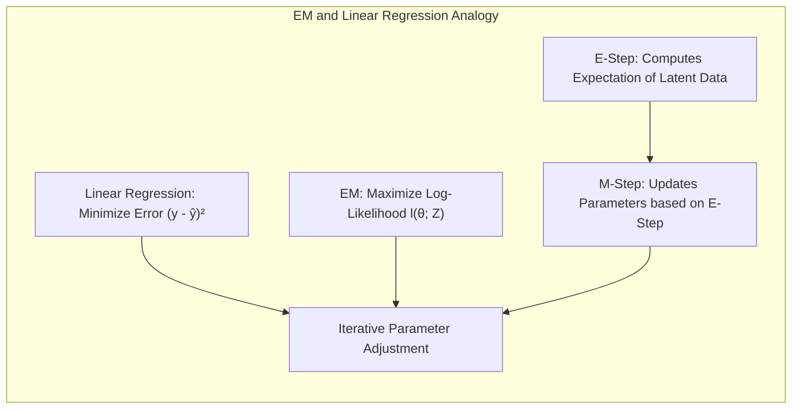

> 💡 **Exemplo Numérico:** Em um problema de classificação binária, podemos usar regressão logística para modelar a probabilidade de um ponto pertencer a uma classe. Se tivéssemos dados latentes representando a "certeza" com que cada ponto pertence à sua classe, o EM poderia iterativamente estimar essas "certezas" (E-step) e então reajustar os parâmetros do modelo de regressão logística para se ajustar melhor a esses dados "aumentados" (M-step). Esse processo é análogo a encontrar os melhores coeficientes na regressão linear, onde o ajuste é feito iterativamente.

**Corolário 2:** *Assim como os mínimos quadrados encontram um mínimo local*, o algoritmo EM converge para um máximo local da função de verossimilhança. A convergência não necessariamente significa um máximo global, o que exige escolhas cuidadosas de parâmetros iniciais e múltiplas inicializações. Essa analogia é útil para entender a natureza iterativa e otimizadora de ambos os métodos.

### Métodos de Seleção de Variáveis e Regularização em Classificação (Relação com EM)
O algoritmo EM não lida diretamente com seleção de variáveis ou regularização, mas essas técnicas podem ser usadas para melhorar modelos dentro do algoritmo. Por exemplo, em um modelo de mistura com muitas variáveis, podemos usar a regularização para reduzir a complexidade do modelo e melhorar a interpretabilidade. Similarmente, podemos aplicar métodos de seleção de variáveis para identificar as variáveis mais relevantes antes de usar o algoritmo EM [^4.4.4], [^4.5]. No contexto do algoritmo EM, essas técnicas ajudariam a reduzir o risco de overfitting e a melhorar a estabilidade do modelo.
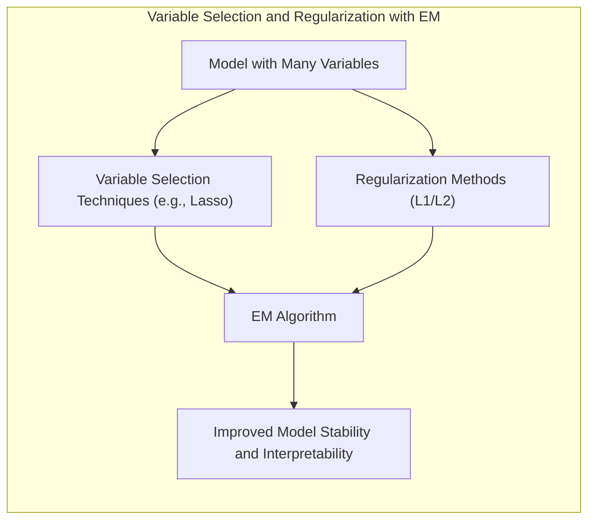

> 💡 **Exemplo Numérico:** Suponha que temos um modelo de mistura gaussiana com 100 variáveis. Para evitar overfitting e melhorar a interpretabilidade, podemos realizar uma seleção de variáveis usando métodos como Lasso antes de rodar o algoritmo EM. Isso reduziria o número de variáveis a serem consideradas no modelo de mistura, simplificando a otimização feita pelo algoritmo EM. Alternativamente, dentro do M-step, poderíamos adicionar uma penalidade de regularização L1 ou L2 nos parâmetros dos gaussianos para simplificar o modelo e obter soluções mais estáveis.

### Separating Hyperplanes e Perceptrons (Analogia com EM)
Os separating hyperplanes e o perceptron são conceitos na área de classificação. O algoritmo EM tem uma analogia com esses métodos no sentido que ambos visam encontrar uma "fronteira" que separa diferentes grupos de dados. No caso do algoritmo EM, essa fronteira é encontrada de maneira indireta, por meio da estimação dos parâmetros do modelo que melhor separam os grupos.
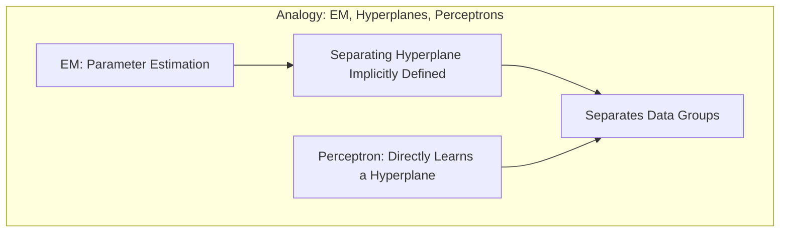

> 💡 **Exemplo Numérico:** Em um modelo de mistura gaussiana usado para classificação, o algoritmo EM ajusta os parâmetros das gaussianas (médias e matrizes de covariância) de forma que elas representem bem os grupos (classes) de dados. A fronteira de decisão entre as classes pode ser vista como um hiperplano separador, assim como em um perceptron. O EM, ao iterativamente ajustar os parâmetros do modelo de mistura, está efetivamente "aprendendo" uma forma de separar os dados de forma otimizada, mesmo sem definir um hiperplano explicitamente.

### Pergunta Teórica Avançada: Quais as diferenças fundamentais entre a formulação do EM e o método de Gradiente Ascendente considerando a maximização da log-verossimilhança, especialmente no tratamento de dados latentes?
**Resposta:**
O algoritmo EM é uma abordagem específica para maximizar a log-verossimilhança quando existem dados latentes ou incompletos, enquanto o método do gradiente ascendente é um algoritmo de otimização mais geral. O método do gradiente ascendente calcula o gradiente da função objetivo e atualiza os parâmetros na direção desse gradiente, o que pode ser eficaz se a função objetivo for diferenciável e os dados latentes não forem um problema. No entanto, se a função objetivo for complexa, com muitas variáveis ou com dados latentes, o método do gradiente ascendente pode ser muito difícil de aplicar diretamente.

O algoritmo EM, por outro lado, funciona em duas etapas: E-step e M-step. O E-step estima a distribuição dos dados latentes, dados os parâmetros atuais e os dados observados. O M-step maximiza a função de verossimilhança com base nos dados observados e na distribuição dos dados latentes. A grande diferença é que o EM não precisa calcular o gradiente da log-verossimilhança em relação aos parâmetros, o que torna o processo muito mais tratável em problemas com dados latentes.

O EM também usa a função *$Q(\theta';\theta)$*, uma aproximação da verossimilhança original, e maximiza essa função que tem a propriedade de que o incremento na função Q implica um incremento na verossimilhança original [^8.5.2].
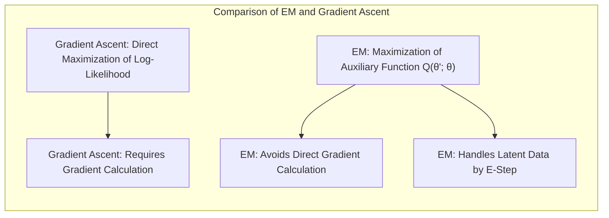

**Lemma 3:** *O algoritmo EM é análogo a maximizar uma função auxiliar $Q(\theta';\theta)$, que é um limite inferior da log-verossimilhança observada* no contexto de maximização de log-verossimilhança [^8.5.2].
$$\text{Prova do Lemma 3:} \text{O E-step define uma função auxiliar } Q(\theta'; \theta) = E[l(\theta'; T) | Z, \theta] \text{ e o M-step maximiza esta função para } \theta'. \text{O algoritmo EM é tal que } l(\theta^{(i+1)}; Z) \ge l(\theta^{(i)}; Z), \text{ garantindo que a verossimilhança não diminua e que o algoritmo busca um máximo local. } \blacksquare $$
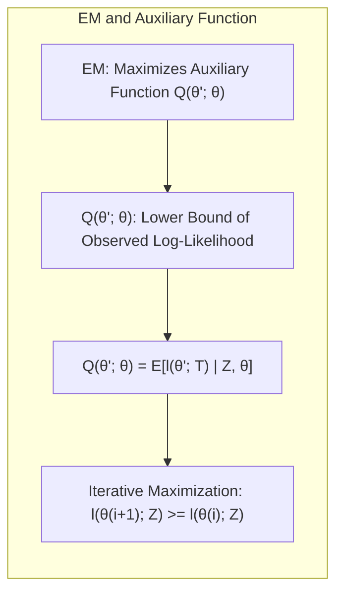

> 💡 **Exemplo Numérico:** Considere um problema onde queremos ajustar um modelo com um parâmetro θ usando o gradiente ascendente. A cada passo, calculamos o gradiente da log-verossimilhança em relação a θ e atualizamos θ na direção desse gradiente. No contexto do EM com dados latentes, este cálculo direto do gradiente pode ser difícil ou mesmo impossível. EM resolve este problema introduzindo a função Q, que é mais tratável e tem a propriedade de que aumentar Q também aumenta a verossimilhança. O EM é, portanto, uma estratégia indireta que contorna a dificuldade de calcular gradientes complexos diretamente.

**Corolário 3:** *O gradiente ascendente é diretamente aplicado à função de log-verossimilhança, enquanto o EM maximiza uma função auxiliar que está relacionada à log-verossimilhança*. A diferença chave reside no tratamento dos dados latentes: EM integra-os durante a E-step, enquanto o gradiente ascendente não os manipula explicitamente. [^8.5.2].

> ⚠️ **Ponto Crucial:** Enquanto o gradiente ascendente exige o cálculo do gradiente da log-verossimilhança, o EM evita essa necessidade, lidando com a complexidade através da introdução dos dados latentes e de uma função auxiliar.

As perguntas devem ser altamente relevantes, **avaliar a compreensão profunda de conceitos teóricos-chave**, podem envolver derivações matemáticas e provas, e focar em análises teóricas.

### Conclusão
O algoritmo EM é uma ferramenta fundamental no aprendizado de máquina e na estatística para a estimação de modelos com dados incompletos ou variáveis latentes. Ele fornece uma abordagem elegante e iterativa para maximizar a verossimilhança, alternando entre a etapa de Expectation (E-step) e a etapa de Maximization (M-step). Embora não garanta a convergência para um máximo global, sua versatilidade e ampla aplicabilidade o tornam uma das técnicas mais importantes no campo da modelagem estatística. O algoritmo EM também serve de ponte com outros métodos, oferecendo uma perspectiva para o entendimento da otimização de funções complexas e do tratamento de dados incompletos.

### Referências
[^8.5]: "In this chapter we provide a general exposition of the maximum likeli- hood approach, as well as the Bayesian method for inference." *(Trecho de <Nome do Documento>)*
[^8.5.2]: "The EM algorithm is a popular tool for simplifying difficult maximum likelihood problems. We first describe it in the context of a simple mixture model." *(Trecho de <Nome do Documento>)*
[^8.5.1]: "In this section we describe a simple mixture model for density estimation, and the associated EM algorithm for carrying out maximum likelihood estimation." *(Trecho de <Nome do Documento>)*
[^4.2]: "The corresponding fit μ(x) = Σj=1 βjhj(x) is shown in the top left panel of Figure 8.2." *(Trecho de <Nome do Documento>)*
[^4.4.4]: "The likelihood function can be used to assess the precision of θ." *(Trecho de <Nome do Documento>)*
[^4.5]: "For some values of the penalty parameter, the solutions are quite similar." *(Trecho de <Nome do Documento>)*
<!-- END DOCUMENT -->
