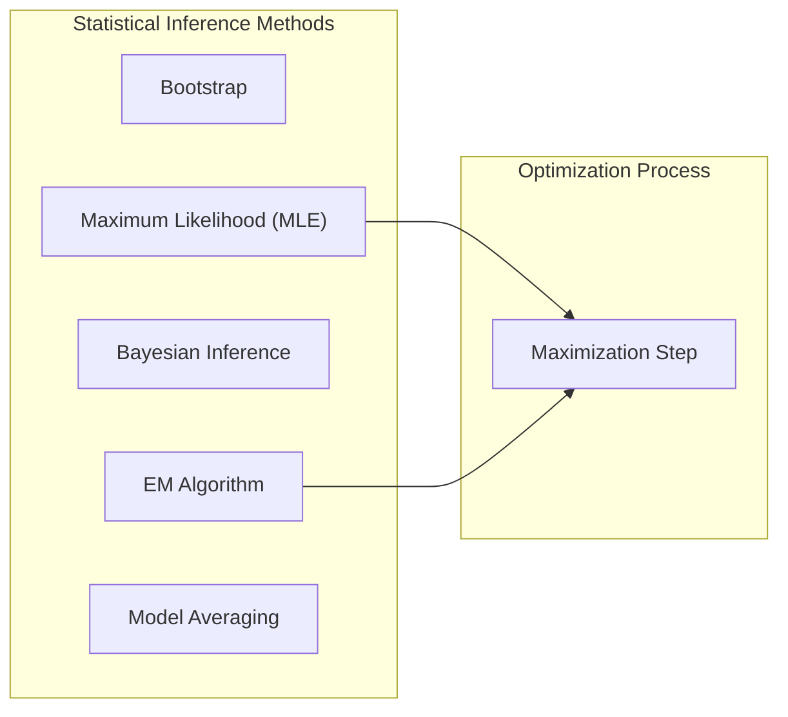
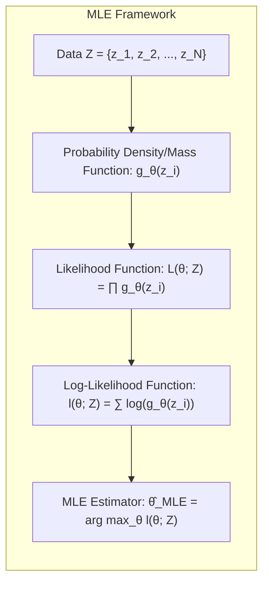
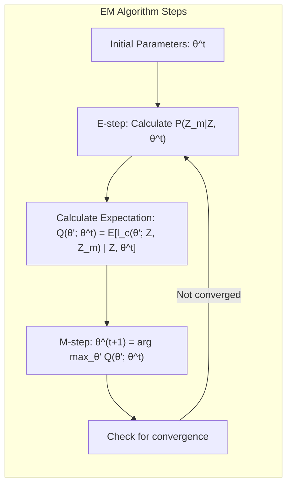
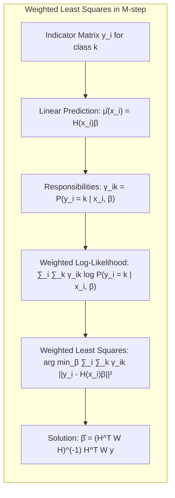
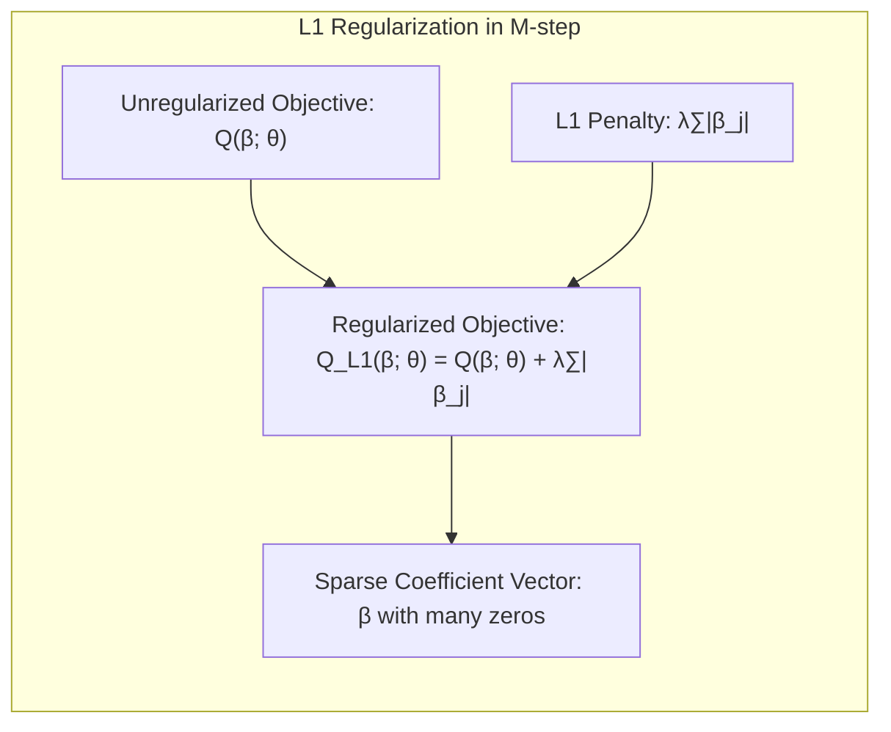
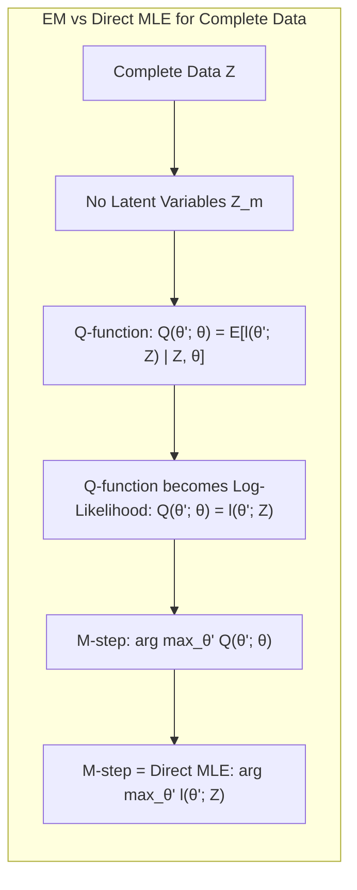

## Maximization Step General



### Introdução

A inferência de modelos estatísticos e de machine learning frequentemente envolve a otimização de uma função objetivo, seja ela a minimização de erros ou a maximização da verossimilhança. Em particular, o **Maximum Likelihood Estimation (MLE)** é uma técnica central que busca ajustar os parâmetros de um modelo para melhor explicar os dados observados [^8.1]. Este capítulo explora o **Maximization Step**, um componente essencial em diversos algoritmos de otimização, incluindo o EM Algorithm e suas variações, abordando também como ele se relaciona com métodos como o bootstrap, a inferência bayesiana e técnicas de model averaging.

### Conceitos Fundamentais

**Conceito 1: Maximum Likelihood Estimation (MLE)**
A **Maximum Likelihood Estimation (MLE)** é um método para estimar os parâmetros $\theta$ de um modelo estatístico maximizando a função de verossimilhança $L(\theta; Z)$, que representa a probabilidade dos dados observados $Z$ dado os parâmetros $\theta$ [^8.1]. Matematicamente, o objetivo é encontrar:

$$ \hat{\theta}_{MLE} = \arg \max_{\theta} L(\theta; Z) $$

A função de verossimilhança pode ser expressa como o produto das densidades de probabilidade (ou funções de massa de probabilidade) de cada observação:

$$ L(\theta; Z) = \prod_{i=1}^{N} g_{\theta}(z_i) $$

onde $g_{\theta}(z_i)$ é a probabilidade (ou densidade) da observação $z_i$ dado o parâmetro $\theta$. Em termos práticos, maximizar a log-verossimilhança é mais comum, pois transforma produtos em somas, facilitando cálculos e mantendo a mesma solução de $\theta$:

$$ l(\theta; Z) = \sum_{i=1}^{N} \log g_{\theta}(z_i) $$

**Lemma 1:** Se as observações $z_i$ são independentes, a função log-verossimilhança $l(\theta;Z)$ é a soma das log-verossimilhanças individuais $l(\theta;z_i)$.

*Prova:*
Se as observações $z_i$ são independentes, a probabilidade conjunta é o produto das probabilidades individuais:

$$ L(\theta; Z) = \prod_{i=1}^{N} g_{\theta}(z_i) $$

Tomando o logaritmo, obtemos:

$$ l(\theta; Z) = \log L(\theta; Z) = \log \left( \prod_{i=1}^{N} g_{\theta}(z_i) \right) $$

Aplicando a propriedade do logaritmo de um produto, temos:

$$ l(\theta; Z) = \sum_{i=1}^{N} \log g_{\theta}(z_i) = \sum_{i=1}^{N} l(\theta; z_i) $$

$\blacksquare$



> 💡 **Exemplo Numérico:** Considere um modelo com uma única observação que segue uma distribuição normal com média $\mu$ e desvio padrão $\sigma$. A função de densidade de probabilidade (PDF) é dada por $g_{\theta}(z) = \frac{1}{\sigma\sqrt{2\pi}}e^{-\frac{(z-\mu)^2}{2\sigma^2}}$, onde $\theta = (\mu, \sigma)$. Suponha que temos três observações independentes $z_1 = 1$, $z_2 = 2$, e $z_3 = 3$. A verossimilhança é $L(\mu, \sigma; Z) = \prod_{i=1}^{3} \frac{1}{\sigma\sqrt{2\pi}}e^{-\frac{(z_i-\mu)^2}{2\sigma^2}}$. A log-verossimilhança é então $l(\mu, \sigma; Z) = \sum_{i=1}^{3} \left[ -\log(\sigma\sqrt{2\pi}) - \frac{(z_i - \mu)^2}{2\sigma^2} \right]$. Maximizar essa função em relação a $\mu$ e $\sigma$ fornecerá as estimativas de máxima verossimilhança para esses parâmetros.

**Conceito 2: Expectation-Maximization (EM) Algorithm**

O **Expectation-Maximization (EM)** algorithm é um método iterativo para encontrar estimativas de máxima verossimilhança em modelos com variáveis latentes ou dados faltantes [^8.5]. O EM algorithm alterna entre duas etapas: a **Expectation Step** (E-step) e a **Maximization Step** (M-step). No E-step, calcula-se a expectativa da log-verossimilhança completa, considerando as variáveis latentes. No M-step, os parâmetros do modelo são atualizados maximizando a expectativa da log-verossimilhança [^8.5.1].

O EM algorithm é particularmente útil quando a função de verossimilhança é difícil de maximizar diretamente. No contexto de mixtures Gaussianas, por exemplo, o objetivo é encontrar os parâmetros de cada componente da mixture. No entanto, as responsabilidades de cada ponto de dados para cada componente são desconhecidas (variáveis latentes), e o EM resolve esse problema de forma iterativa [^8.5.1].

**Corolário 1:** Em um modelo com variáveis latentes $Z_m$, o E-step do EM algorithm estima a distribuição de probabilidade condicional $P(Z_m|Z, \theta)$, e o M-step maximiza a expectativa da log-verossimilhança completa, $Q(\theta'; \theta) = E[l_c(\theta'; Z, Z_m) | Z, \theta]$, dada por:

$$ Q(\theta'; \theta) = \int l_c(\theta'; Z, Z_m) P(Z_m|Z, \theta) \, dZ_m $$
onde $l_c$ é a log-verossimilhança dos dados completos $(Z, Z_m)$.

**Conceito 3: Maximization Step**

O **Maximization Step** (M-step) é a parte do EM algorithm onde os parâmetros do modelo são atualizados para maximizar a expectativa da log-verossimilhança, $Q(\theta'; \theta)$ obtida no E-step [^8.5.2].  O objetivo é encontrar:

$$ \theta^{t+1} = \arg \max_{\theta'} Q(\theta'; \theta^t) $$
onde $\theta^t$ são os parâmetros atuais e $\theta^{t+1}$ são os parâmetros atualizados. O M-step tenta encontrar os parâmetros que melhor se ajustam aos dados, levando em consideração as probabilidades de cada ponto de dado pertencer a cada componente (ou classe).

No caso de uma mixture de Gaussianas, o M-step envolve o cálculo de médias ponderadas e variâncias, usando as probabilidades (responsabilidades) computadas no E-step [^8.5.1]. Em outras palavras, o M-step busca encontrar os parâmetros de cada componente da mixture que maximizam a verossimilhança da mistura completa [^8.5.1].

> ⚠️ **Nota Importante**: O M-step é crítico pois, em conjunto com o E-step, garante a convergência do EM algorithm para um máximo local da verossimilhança [^8.5.2].
> ❗ **Ponto de Atenção**: O M-step pode envolver métodos de otimização numérica quando a função $Q(\theta'; \theta)$ não pode ser maximizada analiticamente.
> ✔️ **Destaque**: O M-step usa as probabilidades/responsabilidades do E-step para ajustar os parâmetros do modelo de forma iterativa, garantindo a melhoria da verossimilhança a cada iteração [^8.5.1], [^8.5.2].

### Regressão Linear e Mínimos Quadrados para Classificação



**Diagrama usando Mermaid:**

```mermaid
graph LR
    A[Inicializar Parâmetros (θ)] --> B(E-step: Calcular Responsabilidades);
    B --> C{Calcular Expectativa Q(θ'; θ)};
    C --> D(M-step: Maximizar Q(θ'; θ) para atualizar θ);
    D --> |Convergência?| E{Sim/Não};
    E -- Não --> B;
    E -- Sim --> F[Fim];
```

**Explicação:** Este diagrama representa as etapas iterativas do EM algorithm, com destaque para o M-step, que envolve a maximização da função de expectativa $Q(\theta'; \theta)$ para atualizar os parâmetros do modelo.

Na regressão linear para classificação, o M-step também desempenha um papel central. Ao invés de minimizar o erro quadrático como em regressão, na classificação, o modelo busca maximizar a verossimilhança dos rótulos de classe. Assim, em cada etapa do EM algorithm, os parâmetros dos modelos lineares associados às classes (como no caso de regressão de matrizes indicadoras) são atualizados para maximizar a verossimilhança com base nas responsabilidades calculadas no E-step. Em particular, ao usar regressão linear para classificação, os coeficientes são estimados através da minimização da soma dos erros quadrados [^8.2]. Contudo, se essa etapa fosse inserida dentro do loop do EM, os parâmetros seriam ajustados para maximizar a verossimilhança, levando em conta a incerteza sobre as probabilidades de classes [^8.5].

**Lemma 2:** Na regressão linear para classificação, quando as classes são definidas por uma matriz indicadora, a estimação dos parâmetros no M-step corresponde à solução de um problema de mínimos quadrados ponderado.

*Prova:*
Seja $y_i$ o vetor indicando a classe da $i$-ésima observação e $\hat{\mu}(x_i) = H(x_i)\beta$ a previsão do modelo linear, onde $H(x_i)$ é a matriz de design e $\beta$ são os parâmetros. No M-step, o objetivo é maximizar a expectativa da log-verossimilhança ponderada:

$$ \arg \max_{\beta} \sum_{i=1}^{N} \sum_{k=1}^{K} \gamma_{ik}  \log P(y_i = k | x_i, \beta) $$

onde $\gamma_{ik}$ é a responsabilidade da observação $i$ para a classe $k$. Sob a suposição de Gaussianidade, a maximização da verossimilhança é equivalente à minimização da soma dos erros quadrados ponderados:

$$ \arg \min_{\beta} \sum_{i=1}^{N} \sum_{k=1}^{K} \gamma_{ik}  ||y_i - H(x_i)\beta ||^2 $$

Essa minimização corresponde a resolver um problema de mínimos quadrados ponderados, com pesos $\gamma_{ik}$, resultando em:

$$ \hat{\beta} = (H^T W H)^{-1} H^T W y $$

onde $W$ é uma matriz diagonal com os pesos $\gamma_{ik}$.
$\blacksquare$



> 💡 **Exemplo Numérico:** Suponha que temos 3 amostras com duas classes (K=2), representadas por um vetor indicador $y_i$, onde a primeira classe é [1, 0] e a segunda é [0, 1]. Temos as matrizes de design $H(x_1) = [1, x_{11}, x_{12}]$,  $H(x_2) = [1, x_{21}, x_{22}]$ e $H(x_3) = [1, x_{31}, x_{32}]$ e  as responsabilidades $\gamma_{11} = 0.7$, $\gamma_{12} = 0.3$, $\gamma_{21} = 0.4$, $\gamma_{22} = 0.6$, $\gamma_{31} = 0.9$, $\gamma_{32} = 0.1$.  Então, $W$ seria uma matriz diagonal com os pesos $\gamma_{ik}$. Digamos que as observações sejam $x_1 = [2, 3]$, $x_2 = [4, 5]$, e $x_3 = [6, 7]$, e seus correspondentes labels $y_1 = [1, 0]$, $y_2 = [0, 1]$, e $y_3 = [1, 0]$.  Assim, $H$ é uma matriz com cada linha sendo $H(x_i)$.  Usando mínimos quadrados ponderados, resolvemos $\hat{\beta} = (H^T W H)^{-1} H^T W y$.   Este $\hat{\beta}$ representaria os coeficientes que melhor ajustam o modelo linear aos dados, levando em conta as probabilidades de cada classe para cada observação, atualizadas a cada iteração do algoritmo EM.

**Corolário 2:** A complexidade do M-step na regressão linear é diretamente influenciada pelo número de parâmetros a serem estimados e pelo tamanho da matriz de design.

Em modelos mais complexos, o M-step pode envolver técnicas numéricas de otimização, como gradiente descendente ou métodos quasi-Newton [^8.5.2]. A escolha do método de otimização depende da natureza da função objetivo $Q(\theta'; \theta)$ e das restrições sobre os parâmetros [^8.5.2].

### Métodos de Seleção de Variáveis e Regularização em Classificação

Em modelos de classificação, o M-step é frequentemente acompanhado por técnicas de seleção de variáveis e regularização, buscando evitar overfitting e melhorar a generalização. Por exemplo, em logistic regression com regularização L1 ou L2, o M-step deve incluir a otimização dos parâmetros com penalidades adicionais [^8.5]. Essas penalidades incentivam a esparsidade dos coeficientes (L1) ou a redução de sua magnitude (L2) [^8.5.1].

**Lemma 3:** A regularização L1 no M-step leva a coeficientes esparsos, o que melhora a interpretabilidade e a generalização do modelo, selecionando um subconjunto de variáveis relevantes.

*Prova:*
A regularização L1 adiciona um termo de penalidade proporcional ao valor absoluto dos coeficientes:

$$ Q_{L1}(\beta; \theta) = Q(\beta; \theta) + \lambda \sum_{j=1}^{p} |\beta_j| $$

onde $\lambda$ é um parâmetro de regularização. A minimização desta função promove a esparsidade, pois a penalidade L1 tende a zerar os coeficientes menos relevantes, resultando em modelos mais interpretáveis [^8.5]. Os coeficientes são atualizados usando o gradiente da log-verossimilhança, e a penalidade L1 adiciona um termo de subgradiente. Quando o gradiente de um coeficiente é pequeno, a penalidade L1 pode zerar o coeficiente completamente, promovendo a seleção de variáveis [^8.5.1].
$\blacksquare$



> 💡 **Exemplo Numérico:**  Suponha um problema de classificação binária usando regressão logística, com uma log-verossimilhança $l(\beta)$ e um vetor de coeficientes $\beta = [\beta_0, \beta_1, \beta_2]$.  No M-step, temos que maximizar a função $Q_{L1}(\beta; \theta) = l(\beta) - \lambda (|\beta_1| + |\beta_2|)$, onde $\lambda$ é o parâmetro de regularização L1.  Se $\lambda = 0.5$ e o gradiente da log-verossimilhança em um determinado passo do M-step é tal que $\beta_1 = 0.2$ e $\beta_2 = 0.1$, a penalidade L1 pode diminuir o valor de $\beta_1$ e $\beta_2$ ou até mesmo zerá-los se o gradiente for suficientemente pequeno. Por exemplo, depois de várias iterações, $\beta_1$ pode ser zerado e $\beta_2$ diminuído para 0.05, indicando que a variável associada a $\beta_1$ foi considerada menos relevante para a classificação do que a variável associada a $\beta_2$. A penalidade L1 incentiva o modelo a usar menos variáveis (esparsidade), tornando-o mais simples e possivelmente menos propenso a overfitting.

**Corolário 3:** Em classificadores baseados em modelos lineares com regularização, a atualização dos parâmetros no M-step resulta em parâmetros que maximizam a log-verossimilhança, ao mesmo tempo que atendem às restrições impostas pelas penalidades, melhorando a generalização do modelo.

> ⚠️ **Ponto Crucial**: A escolha entre penalidade L1, L2 ou elastic net depende da necessidade de esparsidade, estabilidade e da natureza do problema de classificação [^8.5].

### Separating Hyperplanes e Perceptrons

O conceito de hiperplanos separadores está ligado ao M-step através da formulação do problema de otimização. No contexto de separating hyperplanes, o objetivo é maximizar a margem de separação entre as classes. Esse objetivo é usualmente transformado em um problema de minimização de uma função de custo, e o M-step busca ajustar os parâmetros do hiperplano para atingir a margem máxima. No caso de um perceptron, que é um algoritmo iterativo, o M-step (ou melhor, o passo de atualização) modifica os pesos do perceptron de acordo com o erro de classificação, visando convergir para uma solução de separação [^8.5.2].

### Pergunta Teórica Avançada: Qual a relação entre o M-step do EM e a maximização direta da log-verossimilhança em modelos com dados completos?

**Resposta:**
Em modelos com dados completos, onde não há variáveis latentes, o M-step do EM se reduz a um único passo de maximização da log-verossimilhança. Isso ocorre porque a expectativa da log-verossimilhança completa $Q(\theta'; \theta)$ coincide com a própria log-verossimilhança observada. Assim, o EM se torna equivalente a maximizar a log-verossimilhança diretamente. No entanto, o EM se torna uma abordagem iterativa quando existem variáveis latentes, pois o M-step precisa levar em conta as probabilidades de cada dado pertencer a cada componente do modelo [^8.5].

**Lemma 4:** Em modelos com dados completos, a maximização da log-verossimilhança usando o EM se reduz a uma única etapa equivalente à maximização direta, pois a expectativa da log-verossimilhança condicional à variável latente se torna a própria verossimilhança completa.

*Prova:*
Seja $l(\theta; Z)$ a log-verossimilhança para os dados completos $Z$. Em modelos sem variáveis latentes, não existe $Z_m$. Portanto, no EM, o Q-function se torna:

$$ Q(\theta'; \theta) = E[l(\theta'; Z)|Z, \theta] = l(\theta'; Z) $$

Neste caso, o M-step se torna:

$$ \theta^{t+1} = \arg \max_{\theta'} l(\theta'; Z) $$

que é a maximização direta da log-verossimilhança, mostrando a equivalência [^8.5.2].
$\blacksquare$



> 💡 **Exemplo Numérico:**  Considere um modelo de regressão linear com dados completos $Z = \{(x_1, y_1), (x_2, y_2),\ldots,(x_N, y_N) \}$. A log-verossimilhança do modelo é dada por $l(\theta; Z) = -\frac{N}{2} \log(2\pi\sigma^2) - \frac{1}{2\sigma^2} \sum_{i=1}^{N}(y_i - x_i^T\beta)^2$, onde $\theta = (\beta, \sigma^2)$ são os parâmetros. Em um modelo de dados completos, a função $Q(\theta'; \theta)$ no EM algorithm se torna igual à própria log-verossimilhança $l(\theta; Z)$, então o M-step resolve o problema de maximizar essa função diretamente, sem iterações.  Portanto, o M-step neste caso corresponde a encontrar as estimativas de mínimos quadrados para os coeficientes $\beta$ e a estimativa de máxima verossimilhança para $\sigma^2$, sem a necessidade de iterações adicionais do EM.

**Corolário 4:** O EM algorithm é uma generalização da maximização direta da log-verossimilhança, aplicável a modelos com dados faltantes ou latentes, e em casos onde o método analítico de maximização direta é complexo.

> ⚠️ **Ponto Crucial:** A iteração do EM algorithm garante que a função log-verossimilhança nunca diminua, e em geral converge para um máximo local [^8.5.2].

### Conclusão

O **Maximization Step** é um componente crucial em diversos métodos estatísticos e de machine learning. Seja através da maximização direta da log-verossimilhança ou através de iterações como no EM algorithm, o M-step é fundamental para ajustar os parâmetros dos modelos aos dados de treinamento [^8.5.1]. O uso de regularização e seleção de variáveis no M-step melhora a robustez e interpretabilidade dos modelos, enquanto o conceito de separar hiperplanos e perceptrons utilizam o M-step para otimizar a fronteira de decisão. Portanto, compreender o funcionamento do M-step é essencial para o desenvolvimento de modelos estatísticos e de machine learning eficazes.

### Footnotes

[^8.1]: "In this chapter we provide a general exposition of the maximum likelihood approach, as well as the Bayesian method for inference." *(Trecho de <Model Inference and Averaging>)*
[^8.2]: "The usual estimate of ẞ, obtained by minimizing the squared error over the training set, is given by..." *(Trecho de <Model Inference and Averaging>)*
[^8.3]: "...the standard error of a predic-tion (x) = h(x)Tß is..." *(Trecho de <Model Inference and Averaging>)*
[^8.4]: "There is actually a close connection between the least squares estimates (8.2) and (8.3), the bootstrap, and maximum likelihood." *(Trecho de <Model Inference and Averaging>)*
[^8.5]: "The EM algorithm is a popular tool for simplifying difficult maximum likelihood problems." *(Trecho de <Model Inference and Averaging>)*
[^8.5.1]: "In this section we describe a simple mixture model for density estimation, and the associated EM algorithm for carrying out maximum likelihood estimation." *(Trecho de <Model Inference and Averaging>)*
[^8.5.2]: "Algorithm 8.2 gives the general formulation of the EM algorithm. Our observed data is Z..." *(Trecho de <Model Inference and Averaging>)*
<!-- END DOCUMENT -->
