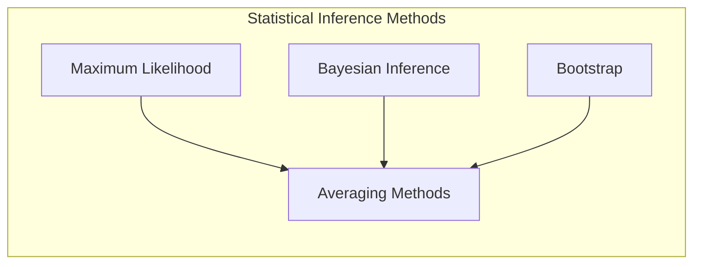
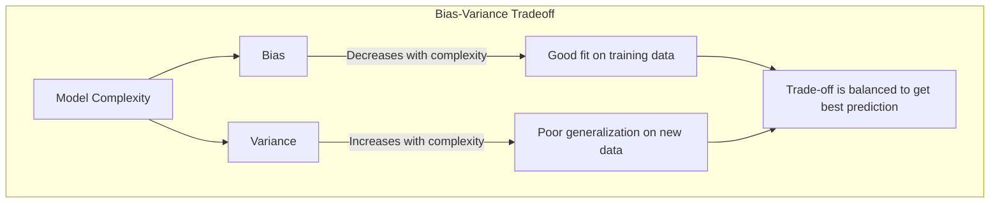
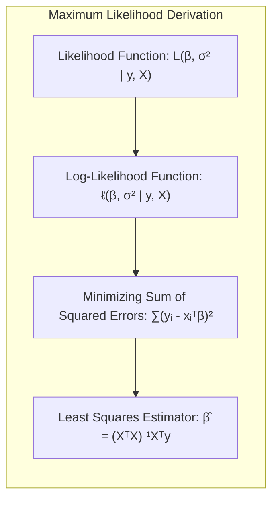
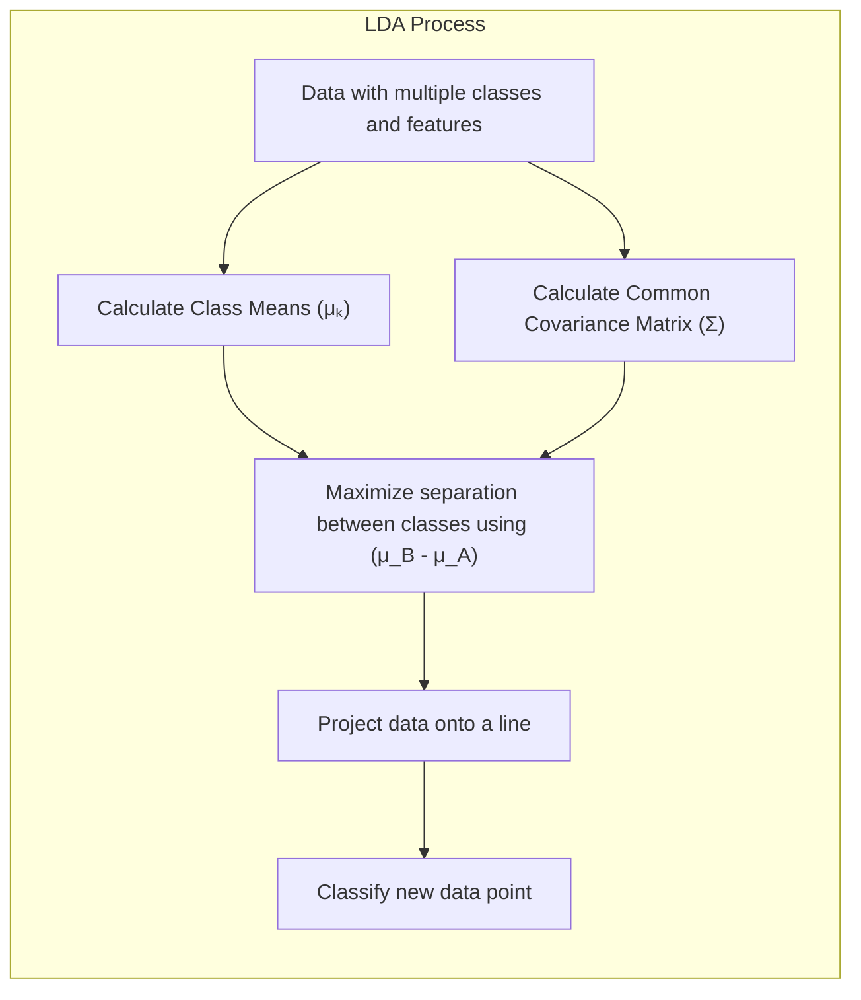
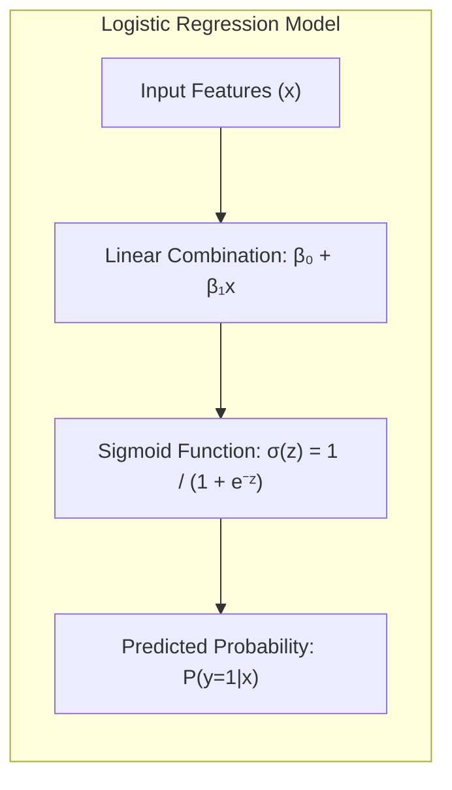
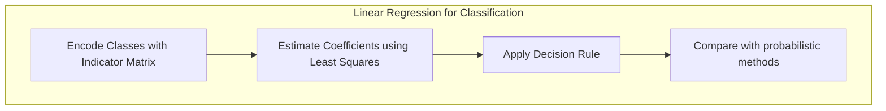
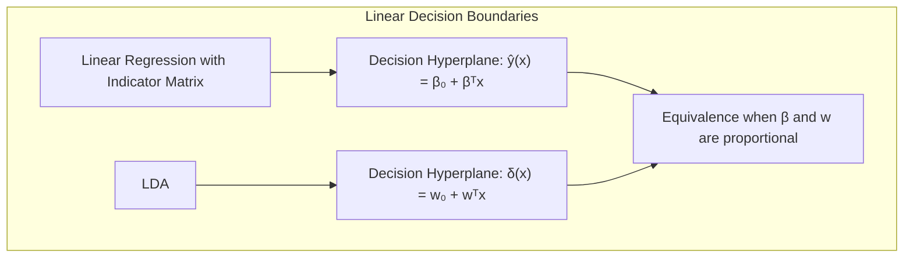
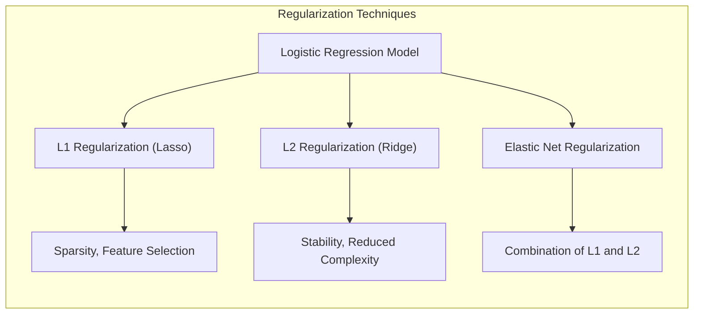
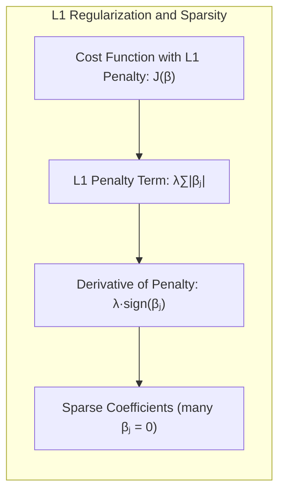
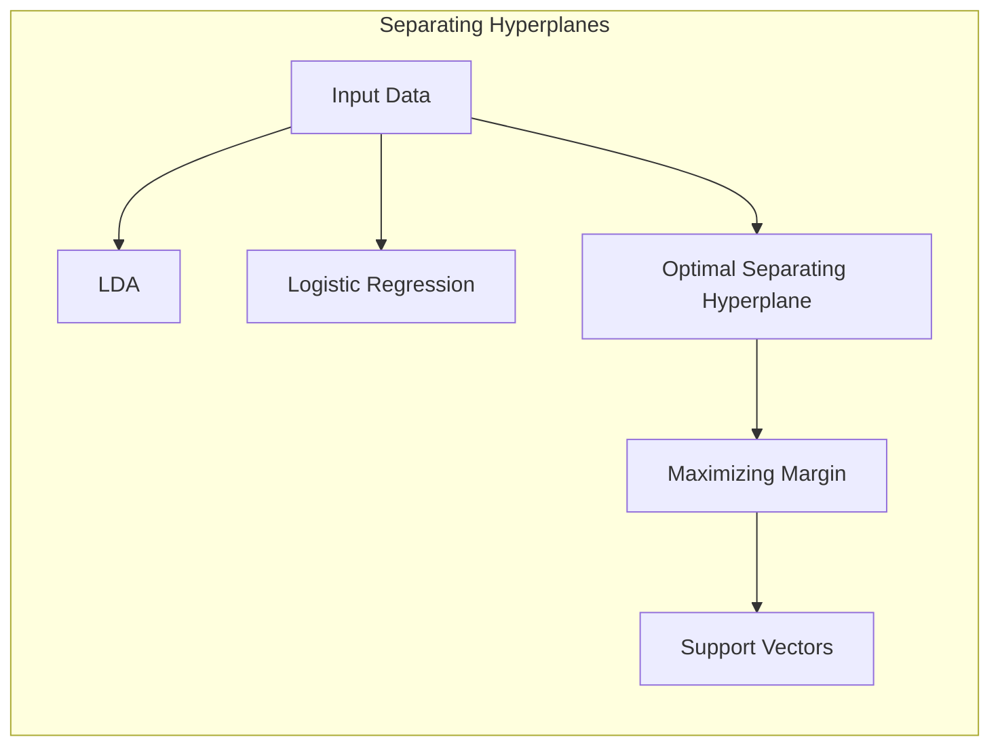

Okay, here's the text with added Mermaid diagrams as requested, focusing on enhancing the mathematical and statistical concepts.

## Model Inference and Averaging with Complete Data



### Introdução

Neste capítulo, exploraremos métodos avançados para inferência e modelagem estatística, focando na análise de *complete data*, ou seja, conjuntos de dados onde não há valores faltantes ou latentes. Nos capítulos anteriores, a aprendizagem de modelos foi frequentemente realizada através da minimização de uma soma de quadrados para regressão ou da entropia cruzada para classificação [^8.1]. Esses métodos, como veremos, são instâncias da abordagem de *maximum likelihood*. O objetivo deste capítulo é fornecer uma exposição detalhada das técnicas de maximum likelihood, juntamente com a metodologia Bayesiana para inferência. Abordaremos também o *bootstrap*, explorando sua relação com *maximum likelihood* e métodos Bayesianos, e apresentaremos algumas técnicas relacionadas à modelagem por média e melhoria, incluindo métodos de comitê, *bagging*, *stacking* e *bumping* [^8.1].

### Conceitos Fundamentais

**Conceito 1: O Problema de Inferência Estatística com Dados Completos:**
O problema fundamental de inferência estatística é, dada uma amostra de dados, determinar quais modelos melhor representam o processo gerador desses dados [^8.1]. Em um cenário de *complete data*, este processo é mais direto, pois não precisamos lidar com a incerteza adicional de valores faltantes. Em essência, buscamos inferir os parâmetros de um modelo estatístico que melhor se ajustam aos dados observados. Frequentemente, esta busca é formulada como um problema de otimização, onde procuramos os parâmetros que maximizam uma função de verossimilhança ou minimizam um erro de ajuste específico. Este processo envolve um *trade-off* entre **viés** e **variância**, onde modelos mais complexos se ajustam melhor aos dados de treino (menor viés) mas podem não generalizar bem para novos dados (alta variância). Um exemplo prático seria a regressão linear para modelar a relação entre duas variáveis, onde os coeficientes da regressão são os parâmetros que buscamos inferir [^8.1].

> 💡 **Exemplo Numérico:** Imagine que temos um dataset com as seguintes observações de uma variável independente $x$ e uma variável dependente $y$:
>
>   | $x$ | $y$ |
>   |-----|-----|
>   | 1   | 2   |
>   | 2   | 3   |
>   | 3   | 5   |
>   | 4   | 6   |
>   | 5   | 8   |
>
>   Podemos usar regressão linear para modelar a relação entre $x$ e $y$, buscando os parâmetros $\beta_0$ (intercepto) e $\beta_1$ (inclinação) do modelo $y = \beta_0 + \beta_1x$. Através do método dos mínimos quadrados, que é um caso de máxima verossimilhança sob a suposição de erros normais, estimamos esses parâmetros. O objetivo é encontrar os valores de $\beta_0$ e $\beta_1$ que minimizam a soma dos quadrados dos resíduos, ou seja, a diferença entre os valores observados de $y$ e os valores preditos pelo modelo.  Para esse exemplo, podemos calcular:
>
> ```python
> import numpy as np
> from sklearn.linear_model import LinearRegression
>
> x = np.array([[1], [2], [3], [4], [5]])
> y = np.array([2, 3, 5, 6, 8])
>
> model = LinearRegression()
> model.fit(x, y)
>
> beta_1 = model.coef_[0]
> beta_0 = model.intercept_
>
> print(f"Estimated beta_1 (slope): {beta_1:.2f}")
> print(f"Estimated beta_0 (intercept): {beta_0:.2f}")
> ```
>
>  O resultado do código acima nos dá $\beta_1 \approx 1.5$ e $\beta_0 \approx 0.5$. Isso significa que para cada aumento de uma unidade em $x$, esperamos que $y$ aumente em aproximadamente 1.5 unidades, e que quando $x$ é 0, o valor esperado de $y$ é 0.5. Este é um exemplo de como a inferência estatística, através da regressão linear, nos permite entender a relação entre variáveis. O objetivo é escolher um modelo que balanceie bem o viés e a variância. Um modelo que se ajusta perfeitamente aos dados de treinamento (alto viés) pode não generalizar para novos dados (alta variância).



**Lemma 1:** *A estimativa de mínimos quadrados para regressão linear é uma solução de máxima verossimilhança sob a suposição de que os erros do modelo seguem uma distribuição normal com média zero*.

**Prova:**
Considere um modelo de regressão linear $y_i = \mathbf{x}_i^T\boldsymbol{\beta} + \epsilon_i$, onde $\epsilon_i \sim \mathcal{N}(0, \sigma^2)$. A função de verossimilhança é dada por:
$$
L(\boldsymbol{\beta}, \sigma^2 | \mathbf{y}, \mathbf{X}) = \prod_{i=1}^{N} \frac{1}{\sqrt{2\pi\sigma^2}} \exp \left( -\frac{(y_i - \mathbf{x}_i^T\boldsymbol{\beta})^2}{2\sigma^2} \right)
$$
Tomando o logaritmo da verossimilhança:
$$
\ell(\boldsymbol{\beta}, \sigma^2 | \mathbf{y}, \mathbf{X}) = -\frac{N}{2}\log(2\pi\sigma^2) - \frac{1}{2\sigma^2} \sum_{i=1}^{N}(y_i - \mathbf{x}_i^T\boldsymbol{\beta})^2
$$
Maximizar a verossimilhança é equivalente a minimizar a soma dos quadrados dos erros, $\sum_{i=1}^{N}(y_i - \mathbf{x}_i^T\boldsymbol{\beta})^2$, resultando na solução de mínimos quadrados $\hat{\boldsymbol{\beta}} = (\mathbf{X}^T\mathbf{X})^{-1}\mathbf{X}^T\mathbf{y}$. Portanto, a estimativa de mínimos quadrados é também a estimativa de máxima verossimilhança sob a suposição de erros Gaussianos. $\blacksquare$


**Conceito 2: Linear Discriminant Analysis (LDA):**
A LDA é um método de classificação que busca encontrar uma combinação linear de features que melhor separe as classes, ou seja, projeta os dados em um subespaço onde a separação entre classes é maximizada [^8.3]. Assume que os dados dentro de cada classe seguem uma distribuição normal com a mesma matriz de covariância, mas com médias diferentes [^8.3]. A fronteira de decisão entre duas classes é linear, e é determinada pela diferença entre as médias e pela matriz de covariância comum das classes [^8.3.1], [^8.3.2], [^8.3.3]. A LDA é útil para redução de dimensionalidade e classificação, oferecendo uma forma eficiente de lidar com problemas de classificação multi-classes, mesmo quando as features são altamente correlacionadas.

> 💡 **Exemplo Numérico:** Imagine um problema de classificação com duas classes (A e B) e duas features ($x_1$ e $x_2$). Temos as seguintes médias e matriz de covariância (considerando que as covariâncias são iguais entre as classes):
>
>  * Média da Classe A: $\mu_A = [1, 2]$
>  * Média da Classe B: $\mu_B = [3, 4]$
>  * Matriz de covariância comum: $\Sigma = \begin{bmatrix} 1 & 0.5 \\ 0.5 & 1 \end{bmatrix}$
>
>  A LDA projetará os dados em uma linha que maximiza a separação entre as classes A e B, considerando as médias e a matriz de covariância comum.  A direção desta linha é dada pelo autovetor correspondente ao maior autovalor da matriz $\Sigma^{-1}(\mu_B - \mu_A)(\mu_B - \mu_A)^T$. O resultado dessa projeção linear será uma nova representação dos dados em uma dimensão, com as classes o mais separadas possível. Se tivermos um novo ponto, por exemplo, $x=[2,3]$, podemos projetar ele nesta dimensão e classificar com base na projeção.
>
>  ```python
>  import numpy as np
>  from sklearn.discriminant_analysis import LinearDiscriminantAnalysis
>
>  X = np.array([[1, 2], [1.5, 2.5], [2, 1.8], [3, 4], [3.5, 4.5], [4, 3.8]])
>  y = np.array([0, 0, 0, 1, 1, 1])  # 0 for class A, 1 for class B
>
>  lda = LinearDiscriminantAnalysis()
>  lda.fit(X, y)
>  new_point = np.array([[2, 3]])
>  predicted_class = lda.predict(new_point)
>  print(f"Predicted class for [2, 3]: {predicted_class[0]}")
>  ```
>
>  Este código mostra um exemplo simples de como a LDA pode ser usada para classificação. No exemplo acima, o ponto [2, 3] será classificado de acordo com a projeção obtida. A LDA é útil quando há muitas features e deseja-se reduzir a dimensionalidade enquanto mantém a separação entre as classes.



**Corolário 1:** *Sob a hipótese de que as classes seguem distribuições Gaussianas com a mesma matriz de covariância, a fronteira de decisão da LDA corresponde a uma projeção linear dos dados que maximiza a separabilidade das classes*.
Essa projeção pode ser entendida como uma direção no espaço de features onde a variabilidade entre as médias das classes é maximizada em relação à variabilidade dentro das classes [^8.3.1].

**Conceito 3: Logistic Regression:**
A Regressão Logística é um modelo de classificação probabilística que modela a probabilidade de um evento ocorrer utilizando uma função logística. Em vez de modelar a variável resposta diretamente, ela modela o *log-odds* da probabilidade de uma classe [^8.4]. A probabilidade de um evento é dada pela função sigmoide aplicada a uma combinação linear das features [^8.4.1]. Os parâmetros do modelo são estimados utilizando o método de *maximum likelihood*, que busca maximizar a verossimilhança dos dados observados [^8.4.2]. A Regressão Logística é amplamente utilizada para problemas de classificação binária, embora possa ser estendida para problemas multiclasses utilizando abordagens como *one-vs-all* ou *softmax regression* [^8.4.3], [^8.4.4], [^8.4.5].

> 💡 **Exemplo Numérico:**  Suponha que queremos modelar a probabilidade de um cliente comprar um produto com base em seu histórico de compras ($x$). Temos um conjunto de dados com clientes que compraram (y=1) e não compraram (y=0). Os dados são:
>
>   | $x$ (Histórico) | $y$ (Compra) |
>   |-----------------|--------------|
>   | 1               | 0            |
>   | 2               | 0            |
>   | 3               | 1            |
>   | 4               | 1            |
>   | 5               | 1            |
>
>  O modelo de regressão logística é dado por: $P(y=1|x) = \frac{1}{1 + e^{-(\beta_0 + \beta_1x)}}$. Os parâmetros $\beta_0$ e $\beta_1$ são estimados por máxima verossimilhança. Após o treinamento, digamos que obtivemos os seguintes coeficientes: $\beta_0 = -3$ e $\beta_1 = 1$. Para um novo cliente com histórico $x = 3.5$, a probabilidade de comprar o produto é:
>
>  $P(y=1|x=3.5) = \frac{1}{1 + e^{-(-3 + 1 \times 3.5)}} = \frac{1}{1 + e^{-0.5}} \approx 0.62$.
>
>  Isso significa que, dado o histórico de 3.5, o cliente tem uma probabilidade de aproximadamente 62% de comprar o produto.
>
> ```python
> import numpy as np
> from sklearn.linear_model import LogisticRegression
>
> X = np.array([[1], [2], [3], [4], [5]])
> y = np.array([0, 0, 1, 1, 1])
>
> model = LogisticRegression()
> model.fit(X, y)
>
> beta_0 = model.intercept_[0]
> beta_1 = model.coef_[0][0]
>
> new_x = np.array([[3.5]])
> probability = model.predict_proba(new_x)[0][1]
>
> print(f"Estimated beta_0 (intercept): {beta_0:.2f}")
> print(f"Estimated beta_1 (slope): {beta_1:.2f}")
> print(f"Predicted probability for x=3.5: {probability:.2f}")
> ```
>
> O código mostra o ajuste da regressão logística aos dados de exemplo e a previsão da probabilidade para um novo ponto.



> ⚠️ **Nota Importante**: A Regressão Logística é um modelo linear no espaço do log-odds, o que implica que a fronteira de decisão no espaço original das features é linear.
> ❗ **Ponto de Atenção**: Em problemas de classificação com classes não balanceadas, a Regressão Logística pode precisar de técnicas de amostragem ou ponderação para evitar viés em direção à classe majoritária.
> ✔️ **Destaque**: Tanto a LDA quanto a regressão logística podem ser consideradas modelos lineares com base em seus fundamentos. A LDA assume normalidade e covariâncias iguais, enquanto a regressão logística se baseia em um modelo logístico, ajustando os parâmetros por meio da maximização da verossimilhança.

### Regressão Linear e Mínimos Quadrados para Classificação



**Explicação:** O diagrama acima ilustra o flow of using indicator matrices in Linear Regression for classification.

Uma abordagem para realizar classificação utilizando regressão linear é empregar uma matriz de indicadores para representar as classes. Nessa abordagem, cada classe é codificada como um vetor binário, onde um único elemento é igual a 1 (indicando a classe correspondente) e todos os outros elementos são iguais a 0. Em seguida, um modelo de regressão linear é ajustado para prever a classe a partir das features. Após o ajuste, a classe prevista é determinada pela maior saída do modelo. Esta abordagem, apesar de intuitiva, tem suas limitações, pois as saídas da regressão linear não são necessariamente probabilidades válidas e podem até extrapolar fora do intervalo [0,1] [^8.1], [^8.2]. Além disso, a regressão linear não considera as suposições de distribuição dos dados, e pode ser sensível a outliers e problemas de multicolinearidade [^8.3].

> 💡 **Exemplo Numérico:** Imagine um problema de classificação com três classes (A, B e C). Usando regressão de indicadores, criamos uma matriz de indicadores da seguinte forma:
>
>   * Classe A:  [1, 0, 0]
>   * Classe B:  [0, 1, 0]
>   * Classe C:  [0, 0, 1]
>
>   Para um dataset com duas features ($x_1$ e $x_2$) e três classes, cada amostra é representada por $(x_1, x_2, y)$, onde $y$ é o vetor indicador da classe. A regressão linear tentará prever os três valores do vetor indicador a partir das features. Suponha que após ajustar o modelo, para uma nova amostra com features $x = [2, 3]$, o modelo preveja o seguinte vetor: $\hat{y} = [0.2, 0.7, 0.1]$.  Neste caso, a classe prevista seria a Classe B, pois corresponde ao maior valor previsto. No entanto, os valores previstos não somam 1 e não estão no intervalo [0, 1], mostrando as limitações da regressão linear para classificação.

**Lemma 2:** *Em problemas de classificação binária, com classes representadas por valores 0 e 1, a regressão linear da matriz de indicadores pode levar a hiperplanos de decisão que são equivalentes aos obtidos pela LDA em certas condições.*

**Prova:**
Considere um problema de classificação binária com classes 0 e 1. A regressão linear para a matriz de indicadores neste caso se torna uma regressão simples onde a saída é a classe. A função discriminante linear gerada pela regressão pode ser escrita como $\hat{y}(x) = \beta_0 + \beta^Tx$. Se assumirmos que a LDA também tem uma função discriminante linear da forma $\delta(x) = w_0 + w^Tx$, para que as projeções da regressão e LDA sejam equivalentes em alguns casos, os vetores $\beta$ e $w$ devem ser proporcionales, e os limiares devem estar na mesma posição. Essa equivalência ocorre quando as classes são bem separadas e as amostras podem ser bem representadas por suas médias.  $\blacksquare$



**Corolário 2:** *A equivalência entre as projeções nos hiperplanos de decisão gerados por regressão linear e discriminantes lineares, sob certas condições, simplifica a análise do modelo e permite aplicar resultados teóricos de um para o outro, facilitando a interpretação das decisões da classificação*. Isso é particularmente útil para entender como as features influenciam as decisões de classificação, tanto pela regressão linear quanto pela LDA,  mostrando que, em algumas situações, os modelos se comportam de maneira similar, mas também expondo as suas diferenças [^8.3].

Em alguns cenários, a regressão logística pode fornecer estimativas mais estáveis de probabilidade, enquanto a regressão de indicadores pode levar a extrapolações fora de [0,1]. No entanto, há situações em que a regressão de indicadores é suficiente e até mesmo vantajosa quando o objetivo principal é a fronteira de decisão linear.

### Métodos de Seleção de Variáveis e Regularização em Classificação



**Explicação:** The above diagram illustrates the application of L1, L2 and Elastic Net regularization on a logistic classification model.

A seleção de variáveis e a regularização são técnicas importantes para melhorar o desempenho e a generalização de modelos de classificação. A seleção de variáveis visa identificar as features mais relevantes para o modelo, descartando as features irrelevantes ou redundantes. A regularização, por outro lado, adiciona um termo de penalização à função de custo do modelo, a fim de restringir a magnitude dos coeficientes e evitar o sobreajuste [^8.4.4], [^8.5]. Em particular, a Regressão Logística com penalizações L1 e L2 pode controlar a *sparsity* (número de coeficientes zero) e a estabilidade do modelo. A penalização L1 (Lasso) tende a gerar modelos com muitos coeficientes exatamente iguais a zero, realizando seleção de variáveis, enquanto a penalização L2 (Ridge) tende a reduzir a magnitude dos coeficientes sem zerá-los, melhorando a estabilidade do modelo. Combinando penalizações L1 e L2, obtém-se a regularização *Elastic Net* [^8.4.4], [^8.5], [^8.5.1], [^8.5.2].

> 💡 **Exemplo Numérico:** Considere um modelo de regressão logística com duas features ($x_1$ e $x_2$) e regularização. A função de custo regularizada com penalização L1 é:
>
> $J(\boldsymbol{\beta}) = -\frac{1}{N}\sum_{i=1}^N [y_i \log(\sigma(\mathbf{x}_i^T \boldsymbol{\beta})) + (1-y_i) \log(1-\sigma(\mathbf{x}_i^T \boldsymbol{\beta}))] + \lambda (|\beta_1| + |\beta_2|)$
>
> Onde $\lambda$ é o parâmetro de regularização. Se $\lambda=0.1$, e após o treinamento do modelo, obtivemos $\beta_1 = 0.8$ e $\beta_2 = -0.5$, aplicando a penalização L1 na função de custo, tendemos a reduzir $\beta_1$ e $\beta_2$. Se aumentarmos $\lambda$ para 1.0, a penalidade L1 se torna mais forte, e o modelo pode levar a um dos coeficientes, digamos $\beta_2$, para 0, resultando em um modelo com apenas a feature $x_1$.
>
> ```python
> import numpy as np
> from sklearn.linear_model import LogisticRegression
> from sklearn.preprocessing import StandardScaler
> from sklearn.pipeline import Pipeline
>
> X = np.array([[1, 2], [1.5, 2.5], [2, 1.8], [3, 4], [3.5, 4.5], [4, 3.8]])
> y = np.array([0, 0, 0, 1, 1, 1])
>
> # L1 Regularization
> pipeline_l1 = Pipeline([('scaler', StandardScaler()), ('model', LogisticRegression(penalty='l1', solver='liblinear', C=1.0))]) # C = 1/lambda
> pipeline_l1.fit(X, y)
> print(f"L1 Regularization Coefficients: {pipeline_l1['model'].coef_[0]}")
>
> # L2 Regularization
> pipeline_l2 = Pipeline([('scaler', StandardScaler()), ('model', LogisticRegression(penalty='l2', C=1.0))])
> pipeline_l2.fit(X, y)
> print(f"L2 Regularization Coefficients: {pipeline_l2['model'].coef_[0]}")
>
> # Elastic Net
> pipeline_en = Pipeline([('scaler', StandardScaler()), ('model', LogisticRegression(penalty='elasticnet', solver='saga', l1_ratio=0.5, C=1.0))]) # l1_ratio controls the mix of L1 and L2
> pipeline_en.fit(X, y)
> print(f"Elastic Net Coefficients: {pipeline_en['model'].coef_[0]}")
> ```
>
>  O código ilustra como as penalizações L1, L2 e Elastic Net afetam os coeficientes do modelo. Podemos ver como L1 pode levar alguns coeficientes a zero, realizando a seleção de variáveis.

**Lemma 3:** *A penalização L1 na regressão logística leva a coeficientes esparsos devido à natureza da função de penalidade, que impõe um custo adicional proporcional à soma dos valores absolutos dos coeficientes.*

**Prova:**
A função de custo regularizada para regressão logística com penalização L1 é dada por:
$$
J(\boldsymbol{\beta}) = -\frac{1}{N}\sum_{i=1}^N [y_i \log(\sigma(\mathbf{x}_i^T \boldsymbol{\beta})) + (1-y_i) \log(1-\sigma(\mathbf{x}_i^T \boldsymbol{\beta}))] + \lambda \sum_{j=1}^p |\beta_j|
$$
onde $\sigma$ é a função logística, $\lambda$ é o parâmetro de regularização, e $\sum_{j=1}^p |\beta_j|$ é a penalização L1. A derivada do termo de penalização $\lambda \sum_{j=1}^p |\beta_j|$ em relação a $\beta_j$ é $\lambda \cdot \text{sign}(\beta_j)$, que é constante para $\beta_j > 0$ e $\beta_j < 0$, e uma subderivada em $\beta_j = 0$. Esse comportamento da penalidade L1 leva a soluções com muitos $\beta_j$ exatamente iguais a zero, induzindo *sparsity*. A otimização de $J(\boldsymbol{\beta})$ leva a coeficientes esparsos. $\blacksquare$



**Corolário 3:** *A esparsidade induzida pela penalização L1 resulta em modelos mais interpretáveis e com melhor capacidade de generalização, uma vez que reduz a complexidade do modelo e foca apenas nas features mais relevantes*. Isso é particularmente útil em problemas com grande número de features, onde a identificação das features mais importantes é crucial [^8.4.5].

> ⚠️ **Ponto Crucial**: L1 e L2 podem ser combinadas (Elastic Net) para aproveitar vantagens de ambos os tipos de regularização, controlando *sparsity* e estabilidade simultaneamente.

### Separating Hyperplanes e Perceptrons



**Explicação:** The diagram illustrates different techniques to obtain separating hyperplanes, such as LDA, logistic regression and maximum margin approaches.

A ideia de maximizar a margem de separação entre as classes leva ao conceito de hiperplanos ótimos para classificação. Um hiperplano é um subespaço linear de dimensão *p-1* em um espaço de *p* dimensões, que pode ser usado para separar os dados em diferentes classes [^8.5.2]. Um hiperplano ótimo é aquele que maximiza a distância mínima entre o hiperplano e os pontos de dados mais próximos de cada classe, também conhecidos como *support vectors*. A formulação do problema de otimização para encontrar um hiperplano ótimo envolve encontrar os coeficientes do hiperplano e um parâmetro de *bias* que minimizem a classificação errônea e maximizem a margem. As soluções para este problema surgem a partir de combinações lineares dos pontos de suporte, que são os pontos que estão mais próximos do hiperplano de decisão. A ideia de separar as classes utilizando hiperplanos está intimamente ligada a modelos como *Support Vector Machines (SVMs)*, onde o objetivo principal é encontrar este hiperplano que maximiza a margem de separação.

> 💡 **Exemplo Numérico:** Imagine que temos duas classes, representadas por pontos em um espaço 2D:
> * Classe 1: (1, 1), (2, 1), (1, 2)
> * Classe 2: (3, 3), (4, 3), (3, 4)
>
> O objetivo do *Separating Hyperplane* é encontrar uma linha (hiperplano em 2D) que separe as duas classes com a maior margem possível. Podemos usar o SVM para achar o hiperplano. O SVM encontra os pontos de suporte (os pontos mais próximos do hiperplano) e ajusta o hiperplano para maximizar a distância entre ele e os pontos de suporte. Os pontos de suporte são os pontos que definem a margem do hiperplano.
>
> ```python
> import numpy as np
> from sklearn.svm import SVC
>
> X = np.array([[1, 1], [2, 1], [1, 2], [3, 3], [4, 3], [3, 4]])
> y = np.array([0, 0, 0, 1, 1, 1]) # 0 for class 1, 1 for class 2
>
> svm_model = SVC(kernel='linear')
> svm_model.fit(X, y)
>
> w = svm_model.coef_[0]
> b = svm_model.intercept_[0]
>
> print(f"Hiperplane coefficients (w): {w}")
> print(f"Hiperplane intercept (b): {b}")
> print(f"Support vectors: {svm_model.support_vectors_}")
>
> ```
> O código mostra como ajustar o SVM a esses pontos e determinar o hiperplano e os pontos de suporte.  Este hiperplano divide o espaço em duas regiões, cada uma correspondente a uma classe. A margem do hiperplano é a distância entre ele e os pontos de suporte.
>

O *Perceptron* de Rosenblatt é um algoritmo de aprendizado que busca encontrar um hiperplano que separa os dados em diferentes classes. O algoritmo ajusta iterativamente os pesos do hiperplano com base nos erros de classificação das amostras, até que todas as amostras sejam classificadas corretamente (em situações onde a separação é linear) [^8.5.1]. A convergência do Perceptron é garantida sob condições específicas, como a linear separabilidade dos dados. O Perceptron é um dos primeiros algoritmos de aprendizado de máquina, e sua simplicidade e eficiência o tornam uma ferramenta importante para entender os fundamentos do aprendizado de modelos lineares.

### Pergunta Teórica Avançada: Quais as diferenças fundamentais entre a formulação de LDA e a Regra de Decisão Bayesiana considerando distribuições Gaussianas com covariâncias iguais?

**Resposta:**

A *Linear Discriminant Analysis (LDA)* e a regra de decisão Bayesiana compartilham uma base comum, especialmente quando se considera dados com distribuições Gaussianas e covariâncias iguais. Ambas se baseiam em um modelo probabilístico, mas suas formulações e objetivos são distintos. A LDA é uma abordagem discriminativa que busca um subespaço onde as classes são separadas, enquanto a regra de decisão Bayesiana é uma abordagem generativa que busca estimar a probabilidade posterior das classes. Quando as classes seguem distribuições Gaussianas com a mesma matriz de covariância, a fronteira de decisão Bayesiana se torna uma fronteira linear, o que a torna similar à LDA [^8.3].

A LDA formula o problema da classificação através da busca por uma projeção linear dos dados que maximize a separação entre classes, usando conceitos como matrizes de covariância e médias das classes. O objetivo é projetar os dados em um espaço unidimensional onde as classes são mais distintas. A regra de decisão Bayesiana, por outro lado, busca classificar um ponto de dados atribuindo-o à classe que tem a maior probabilidade posterior, calculada através do Teorema de Bayes. Sob a hipótese de distribuições Gaussianas com covariâncias iguais, a regra de decisão Bayesiana pode ser expressa como uma função discriminante linear, semelhante ao resultado do LDA [^8.3], [^8.3.3]. Em ambos os métodos, o limite de decisão é determinado pelas diferenças entre as médias das classes e pela matriz de covariância comum.

**Lemma 4:** *Quando as classes seguem distribuições Gaussianas com a mesma matriz de covariância, a função discriminante linear do LDA é proporcional à função discriminante Bayesiana, resultando em decisões de classificação equivalentes*.

**Prova:**
A função discriminante linear do LDA pode ser expressa como: $\delta_k(x) = x^T\Sigma^{-1}\mu_k - \frac{1}{2}\mu_k^T\Sigma^{-1}\mu_k + \log(\pi_k)$, onde $\mu_k$ é a média da classe $k$, $\Sigma$ é a matriz de covariância comum, e $\pi_k$ é a probabilidade *a priori* da classe $k$. Já a regra de decisão Bayesiana para classes Gaussianas com covariâncias iguais