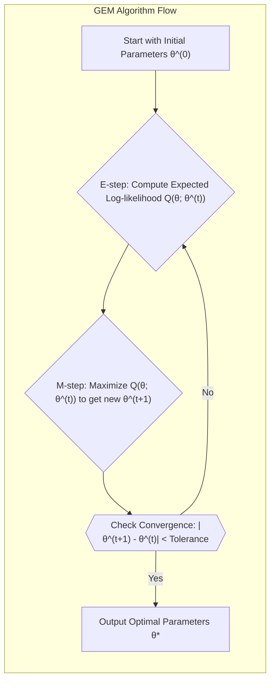
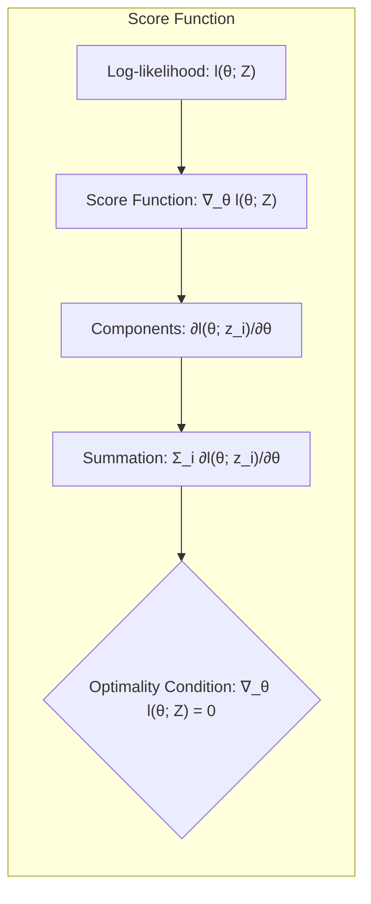
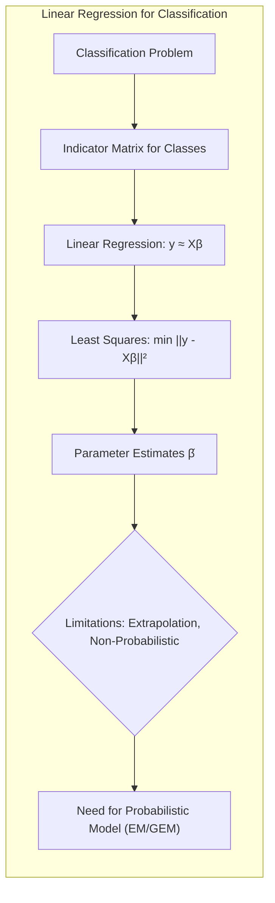
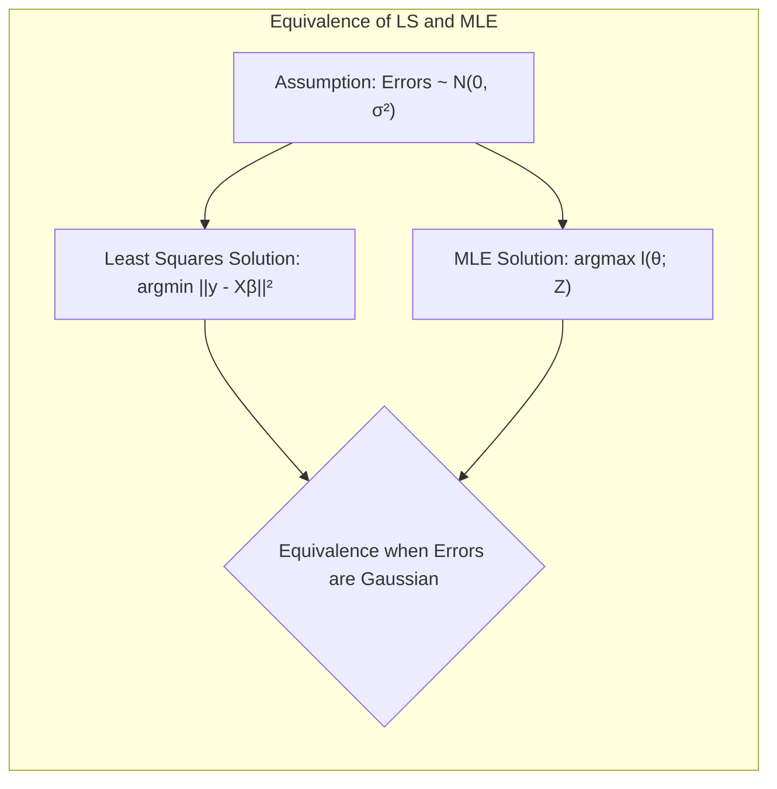
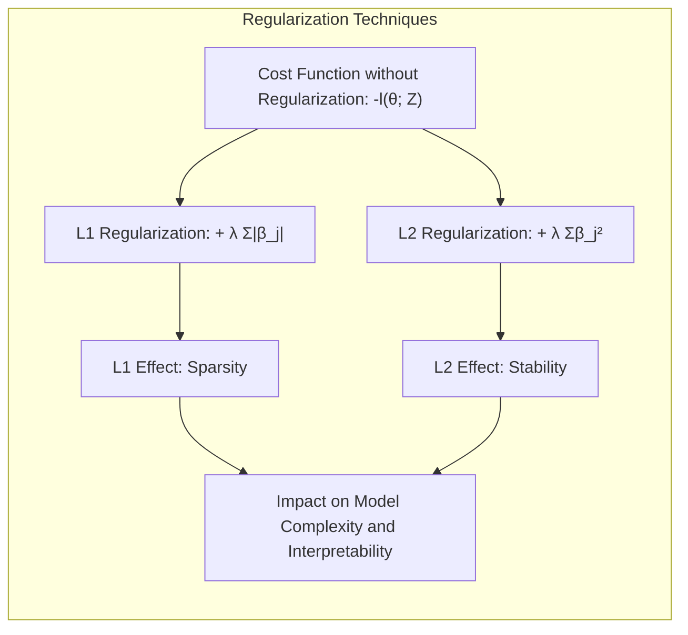
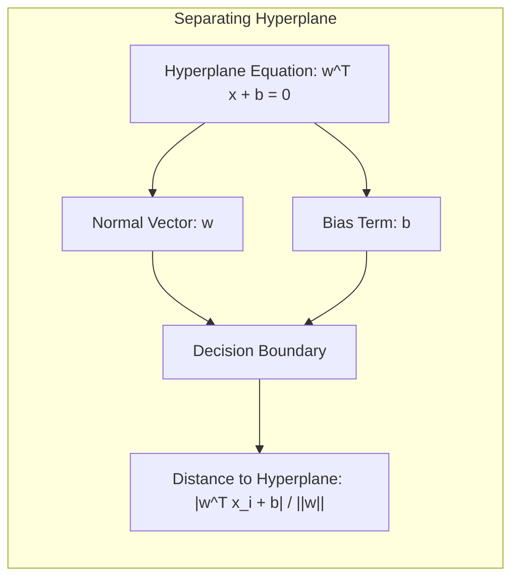
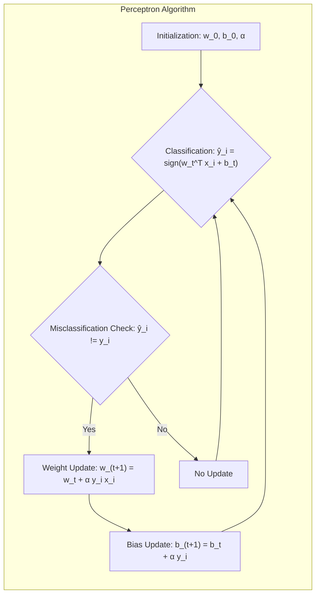
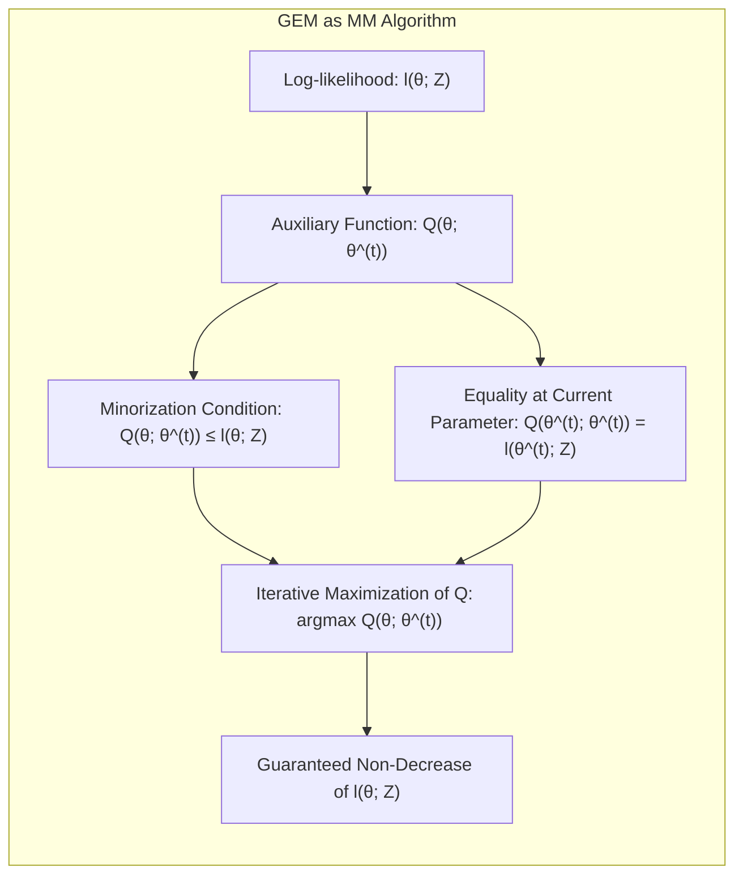

Okay, let's enhance the text with Mermaid diagrams, focusing on the mathematical and statistical aspects as requested.

## Generalized EM (GEM) Algorithm: A Deep Dive into Model Optimization



### Introdução
Neste capítulo, exploramos métodos avançados para inferência e ajuste de modelos estatísticos, com foco particular no **Generalized Expectation-Maximization (GEM) algorithm**. O GEM, uma extensão do clássico algoritmo EM, oferece uma abordagem flexível e poderosa para otimizar modelos com dados latentes ou incompletos, como discutido em [^8.5], [^8.5.2] e [^8.5.3]. Ao longo deste capítulo, faremos uma análise detalhada do GEM, comparando-o com métodos relacionados e explorando suas aplicações em diversas áreas. Começaremos com uma revisão dos conceitos fundamentais de Maximum Likelihood Estimation (MLE) e modelos probabilísticos.

### Conceitos Fundamentais
**Conceito 1: Maximum Likelihood Estimation (MLE)**

A base para muitos algoritmos de ajuste de modelos, incluindo o GEM, é o princípio da **maximum likelihood**. A MLE busca os parâmetros de um modelo probabilístico que maximizam a **verossimilhança (likelihood)** dos dados observados [^8.1], [^8.2.2]. A verossimilhança, representada por $L(\theta; Z)$ para um conjunto de dados $Z$ e parâmetros $\theta$, é a probabilidade dos dados observados, sob o modelo paramétrico dado por $g_{\theta}(z)$ [^8.2.2]:
$$ L(\theta; Z) = \prod_{i=1}^N g_{\theta}(z_i) $$
onde $N$ é o número de observações. Na prática, maximizamos o logaritmo da verossimilhança, conhecido como **log-likelihood**, denotado por $l(\theta;Z)$ [^8.2.2]:
$$ l(\theta; Z) = \sum_{i=1}^N log(g_{\theta}(z_i)) $$
A MLE escolhe o valor de $\theta = \hat{\theta}$ que maximiza $l(\theta; Z)$. No contexto de modelos com variáveis latentes, como veremos no GEM, essa maximização torna-se um desafio computacional [^8.5].

> 💡 **Exemplo Numérico:**
>
> Suponha que temos um modelo com uma única observação $z_1$, onde $g_{\theta}(z_1) = \theta e^{-\theta z_1}$ (uma distribuição exponencial). Para duas observações, $Z = \{z_1, z_2\}$, a likelihood é:
>
> $$ L(\theta; Z) = (\theta e^{-\theta z_1}) (\theta e^{-\theta z_2}) = \theta^2 e^{-\theta(z_1 + z_2)} $$
>
> O log-likelihood é:
> $$ l(\theta; Z) = log(\theta^2) - \theta(z_1 + z_2) = 2 log(\theta) - \theta(z_1 + z_2) $$
>
> Para maximizar $l(\theta; Z)$, derivamos em relação a $\theta$ e igualamos a zero:
>
> $$ \frac{d l(\theta; Z)}{d\theta} = \frac{2}{\theta} - (z_1 + z_2) = 0 $$
>
> Resolvendo para $\theta$, obtemos o estimador de máxima verossimilhança:
>
> $$ \hat{\theta} = \frac{2}{z_1 + z_2} $$
>
> Se tivermos $z_1 = 1$ e $z_2 = 2$, então $\hat{\theta} = \frac{2}{1+2} = \frac{2}{3}$. Isso demonstra como a MLE busca o valor de $\theta$ que torna os dados observados mais prováveis sob o modelo exponencial.

**Lemma 1:** *A relação entre a verossimilhança e a função score.*

Seja $l(\theta; Z)$ a log-likelihood e $l(\theta; z_i)$ a log-likelihood component da observação $i$. A função score, definida como $\nabla_{\theta} l(\theta; Z)$, é uma medida da sensibilidade da log-likelihood em relação aos parâmetros. Quando a log-likelihood é maximizada, a função score é nula, indicando que não há direção em que o aumento de $\theta$ levará a um aumento da log-likelihood [^8.2.2]:
$$ \nabla_{\theta} l(\theta; Z) = \sum_{i=1}^N \frac{\partial l(\theta; z_i)}{\partial \theta} = 0 $$
$\blacksquare$


**Conceito 2: Variáveis Latentes e Dados Incompletos**

Em muitos problemas de modelagem, os dados observados são considerados **incompletos**, pois não representam totalmente a complexidade subjacente [^8.5.2]. Isso geralmente acontece quando existem **variáveis latentes**, que não são diretamente observadas, mas que influenciam os dados observados. Um exemplo é o modelo de mistura Gaussiana, onde a variável latente indica qual componente gerou uma observação específica. O GEM é particularmente útil para lidar com esses casos [^8.5.1], [^8.5.2].

**Corolário 1:** *A relação entre dados completos e incompletos.*

Para um modelo com dados completos $T = (Z, Z_m)$, onde $Z$ são os dados observados e $Z_m$ são os dados latentes (ou dados faltantes), a log-likelihood dos dados completos, $l_c(\theta; T)$, é geralmente mais fácil de maximizar do que a log-likelihood dos dados incompletos, $l(\theta; Z)$. A estratégia do GEM é usar informações sobre a distribuição de $Z_m$ condicionada a $Z$ e os parâmetros, para otimizar iterativamente a log-likelihood de dados incompletos.

**Conceito 3: O Algoritmo EM (Expectation-Maximization)**
O algoritmo EM é uma técnica iterativa para encontrar estimativas de MLE em modelos com variáveis latentes [^8.5]. Ele alterna duas etapas: a **Expectation (E-step)** e a **Maximization (M-step)**. No E-step, calcula-se a esperança da log-likelihood dos dados completos, dado os parâmetros atuais [^8.5.2]. No M-step, essa esperança é maximizada em relação aos parâmetros, produzindo um novo conjunto de parâmetros que são então usados no próximo E-step [^8.5.1].

> ⚠️ **Nota Importante**: O algoritmo EM garante o aumento da verossimilhança em cada iteração, convergindo para um máximo local [^8.5.3]. Ele é amplamente usado em cenários como modelos de mistura, análise de componentes principais e outras aplicações que envolvem dados incompletos.

### Regressão Linear e Mínimos Quadrados para Classificação



**Explicação:** This diagram depicts the flow from a classification problem to the limitations of linear regression, highlighting the necessity of probabilistic models.

A regressão linear com matrizes de indicadores pode ser usada como uma forma simples de realizar classificação. O objetivo é ajustar um modelo linear para cada classe, onde a variável dependente é uma representação binária (0 ou 1) da classe [^8.2]. No entanto, essa abordagem apresenta várias limitações. Primeiramente, a regressão linear não restringe as previsões no intervalo [0,1], o que pode levar a resultados sem sentido em contextos de classificação probabilística. Além disso, para problemas com muitas classes, a regressão linear pode se tornar instável [^8.2], [^8.5.1].
O método dos **mínimos quadrados**, utilizado na regressão linear, busca os parâmetros que minimizam a soma dos quadrados das diferenças entre os valores observados e os valores preditos pelo modelo [^8.2]:
$$ \hat{\beta} = \text{argmin}_{\beta} \sum_{i=1}^N (y_i - x_i^T \beta)^2 $$
A abordagem dos mínimos quadrados é simples e rápida, mas não é inerentemente probabilística. No contexto de classificação, a ausência de um modelo probabilístico explícito dificulta a incorporação de incertezas e o uso de técnicas mais avançadas como o GEM, que são baseadas na otimização da log-likelihood [^8.2.2].

> 💡 **Exemplo Numérico:**
>
> Consideremos um problema de classificação binária com duas classes (0 e 1) e apenas uma característica (feature) $x$. Temos os seguintes dados:
>
> | Observação (i) |  $x_i$ | $y_i$ |
> |------------------|--------|-------|
> |         1        |  1     |  0    |
> |         2        |  2     |  0    |
> |         3        |  2.5   |  1    |
> |         4        |  3     |  1    |
>
> Queremos encontrar $\hat{\beta}$ (um vetor com dois elementos, $\beta_0$ e $\beta_1$ ) que minimiza:
>
> $$ \sum_{i=1}^4 (y_i - (\beta_0 + \beta_1 x_i))^2 $$
>
> Podemos usar o numpy para calcular isso:
>
> ```python
> import numpy as np
> from sklearn.linear_model import LinearRegression
>
> X = np.array([[1], [2], [2.5], [3]])
> y = np.array([0, 0, 1, 1])
>
> model = LinearRegression()
> model.fit(X, y)
>
> beta_0 = model.intercept_
> beta_1 = model.coef_[0]
>
> print(f"Beta_0: {beta_0:.2f}")
> print(f"Beta_1: {beta_1:.2f}")
> ```
>
> Isso nos dará os valores de $\hat{\beta_0}$ e $\hat{\beta_1}$. Contudo, se usarmos este modelo para classificar um novo ponto, por exemplo, $x=1.5$, a previsão será $\hat{y} = \hat{\beta_0} + \hat{\beta_1} * 1.5 $. O resultado pode não estar no intervalo [0, 1], que é o esperado para uma probabilidade de classe. Isso demonstra a limitação da regressão linear para classificação.

**Lemma 2:** *Equivalência entre Mínimos Quadrados e MLE com Erros Gaussianos.*

Sob a suposição de que os erros do modelo são normalmente distribuídos, com média zero e variância constante, a solução do problema de mínimos quadrados é equivalente à solução do problema de maximização da log-likelihood. Esta equivalência é crucial, porque justifica o uso do método de mínimos quadrados em muitos cenários práticos [^8.2], [^8.2.2].



**Corolário 2:** *A não equivalência quando a suposição de normalidade falha.*
Quando a suposição de erros gaussianos não é válida, a equivalência entre mínimos quadrados e MLE não se mantém. Em particular, para modelos com dados não lineares ou outras distribuições não gaussianas dos erros, a maximização da verossimilhança deve ser abordada diretamente através de algoritmos como o GEM [^8.2.2], [^8.5.2].

### Métodos de Seleção de Variáveis e Regularização em Classificação



A seleção de variáveis e a regularização são técnicas cruciais para melhorar o desempenho de modelos de classificação, especialmente em situações com alta dimensionalidade ou dados com ruído. A regularização adiciona um termo de penalidade à função de custo (ou seja, a log-likelihood negativa), que restringe os valores dos coeficientes do modelo, evitando overfitting [^8.5], [^8.4]. A seguir, vamos discutir como a regularização se relaciona com o GEM:
**Regularização L1 (Lasso):** A penalidade L1, também conhecida como Lasso, adiciona a soma dos valores absolutos dos coeficientes à função de custo [^8.2]:
$$ J(\beta) = -l(\theta; Z) + \lambda \sum_{j=1}^p |\beta_j| $$
onde $p$ é o número de features e $\lambda$ é o parâmetro de regularização. A penalidade L1 promove a **sparsity**, o que significa que muitos coeficientes são forçados a zero, resultando em modelos mais interpretáveis.
**Regularização L2 (Ridge):** A penalidade L2, também conhecida como Ridge, adiciona a soma dos quadrados dos coeficientes à função de custo:
$$ J(\beta) = -l(\theta; Z) + \lambda \sum_{j=1}^p \beta_j^2 $$
A regularização L2 reduz os coeficientes, mas geralmente não os zera, promovendo a **estabilidade** e evitando o overfitting.

> 💡 **Exemplo Numérico:**
>
> Vamos considerar um exemplo com duas features ($x_1$ e $x_2$) para ilustrar o efeito da regularização. Suponha que a log-likelihood negativa sem regularização seja:
>
> $$-l(\theta; Z) = (\beta_0 - 0.5)^2 + (\beta_1 - 2)^2 + (\beta_2 - 1)^2$$
>
> Com regularização L1, a função de custo se torna:
>
> $$J(\beta) = (\beta_0 - 0.5)^2 + (\beta_1 - 2)^2 + (\beta_2 - 1)^2 + \lambda (|\beta_1| + |\beta_2|)$$
>
> Com regularização L2, a função de custo se torna:
>
> $$J(\beta) = (\beta_0 - 0.5)^2 + (\beta_1 - 2)^2 + (\beta_2 - 1)^2 + \lambda (\beta_1^2 + \beta_2^2)$$
>
> Vamos explorar com alguns valores de $\lambda$. Se $\lambda = 0$ (sem regularização), os valores ótimos para $\beta$ seriam $\beta_0 = 0.5$, $\beta_1 = 2$ e $\beta_2 = 1$.
>
> Se $\lambda = 0.5$ para L1:
>
> O problema torna-se:
>  $$J(\beta) = (\beta_0 - 0.5)^2 + (\beta_1 - 2)^2 + (\beta_2 - 1)^2 + 0.5(|\beta_1| + |\beta_2|)$$
>
>  A otimização analítica com L1 é complicada, mas os coeficientes tenderão a diminuir e alguns podem ser forçados a zero. Suponha que, após a otimização, $\beta_1$ se torne 1.8 e $\beta_2$ se torne 0.5.
>
> Se $\lambda = 0.5$ para L2:
>
> O problema torna-se:
>
> $$J(\beta) = (\beta_0 - 0.5)^2 + (\beta_1 - 2)^2 + (\beta_2 - 1)^2 + 0.5(\beta_1^2 + \beta_2^2)$$
>
> Aqui, os coeficientes também são reduzidos, mas geralmente não zeram. Suponha que, após a otimização, $\beta_1$ se torne 1.9 e $\beta_2$ se torne 0.7.
>
> **Interpretação:** O L1 promove esparsidade, enquanto L2 tende a reduzir as magnitudes de todos os coeficientes. A escolha de $\lambda$ (e o tipo de regularização) depende do problema específico.

**Lemma 3:** *A influência da regularização na estimativa dos parâmetros.*
A adição de termos de regularização à função de custo altera a solução do problema de otimização. Em geral, a regularização resulta em estimativas de parâmetros que têm menor magnitude e, no caso do Lasso, são esparsas. A magnitude da mudança nos parâmetros é controlada pelo parâmetro de regularização $\lambda$, que determina o quanto a penalidade afeta a solução [^8.5].

**Corolário 3:** *Regularização e o GEM.*
O GEM pode ser combinado com técnicas de regularização ao adicionar um termo de penalidade à função de custo (log-likelihood). Após calcular o valor esperado da log-likelihood completa (E-step), o M-step incorpora o termo de penalização, que pode ser do tipo L1, L2 ou uma combinação de ambos (Elastic Net). Essa extensão permite que o GEM controle o overfitting, ao mesmo tempo que otimiza modelos com dados incompletos e variáveis latentes [^8.5.2], [^8.5.3].

### Separating Hyperplanes e Perceptrons


Os **separating hyperplanes** (hiperplanos separadores) são uma abordagem fundamental para a classificação linear [^8.5.2]. Um hiperplano separa o espaço de características em regiões, onde cada região corresponde a uma classe. A equação de um hiperplano em $p$ dimensões é dada por:
$$ w^T x + b = 0 $$
onde $w$ é o vetor de pesos normal ao hiperplano, $x$ é o vetor de features e $b$ é o bias. A distância de um ponto $x_i$ ao hiperplano é dada por [^8.5.2]:
$$ \frac{|w^T x_i + b|}{||w||} $$

> 💡 **Exemplo Numérico:**
>
> Considere um exemplo simples em duas dimensões. Sejam os pesos $w = [1, -1]$ e o bias $b = -1$. O hiperplano (neste caso, uma linha) é definido por:
>
> $$ 1x_1 - 1x_2 - 1 = 0 $$
>
>  ou
>
> $$ x_2 = x_1 - 1 $$
>
> Um ponto como $x = [2, 0]$ está no lado positivo do hiperplano, pois $1*2 - 1*0 - 1 = 1 > 0$.
>
> Um ponto como $x = [0, 2]$ está no lado negativo do hiperplano, pois $1*0 - 1*2 - 1 = -3 < 0$.
>
> A distância do ponto $x = [2, 0]$ ao hiperplano é:
>
> $$ \frac{|1*2 - 1*0 - 1|}{\sqrt{1^2 + (-1)^2}} = \frac{1}{\sqrt{2}} \approx 0.707 $$
>
> Isto demonstra como um hiperplano divide o espaço e como calcular a distância de um ponto a este hiperplano.



O **Perceptron**, por outro lado, é um algoritmo de aprendizagem para encontrar um hiperplano que separa dados linearmente separáveis. Ele atualiza os pesos iterativamente com base em erros de classificação, e a sua convergência é garantida para dados linearmente separáveis [^8.5.1]:
$$ w_{t+1} = w_t + \alpha y_i x_i  $$
onde $y_i$ é o rótulo da classe da observação $x_i$, e $\alpha$ é a taxa de aprendizagem. No entanto, o Perceptron não generaliza para dados não linearmente separáveis, exigindo métodos mais avançados [^8.5.1].

> 💡 **Exemplo Numérico:**
>
>  Vamos usar um exemplo simples para ilustrar uma iteração do Perceptron. Suponha que temos um conjunto de dados com dois pontos, $x_1 = [1, 1]$ com rótulo $y_1 = 1$ e $x_2 = [2, 0]$ com rótulo $y_2 = -1$. Vamos iniciar com pesos $w_0 = [0.5, -0.5]$ e um bias $b_0 = -0.2$. A taxa de aprendizagem $\alpha = 0.1$.
>
> Primeiro, vamos classificar $x_1$ usando a função de ativação do Perceptron.
>
> $$w_0^Tx_1 + b_0 = 0.5 * 1 + (-0.5) * 1 -0.2 = -0.2$$
>
>  Como -0.2 é menor que 0 e $y_1 = 1$, o Perceptron classifica $x_1$ incorretamente. Atualizamos o peso:
> $$w_1 = w_0 + \alpha y_1 x_1 = [0.5, -0.5] + 0.1 * 1 * [1, 1] = [0.6, -0.4]$$
>
> Atualizamos o bias também:
> $$b_1 = b_0 + \alpha y_1 = -0.2 + 0.1 * 1 = -0.1$$
>
> Agora, vamos classificar $x_2$:
>
> $$w_1^Tx_2 + b_1 = 0.6 * 2 + (-0.4) * 0 -0.1 = 1.1$$
>
> Como 1.1 é maior que 0 e $y_2 = -1$, o Perceptron classifica $x_2$ incorretamente novamente. Então atualizamos os pesos e bias:
>  $$w_2 = w_1 + \alpha y_2 x_2 = [0.6, -0.4] + 0.1 * (-1) * [2, 0] = [0.4, -0.4]$$
> $$b_2 = b_1 + \alpha y_2 = -0.1 + 0.1 * (-1) = -0.2$$
>
> Isto demonstra uma iteração do Perceptron, onde os pesos são atualizados para classificar os dados corretamente. O processo continua até que todos os pontos sejam corretamente classificados ou um número máximo de iterações seja atingido.

### Pergunta Teórica Avançada: Como o GEM pode ser aplicado na otimização de modelos com distribuições não exponenciais?

**Resposta:**
O GEM não é restrito a modelos com distribuições exponenciais, mas sua derivação e implementação podem ser mais complexas para modelos com distribuições não exponenciais. A chave para aplicar o GEM a distribuições não exponenciais é a capacidade de encontrar uma função auxiliar que satisfaça a condição de minorização, garantindo um aumento da log-likelihood em cada iteração. O conceito de função auxiliar é formalizado na visão do GEM como um algoritmo de maximização-minimização (MM) [^8.5.3].



**Lemma 4:** *A minorização como base para o GEM.*

A função auxiliar $Q(\theta; \theta^{(t)})$ no GEM, onde $\theta^{(t)}$ é o valor atual dos parâmetros, deve satisfazer as seguintes condições:
$$ Q(\theta; \theta^{(t)}) \leq l(\theta; Z) $$
$$ Q(\theta^{(t)}; \theta^{(t)}) = l(\theta^{(t)}; Z) $$
A primeira condição estabelece que a função auxiliar é um limite inferior da log-likelihood. A segunda condição estabelece que, no ponto atual $\theta^{(t)}$, a função auxiliar coincide com a log-likelihood. O GEM itera maximizando $Q(\theta; \theta^{(t)})$ em cada iteração, o que garante o aumento ou estabilidade do valor da log-likelihood [^8.5.3], [^8.7].

**Corolário 4:** *GEM para distribuições não exponenciais: o desafio da minorização.*
Em modelos com distribuições não exponenciais, a maior dificuldade é encontrar uma função auxiliar que satisfaça as condições acima. Técnicas específicas de minorização são necessárias, o que torna o GEM mais desafiador de derivar e implementar para esses modelos. Em muitos casos, essas técnicas são específicas para o modelo e exigem conhecimento prévio de geometria e análise convexa.

> ⚠️ **Ponto Crucial**: A escolha da função auxiliar no GEM é crítica e impacta diretamente na complexidade e convergência do algoritmo. Para modelos com distribuições não exponenciais, essa escolha exige uma análise mais aprofundada e pode levar a soluções iterativas específicas e não triviais.

### Conclusão
Este capítulo forneceu uma análise detalhada do algoritmo GEM, seus fundamentos teóricos e suas aplicações em diversos problemas de modelagem. O GEM é uma ferramenta poderosa para modelos com dados latentes e incompletos, oferecendo uma abordagem iterativa para otimização da log-likelihood. Ao integrar conceitos de MLE, regularização e abordagens de classificação linear, como separating hyperplanes, o capítulo visa oferecer uma visão aprofundada dos métodos utilizados para modelagem avançada.
<!-- END DOCUMENT -->
