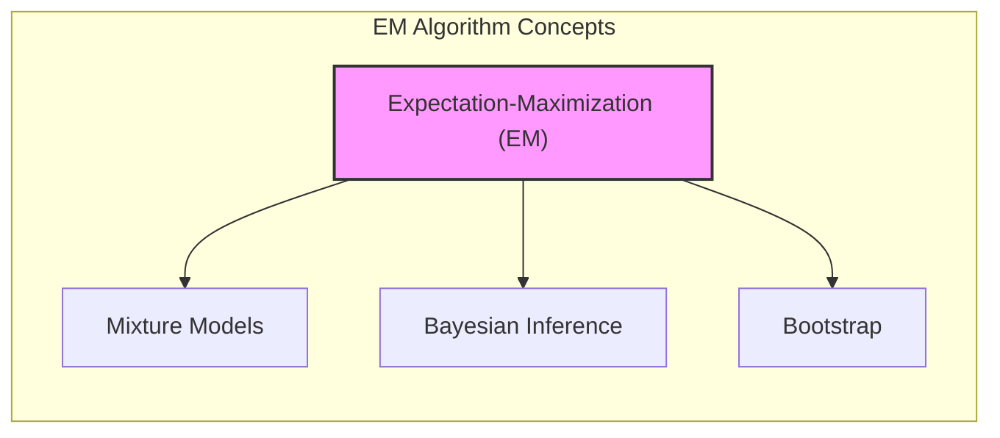
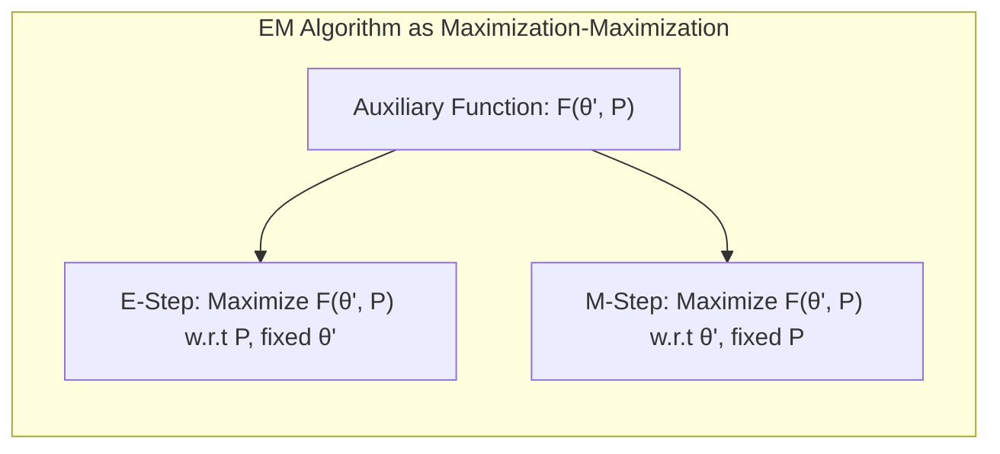
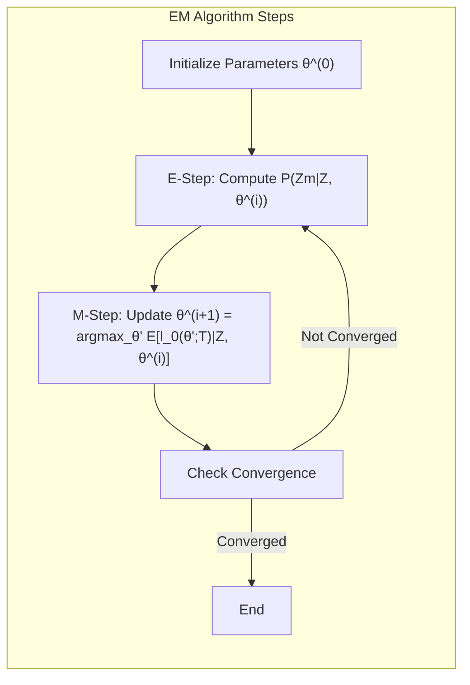
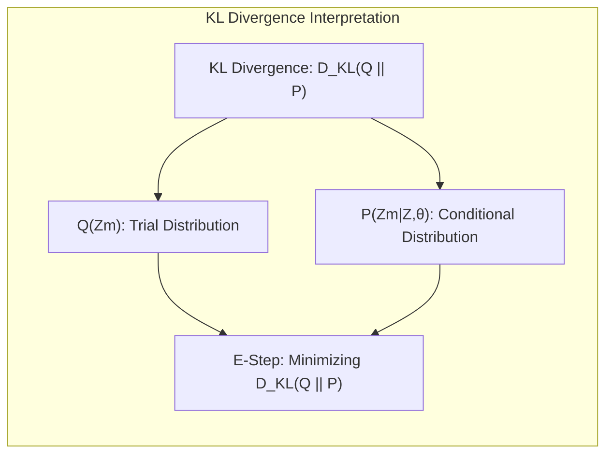

Okay, I will add practical numerical examples to the text, following your guidelines.

## EM como um Procedimento de Maximização-Maximização

### Introdução

Neste capítulo, exploramos diversos métodos de inferência e *model averaging*, com foco especial no algoritmo Expectation-Maximization (EM). O algoritmo EM é uma ferramenta poderosa para simplificar problemas complexos de máxima verossimilhança, especialmente aqueles com variáveis latentes ou dados faltantes [^8.5]. Uma perspectiva fundamental é entender o EM como um procedimento de *maximização-maximização*, que abordaremos nesta seção.

### Conceitos Fundamentais

**Conceito 1: Variáveis Latentes**

Em muitos problemas de modelagem, nos deparamos com dados incompletos ou com a presença de **variáveis latentes**, ou seja, variáveis que não são diretamente observadas. No contexto de modelos de mistura, por exemplo, a qual componente de mistura uma observação pertence é uma variável latente [^8.5.1]. O algoritmo EM é projetado para lidar com tais cenários, iterativamente estimando essas variáveis e os parâmetros do modelo.

> 💡 **Exemplo Numérico:** Imagine que temos dados de alturas de pessoas, mas não sabemos se cada pessoa é do sexo masculino ou feminino. O sexo (masculino/feminino) é uma variável latente. Um modelo de mistura gaussiana poderia assumir que as alturas vêm de duas distribuições gaussianas (uma para homens e outra para mulheres), e o EM poderia ser usado para estimar as médias e desvios padrão de cada distribuição, junto com a probabilidade de cada pessoa ser homem ou mulher (as responsabilidades).

**Lemma 1:**
*Dado um modelo com dados observados $Z$ e dados latentes $Z_m$, a verossimilhança dos dados observados $l(\theta;Z)$ pode ser decomposta em termos da verossimilhança dos dados completos e uma função que depende da distribuição condicional dos dados latentes dados os dados observados.* Essa decomposição é fundamental para entender como o EM itera entre dois passos:
$$l(\theta; Z) = l_o(\theta; T) - l_1(\theta; Z_m|Z)$$,
onde $T = (Z, Z_m)$ representa os dados completos, $l_o$ é a *log-likelihood* dos dados completos e $l_1$ é a *log-likelihood* condicional dos dados latentes.

**Conceito 2: Algoritmo Expectation-Maximization (EM)**

O algoritmo EM é um método iterativo para encontrar estimativas de máxima verossimilhança em modelos com variáveis latentes [^8.5.2]. O algoritmo alterna entre dois passos:

1.  **Expectation Step (E-step):** Calcula a esperança da *log-likelihood* dos dados completos dado os parâmetros atuais, ou seja, $Q(\theta'; \theta^{(i)}) = E[l_o(\theta'; T) | Z, \theta^{(i)}]$ [^8.5.2, 8.43].
2.  **Maximization Step (M-step):** Maximize a função $Q(\theta'; \theta^{(i)})$ com relação a $\theta'$ para obter a próxima estimativa de parâmetros, ou seja, $\theta^{(i+1)} = \text{argmax}_{\theta'} Q(\theta'; \theta^{(i)})$ [^8.5.2].

> 💡 **Exemplo Numérico:** Vamos supor que estamos usando um modelo de mistura gaussiana com duas componentes para modelar dados. No *E-step*, com base em nossos parâmetros atuais (médias e variâncias de cada gaussiana), calculamos a probabilidade de cada ponto de dados pertencer a cada gaussiana. Essas probabilidades são as "responsabilidades". No *M-step*, usamos essas responsabilidades para atualizar as médias e variâncias, ponderando os pontos de dados por sua probabilidade de pertencer a cada componente.

**Corolário 1:**
*O algoritmo EM converge para um ponto estacionário da *log-likelihood* observada, garantindo que a cada iteração o valor da verossimilhança não decresça.* Isto é uma consequência da construção do algoritmo EM que maximiza iterativamente uma função que *minoriza* a verossimilhança observada [^8.5.2].

**Conceito 3: EM como Maximização-Maximização**

Uma perspectiva alternativa do EM é vê-lo como um processo de *maximização-maximização* [^8.5.3]. Nesta visão, o EM não apenas busca otimizar os parâmetros do modelo ($\theta$), mas também a distribuição sobre os dados latentes ($P(Z_m)$). Uma função auxiliar $F(\theta', P)$ é definida, onde:

$$F(\theta', P) = E_P[l_o(\theta'; T)] - E_P[\log P(Z_m)]$$.

O passo E do EM maximiza $F(\theta', P)$ com respeito a $P$, fixando $\theta'$. O passo M maximiza $F(\theta', P)$ com respeito a $\theta'$, fixando $P$. Essa perspectiva oferece uma nova maneira de entender o funcionamento do EM e pode levar a variações do algoritmo [^8.5.3].

> ⚠️ **Nota Importante**: A função $F$ expande o domínio da *log-likelihood*, facilitando sua maximização. A perspectiva de *maximização-maximização* do EM proporciona uma compreensão mais profunda de como o algoritmo opera, ao invés de apenas como uma sequência de passos [^8.5.3].

### EM como um Procedimento de Maximização-Maximização

**Explicação:** Este diagrama ilustra a natureza iterativa do algoritmo EM sob a perspectiva de *maximização-maximização*. Cada etapa maximiza uma parte da função auxiliar $F(\theta', P)$ – o passo E maximiza sobre a distribuição de dados latentes $P$, e o passo M maximiza sobre os parâmetros do modelo $\theta$.

O algoritmo EM pode ser visto como um método de maximização conjunta da função $F(\theta', P)$ sobre $\theta'$ e $P(Z_m)$ [^8.5.3]. O passo E fixa $\theta'$ e maximiza $F$ sobre $P(Z_m)$, levando à distribuição condicional dos dados latentes, $P(Z_m) = Pr(Z_m|Z, \theta')$ [^8.5.3, 8.49]. O passo M, por sua vez, fixa $P(Z_m)$ e maximiza $F$ sobre $\theta'$, equivalente a maximizar $E[l_o(\theta';T) | Z, \theta]$, o que garante o progresso do algoritmo e sua convergência para um máximo local da *log-likelihood* [^8.5.2].

**Lemma 2:**
*A distribuição $P(Z_m)$ que maximiza a função $F(\theta', P)$ para um dado $\theta'$ é dada pela distribuição condicional $Pr(Z_m|Z,\theta')$, obtida pelo passo E do algoritmo EM.*
$$\text{argmax}_{P} F(\theta', P) =  Pr(Z_m|Z, \theta')$$.
**Prova:**
A demonstração utiliza multiplicadores de Lagrange para maximizar a função $F$ sob a restrição de que $P$ é uma distribuição de probabilidade. Após a aplicação dos multiplicadores e a derivação, obtém-se a distribuição condicional, confirmando que o passo E do EM realmente realiza esta maximização. $\blacksquare$

**Corolário 2:**
*Na visão de *maximização-maximização*, a maximização sobre $\theta'$ durante o passo M é equivalente a maximizar a esperança da *log-likelihood* dos dados completos, fixando a distribuição dos dados latentes determinada no passo E anterior.*
$$\text{argmax}_{\theta'} F(\theta', P) =  \text{argmax}_{\theta'} E[l_o(\theta';T) | Z, \theta]$$

> 💡 **Exemplo Numérico:**  Suponha um modelo de mistura com duas gaussianas. No passo E, fixamos os parâmetros atuais (médias $\mu_1, \mu_2$ e variâncias $\sigma_1^2, \sigma_2^2$) e calculamos as probabilidades de cada ponto pertencer a cada gaussiana. Seja $z_i$ a variável latente que indica qual gaussiana gerou o ponto $x_i$.  $P(z_i = 1| x_i, \theta^{(i)})$ é a probabilidade do ponto $x_i$ pertencer à gaussiana 1 (a "responsabilidade"). No passo M, usamos essas responsabilidades para recalcular as médias e variâncias maximizando a esperança da log-verossimilhança. As novas médias seriam  $\mu_1^{(i+1)} = \frac{\sum_i P(z_i=1|x_i,\theta^{(i)}) x_i}{\sum_i P(z_i=1|x_i,\theta^{(i)})}$ e similarmente para a gaussiana 2, com cálculos análogos para as variâncias. Este processo de otimização iterativa da função $F$ garante que a log-verossimilhança dos dados aumente ou permaneça constante.

### Vantagens e Limitações

A perspectiva de *maximização-maximização* oferece uma compreensão mais profunda do algoritmo EM, mostrando como ele interage com dados observados e latentes para otimizar uma função objetivo. Essa interpretação também sugere que o EM não é apenas uma sequência de passos, mas um processo coordenado de otimização conjunta.

> ❗ **Ponto de Atenção**: Apesar de sua utilidade, o algoritmo EM tem algumas limitações. Ele pode convergir para um máximo local e sua convergência pode ser lenta em alguns casos. A escolha correta dos valores iniciais dos parâmetros é crucial para o sucesso do algoritmo. [^8.5.1].

> 💡 **Exemplo Numérico:**  Se usarmos o EM para ajustar um modelo de mistura com três componentes gaussianos, e por azar inicializarmos as médias muito próximas, o algoritmo poderia convergir para um máximo local, onde duas das componentes gaussianas estão "coladas" e não representam bem os dados. Uma boa prática é usar inicialização aleatória múltipla ou métodos de inicialização mais sofisticados como k-means para diminuir este risco.

### Perguntas Teóricas Avançadas

**Pergunta 1:** Qual a relação entre o passo E do EM e a minimização da divergência de Kullback-Leibler (KL) entre a distribuição atual e a distribuição condicional dos dados latentes?

**Resposta:** O passo E do algoritmo EM pode ser interpretado como a minimização da divergência de Kullback-Leibler (KL) entre uma distribuição de tentativa $Q(Z_m)$ e a distribuição condicional dos dados latentes $P(Z_m | Z, \theta)$. Essa distribuição $Q(Z_m)$ é atualizada em cada passo E para se aproximar da distribuição condicional verdadeira. A divergência de KL é dada por:
$$ D_{KL}(Q || P) = \sum_{Z_m} Q(Z_m) \log\left(\frac{Q(Z_m)}{P(Z_m | Z, \theta)}\right) $$
Ao minimizar essa divergência em relação a $Q$, o algoritmo EM garante que a nova distribuição sobre os dados latentes seja o mais próximo possível da distribuição condicional dada a estimativa atual dos parâmetros.

**Pergunta 2:** Como a perspectiva de *maximização-maximização* do EM pode levar a algoritmos de otimização alternativos?

**Resposta:** A perspectiva de *maximização-maximização* sugere que a otimização conjunta sobre os parâmetros e a distribuição latente pode ser realizada por outras abordagens que não alternem entre os passos E e M. Por exemplo, seria possível usar uma técnica de gradiente descendente conjunta, em que os parâmetros e a distribuição latente são atualizados simultaneamente. Além disso, poderíamos usar métodos variacionais para aproximar o passo E, ou usar outras funções auxiliares que não dependem da distribuição condicional dos dados latentes.

**Lemma 3:**
*A maximização de F(θ', P) em relação a P, mantendo θ' fixo, leva à distribuição P que é igual à distribuição condicional dos dados latentes dado os dados observados e os parâmetros atuais.* Esta distribuição condicional é a base para o cálculo das responsabilidades no passo E.

**Prova:**
A prova envolve usar o cálculo variacional, ou multiplicadores de Lagrange para maximizar a função $F$ com respeito a $P$, sujeita a restrições de probabilidade. Isso leva à conclusão de que a distribuição ótima $P$ é a distribuição condicional $Pr(Z_m|Z, \theta')$, o que confirma a ação do passo E no algoritmo EM. $\blacksquare$

### Conclusão

O algoritmo EM é uma ferramenta versátil e poderosa para problemas de máxima verossimilhança com variáveis latentes ou dados faltantes. A perspectiva de *maximização-maximização* oferece um novo olhar sobre o funcionamento interno do algoritmo, revelando uma otimização conjunta de parâmetros e distribuições latentes que garante sua convergência.
