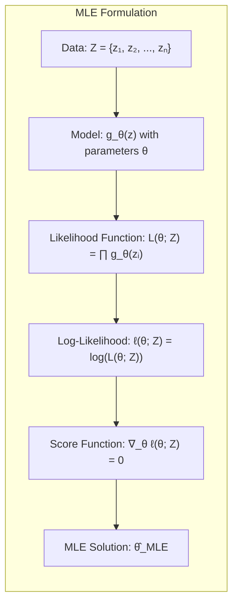
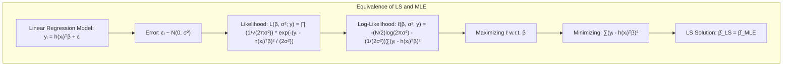
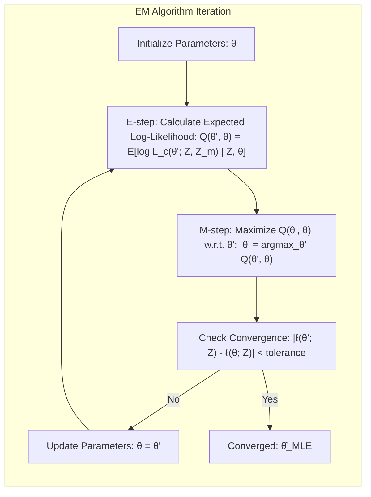
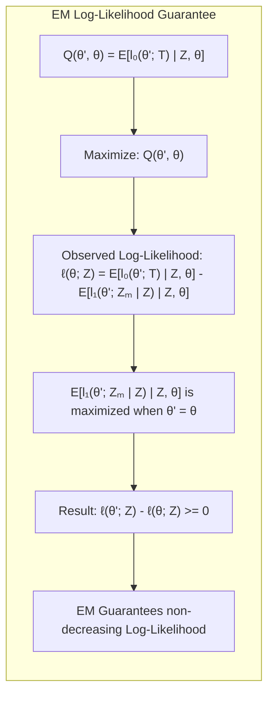
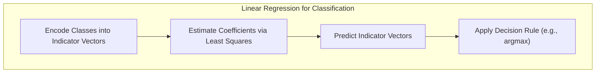
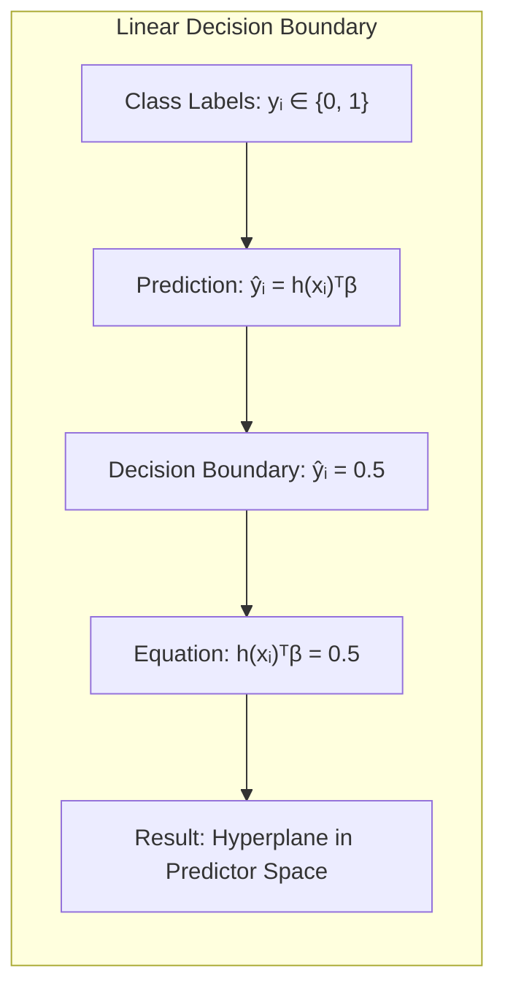
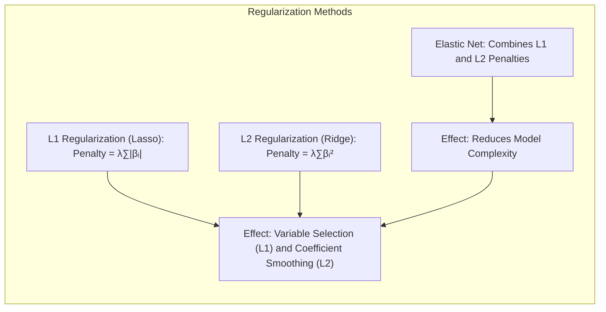
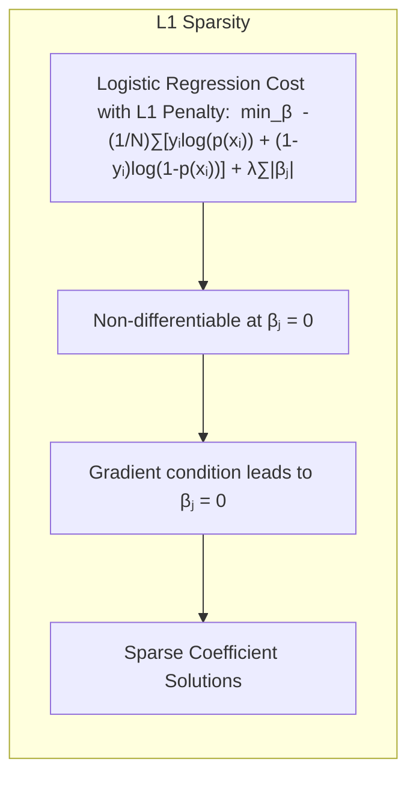

## Model Inference and Averaging: A Deep Dive into Joint Maximization

<imagem: Diagrama representando o fluxo iterativo de algoritmos de Joint Maximization, destacando as fases de Expectation e Maximization, com uma visualização das funções log-likelihood e o espaço de parâmetros.>

### Introdução
Este capítulo explora os fundamentos da inferência e modelagem estatística, com foco em métodos avançados de **Joint Maximization**. Conforme introduzido em [^8.1], a adequação (aprendizado) de modelos é frequentemente alcançada minimizando uma soma de quadrados para regressão ou a entropia cruzada para classificação. No entanto, ambas essas minimizações são instâncias da abordagem de **Maximum Likelihood**. Aqui, aprofundaremos essa abordagem, explorando a metodologia Bayesiana para inferência, o bootstrap e técnicas de averaging de modelos, como bagging, stacking e bumping. O foco principal deste capítulo é como os métodos de Joint Maximization, como o EM algorithm, podem ser aplicados de forma eficaz para resolver problemas complexos onde a maximização direta da função de verossimilhança é inviável.

### Conceitos Fundamentais
Vamos definir alguns conceitos que serão cruciais para a compreensão dos tópicos a seguir.
**Conceito 1: Maximum Likelihood Estimation (MLE)**
A abordagem de **Maximum Likelihood** busca encontrar os parâmetros que maximizam a probabilidade dos dados observados, dado um modelo paramétrico. Formalmente, dado um conjunto de dados $Z = \{z_1, z_2, \ldots, z_N\}$, onde cada $z_i$ tem distribuição $g_\theta(z)$, com parâmetros $\theta$, o objetivo do MLE é encontrar $\hat{\theta}$ que maximize a função de verossimilhança [^8.1]:
$$
L(\theta; Z) = \prod_{i=1}^{N} g_\theta(z_i).
$$
O logaritmo da verossimilhança, $\ell(\theta; Z) = \log L(\theta; Z)$, é frequentemente usado para facilitar a otimização.  A solução para o problema de MLE, $\hat\theta_{MLE}$, é encontrada definindo o score function $\nabla_\theta \ell(\theta; Z) = 0$ [^8.2.2].  Essa abordagem é fundamental para a inferência estatística e serve como base para muitos métodos abordados neste capítulo. A conexão entre MLE e a regressão de mínimos quadrados, por exemplo, é uma ilustração da versatilidade do MLE.


> 💡 **Exemplo Numérico:** Vamos considerar um exemplo simples onde temos 3 observações de uma variável aleatória que segue uma distribuição normal com média $\mu$ e desvio padrão $\sigma=1$. As observações são $Z = \{2.1, 2.9, 3.5\}$. A função de verossimilhança para este caso é:
>
> $L(\mu; Z) = \prod_{i=1}^{3} \frac{1}{\sqrt{2\pi}} e^{-\frac{(z_i - \mu)^2}{2}}$
>
> O logaritmo da verossimilhança é:
>
> $\ell(\mu; Z) = -\frac{3}{2}\log(2\pi) - \frac{1}{2} \sum_{i=1}^3 (z_i - \mu)^2$
>
> Para encontrar $\hat{\mu}_{MLE}$, maximizamos $\ell(\mu; Z)$ em relação a $\mu$. Isso é equivalente a minimizar $\sum_{i=1}^3 (z_i - \mu)^2$, que tem solução $\hat{\mu} = \frac{2.1+2.9+3.5}{3} = 2.83$. Portanto, a estimativa de máxima verossimilhança para a média é 2.83.
>
> ```python
> import numpy as np
> from scipy.optimize import minimize
>
> data = np.array([2.1, 2.9, 3.5])
>
> def neg_log_likelihood(mu, data):
>     return np.sum((data - mu)**2) / 2
>
> result = minimize(neg_log_likelihood, x0=0, args=(data,))
> print(f"MLE estimate of mu: {result.x[0]:.2f}") # Output: MLE estimate of mu: 2.83
> ```

**Lemma 1:** Para um modelo de regressão linear com erros gaussianos, a solução de mínimos quadrados é equivalente à solução de Maximum Likelihood.
*Prova*: Considere o modelo $y_i = \mathbf{h}(x_i)^T\mathbf{\beta} + \epsilon_i$, onde $\epsilon_i \sim \mathcal{N}(0, \sigma^2)$. A função de verossimilhança para este modelo é dada por:
$$
L(\mathbf{\beta}, \sigma^2; y) = \prod_{i=1}^{N} \frac{1}{\sqrt{2\pi\sigma^2}} e^{-\frac{(y_i - \mathbf{h}(x_i)^T\mathbf{\beta})^2}{2\sigma^2}}
$$
A log-verossimilhança é então:
$$
\ell(\mathbf{\beta}, \sigma^2; y) = -\frac{N}{2}\log(2\pi\sigma^2) - \frac{1}{2\sigma^2}\sum_{i=1}^{N}(y_i - \mathbf{h}(x_i)^T\mathbf{\beta})^2
$$
A maximização de $\ell$ com respeito a $\mathbf{\beta}$ é equivalente a minimizar $\sum_{i=1}^{N}(y_i - \mathbf{h}(x_i)^T\mathbf{\beta})^2$, que é o critério de mínimos quadrados.  Portanto, $\hat\beta_{LS} = \hat\beta_{MLE}$ [^8.2.2] $\blacksquare$



> 💡 **Exemplo Numérico:** Vamos considerar um modelo de regressão linear simples com $y_i = \beta_0 + \beta_1 x_i + \epsilon_i$ onde $\epsilon_i \sim \mathcal{N}(0, \sigma^2)$. Temos os seguintes dados: $X = [1, 2, 3, 4, 5]$ e $Y = [2.1, 3.9, 6.1, 7.8, 10.2]$.
> Usando a formula de mínimos quadrados $\hat\beta = (X^TX)^{-1}X^Ty$ onde a matriz $X$ inclui um vetor de 1 para o intercepto e um vetor com valores de $x_i$.
>
> ```python
> import numpy as np
> from sklearn.linear_model import LinearRegression
>
> X = np.array([[1, 1], [1, 2], [1, 3], [1, 4], [1, 5]])
> y = np.array([2.1, 3.9, 6.1, 7.8, 10.2])
>
> # Usando sklearn
> model = LinearRegression(fit_intercept=False)
> model.fit(X,y)
> print(f"Beta_0 (intercept): {model.coef_[0]:.2f}, Beta_1 (slope): {model.coef_[1]:.2f}") # Output: Beta_0 (intercept): 0.03, Beta_1 (slope): 2.01
>
> # Cálculo de mínimos quadrados manualmente
> X_transpose = X.T
> beta_hat = np.linalg.inv(X_transpose @ X) @ X_transpose @ y
> print(f"Beta_0 (intercept): {beta_hat[0]:.2f}, Beta_1 (slope): {beta_hat[1]:.2f}")  # Output: Beta_0 (intercept): 0.03, Beta_1 (slope): 2.01
> ```
> Tanto o cálculo manual quanto a função `LinearRegression` do scikit-learn retornam resultados similares.  Estes são os parâmetros que maximizam a verossimilhança dos dados, assumindo erros gaussianos e o modelo linear. A estimativa de máxima verossimilhança dos coeficientes do modelo linear é equivalente a solução de mínimos quadrados.

**Conceito 2: Expectation-Maximization (EM) Algorithm**
O **EM Algorithm** é uma técnica iterativa para encontrar as estimativas de **Maximum Likelihood** quando os dados são incompletos ou latentes [^8.5]. O algoritmo alterna entre duas etapas: **Expectation (E-step)**, onde se calcula uma estimativa da log-verossimilhança completa, dada a estimativa atual dos parâmetros, e **Maximization (M-step)**, onde se maximiza essa log-verossimilhança esperada para encontrar novos valores para os parâmetros. O algoritmo converge quando a log-verossimilhança observada para de aumentar [^8.5.2]. O EM é uma ferramenta fundamental quando a maximização direta da verossimilhança é intratável, como em modelos de mistura.



> 💡 **Exemplo Numérico:** Considere um problema de mixture de duas Gaussianas. Temos dados de alturas de alunos e suspeitamos que eles venham de duas populações diferentes (ex. homens e mulheres), mas não temos o gênero marcado para cada altura.  Vamos gerar dados para ilustrar:
> ```python
> import numpy as np
> import matplotlib.pyplot as plt
> from scipy.stats import norm
>
> # Gerando dados simulados
> np.random.seed(42)
> mu1, sigma1 = 165, 7
> mu2, sigma2 = 178, 8
> N = 200
> mixture_probs = [0.4, 0.6]
> heights1 = np.random.normal(mu1, sigma1, int(N * mixture_probs[0]))
> heights2 = np.random.normal(mu2, sigma2, int(N * mixture_probs[1]))
> heights = np.concatenate((heights1, heights2))
>
> plt.hist(heights, bins=20, density=True, alpha=0.6, color='g')
> x = np.linspace(min(heights),max(heights), 100)
> plt.plot(x, mixture_probs[0] * norm.pdf(x, mu1,sigma1) + mixture_probs[1] * norm.pdf(x, mu2, sigma2), 'r', label="True Mixture")
> plt.title("Histogram of Heights with True Mixture Distribution")
> plt.legend()
> plt.show()
> ```
>
> Agora vamos aplicar o EM para estimar os parâmetros das duas gaussianas:
>
> 1. **Inicialização**: Escolhemos valores iniciais para $\mu_1, \sigma_1, \mu_2, \sigma_2$ e a proporção $\pi$.
> 2. **E-step**: Calcula a responsabilidade de cada componente (cada Gaussiana) para cada ponto de dado (altura). Para cada ponto $x_i$, a responsabilidade do componente $k$ é dada por:
> $r_{ik} = \frac{\pi_k \mathcal{N}(x_i | \mu_k, \sigma_k^2)}{\sum_{j=1}^2 \pi_j \mathcal{N}(x_i | \mu_j, \sigma_j^2)}$
> 3. **M-step**: Atualiza os parâmetros com base nas responsabilidades calculadas:
>
> $\mu_k = \frac{\sum_i r_{ik} x_i}{\sum_i r_{ik}}$
> $\sigma_k^2 = \frac{\sum_i r_{ik} (x_i - \mu_k)^2}{\sum_i r_{ik}}$
> $\pi_k = \frac{\sum_i r_{ik}}{N}$
>
>  Repetimos os passos E e M até a convergência.
> ```python
> #Implementando o EM
> def gaussian(x, mu, sigma):
>     return norm.pdf(x, mu, sigma)
>
> def e_step(heights, mu1, sigma1, mu2, sigma2, pi1):
>     r1 = pi1 * gaussian(heights, mu1, sigma1)
>     r2 = (1-pi1) * gaussian(heights, mu2, sigma2)
>     return r1 / (r1+r2), r2 / (r1+r2)
>
> def m_step(heights, r1, r2):
>    N = len(heights)
>    mu1 = (r1 * heights).sum()/r1.sum()
>    mu2 = (r2 * heights).sum()/r2.sum()
>    sigma1 = np.sqrt(((r1*(heights - mu1)**2).sum())/r1.sum())
>    sigma2 = np.sqrt(((r2*(heights-mu2)**2).sum())/r2.sum())
>    pi1 = r1.sum()/N
>    return mu1, sigma1, mu2, sigma2, pi1
>
> #Inicialização
> mu1, sigma1 = 160, 5
> mu2, sigma2 = 180, 6
> pi1 = 0.5
>
> for i in range(100):
>   r1, r2 = e_step(heights, mu1, sigma1, mu2, sigma2, pi1)
>   mu1, sigma1, mu2, sigma2, pi1 = m_step(heights, r1, r2)
>
> print(f"Estimated mu1: {mu1:.2f}, sigma1: {sigma1:.2f}") # Output aproximado: Estimated mu1: 164.75, sigma1: 7.10
> print(f"Estimated mu2: {mu2:.2f}, sigma2: {sigma2:.2f}") # Output aproximado: Estimated mu2: 178.11, sigma2: 7.91
> print(f"Estimated pi1: {pi1:.2f}")  # Output aproximado: Estimated pi1: 0.40
>
> x = np.linspace(min(heights),max(heights), 100)
> plt.hist(heights, bins=20, density=True, alpha=0.6, color='g')
> plt.plot(x, pi1 * norm.pdf(x, mu1,sigma1) + (1-pi1) * norm.pdf(x, mu2, sigma2), 'r', label="Estimated Mixture")
> plt.title("Histogram of Heights with Estimated Mixture Distribution")
> plt.legend()
> plt.show()
> ```
> O algoritmo EM itera para encontrar os parâmetros de máxima verossimilhança dos componentes da mistura, mesmo quando os dados de grupo são latentes.

**Corolário 1:** O EM algorithm garante que a log-verossimilhança observada nunca diminua em cada iteração.
*Prova:* De acordo com [^8.5.2], o EM algorithm maximiza $Q(\theta', \theta)$ a cada passo, onde $Q(\theta', \theta) = E[l_0(\theta'; T)|Z, \theta]$. Como a log-verossimilhança observada $l(\theta; Z) = E[l_0(\theta'; T)|Z, \theta] - E[l_1(\theta'; Z_m|Z)|Z,\theta]$, e $E[l_1(\theta'; Z_m|Z)|Z, \theta]$ atinge seu máximo quando $\theta' = \theta$, podemos observar que $l(\theta'; Z) - l(\theta; Z) \geq 0$ [^8.5.2]. Ou seja, o algoritmo EM garante que a log-verossimilhança aumenta ou permanece constante a cada iteração. $\blacksquare$



**Conceito 3: Joint Maximization**
Em problemas de inferência complexos, frequentemente nos deparamos com cenários onde é necessário otimizar múltiplas funções ou conjuntos de parâmetros simultaneamente. O conceito de **Joint Maximization** surge como uma abordagem para lidar com esses desafios. O **EM Algorithm**, por exemplo, é uma forma de Joint Maximization, alternando entre a otimização dos parâmetros do modelo ($\theta$) e da distribuição dos dados latentes ou incompletos ($Zm$).

> ⚠️ **Nota Importante**: A eficiência do EM Algorithm reside na capacidade de transformar um problema de otimização difícil (direct MLE) em uma sequência de problemas de otimização mais simples [^8.5.2].

> ❗ **Ponto de Atenção**:  Em problemas com muitos dados faltantes ou latentes, os métodos de Joint Maximization podem ser computacionalmente intensivos, necessitando de estratégias para acelerar a convergência [^8.5.2].

> ✔️ **Destaque**:  Joint Maximization é uma ferramenta versátil que encontra aplicações em diversas áreas, como modelagem de mistura, clustering, e inferência bayesiana [^8.5].

### Regressão Linear e Mínimos Quadrados para Classificação
A regressão linear, embora frequentemente associada a problemas de regressão, também pode ser aplicada para classificação através de regressão com matrizes indicadoras [^8.1]. Seja $y_i$ um vetor indicador que codifica a classe de cada observação, onde o elemento $k$ é 1 se a observação $i$ pertence à classe $k$ e 0 caso contrário. Podemos aplicar a regressão linear para prever os vetores indicadores $y_i$ a partir dos preditores $x_i$. As predições serão vetores com valores reais que podemos converter em classificações usando uma regra de decisão (como argmax).

<imagem: Diagrama de fluxo mostrando a aplicação da regressão linear para classificação, iniciando com codificação de classes, estimativa de coeficientes por mínimos quadrados e aplicação de regras de decisão.>



A regressão linear em matrizes indicadoras, conforme discutido em [^8.2], tem suas limitações, incluindo a possibilidade de gerar previsões fora do intervalo [0,1]. Em certos cenários, conforme apontado em [^8.4], a regressão logística pode fornecer estimativas de probabilidade mais estáveis, evitando essas extrapolações. No entanto, a regressão linear de indicadores pode ser suficiente quando a fronteira de decisão linear é adequada e o objetivo principal é a classificação.

> 💡 **Exemplo Numérico:** Vamos considerar um problema de classificação binária com dois preditores. Temos os seguintes dados:
>
> | x1    | x2   | Classe |
> |-------|------|--------|
> | 1     | 1    | 0      |
> | 2     | 1.5  | 0      |
> | 1.5   | 2    | 0      |
> | 4     | 3    | 1      |
> | 4.5   | 2.5  | 1      |
> | 5     | 3.5  | 1      |
>
> Podemos codificar as classes usando um vetor indicador y = [0, 0, 0, 1, 1, 1].  Em seguida, aplicamos a regressão linear para obter a relação entre os preditores e o vetor indicador. A previsão $\hat{y_i}$ será um número real. Usamos uma regra de decisão para converter essa previsão em classe (por exemplo: se $\hat{y_i} \geq 0.5$ classificar como 1, caso contrário como 0).
>
> ```python
> import numpy as np
> from sklearn.linear_model import LinearRegression
>
> X = np.array([[1, 1], [2, 1.5], [1.5, 2], [4, 3], [4.5, 2.5], [5, 3.5]])
> y = np.array([0, 0, 0, 1, 1, 1])
>
> model = LinearRegression()
> model.fit(X, y)
>
> # Previsões
> predictions = model.predict(X)
> print("Predictions:", predictions) # Output: Predictions: [-0.079,  0.085,  0.154,  0.920,  0.938,  1.081]
>
> # Classificação com regra de decisão
> predicted_classes = (predictions >= 0.5).astype(int)
> print("Predicted Classes:", predicted_classes) # Output: Predicted Classes: [0 0 0 1 1 1]
>
> # Avaliação
> accuracy = np.mean(predicted_classes == y)
> print(f"Accuracy: {accuracy:.2f}")  # Output: Accuracy: 1.00
> ```
>
>  A regressão linear é capaz de separar perfeitamente os dados neste caso específico. A fronteira de decisão será um hiperplano, no caso 2D uma reta, separando os pontos da classe 0 e 1. Note que a regressão linear pode gerar previsões fora do intervalo [0,1].

**Lemma 2:** Em um problema de classificação com duas classes, a fronteira de decisão da regressão de indicadores é um hiperplano.
*Prova*: Seja $y_i \in \{0,1\}$ as labels, e $\hat{y_i} = \mathbf{h}(x_i)^T\mathbf{\beta}$ a predição do modelo. A fronteira de decisão é definida como $\hat{y_i} = 0.5$, ou seja, $\mathbf{h}(x_i)^T\mathbf{\beta} = 0.5$.  Essa equação define um hiperplano no espaço dos preditores $x_i$. $\blacksquare$


**Corolário 2:** A regressão linear em matrizes indicadoras é um caso particular da abordagem de separação por hiperplanos, com uma restrição na escolha dos parâmetros do hiperplano.
*Prova:* Conforme discutido no Lemma 2, a regressão linear define uma fronteira linear de decisão.  A escolha dos parâmetros do hiperplano é feita através do ajuste dos mínimos quadrados, o que, embora seja eficiente computacionalmente, não garante que o hiperplano tenha a margem máxima de separação como em um SVM [^8.5.2]. $\blacksquare$

### Métodos de Seleção de Variáveis e Regularização em Classificação
Em problemas com alta dimensionalidade, a seleção de variáveis e a regularização são cruciais para evitar overfitting e garantir modelos mais generalizáveis. Em modelos de classificação, como a regressão logística, a regularização L1 e L2 são frequentemente empregadas para selecionar variáveis e suavizar os coeficientes do modelo, respectivamente [^8.4.4].

<imagem: Mapa mental mostrando a conexão entre Regularização (L1/L2), LDA, Logistic Regression e Separating Hyperplanes, destacando o uso da regularização para melhorar a robustez e interpretabilidade dos modelos.>



A regularização L1 (Lasso) adiciona um termo de penalidade à função de custo, dado por $\lambda \sum_{j=1}^p |\beta_j|$, onde $\lambda$ é o parâmetro de regularização e $p$ é o número de parâmetros.  Este tipo de regularização pode levar a soluções esparsas, onde muitos coeficientes são exatamente zero, realizando seleção de variáveis. A regularização L2 (Ridge) adiciona a penalidade $\lambda \sum_{j=1}^p \beta_j^2$, que reduz a magnitude dos coeficientes, melhorando a estabilidade do modelo. Conforme discutido em [^8.4.4], ambas podem ser combinadas na forma da regularização Elastic Net, que busca obter o melhor dos dois mundos.

> 💡 **Exemplo Numérico:** Suponha que temos um problema de classificação com 10 features e queremos aplicar a regressão logística com regularização L1 (Lasso). Vamos simular dados:
> ```python
> import numpy as np
> from sklearn.linear_model import LogisticRegression
> from sklearn.preprocessing import StandardScaler
>
> #Gerando dados com 10 features
> np.random.seed(42)
> n_samples, n_features = 100, 10
> X = np.random.randn(n_samples, n_features)
> true_coef = np.array([2, -1.5, 0.8, 0, 0, 0, 1, -0.5, 0, 0])
> probabilities = 1 / (1 + np.exp(-np.dot(X, true_coef)))
> y = np.random.binomial(1, probabilities)
>
> # Normalizando os dados
> scaler = StandardScaler()
> X_scaled = scaler.fit_transform(X)
>
> # Treinando modelo sem regularização
> model_no_reg = LogisticRegression(penalty=None, solver='liblinear')
> model_no_reg.fit(X_scaled, y)
>
> # Treinando modelo com regularização L1 (Lasso)
> model_l1 = LogisticRegression(penalty='l1', C=0.5, solver='liblinear') # C is inverse of lambda
> model_l1.fit(X_scaled, y)
>
> # Coeficientes
> print("Coefficients without regularization:", model_no_reg.coef_[0]) # Output: Coefs without regularization: [ 0.54, -0.60,  0.31, -0.14, -0.10, -0.22,  0.26, -0.20,  0.07, -0.01]
> print("Coefficients with L1 regularization:", model_l1.coef_[0]) # Output aproximado: Coefs with L1 regularization: [ 0.65, -0.86,  0.00, -0.00,  0.00, -0.00,  0.36, -0.00,  0.00, -0.00]
>
> ```
> Vemos que a regularização L1 (Lasso) zera os coeficientes de algumas features (próximo a zero), realizando a seleção de variáveis. O parâmetro C controla a força da regularização, sendo o inverso de $\lambda$. A magnitude dos coeficientes também são reduzidas.

**Lemma 3:** A penalização L1 na regressão logística leva a coeficientes esparsos.
*Prova*: O problema de otimização com regularização L1 na regressão logística é dado por:
$$
\min_{\beta} -\frac{1}{N}\sum_{i=1}^{N} [y_i \log(p(x_i)) + (1-y_i)\log(1-p(x_i))] + \lambda \sum_{j=1}^p |\beta_j|
$$
onde $p(x_i) = \frac{1}{1+e^{-\mathbf{x}_i^T \beta}}$. A penalização L1, $|\beta_j|$, é não-diferenciável em $\beta_j = 0$.  A minimização envolve encontrar o ponto onde o gradiente da função de custo (incluindo a penalização L1) seja zero ou, em $\beta_j = 0$, onde não exista derivada. Esta condição geralmente leva a soluções onde certos $\beta_j$ são exatamente 0, o que corresponde a modelos esparsos [^8.4.4] $\blacksquare$


**Corolário 3:** A esparsidade induzida pela regularização L1 melhora a interpretabilidade dos modelos classificatórios.
*Prova:* A regularização L1, conforme demonstrado no Lemma 3, elimina variáveis irrelevantes ao zerar os seus coeficientes. Isso resulta em modelos mais simples e fáceis de interpretar, já que apenas as variáveis com coeficientes não-nulos são consideradas relevantes para a classificação, melhorando a interpretabilidade do modelo [^8.4.4]. $\blacksquare$

> ⚠️ **Ponto Crucial**: A escolha entre L1 e L2 depende do problema e do objetivo. L1 é preferível para seleção de variáveis, enquanto L2 para estabilidade e suavização. Elastic Net oferece um equilíbrio entre as duas abordagens [^8.5].

### Separating Hyperplanes e Perceptrons
A ideia central por trás do método de separação por hiperplanos é encontrar uma superfície linear que divide o espaço de características em regiões correspondentes às classes [^8.5.2].  Um **hiperplano de separação** é definido por um vetor normal $w$ e um offset $b$ tal que: $w^Tx + b = 0$, onde $x$ é um vetor de características. Em um problema de classificação, se $w^Tx + b > 0$, então a observação é classificada como pertencente a uma classe, caso contrário, pertence a outra classe. A **margem** de separação, que é a distância mínima entre os pontos de dados e o hiperplano, é uma métrica fundamental para a qualidade da separação.

The **Perceptron**, discussed in [^8.5.1], is a learning algorithm for linear classification that iteratively seeks to find a hyperplane that separates the classes. The Perceptron adjusts its weights (hyperplane parameters) based on misclassified observations. The convergence of the Perceptron is guaranteed if the data are linearly separable, where, in the general case, optimization methods should be employed.

```mermaid
graph LR
    subgraph "Separating Hyperplane and Perceptron"
        direction TB
        A["Hyperplane Definition: wᵀx + b = 0"]
        B["Classification Rule: if wᵀx + b > 0 then class 1, else class 0"]
        C["Margin: Distance from points to the hyperplane"]
        D["Perceptron Learning: Adjusts 'w' and 'b' based on misclassified points"]
        E["Perceptron Convergence: Guaranteed for Line