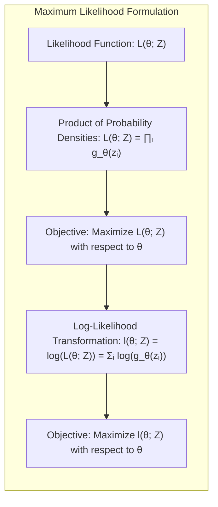
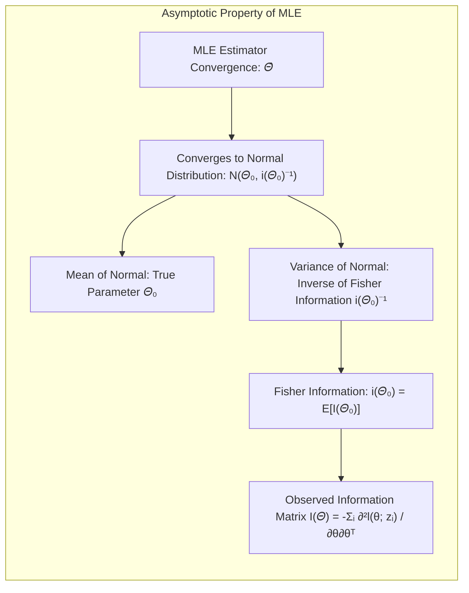
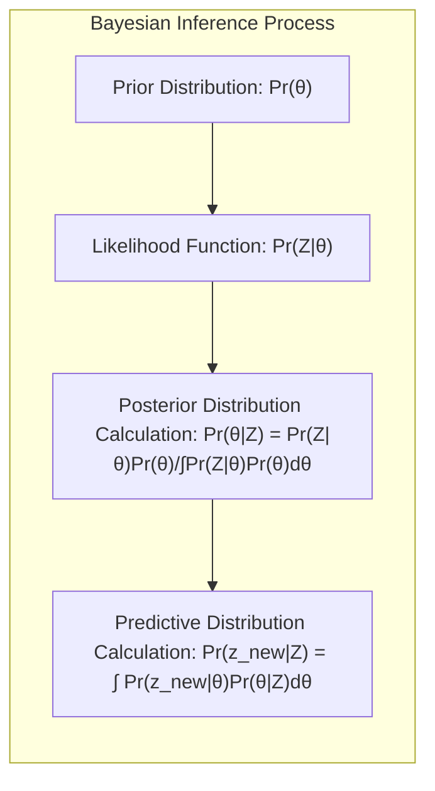
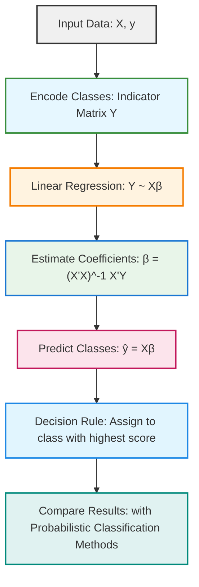
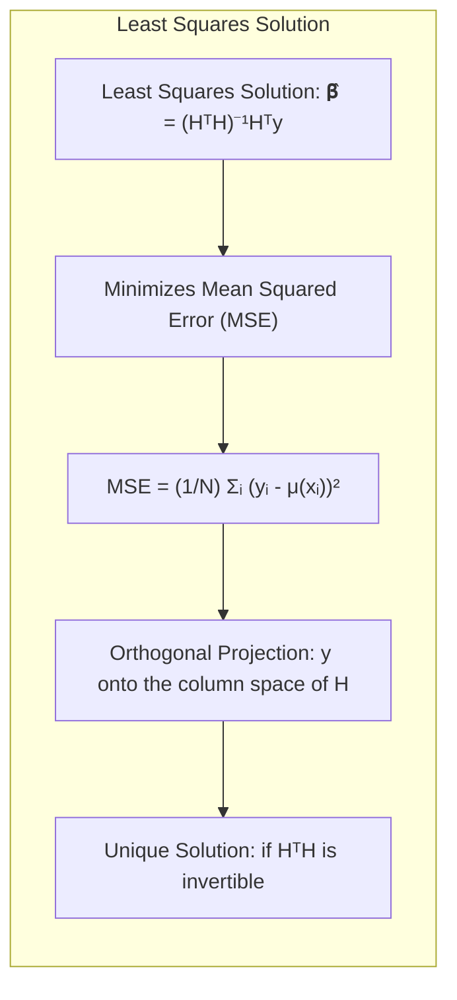
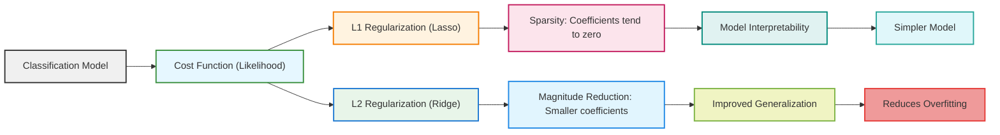
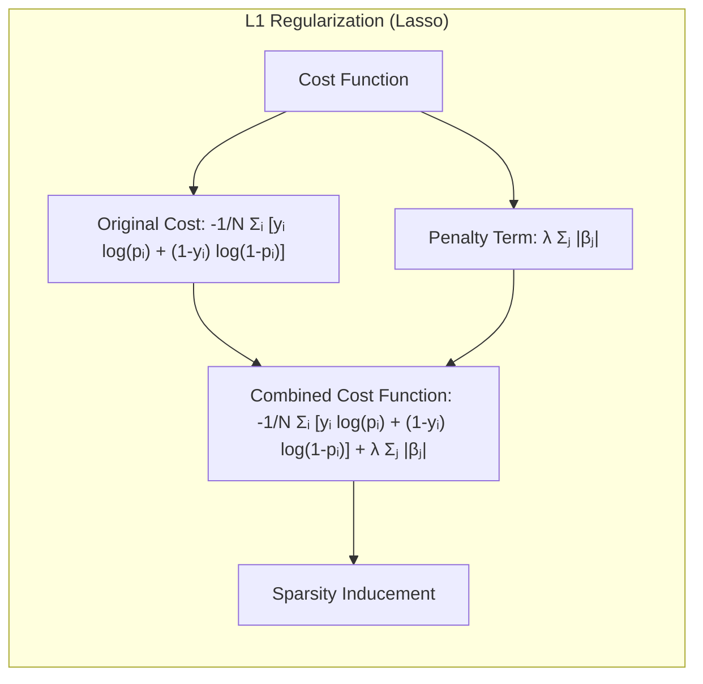
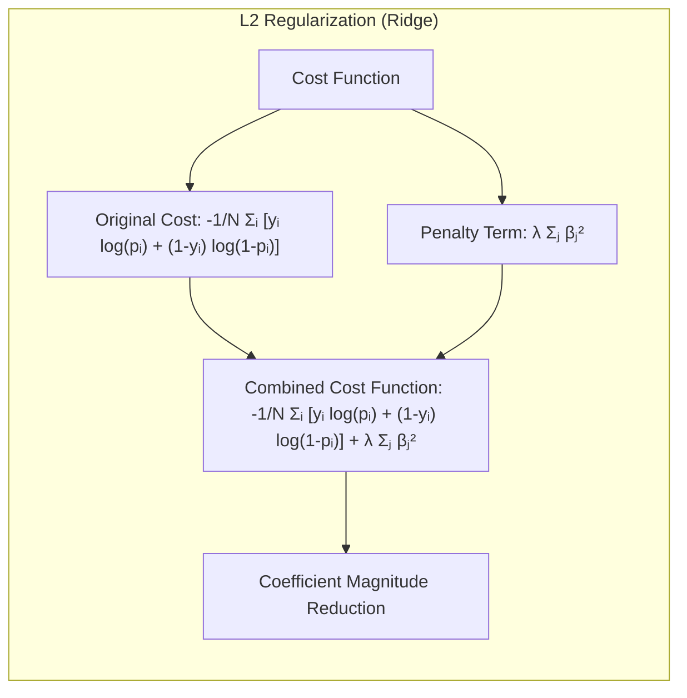

## Maximization over Latent Space
<imagem: Mapa mental que conecta os métodos de inferência (Maximum Likelihood e Bayesian), abordagens de regularização e o uso de modelos com variáveis latentes. As setas direcionais mostram as relações entre esses tópicos, como a utilização do EM algorithm para problemas com variáveis latentes.>

### Introdução
Este capítulo explora métodos de inferência e modelagem que vão além da minimização de erros quadráticos ou entropia cruzada, focando na **abordagem de Maximum Likelihood (ML)** e no método Bayesiano de inferência [^8.1]. Além disso, investigamos técnicas de model averaging e melhoria de modelos, incluindo métodos comitê, bagging, stacking e bumping [^8.1]. Particularmente, a discussão sobre **modelos com variáveis latentes** e a **maximização sobre o espaço latente** (Maximization over Latent Space) através do **EM Algorithm** se destacam como métodos cruciais para problemas complexos de modelagem.

### Conceitos Fundamentais
**Conceito 1:** O conceito fundamental da **abordagem de Maximum Likelihood (ML)** reside na escolha dos parâmetros de um modelo que maximizam a probabilidade dos dados observados [^8.1]. Formalmente, dado um conjunto de dados $Z = \{z_1, z_2, \ldots, z_N\}$, onde cada $z_i$ segue uma distribuição $g_{\theta}(z)$, a função de verossimilhança $L(\theta; Z)$ é definida como o produto das probabilidades dos dados sob os parâmetros $\theta$:


$$
L(\theta; Z) = \prod_{i=1}^{N} g_{\theta}(z_i)
$$
O objetivo é encontrar o valor de $\theta = \hat{\theta}$ que maximiza $L(\theta; Z)$ ou, equivalentemente, o log-verossimilhança $l(\theta; Z) = \log(L(\theta; Z))$ [^8.2.2]:

$$
l(\theta; Z) = \sum_{i=1}^{N} \log g_{\theta}(z_i)
$$
> 💡 **Exemplo Numérico:** Considere um conjunto de dados $Z$ de 3 observações, $z_1 = 2$, $z_2 = 3$, e $z_3 = 4$, que seguem uma distribuição normal com média $\mu$ (o parâmetro $\theta$) e desvio padrão $\sigma = 1$. A função de densidade de probabilidade normal é dada por $g_{\mu}(z_i) = \frac{1}{\sqrt{2\pi}} e^{-\frac{(z_i-\mu)^2}{2}}$. A função de log-verossimilhança para este conjunto de dados é:
>
> $$
> l(\mu; Z) = \sum_{i=1}^{3} \log \left(\frac{1}{\sqrt{2\pi}} e^{-\frac{(z_i-\mu)^2}{2}}\right) = - \frac{3}{2}\log(2\pi) - \frac{1}{2}\sum_{i=1}^{3} (z_i-\mu)^2
> $$
>
> Para encontrar o valor de $\mu$ que maximiza a log-verossimilhança, podemos calcular a derivada em relação a $\mu$, igualar a zero, e resolver para $\mu$. O estimador de máxima verossimilhança para a média de uma distribuição normal é a média amostral. Nesse caso, $\hat{\mu} = \frac{2+3+4}{3} = 3$.
>
> ```python
> import numpy as np
> from scipy.stats import norm
>
> data = np.array([2, 3, 4])
> mu_ml = np.mean(data)
> print(f"Estimativa de Máxima Verossimilhança para mu: {mu_ml}")
>
> # Verificação da verossimilhança para alguns valores
> def likelihood(mu, data):
>     return np.prod(norm.pdf(data, loc=mu, scale=1))
>
> mu_values = np.linspace(1, 5, 100)
> likelihood_values = [likelihood(mu, data) for mu in mu_values]
>
> import matplotlib.pyplot as plt
> plt.plot(mu_values, likelihood_values)
> plt.xlabel("mu")
> plt.ylabel("Verossimilhança")
> plt.title("Verossimilhança em função de mu")
> plt.scatter(mu_ml, likelihood(mu_ml, data), color='red', label=f"Máx em {mu_ml:.2f}")
> plt.legend()
> plt.show()
> ```

**Lemma 1:** Sob condições de regularidade, o estimador de máxima verossimilhança $\hat{\theta}$ converge para a distribuição normal, com média igual ao verdadeiro valor dos parâmetros $\theta_0$ e variância dada pela inversa da matriz de informação de Fisher $i(\theta_0)^{-1}$ [^8.2.2]:


$$
\hat{\theta} \rightarrow N(\theta_0, i(\theta_0)^{-1})
$$
onde $i(\theta_0) = E[I(\theta_0)]$ é a matriz de informação de Fisher [^8.2.2].  A matriz de informação $I(\theta)$ é definida como:

$$
I(\theta) = - \sum_{i=1}^{N} \frac{\partial^2 l(\theta; z_i)}{\partial \theta \partial \theta^T}
$$
Essa convergência garante que, para amostras grandes, podemos ter estimativas de incerteza para os parâmetros utilizando as derivadas da log-verossimilhança [^8.2.2]. $\blacksquare$

> 💡 **Exemplo Numérico:** Continuando o exemplo anterior com dados normais, vamos calcular a matriz de informação de Fisher para estimar a incerteza de $\hat{\mu}$. A log-verossimilhança de uma única observação $z_i$ é:
>
> $$
> l(\mu; z_i) = -\frac{1}{2}\log(2\pi) - \frac{(z_i-\mu)^2}{2}
> $$
>
> A primeira derivada em relação a $\mu$ é:
>
> $$
> \frac{\partial l(\mu; z_i)}{\partial \mu} = (z_i - \mu)
> $$
>
> E a segunda derivada é:
>
> $$
> \frac{\partial^2 l(\mu; z_i)}{\partial \mu^2} = -1
> $$
>
> Portanto, a matriz de informação de Fisher (que, neste caso, é apenas um escalar) é:
>
> $$
> I(\mu) = - \sum_{i=1}^{N} (-1) = N
> $$
>
> Para os nossos 3 dados, $I(\mu) = 3$. A variância do estimador $\hat{\mu}$ é a inversa da informação de Fisher: $\text{Var}(\hat{\mu}) = I(\mu)^{-1} = \frac{1}{3}$.  Isso significa que, à medida que mais dados são observados, a variância da estimativa diminui. Usando o Teorema do Limite Central, sabemos que $\hat{\mu}$ se aproxima de uma distribuição normal com média $\mu_0$ e variância $\frac{1}{3}$, ou seja, $\hat{\mu} \sim N(\mu_0, \frac{1}{3})$.
>
>  ```python
> import numpy as np
>
> data = np.array([2, 3, 4])
> n = len(data)
> fisher_information = n
> variance_mu_hat = 1 / fisher_information
> print(f"Matriz de informação de Fisher: {fisher_information}")
> print(f"Variância do estimador de máxima verossimilhança (mu_hat): {variance_mu_hat}")
> ```

**Conceito 2:** A **Linear Discriminant Analysis (LDA)**, embora não explicitamente abordada no texto, pode ser entendida como um caso específico de maximização de verossimilhança sob a suposição de normalidade das classes [^8.1]. Ao ajustar um modelo linear para discriminar entre classes, estamos implicitamente maximizando a probabilidade dos dados pertencerem às classes corretas [^8.1]. O LDA assume que as classes têm médias diferentes, mas compartilham a mesma matriz de covariância, o que simplifica a inferência e a classificação [^8.1].

**Corolário 1:** No contexto da LDA, a função discriminante linear surge como uma consequência da aplicação do princípio de máxima verossimilhança sob as suposições de distribuição normal das classes. A fronteira de decisão entre classes é definida pelo hiperplano onde as probabilidades a posteriori se igualam [^8.1].

**Conceito 3:** O **método Bayesiano de inferência** [^8.3] contrasta com a abordagem ML ao introduzir uma distribuição a priori para os parâmetros $\theta$, denotada por $Pr(\theta)$. O objetivo é obter a distribuição a posteriori $Pr(\theta|Z)$, que combina a informação dos dados $Z$ com o conhecimento prévio sobre os parâmetros:


$$
Pr(\theta|Z) = \frac{Pr(Z|\theta) \cdot Pr(\theta)}{\int Pr(Z|\theta) \cdot Pr(\theta) d\theta}
$$

A distribuição preditiva Bayesiana $Pr(z_{new}|Z)$ [^8.3] para um novo dado $z_{new}$ é obtida integrando sobre todas as possíveis realizações dos parâmetros $\theta$:
$$
Pr(z_{new}|Z) = \int Pr(z_{new}|\theta) \cdot Pr(\theta|Z) d\theta
$$
Esta abordagem permite expressar a incerteza tanto antes (prior) quanto depois de observar os dados (posterior) [^8.3].
> ⚠️ **Nota Importante**: Diferente do ML, a inferência Bayesiana usa uma distribuição *a priori* para os parâmetros, atualizando-a com os dados para obter a distribuição *a posteriori*.  [^8.3]
> ❗ **Ponto de Atenção**: A distribuição preditiva Bayesiana incorpora a incerteza na estimativa dos parâmetros $\theta$, o que não acontece na abordagem ML.  [^8.3]
> ✔️ **Destaque**: O método Bayesiano oferece uma forma natural de incorporar conhecimento prévio e lidar com incertezas, enquanto o ML busca o melhor ajuste pontual aos dados.  [^8.3]
> 💡 **Exemplo Numérico:** Suponha que queremos estimar a probabilidade de sucesso de um evento (parâmetro $\theta$) usando uma abordagem Bayesiana. Nossa *a priori* para $\theta$ é uma distribuição beta com parâmetros $\alpha = 2$ e $\beta = 5$, o que indica que inicialmente acreditamos que a probabilidade de sucesso é baixa. Após observarmos 3 sucessos em 10 tentativas (dados $Z$), a verossimilhança é uma distribuição binomial. A *a posteriori* também será uma distribuição beta, com parâmetros atualizados.
>
> A *a priori* é $Pr(\theta) = \text{Beta}(\alpha=2, \beta=5)$. A verossimilhança é $Pr(Z|\theta) = \binom{10}{3} \theta^3 (1-\theta)^7$. A *a posteriori* é proporcional a $Pr(Z|\theta) Pr(\theta)$, resultando em uma $\text{Beta}(\alpha + \text{sucessos}, \beta + \text{fracassos}) = \text{Beta}(2 + 3, 5 + 7) = \text{Beta}(5, 12)$.
>
>  ```python
> import numpy as np
> import matplotlib.pyplot as plt
> from scipy.stats import beta
>
> # Prior
> alpha_prior = 2
> beta_prior = 5
>
> # Data
> successes = 3
> failures = 7
>
> # Posterior
> alpha_posterior = alpha_prior + successes
> beta_posterior = beta_prior + failures
>
> # Plotting
> theta_values = np.linspace(0, 1, 100)
> prior_values = beta.pdf(theta_values, alpha_prior, beta_prior)
> posterior_values = beta.pdf(theta_values, alpha_posterior, beta_posterior)
>
> plt.plot(theta_values, prior_values, label='Prior Beta(2, 5)')
> plt.plot(theta_values, posterior_values, label='Posterior Beta(5, 12)')
> plt.xlabel('Probabilidade de Sucesso (theta)')
> plt.ylabel('Densidade')
> plt.title('Prior e Posterior para Probabilidade de Sucesso')
> plt.legend()
> plt.show()
>
> # Media a posteriori
> mean_posterior = alpha_posterior / (alpha_posterior + beta_posterior)
> print(f"Média a posteriori: {mean_posterior:.2f}")
> ```

### Regressão Linear e Mínimos Quadrados para Classificação
<imagem: Diagrama de fluxo detalhado que representa o processo de regressão de indicadores para classificação. O diagrama deve mostrar a codificação das classes, o cálculo dos coeficientes via mínimos quadrados, a aplicação da regra de decisão e a comparação com métodos probabilísticos. Use a linguagem Mermaid se possível.>

A regressão linear, quando aplicada a uma matriz indicadora de classes, pode ser usada para classificação [^8.1]. Codificamos cada classe como uma variável binária (0 ou 1) e aplicamos regressão linear a cada coluna da matriz indicadora, obtendo os coeficientes $\beta$ usando a solução de mínimos quadrados [^8.2]. No entanto, essa abordagem tem limitações: ela não fornece diretamente probabilidades, mas sim valores que podem ser interpretados como “scores” para cada classe. Ao contrário da regressão logística, os valores preditos pela regressão linear podem cair fora do intervalo [0, 1], dificultando sua interpretação como probabilidades [^8.1]. A matriz $H$, com elementos $h_j(x_i)$, é usada para construir o modelo linear que minimiza o erro quadrático:

$$
\hat{\beta} = (H^TH)^{-1}H^T y
$$
onde $y$ é o vetor de respostas. O ajuste do modelo resulta em $\hat{\mu}(x) = \sum_{j=1}^{7} \hat{\beta}_j h_j(x)$, conforme descrito no texto [^8.2].

**Lemma 2:** A solução de mínimos quadrados $\hat{\beta} = (H^TH)^{-1}H^T y$ minimiza o erro quadrático médio [^8.2]:


$$
\text{Erro} = \frac{1}{N} \sum_{i=1}^{N} (y_i - \mu(x_i))^2
$$
Essa solução é uma projeção ortogonal do vetor $y$ no espaço coluna da matriz $H$, e é única se a matriz $H^TH$ for invertível. $\blacksquare$
> 💡 **Exemplo Numérico:** Considere um problema de classificação com 3 classes e 5 amostras. Vamos criar um exemplo simples com uma característica para cada amostra. A matriz de *features* $X$ e a matriz de classes $Y$ codificada usando *one-hot-encoding* são:
>
> $$
> X = \begin{bmatrix} 1 \\ 2 \\ 3 \\ 4 \\ 5 \end{bmatrix}, \quad Y = \begin{bmatrix} 1 & 0 & 0 \\ 0 & 1 & 0 \\ 1 & 0 & 0 \\ 0 & 0 & 1 \\ 0 & 1 & 0 \end{bmatrix}
> $$
>
> Aqui, as colunas de Y representam cada uma das 3 classes. Para usar a regressão linear como classificador, ajustamos um modelo linear a cada coluna de $Y$.  O processo para calcular os coeficientes $\beta$ para cada classe é:
>
> $\text{Step 1: } X^TX = \begin{bmatrix} 1 & 2 & 3 & 4 & 5 \end{bmatrix} \begin{bmatrix} 1 \\ 2 \\ 3 \\ 4 \\ 5 \end{bmatrix} = 55 $
>
> $\text{Step 2: } (X^TX)^{-1} = \frac{1}{55}$
>
> $\text{Step 3: } X^TY = \begin{bmatrix} 1 & 2 & 3 & 4 & 5 \end{bmatrix} \begin{bmatrix} 1 & 0 & 0 \\ 0 & 1 & 0 \\ 1 & 0 & 0 \\ 0 & 0 & 1 \\ 0 & 1 & 0 \end{bmatrix} = \begin{bmatrix} 4 & 3 & 4 \end{bmatrix}$
>
> $\text{Step 4: } \hat{\beta} = (X^TX)^{-1}X^TY = \frac{1}{55} \begin{bmatrix} 4 & 3 & 4 \end{bmatrix} = \begin{bmatrix} 4/55 & 3/55 & 4/55 \end{bmatrix}$
>
> Após calcular os $\beta$ para cada classe, para classificar uma nova amostra $x_{new}$, calculamos $x_{new}\beta$ para cada classe e atribuímos à classe com maior valor.
>
> ```python
> import numpy as np
> from sklearn.linear_model import LinearRegression
>
> # Dados
> X = np.array([[1], [2], [3], [4], [5]])
> Y = np.array([[1, 0, 0],
>               [0, 1, 0],
>               [1, 0, 0],
>               [0, 0, 1],
>               [0, 1, 0]])
>
> # Ajuste do modelo para cada coluna
> model = LinearRegression()
> model.fit(X, Y)
>
> # Predições
> X_new = np.array([[2.5], [3.5]])
> Y_pred = model.predict(X_new)
> print("Coeficientes:", model.coef_)
> print("Interceção:", model.intercept_)
> print("Predições para os novos dados:", Y_pred)
>
> # Classificação baseada nos valores preditos
> predicted_classes = np.argmax(Y_pred, axis=1)
> print("Classes Preditas:", predicted_classes)
> ```

**Corolário 2:** A matriz de covariância dos estimadores $\hat{\beta}$ é dada por $\text{Var}(\hat{\beta}) = (H^TH)^{-1}\hat{\sigma}^2$, onde $\hat{\sigma}^2$ é a estimativa da variância do ruído. Essa variância pode ser usada para calcular intervalos de confiança para as predições e determinar a precisão do modelo [^8.2].

Embora a regressão de indicadores possa produzir resultados razoáveis em algumas situações, seus resultados são mais sensíveis à escala dos dados e podem não ser tão confiáveis quanto modelos probabilísticos como a regressão logística, que é projetada para gerar probabilidades [^8.1]. Em particular, a regressão de indicadores não garante que as probabilidades preditas estejam dentro do intervalo [0,1] [^8.1].

### Métodos de Seleção de Variáveis e Regularização em Classificação
<imagem: Diagrama que ilustra o efeito da regularização (L1 e L2) em modelos de classificação. O diagrama deve mostrar como a penalidade L1 força coeficientes a zero (esparsidade) e a penalidade L2 reduz a magnitude dos coeficientes, melhorando a generalização. Utilize a linguagem Mermaid se possível.>

A seleção de variáveis e a regularização são métodos importantes para lidar com modelos complexos e evitar overfitting em classificação [^8.1]. Técnicas de regularização, como L1 (Lasso) e L2 (Ridge), adicionam termos de penalidade à função de custo original, controlando a magnitude dos coeficientes do modelo [^8.1]. No caso de modelos logísticos, a regularização é introduzida na função de verossimilhança [^8.2.2] . A **regularização L1** (Lasso) é dada por:


$$
\text{Custo} = -\frac{1}{N} \sum_{i=1}^{N} [y_i \log(p_i) + (1-y_i)\log(1-p_i)] + \lambda \sum_{j=1}^{p} |\beta_j|
$$

onde $p_i$ é a probabilidade predita da classe 1 para a observação $i$, $\beta_j$ são os coeficientes do modelo, e $\lambda$ é um parâmetro de regularização [^8.2.2]. A **regularização L2** (Ridge) utiliza o quadrado dos coeficientes:


$$
\text{Custo} = -\frac{1}{N} \sum_{i=1}^{N} [y_i \log(p_i) + (1-y_i)\log(1-p_i)] + \lambda \sum_{j=1}^{p} \beta_j^2
$$
A regularização L1 tende a produzir modelos esparsos, forçando muitos coeficientes a serem exatamente zero, o que facilita a interpretação e a seleção de variáveis [^8.2.2]. A regularização L2, por outro lado, reduz a magnitude dos coeficientes, mas raramente os torna exatamente zero, melhorando a generalização do modelo [^8.2.2].
> 💡 **Exemplo Numérico:** Considere um problema de classificação binária com 10 características e 100 amostras. Vamos simular alguns dados onde a classe é influenciada pelas primeiras 3 características apenas. Vamos comparar a regressão logística com e sem regularização L1 e L2.
>
> ```python
> import numpy as np
> import pandas as pd
> from sklearn.model_selection import train_test_split
> from sklearn.linear_model import LogisticRegression
> from sklearn.metrics import accuracy_score
> from sklearn.preprocessing import StandardScaler
>
> # Gerar dados
> np.random.seed(42)
> n_samples = 100
> n_features = 10
>
> X = np.random.randn(n_samples, n_features)
> true_coefs = np.array([2, -1.5, 1, 0, 0, 0, 0, 0, 0, 0])
> y_probs = 1 / (1 + np.exp(-np.dot(X, true_coefs)))
> y = (y_probs > np.random.rand(n_samples)).astype(int)
>
> # Divisão dos dados
> X_train, X_test, y_train, y_test = train_test_split(X, y, test_size=0.3, random_state=42)
>
> # Padronizar
> scaler = StandardScaler()
> X_train_scaled = scaler.fit_transform(X_train)
> X_test_scaled = scaler.transform(X_test)
>
> # Regressão Logística sem Regularização
> logistic_model = LogisticRegression(penalty=None, solver='lbfgs', max_iter=1000)
> logistic_model.fit(X_train_scaled, y_train)
> y_pred_logistic = logistic_model.predict(X_test_scaled)
> acc_logistic = accuracy_score(y_test, y_pred_logistic)
>
> # Regressão Logística com Regularização L1 (Lasso)
> lasso_model = LogisticRegression(penalty='l1', C=0.5, solver='liblinear', random_state=42)
> lasso_model.fit(X_train_scaled, y_train)
> y_pred_lasso = lasso_model.predict(X_test_scaled)
> acc_lasso = accuracy_score(y_test, y_pred_lasso)
>
> # Regressão Logística com Regularização L2 (Ridge)
> ridge_model = LogisticRegression(penalty='l2', C=0.5, solver='lbfgs', max_iter=1000, random_state=42)
> ridge_model.fit(X_train_scaled, y_train)
> y_pred_ridge = ridge_model.predict(X_test_scaled)
> acc_ridge = accuracy_score(y_test, y_pred_ridge)
>
> # Tabela de Comparação
> results = pd.DataFrame({
>    'Method': ['Logistic (No Reg)', 'Lasso (L1)', 'Ridge (L2)'],
>    'Accuracy': [acc_logistic, acc_lasso, acc_ridge],
>     'Coeficientes': [logistic_model.coef_, lasso_model.coef_, ridge_model.coef_]
> })
> print(results)
>
> ```
>
> Observa-se que o Lasso (L1) zera alguns coeficientes, selecionando as variáveis mais relevantes.

**Lemma 3:** A regularização L1 em classificação logística leva a coeficientes esparsos. A penalidade L1 induz uma solução em que muitos coeficientes são exatamente zero, devido à sua forma não diferenciável na origem [^8.2.2].

**Prova do Lemma 3:** A função objetivo da regressão logística regularizada por L1 é não diferenciável nos pontos onde $\beta_j = 0$.  Portanto, a solução ótima pode ocorrer quando alguns coeficientes são nulos, forçando esparsidade no modelo. $\blacksquare$

**Corolário 3:** A esparsidade induzida pela regularização L1 melhora a interpretabilidade do modelo, pois apenas as variáveis mais relevantes são selecionadas. Isso é útil em situações onde o número de variáveis é grande e a identificação dos preditores mais importantes é crucial [^8.2.2].
> ⚠️ **Ponto Crucial**: A combinação de regularização L1 e L2 (Elastic Net) pode equilibrar o trade-off entre esparsidade e generalização.  [^8.2.2]

### Separating Hyperplanes e Perceptrons
O conceito de **separating hyperplanes** surge ao procurar uma fronteira linear que divide o espaço de entrada em regiões correspondentes às diferentes classes [^8.1]. A ideia de maximizar a margem, ou seja, a distância entre o hiperplano e os pontos mais próximos de cada classe (os *support vectors*), leva à formulação do **Support Vector Machine (SVM)** [^8.1]. O SVM resolve um problema de otimização que envolve a busca de um hiperplano ótimo que maximiza a margem, usando conceitos do dual de Wolfe e multiplicadores de Lagrange [^8.1].
The Perceptron de Rosenblatt, por sua vez, é um algoritmo de aprendizado linear que pode ser visto como um precursor dos métodos de hiperplanos separadores. O Perceptron busca iterativamente um hiperplano que separa as classes, ajustando seus pesos a cada erro de classificação. O algoritmo converge para um hiperplano separador se os dados forem linearmente separáveis [^8.1].
### Pergunta Teórica Avançada: Como o conceito de boosting se relaciona com o princípio de model averaging?
**Resposta:**
O **boosting** é uma técnica que combina múltiplos classificadores fracos para criar um classificador forte, comumente utilizando o conceito de ponderar as amostras de treinamento, conforme mostrado em [^8.7] e também discutido em [^8.8]. Ele não se enquadra estritamente no modelo de "model averaging" (ou média de modelos) discutido em [^8.8], embora ambos compartilhem o objetivo de melhorar a performance preditiva combinando múltiplos modelos [^8.7], [^8.8]. Enquanto o model averaging calcula a média das predições de vários modelos, comumente treinados de forma independente [^8.8], o boosting treina os modelos de maneira sequencial, com cada modelo subsequente focando em exemplos que foram mal classificados pelos modelos anteriores, conforme descrito em [^8.7] e [^8.8]. Embora o resultado final do boosting também possa ser interpretado como uma combinação de modelos, o método de treinamento e a combinação são diferentes do que é feito no model averaging [^8.8]. No entanto, há uma forte relação com model averaging. Ambos buscam combinar a predição de múltiplos modelos, mas o fazem por meios distintos: o primeiro pondera o treinamento, enquanto o segundo pondera os modelos em si [^8.8], [^8.7].
**Lemma 4:** A ideia do boosting é construir uma sequência de classificadores $G_1(x), G_2(x), \ldots, G_T(x)$, cada