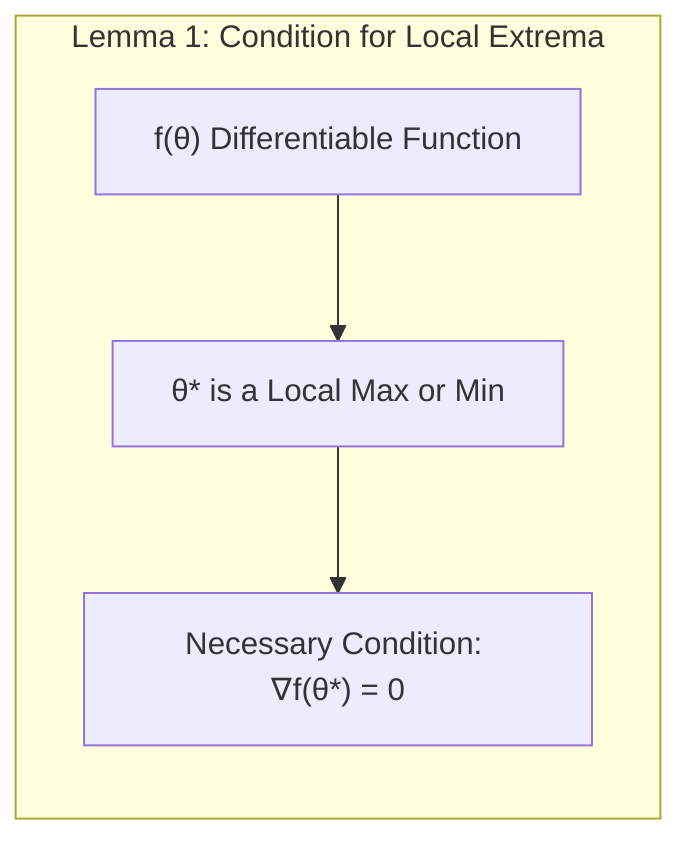
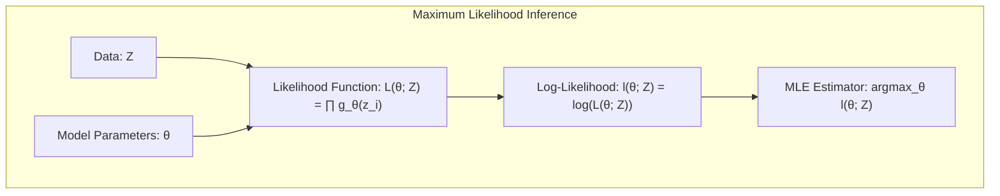
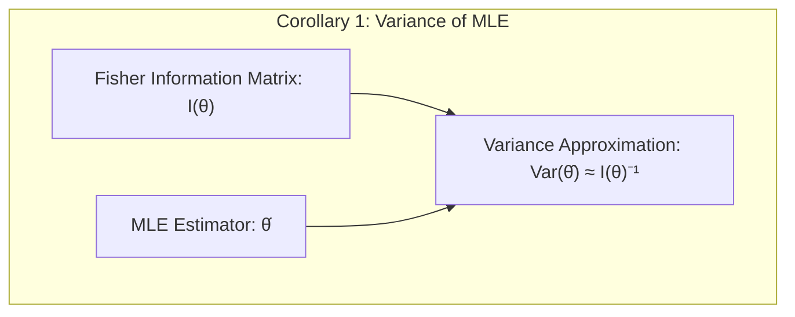
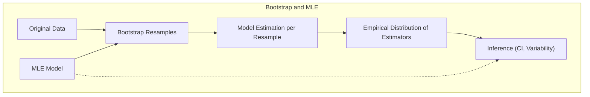
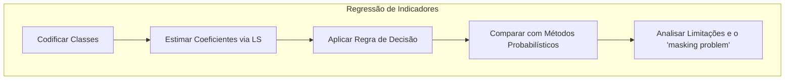
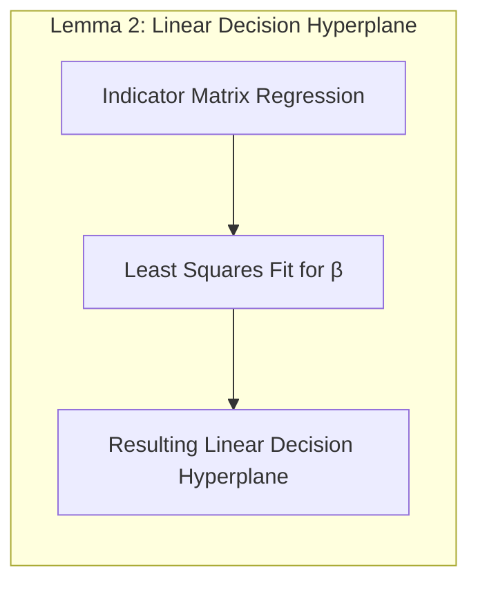
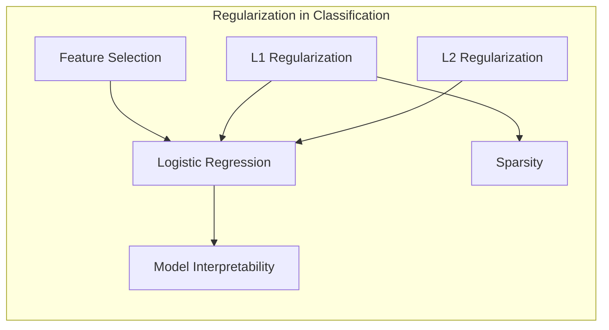
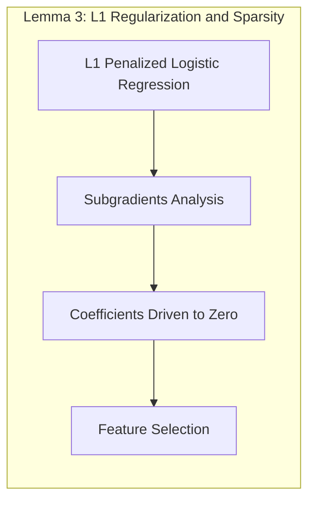
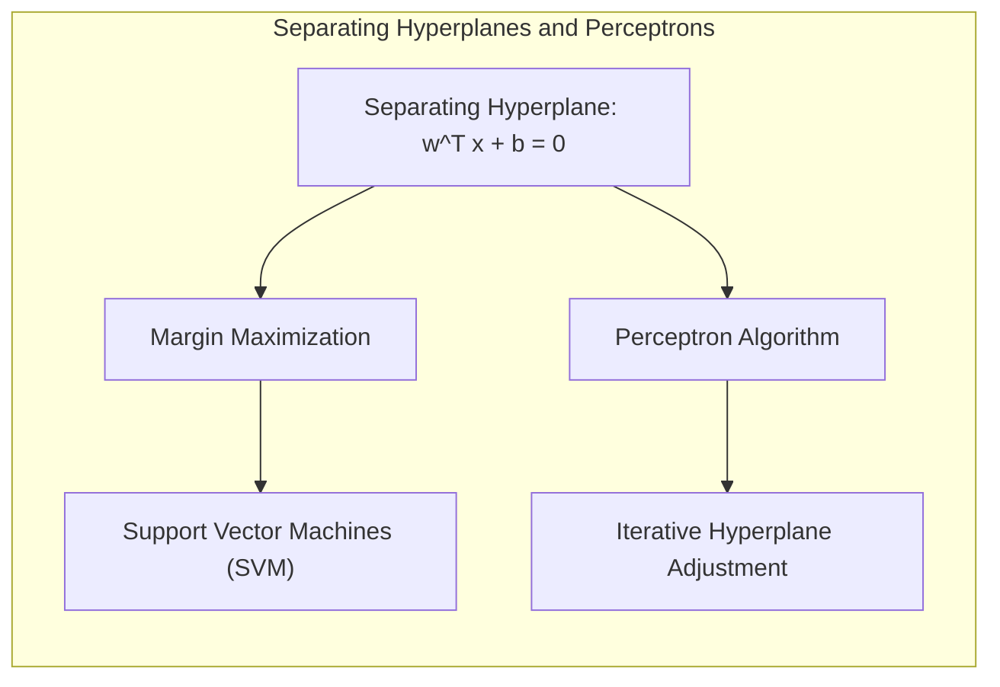
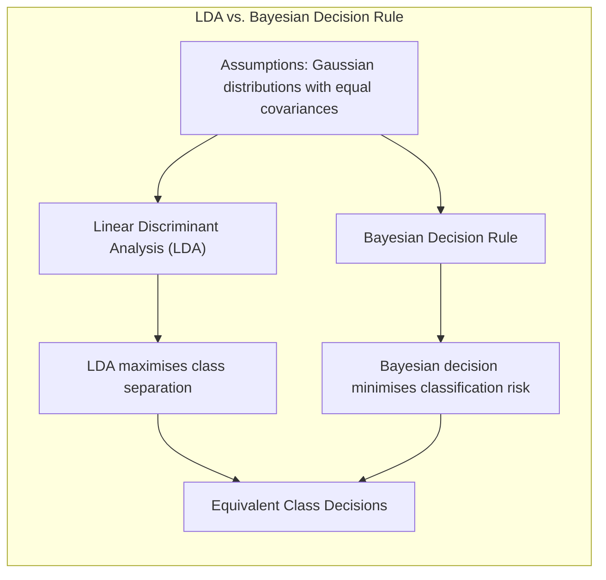

## Maximization over Parameter Space

<imagem: Diagrama complexo que ilustra o espaço de parâmetros, com múltiplos mínimos locais e um máximo global, além de trajetórias de algoritmos de otimização como gradient descent e EM convergindo para diferentes pontos>

### Introdução

A busca pelo modelo ideal, ou seja, aquele que melhor se ajusta aos dados observados, é um desafio fundamental no aprendizado estatístico. Frequentemente, essa busca é formulada como um problema de **maximização sobre o espaço de parâmetros** [^8.1]. Isso significa que desejamos encontrar os valores dos parâmetros de um modelo que tornem os dados observados o mais prováveis possível, dado o modelo. Essa abordagem, conhecida como **Maximum Likelihood Estimation (MLE)**, é a base de muitos métodos estatísticos e de machine learning. Este capítulo explora os conceitos e técnicas relacionados à maximização sobre o espaço de parâmetros, com foco especial nos métodos de **bootstrap, inferência de máxima verossimilhança, métodos bayesianos, o algoritmo EM, MCMC, bagging, stacking e bumping**, buscando conexões entre eles e suas aplicações. O objetivo é fornecer uma compreensão profunda de como esses métodos buscam otimizar os parâmetros de modelos para melhorar a performance e a interpretabilidade.

### Conceitos Fundamentais

Para entender a maximização sobre o espaço de parâmetros, precisamos primeiro definir alguns conceitos cruciais:

**Conceito 1: Espaço de Parâmetros**
O espaço de parâmetros, denotado como $\Theta$, é o conjunto de todos os possíveis valores que os parâmetros do nosso modelo podem assumir. Cada ponto em $\Theta$ representa uma configuração específica do modelo. O objetivo da maximização sobre o espaço de parâmetros é encontrar o ponto em $\Theta$ que melhor se ajusta aos dados [^8.1]. Em regressão linear, por exemplo, o espaço de parâmetros é definido pelos coeficientes de regressão, enquanto em redes neurais, ele é definido pelos pesos e biases. A complexidade e a dimensionalidade do espaço de parâmetros impactam diretamente a dificuldade do problema de otimização, podendo levar a múltiplos mínimos locais. É importante notar que a busca em espaços de parâmetros de alta dimensão exige técnicas de otimização eficientes para encontrar soluções satisfatórias. A relação entre o viés e a variância de um modelo também é afetada pela escolha e ajuste dos parâmetros nesse espaço, sendo necessário um equilíbrio cuidadoso para evitar overfitting ou underfitting.

> 💡 **Exemplo Numérico:** Considere um modelo de regressão linear simples $y = \beta_0 + \beta_1 x$. O espaço de parâmetros $\Theta$ é o plano 2D definido por $(\beta_0, \beta_1)$. Cada par de valores $(\beta_0, \beta_1)$ define uma reta diferente. Encontrar os melhores parâmetros significa buscar, nesse espaço, o ponto $(\beta_0, \beta_1)$ que minimiza o erro quadrático médio nos dados. Imagine que temos os dados:
```python
import numpy as np
import matplotlib.pyplot as plt

x = np.array([1, 2, 3, 4, 5])
y = np.array([2, 4, 5, 4, 5])
```
Um possível espaço de parâmetros seria explorar diferentes combinações de $\beta_0$ e $\beta_1$ para encontrar aquela que melhor se ajusta aos dados.
```python
from sklearn.linear_model import LinearRegression

X = x.reshape(-1, 1)
model = LinearRegression()
model.fit(X, y)
beta_0 = model.intercept_
beta_1 = model.coef_[0]

print(f"Beta_0: {beta_0:.2f}, Beta_1: {beta_1:.2f}")

plt.scatter(x,y, label="Dados Observados")
x_range = np.linspace(min(x),max(x),100)
y_range = beta_0 + beta_1*x_range
plt.plot(x_range, y_range, color = "red", label=f"Reta ajustada: y = {beta_0:.2f} + {beta_1:.2f}x")
plt.xlabel("x")
plt.ylabel("y")
plt.legend()
plt.show()
```
Este gráfico mostra a reta ajustada aos dados, onde os parâmetros $(\beta_0, \beta_1)$ foram encontrados via minimização do erro quadrático médio.

**Lemma 1:** A condição necessária para um ponto $\theta^*$ ser um máximo (ou mínimo) local de uma função diferenciável $f(\theta)$ é que o gradiente de $f$ em $\theta^*$ seja zero, ou seja, $\nabla f(\theta^*) = 0$. A prova desse lemma segue da definição de derivada e de extremos locais de uma função. A análise dos pontos onde o gradiente é zero é essencial para encontrar candidatos a extremos em problemas de otimização, e nesse caso, a máxima verossimilhança. A relação do conceito de **gradient ascent (descendente)** está diretamente ligada à direção de maior crescimento (ou decrescimento) da função em um ponto dado.


**Conceito 2: Inferência de Máxima Verossimilhança (Maximum Likelihood Inference)**
A inferência de máxima verossimilhança é um método para estimar os parâmetros de um modelo probabilístico. A ideia central é escolher os parâmetros que tornam os dados observados *o mais prováveis possíveis*. Matematicamente, isso é expresso através da **função de verossimilhança (likelihood function)**, denotada por $L(\theta; Z)$, onde $\theta$ são os parâmetros do modelo e $Z$ representa os dados observados [^8.2.2]. A função de verossimilhança é dada pelo produto das probabilidades (ou densidades de probabilidade) de cada observação:
$$
L(\theta; Z) = \prod_{i=1}^{N} g_{\theta}(z_i)
$$
onde $g_{\theta}(z_i)$ é a probabilidade (ou densidade) da i-ésima observação $z_i$ dada pelos parâmetros $\theta$. O estimador de máxima verossimilhança é o valor de $\theta$ que maximiza essa função, ou equivalentemente, o logaritmo da função de verossimilhança (log-likelihood), $l(\theta; Z)$. A escolha do logaritmo simplifica a otimização, transformando produtos em somas, o que é computacionalmente mais conveniente.


> 💡 **Exemplo Numérico:** Considere um conjunto de dados $Z = \{2.1, 2.8, 3.5, 3.9, 4.6\}$ que segue uma distribuição normal com média $\mu$ e desvio padrão $\sigma = 1$. A função de verossimilhança é:
$$
L(\mu; Z) = \prod_{i=1}^{5} \frac{1}{\sqrt{2\pi}} e^{-\frac{(z_i - \mu)^2}{2}}
$$
O log-verossimilhança é:
$$
l(\mu; Z) = \sum_{i=1}^{5} \left[ -\frac{1}{2} \ln(2\pi) - \frac{(z_i - \mu)^2}{2} \right]
$$
Para encontrar o estimador de máxima verossimilhança para $\mu$, precisamos maximizar essa função. Tomando a derivada em relação a $\mu$ e igualando a zero, obtemos:
$$
\frac{\partial l}{\partial \mu} = \sum_{i=1}^{5} (z_i - \mu) = 0
$$
Resolvendo para $\mu$, temos:
$$
\hat{\mu} = \frac{1}{5} \sum_{i=1}^{5} z_i = \frac{2.1 + 2.8 + 3.5 + 3.9 + 4.6}{5} = 3.38
$$
Portanto, o estimador de máxima verossimilhança para a média $\mu$ é a média amostral 3.38.

**Corolário 1:** A variância do estimador de máxima verossimilhança (MLE), sob certas condições de regularidade, pode ser aproximada pela inversa da matriz de informação de Fisher, dada por:
$$
Var(\hat{\theta}) \approx I(\theta)^{-1}
$$
onde $I(\theta)$ é a matriz de informação de Fisher. Essa matriz, calculada em torno do estimador de máxima verossimilhança, fornece uma medida da precisão do estimador [^8.2.2].


> 💡 **Exemplo Numérico:** No exemplo anterior, com dados normais e desvio padrão conhecido ($\sigma=1$), a informação de Fisher para a média $\mu$ é dada por $I(\mu) = \frac{n}{\sigma^2} = \frac{5}{1^2} = 5$. A variância do estimador de máxima verossimilhança (a média amostral) é então aproximada por:
$$
Var(\hat{\mu}) \approx I(\mu)^{-1} = \frac{1}{5} = 0.2
$$
A raiz quadrada desta variância, $\sqrt{0.2} \approx 0.447$, é o desvio padrão estimado do estimador $\hat{\mu}$, indicando que a estimativa da média tem uma incerteza de aproximadamente 0.447.

**Conceito 3: Bootstrap e Máxima Verossimilhança**
O método de bootstrap é uma técnica de reamostragem que permite avaliar a incerteza associada às estimativas de parâmetros ou previsões, sem a necessidade de suposições paramétricas fortes [^8.2.1]. Ao gerar múltiplas amostras bootstrap a partir dos dados originais e estimar um modelo para cada uma delas, o bootstrap nos permite criar uma distribuição empírica dos estimadores. Essa distribuição pode então ser usada para construir intervalos de confiança ou avaliar a variabilidade de previsões. O bootstrap está intimamente ligado à máxima verossimilhança porque, em muitos casos, a distribuição bootstrap converge para a distribuição do estimador de máxima verossimilhança. Particularmente, o bootstrap paramétrico, que gera dados com base em um modelo MLE, tem relação com a inferência de máxima verossimilhança [^8.2.2].


> ⚠️ **Nota Importante**: O bootstrap é uma ferramenta valiosa para avaliar a incerteza, especialmente em situações onde as suposições paramétricas são questionáveis, como discutido em [^8.2.1].

> ❗ **Ponto de Atenção**: É crucial entender a diferença entre bootstrap paramétrico e não paramétrico. O primeiro simula novos dados com base no modelo ajustado, enquanto o segundo reamostra diretamente dos dados originais [^8.2.1].

> ✔️ **Destaque**: Em modelos com erros gaussianos aditivos, o bootstrap paramétrico concorda com a estimativa de mínimos quadrados, como indicado em [^8.2.2].

> 💡 **Exemplo Numérico:** Usando o exemplo anterior da regressão linear, podemos aplicar o bootstrap não paramétrico. Geramos, por exemplo, 1000 amostras bootstrap do conjunto de dados original, cada uma com o mesmo número de pontos que o conjunto original, obtidas por amostragem com reposição. Para cada amostra bootstrap, estimamos os coeficientes de regressão $\beta_0$ e $\beta_1$ e calculamos as médias, para observar a variabilidade das estimativas.
```python
import numpy as np
import pandas as pd
from sklearn.utils import resample

x = np.array([1, 2, 3, 4, 5])
y = np.array([2, 4, 5, 4, 5])
data = pd.DataFrame({'x': x, 'y': y})

n_iterations = 1000
beta0_estimates = []
beta1_estimates = []
for _ in range(n_iterations):
    bootstrap_sample = resample(data)
    X_bootstrap = bootstrap_sample['x'].values.reshape(-1, 1)
    y_bootstrap = bootstrap_sample['y'].values
    model_bootstrap = LinearRegression()
    model_bootstrap.fit(X_bootstrap, y_bootstrap)
    beta0_estimates.append(model_bootstrap.intercept_)
    beta1_estimates.append(model_bootstrap.coef_[0])

beta0_estimates_np = np.array(beta0_estimates)
beta1_estimates_np = np.array(beta1_estimates)

print(f"Desvio padrão Bootstrap beta0: {beta0_estimates_np.std():.3f}")
print(f"Desvio padrão Bootstrap beta1: {beta1_estimates_np.std():.3f}")

plt.hist(beta0_estimates, bins = 20, alpha = 0.5, label = "Beta 0")
plt.hist(beta1_estimates, bins = 20, alpha = 0.5, label = "Beta 1")
plt.legend()
plt.xlabel("Valor")
plt.ylabel("Frequência")
plt.show()
```
A distribuição das estimativas de $\beta_0$ e $\beta_1$ permite avaliar a incerteza das estimativas. O desvio padrão das amostras bootstrap nos dá uma ideia da incerteza da estimativa de $\beta_0$ e $\beta_1$.

### Regressão Linear e Mínimos Quadrados para Classificação

<imagem: Diagrama de fluxo mostrando a aplicação da regressão linear a uma matriz de indicadores para problemas de classificação, com passos como codificação das classes, estimação dos coeficientes, aplicação da regra de decisão e avaliação dos resultados, incluindo um destaque das limitações devido ao problema do "masking">


**Explicação:** Este diagrama representa o fluxo do processo de regressão de indicadores e como ele se relaciona à classificação, **conforme descrito nos tópicos [^8.1] e [^8.2]**.

A regressão linear pode ser aplicada a problemas de classificação através da **regressão em matriz de indicadores**. Em vez de prever um valor numérico, como em problemas de regressão tradicional, busca-se prever a classe de um dado input usando uma matriz que codifica as classes como variáveis indicadoras. Se temos $K$ classes, criamos uma matriz $Y$ de dimensões $N \times K$ onde $N$ é o número de observações. Cada linha de $Y$ contém um "1" na coluna correspondente à classe da observação e "0" nas demais. O objetivo é modelar cada coluna de $Y$ usando um modelo linear com os inputs como preditores. Formalmente, para cada observação $i$ e classe $k$:
$$
Y_{ik} = \beta_{0k} + \beta_{1k} x_{i1} + \beta_{2k} x_{i2} + \ldots + \beta_{pk} x_{ip} + \epsilon_{ik}
$$
onde $Y_{ik}$ é o valor da variável indicadora para a i-ésima observação na k-ésima classe, $x_{ij}$ é o valor da j-ésima feature na i-ésima observação, e $\beta_{jk}$ são os coeficientes do modelo.

Após ajustar o modelo de regressão, podemos prever as probabilidades de cada observação pertencer a uma classe. Para a i-ésima observação e a k-ésima classe, a probabilidade prevista é dada por $\hat{Y}_{ik}$. A classe prevista para cada observação será aquela com a maior probabilidade prevista.

No entanto, este método tem limitações. A regressão linear assume que a relação entre as variáveis explicativas e a variável resposta é linear, e que os erros são gaussianos e independentes. Em muitos problemas de classificação, essas suposições não se verificam, o que pode levar a resultados subótimos, como overfitting em classes com muitos outliers ou com o problema do *masking*, onde classes intermediárias podem ser negligenciadas em favor de classes extremas [^8.3].

**Lemma 2:** O ajuste dos coeficientes $\beta$ por mínimos quadrados para o problema da regressão de matriz de indicadores resulta em encontrar um hiperplano de decisão linear em cada classe. A demonstração deste lemma pode ser feita com a derivação das equações normais, que minimizam o erro quadrático médio e mostram que a solução é linear em relação aos dados de entrada, conforme descrito em [^8.2].


**Corolário 2:** Em certas condições, a projeção de um dado ponto sobre os hiperplanos de decisão (resultantes da regressão linear da matriz de indicadores) se relaciona à decisão de classe no problema de classificação, proporcionando uma forma de interpretar e classificar os resultados, baseando-se no Lemma 2.

Apesar das limitações, a regressão linear na matriz de indicadores pode ser uma abordagem útil para problemas de classificação, especialmente quando o principal objetivo é a obtenção de uma fronteira de decisão linear. Em cenários onde as predições de probabilidade são cruciais, métodos como a regressão logística podem ser mais adequados, pois impõem a restrição de que os valores preditos se situem entre 0 e 1 [^8.4].

> 💡 **Exemplo Numérico:** Considere um problema de classificação com três classes (A, B, e C) e duas features ($x_1$ e $x_2$). Temos um conjunto de dados com 6 amostras:
```python
import numpy as np
from sklearn.linear_model import LinearRegression
import matplotlib.pyplot as plt

X = np.array([[1, 2], [1.5, 1.8], [5, 8], [8, 8], [1, 0.6], [9, 1.1]])
Y_classes = np.array(['A', 'A', 'B', 'B', 'C', 'C'])
```
Primeiro, codificamos as classes usando uma matriz de indicadores:
```python
from sklearn.preprocessing import LabelBinarizer
encoder = LabelBinarizer()
Y_encoded = encoder.fit_transform(Y_classes)

print("Matriz de indicadores Y_encoded:")
print(Y_encoded)
```
A matriz resultante é:
```
[[1 0 0]
 [1 0 0]
 [0 1 0]
 [0 1 0]
 [0 0 1]
 [0 0 1]]
```
Agora, ajustamos um modelo de regressão linear para cada coluna de Y_encoded.
```python
models = []
for k in range(Y_encoded.shape[1]):
    model = LinearRegression()
    model.fit(X, Y_encoded[:,k])
    models.append(model)
```
Para um novo ponto, por exemplo, $x_{new} = [6, 5]$, calculamos as probabilidades de cada classe e classificamos:
```python
x_new = np.array([6, 5]).reshape(1, -1)
predicted_probabilities = []
for model in models:
    predicted_probabilities.append(model.predict(x_new)[0])

predicted_probabilities = np.array(predicted_probabilities)
predicted_class_index = np.argmax(predicted_probabilities)
predicted_class = encoder.classes_[predicted_class_index]

print(f"Probabilidades preditas para cada classe: {predicted_probabilities}")
print(f"Classe predita: {predicted_class}")
```
O output mostra as probabilidades preditas para cada classe e a classe predita com a maior probabilidade. O problema do 'masking' poderia ocorrer se, por exemplo, a classe C fosse pouco representada ou mais próxima das classes A ou B no espaço de features, fazendo com que a regressão linear não a reconhecesse adequadamente.

### Métodos de Seleção de Variáveis e Regularização em Classificação

<imagem: Mapa mental que conecta os conceitos de seleção de variáveis, regularização (L1 e L2), suas aplicações em regressão logística e a relação com a interpretabilidade e sparsity de modelos de classificação>


A seleção de variáveis e a regularização são técnicas importantes para melhorar a performance e a interpretabilidade de modelos de classificação, especialmente em situações com um grande número de features [^8.5]. A seleção de variáveis visa identificar e reter apenas as variáveis mais relevantes, enquanto a regularização impõe penalidades aos coeficientes do modelo para evitar overfitting e promover a sparsity.

Na classificação, especialmente em modelos como a regressão logística, a regularização é implementada através da adição de termos de penalização à função de log-verossimilhança [^8.4.4]. Por exemplo, a regularização $L_1$ adiciona uma penalidade proporcional ao valor absoluto dos coeficientes:
$$
l(\theta;Z) - \lambda \sum_{j=1}^{p} |\beta_j|
$$
onde $\lambda$ é um parâmetro de regularização que controla a força da penalidade, e $\beta_j$ são os coeficientes do modelo. Esta penalização tende a "zerar" alguns coeficientes, promovendo a sparsity, o que facilita a interpretação do modelo. Por outro lado, a regularização $L_2$ adiciona uma penalidade proporcional ao quadrado dos coeficientes:
$$
l(\theta;Z) - \lambda \sum_{j=1}^{p} \beta_j^2
$$
A penalização $L_2$ reduz o valor dos coeficientes, evitando overfitting, sem necessariamente zerá-los [^8.5]. Ambas as regularizações são muito utilizadas em cenários de alta dimensionalidade. É importante ressaltar que, muitas vezes, a combinação das penalizações L1 e L2 (Elastic Net) pode proporcionar um bom compromisso entre sparsity e performance, como apontado em [^8.5]. A escolha adequada do parâmetro de regularização, muitas vezes, é feita usando métodos de validação cruzada, de modo a otimizar o ajuste do modelo.

**Lemma 3:** Em modelos lineares como a regressão logística, a penalização L1 pode induzir sparsity nos coeficientes, demonstrando que em busca por soluções ótimas, um certo número de parâmetros são levados a zero, removendo features menos relevantes. Esta demostração pode ser feita a partir da análise das subgradientes da função objetivo modificada, incorporando o termo de penalização L1 e sua influência sobre o otimizador, conforme descrito em [^8.4.4].


**Prova do Lemma 3:** A função objetivo da regressão logística regularizada com L1 é:
$$
J(\beta) = -l(\beta) + \lambda \sum_{j=1}^{p} |\beta_j|
$$
onde $l(\beta)$ é a log-verossimilhança. O termo de penalização L1 $\lambda \sum_{j=1}^{p} |\beta_j|$ introduz uma não diferenciabilidade na função objetivo nos pontos em que $\beta_j=0$. Para encontrar o mínimo desta função, precisamos utilizar o conceito de subgradiente. A subgradiente do termo de penalização $|\beta_j|$ é igual a -1 se $\beta_j < 0$, 1 se $\beta_j > 0$, e um valor entre -1 e 1 se $\beta_j=0$. Portanto, para que o vetor de parâmetros minimize a função objetivo, o subgradiente da função objetivo deve conter o vetor zero. Isso faz com que um subconjunto dos coeficientes $\beta_j$ seja levado a zero, promovendo a sparsity. $\blacksquare$

**Corolário 3:** A propriedade de sparsity induzida pela regularização L1 resulta em modelos mais interpretáveis, pois apenas as variáveis mais relevantes para a classificação possuem coeficientes não nulos, como visto em [^8.4.4] e [^8.4.5].

> ⚠️ **Ponto Crucial**: A combinação das penalidades L1 e L2 (Elastic Net) permite explorar vantagens de ambas as abordagens, conforme discutido em [^8.5].

> 💡 **Exemplo Numérico:**  Vamos aplicar a regularização L1 e L2 em um problema de classificação com regressão logística. Usaremos o mesmo dataset da seção anterior mas adicionaremos algumas features irrelevantes.
```python
import numpy as np
from sklearn.linear_model import LogisticRegression
from sklearn.preprocessing import LabelBinarizer
import matplotlib.pyplot as plt
import pandas as pd


X = np.array([[1, 2, 0.1, 0.2], [1.5, 1.8, 0.2, 0.3], [5, 8, 0.3, 0.1], [8, 8, 0.4, 0.5], [1, 0.6, 0.5, 0.1], [9, 1.1, 0.6, 0.2]])
Y_classes = np.array(['A', 'A', 'B', 'B', 'C', 'C'])
```
Criamos um dataframe para visualização:
```python
df = pd.DataFrame(X, columns=['x1', 'x2', 'x3', 'x4'])
df['class'] = Y_classes
print(df)
```
Vamos treinar modelos com L1 e L2:
```python
encoder = LabelBinarizer()
Y_encoded = encoder.fit_transform(Y_classes)

model_l1 = LogisticRegression(penalty='l1', solver='liblinear', C=1)
model_l1.fit(X, Y_encoded)

model_l2 = LogisticRegression(penalty='l2', C=1)
model_l2.fit(X, Y_encoded)
```
Aqui C é o inverso da lambda de regularização. A inspeção dos coeficientes nos dá:
```python
print("Coeficientes L1:")
print(model_l1.coef_)
print("Coeficientes L2:")
print(model_l2.coef_)
```
A regularização L1 tende a gerar coeficientes nulos, indicando features irrelevantes (nesse caso, x3 e x4), enquanto a L2 reduz os valores de todos os coeficientes. Podemos observar que os coeficientes das features x3 e x4 foram reduzidos a 0 com a regularização L1, indicando que essas features foram consideradas irrelevantes para a classificação. A regularização L2 reduziu os valores de todos os coeficientes.

### Separating Hyperplanes e Perceptrons

<imagem: Diagrama ilustrando o conceito de hiperplanos separadores, com diferentes margens de separação entre as classes, mostrando como a otimização da margem leva à definição de hiperplanos ótimos, e um exemplo da operação do perceptron para ajuste do hiperplano>


A ideia central por trás dos **separating hyperplanes** é encontrar um hiperplano que divida o espaço de features de forma a separar as diferentes classes de forma ótima. A ideia de **maximizar a margem** de separação (a distância entre o hiperplano e os pontos mais próximos de cada classe, os chamados vetores de suporte) leva à formulação de um problema de otimização que pode ser resolvido usando programação quadrática [^8.5.2]. Formalmente, um hiperplano de separação pode ser definido como:

$$
w^T x + b = 0
$$

onde $w$ é o vetor normal ao hiperplano, $x$ é um vetor de features, e $b$ é o bias. O objetivo é encontrar $w$ e $b$ tais que todos os pontos de uma classe estejam de um lado do hiperplano e todos os pontos de outra classe estejam do outro lado, com a maior margem possível. Essa formulação leva ao conceito de **máquina de vetores de suporte (SVM)**, que é capaz de encontrar hiperplanos ótimos, mesmo em casos onde os dados não são linearmente separáveis. A solução do problema de otimização do SVM geralmente é encontrada no dual de Wolfe, que é matematicamente mais fácil de tratar.

O **Perceptron** de Rosenblatt é um algoritmo de aprendizado supervisionado que busca encontrar um hiperplano que separa linearmente duas classes [^8.5.1]. O perceptron é um algoritmo iterativo que começa com um hiperplano aleatório e o ajusta iterativamente, de acordo com os erros de classificação. Se um ponto é classificado erroneamente, o hiperplano é ajustado na direção desse ponto para tentar classificá-lo corretamente. Formalmente, a atualização dos pesos em uma iteração *t+1* pode ser expressa como:

$$
w^{t+1} = w^{t} + \eta y_i x_i
$$
onde $\eta$ é a taxa de aprendizagem e $y_i$ é o rótulo da i-ésima amostra (-1 ou 1). Sob certas condições, o perceptron converge para um hiperplano que separa linearmente as classes. No entanto, é importante notar que o perceptron não garante encontrar o hiperplano com maior margem.

> 💡 **Exemplo Numérico:** Consideremos um problema de classificação binária com duas features. Inicializamos os pesos ($w$) e bias ($b$) aleatoriamente:
```python
import numpy as np
import matplotlib.pyplot as plt
from sklearn.linear_model import Perceptron

X = np.array([[1, 2], [2, 1], [3, 3], [5, 2], [6, 3], [7, 1]])
y = np.array([-1, -1, -1, 1, 1, 1])
```
Aplicamos o perceptron:
```python
perceptron = Perceptron(max_iter=1000, tol=1e-3, eta0=0.1)
perceptron.fit(X, y)
w = perceptron.coef_[0]
b = perceptron.intercept_[0]

print(f"Vetor normal ao hiperplano: w = {w}")
print(f"Bias: b = {b}")

x_min, x_max = X[:, 0].min() - 1, X[:, 0].max() + 1
y_min, y_max = X[:, 1].min() - 1, X[:, 1].max() + 1

xx, yy = np.meshgrid(np.arange(x_min, x_max, 0.02),
                     np.arange(y_min, y_max, 0.02))
Z = perceptron.predict(np.c_[xx.ravel(), yy.ravel()])
Z = Z.reshape(xx.shape)
plt.contourf(xx, yy, Z, cmap=plt.cm.RdBu, alpha=0.8)
plt.scatter(X[:, 0], X[:, 1], c=y, cmap=plt.cm.RdBu, edgecolors='k')
plt.xlabel("Feature 1")
plt.ylabel("Feature 2")
plt.title("Fronteira de decisão do Perceptron")
plt.show()
```
Após a convergência do Perceptron, o output exibe o vetor normal ao hiperplano w e o bias b, determinando o hiperplano separador encontrado. O gráfico mostra a fronteira de decisão entre as duas classes.

### Pergunta Teórica Avançada: Quais as diferenças fundamentais entre a formulação de LDA e a Regra de Decisão Bayesiana considerando distribuições Gaussianas com covariâncias iguais?

**Resposta:**

A **Linear Discriminant Analysis (LDA)** e a **regra de decisão Bayesiana** são métodos de classificação que, sob a suposição de distribuições Gaussianas com covariâncias iguais, tornam-se equivalentes em muitos cenários. Em outras palavras, a decisão de classe resultante da aplicação de ambas as abordagens é a mesma. A LDA estima parâmetros que maximizam a separação entre classes, enquanto a regra de decisão Bayesiana minimiza o risco de classificação errada.


A LDA assume que os dados de cada classe são gerados por uma distribuição normal multivariada com médias diferentes ($\mu_k$ para a classe k) mas com a mesma matriz de covariância $\Sigma$, ou seja, $X | Y=k \sim N(\mu