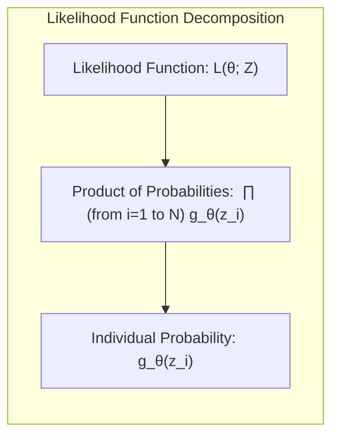
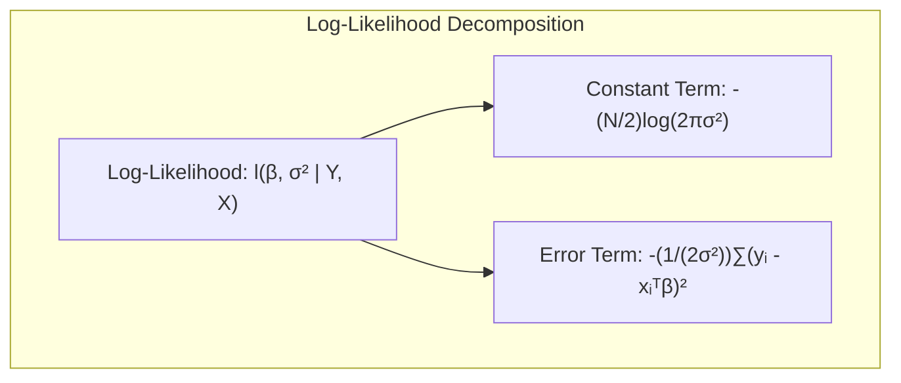
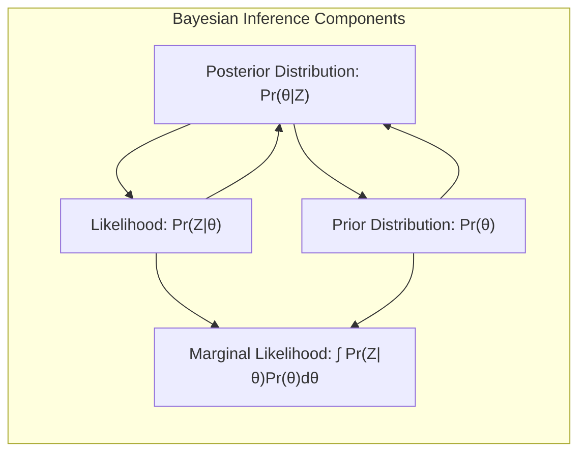
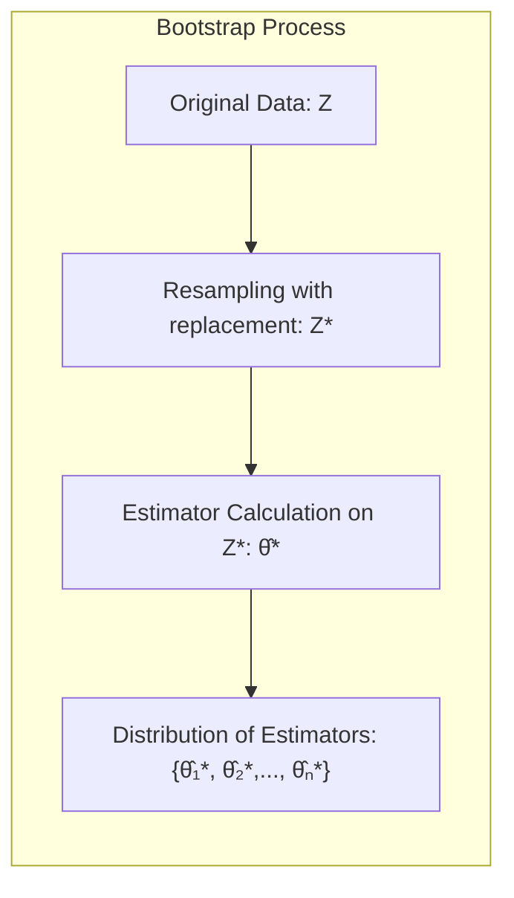
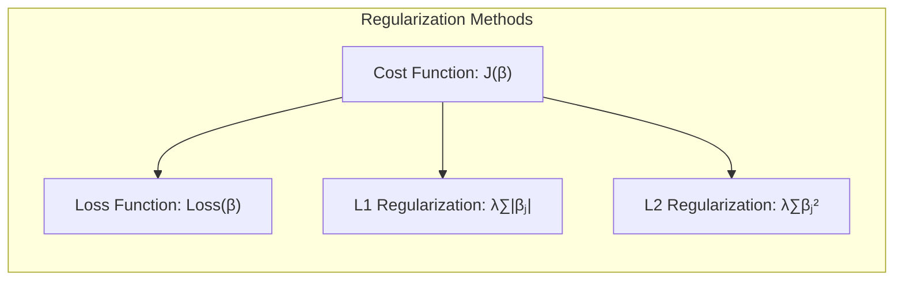

## Model Inference and Averaging: Alternative Maximization Procedures
<imagem: Um mapa mental complexo que conecta o EM Algorithm com métodos de sampling como o Gibbs Sampling, mostrando como diferentes abordagens de maximização e inferência se relacionam com o modelo de mistura Gaussiana.>

### Introdução
Neste capítulo, exploramos métodos de inferência e modelagem, focando em abordagens de *maximum likelihood* e Bayesianas, bem como em técnicas de *model averaging* e aprimoramento. A maioria dos modelos apresentados neste livro foram ajustados por meio da minimização de soma de quadrados para regressão ou da minimização de entropia cruzada para classificação [^8.1]. Essas abordagens são instâncias do método de *maximum likelihood*. Aqui, apresentamos uma exposição geral do *maximum likelihood*, do método Bayesiano e do *bootstrap* [^8.1]. Além disso, exploramos técnicas relacionadas para a média e o aprimoramento de modelos, como métodos de comitê, *bagging*, *stacking* e *bumping* [^8.1]. Este capítulo visa aprofundar o conhecimento em métodos avançados de inferência, permitindo uma compreensão mais ampla e detalhada sobre diferentes estratégias de otimização e modelagem.

### Conceitos Fundamentais
**Conceito 1: Maximum Likelihood**
O método de **Maximum Likelihood** (ML) busca encontrar os parâmetros de um modelo que maximizam a probabilidade dos dados observados. Formalmente, dado um conjunto de dados $Z = \{z_1, z_2, \ldots, z_N\}$ e um modelo paramétrico $g_\theta(z)$ definido por um conjunto de parâmetros $\theta$, a função de verossimilhança $L(\theta; Z)$ é dada por:

$$L(\theta; Z) = \prod_{i=1}^{N} g_\theta(z_i)$$ [^8.2.2]



O objetivo é encontrar o valor de $\theta$ que maximiza essa função de verossimilhança, ou equivalentemente, sua log-verossimilhança $l(\theta; Z) = \sum_{i=1}^{N} \log g_\theta(z_i)$ [^8.2.2]. O estimador de máxima verossimilhança é, portanto, dado por:

$$\hat{\theta}_{ML} = \arg \max_\theta l(\theta; Z)$$

No contexto da regressão linear com erros Gaussianos, a estimativa por mínimos quadrados é equivalente à estimativa de máxima verossimilhança [^8.2.2]. Para dados com distribuição normal com média $\mu$ e variância $\sigma^2$, a função de verossimilhança é dada por:

$$ g_{\theta}(z) = \frac{1}{\sqrt{2\pi\sigma^2}}e^{-\frac{(z-\mu)^2}{2\sigma^2}} $$

A técnica de *Maximum Likelihood* é um método fundamental na inferência estatística e, apesar de amplamente utilizada, possui certas limitações. Em particular, ela não considera incertezas *a priori* nos parâmetros, e suas estimativas pontuais podem ser sensíveis a *outliers* [^8.2.2].

> 💡 **Exemplo Numérico:**
> Vamos considerar um exemplo simples com dados Gaussianos. Suponha que temos 5 observações: $Z = \{2.1, 2.8, 3.5, 3.2, 2.4\}$. Assumindo que esses dados seguem uma distribuição normal com média $\mu$ e variância $\sigma^2$, vamos estimar esses parâmetros usando *Maximum Likelihood*.
> A função de log-verossimilhança é:
> $$l(\mu, \sigma^2; Z) = \sum_{i=1}^{5} \log \left(\frac{1}{\sqrt{2\pi\sigma^2}}e^{-\frac{(z_i-\mu)^2}{2\sigma^2}}\right)$$
> Simplificando:
> $$l(\mu, \sigma^2; Z) = -\frac{5}{2} \log(2\pi\sigma^2) - \frac{1}{2\sigma^2} \sum_{i=1}^{5} (z_i - \mu)^2$$
> Para encontrar $\hat{\mu}_{ML}$, calculamos a média amostral:
> $$\hat{\mu}_{ML} = \frac{1}{5} \sum_{i=1}^{5} z_i = \frac{2.1 + 2.8 + 3.5 + 3.2 + 2.4}{5} = 2.8$$
> Para encontrar $\hat{\sigma}^2_{ML}$, usamos:
> $$\hat{\sigma}^2_{ML} = \frac{1}{5} \sum_{i=1}^{5} (z_i - \hat{\mu}_{ML})^2$$
> $$\hat{\sigma}^2_{ML} = \frac{(2.1-2.8)^2 + (2.8-2.8)^2 + (3.5-2.8)^2 + (3.2-2.8)^2 + (2.4-2.8)^2}{5}$$
> $$\hat{\sigma}^2_{ML} = \frac{0.49 + 0 + 0.49 + 0.16 + 0.16}{5} = 0.26$$
> Portanto, as estimativas de máxima verossimilhança são $\hat{\mu}_{ML} = 2.8$ e $\hat{\sigma}^2_{ML} = 0.26$. Note que esta é uma estimativa pontual e não expressa a incerteza nos parâmetros.

**Lemma 1:**
A solução de mínimos quadrados para um modelo linear com erros aditivos Gaussianos é equivalente à solução de *maximum likelihood* para os parâmetros do modelo, incluindo a variância do erro.

*Prova*:
Considere um modelo linear $Y = X\beta + \epsilon$, onde $\epsilon \sim N(0, \sigma^2)$. A função de verossimilhança para $N$ observações independentes é:
$$L(\beta,\sigma^2 | Y, X) = \prod_{i=1}^{N} \frac{1}{\sqrt{2\pi\sigma^2}} \exp \left( -\frac{(y_i - x_i^T\beta)^2}{2\sigma^2} \right)$$
A log-verossimilhança correspondente é:
$$l(\beta,\sigma^2 | Y, X) = -\frac{N}{2}\log(2\pi\sigma^2) - \frac{1}{2\sigma^2} \sum_{i=1}^{N} (y_i - x_i^T\beta)^2$$


Para maximizar a log-verossimilhança, podemos maximizar os termos que dependem de $\beta$ e $\sigma^2$ separadamente. Maximizando em relação a $\beta$ significa minimizar o termo $\sum_{i=1}^{N} (y_i - x_i^T\beta)^2$, que é o mesmo objetivo do método dos mínimos quadrados. Tomando derivadas e igualando a zero obtemos:
$$\hat{\beta}_{ML} = (X^TX)^{-1}X^TY$$
Para maximizar em relação a $\sigma^2$, derivamos o termo restante e igualamos a zero:
$$\frac{\partial}{\partial \sigma^2} \left[ -\frac{N}{2}\log(2\pi\sigma^2) - \frac{1}{2\sigma^2} \sum_{i=1}^{N} (y_i - x_i^T\hat{\beta}_{ML})^2 \right] = 0$$
O que nos leva a estimativa de máxima verossimilhança da variância:
$$\hat{\sigma}^2_{ML} = \frac{1}{N}\sum_{i=1}^{N} (y_i - x_i^T\hat{\beta}_{ML})^2$$
que é também a estimativa de mínimos quadrados para variância do erro. $\blacksquare$

> 💡 **Exemplo Numérico:**
> Vamos considerar um exemplo de regressão linear simples com duas variáveis. Suponha que temos os seguintes dados:
>
> | $x_1$ | $x_2$ | $y$   |
> |-------|-------|-------|
> | 1     | 2     | 5     |
> | 2     | 3     | 8     |
> | 3     | 4     | 11    |
> | 4     | 5     | 14    |
> | 5     | 6     | 17    |
>
> Podemos representar esses dados na forma matricial:
>
> $$ X = \begin{bmatrix} 1 & 2 \\ 2 & 3 \\ 3 & 4 \\ 4 & 5 \\ 5 & 6 \end{bmatrix}, \quad Y = \begin{bmatrix} 5 \\ 8 \\ 11 \\ 14 \\ 17 \end{bmatrix} $$
>
> Primeiro, calculamos $X^TX$:
> $$ X^TX = \begin{bmatrix} 1 & 2 & 3 & 4 & 5 \\ 2 & 3 & 4 & 5 & 6 \end{bmatrix} \begin{bmatrix} 1 & 2 \\ 2 & 3 \\ 3 & 4 \\ 4 & 5 \\ 5 & 6 \end{bmatrix} = \begin{bmatrix} 55 & 70 \\ 70 & 90 \end{bmatrix} $$
>
> Em seguida, calculamos $(X^TX)^{-1}$:
> $$ (X^TX)^{-1} = \frac{1}{(55*90 - 70*70)} \begin{bmatrix} 90 & -70 \\ -70 & 55 \end{bmatrix} = \frac{1}{50} \begin{bmatrix} 90 & -70 \\ -70 & 55 \end{bmatrix} = \begin{bmatrix} 1.8 & -1.4 \\ -1.4 & 1.1 \end{bmatrix}$$
>
> Calculamos $X^TY$:
> $$ X^TY = \begin{bmatrix} 1 & 2 & 3 & 4 & 5 \\ 2 & 3 & 4 & 5 & 6 \end{bmatrix} \begin{bmatrix} 5 \\ 8 \\ 11 \\ 14 \\ 17 \end{bmatrix} = \begin{bmatrix} 195 \\ 254 \end{bmatrix} $$
>
> Finalmente, calculamos $\hat{\beta}_{ML}$:
> $$ \hat{\beta}_{ML} = (X^TX)^{-1}X^TY = \begin{bmatrix} 1.8 & -1.4 \\ -1.4 & 1.1 \end{bmatrix} \begin{bmatrix} 195 \\ 254 \end{bmatrix} = \begin{bmatrix} 0.2 \\ 2.2 \end{bmatrix} $$
>
> A estimativa de máxima verossimilhança para os parâmetros do modelo é $\hat{\beta}_{ML} = \begin{bmatrix} 0.2 \\ 2.2 \end{bmatrix}$, e corresponde à solução de mínimos quadrados.
> Usando estes parâmetros, o modelo linear estimado é: $y = 0.2x_1 + 2.2x_2$.

**Conceito 2: Bayesian Inference**
A **inferência Bayesiana** incorpora um conhecimento *a priori* sobre os parâmetros do modelo por meio de uma distribuição *a priori* $Pr(\theta)$. A combinação dessa distribuição com a verossimilhança $Pr(Z|\theta)$ leva à distribuição *a posteriori* $Pr(\theta|Z)$, que é dada por:

$$Pr(\theta|Z) = \frac{Pr(Z|\theta)Pr(\theta)}{\int Pr(Z|\theta)Pr(\theta)d\theta}$$ [^8.3]

Esta abordagem permite expressar incerteza sobre os parâmetros do modelo, não apenas por meio de um estimador pontual, mas através de uma distribuição. Além disso, a inferência Bayesiana permite derivar uma distribuição preditiva, o que é especialmente útil quando se quer estimar a probabilidade de novas observações:

$$Pr(z_{new}|Z) = \int Pr(z_{new}|\theta)Pr(\theta|Z)d\theta$$ [^8.3]

A inferência Bayesiana, em contraste com o *maximum likelihood*, não se limita a encontrar um único conjunto de parâmetros que melhor se ajustem aos dados; ela busca descrever a probabilidade de cada valor do parâmetro com base em dados observados e conhecimentos prévios.

> 💡 **Exemplo Numérico:**
> Suponha que queremos estimar a probabilidade de um evento (por exemplo, a probabilidade de uma moeda dar cara). Seja $\theta$ a probabilidade de sucesso (cara), e suponha que temos 10 lançamentos da moeda, e observamos 7 caras (sucessos).
> * Abordagem de Máxima Verossimilhança:
>   A estimativa de máxima verossimilhança para $\theta$ seria simplesmente a proporção de sucessos:
>   $$ \hat{\theta}_{ML} = \frac{7}{10} = 0.7 $$
>   Esta é uma estimativa pontual.
> * Abordagem Bayesiana:
>   Vamos usar uma distribuição *a priori* Beta para $\theta$, que é uma escolha comum para probabilidades:
>   $$ Pr(\theta) = \frac{\theta^{\alpha-1}(1-\theta)^{\beta-1}}{B(\alpha, \beta)} $$
>   onde $B(\alpha, \beta)$ é a função Beta. Vamos escolher um prior não informativo, com $\alpha = 1$ e $\beta = 1$ (equivalente a uma distribuição uniforme entre 0 e 1). A verossimilhança, assumindo independência dos lançamentos, é:
>   $$ Pr(Z|\theta) = \theta^7(1-\theta)^3 $$
>   A distribuição *a posteriori* é proporcional ao produto do prior e da verossimilhança:
>   $$ Pr(\theta|Z) \propto \theta^7(1-\theta)^3 \cdot \theta^{1-1}(1-\theta)^{1-1} = \theta^7(1-\theta)^3 $$
>   Essa distribuição *a posteriori* é uma Beta com parâmetros $\alpha' = 7 + 1 = 8$ e $\beta' = 3 + 1 = 4$. Ou seja, $Pr(\theta|Z) = Beta(8, 4)$.
>   Diferentemente da estimativa pontual de ML, a abordagem Bayesiana nos fornece uma distribuição sobre $\theta$, que podemos usar para calcular intervalos de confiança ou outras estatísticas. Por exemplo, a média da distribuição *a posteriori* é:
>    $$E[\theta | Z] = \frac{\alpha'}{\alpha' + \beta'} = \frac{8}{8+4} = \frac{8}{12} \approx 0.667$$
>    E a variância:
>    $$Var[\theta | Z] = \frac{\alpha'\beta'}{(\alpha' + \beta')^2(\alpha' + \beta' + 1)} = \frac{8*4}{(12)^2(13)} \approx 0.017$$
> A abordagem Bayesiana fornece uma visão mais completa da incerteza sobre $\theta$, em vez de um único valor.

**Corolário 1:**
Sob certas condições, como o uso de um prior não-informativo, a inferência Bayesiana pode levar a resultados que se assemelham aos do *maximum likelihood*, especialmente quando a quantidade de dados observados é grande. A aproximação posterior se torna mais concentrada em torno da estimativa ML.

*Prova*:
Um prior não-informativo (também chamado de prior de referência ou prior de Jeffreys) é um prior que tem um efeito mínimo sobre a inferência. Formalmente, se o prior $Pr(\theta)$ é constante em relação a $\theta$, então a posterior é proporcional à verossimilhança:
$$Pr(\theta|Z) \propto Pr(Z|\theta) Pr(\theta) \propto Pr(Z|\theta)$$
Quando o número de observações N tende ao infinito, a verossimilhança $Pr(Z|\theta)$ se torna cada vez mais concentrada em torno da estimativa de máxima verossimilhança $\hat{\theta}_{ML}$. Como o prior é constante, a posterior também se concentrará em $\hat{\theta}_{ML}$, ou seja, para grandes quantidades de dados, a escolha do prior tem um impacto menor, e as estimativas Bayesianas e de máxima verossimilhança convergem [^8.4]. $\blacksquare$

**Conceito 3: Bootstrap**
O método do **Bootstrap** é uma técnica computacional que permite avaliar a incerteza de um estimador, simulando amostras de dados a partir dos dados observados [^8.2.1]. No *bootstrap* não paramétrico, amostras são retiradas com reposição dos dados originais. Para cada amostra *bootstrap*, o estimador de interesse é calculado, criando uma distribuição amostral. Essa distribuição permite obter intervalos de confiança e avaliar a variabilidade do estimador [^8.2.1]. O *bootstrap* paramétrico usa a estimativa de máxima verossimilhança para gerar novas amostras a partir do modelo.



O *bootstrap* é uma ferramenta versátil e pode ser aplicado em diversas situações onde a derivação analítica da distribuição amostral é complexa. Em particular, permite inferir a incerteza em modelos com adaptação, como modelos onde os nós de *B-splines* são escolhidos via validação cruzada [^8.2.3].

> ⚠️ **Nota Importante:** O método do *bootstrap* pode ser usado tanto para avaliar a incerteza de um estimador quanto para melhorar sua qualidade, como no caso do *bagging*.
> ❗ **Ponto de Atenção:** Em problemas de classificação, a abordagem de *bootstrap* de amostragem com reposição do conjunto de dados de treinamento pode levar a modelos que generalizam menos do que um modelo treinado com os dados originais.
> ✔️ **Destaque:** A conexão entre *bootstrap*, *maximum likelihood* e métodos Bayesianos fica evidente quando se usa o *bootstrap* paramétrico com um prior não informativo, conforme demonstrado em [^8.4].

> 💡 **Exemplo Numérico:**
> Vamos usar um exemplo para ilustrar o *bootstrap* não paramétrico. Suponha que temos um conjunto de dados com 5 observações: $Z = \{2, 4, 5, 7, 8\}$. Nosso estimador de interesse é a média amostral.
> 1. **Amostragem com Reposição:** Criamos várias amostras *bootstrap* retirando elementos de $Z$ com reposição. Por exemplo, algumas amostras poderiam ser:
>    - $Z_1^* = \{2, 2, 5, 7, 8\}$
>    - $Z_2^* = \{4, 4, 5, 5, 8\}$
>    - $Z_3^* = \{2, 7, 7, 8, 8\}$
>    - ... e assim por diante.
> 2. **Cálculo do Estimador:** Para cada amostra *bootstrap*, calculamos a média amostral.
>    - $\hat{\mu}_1^* = \frac{2+2+5+7+8}{5} = 4.8$
>    - $\hat{\mu}_2^* = \frac{4+4+5+5+8}{5} = 5.2$
>    - $\hat{\mu}_3^* = \frac{2+7+7+8+8}{5} = 6.4$
> 3. **Distribuição Amostral:** Após gerar muitas amostras *bootstrap* (por exemplo, 1000) e calcular suas médias, obtemos uma distribuição amostral das médias *bootstrap*.
> 4. **Intervalos de Confiança:** Podemos usar a distribuição das médias *bootstrap* para calcular um intervalo de confiança. Por exemplo, um intervalo de confiança de 95% pode ser obtido a partir dos percentis 2.5% e 97.5% da distribuição amostral.
> ```python
> import numpy as np
>
> data = np.array([2, 4, 5, 7, 8])
> n_bootstrap_samples = 1000
> bootstrap_means = []
>
> for _ in range(n_bootstrap_samples):
>     bootstrap_sample = np.random.choice(data, size=len(data), replace=True)
>     bootstrap_mean = np.mean(bootstrap_sample)
>     bootstrap_means.append(bootstrap_mean)
>
> lower_percentile = np.percentile(bootstrap_means, 2.5)
> upper_percentile = np.percentile(bootstrap_means, 97.5)
>
> print(f"Intervalo de confiança de 95% (bootstrap): [{lower_percentile:.2f}, {upper_percentile:.2f}]")
> ```
> Este exemplo demonstra como o *bootstrap* permite quantificar a incerteza do estimador (neste caso, a média) sem precisar de suposições sobre a distribuição subjacente dos dados.

### Regressão Linear e Mínimos Quadrados para Classificação
<imagem: Um diagrama de fluxo complexo que ilustra o processo de regressão de indicadores para classificação, começando com a codificação das classes e terminando com a avaliação do modelo, incluindo as diferentes etapas de estimativa de parâmetros e decisão de classes.>

A regressão linear com uma matriz de indicadores pode ser aplicada à classificação, utilizando uma representação binária das classes. Cada classe é codificada como um vetor binário onde uma entrada é 1 e as demais são 0. Uma regressão linear é então aplicada a cada uma dessas entradas. As classes para novas observações são preditas selecionando a classe com a maior saída do modelo de regressão linear [^8.2.1].

No entanto, essa abordagem tem suas limitações. As estimativas de regressão linear podem extrapolar para fora do intervalo [0,1] e não garantir que as estimativas sejam probabilidades válidas. Além disso, as suposições de normalidade e homocedasticidade do modelo linear podem não ser válidas para problemas de classificação. Contudo, em muitas situações, essa abordagem fornece um limite de decisão linear semelhante ao que seria obtido com *Linear Discriminant Analysis* (LDA), especialmente quando as classes estão bem separadas [^8.2.1], [^8.3].

**Lemma 2:**
A regressão de indicadores aplicada a um problema de classificação com duas classes resulta em uma fronteira de decisão linear, onde o classificador atribui uma observação à classe com o maior valor de resposta do modelo linear.

*Prova*:
Seja $y_i \in \{0, 1\}$ a classe de cada observação $i$, e $x_i$ seus atributos. Considere o modelo linear $y_i = x_i^T \beta + \epsilon_i$. Para duas classes, $\beta$ é um vetor de pesos e $\epsilon_i$ o termo de erro. Ao aplicar a regressão de indicadores, a função de decisão é dada por $\hat{y}_i = x_i^T \hat{\beta}$, onde $\hat{\beta}$ é a estimativa dos parâmetros do modelo obtida por mínimos quadrados. Para classificar uma nova observação $x$, é atribuída a classe 1 se $\hat{y} \geq 0.5$ e a classe 0 caso contrário, criando uma fronteira de decisão linear $x^T \hat{\beta} = 0.5$. Isso demonstra que a regressão de indicadores define um hiperplano de decisão linear no espaço de atributos. $\blacksquare$

> 💡 **Exemplo Numérico:**
> Considere um problema de classificação binária com duas características ($x_1$ e $x_2$) e duas classes (0 e 1). Temos os seguintes dados:
>
> | $x_1$ | $x_2$ | Classe ($y$) |
> |-------|-------|-------------|
> | 1     | 1     | 0           |
> | 1     | 2     | 0           |
> | 2     | 1     | 1           |
> | 2     | 2     | 1           |
>
> Vamos usar a regressão de indicadores para construir um classificador linear. Criamos uma matriz de desenho $X$ e um vetor de indicadores $Y$:
> $$ X = \begin{bmatrix} 1 & 1 \\ 1 & 2 \\ 2 & 1 \\ 2 & 2 \end{bmatrix}, \quad Y = \begin{bmatrix} 0 \\ 0 \\ 1 \\ 1 \end{bmatrix} $$
>
> Calculamos os coeficientes $\hat{\beta}$ utilizando a fórmula $\hat{\beta} = (X^TX)^{-1}X^TY$.
> Primeiro, calculamos $X^TX$:
> $$ X^TX = \begin{bmatrix} 1 & 1 & 2 & 2 \\ 1 & 2 & 1 & 2 \end{bmatrix} \begin{bmatrix} 1 & 1 \\ 1 & 2 \\ 2 & 1 \\ 2 & 2 \end{bmatrix} = \begin{bmatrix} 10 & 8 \\ 8 & 10 \end{bmatrix} $$
>
> Em seguida, calculamos $(X^TX)^{-1}$:
> $$ (X^TX)^{-1} = \frac{1}{100 - 64} \begin{bmatrix} 10 & -8 \\ -8 & 10 \end{bmatrix} = \frac{1}{36} \begin{bmatrix} 10 & -8 \\ -8 & 10 \end{bmatrix} = \begin{bmatrix} \frac{10}{36} & -\frac{8}{36} \\ -\frac{8}{36} & \frac{10}{36} \end{bmatrix} $$
>
> Calculamos $X^TY$:
> $$ X^TY = \begin{bmatrix} 1 & 1 & 2 & 2 \\ 1 & 2 & 1 & 2 \end{bmatrix} \begin{bmatrix} 0 \\ 0 \\ 1 \\ 1 \end{bmatrix} = \begin{bmatrix} 4 \\ 3 \end{bmatrix} $$
>
> Finalmente, calculamos $\hat{\beta}$:
> $$ \hat{\beta} = (X^TX)^{-1}X^TY = \begin{bmatrix} \frac{10}{36} & -\frac{8}{36} \\ -\frac{8}{36} & \frac{10}{36} \end{bmatrix} \begin{bmatrix} 4 \\ 3 \end{bmatrix} = \begin{bmatrix} \frac{40-24}{36} \\ \frac{-32+30}{36} \end{bmatrix} = \begin{bmatrix} \frac{16}{36} \\ -\frac{2}{36} \end{bmatrix} = \begin{bmatrix} 0.44 \\ -0.06 \end{bmatrix} $$
>
> O modelo linear é dado por $\hat{y} = 0.44x_1 - 0.06x_2$. Para classificar uma nova observação $x = (1.5, 1.5)$, calculamos $\hat{y} = 0.44(1.5) - 0.06(1.5) = 0.66 - 0.09 = 0.57$. Como $\hat{y} > 0.5$, a observação seria classificada como classe 1. A fronteira de decisão linear seria dada por $0.44x_1 - 0.06x_2 = 0.5$.

**Corolário 2:**
Em situações com mais de duas classes, a regressão de indicadores resulta em múltiplas funções lineares, uma para cada classe. A classificação é obtida atribuindo cada observação à classe correspondente à função linear com a maior resposta.

*Prova*:
Considere um problema com $K$ classes. Para cada classe $k$, definimos um vetor indicador $y_i^k$ que é 1 se a observação $i$ pertence à classe $k$ e 0 caso contrário. Aplicamos regressão linear para cada classe $k$: $y_i^k = x_i^T\beta_k + \epsilon_i^k$. O modelo linear para a classe $k$ é então $\hat{y}^k=x^T\hat{\beta}_k$, onde $\hat{\beta}_k$ é a estimativa por mínimos quadrados para a classe $k$. A nova observação $x$ será classificada na classe $k$ se $\hat{y}^k > \hat{y}^j$ para todo $j \neq k$. Este procedimento define $K$ hiperplanos de decisão no espaço de atributos, que juntos determinam as fronteiras de decisão entre todas as classes. $\blacksquare$

A regressão linear para classificação é um método prático, mas deve ser usado com cautela, especialmente quando as classes não são bem separadas ou quando se precisa de estimativas de probabilidade bem calibradas [^8.2.1].

> “Em alguns cenários, conforme apontado em [^8.4], a regressão logística pode fornecer estimativas mais estáveis de probabilidade, enquanto a regressão de indicadores pode levar a extrapolações fora de [0,1].”
> “No entanto, há situações em que a regressão de indicadores, de acordo com [^8.2.1], é suficiente e até mesmo vantajosa quando o objetivo principal é a fronteira de decisão linear.”

### Métodos de Seleção de Variáveis e Regularização em Classificação
<imagem: Uma representação gráfica detalhada que ilustra como a regularização L1 e L2 afetam os coeficientes de modelos de classificação, mostrando o efeito da esparsidade e a redução da complexidade do modelo. O diagrama deve mostrar a relação com outras abordagens de classificação.>
Para lidar com problemas de alta dimensionalidade e evitar *overfitting* em modelos de classificação, técnicas de regularização são frequentemente empregadas [^8.4.4], [^8.5]. A regularização adiciona um termo de penalidade à função de custo, que força o modelo a encontrar soluções mais simples e evitar pesos excessivos nos parâmetros do modelo.

A regularização $L1$ (Lasso) adiciona uma penalidade proporcional ao valor absoluto dos pesos:

$$J(\beta) = \text{Loss}(\beta) + \lambda \sum_{j=1}^p |\beta_j|$$

A regularização $L2$ (Ridge) adiciona uma penalidade proporcional ao quadrado dos pesos:

$$J(\beta) = \text{Loss}(\beta) + \lambda \sum_{j=1}^p \beta_j^2$$
[^8.4.4]



A regularização $L1$ tende a produzir soluções esparsas, onde muitos pesos são exatamente zero, realizando seleção de variáveis. A regularização $L2$ tende a reduzir os pesos dos parâmetros sem zerá-los, o que leva a modelos mais estáveis. A escolha entre $L1$ e $L2$ ou uma combinação das duas (Elastic Net) depende das características do problema [^8.5].

> 💡 **Exemplo Numérico:**
> Vamos considerar um problema de classificação binária com duas características ($x_1$, $x_2$) e um termo de viés. Usaremos a regressão logística como a função de perda (Loss).
>
> Suponha que temos os seguintes dados:
>
> | $x_1$ | $x_2$ | Classe ($y$) |
> |-------|-------|-------------|
> | 1     | 1     | 0           |
> | 1     | 2     | 0           |
> | 2     | 1     | 1           |
> | 2     | 2     | 1           |
>
> **Regressão Logística sem Regularização:** A função de perda (Loss) para regressão logística é dada por entropia cruzada:
>
>  $$ Loss(\beta) = -\frac{1}{N}\sum_{i=1}^N \left[y_i\log(\sigma(x_i^T\beta)) + (1-y_i)\log(1-\sigma(x_i^T\beta)) \right] $$
>
>  onde $\sigma$ é a função sigmoide.
>
>
>  **Regularização L1 (Lasso):**
>  A função de custo com regularização L1 é:
>
> $$J(\beta) = Loss(\beta) + \lambda (|\beta_1| + |\beta_2|)$$
>
>
>  Vamos assumir que após o processo de otimização, obtivemos os seguintes parâmetros sem regularização:
>
>  $\beta = \begin{bmatrix} -3 \\ 3 \\ 1\end{bmatrix}$
>
> onde  $\beta_0$ é o termo de viés. Vamos aplicar regularização L1 com $\lambda=0.5$:
>
> $$J(\beta) = Loss(\beta) + 0.5 * (|-3| + |3|) = Loss(\beta) + 3$$
>
> A regularização L1 forçaria alguns coeficientes a serem zero. Após a otimização com L1, podemos encontrar um novo conjunto de parâmetros, por exemplo:
>
> $\beta = \begin{bmatrix} -1
