## Gibbs Sampling: Uma Abordagem MCMC para Inferência Bayesiana
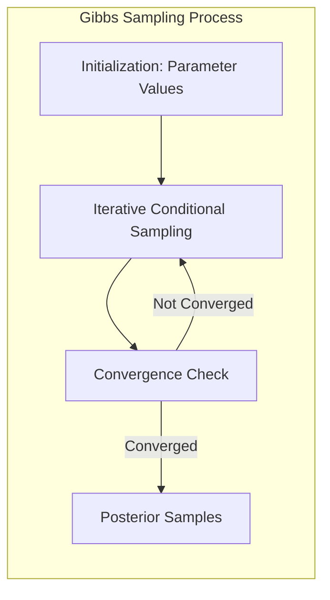
**Introdução**

Este capítulo explora o **Gibbs Sampling**, uma técnica de **Markov chain Monte Carlo (MCMC)** para obter amostras da distribuição posterior em inferência Bayesiana [^8.6]. O aprendizado de modelos, como discutido anteriormente, frequentemente envolve minimizar uma soma de quadrados para regressão ou entropia cruzada para classificação, ambos instâncias da abordagem de máxima verossimilhança [^8.1]. Contudo, a inferência Bayesiana oferece uma perspectiva diferente, permitindo quantificar a incerteza e incorporar conhecimento prévio [^8.1]. O Gibbs Sampling emerge como uma ferramenta poderosa para lidar com modelos complexos onde a amostragem direta da posterior é inviável [^8.6]. Esta técnica é especialmente útil em modelos com muitos parâmetros, onde as distribuições condicionais são mais simples de amostrar do que a distribuição conjunta [^8.6].

### Conceitos Fundamentais

**Conceito 1: Inferência Bayesiana e Distribuição Posterior**
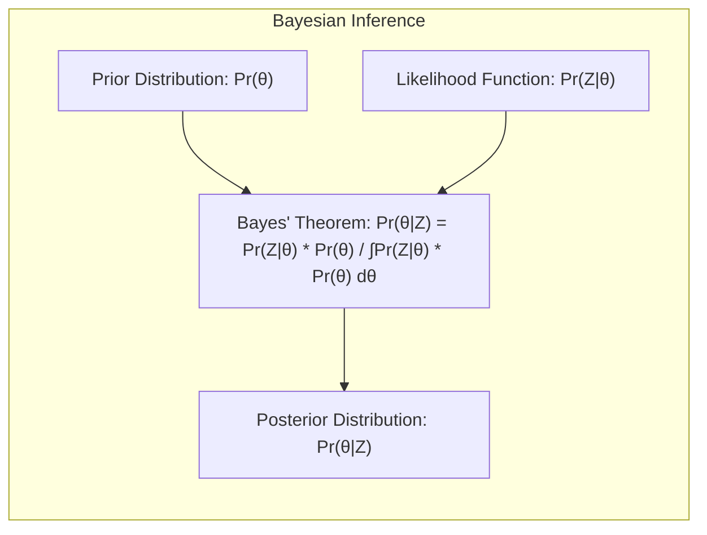
Em contraste com as abordagens frequentistas, a **inferência Bayesiana** não apenas estima parâmetros, mas também quantifica a incerteza associada a essas estimativas [^8.3]. Esta abordagem começa com uma **distribuição *a priori* para os parâmetros**, $Pr(\theta)$, que representa o conhecimento ou crenças sobre os parâmetros antes de observar os dados [^8.3]. Após observar os dados, Z, esta crença é atualizada pela **distribuição *a posteriori***, $Pr(\theta|Z)$, que representa o conhecimento sobre os parâmetros após incorporar a evidência dos dados [^8.3]. Esta distribuição posterior é dada pelo **Teorema de Bayes**:

$$
Pr(\theta|Z) = \frac{Pr(Z|\theta) \cdot Pr(\theta)}{\int Pr(Z|\theta) \cdot Pr(\theta) \, d\theta}
$$

onde $Pr(Z|\theta)$ é a função de verossimilhança, que quantifica a probabilidade dos dados dados os parâmetros [^8.3]. O denominador é uma constante de normalização que garante que a posterior integre para 1 [^8.3]. Em muitos casos, esta integral não tem uma forma fechada, tornando a amostragem da posterior um desafio [^8.6].

> 💡 **Exemplo Numérico:** Vamos supor que queremos estimar a probabilidade de uma moeda ser honesta (parâmetro $\theta$). Nossa *prior* pode ser uma distribuição Beta(2,2), que indica que achamos que a moeda tem uma chance razoável de ser justa. Se observarmos 7 caras em 10 lançamentos (dados Z), a verossimilhança é dada por uma distribuição binomial. O Teorema de Bayes nos permite combinar a *prior* e a verossimilhança para obter a *posterior*, que será usada para inferências sobre o viés da moeda. A integral no denominador neste caso, é um pouco complicada de calcular analiticamente, porém o Gibbs sampling poderia ser usado para amostrar dessa distribuição *posterior*.

**Lemma 1: Amostragem Condicional**
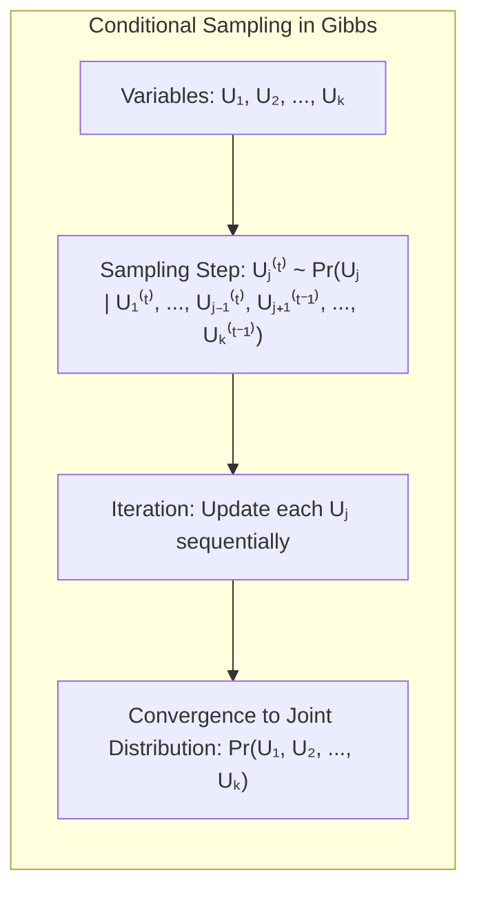
O Gibbs Sampling aproveita a ideia de que, embora a amostragem direta da distribuição posterior conjunta possa ser difícil, a amostragem das distribuições condicionais é frequentemente mais simples [^8.6]. Especificamente, dado um conjunto de variáveis aleatórias $U_1, U_2, \ldots, U_K$, o Gibbs sampling itera através da amostra de cada $U_j$ condicional nas outras variáveis:

$$U_j^{(t)} \sim Pr(U_j | U_1^{(t)}, \ldots, U_{j-1}^{(t)}, U_{j+1}^{(t-1)}, \ldots, U_K^{(t-1)})$$

A sequência iterativa de amostras, sob certas condições de regularidade, converge para a distribuição conjunta $Pr(U_1, U_2, \ldots, U_K)$ [^8.6]. Isso é análogo a simular um sistema dinâmico onde o estado atual só depende do estado anterior.

> 💡 **Exemplo Numérico:** Suponha que temos duas variáveis, $U_1$ e $U_2$, e queremos amostrar da sua distribuição conjunta. Em vez de amostrar diretamente de $Pr(U_1, U_2)$, podemos:
>
> 1. Inicializar $U_1^{(0)}$ e $U_2^{(0)}$ com valores aleatórios.
> 2. Amostrar $U_1^{(1)}$ de $Pr(U_1 | U_2^{(0)})$.
> 3. Amostrar $U_2^{(1)}$ de $Pr(U_2 | U_1^{(1)})$.
> 4. Repetir os passos 2 e 3, atualizando $U_1$ e $U_2$ iterativamente.
>
> As amostras $(U_1^{(t)}, U_2^{(t)})$  convergirão para a distribuição conjunta $Pr(U_1, U_2)$ após um número suficiente de iterações. Por exemplo, suponha que $U_1$ e $U_2$ sejam as médias de dois grupos em um estudo, e queremos amostrar da distribuição conjunta dessas médias dados os dados.

**Corolário 1: Convergência e Distribuição Estacionária**
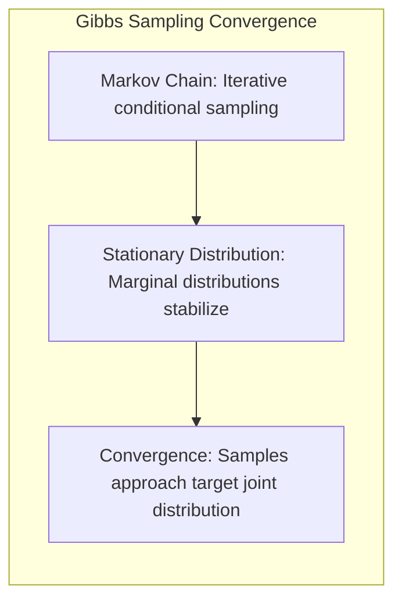
A convergência do Gibbs Sampling para a distribuição conjunta alvo se baseia na ideia de uma **cadeia de Markov**, cuja distribuição estacionária é a distribuição desejada [^8.6]. A característica de "estacionaridade" significa que a distribuição marginal das variáveis individuais $U_k$ permanece inalterada ao longo das sucessivas etapas. No Gibbs Sampling, a convergência para a distribuição estacionária ocorre quando as distribuições marginais das variáveis individuais estabilizam, o que é uma consequência do processo de amostragem condicional iterativa [^8.6].

> 💡 **Exemplo Numérico:** Imagine que estamos simulando o movimento de uma partícula. A posição da partícula no tempo $t+1$ depende apenas da posição no tempo $t$ (uma cadeia de Markov). Se executarmos a simulação por tempo suficiente, a distribuição de posições da partícula irá se estabilizar (distribuição estacionária). O mesmo conceito se aplica ao Gibbs Sampling, onde as amostras dos parâmetros convergem para uma distribuição estável ao longo das iterações.

**Conceito 2: Cadeias de Markov e Monte Carlo**
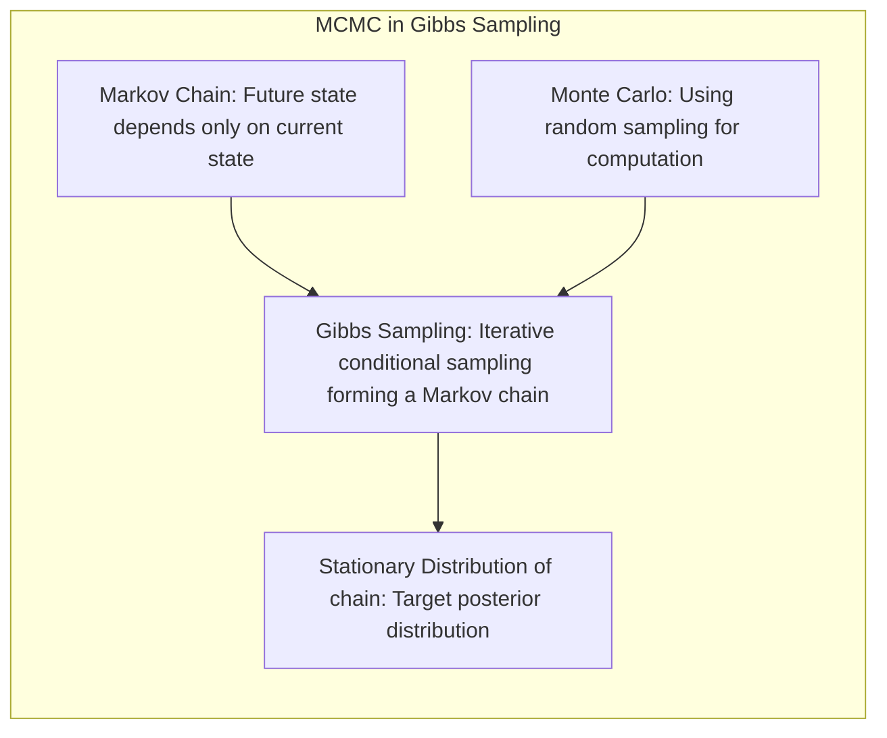
O Gibbs Sampling é um método de **Markov chain Monte Carlo (MCMC)** que usa uma cadeia de Markov para amostrar de distribuições complexas [^8.6]. **Cadeias de Markov** são processos estocásticos onde o estado futuro depende apenas do estado atual, não do histórico passado [^8.6]. **Monte Carlo** refere-se ao uso de amostragem aleatória para realizar cálculos [^8.6]. No Gibbs Sampling, a amostragem iterativa condicional cria uma cadeia de Markov cuja distribuição estacionária corresponde à distribuição posterior desejada [^8.6].

> 💡 **Exemplo Numérico:** Em um jogo de tabuleiro, a posição de um jogador no próximo turno depende apenas da posição atual e da rolagem do dado (uma cadeia de Markov). Usando simulações de Monte Carlo, podemos simular um grande número de jogos para estimar a probabilidade de vitória em uma determinada posição no tabuleiro. Da mesma forma, o Gibbs Sampling usa amostragem iterativa para explorar a distribuição *posterior* e fazer inferências sobre os parâmetros do modelo.

**Conceito 3: Gibbs Sampling e O Algoritmo EM**
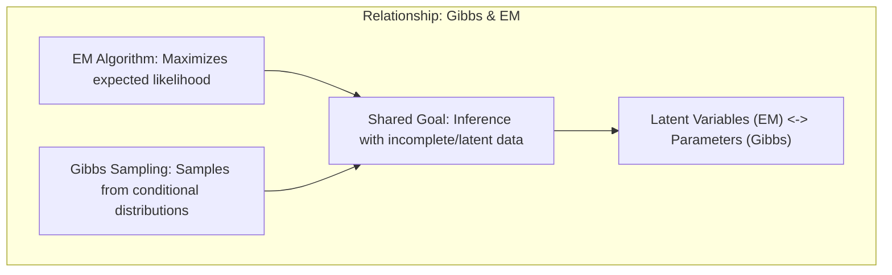
Há uma forte relação entre Gibbs Sampling e o **algoritmo EM (Expectation-Maximization)** em modelos de família exponencial [^8.6, ^8.5]. Ambos os métodos abordam problemas de inferência com dados incompletos ou latentes [^8.6]. No entanto, enquanto o EM maximiza a verossimilhança esperada [^8.5], o Gibbs Sampling amostra iterativamente de distribuições condicionais [^8.6]. No contexto do Gibbs Sampling, as variáveis latentes do algoritmo EM são vistas como parâmetros adicionais, e a amostragem dessas variáveis, em conjunto com os parâmetros do modelo, constitui o ciclo do Gibbs Sampling [^8.6]. Essa conexão se torna mais clara ao analisar a aplicação do Gibbs Sampling em modelos de mistura, que será abordada posteriormente.

> ⚠️ **Nota Importante:** O Gibbs Sampling, embora poderoso, pode ser computacionalmente intensivo, especialmente em modelos com alta dimensionalidade. A escolha de um número adequado de iterações e um período de "burn-in" é crucial para assegurar a convergência [^8.6].

> ❗ **Ponto de Atenção:** A dependência entre as amostras geradas pelo Gibbs Sampling exige que uma análise cuidadosa seja feita da autocorrelação para obter estimativas precisas dos parâmetros [^8.6].

> ✔️ **Destaque:** Em modelos com dados latentes, o Gibbs Sampling pode, muitas vezes, ser mais simples e eficiente que outros métodos de otimização, já que explora a estrutura condicional do problema [^8.6].

### Implementação do Gibbs Sampling em Modelos de Mistura Gaussianos

**Exemplo: Modelo de Mistura Gaussiana**

Para ilustrar o funcionamento do Gibbs Sampling, consideremos um **modelo de mistura gaussiana** com dois componentes [^8.5.1]. Neste modelo, cada observação $Y_i$ é gerada de uma das duas distribuições gaussianas com médias e variâncias distintas. O modelo pode ser expresso como:

$Y_i \sim (1 - \Delta_i) N(\mu_1, \sigma_1^2) + \Delta_i N(\mu_2, \sigma_2^2)$

onde $\Delta_i \in \{0, 1\}$ indica o componente do qual a observação foi gerada, e $\pi$ é a probabilidade de uma observação pertencer ao componente 2 [^8.5.1].

**Passos do Gibbs Sampling:**

1.  **Inicialização:** Inicializar as médias $\mu_1$ e $\mu_2$ [^8.6]. As variâncias $\sigma_1^2$ e $\sigma_2^2$ e a probabilidade de mistura $\pi$ podem ser fixadas em seus valores de máxima verossimilhança para simplificar o exemplo [^8.6, ^8.5].
2.  **Iteração:** Para cada observação $i = 1, \ldots, N$, amostrar o componente $\Delta_i$ de sua distribuição condicional dado os outros parâmetros e dados [^8.6].
    $$
    Pr(\Delta_i = 1 | Y_i, \mu_1, \mu_2, \sigma_1^2, \sigma_2^2, \pi) = \frac{\pi \phi(Y_i | \mu_2, \sigma_2^2)}{(1-\pi) \phi(Y_i | \mu_1, \sigma_1^2) + \pi \phi(Y_i | \mu_2, \sigma_2^2)}
    $$
    onde $\phi$ é a função de densidade gaussiana [^8.6, ^8.5].
3.  **Amostrar as médias:** Dada a designação dos componentes para cada observação, amostrar as médias $\mu_1$ e $\mu_2$ de suas distribuições condicionais, que são também gaussianas [^8.6]:
    $$
    \mu_1^{(t+1)} \sim N \left( \frac{\sum_{i=1}^N (1-\Delta_i^{(t)})Y_i}{\sum_{i=1}^N (1-\Delta_i^{(t)})}, \frac{\sigma_1^2}{\sum_{i=1}^N (1-\Delta_i^{(t)})} \right)
    $$
    $$
    \mu_2^{(t+1)} \sim N \left( \frac{\sum_{i=1}^N \Delta_i^{(t)}Y_i}{\sum_{i=1}^N \Delta_i^{(t)}}, \frac{\sigma_2^2}{\sum_{i=1}^N \Delta_i^{(t)}} \right)
    $$
4.  **Repetir:** Repetir os passos 2 e 3 até a convergência [^8.6]. A convergência pode ser avaliada observando se as médias $\mu_1$ e $\mu_2$ e as atribuições $\Delta_i$ estabilizam-se ao longo das iterações.
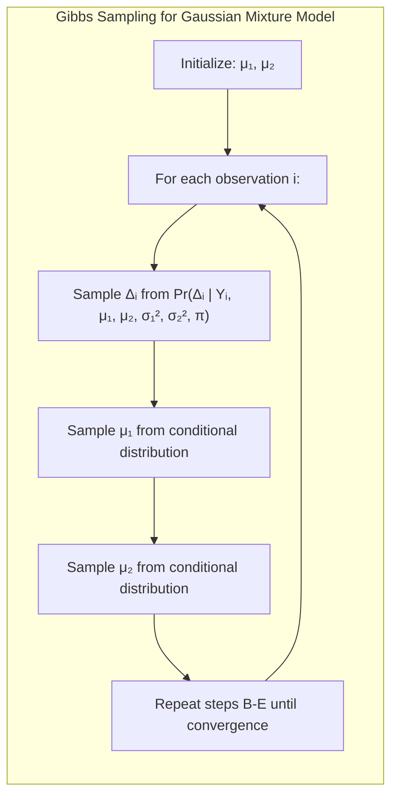
> 💡 **Exemplo Numérico:** Vamos gerar 100 pontos de dados a partir de uma mistura de duas Gaussianas. Definiremos:
>
> *   $\mu_1 = 2$, $\sigma_1^2 = 1$
> *   $\mu_2 = 7$, $\sigma_2^2 = 1.5$
> *   $\pi = 0.4$ (probabilidade de um ponto vir da segunda Gaussiana)
>
> ```python
> import numpy as np
> import scipy.stats as st
>
> # Parâmetros do modelo
> mu1, sigma1 = 2, 1
> mu2, sigma2 = 7, 1.5
> pi = 0.4
> N = 100 # Número de pontos de dados
>
> # Gerar dados
> delta = np.random.binomial(1, pi, N)
> Y = np.random.normal(mu1, sigma1, N) * (1-delta) + np.random.normal(mu2, sigma2, N) * delta
>
> # Inicialização para Gibbs
> mu1_est = np.random.normal(0,1) # Média inicial para mu1
> mu2_est = np.random.normal(10,1)  # Média inicial para mu2
> sigma1_est, sigma2_est = sigma1, sigma2 # Variâncias fixadas
> delta_est = np.zeros(N, dtype=int) # Inicialização das atribuições delta_i
>
> iterations = 1000
>
> for t in range(iterations):
>  # Passo 2: Amostrar delta_i
>  for i in range(N):
>      prob_delta_1 = (pi * st.norm.pdf(Y[i], mu2_est, sigma2_est)) / \
>                    ((1 - pi) * st.norm.pdf(Y[i], mu1_est, sigma1_est) + \
>                     pi * st.norm.pdf(Y[i], mu2_est, sigma2_est))
>      delta_est[i] = np.random.binomial(1, prob_delta_1)
>
>  # Passo 3: Amostrar mu1 e mu2
>  mu1_est = np.random.normal(
>      np.sum((1-delta_est)*Y) / np.sum(1-delta_est),
>      sigma1_est / np.sqrt(np.sum(1-delta_est))
>  )
>  mu2_est = np.random.normal(
>      np.sum(delta_est*Y) / np.sum(delta_est),
>      sigma2_est / np.sqrt(np.sum(delta_est))
>  )
>
> print(f"Média estimada mu1: {mu1_est:.2f}")
> print(f"Média estimada mu2: {mu2_est:.2f}")
> ```
>
> Este código simula o processo de Gibbs Sampling. Observamos que, após algumas iterações, `mu1_est` e `mu2_est` convergem para valores próximos de `mu1` e `mu2`.

**Conexão com o Algoritmo EM**
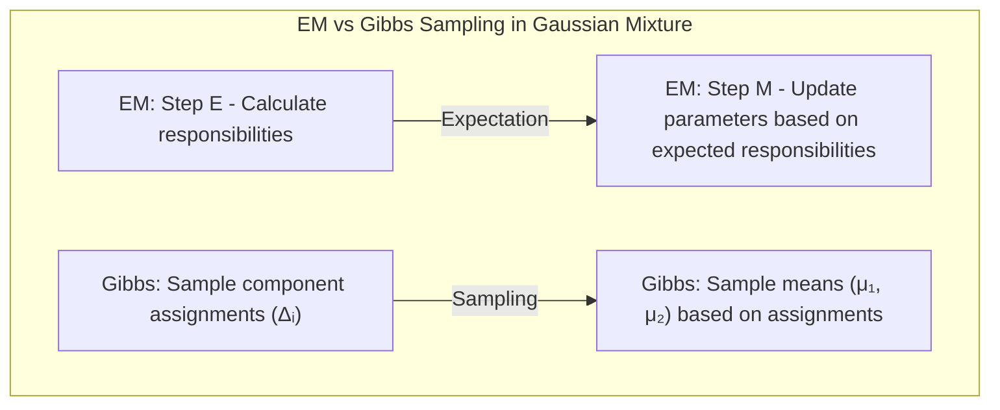
A relação entre o Gibbs Sampling e o algoritmo EM neste exemplo se torna evidente: no passo 2, o Gibbs Sampling amostra as responsabilidades $\Delta_i$ com base na verossimilhança atual, e no passo 3, amostra as médias condicionais dadas essas responsabilidades [^8.6, ^8.5]. O algoritmo EM, em vez de amostrar, encontra a responsabilidade *esperada* no passo E e *maximiza* os parâmetros com base nessas responsabilidades no passo M [^8.5].

> 💡 **Exemplo Numérico:** No algoritmo EM para o mesmo modelo, no passo E calcularíamos a probabilidade esperada de cada ponto de dados pertencer a cada componente, enquanto no passo M atualizaríamos as médias e as variâncias maximizando a verossimilhança esperada dada essas responsabilidades. Em contrapartida, o Gibbs sampling amostra as responsabilidades e as médias no lugar de calcular as esperanças e maximizar.

**Lemma 2: Amostragem como Otimização**

O processo iterativo do Gibbs Sampling pode ser interpretado como uma otimização estocástica, em que a amostragem de cada variável permite explorar o espaço de parâmetros em busca de regiões de alta densidade na distribuição posterior [^8.6].

**Corolário 2: A Convergência como Estabilidade**

A convergência no Gibbs Sampling pode ser considerada como um processo onde as amostras tendem a se estabilizar ao redor dos valores mais prováveis para cada parâmetro, dado o comportamento das outras variáveis. Em outras palavras, a distribuição de probabilidade sobre o espaço de parâmetros torna-se estacionária [^8.6].

### Perguntas Teóricas Avançadas

**Pergunta Teórica Avançada 1:** Como a escolha da *prior* influencia a convergência e as propriedades da amostra obtida pelo Gibbs Sampling?
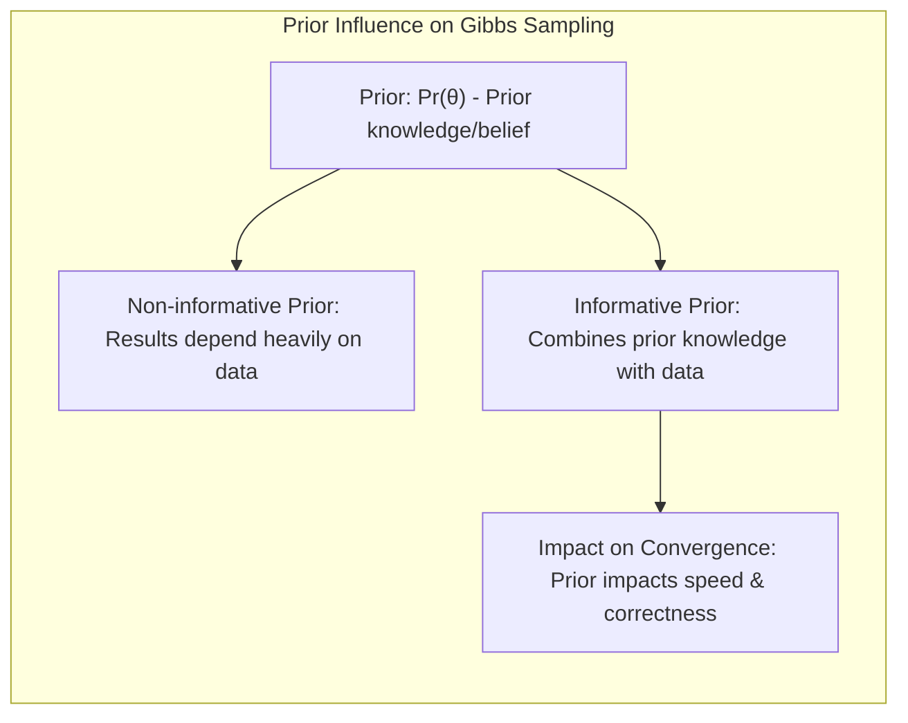
**Resposta:** A escolha da *prior* tem um impacto substancial na distribuição *a posteriori*, e, consequentemente, nas amostras obtidas pelo Gibbs Sampling. A *prior* representa nosso conhecimento prévio sobre os parâmetros, antes de considerar os dados [^8.3]. Uma *prior* não informativa, como uma distribuição uniforme, pode levar a resultados que dependem fortemente dos dados, enquanto uma *prior* informativa pode levar a resultados que combinam o conhecimento prévio com a evidência dos dados [^8.3]. Uma *prior* mal escolhida pode levar a uma convergência mais lenta ou mesmo a resultados incorretos. A influência da *prior* é especialmente forte quando o número de dados é pequeno. Em geral, com mais dados, a influência da *prior* diminui, e a *posterior* é dominada pela verossimilhança [^8.3].

> 💡 **Exemplo Numérico:** No exemplo da moeda, se usarmos uma *prior* Beta(1,1), que é uniforme, nossos resultados dependerão mais dos dados. Se usarmos uma *prior* Beta(10, 2) (indicando uma forte crença que a moeda seja tendenciosa para caras), a *posterior* será influenciada por essa crença. Ao analisar a convergência do Gibbs Sampling, podemos ver que uma *prior* mais informativa pode levar a uma convergência mais rápida.

**Pergunta Teórica Avançada 2:** Quais são as condições de regularidade para garantir a convergência do Gibbs Sampling?
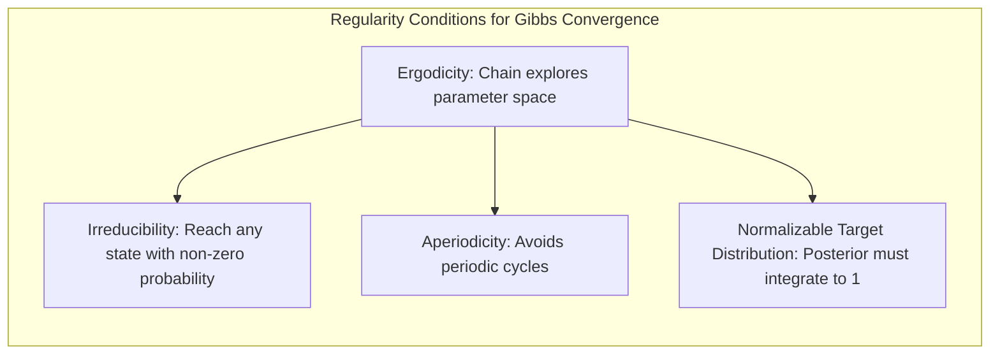
**Resposta:** A convergência do Gibbs Sampling é garantida sob certas condições de regularidade que envolvem a ergodicidade da cadeia de Markov subjacente [^8.6]. Estas condições, de maneira geral, asseguram que a cadeia tem acesso a todas as regiões do espaço de parâmetros com probabilidade não nula e que a cadeia eventualmente atinge uma distribuição estacionária [^8.6]. Uma dessas condições é a *irreducibilidade*, que significa que, começando de qualquer estado, existe uma probabilidade positiva de alcançar qualquer outro estado em um número finito de passos. Outra condição é a *aperiodicidade*, que significa que a cadeia não fica presa em ciclos periódicos. Além disso, a distribuição alvo (a *posterior*) deve ser normalizável. Em prática, a verificação direta dessas condições pode ser difícil, sendo comum analisar a convergência da cadeia por meio de diagnóstico visual das amostras geradas e por meio de estatísticas que avaliam a convergência, como a razão de Gelman-Rubin.

> 💡 **Exemplo Numérico:** Se em um modelo Gibbs Sampling, a amostragem de um parâmetro $U_1$ depende apenas de um outro parâmetro $U_2$, e este segundo parâmetro não depende de $U_1$, podemos ter problemas de irreducibilidade. A cadeia pode ficar presa em um ciclo em que $U_1$ é amostrado com base em um $U_2$ estático, sem explorar outros valores possíveis de $U_1$, levando a resultados incorretos.

**Pergunta Teórica Avançada 3:**  Como o Gibbs Sampling se relaciona com outros métodos MCMC, como o Metrópolis-Hastings?
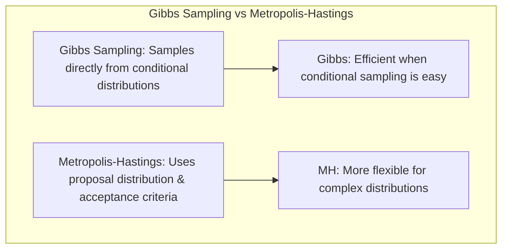
**Resposta:** O Gibbs Sampling é um caso especial do método mais geral de **Metrópolis-Hastings (MH)** [^8.6]. Enquanto o Gibbs Sampling amostra diretamente da distribuição condicional, o MH utiliza uma distribuição *proposal* e aceita ou rejeita amostras com base em um critério de aceitação que garante que a cadeia explore a distribuição alvo corretamente [^8.6]. O Gibbs Sampling tem a vantagem de ser mais eficiente quando a amostragem das distribuições condicionais é possível e fácil. Contudo, o MH é mais flexível, permitindo amostrar de distribuições que não admitem uma amostragem direta condicional. O MH, entretanto, requer a escolha de uma distribuição proposta, cuja escolha impacta a taxa de convergência do algoritmo. A escolha entre Gibbs Sampling e MH depende da natureza do problema e das distribuições a serem amostradas.

> 💡 **Exemplo Numérico:** Imagine que temos um modelo com dois parâmetros, mas não conhecemos as distribuições condicionais para usar no Gibbs Sampling. Podemos usar o Metrópolis-Hastings, onde, a cada passo, propomos novos valores para os parâmetros usando uma distribuição *proposal* (por exemplo, uma gaussiana centrada no valor atual) e aceitamos ou rejeitamos esses valores com base na razão de verossimilhança. Essa flexibilidade do MH permite lidar com modelos mais complexos.

### Conclusão

O Gibbs Sampling é uma técnica poderosa para realizar inferência Bayesiana por meio da amostragem de distribuições condicionais [^8.6]. Este método é particularmente útil quando a amostragem direta da distribuição posterior conjunta é difícil, como em modelos com múltiplas variáveis e hierarquias. A conexão com o algoritmo EM revela uma ligação profunda entre essas duas abordagens e fornece uma perspectiva valiosa sobre a modelagem estatística [^8.5, ^8.6]. As amostras geradas pelo Gibbs Sampling podem ser usadas para inferir os parâmetros, calcular intervalos de credibilidade, ou fazer previsões. Apesar dos desafios computacionais associados com métodos MCMC, o Gibbs Sampling continua sendo uma ferramenta essencial no arsenal da modelagem Bayesiana.
<!-- END DOCUMENT -->
### Footnotes
[^8.1]: "In this chapter we provide a general exposition of the maximum likelihood approach, as well as the Bayesian method for inference. The bootstrap, introduced in Chapter 7, is discussed in this context, and its relation to maximum likelihood and Bayes is described." *(Trecho de <Model Inference and Averaging>)*
[^8.2]: "Denote the training data by Z = {z1,2,...,zN}, with zi = (xi, yi), i = 1,2,..., N. Here xi is a one-dimensional input, and yᵢ the outcome, either continuous or categorical." *(Trecho de <Model Inference and Averaging>)*
[^8.3]: "In the Bayesian approach to inference, we specify a sampling model Pr(Z|0) (density or probability mass function) for our data given the parameters, and a prior distribution for the parameters Pr(0) reflecting our knowledge about 0 before we see the data. We then compute the posterior distribution" *(Trecho de <Model Inference and Averaging>)*
[^8.4]:  "The posterior distribution also provides the basis for predicting the values of a future observation znew, via the predictive distribution:" *(Trecho de <Model Inference and Averaging>)*
[^8.5]:  "The EM algorithm is a popular tool for simplifying difficult maximum likelihood problems. We first describe it in the context of a simple mixture model." *(Trecho de <Model Inference and Averaging>)*
[^8.5.1]:  "In this section we describe a simple mixture model for density estimation, and the associated EM algorithm for carrying out maximum likelihood estimation." *(Trecho de <Model Inference and Averaging>)*
[^8.6]: "Having defined a Bayesian model, one would like to draw samples from the resulting posterior distribution, in order to make inferences about the parameters. Except for simple models, this is often a difficult computational problem. In this section we discuss the Markov chain Monte Carlo (MCMC) approach to posterior sampling. We will see that Gibbs sampling, an MCMC procedure, is closely related to the EM algorithm: the main difference is that it samples from the conditional distributions rather than maximizing over them." *(Trecho de <Model Inference and Averaging>)*
[^8.7]:  "Assume that we have a discrete sample space with L categories. Let wj be the probability that a sample point falls in category j, and ŵj the observed proportion in category j." *(Trecho de <Model Inference and Averaging>)*
[^8.8]:  "Now the bootstrap distribution, obtained by sampling with replacement from the data, can be expressed as sampling the category proportions from a multinomial distribution." *(Trecho de <Model Inference and Averaging>)*
[^8.9]: "We consider unobserved latent variables ∆i taking values 0 or 1 as in (8.36): if ∆i = 1 then Yi comes from model 2, otherwise it comes from model 1." *(Trecho de <Model Inference and Averaging>)*
[^8.10]: "We have, however, done some things that are not proper from a Bayesian point of view. We have used a noninformative (constant) prior for σ² and replaced it with the maximum likelihood estimate ô² in the posterior." *(Trecho de <Model Inference and Averaging>)*
[^8.11]: "In the M step, the EM algorithm maximizes Q(θ', θ) over θ', rather than the actual objective function l(θ'; Z)." *(Trecho de <Model Inference and Averaging>)*
[^8.12]: "This is the same as a parametric bootstrap distribution in which we generate bootstrap values z* from the maximum likelihood estimate of the sampling density N(z, 1)." *(Trecho de <Model Inference and Averaging>)*
[^8.13]:  "The corresponding estimates for the standard errors of 0j are obtained from" *(Trecho de <Model Inference and Averaging>)*
[^8.14]: "Finally, let θ0 denote the true value of 0. A standard result says that the sampling distribution of the maximum likelihood estimator has a limiting normal distribution" *(Trecho de <Model Inference and Averaging>)*
[^8.15]: "The maximum likelihood estimate is obtained by setting dl/dß = 0 and dl/dσ² = 0, giving" *(Trecho de <Model Inference and Averaging>)*
[^8.16]: "In essence the bootstrap is a computer implementation of nonparametric or parametric maximum likelihood." *(Trecho de <Model Inference and Averaging>)*
[^8.17]: "The choice of noninformative prior for θ." *(Trecho de <Model Inference and Averaging>)*
[^8.18]: "The dependence of the log-likelihood l(θ; Z) on the data Z only through the maximum likelihood estimate θ. Hence we can write the log-likelihood as l(θ; θ)." *(Trecho de <Model Inference and Averaging>)*
[^8.19]: "The symmetry of the log-likelihood in θ and θ, that is, l(θ; θ) = l(θ; θ) + constant." *(Trecho de <Model Inference and Averaging>)*
[^8.20]: "This process is repeated B times, where B = 200 say." *(Trecho de <Model Inference and Averaging>)*
[^8.21]: "In this example the confidence bands (not shown) don't look much different than the fixed A bands. But in other problems, where more adaptation is used, this can be an important effect to capture." *(Trecho de <Model Inference and Averaging>)*
[^8.22]: "This really means that the method is "model-free," since it uses the raw data, not a specific parametric model, to generate new datasets." *(Trecho de <Model Inference and Averaging>)*
