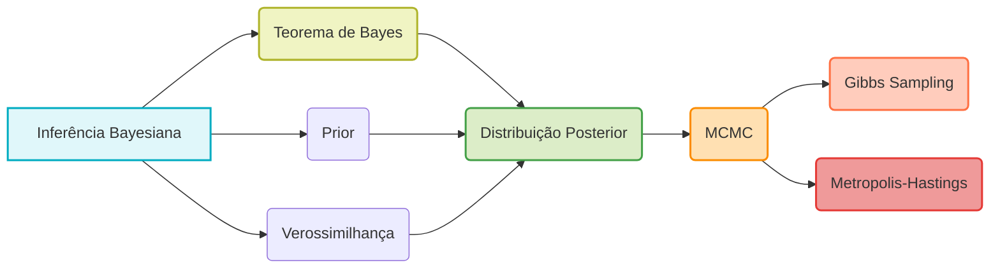
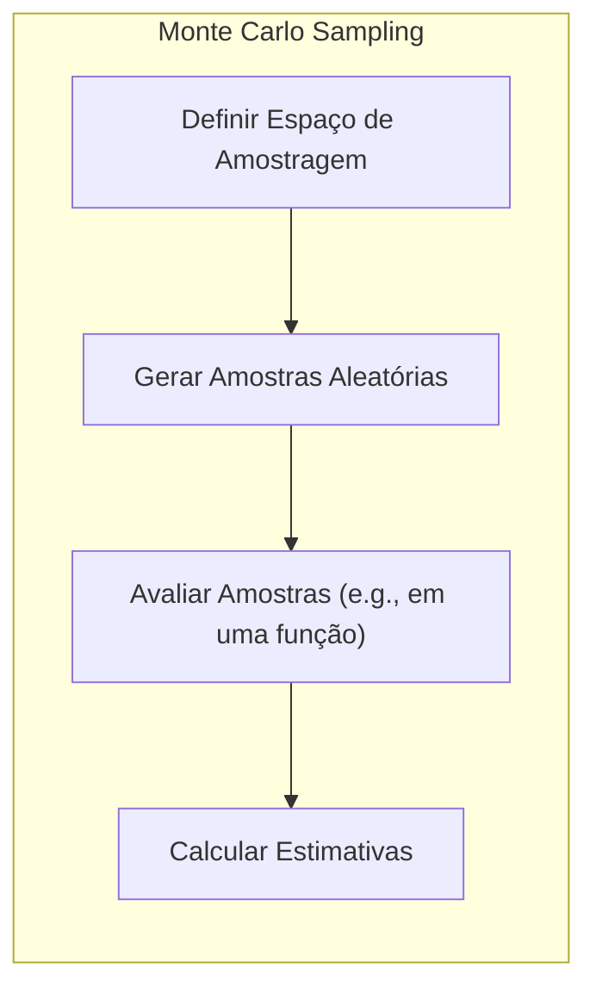
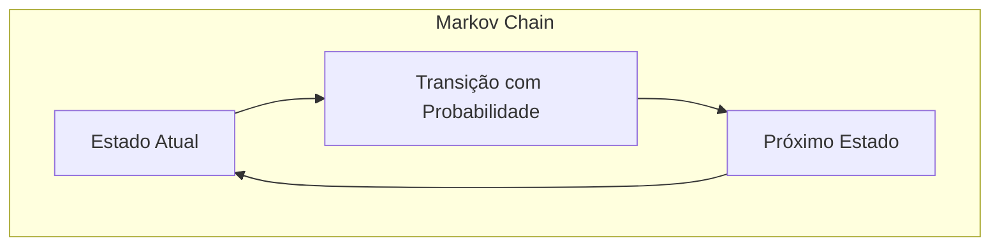
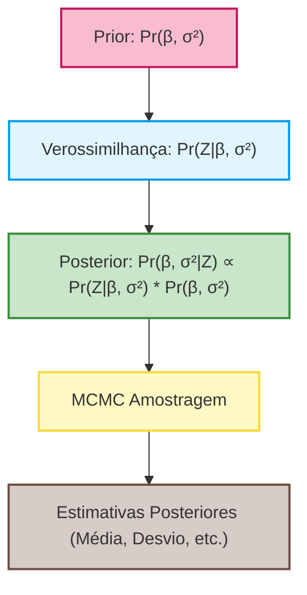
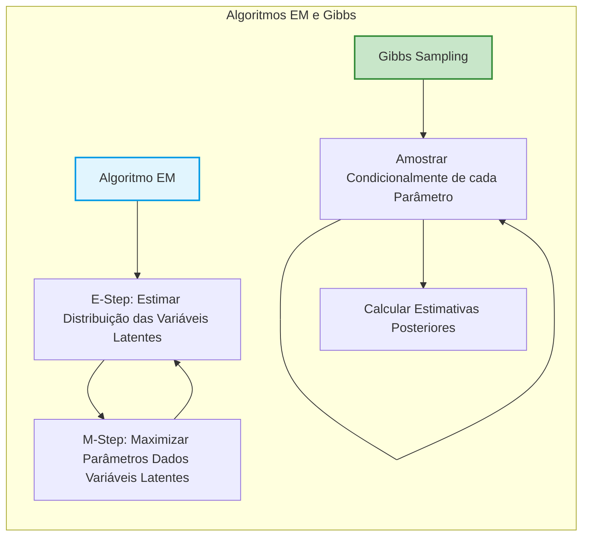
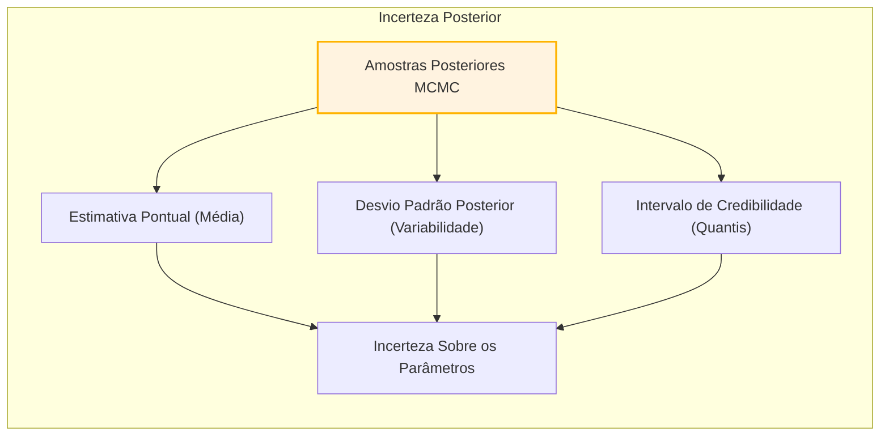
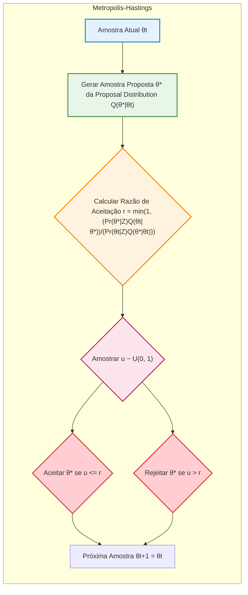

## MCMC para Inferência Posterior: Uma Introdução Abrangente

<imagem: Um mapa mental complexo mostrando a relação entre métodos Bayesianos, Monte Carlo, Cadeias de Markov, amostragem de Gibbs e outros algoritmos de amostragem, destacando os aspectos teóricos e práticos da inferência Bayesiana.>

### Introdução

Este capítulo explora o universo dos **Modelos de Aprendizado Estatístico Diversos**, com foco especial nas técnicas de inferência Bayesiana e nas abordagens de *Markov chain Monte Carlo (MCMC)* [^8.1]. Métodos Bayesianos oferecem uma estrutura poderosa para quantificar a incerteza associada às estimativas de parâmetros e previsões, em contraste com as abordagens de máxima verossimilhança, que muitas vezes fornecem apenas uma única estimativa pontual [^8.1]. O método de **MCMC** emerge como uma ferramenta essencial para lidar com as complexidades computacionais inerentes aos modelos Bayesianos, permitindo-nos amostrar da distribuição posterior e realizar inferências [^8.6].

Neste contexto, começamos com uma visão geral da motivação para o método MCMC em inferência Bayesiana. Diferentemente da abordagem de máxima verossimilhança, que busca um único conjunto de parâmetros que maximiza a verossimilhança dos dados observados, a inferência Bayesiana procura a distribuição posterior dos parâmetros, que representa a incerteza sobre os parâmetros, dados os dados observados e um conhecimento prévio [^8.3]. O cálculo da distribuição posterior geralmente envolve integrais complexas que não têm soluções analíticas. O MCMC emerge como uma solução computacional eficaz para realizar inferências nessas situações complexas [^8.6].

### Conceitos Fundamentais

**Conceito 1: Inferência Bayesiana e Distribuições Posteriores**

Em sua essência, a inferência Bayesiana utiliza o **Teorema de Bayes** para atualizar nossas crenças sobre os parâmetros de um modelo, à luz de novos dados [^8.1]. Formalmente, se denotarmos os dados observados por $Z$ e os parâmetros do modelo por $\theta$, o Teorema de Bayes é expresso como:

$$ Pr(\theta|Z) = \frac{Pr(Z|\theta) \cdot Pr(\theta)}{Pr(Z)} $$

Aqui, $Pr(\theta)$ é a **distribuição *a priori***, que representa nosso conhecimento prévio sobre os parâmetros antes de observar os dados; $Pr(Z|\theta)$ é a **função de verossimilhança**, que quantifica o quão bem os dados se ajustam ao modelo, dados os parâmetros $\theta$; e $Pr(\theta|Z)$ é a **distribuição *a posteriori***, que representa nosso conhecimento atualizado sobre os parâmetros, depois de observar os dados. O denominador, $Pr(Z)$, é a **evidência**, que age como um fator de normalização, e é definido como a integral da função conjunta de verossimilhança e *a priori*:
$$ Pr(Z) = \int Pr(Z|\theta) \cdot Pr(\theta) d\theta $$.

> 💡 **Exemplo Numérico:**
> Suponha que estamos modelando o número de sucessos (ex: número de caras em lançamentos de moeda) em uma sequência de tentativas, usando uma distribuição binomial. Temos $n=10$ lançamentos e observamos $k=7$ caras. O parâmetro $\theta$ representa a probabilidade de obter cara.
>
> *   **Prior:** Assumimos uma distribuição *a priori* Beta para $\theta$ como $Pr(\theta) = Beta(\alpha=2, \beta=2)$. Isso significa que inicialmente acreditamos que a probabilidade de cara está em torno de 0.5.
> *   **Verossimilhança:** A função de verossimilhança é dada pela distribuição binomial $Pr(Z|\theta) = \binom{n}{k} \theta^k (1-\theta)^{n-k} = \binom{10}{7} \theta^7 (1-\theta)^3$.
> *   **Posterior:** A distribuição posterior é proporcional ao produto do prior e da verossimilhança: $Pr(\theta|Z) \propto Beta(\alpha=2+7, \beta=2+3) = Beta(9, 5)$.  Note que para este caso específico, a posterior também é uma distribuição beta, pois usamos um prior conjugado.
>
> A distribuição posterior $Beta(9, 5)$ é uma forma de expressar nossa crença atualizada sobre o valor de $\theta$, que, depois de observar os dados, tende para um valor maior que 0.5.

> ⚠️ **Nota Importante**: A distribuição posterior é a chave para a inferência Bayesiana. Ela nos permite quantificar nossa incerteza sobre os parâmetros do modelo, e nos permite fazer previsões baseadas na distribuição posterior preditiva. **Referência ao tópico [^8.3]**.

**Lemma 1:** *A distribuição posterior, Pr(θ|Z), resume o estado atual do conhecimento sobre o parâmetro θ, dados os dados observados Z e o conhecimento prévio Pr(θ).* A distribuição posterior é proporcional ao produto da função de verossimilhança e a priori, ou seja, $Pr(\theta|Z) \propto Pr(Z|\theta) \cdot Pr(\theta)$. $\blacksquare$

**Conceito 2: Amostragem de Monte Carlo**

Amostragem de Monte Carlo é uma classe de algoritmos que utiliza geração de números aleatórios para aproximar o valor de uma integral ou de outras quantidades complexas [^8.6]. No contexto da inferência Bayesiana, o objetivo é amostrar da distribuição posterior $Pr(\theta|Z)$. Quando a distribuição posterior não possui uma forma analítica conhecida, métodos de Monte Carlo como o **MCMC** são utilizados para gerar uma sequência de amostras $\theta_1, \theta_2, \ldots,\theta_N$ que, sob certas condições, podem ser consideradas amostras da distribuição posterior desejada [^8.6]. Essas amostras podem ser usadas para calcular médias, desvios padrão e outros resumos da distribuição posterior.

> 💡 **Exemplo Numérico:**
>
> Imagine que desejamos estimar a área de uma região irregular, por exemplo, um lago, usando Monte Carlo.
>
> 1.  **Definir uma área delimitadora:** Criamos um retângulo que englobe completamente o lago.
> 2.  **Gerar pontos aleatórios:** Geramos um grande número de pontos aleatórios dentro deste retângulo.
> 3.  **Contar pontos:** Contamos quantos desses pontos caem dentro do lago.
> 4.  **Estimar área:** A área do lago pode ser aproximada pela proporção de pontos que caem dentro dele em relação ao total de pontos gerados, multiplicada pela área total do retângulo.
>
> Se geramos 1000 pontos, a área do retângulo é de 100 unidades e 450 pontos caem dentro do lago, a estimativa da área do lago seria $ (450/1000) * 100 = 45 $.
>
>  Este exemplo simplifica a ideia, mas demonstra como o método Monte Carlo pode ser usado para aproximar soluções em situações complexas.

> ❗ **Ponto de Atenção**: Os métodos de Monte Carlo são essenciais para lidar com modelos Bayesianos onde a distribuição posterior não é analiticamente tratável. **Conforme indicado em [^8.6]**.

**Corolário 1:** *Dado um grande número de amostras geradas por um método de Monte Carlo que converge para a distribuição alvo, a média amostral dos valores de função dessas amostras converge para a esperança teórica da função com relação à distribuição alvo*. Esse resultado baseia-se na lei dos grandes números.

**Conceito 3: Cadeias de Markov e Métodos MCMC**

O **MCMC** representa uma classe de algoritmos de Monte Carlo que constrói uma *cadeia de Markov* cujo estado estacionário é a distribuição posterior desejada [^8.6]. Uma cadeia de Markov é um processo estocástico no qual o estado seguinte depende apenas do estado atual e não do histórico anterior. Em um algoritmo MCMC, o estado da cadeia de Markov é tipicamente representado pelos parâmetros do modelo $\theta$. As cadeias de Markov são construídas de forma a explorar o espaço de parâmetros, fazendo com que as amostras se aproximem da distribuição posterior à medida que o processo avança [^8.6].

> 💡 **Exemplo Numérico:**
> Imagine um modelo em que a probabilidade de ter chuva em um dia depende apenas se choveu ou não no dia anterior. Isso é uma cadeia de Markov. Por exemplo, se choveu hoje, há 70% de chance de chover amanhã, e se não choveu hoje, há 30% de chance de chover amanhã. As probabilidades de transição são:
>
>  *   $P(\text{chove amanhã}|\text{chove hoje}) = 0.7$
>  *   $P(\text{não chove amanhã}|\text{chove hoje}) = 0.3$
>  *   $P(\text{chove amanhã}|\text{não chove hoje}) = 0.3$
>  *   $P(\text{não chove amanhã}|\text{não chove hoje}) = 0.7$
>
>  Um algoritmo MCMC poderia usar essa cadeia de Markov para gerar sequências de dias chuvosos e não chuvosos, convergindo para a distribuição de probabilidade de longo prazo de dias chuvosos e não chuvosos. Se a cadeia for construída corretamente, essa distribuição de longo prazo corresponderia à distribuição posterior de interesse.

> ✔️ **Destaque**: A habilidade de gerar amostras a partir da distribuição posterior sem ter a necessidade de conhecer sua forma analítica é o principal diferencial dos métodos MCMC. **Baseado no tópico [^8.6]**.

### Regressão Linear e Amostragem Bayesiana

<imagem: Um diagrama de fluxo com Mermaid mostrando como a regressão linear é usada em um contexto Bayesiano, desde a definição de priors até a geração de amostras posteriores via MCMC.>

**Explicação:** O diagrama acima ilustra como a abordagem bayesiana é aplicada em modelos lineares, enfatizando a construção da distribuição posterior via MCMC.

A regressão linear é um exemplo fundamental para ilustrar o uso da amostragem Bayesiana. O modelo linear assume que uma resposta $y_i$ pode ser expressa como uma combinação linear de preditores $x_i$ mais um erro aleatório [^8.1]:

$$ y_i = x_i^T \beta + \epsilon_i $$

onde $\beta$ são os coeficientes de regressão e $\epsilon_i$ são os erros aleatórios, que geralmente são modelados como tendo uma distribuição normal com média zero e variância $\sigma^2$, ou seja $\epsilon_i \sim N(0,\sigma^2)$.

Para fazer uma análise Bayesiana do modelo de regressão linear, precisamos definir as distribuições *a priori* para os parâmetros $\beta$ e $\sigma^2$. Uma escolha comum é usar uma distribuição normal para $\beta$ e uma distribuição gama inversa para $\sigma^2$. As distribuições *a priori* refletem nossa crença sobre os parâmetros antes de observar os dados [^8.3]. Depois de definir *a priori* e a função de verossimilhança, o **MCMC** é utilizado para amostrar da distribuição posterior, fornecendo uma descrição completa da incerteza nos parâmetros.

> 💡 **Exemplo Numérico:**
> Suponha que temos um modelo de regressão linear simples com um preditor: $y_i = \beta_0 + \beta_1 x_i + \epsilon_i$. Os dados são:
>
> | $x_i$ | $y_i$ |
> |-------|-------|
> | 1     | 2.8   |
> | 2     | 5.2   |
> | 3     | 7.1   |
> | 4     | 9.3   |
> | 5     | 11.4  |
>
> 1. **Prior:** Assumimos priors para $\beta_0$ e $\beta_1$ como normais, $\beta_0 \sim N(0, 10)$, $\beta_1 \sim N(2, 5)$. Para $\sigma^2$ usamos um prior gama inverso, $\sigma^2 \sim InverseGamma(3, 2)$.
>
> 2.  **Verossimilhança:** A verossimilhança é a probabilidade dos dados $y_i$ dados os parâmetros $\beta_0$, $\beta_1$ e $\sigma^2$. Como os erros são normais, a verossimilhança é o produto das funções de densidade normal para cada $y_i$.
>
> 3.  **MCMC:** Utiliza-se um algoritmo MCMC, como Gibbs ou Metropolis-Hastings, para gerar amostras da distribuição posterior conjunta dos parâmetros $(\beta_0, \beta_1, \sigma^2)$, usando o prior e a verossimilhança.
>
> 4.  **Análise Posterior:** Após um grande número de iterações, as amostras geradas pelo MCMC são usadas para calcular as médias posteriores, os desvios padrão e os intervalos de credibilidade para os parâmetros, que podem ser comparados com a estimativa de mínimos quadrados. Por exemplo, a média posterior de $\beta_1$ pode ser 2.1, com um intervalo de credibilidade de 1.8 a 2.4.

**Lemma 2:** *Em modelos lineares, sob certas condições de conjugação entre as distribuições a priori e a função de verossimilhança, a distribuição posterior pode ter uma forma analítica conhecida*. Isso pode simplificar bastante a inferência Bayesiana, dispensando a necessidade de métodos MCMC em alguns casos. No entanto, essa condição nem sempre é satisfeita, e o uso do MCMC se faz necessário na maioria dos casos complexos. $\blacksquare$

**Corolário 2:** *A média posterior obtida via MCMC para um modelo linear com parâmetros estimados em um contexto bayesiano converge para a estimativa de mínimos quadrados quando as distribuições a priori tendem a ser não informativas.* Isso demonstra a equivalência entre os resultados de métodos bayesianos e métodos frequentistas sob certas condições.

### O Algoritmo de Gibbs e sua Relação com o EM

<imagem: Um diagrama de fluxo com Mermaid mostrando a relação entre o algoritmo EM e o Gibbs sampling, destacando como ambos lidam com variáveis latentes, mas de formas diferentes.>

**Explicação:** O diagrama acima ilustra a relação e as diferenças entre os algoritmos EM e Gibbs Sampling.

O *Gibbs sampling* é um algoritmo MCMC que é especialmente útil quando é fácil amostrar das distribuições condicionais, mas difícil amostrar da distribuição conjunta. O algoritmo de Gibbs itera através de cada parâmetro, amostrando-o a partir de sua distribuição condicional, dados os valores atuais dos outros parâmetros [^8.6]. O algoritmo Gibbs é especialmente útil em problemas de inferência Bayesiana, onde as distribuições condicionais são muitas vezes mais fáceis de obter do que a distribuição conjunta [^8.6].

Um ponto importante do contexto é a relação entre o algoritmo de Gibbs e o algoritmo EM (Expectation-Maximization). O algoritmo EM é uma técnica para encontrar estimativas de máxima verossimilhança em modelos com variáveis latentes. Ele itera entre um passo de Expectation (E), onde a distribuição das variáveis latentes é estimada, e um passo de Maximization (M), onde os parâmetros do modelo são otimizados com base na distribuição estimada das variáveis latentes. O Gibbs sampling pode ser usado para estimar a distribuição das variáveis latentes em muitos modelos complexos, o que pode auxiliar nas etapas do algoritmo EM [^8.5].

> 💡 **Exemplo Numérico:**
> Imagine um modelo de mistura Gaussiana com duas componentes, onde queremos estimar os parâmetros de cada Gaussiana e a probabilidade de cada ponto pertencer a cada Gaussiana.
>
> 1. **Inicialização:** Iniciamos com estimativas aleatórias dos parâmetros de cada Gaussiana (médias $\mu_1$ e $\mu_2$, desvios padrões $\sigma_1$ e $\sigma_2$) e as probabilidades de cada ponto pertencer a cada Gaussiana.
> 2.  **Gibbs Sampling:**
>    *   Amostramos, usando Gibbs, a alocação de cada ponto para as Gaussianas. Dado os parâmetros, a probabilidade de cada ponto pertencer a cada gaussiana pode ser calculada usando a densidade normal e as probabilidades de mistura.
>     *   Com as alocações atualizadas, amostramos os parâmetros de cada gaussiana ($mu_1, \mu_2, \sigma_1, \sigma_2$) usando as distribuições condicionais, dada a alocação dos pontos.
> 3.  **Iteração:** Repetimos o passo 2 várias vezes, até que as amostras convirjam para a distribuição posterior dos parâmetros.
>
>  No EM, em vez de amostrar, a etapa E calcularia as probabilidades de cada ponto pertencer a cada gaussiana e a etapa M otimizaria os parâmetros para essas probabilidades. No contexto do MCMC, os pontos são amostrados da distribuição posterior utilizando suas distribuições condicionais e assim os parâmetros são atualizados iterativamente.

**Lemma 3:** *Sob certas condições, o algoritmo de Gibbs converge para a distribuição conjunta dos parâmetros.* A velocidade da convergência e a mistura da cadeia de Markov são fatores chave a serem considerados. $\blacksquare$

**Prova do Lemma 3:** A prova da convergência do Gibbs sampling envolve mostrar que a distribuição estacionária da cadeia de Markov construída pelo algoritmo de Gibbs corresponde à distribuição conjunta desejada. Essa prova geralmente se baseia em condições de regularidade e na propriedade de que as distribuições condicionais são consistentes com a distribuição conjunta. A prova completa pode ser encontrada em [^8.6] e outras referências em MCMC. $\blacksquare$

**Corolário 3:** *O algoritmo de Gibbs pode ser interpretado como uma extensão do algoritmo EM, onde, em vez de maximizar os parâmetros, amostramos as variáveis latentes usando suas distribuições condicionais.* Isso cria uma ligação entre os métodos de otimização e amostragem, demonstrando uma equivalência entre os métodos EM e MCMC em certos casos.

### Métodos de MCMC e Variabilidade Posterior

A variabilidade na amostra posterior de um MCMC é uma representação da incerteza nas estimativas de parâmetros. Ao contrário das estimativas pontuais obtidas por meio de métodos de máxima verossimilhança, a abordagem Bayesiana através de MCMC nos fornece uma distribuição posterior, capturando a incerteza em torno de nossas estimativas. A distribuição posterior nos permite calcular intervalos de confiança (credibilidade) para os parâmetros, assim como realizar testes de hipótese [^8.6].

> 💡 **Exemplo Numérico:**
>
> Suponha que, após rodar um algoritmo MCMC para estimar o parâmetro $\beta_1$ de um modelo de regressão linear, obtivemos 1000 amostras da distribuição posterior de $\beta_1$. Essas amostras representam nossa incerteza sobre o valor de $\beta_1$.
>
> 1. **Estimativa Pontual:** Calculamos a média dessas amostras, digamos 2.1, como nossa estimativa pontual de $\beta_1$.
>
> 2. **Variabilidade Posterior:** Calculamos o desvio padrão dessas amostras para quantificar a incerteza. Se o desvio padrão for 0.2, temos uma indicação de que o valor verdadeiro de $\beta_1$ provavelmente está próximo de 2.1, mas com alguma incerteza.
>
> 3. **Intervalo de Credibilidade:** Podemos usar os quantis da amostra posterior para criar um intervalo de credibilidade de 95%, por exemplo, 1.7 a 2.5, o que significa que temos 95% de probabilidade de que o valor verdadeiro de $\beta_1$ esteja dentro deste intervalo, baseado nos dados observados e nas prioridades.
>
> 4. **Comparação com Máxima Verossimilhança:** Em contraste, uma análise de máxima verossimilhança forneceria apenas um único valor (estimativa pontual) para $\beta_1$, e um erro padrão, sem fornecer um intervalo de credibilidade ou uma distribuição para quantificar a incerteza.

> ⚠️ **Ponto Crucial**: O MCMC permite quantificar a incerteza associada a estimativas de parâmetros, algo que as abordagens de máxima verossimilhança não fazem diretamente. **Conforme discutido em [^8.6]**.

### Pergunta Teórica Avançada

**Pergunta:** Quais as vantagens do uso de Metropolis-Hastings em relação a Gibbs Sampling e como a escolha da *proposal distribution* afeta os resultados?

**Resposta:**

O algoritmo de *Metropolis-Hastings* (MH) é uma generalização do algoritmo Gibbs e oferece mais flexibilidade ao processo de amostragem. Enquanto Gibbs sampling requer a habilidade de amostrar diretamente das distribuições condicionais completas, MH permite amostrar a partir de uma distribuição *proposal* arbitrária, e então aceitar ou rejeitar a amostra com base em um critério que assegura a convergência para a distribuição posterior correta. Esta flexibilidade torna o MH mais aplicável quando as distribuições condicionais não são diretamente acessíveis, mas introduz também o desafio de escolher uma *proposal distribution* que forneça uma boa exploração do espaço de parâmetros [^8.6].

A escolha da *proposal distribution* no MH é crucial. Uma *proposal distribution* muito estreita pode resultar em uma exploração lenta do espaço de parâmetros, com muitas amostras correlacionadas entre si. Por outro lado, uma *proposal distribution* muito ampla pode gerar muitas amostras rejeitadas, e consequentemente baixa eficiência do algoritmo [^8.6]. Portanto, a escolha da *proposal distribution* envolve um compromisso entre eficiência e convergência. Uma boa prática é utilizar propostas que sejam similares à distribuição posterior para garantir uma convergência rápida e amostras bem misturadas.

> 💡 **Exemplo Numérico:**
>
> Suponha que estamos amostrando de uma distribuição posterior bimodal com dois picos.
>
> 1. **Proposal Estreita:** Se usamos uma *proposal distribution* normal estreita, com um desvio padrão pequeno, cada nova amostra estará perto da anterior. A cadeia de Markov exploraria um pico da distribuição posterior por um longo tempo, antes de eventualmente saltar para o outro pico, levando a uma baixa eficiência e potencial não convergência.
>
> 2. **Proposal Ampla:** Se a *proposal distribution* for muito ampla, cada nova amostra poderia estar muito longe da amostra anterior. O algoritmo rejeitaria muitas amostras, porque elas estariam em regiões de baixa probabilidade, resultando também em uma baixa eficiência.
>
> 3. **Proposal Ideal:** Uma *proposal distribution* que se assemelha à forma da distribuição posterior (por exemplo, uma mistura de normais) permitiria que a cadeia explorasse o espaço de parâmetros de forma mais eficiente, pulando entre os picos com mais frequência e levando a uma convergência mais rápida para a distribuição posterior.

**Lemma 4:** *O algoritmo Metropolis-Hastings converge para a distribuição estacionária desejada sob certas condições, independentemente da escolha da proposal distribution.* A taxa de convergência e a mistura das cadeias podem variar dependendo dessa escolha.

**Corolário 4:** *A escolha de uma proposal distribution que se assemelhe à distribuição posterior alvo tende a levar a uma melhor mistura da cadeia de Markov e uma amostragem mais eficiente.* Isto é crucial para obter inferências precisas com um número razoável de iterações.

> ⚠️ **Ponto Crucial**: A *proposal distribution* em Metropolis-Hastings é um parâmetro chave que afeta tanto a velocidade de convergência quanto a eficiência do algoritmo. Uma escolha adequada é crucial para obter resultados precisos e confiáveis.

### Conclusão

Os métodos de MCMC, como o Gibbs sampling e o Metropolis-Hastings, são ferramentas essenciais na análise Bayesiana, permitindo amostrar de distribuições posteriores complexas e fazer inferências precisas sobre os parâmetros de um modelo. A flexibilidade desses métodos torna possível aplicar a abordagem Bayesiana a uma ampla gama de problemas, fornecendo uma compreensão mais completa e detalhada das incertezas em torno das estimativas e previsões. A correta aplicação e interpretação das cadeias de Markov são essenciais para garantir a confiabilidade dos resultados. O uso de técnicas de diagnóstico para avaliar a convergência e o *mixing* da cadeia é essencial na prática.

### Footnotes
[^8.1]: "For most of this book, the fitting (learning) of models has been achieved by minimizing a sum of squares for regression, or by minimizing cross-entropy for classification. In fact, both of these minimizations are instances of the maximum likelihood approach to fitting." *(Trecho de <Model Inference and Averaging>)*
[^8.3]: "In the Bayesian approach to inference, we specify a sampling model Pr(Z|0) (density or probability mass function) for our data given the parameters, and a prior distribution for the parameters Pr(0) reflecting our knowledge about 0 before we see the data. We then compute the posterior distribution" *(Trecho de <Model Inference and Averaging>)*
[^8.6]: "Having defined a Bayesian model, one would like to draw samples from the resulting posterior distribution, in order to make inferences about the parameters. Except for simple models, this is often a difficult computational problem. In this section we discuss the Markov chain Monte Carlo (MCMC) approach to posterior sampling. We will see that Gibbs sampling, an MCMC procedure, is closely related to the EM algorithm: the main difference is that it samples from the conditional distributions rather than maximizing over them." *(Trecho de <Model Inference and Averaging>)*
[^8.5]: "The EM algorithm is a popular tool for simplifying difficult maximum likelihood problems. We first describe it in the context of a simple mixture model." *(Trecho de <Model Inference and Averaging>)*
