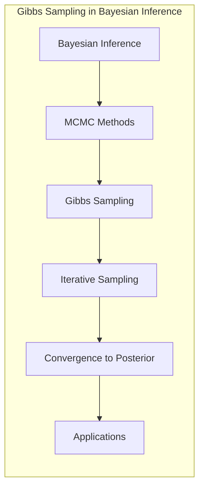
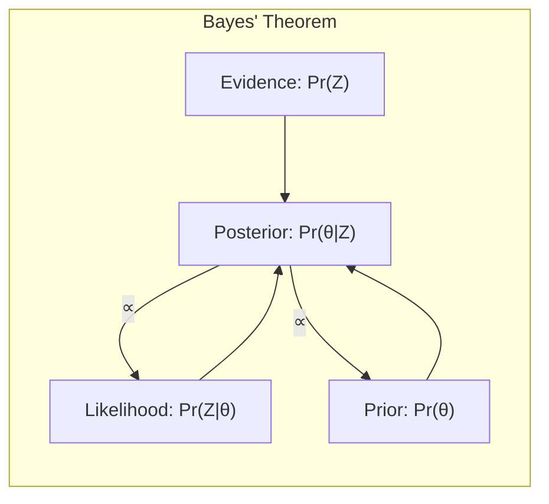
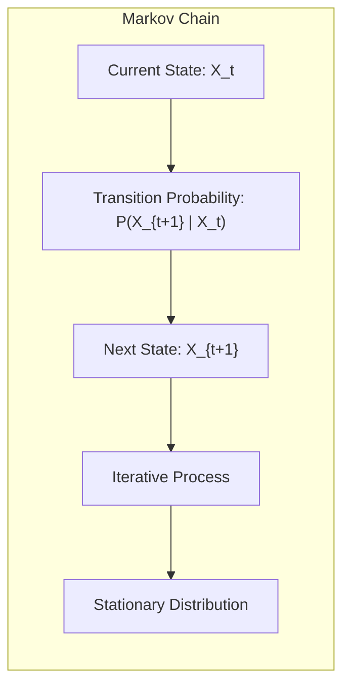
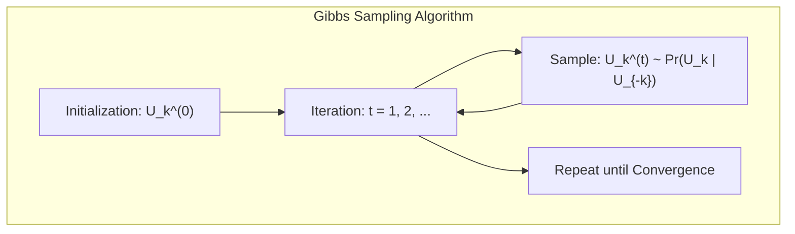
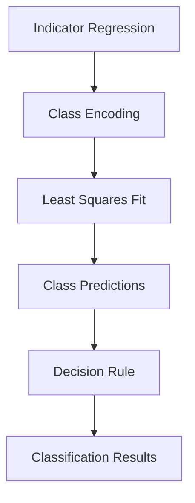
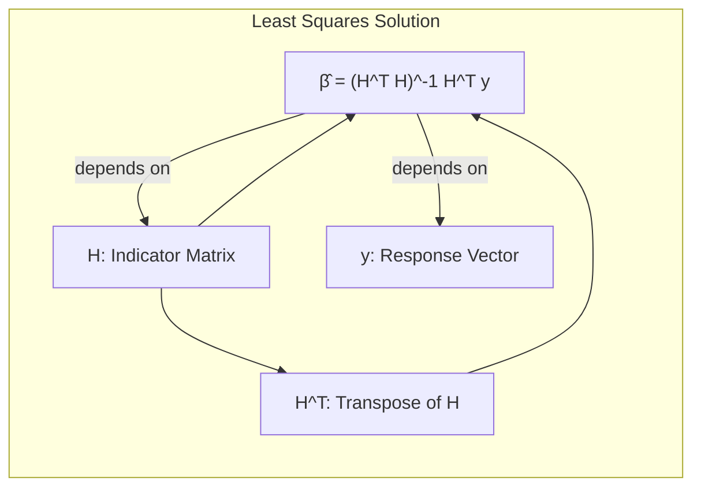
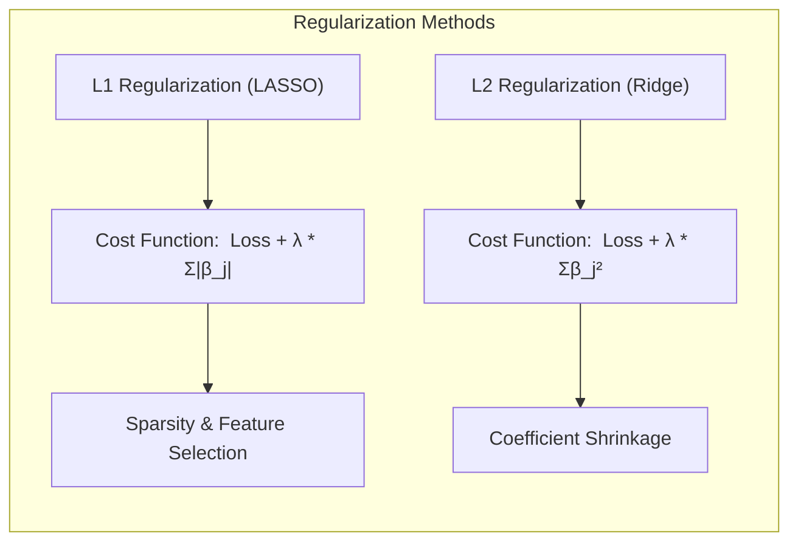
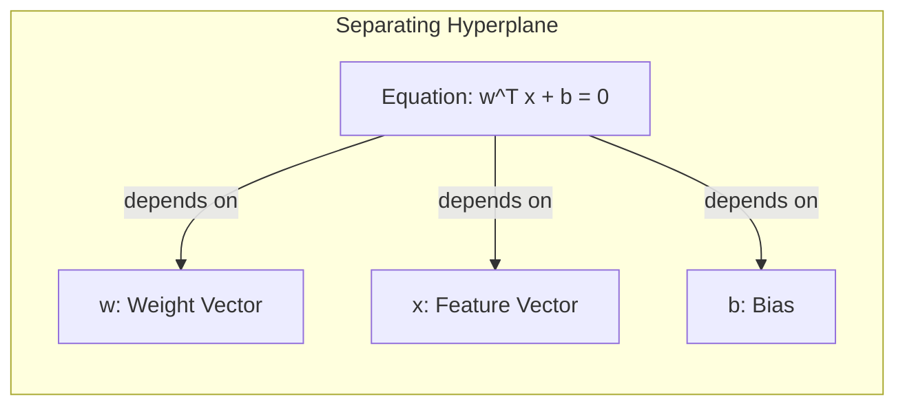
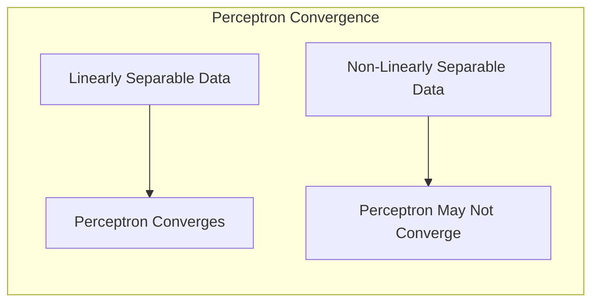

## Gibbs Sampling Convergence



### Introdução

O método de **Gibbs Sampling** é uma técnica crucial no campo da **inferência Bayesiana** e, de maneira mais geral, em **métodos de Monte Carlo via Cadeias de Markov (MCMC)**. Este método se destaca por sua capacidade de gerar amostras de distribuições de probabilidade complexas, particularmente aquelas para as quais a amostragem direta é inviável. Como um caso especial de MCMC, o Gibbs Sampling iterativamente amostra cada variável aleatória condicionada às outras, formando uma cadeia de Markov cuja distribuição estacionária coincide com a distribuição alvo conjunta [^8.6]. O objetivo deste capítulo é explorar os detalhes da convergência do Gibbs Sampling, um tópico de grande importância para a aplicação correta e eficaz deste método.

### Conceitos Fundamentais

**Conceito 1: Inferência Bayesiana e Amostragem Posterior**

Em inferência Bayesiana, nosso objetivo é inferir informações sobre parâmetros desconhecidos (θ) dado um conjunto de dados observados (Z). A base para esta inferência é o **teorema de Bayes**, que define a **distribuição posterior**, $Pr(\theta|Z)$, como proporcional ao produto da **verossimilhança** (a probabilidade dos dados dado os parâmetros, $Pr(Z|\theta)$) e a **distribuição a priori** dos parâmetros ($Pr(\theta)$):

$$
Pr(\theta|Z) = \frac{Pr(Z|\theta)Pr(\theta)}{Pr(Z)}
$$


A amostragem da distribuição posterior, muitas vezes, é desafiadora devido à complexidade da mesma. O Gibbs Sampling oferece uma maneira de obter amostras da distribuição posterior sem precisar computar a distribuição explicitamente, o que a torna aplicável em uma vasta gama de problemas [^8.6].

> 💡 **Exemplo Numérico:**
>
> Suponha que queremos inferir a média ($\mu$) e a variância ($\sigma^2$) de uma distribuição normal com base em dados observados. Usando a inferência Bayesiana, precisamos definir uma distribuição a priori para $\mu$ e $\sigma^2$. Vamos supor que $\mu \sim \mathcal{N}(\mu_0, \tau_0^2)$ e $\sigma^2 \sim \text{Inv-Gamma}(\alpha_0, \beta_0)$. A distribuição posterior conjunta, $Pr(\mu, \sigma^2 | Z)$, é complexa. No entanto, com Gibbs Sampling, podemos amostrar iterativamente de distribuições condicionais:
>
>   1. $Pr(\mu | \sigma^2, Z)$ (a distribuição posterior de $\mu$ dada $\sigma^2$ e os dados)
>   2. $Pr(\sigma^2 | \mu, Z)$ (a distribuição posterior de $\sigma^2$ dada $\mu$ e os dados)
>
> Estas distribuições condicionais costumam ser mais fáceis de amostrar do que a distribuição posterior conjunta. Este processo iterativo gera amostras que, após o *burn-in*, representam a distribuição posterior conjunta de $\mu$ e $\sigma^2$.
>
>   *Dados de exemplo*:
>    ```python
>    import numpy as np
>    import matplotlib.pyplot as plt
>    from scipy.stats import norm, invgamma
>
>    # Simulação dos dados
>    np.random.seed(42)
>    mu_true = 5
>    sigma_true = 2
>    Z = np.random.normal(mu_true, sigma_true, 100)
>
>    # Priors
>    mu0 = 0
>    tau0 = 10
>    alpha0 = 2
>    beta0 = 2
>
>    # Gibbs Sampling
>    num_iterations = 5000
>    mu_samples = np.zeros(num_iterations)
>    sigma2_samples = np.zeros(num_iterations)
>
>    mu_samples[0] = 0  # Initial values
>    sigma2_samples[0] = 1
>
>    for i in range(1, num_iterations):
>        # Sample mu
>        tau_n = 1 / (1/tau0**2 + len(Z) / sigma2_samples[i-1])
>        mu_n = tau_n * (mu0/tau0**2 + np.sum(Z) / sigma2_samples[i-1])
>        mu_samples[i] = np.random.normal(mu_n, np.sqrt(tau_n))
>
>        # Sample sigma2
>        alpha_n = alpha0 + len(Z)/2
>        beta_n = beta0 + 0.5 * np.sum((Z - mu_samples[i])**2)
>        sigma2_samples[i] = invgamma.rvs(alpha_n, scale=beta_n)
>    
>    # Plotting
>    fig, axs = plt.subplots(2, 1, figsize=(10, 8))
>    axs[0].plot(mu_samples[500:], label=r'$\mu$ samples')
>    axs[0].axhline(y=mu_true, color='r', linestyle='--', label=r'True $\mu$')
>    axs[0].set_ylabel('mu')
>    axs[0].legend()
>
>    axs[1].plot(sigma2_samples[500:], label=r'$\sigma^2$ samples')
>    axs[1].axhline(y=sigma_true**2, color='r', linestyle='--', label=r'True $\sigma^2$')
>    axs[1].set_ylabel('sigma2')
>    axs[1].set_xlabel('Iteration')
>    axs[1].legend()
>
>    plt.tight_layout()
>    plt.show()
>    ```
>  Este código ilustra como o Gibbs sampling itera entre amostras de mu e sigma2, convergindo para os verdadeiros valores dos parâmetros, após um período de burn-in (neste exemplo descartamos as primeiras 500 amostras).

**Lemma 1:** O Gibbs Sampling gera uma cadeia de Markov cuja distribuição estacionária é a distribuição alvo conjunta [^8.6].
*Prova:* A prova deste lemma envolve demonstrar que o núcleo de transição da cadeia de Markov satisfaz a condição de reversibilidade (ou balanceamento detalhado) em relação à distribuição alvo. Em termos práticos, isso significa que se as variáveis aleatórias são sorteadas de acordo com a distribuição condicional, a distribuição conjunta da cadeia de Markov converge para a distribuição conjunta desejada. $\blacksquare$

**Conceito 2: Cadeias de Markov e Distribuição Estacionária**

Uma **Cadeia de Markov** é um processo estocástico que se move de um estado para outro, onde a probabilidade de transição depende apenas do estado atual. O Gibbs Sampling constrói uma cadeia de Markov onde os estados são amostras dos parâmetros. A **distribuição estacionária** de uma cadeia de Markov é aquela para a qual a distribuição do estado atual converge após um grande número de iterações. Para o Gibbs Sampling, essa distribuição estacionária é a distribuição posterior de interesse [^8.6].

**Corolário 1:** Sob condições de regularidade, a distribuição gerada pelo Gibbs Sampling converge para a distribuição alvo após um período de *burn-in*. O *burn-in* é o período inicial de iterações descartadas, que serve para que a cadeia se aproxime da distribuição estacionária [^8.6].

> 💡 **Exemplo Numérico:**
>
>  Vamos imaginar uma cadeia de Markov simples onde temos dois estados possíveis: 0 e 1. A matriz de transição é definida como:
>
>  $$
>    P = \begin{bmatrix}
>        0.7 & 0.3 \\
>        0.4 & 0.6
>    \end{bmatrix}
>  $$
>
>  Onde $P_{ij}$ é a probabilidade de transição do estado *i* para o estado *j*. Se iniciarmos no estado 0, a sequência de estados da cadeia de Markov poderia ser algo como 0, 0, 1, 0, 1, 1, 1, 0, .... Ao longo de muitas iterações, a proporção de vezes que a cadeia está em cada estado converge para a distribuição estacionária.
>
>  ```python
>  import numpy as np
>  import matplotlib.pyplot as plt
>
>  P = np.array([[0.7, 0.3], [0.4, 0.6]])
>  initial_state = 0
>  num_iterations = 1000
>
>  states = [initial_state]
>  for _ in range(num_iterations):
>        current_state = states[-1]
>        next_state = np.random.choice([0, 1], p=P[current_state])
>        states.append(next_state)
>  
>  state_0_count = np.cumsum(np.array(states) == 0)
>  state_1_count = np.cumsum(np.array(states) == 1)
>  
>  state_0_prop = state_0_count / np.arange(1, num_iterations + 2)
>  state_1_prop = state_1_count / np.arange(1, num_iterations + 2)
>  
>  plt.figure(figsize=(8, 5))
>  plt.plot(state_0_prop, label='Proporção de estado 0')
>  plt.plot(state_1_prop, label='Proporção de estado 1')
>  plt.xlabel('Iteração')
>  plt.ylabel('Proporção de Ocorrências')
>  plt.title('Convergência da Cadeia de Markov')
>  plt.legend()
>  plt.grid(True)
>  plt.show()
>  ```
> Este código mostra a convergência das proporções de cada estado para a distribuição estacionária. No início, as proporções variam bastante, mas à medida que o número de iterações aumenta, elas se estabilizam, ilustrando a ideia de distribuição estacionária. Em Gibbs Sampling, o mesmo princípio se aplica à convergência das amostras para a distribuição posterior. O burn-in seria um corte inicial para que as amostras representem a distribuição estacionária.

**Conceito 3: Algoritmo de Gibbs Sampling**

O algoritmo de Gibbs Sampling para amostragem da distribuição conjunta de variáveis aleatórias $U_1, U_2,...,U_K$ consiste nos seguintes passos [^8.6]:

1.  Inicialização: Escolher valores iniciais para cada variável $U_k^{(0)}$, $k = 1, 2, \ldots, K$.
2.  Iteração: Para $t = 1, 2, \ldots$:
    -   Para $k = 1, 2, \ldots, K$, gerar um novo valor $U_k^{(t)}$ da distribuição condicional $Pr(U_k | U_1^{(t)}, \ldots, U_{k-1}^{(t)}, U_{k+1}^{(t-1)}, \ldots, U_K^{(t-1)})$.
3.  Repetição: Repetir o passo 2 até que a distribuição conjunta dos $U_k^{(t)}$ não mude significativamente.


> ⚠️ **Nota Importante:** O Gibbs Sampling é particularmente útil quando as distribuições condicionais são mais simples de amostrar do que a distribuição conjunta.

### Regressão Linear e Mínimos Quadrados para Classificação

Em problemas de classificação, a **regressão linear** sobre uma matriz de indicadores pode ser utilizada para modelar a probabilidade de pertencimento a cada classe. A ideia é codificar as classes com vetores de indicadores e aplicar mínimos quadrados para obter um modelo que prevê um valor para cada classe. No entanto, essa abordagem pode sofrer de algumas limitações.


**Explicação:** Este diagrama ilustra o fluxo do processo de regressão de indicadores para a classificação, mostrando desde a codificação das classes até a decisão final [^4.2].

A regressão linear em matriz de indicadores minimiza a soma dos quadrados dos erros entre as previsões e os valores dos indicadores de classe. A solução para o vetor de coeficientes (β) é dada por:

$$
\hat{\beta} = (H^T H)^{-1} H^T y
$$

Onde *H* é a matriz de indicadores, e *y* é o vetor de respostas. A partir das previsões, é possível aplicar uma regra de decisão (por exemplo, escolher a classe com maior probabilidade) para realizar a classificação.


> 💡 **Exemplo Numérico:**
>
>   Suponha que temos um problema de classificação com 3 classes e 2 features. A matriz de indicadores *H* (com as colunas de indicadores para cada classe) e o vetor de respostas *y* (codificado com 1 para a classe correta e 0 para as outras) podem ser:
>
>   $$
>   H = \begin{bmatrix}
>       1 & 0 & 0 & 1 & 2 \\
>       0 & 1 & 0 & 2 & 1 \\
>       0 & 0 & 1 & 3 & 3 \\
>       1 & 0 & 0 & 4 & 4 \\
>       0 & 1 & 0 & 5 & 5
>   \end{bmatrix}
>  \text{, }
>   y = \begin{bmatrix}
>       1 & 0 & 0 \\
>       0 & 1 & 0 \\
>       0 & 0 & 1 \\
>       1 & 0 & 0 \\
>       0 & 1 & 0
>   \end{bmatrix}
>   $$
>
> Aqui, as 3 primeiras colunas de H representam o encoding one-hot das classes e as duas últimas as features. O y representa 5 observações, com o número 1 indicando a classe correta em cada observação. Para encontrar os coeficientes $\beta$ por mínimos quadrados, primeiro calculamos $H^T H$:
>
> $$
> H^T H = \begin{bmatrix}
> 3 & 0 & 0 & 8 & 10\\
> 0 & 2 & 0 & 7 & 6 \\
> 0 & 0 & 1 & 3 & 3\\
> 8 & 7 & 3 & 55 & 54 \\
> 10 & 6 & 3 & 54 & 55
>  \end{bmatrix}
> $$
>  Então, calculamos a inversa $(H^T H)^{-1}$ e $H^T y$:
>
> $$
> (H^T H)^{-1} \approx \begin{bmatrix}
>   0.775  &  -0.196 &  -0.020  &  -0.125 &   0.062 \\
>  -0.196  &   0.856 &  -0.012  &  -0.049 &   0.050\\
> -0.020  &  -0.012   & 1.073  &  -0.071 &   -0.071\\
> -0.125 &   -0.049  &  -0.071  &   0.085  &  -0.030\\
>  0.062   &  0.050 &  -0.071  &  -0.030 &   0.073
>  \end{bmatrix}
>  $$
>
> $$
>   H^T y = \begin{bmatrix}
>      2 & 0 & 0 \\
>      0 & 2 & 0 \\
>      0 & 0 & 1 \\
>      5 & 7 & 3 \\
>      6 & 6 & 3
>   \end{bmatrix}
>  $$
>
>  Finalmente, $\hat{\beta} = (H^T H)^{-1} H^T y$:
>
> $$
> \hat{\beta} \approx \begin{bmatrix}
>  0.892 &  -0.492 &  -0.083 \\
> -0.371  &   1.636 &  -0.051 \\
> -0.068 &   -0.034  &   0.856 \\
>  -0.222 &   -0.137 &  -0.148 \\
>  0.070  &  0.114 &   -0.108
>  \end{bmatrix}
> $$
>
> Os coeficientes $\hat{\beta}$ obtidos por mínimos quadrados permitem calcular previsões para novas amostras. No entanto, essas previsões não são restritas a um intervalo entre 0 e 1, o que pode levar a resultados difíceis de interpretar como probabilidades.
>
>   ```python
>   import numpy as np
>   from sklearn.linear_model import LinearRegression
>
>   # Dados de exemplo
>   H = np.array([[1, 0, 0, 1, 2],
>                  [0, 1, 0, 2, 1],
>                  [0, 0, 1, 3, 3],
>                  [1, 0, 0, 4, 4],
>                  [0, 1, 0, 5, 5]])
>   y = np.array([[1, 0, 0],
>                  [0, 1, 0],
>                  [0, 0, 1],
>                  [1, 0, 0],
>                  [0, 1, 0]])
>   
>   # Regressão linear
>   model = LinearRegression()
>   model.fit(H, y)
>   beta_hat = model.coef_
>   print("Coefficients Beta:\n", beta_hat)
>  
>   # Previsão com novos dados
>   new_data = np.array([[1, 0, 0, 2, 2]])
>   predictions = model.predict(new_data)
>   print("Predictions:\n", predictions)
>   ```

**Lemma 2:** A regressão linear em matriz de indicadores pode levar a estimativas de probabilidade que não estão no intervalo [0,1], dificultando a interpretação das previsões como probabilidades verdadeiras [^4.2].
*Prova:* Isso ocorre porque a regressão linear não impõe restrições sobre o intervalo de valores das previsões. Em casos onde a covariância entre as classes é alta, as estimativas podem extrapolar para fora desse intervalo. $\blacksquare$

**Corolário 2:** Em alguns cenários, a regressão logística pode ser uma alternativa mais adequada devido à sua natureza probabilística, garantindo que as previsões estejam sempre entre 0 e 1 [^4.4]. A regressão logística modela a probabilidade de pertencimento a uma classe por meio de uma função sigmoide.

> ❗ **Ponto de Atenção**: A escolha entre regressão linear em matriz de indicadores e regressão logística depende das características dos dados e da necessidade de obter estimativas de probabilidade bem calibradas.

### Métodos de Seleção de Variáveis e Regularização em Classificação

A seleção de variáveis e a regularização são técnicas cruciais para evitar *overfitting* e melhorar a generalização de modelos de classificação [^4.5]. Modelos mais complexos podem apresentar alto desempenho nos dados de treinamento, mas podem ter baixo desempenho em novos dados. Regularização adiciona uma penalização à função de perda, restringindo o crescimento dos coeficientes.

A regularização L1 (LASSO) e L2 (Ridge) são abordagens comuns [^4.5]:

-   **Regularização L1:** Adiciona uma penalização proporcional à soma dos valores absolutos dos coeficientes. Favorece modelos esparsos (com muitos coeficientes iguais a zero), realizando seleção de variáveis.
$$
\text{Custo} =  \text{Perda} + \lambda \sum_{j=1}^{p} |\beta_j|
$$
-   **Regularização L2:** Adiciona uma penalização proporcional à soma dos quadrados dos coeficientes. Reduz a magnitude dos coeficientes, evitando que eles cresçam muito.
$$
\text{Custo} =  \text{Perda} + \lambda \sum_{j=1}^{p} \beta_j^2
$$

**Explicação:** Este diagrama mostra como as regularizações L1 e L2 influenciam as propriedades dos modelos de classificação, como sparsity, interpretabilidade e estabilidade.

> 💡 **Exemplo Numérico:**
>
>   Vamos usar um problema de regressão linear com 10 variáveis preditoras, algumas mais importantes que outras. Usaremos um conjunto de dados simulado. O objetivo é comparar como a regularização L1 (LASSO) e L2 (Ridge) afetam os coeficientes do modelo.
>
>   ```python
>   import numpy as np
>   import matplotlib.pyplot as plt
>   from sklearn.linear_model import Lasso, Ridge
>   from sklearn.model_selection import train_test_split
>   from sklearn.metrics import mean_squared_error
>
>   # Gerar dados de exemplo
>   np.random.seed(42)
>   n_samples = 100
>   n_features = 10
>   X = np.random.rand(n_samples, n_features)
>   true_coef = np.array([5, -3, 2, 0, 0, 0, 0, 0.5, -1.5, 0]) # apenas 5 features são relevantes
>   y = X @ true_coef + np.random.normal(0, 1, n_samples)
>   
>   # Divisão em treino e teste
>   X_train, X_test, y_train, y_test = train_test_split(X, y, test_size=0.3, random_state=42)
>
>   # Regularização L1 (LASSO)
>   lasso = Lasso(alpha=0.1)
>   lasso.fit(X_train, y_train)
>   y_pred_lasso = lasso.predict(X_test)
>   mse_lasso = mean_squared_error(y_test, y_pred_lasso)
>
>   # Regularização L2 (Ridge)
>   ridge = Ridge(alpha=1)
>   ridge.fit(X_train, y_train)
>   y_pred_ridge = ridge.predict(X_test)
>   mse_ridge = mean_squared_error(y_test, y_pred_ridge)
>
>   # OLS sem regularização
>   ols = LinearRegression()
>   ols.fit(X_train,y_train)
>   y_pred_ols = ols.predict(X_test)
>   mse_ols = mean_squared_error(y_test, y_pred_ols)
>
>   # Plot
>   plt.figure(figsize=(10, 6))
>   plt.plot(true_coef, 'bo-', label='True Coefficients', markersize=4)
>   plt.plot(lasso.coef_, 'ro-', label='LASSO Coefficients', markersize=4)
>   plt.plot(ridge.coef_, 'go-', label='Ridge Coefficients', markersize=4)
>   plt.plot(ols.coef_, 'co-', label='OLS Coefficients', markersize=4)
>   plt.xlabel('Feature Index')
>   plt.ylabel('Coefficient Value')
>   plt.title('Coefficients Comparison')
>   plt.legend()
>   plt.grid(True)
>   plt.show()
>
>    # Resultados
>   print(f"MSE OLS: {mse_ols:.4f}")
>   print(f"MSE LASSO: {mse_lasso:.4f}")
>   print(f"MSE Ridge: {mse_ridge:.4f}")
>    
>   # Comparison table
>   print("\nComparison Table:")
>   print("| Method | MSE      | # Non-Zero Coefs |")
>   print("|--------|----------|-----------------|")
>   print(f"| OLS    | {mse_ols:.4f} | {np.sum(ols.coef_ != 0)}             |")
>   print(f"| LASSO  | {mse_lasso:.4f} | {np.sum(lasso.coef_ != 0)}             |")
>   print(f"| Ridge  | {mse_ridge:.4f} | {np.sum(ridge.coef_ != 0)}            |")
>   ```
>
> Este exemplo mostra que o LASSO (L1) zera os coeficientes de variáveis menos importantes, realizando seleção de variáveis. O Ridge (L2), por outro lado, reduz a magnitude dos coeficientes, mas não os zera, ajudando a estabilizar o modelo. A tabela mostra como cada método afeta o MSE e a esparsidade dos coeficientes, evidenciando os benefícios da regularização.

**Lemma 3:** A penalização L1 em modelos de classificação logística promove a esparsidade dos coeficientes, o que é útil para a seleção de variáveis e para a interpretação do modelo [^4.4.4].
*Prova:* A penalização L1 é não diferenciável no zero, o que força alguns coeficientes a serem exatamente zero quando otimizados, ao contrário da L2, que apenas os reduz a pequenos valores. $\blacksquare$

**Corolário 3:**  A combinação de L1 e L2 (Elastic Net) oferece um meio de equilibrar a esparsidade com a estabilidade, permitindo a seleção de variáveis e o controle da magnitude dos coeficientes [^4.5].

> ✔️ **Destaque**: A regularização é essencial para melhorar a generalização e a interpretabilidade dos modelos de classificação, e a escolha da penalização (L1, L2 ou Elastic Net) deve ser feita com base nos objetivos do modelo.

### Separating Hyperplanes e Perceptrons

Um **hiperplano separador** é uma estrutura que divide um espaço de dados em regiões distintas, com o objetivo de separar as classes em um problema de classificação [^4.5.2]. Em sua forma mais simples, um hiperplano separador é definido por uma equação linear da forma:

$$
w^T x + b = 0
$$


Onde *w* é o vetor de pesos, *x* é o vetor de características e *b* é o viés. O problema de encontrar o melhor hiperplano separador é um problema de otimização, frequentemente resolvido utilizando técnicas como a programação linear ou o método de *Support Vector Machines (SVM)*.

**Perceptrons** são uma forma inicial de redes neurais artificiais que aprendem a separar dados linearmente separáveis. Eles atualizam os pesos através de um processo iterativo, com o objetivo de encontrar um hiperplano que separa as classes corretamente [^4.5.1].

> 💡 **Exemplo Numérico:**
>
>   Vamos considerar um exemplo simples em duas dimensões onde temos dois conjuntos de pontos, que representam duas classes, e que podem ser separados por uma linha reta (um hiperplano em 2D). O objetivo é encontrar os parâmetros do perceptron (pesos w e viés b) para separar as classes:
>
>  ```python
>   import numpy as np
>   import matplotlib.pyplot as plt
>
>   # Dados de exemplo
>   X = np.array([[1, 1], [2, 2], [2, 0], [3, 1], [0, 0], [1, -1], [0,-2], [-1, -1]])
>   y = np.array([1, 1, 1, 1, -1, -1, -1, -1])
>
>   # Inicialização do Perceptron
>   w = np.array([0.1, -0.2])
>   b = 0
>   learning_rate = 0.1
>   epochs = 50
>
>   # Função para previsão
>   def predict(x, w, b):
>     return 1 if np.dot(w, x) + b > 0 else -1
>
>   # Perceptron algorithm
>   for epoch in range(epochs):
>     for i, x in enumerate(X):
>       y_hat = predict(x, w, b)
>       if y_hat != y[i]:
>         w = w + learning_rate * y[i] * x
>         b = b + learning_rate * y[i]
>
>   # Plot
>   plt.figure(figsize=(8, 6))
>   plt.scatter(X[y == 1, 0], X[y == 1, 1], color='blue', label='Class 1')
>   plt.scatter(X[y == -1, 0], X[y == -1, 1], color='red', label='Class -1')
>   
>   x_min, x_max = X[:, 0].min() - 1, X[:, 0].max() + 1
>   y_min, y_max = X[:, 1].min() - 1, X[:, 1].max() + 1
>   xx, yy = np.meshgrid(np.arange(x_min, x_max, 0.02),
>                        np.arange(y_min, y_max, 0.02))
>   Z = np.array([predict(np.array([x,y]), w, b) for x, y in np.c_[xx.ravel(), yy.ravel()]])
>   Z = Z.reshape(xx.shape)
>   plt.contourf(xx, yy, Z, cmap=plt.cm.RdBu, alpha=0.6)
>
>   plt.xlabel('Feature 1')
>   plt.ylabel('Feature 2')
>   plt.title('Perceptron Separating Hyperplane')
>   plt.legend()
>   plt.grid(True)
>   plt.show()
>
>   print("Final weights:", w)
>   print("Final bias:", b)
> ```
> Este código implementa o algoritmo do perceptron e ilustra a convergência dos pesos e o viés para a obtenção de um hiperplano separador. Os dados são inicialmente separados por uma linha reta (o hiperplano em 2D), e o perceptron ajusta iterativamente os pesos para garantir que os pontos de classes diferentes estejam em lados opostos da linha.

**Lemma 4:** O perceptron converge para um hiperplano separador (se este existir) em um número finito de passos para dados linearmente separáveis [^4.5.1].
*Prova:* O algoritmo do perceptron garante convergência quando os dados são linearmente separáveis, pois as atualizações dos pesos garantem um aumento progressivo da separação entre as classes. $\blacksquare$

**Corolário 4:** Em dados não linearmente separáveis, o perceptron não garante convergência e pode entrar em um ciclo de atualizações de pesos sem convergir para uma solução [^4.5.1].


### Pergunta Teórica Avançada: Como o Gibbs Sampling se relaciona com a Distribuição Posterior e o *Burn-in*?

**Resposta:**
O Gibbs Sampling é uma técnica MCMC que visa obter amostras da distribuição posterior (alvo) de um modelo Bayesiano. O algoritmo iterativamente amostra cada parâmetro condicionado aos valores atuais dos outros parâmetros, formando uma cadeia de Markov. A convergência para a distribuição posterior é um conceito chave.

A distribuição estacionária da cadeia de Markov gerada pelo Gibbs Sampling é igual à distribuição posterior alvo, e o período de *burn-in* é essencial para que a cadeia