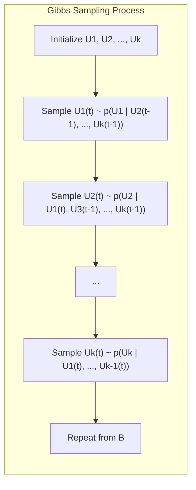
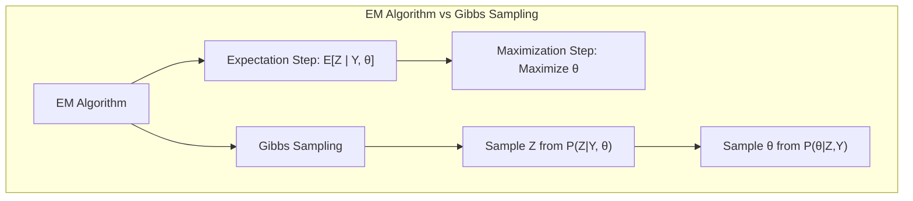
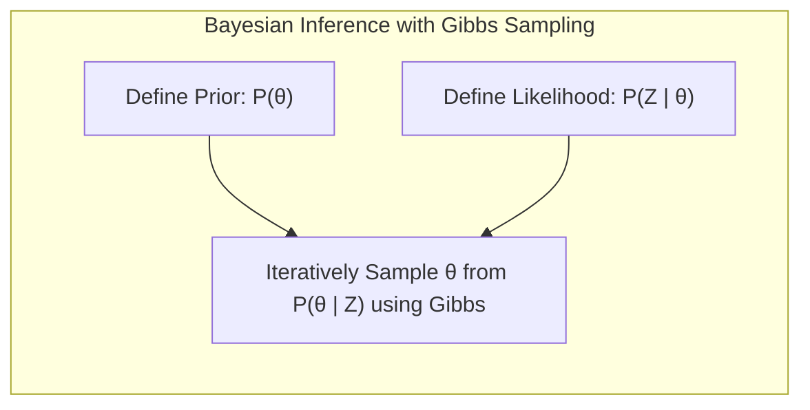
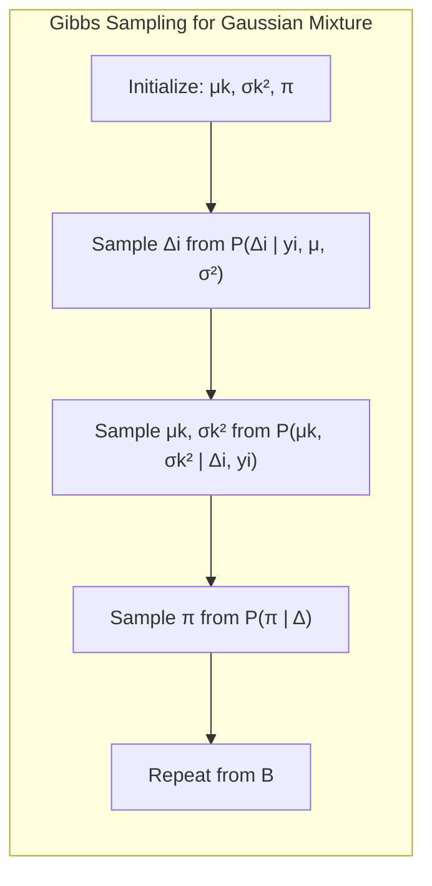
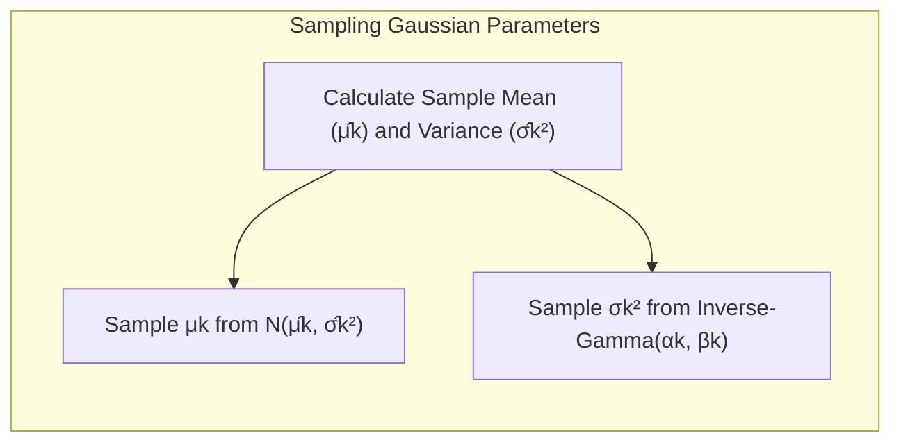
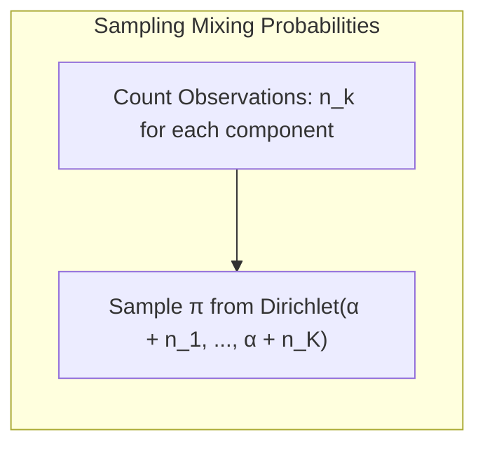
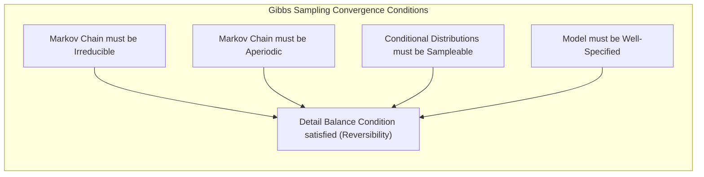
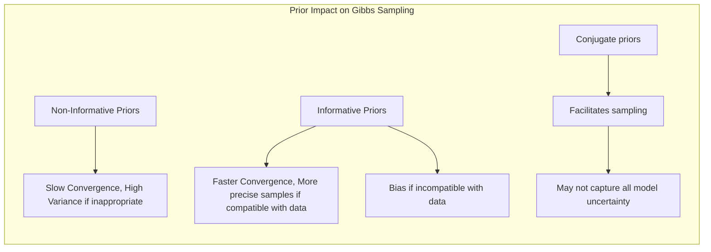
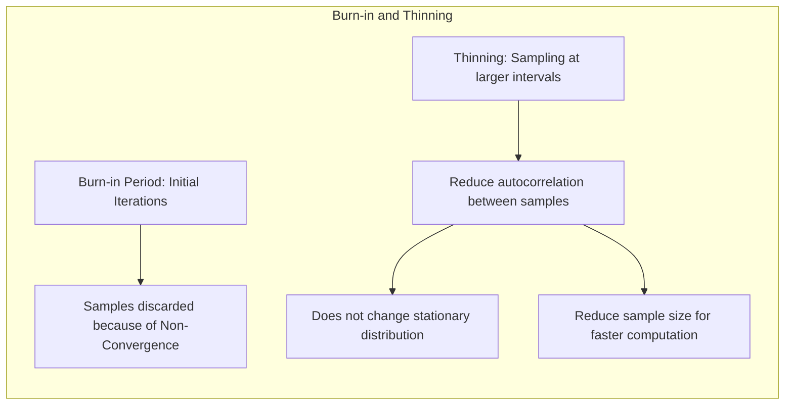

## Estimation with Gibbs Samples



### Introdução

O processo de **inferência estatística** em modelos complexos frequentemente envolve a estimação de parâmetros ou a obtenção de amostras de distribuições posteriores complexas. Métodos como o **Maximum Likelihood** (ML) fornecem estimativas pontuais, mas não quantificam a incerteza associada a essas estimativas. O framework **Bayesiano**, por outro lado, busca modelar a incerteza através da definição de distribuições *a priori* e *a posteriori*. No entanto, calcular essas distribuições analiticamente pode ser inviável para a maioria dos problemas, e é aí que as técnicas de amostragem de **Markov Chain Monte Carlo (MCMC)** se tornam essenciais, como o **Gibbs Sampling**, [^8.6] e [^8.6.1].

### Conceitos Fundamentais

**Conceito 1: Amostragem a partir de distribuições condicionais**

O **Gibbs sampling** é um algoritmo **MCMC** que gera uma sequência de amostras a partir de uma distribuição conjunta, amostrando iterativamente cada variável aleatória condicionalmente a todas as outras [^8.6]. A ideia central é que, embora a distribuição conjunta possa ser complexa, as distribuições condicionais muitas vezes são mais simples e fáceis de amostrar. Este método é particularmente útil em problemas de alta dimensão onde a amostragem direta é difícil, [^8.6.1].

> 💡 **Exemplo Numérico:** Imagine que temos três variáveis aleatórias, $U_1$, $U_2$, e $U_3$, cuja distribuição conjunta é complexa.  No Gibbs sampling, iterativamente amostramos:
>
> 1.  $U_1^{(t)} \sim p(U_1 | U_2^{(t-1)}, U_3^{(t-1)})$
> 2.  $U_2^{(t)} \sim p(U_2 | U_1^{(t)}, U_3^{(t-1)})$
> 3.  $U_3^{(t)} \sim p(U_3 | U_1^{(t)}, U_2^{(t)})$
>
> Em cada iteração 't', usamos os valores mais recentes para amostrar a próxima variável. Após várias iterações, as amostras $(U_1^{(t)}, U_2^{(t)}, U_3^{(t)})$ convergem para amostras da distribuição conjunta desejada. Por exemplo, se as distribuições condicionais forem Gaussianas, a amostragem de cada variável torna-se relativamente simples.
>
> ```python
> import numpy as np
> from scipy.stats import norm
>
> # Define conditional sampling functions (example using Gaussian)
> def sample_U1(U2, U3, mu1=1, sigma1=1):
>  mu_cond = mu1 + 0.5*(U2 - 1) + 0.3*(U3 - 2) # Example conditional mean
>  return norm.rvs(mu_cond, sigma1)
>
> def sample_U2(U1, U3, mu2=2, sigma2=1.2):
>   mu_cond = mu2 + 0.6*(U1 - 1) + 0.4*(U3 - 2)
>   return norm.rvs(mu_cond, sigma2)
>
> def sample_U3(U1, U2, mu3=3, sigma3=1.5):
>   mu_cond = mu3 + 0.2*(U1 - 1) + 0.7*(U2 - 2)
>   return norm.rvs(mu_cond, sigma3)
>
> # Initialize random variables
> U1 = 0
> U2 = 0
> U3 = 0
> n_iterations = 1000
> samples = []
>
> for t in range(n_iterations):
>    U1 = sample_U1(U2, U3)
>    U2 = sample_U2(U1, U3)
>    U3 = sample_U3(U1, U2)
>    samples.append((U1,U2,U3))
>
> # Print first 10 samples to show the progression
> print(f"First 10 Samples:\n{samples[:10]}")
> ```
>
> Este exemplo ilustra como o Gibbs sampling itera através das variáveis, usando os valores mais recentes para amostrar a próxima, aproximando-se da distribuição conjunta desejada.


**Lemma 1:** A distribuição conjunta estacionária do Gibbs sampling é a distribuição alvo.

Seja $p(U_1, U_2, ..., U_K)$ a distribuição conjunta alvo de um conjunto de variáveis aleatórias $U_1, ..., U_K$. O Gibbs sampling realiza amostragens iterativas da forma:
$$
U_k^{(t)} \sim p(U_k | U_1^{(t)}, ..., U_{k-1}^{(t)}, U_{k+1}^{(t-1)}, ..., U_K^{(t-1)})
$$
onde $t$ representa a iteração. Após um período de *burn-in*, a sequência $(U_1^{(t)}, U_2^{(t)}, ..., U_K^{(t)})$ converge para amostras da distribuição alvo $p(U_1, U_2, ..., U_K)$.

*Prova:* (resumida) A prova envolve mostrar que a cadeia de Markov definida pelo Gibbs sampling é *aperiódica* e *irredutível*, o que garante a convergência para uma distribuição estacionária. A condição de detalhamento ou *reversibilidade* é também demonstrada, provando que a distribuição estacionária da cadeia é a distribuição alvo, [^8.6].$\blacksquare$

**Conceito 2: Relação com EM Algorithm**

O Gibbs sampling compartilha algumas semelhanças com o **EM algorithm**, especialmente em modelos exponenciais [^8.6.2] e [^8.6.3]. Ambos são procedimentos iterativos que envolvem a manipulação de dados observados e latentes, mas diferem em seu objetivo: enquanto o EM algorithm maximiza a *likelihood* através de uma sequência de passos de esperança e maximização, o Gibbs sampling gera amostras através de um processo iterativo de amostragem [^8.6.1]. No contexto do EM, o Gibbs sampling pode ser usado para amostrar das distribuições condicionais dos dados latentes, o que pode ser visto como uma variação do passo de *expectation* do EM, [^8.6.3].



**Corolário 1:** A similaridade entre Gibbs sampling e EM reside na manipulação dos dados latentes.

Em modelos com dados latentes $Z_m$, o EM algorithm estima os parâmetros do modelo $\theta$ maximizando a verossimilhança marginal, enquanto o Gibbs sampling amostra iterativamente os dados latentes e os parâmetros. Ambos utilizam a distribuição condicional $P(Z_m|Z, \theta)$, onde $Z$ são os dados observados. No EM, calculamos a esperança de $Z_m$, enquanto que no Gibbs, amostramos de $P(Z_m|Z, \theta)$, [^8.6.1] e [^8.6.3].

> 💡 **Exemplo Numérico:** Considere um modelo simples de mistura com duas componentes Gaussianas, onde temos dados observados $Y$ e dados latentes $Z$ indicando a qual componente cada observação pertence.
>
> No EM Algorithm, no passo E, calcularíamos a probabilidade de cada observação pertencer a cada componente, ou seja, $E[Z_i|Y, \theta]$, que seria uma probabilidade. No passo M, usaríamos essas probabilidades para re-estimar os parâmetros $\theta$ (médias e variâncias das gaussianas).
>
> No Gibbs sampling, a cada iteração, amostraríamos $Z_i$ da distribuição $P(Z_i|Y,\theta)$, que é uma amostra da componente a que a observação pertence, e depois amostraríamos os parâmetros $\theta$ (médias e variâncias) condicionados aos valores de $Z$.
>
> A principal diferença é que o EM usa uma esperança de $Z$ no passo E, enquanto o Gibbs sampling amostra valores de $Z$ da distribuição condicional, introduzindo a variabilidade e a incerteza nas estimativas.

**Conceito 3: Inferência Bayesiana com Gibbs Sampling**

Em um cenário Bayesiano, o Gibbs sampling permite amostrar da distribuição posterior $P(\theta|Z)$ ao amostrar iterativamente cada componente do vetor de parâmetros $\theta$ [^8.6] e [^8.6.1]. Definimos um modelo hierárquico com *priores* $P(\theta)$ e *likelihood* $P(Z|\theta)$. A partir disso, amostramos iterativamente os parâmetros da distribuição posterior. Este método é particularmente útil quando a distribuição posterior é complexa e não tem uma forma analítica fechada.



### Amostragem de Misturas Gaussianas com Gibbs



Para ilustrar a aplicação do Gibbs sampling, considere o modelo de mistura gaussiana, onde cada observação $y_i$ pertence a uma das $K$ componentes gaussianas. Seja $\Delta_i$ uma variável latente indicando a qual componente pertence a observação $i$. O modelo é definido como:

$$ y_i|\mu_k, \sigma_k^2 \sim N(\mu_k, \sigma_k^2) \text{ com prob. } \pi_k, $$
$$ \Delta_i \sim Multinomial(\pi), $$

O Gibbs sampling amostra iterativamente os seguintes componentes:

1. **Amostragem das variáveis latentes:** Para cada observação $i$, amostra-se $\Delta_i$ da distribuição condicional:

   $$ P(\Delta_i=k | y_i, \mu, \sigma^2) \propto \pi_k N(y_i | \mu_k, \sigma_k^2) $$
   [^8.6], [^8.6.1] e [^8.6.3]

> 💡 **Exemplo Numérico:** Suponha que temos $K=2$ componentes Gaussianas e a observação $y_i = 2.5$. As médias e variâncias atuais são $\mu_1 = 1$, $\sigma_1^2 = 1$, $\mu_2 = 4$, $\sigma_2^2 = 0.5$, e as probabilidades de mistura são $\pi_1 = 0.4$ e $\pi_2 = 0.6$. Para amostrar $\Delta_i$, calculamos:
>
> $P(\Delta_i=1 | y_i, \mu, \sigma^2) \propto 0.4 \times N(2.5 | 1, 1) = 0.4 \times 0.1295 \approx 0.0518$
>
> $P(\Delta_i=2 | y_i, \mu, \sigma^2) \propto 0.6 \times N(2.5 | 4, 0.5) = 0.6 \times 0.032 \approx 0.0192$
>
> Normalizamos as probabilidades para obter uma distribuição válida:
>
> $P(\Delta_i=1 | y_i, \mu, \sigma^2) = \frac{0.0518}{0.0518 + 0.0192} \approx 0.73$
>
> $P(\Delta_i=2 | y_i, \mu, \sigma^2) = \frac{0.0192}{0.0518 + 0.0192} \approx 0.27$
>
> Amostramos $\Delta_i$ de uma distribuição Bernoulli com probabilidade 0.73 de ser da componente 1 e 0.27 de ser da componente 2.
>
> ```python
> import numpy as np
> from scipy.stats import norm
>
> # Parameters
> y_i = 2.5
> mu1, sigma1_sq = 1, 1
> mu2, sigma2_sq = 4, 0.5
> pi1, pi2 = 0.4, 0.6
>
> # Calculate probabilities
> prob1 = pi1 * norm.pdf(y_i, mu1, np.sqrt(sigma1_sq))
> prob2 = pi2 * norm.pdf(y_i, mu2, np.sqrt(sigma2_sq))
>
> # Normalize
> prob_norm1 = prob1/(prob1 + prob2)
> prob_norm2 = prob2/(prob1 + prob2)
>
> print(f"P(Delta_i=1 | y_i, mu, sigma^2) = {prob_norm1:.2f}")
> print(f"P(Delta_i=2 | y_i, mu, sigma^2) = {prob_norm2:.2f}")
>
> # Simulate the assignment
> delta_i = np.random.choice([1, 2], p=[prob_norm1, prob_norm2])
> print(f"Sampled Delta_i: {delta_i}")
> ```

2. **Amostragem dos parâmetros das Gaussianas:** Amostramos os parâmetros de cada componente gaussiana, $\mu_k$ e $\sigma_k^2$, condicionados aos dados e às variáveis latentes $\Delta_i$ associadas àquele componente:

   $$
       \mu_k | \Delta_i, y_i \sim N(\hat{\mu_k}, \hat{\sigma_k^2}), \\
       \sigma_k^2 | \Delta_i, y_i \sim Inverse-Gamma(\alpha_k, \beta_k)
   $$
    onde $\hat{\mu_k}$ e $\hat{\sigma_k^2}$ são as médias e variâncias amostrais e os hiperparâmetros $\alpha_k$ e $\beta_k$ vêm dos *priores* especificados.

> 💡 **Exemplo Numérico:** Se a componente $k=1$ tem 3 observações associadas: $y_1 = 0.5, y_2 = 1.2, y_3 = 1.8$, calculamos $\hat{\mu_1} = \frac{0.5+1.2+1.8}{3} = 1.167$ e $\hat{\sigma_1^2} = \frac{(0.5-1.167)^2 + (1.2-1.167)^2 + (1.8-1.167)^2}{3-1} \approx 0.373$. Supondo um prior para $\mu_k$ com média $m_0$ e variância $s_0^2$, e prior para $\sigma_k^2$ com $\alpha_0$ e $\beta_0$, podemos amostrar das distribuições condicionais. Por exemplo, se $m_0 = 0$, $s_0^2 = 2$, $\alpha_0=2$ e $\beta_0 = 2$, os parâmetros da distribuição posterior seriam usados para amostragem:
>  $\mu_1 | \Delta_i, y_i \sim N(\frac{s_0^2 n \hat{\mu_k} + \hat{\sigma_k^2} m_0}{s_0^2 n + \hat{\sigma_k^2}}, \frac{s_0^2 \hat{\sigma_k^2}}{s_0^2 n + \hat{\sigma_k^2}})$
>  $\sigma_1^2 | \Delta_i, y_i \sim Inverse-Gamma(\alpha_0 + n/2, \beta_0 + \frac{1}{2} \sum_{i\in \text{componente}_1} (y_i - \hat{\mu}_1)^2)$
>
>  ```python
>  import numpy as np
>  from scipy.stats import norm, invgamma
>  
>  # Observed Data for component 1
>  y_comp1 = np.array([0.5, 1.2, 1.8])
>  n = len(y_comp1)
>  
>  # Sample mean and variance
>  mu_hat = np.mean(y_comp1)
>  sigma_sq_hat = np.var(y_comp1, ddof=1) # Use unbiased sample variance
>  
>  # Priors for mu_k (mean, var)
>  mu_prior_mean = 0
>  mu_prior_var = 2
>  
>  # Priors for sigma_sq_k (alpha, beta)
>  sigma_sq_prior_alpha = 2
>  sigma_sq_prior_beta = 2
>  
>  # Parameters for posterior sampling of mu_k
>  mu_posterior_mean = (mu_prior_var * n * mu_hat + sigma_sq_hat * mu_prior_mean) / (mu_prior_var * n + sigma_sq_hat)
>  mu_posterior_var = (mu_prior_var * sigma_sq_hat) / (mu_prior_var * n + sigma_sq_hat)
>  
>  # Sample from posterior of mu_k
>  mu_k_sampled = norm.rvs(mu_posterior_mean, np.sqrt(mu_posterior_var))
>  print(f"Sampled mu_k: {mu_k_sampled:.2f}")
>
>  # Parameters for posterior of sigma_sq_k
>  sigma_sq_posterior_alpha = sigma_sq_prior_alpha + n/2
>  sigma_sq_posterior_beta = sigma_sq_prior_beta + 0.5 * np.sum((y_comp1 - mu_hat)**2)
>
>  # Sample from posterior of sigma_sq_k
>  sigma_sq_k_sampled = invgamma.rvs(sigma_sq_posterior_alpha, scale = sigma_sq_posterior_beta)
>  print(f"Sampled sigma_sq_k: {sigma_sq_k_sampled:.2f}")
>  ```



3.   **Amostragem das probabilidades de mistura:** As probabilidades de mistura $\pi$ são amostradas da distribuição condicional:

   $$
   \pi | \Delta \sim Dirichlet(\alpha + n_1, ..., \alpha + n_K)
   $$

     onde $n_k$ é o número de observações atribuídas à componente $k$, e $\alpha$ é um hiperparâmetro do prior.

> 💡 **Exemplo Numérico:** Se temos $K=2$ componentes, $\alpha=1$, e as contagens de observações nas componentes são $n_1 = 15$ e $n_2 = 25$, então a amostragem das probabilidades de mistura seria feita como $\pi | \Delta \sim Dirichlet(1+15, 1+25) = Dirichlet(16, 26)$. Amostraríamos um vetor de probabilidades para as misturas $\pi = (\pi_1, \pi_2)$, onde $\pi_1+\pi_2=1$.
>
> ```python
> import numpy as np
> from scipy.stats import dirichlet
>
> # Parameters
> alpha = 1
> n_k = np.array([15, 25]) # counts for each component
>
> # Parameters for Dirichlet
> dirichlet_params = alpha + n_k
>
> # Sample from Dirichlet
> pi_sampled = dirichlet.rvs(dirichlet_params)[0]
>
> print(f"Sampled mixing proportions pi: {pi_sampled}")
> ```



Através dessas amostragens iterativas, o Gibbs sampling gera uma cadeia de Markov que converge para a distribuição posterior conjunta dos parâmetros e variáveis latentes, e permite calcular estimativas e quantificar a incerteza associada. Em modelos exponenciais, como as misturas Gaussianas,  as amostras podem convergir mais rapidamente em comparação com modelos não-exponenciais, devido às propriedades de conjugação, [^8.6.1].

### Questões Teóricas Avançadas

#### Pergunta Teórica Avançada 1: Quais as condições necessárias para que o Gibbs sampling convirja para a distribuição alvo?

**Resposta:**

A convergência do Gibbs sampling para a distribuição alvo requer que a cadeia de Markov induzida pelas amostragens iterativas seja *irredutível* e *aperiódica*. *Irredutibilidade* significa que a cadeia pode, a partir de qualquer estado, atingir qualquer outro estado em um número finito de passos. *Aperiodicidade* significa que o tempo para retornar a um estado não é um múltiplo de um número inteiro maior que 1. Além dessas condições, é crucial que as distribuições condicionais sejam amostráveis e que o modelo esteja bem especificado. Em resumo, a condição de detalhamento, que garante a reversibilidade da cadeia, é fundamental para provar a convergência do Gibbs Sampling para sua distribuição estacionária (a distribuição alvo), [^8.6].$\blacksquare$



#### Pergunta Teórica Avançada 2: Como a escolha dos priors pode influenciar a convergência e as amostras obtidas pelo Gibbs sampling?

**Resposta:**

Os *priors* são um componente crucial na inferência Bayesiana e têm impacto significativo nas amostras produzidas pelo Gibbs sampling. *Priors* não-informativos (ou vagos) minimizam o impacto da informação anterior nos resultados, mas podem causar convergência lenta ou amostras com alta variância se não forem apropriados para o modelo ou dados. *Priors* informativos incorporam conhecimento prévio, e podem acelerar a convergência e gerar amostras mais precisas, mas se a informação prévia for muito forte e incompatível com os dados, pode haver um viés nas amostras e, consequentemente, em suas estimativas. A escolha de *priors* conjugados facilita a amostragem, mas nem sempre captura toda a incerteza do modelo. A influência de *priors* em *modelos hierárquicos* complexos requer uma análise cuidadosa, pois interagem com outros níveis do modelo, [^8.6].$\blacksquare$



> 💡 **Exemplo Numérico:**
>
> Suponha que estejamos modelando a média de uma distribuição normal e temos duas opções de prior para a média $\mu$:
>
> 1. **Prior não-informativo:** $p(\mu) \propto 1$ (prior uniforme). Este prior minimiza a influência da informação anterior, mas pode gerar amostras com grande variabilidade se a verossimilhança dos dados for fraca ou os dados forem poucos.
>
> 2.  **Prior informativo:** $p(\mu) \sim N(5, 1)$. Este prior assume que, *a priori*, a média tem uma distribuição normal com média 5 e desvio padrão 1. Se os dados estiverem realmente em torno de 5, este prior acelerará a convergência e gerará amostras mais precisas. No entanto, se os dados estiverem muito longe de 5 (ex: média amostral igual a 10), o prior pode polarizar as amostras na direção do valor prior e levar a estimativas enviesadas.
>
> A escolha do prior correto depende do problema e do conhecimento prévio. Um prior mal escolhido pode afetar significativamente a convergência e a qualidade das amostras. Um prior informativo precisa ser utilizado com cuidado para não introduzir um viés que não reflita os dados reais.

#### Pergunta Teórica Avançada 3: Qual a relação entre o conceito de "burn-in" e a convergência do Gibbs Sampling, e como o "thinning" pode impactar as amostras?

**Resposta:**

O *burn-in* é um período inicial das iterações do Gibbs sampling, onde as amostras geradas não são consideradas parte da distribuição alvo, pois a cadeia de Markov ainda não convergiu para uma distribuição estacionária. Amostras coletadas durante o *burn-in* podem exibir alta autocorrelacao e viés, e precisam ser descartadas. O número de iterações de *burn-in* é um hiperparâmetro e deve ser escolhido de acordo com a complexidade do problema e evidências de convergência. O *thinning* é uma técnica utilizada para diminuir a autocorrelacao entre amostras, selecionando apenas amostras de intervalos maiores (ex: amostrar a cada 10 iterações), [^8.6]. Embora o *thinning* não mude a distribuição estacionária, pode ser utilizado para reduzir o tamanho da amostra e acelerar computações posteriores. A escolha de *burn-in* e *thinning* é um balanço entre a acurácia e a eficiência computacional, [^8.6.1].$\blacksquare$



> 💡 **Exemplo Numérico:**
>
> Imagine que estamos amostrando os parâmetros de um modelo e o valor de um determinado parâmetro $\theta$ oscila bastante nas primeiras iterações do Gibbs Sampling. Este é o período de *burn-in*. Após um certo número de iterações, a cadeia parece se estabilizar em torno de uma determinada região, indicando a convergência para a distribuição estacionária. As amostras coletadas durante o *burn-in* são descartadas para não enviesar as inferências.
>
> Se a cadeia converge para a distribuição estacionária, mas as amostras ainda exibem alta autocorrelação (isto é, amostras consecutivas são muito semelhantes), podemos utilizar o *thinning*, amostrando apenas uma em cada $n$ iterações. Por exemplo, se escolhermos o *thinning* de 10, coletamos uma amostra a cada 10 iterações. Isso reduz o número de amostras e a autocorrelação, mas não altera a distribuição para a qual as amostras convergem, ajudando a acelerar cálculos posteriores e reduzir o tamanho da amostra.

### Conclusão

O Gibbs sampling é uma ferramenta poderosa para a inferência em modelos probabilísticos complexos, permitindo a amostragem de distribuições posteriores complexas e o cálculo de estimativas Bayesianas. A compreensão de sua relação com o EM algorithm, bem como o impacto das escolhas de *priors*, *burn-in*, e *thinning*, é essencial para um uso eficaz desta técnica. Apesar de ser amplamente utilizada, a aplicação correta requer cuidado e análise para garantir a convergência e a acurácia das amostras, [^8.6].

### Footnotes

[^8.6]: "Having defined a Bayesian model, one would like to draw samples from the resulting posterior distribution, in order to make inferences about the parameters. Except for simple models, this is often a difficult computational problem. In this section we discuss the Markov chain Monte Carlo (MCMC) approach to posterior sampling. We will see that Gibbs sampling, an MCMC procedure, is closely related to the EM algorithm: the main difference is that it samples from the conditional distributions rather than maximizing over them." *(Trecho de <Model Inference and Averaging>)*
[^8.6.1]: "Consider first the following abstract problem. We have random variables $U_1, U_2, \ldots, U_K$ and we wish to draw a sample from their joint distribution. Suppose this is difficult to do, but it is easy to simulate from the conditional distributions $Pr(U_j|U_1, U_2, \ldots, U_{j-1}, U_{j+1}, \ldots,U_k)$, $j = 1,2,\ldots, K$. The Gibbs sampling procedure alternatively simulates from each of these distributions and when the process stabilizes, provides a sample from the desired joint distribution. The procedure is defined in Algorithm 8.3." *(Trecho de <Model Inference and Averaging>)*
[^8.6.2]: "There is a close connection between Gibbs sampling from a posterior and the EM algorithm in exponential family models. The key is to consider the latent data $Z_m$ from the EM procedure to be another parameter for the Gibbs sampler. To make this explicit for the Gaussian mixture problem, we take our parameters to be $(0, Z_m)$. For simplicity we fix the variances $\sigma_1, \sigma_2$ and mixing proportion $\pi$ at their maximum likelihood values so that the only unknown parameters in $\theta$ are the means $\mu_1$ and $\mu_2$. The Gibbs sampler for the mixture problem is given in Algorithm 8.4." *(Trecho de <Model Inference and Averaging>)*
[^8.6.3]: "In the M step, the EM algorithm maximizes $Q(\theta', \theta)$ over $\theta'$, rather than the actual objective function $l(\theta'; Z)$. Why does it succeed in maximizing $l(\theta'; Z)$? Note that $R(\theta^*, \theta)$ is the expectation of a log-likelihood of a density (indexed by $\theta^*$), with respect to the same density indexed by $\theta$, and hence (by Jensen’s inequality) is maximized as a function of $\theta^*$, when $\theta^* = \theta$ (see Exercise 8.1). So if $\theta'$ maximizes $Q(\theta', \theta)$, we see that $l(\theta'; Z) - l(\theta; Z) \geq 0$. Hence the EM iteration never decreases the log-likelihood. This argument also makes it clear that a full maximization in the M step is not necessary: we need only to find a value $\theta^{(i+1)}$ so that $Q(\theta^{(i+1)}, \theta^{(i)}) > Q(\theta^{(i)}, \theta^{(i)}).$" *(Trecho de <Model Inference and Averaging>)*

<!-- END DOCUMENT -->
