## Gibbs Sampling em Misturas Gaussianas
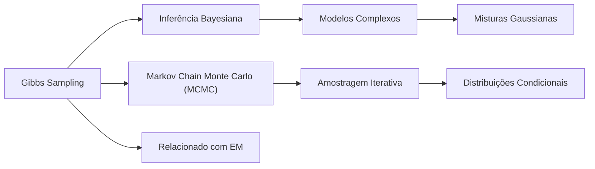

### Introdução
Este capítulo aborda o **Gibbs Sampling** dentro do contexto de **misturas Gaussianas**, um método crucial para inferência Bayesiana em modelos complexos [^8.6]. O Gibbs sampling, um tipo de **Markov Chain Monte Carlo (MCMC)**, é particularmente útil quando a amostragem direta da distribuição posterior é intratável [^8.6]. Em vez disso, amostramos iterativamente de distribuições condicionais, convergindo eventualmente para amostras da distribuição conjunta desejada [^8.6]. Este método tem estreita relação com o **algoritmo Expectation-Maximization (EM)**, como veremos, e permite inferências em modelos complexos que não são tratáveis com métodos diretos [^8.6]. Este capítulo explora detalhadamente o Gibbs sampling, sua relação com o algoritmo EM e suas aplicações em misturas Gaussianas [^8.6].

### Conceitos Fundamentais

**Conceito 1: Modelos de Mistura Gaussiana (GMM)**
Um **Modelo de Mistura Gaussiana (GMM)** é uma combinação de múltiplas distribuições Gaussianas, cada uma com sua própria média, variância e peso [^8.5.1]. GMMs são úteis para modelar dados com múltiplos modos ou grupos, onde uma única Gaussiana não é suficiente [^8.5.1]. Um GMM é definido pela seguinte função de densidade de probabilidade:

$$
p(y) = \sum_{k=1}^{K} \pi_k \phi(y|\mu_k, \sigma_k^2)
$$

Onde:
- $K$ é o número de componentes Gaussianos na mistura.
- $\pi_k$ é o peso do componente k, com $\sum_{k=1}^{K} \pi_k = 1$.
- $\phi(y|\mu_k, \sigma_k^2)$ é a função de densidade de probabilidade Gaussiana com média $\mu_k$ e variância $\sigma_k^2$.
Os parâmetros $\theta = \{ \pi_k, \mu_k, \sigma_k^2 \}_{k=1}^K$ são estimados a partir dos dados [^8.5.1].
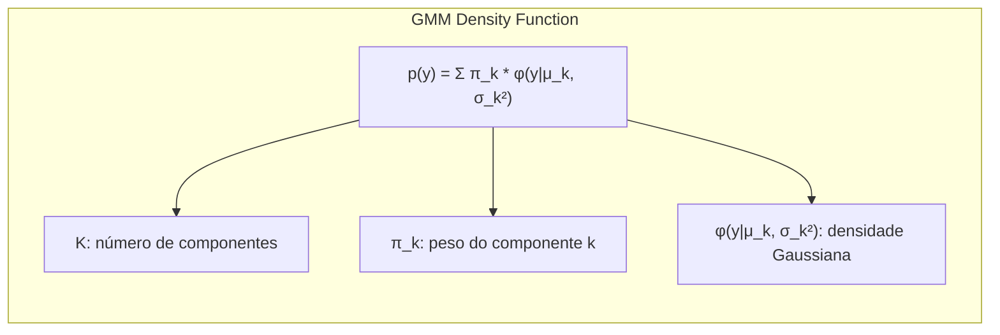

> 💡 **Exemplo Numérico:** Considere um GMM com dois componentes ($K=2$). Suponha que temos $\pi_1 = 0.4$, $\mu_1 = 2$, $\sigma_1^2 = 1$ e $\pi_2 = 0.6$, $\mu_2 = 8$, $\sigma_2^2 = 2$.  Para um dado ponto $y = 5$, podemos calcular a densidade de probabilidade usando a fórmula acima.
>
> $\phi(5|2, 1) = \frac{1}{\sqrt{2\pi(1)}}e^{-\frac{(5-2)^2}{2(1)}} \approx 0.044$
>
> $\phi(5|8, 2) = \frac{1}{\sqrt{2\pi(2)}}e^{-\frac{(5-8)^2}{2(2)}} \approx 0.106$
>
> $p(5) = 0.4 * 0.044 + 0.6 * 0.106 \approx 0.0814$
>
> Isso mostra que o ponto y=5 tem uma probabilidade de cerca de 0.0814 sob este modelo. Este valor é uma combinação das contribuições de ambos os componentes Gaussianos, ponderadas por seus respectivos pesos.

**Lemma 1:** A função de verossimilhança de um GMM é dada por:

$$
L(\theta|Z) = \prod_{i=1}^N \sum_{k=1}^K \pi_k \phi(y_i|\mu_k, \sigma_k^2)
$$

Onde $Z = \{y_1, y_2, ..., y_N\}$ é o conjunto de dados observados. A maximização direta desta função de verossimilhança é complexa, sendo o EM uma alternativa para encontrar uma solução localmente ótima [^8.5.1].
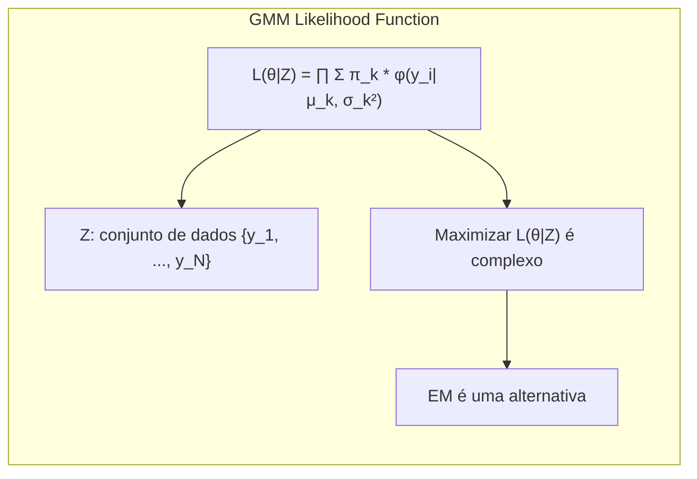

**Conceito 2: Algoritmo EM para GMM**
O **Algoritmo Expectation-Maximization (EM)** é um método iterativo para encontrar estimativas de máxima verossimilhança em modelos com dados latentes (não observados) [^8.5]. Em um GMM, a atribuição de qual componente gerou cada ponto de dados é o dado latente [^8.5]. O algoritmo EM alterna entre duas etapas [^8.5.1]:
1.  **Etapa de Expectativa (E):** Calcula a probabilidade posterior de cada ponto de dados pertencer a cada componente (responsabilidades) dado os parâmetros atuais [^8.5.1].

    $$
    \gamma_{ik} = \frac{\pi_k \phi(y_i|\mu_k, \sigma_k^2)}{\sum_{j=1}^K \pi_j \phi(y_i|\mu_j, \sigma_j^2)}
    $$
    Onde $\gamma_{ik}$ representa a probabilidade do ponto $y_i$ pertencer ao componente $k$ [^8.5.1].
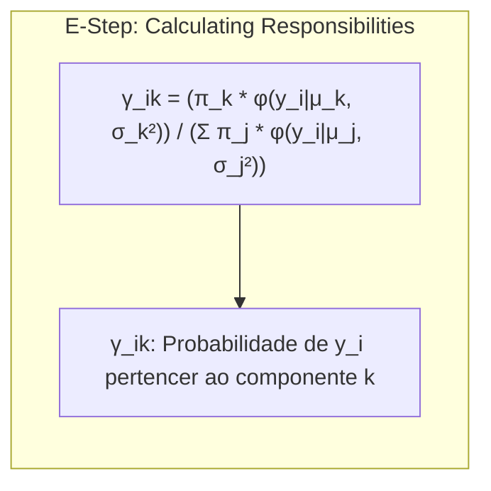

    > 💡 **Exemplo Numérico:** Usando os parâmetros do exemplo anterior e o ponto $y = 5$, podemos calcular as responsabilidades $\gamma_{i1}$ e $\gamma_{i2}$ para os dois componentes:
    >
    > $\gamma_{i1} = \frac{0.4 * 0.044}{0.4 * 0.044 + 0.6 * 0.106} \approx \frac{0.0176}{0.0814} \approx 0.216$
    >
    > $\gamma_{i2} = \frac{0.6 * 0.106}{0.4 * 0.044 + 0.6 * 0.106} \approx \frac{0.0636}{0.0814} \approx 0.784$
    >
    > Isso indica que o ponto $y=5$ tem cerca de 21.6% de probabilidade de pertencer ao primeiro componente e 78.4% de probabilidade de pertencer ao segundo componente.

2.  **Etapa de Maximização (M):** Atualiza os parâmetros do modelo (pesos, médias e variâncias) com base nas responsabilidades calculadas na Etapa E [^8.5.1]:

    $$
    \mu_k^{new} = \frac{\sum_{i=1}^N \gamma_{ik}y_i}{\sum_{i=1}^N \gamma_{ik}}
    $$

    $$
    \sigma_k^{2,new} = \frac{\sum_{i=1}^N \gamma_{ik}(y_i - \mu_k^{new})^2}{\sum_{i=1}^N \gamma_{ik}}
    $$

    $$
    \pi_k^{new} = \frac{\sum_{i=1}^N \gamma_{ik}}{N}
    $$
    ```mermaid
graph LR
    subgraph "M-Step: Updating Parameters"
        direction TB
        A["μ_k^{new} = (Σ γ_ik * y_i) / (Σ γ_ik)"]
        B["σ_k^{2,new} = (Σ γ_ik * (y_i - μ_k^{new})²) / (Σ γ_ik)"]
        C["π_k^{new} = (Σ γ_ik) / N"]
        A --> B
        B --> C
    end
```
O algoritmo itera entre as etapas E e M até a convergência [^8.5.1].
> 💡 **Exemplo Numérico:** Considere um conjunto de dados com 3 pontos: $y_1=3$, $y_2=6$, $y_3=9$ e as responsabilidades calculadas na Etapa E para o primeiro componente: $\gamma_{11} = 0.8$, $\gamma_{21} = 0.3$ e $\gamma_{31} = 0.1$. Então, o novo valor para $\mu_1$ é calculado como:
>
>  $\mu_1^{new} = \frac{0.8 * 3 + 0.3 * 6 + 0.1 * 9}{0.8 + 0.3 + 0.1} = \frac{2.4 + 1.8 + 0.9}{1.2} = \frac{5.1}{1.2} = 4.25$
>
> De forma similar, podemos calcular $\sigma_1^{2,new}$ e $\pi_1^{new}$ usando as fórmulas apresentadas acima e as responsabilidades e dados.

**Corolário 1:** As etapas do algoritmo EM maximizam iterativamente a verossimilhança dos dados observados, convergindo para uma solução localmente ótima para os parâmetros do GMM [^8.5].

**Conceito 3: Gibbs Sampling**
O **Gibbs sampling** é um algoritmo MCMC que amostra iterativamente de distribuições condicionais para gerar amostras da distribuição conjunta [^8.6]. Em um GMM, ao invés de buscar um único ponto ótimo dos parâmetros, o objetivo do Gibbs sampling é amostrar da distribuição posterior dos parâmetros.
Em vez de calcular as responsabilidades $\gamma_{ik}$ como no EM, o Gibbs sampling simula a atribuição de cada ponto de dado $y_i$ a um componente $k$ com probabilidade proporcional a $\pi_k\phi(y_i|\mu_k, \sigma_k^2)$ [^8.6].
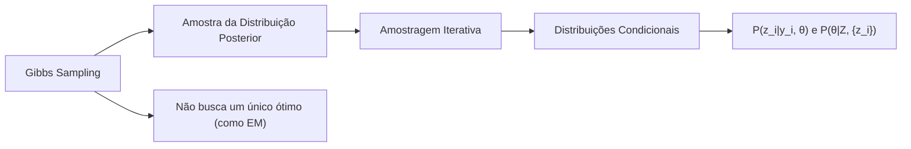

> ⚠️ **Nota Importante**: O Gibbs sampling requer a definição de uma distribuição *a priori* para os parâmetros do modelo, expressando nosso conhecimento inicial sobre esses parâmetros antes de observar os dados. **Referência ao tópico [^8.3]**.

> ❗ **Ponto de Atenção**: No Gibbs sampling, as amostras são geradas sequencialmente e não são independentes, mas sob certas condições, a cadeia de Markov formada converge para a distribuição posterior alvo. **Conforme indicado em [^8.6]**.

> ✔️ **Destaque**: Ao contrário do EM, que busca um único conjunto de valores ótimos para os parâmetros, o Gibbs sampling gera amostras da distribuição posterior, permitindo quantificar a incerteza nas estimativas. **Baseado no tópico [^8.6]**.

### Regressão Linear e Mínimos Quadrados para Classificação
```mermaid
graph TD
  A[Inicialização de Parâmetros e Atribuições] --> B{Amostragem de "z_i" | "μ, σ², π"};
  B --> C{Amostragem de "μ_k, σ²_k" | "z"};
  C --> D{Verificação de Convergência};
  D -- Não Convergiu --> B;
  D -- Convergiu --> E["Amostras da Distribuição Posterior"];
```

O **Gibbs sampling** para GMMs envolve a amostragem iterativa de duas distribuições condicionais: a atribuição latente de qual componente gerou cada ponto de dados e a distribuição dos parâmetros do modelo dado os dados e as atribuições latentes [^8.6].
1.  **Amostragem das Atribuições Latentes:** Para cada ponto de dados $y_i$, amostramos a atribuição $z_i$ de um componente $k$ com probabilidade proporcional a $\pi_k \phi(y_i|\mu_k, \sigma_k^2)$, onde $k \in \{1, 2, ..., K\}$ [^8.6]. Esta é uma amostragem da distribuição condicional $P(z_i|y_i, \theta)$.
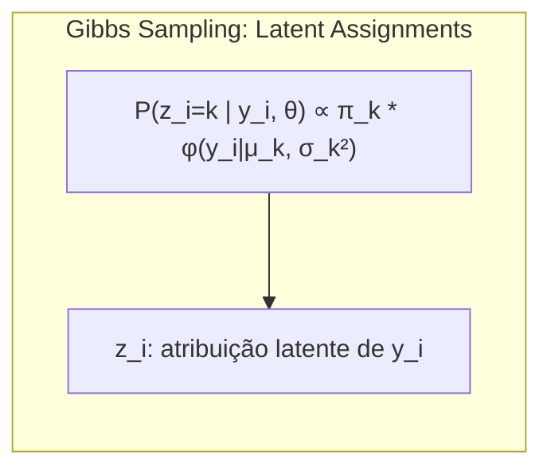

    > 💡 **Exemplo Numérico:** Suponha que temos um único ponto $y_1 = 5$ e dois componentes Gaussianos com parâmetros $\pi_1 = 0.4$, $\mu_1 = 2$, $\sigma_1^2 = 1$ e $\pi_2 = 0.6$, $\mu_2 = 8$, $\sigma_2^2 = 2$. Calculamos as probabilidades não normalizadas:
    >
    > $p_1 = \pi_1 \phi(y_1|\mu_1, \sigma_1^2) = 0.4 * 0.044 \approx 0.0176$
    >
    > $p_2 = \pi_2 \phi(y_1|\mu_2, \sigma_2^2) = 0.6 * 0.106 \approx 0.0636$
    >
    > As probabilidades normalizadas para atribuir $y_1$ a cada componente são:
    >
    > $P(z_1=1) = \frac{p_1}{p_1 + p_2} = \frac{0.0176}{0.0176 + 0.0636} \approx 0.216$
    >
    > $P(z_1=2) = \frac{p_2}{p_1 + p_2} = \frac{0.0636}{0.0176 + 0.0636} \approx 0.784$
    >
    >  Usamos essas probabilidades para amostrar a atribuição $z_1$, ou seja, escolhemos o componente 1 com probabilidade de 0.216 e componente 2 com probabilidade de 0.784.

2.  **Amostragem dos Parâmetros do Modelo:** Dado o conjunto de atribuições latentes $\{z_i\}_i$ para todos os pontos de dados, amostramos os parâmetros $\mu_k$, $\sigma_k^2$ e $\pi_k$ da distribuição condicional $P(\theta|Z, \{z_i\})$ [^8.6]. A distribuição *a priori* conjugada para a média e variância em uma Gaussiana é a Normal-Inversa-Gama, de forma que amostrar da posteriori é relativamente simples [^8.6].
    ```mermaid
graph LR
    subgraph "Gibbs Sampling: Model Parameters"
        direction TB
        A["P(θ | Z, {z_i})"]
        B["Distribuições a priori (Normal-Inversa-Gama)"]
         C["Amostra de μ_k, σ_k², π_k"]
        A --> B
        A-->C
    end
```
    > 💡 **Exemplo Numérico:** Suponha que temos 3 pontos de dados com atribuições latentes $z = \{1, 2, 1\}$ (os dois primeiros pertencem ao componente 1, o último ao componente 2). Os dados são $y = \{3, 6, 9\}$. Precisamos amostrar os parâmetros dado essas atribuições. Para isso, precisamos definir priors.
    >
    > Suponha que a prior para $\mu_k$ é uma normal com média 0 e variância 10 ($\mu_k \sim N(0, 10)$). A posteriori para $\mu_1$ (dado $y_1 = 3$ e $y_3 = 9$) é também uma normal com uma nova média e variância (que vamos chamar de $\mu_{1,post}$ e $\sigma_{1,post}^2$). O mesmo é feito para $\mu_2$ (usando $y_2 = 6$).
    >
    >   $\mu_{1,post} = \frac{\frac{0}{10} + \frac{3+9}{1}}{\frac{1}{10}+\frac{2}{1}} = \frac{12}{20.1} \approx 5.97$
    >  $\sigma_{1,post}^2 = \frac{1}{\frac{1}{10} + \frac{2}{1}} = \frac{1}{2.1} \approx 0.48$
    >
    > Agora, amostramos um novo $\mu_1$ dessa distribuição. De forma similar, amostramos um novo $\mu_2$ e $\sigma^2_k$. A amostragem para $\pi_k$ também segue esse procedimento, usando uma prior de Dirichlet.

**Lemma 2**: As amostras geradas pelo Gibbs sampling convergem para a distribuição posterior conjunta dos parâmetros do modelo, $P(\theta|Z)$, dado um número suficiente de iterações [^8.6].

**Corolário 2:** O Gibbs sampling produz um conjunto de amostras que representam a incerteza sobre os parâmetros do modelo, enquanto o EM fornece uma única estimativa pontual para os parâmetros [^8.6].
A escolha entre EM e Gibbs sampling depende da aplicação específica. O EM é mais rápido e geralmente adequado quando se deseja uma estimativa de um ponto único para os parâmetros. O Gibbs sampling é mais apropriado quando a incerteza sobre os parâmetros é relevante, permitindo análise Bayesiana completa [^8.6].
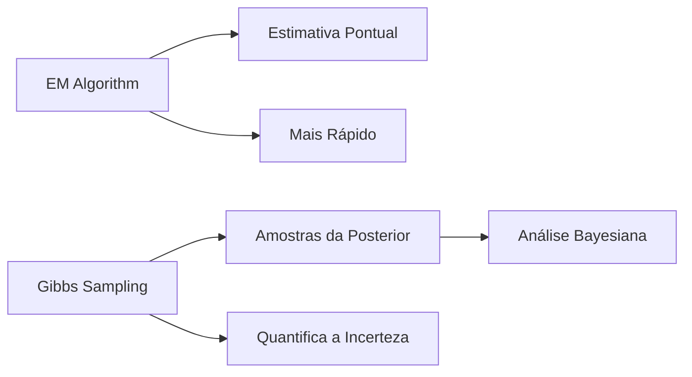

### Métodos de Seleção de Variáveis e Regularização em Classificação
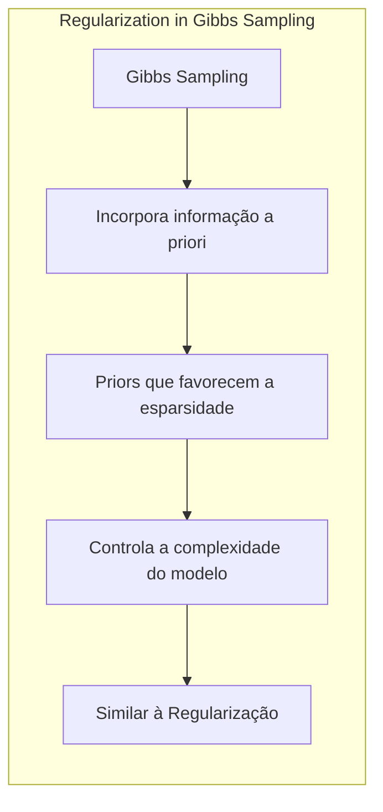
A amostragem de Gibbs, por si só, não envolve seleção de variáveis ou regularização direta como os métodos de penalidade L1 e L2 na regressão logística [^8.2]. No entanto, o Gibbs sampling permite a incorporação de informação *a priori* sobre os parâmetros do modelo, incluindo termos que favorecem a esparsidade ou a estabilidade, através das distribuições *a priori*.
Por exemplo, ao trabalhar com misturas Gaussianas com muitos componentes, pode-se definir priors para o parâmetro $\pi_k$ (pesos dos componentes) que favoreçam valores próximos a zero, efetivamente removendo componentes não relevantes da mistura. Essa abordagem permite controlar indiretamente a complexidade do modelo, semelhante à regularização [^8.3].

> 💡 **Exemplo Numérico:** Considere um modelo com 5 componentes Gaussianos. Se definirmos um prior para $\pi_k$ como uma distribuição de Dirichlet com parâmetros $\alpha = [0.1, 0.1, 0.1, 0.1, 0.1]$, favorecemos que os valores de $\pi_k$ sejam esparsos, ou seja, alguns componentes tendem a ter pesos próximos a zero. Isso faz com que o Gibbs sampling tenda a escolher um modelo mais simples, com menos componentes relevantes, durante o processo de inferência, evitando que o modelo se torne excessivamente complexo.

**Lemma 3:** A escolha de priors apropriados pode influenciar significativamente a inferência Bayesiana, controlando a complexidade do modelo e guiando a amostragem de Gibbs para regiões de maior plausibilidade no espaço de parâmetros [^8.3].
**Prova do Lemma 3:** A influência dos priors no processo de amostragem se dá através da distribuição posterior, que é proporcional à verossimilhança multiplicada pela prior. Uma prior com alta variância permite maior flexibilidade na amostragem, enquanto uma prior com baixa variância tende a restringir a amostragem em torno de seu valor médio [^8.3]. $\blacksquare$
**Corolário 3:** A flexibilidade do Gibbs sampling para incorporar distribuições *a priori* complexas permite que ele se adapte a problemas com alta dimensionalidade e muitos parâmetros, contornando problemas de overfiting e promovendo soluções mais estáveis e interpretáveis [^8.3].

> ⚠️ **Ponto Crucial**: Em modelos Bayesianos, a escolha de um prior não informativo para parâmetros (como as médias ou as variâncias) pode ter efeitos inesperados, sendo necessário escolher cuidadosamente os priors para guiar o processo de inferência corretamente. **conforme discutido em [^8.4]**.

### Separating Hyperplanes e Perceptrons

Os conceitos de hiperplanos separadores e perceptrons são relacionados à classificação, ao passo que o Gibbs sampling é uma ferramenta para inferência em modelos probabilísticos, como misturas Gaussianas, onde a classificação pode ser uma aplicação secundária. No contexto de GMMs, os hiperplanos separadores podem ser usados para determinar as regiões de decisão dos diferentes componentes da mistura. No entanto, o Gibbs sampling não se preocupa diretamente em encontrar esses hiperplanos, mas em estimar a distribuição dos parâmetros do modelo.
O perceptron, um algoritmo de aprendizado de classificadores lineares, também é distinto do Gibbs sampling. O perceptron ajusta os pesos de um classificador linear através de iterações, enquanto o Gibbs sampling é um método de amostragem Bayesiana. Embora ambos lidem com o aprendizado de parâmetros, eles têm abordagens e objetivos distintos.
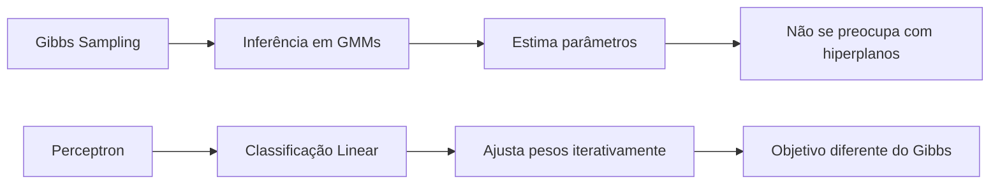

### Pergunta Teórica Avançada (Exemplo): Como o Gibbs Sampling em Misturas Gaussianas se relaciona com o Algoritmo EM e quais as vantagens e desvantagens de cada método?
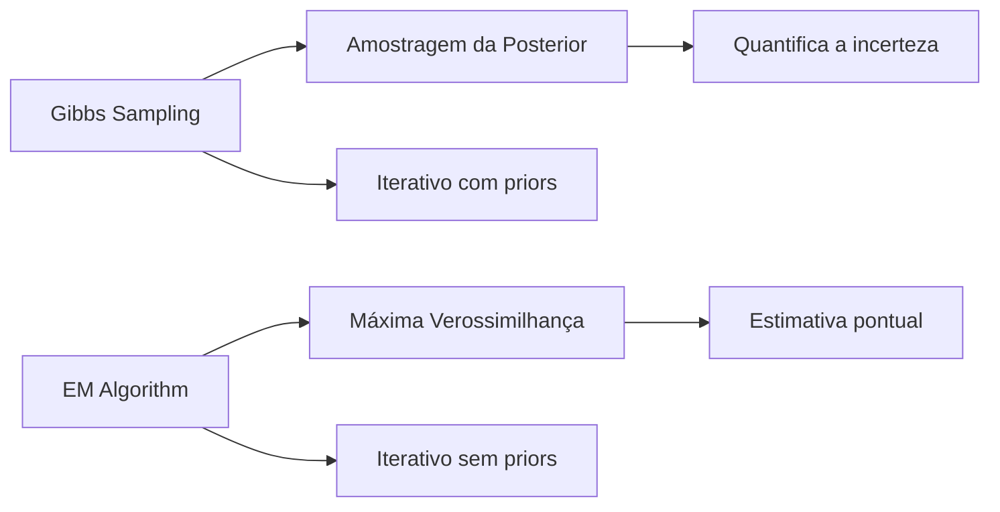

**Resposta:**
Tanto o Gibbs sampling quanto o algoritmo EM são métodos para inferência em modelos com dados latentes como as misturas Gaussianas. No entanto, suas abordagens e objetivos são distintos. O algoritmo EM busca uma estimativa de máxima verossimilhança para os parâmetros do modelo, alternando entre a etapa de expectativa (E), onde calcula as probabilidades de atribuição dos dados aos componentes, e a etapa de maximização (M), onde atualiza os parâmetros com base nessas probabilidades [^8.5]. O EM converge para um ponto ótimo localmente, fornecendo uma única estimativa para os parâmetros do modelo [^8.5.1].
Por outro lado, o Gibbs sampling é um método Bayesiano que visa amostrar da distribuição posterior dos parâmetros. Ele simula iterativamente as atribuições de dados aos componentes da mistura e amostra dos parâmetros, dado o conjunto de atribuições latentes e os dados [^8.6]. O Gibbs sampling produz um conjunto de amostras que representam a distribuição posterior, permitindo quantificar a incerteza nas estimativas dos parâmetros.

> 💡 **Exemplo Numérico:** Para ilustrar a diferença na prática, suponha que temos um GMM com dois componentes, com dados gerados a partir de ambos. Ao rodar o algoritmo EM, podemos obter um único conjunto de parâmetros, por exemplo, $\mu_1 = 2.1$, $\sigma_1^2 = 0.9$, $\pi_1 = 0.45$ e $\mu_2 = 7.8$, $\sigma_2^2 = 1.8$, $\pi_2 = 0.55$. No Gibbs sampling, depois de um número de iterações, obteríamos um conjunto de amostras, cada uma representando um possível conjunto de parâmetros. Por exemplo, as amostras poderiam mostrar variações nas médias, como $\mu_1$ variando de 1.8 a 2.4 e $\mu_2$ de 7.5 a 8.1. Essas amostras permitem calcular intervalos de confiança e avaliar a incerteza sobre as estimativas, algo que o EM não fornece diretamente.

**Lemma 4:** Em modelos exponenciais de família, a convergência do Gibbs sampling está relacionada à solução do algoritmo EM. Ambos se aproximam do mesmo resultado no limite de um número grande de iterações, mas o Gibbs sampling permite obter a distribuição posterior dos parâmetros, enquanto o EM busca apenas uma estimativa de ponto máximo [^8.6].
**Corolário 4:** O Gibbs sampling é mais flexível para acomodar priors informativos nos parâmetros, permitindo incorporar conhecimento prévio na inferência e controlando o comportamento do modelo em regiões de dados esparsos, enquanto o algoritmo EM tende a convergir para uma solução de máxima verossimilhança, sem incorporar a incerteza inerente aos dados [^8.3].
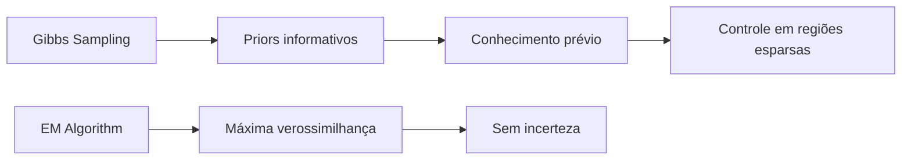
> ⚠️ **Ponto Crucial**: A escolha entre EM e Gibbs sampling depende da necessidade da análise: Se o objetivo é encontrar uma estimativa pontual para os parâmetros, o EM pode ser suficiente e mais rápido. Se o objetivo é quantificar a incerteza e analisar a distribuição posterior dos parâmetros, o Gibbs sampling é mais adequado. **Conforme discutido em [^8.6]**.

### Conclusão
O Gibbs sampling é uma ferramenta poderosa para inferência Bayesiana em misturas Gaussianas, permitindo a amostragem da distribuição posterior dos parâmetros do modelo [^8.6]. Sua relação com o algoritmo EM oferece uma compreensão mais profunda de como esses algoritmos funcionam e suas vantagens e desvantagens em diferentes situações. O Gibbs sampling fornece maior flexibilidade para incorporar informação *a priori* e estimar a incerteza nos parâmetros, mas exige um esforço computacional maior. Este capítulo oferece uma visão detalhada dos princípios teóricos, aplicações e conexões do Gibbs sampling com outros métodos de inferência [^8.6].
<!-- END DOCUMENT -->

### Footnotes
[^8.1]: *“For most of this book, the fitting (learning) of models has been achieved by minimizing a sum of squares for regression, or by minimizing cross-entropy for classification. In fact, both of these minimizations are instances of the maximum likelihood approach to fitting.”* (Trecho de *Model Inference and Averaging*)
[^8.2]: *“The bootstrap method provides a direct computational way of assessing uncertainty, by sampling from the training data. Here we illustrate the bootstrap in a simple one-dimensional smoothing problem, and show its connection to maximum likelihood.”* (Trecho de *Model Inference and Averaging*)
[^8.3]: *“In the Bayesian approach to inference, we specify a sampling model Pr(Z|0) (density or probability mass function) for our data given the parameters, and a prior distribution for the parameters Pr(0) reflecting our knowledge about 0 before we see the data.”* (Trecho de *Model Inference and Averaging*)
[^8.4]: *“The distribution (8.25) with τ → ∞ is called a noninformative prior for 0. In Gaussian models, maximum likelihood and parametric bootstrap analyses tend to agree with Bayesian analyses that use a noninformative prior for the free parameters.”* (Trecho de *Model Inference and Averaging*)
[^8.5]: *“The EM algorithm is a popular tool for simplifying difficult maximum likelihood problems. We first describe it in the context of a simple mixture model.”* (Trecho de *Model Inference and Averaging*)
[^8.5.1]: *“In this section we describe a simple mixture model for density estimation, and the associated EM algorithm for carrying out maximum likelihood estimation.”* (Trecho de *Model Inference and Averaging*)
[^8.6]: *“Having defined a Bayesian model, one would like to draw samples from the resulting posterior distribution, in order to make inferences about the parameters. Except for simple models, this is often a difficult computational problem. In this section we discuss the Markov chain Monte Carlo (MCMC) approach to posterior sampling. We will see that Gibbs sampling, an MCMC procedure, is closely related to the EM algorithm: the main difference is that it samples from the conditional distributions rather than maximizing over them.”* (Trecho de *Model Inference and Averaging*)
