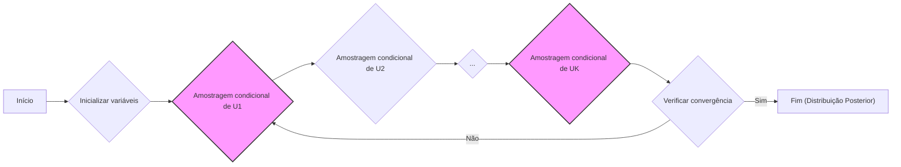
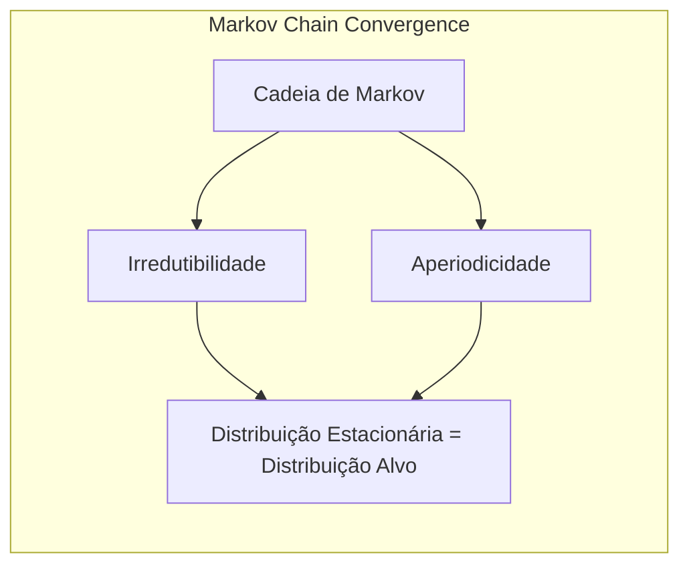
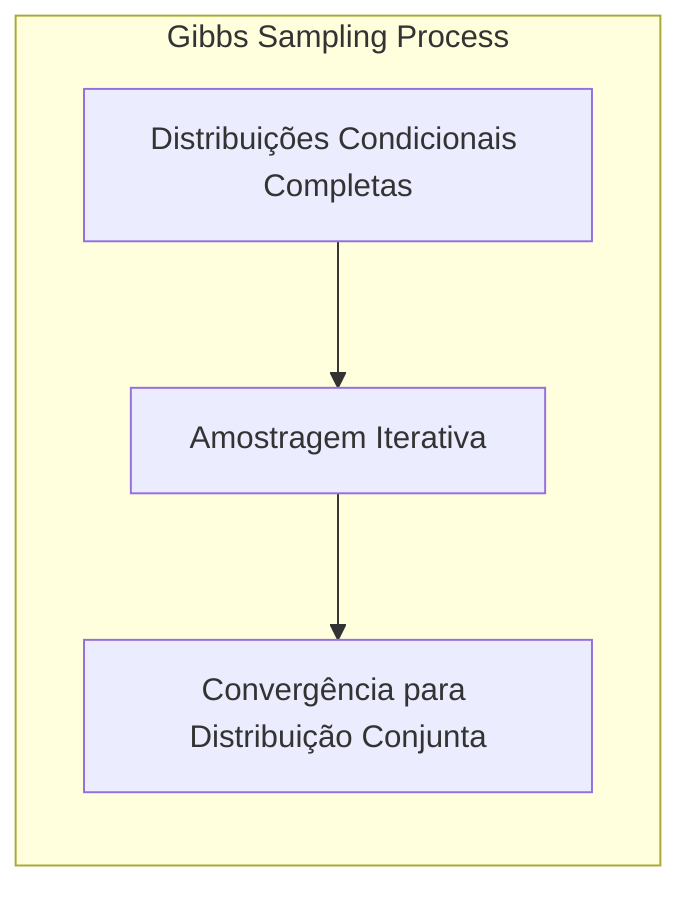
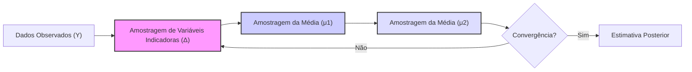
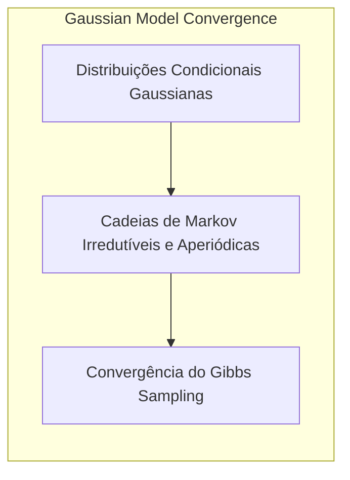
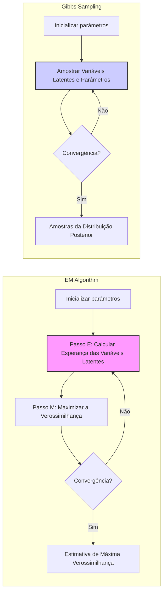
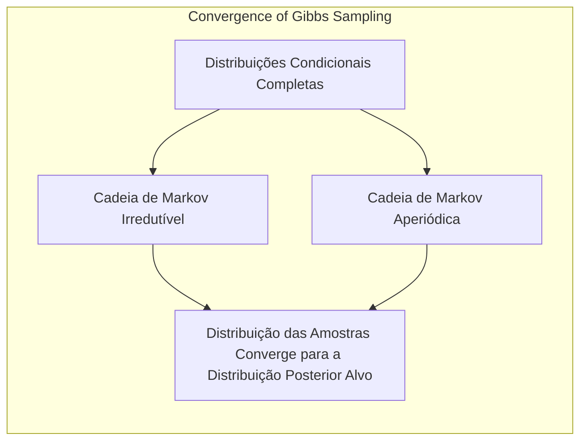

## Gibbs Sampling Behavior



### Introdução

Este capítulo explora o **Gibbs sampling**, um método fundamental de **Markov Chain Monte Carlo (MCMC)** para amostragem da distribuição posterior em inferência Bayesiana [^8.6]. O Gibbs sampling é uma técnica iterativa onde amostras são geradas sequencialmente a partir das distribuições condicionais completas, levando a uma amostra da distribuição conjunta [^8.6]. Este método é particularmente útil quando a distribuição conjunta é complexa, mas as distribuições condicionais são mais tratáveis. Exploraremos a base teórica, os mecanismos e a relação com outros métodos, como o EM.

### Conceitos Fundamentais

**Conceito 1: O Problema da Amostragem da Distribuição Posterior**

A inferência Bayesiana requer a amostragem da distribuição posterior, $$P(\theta | Z)$$, onde $$\theta$$ são os parâmetros e $$Z$$ são os dados. Em geral, calcular esta distribuição analiticamente é difícil. Métodos MCMC, como o Gibbs sampling, fornecem uma abordagem computacional para gerar amostras desta distribuição [^8.6]. A ideia central é construir uma cadeia de Markov cuja distribuição estacionária seja a distribuição posterior desejada. O Gibbs sampling é um caso especial de MCMC onde amostras são obtidas iterativamente a partir das distribuições condicionais completas.

**Lemma 1:** Se a cadeia de Markov construída pelo Gibbs sampling é irredutível e aperiódica, então a sua distribuição estacionária é a distribuição alvo.
*Prova:* A prova formal envolve o uso do teorema da convergência de cadeias de Markov, mostrando que sob as condições de irredutibilidade e aperiodicidade, a distribuição das amostras geradas converge para a distribuição alvo [^8.6]. $\blacksquare$


**Conceito 2: O Mecanismo do Gibbs Sampling**

O Gibbs sampling gera amostras iterativamente a partir da distribuição conjunta de variáveis aleatórias $$U_1, U_2, \ldots, U_K$$. Em cada iteração, uma variável $$U_k$$ é amostrada da sua distribuição condicional, dados os valores mais recentes de todas as outras variáveis $$U_{-k}$$, i.e., $$P(U_k | U_{-k})$$. O processo continua sequencialmente para cada variável até que se atinja convergência, que é quando a distribuição conjunta converge para uma distribuição estacionária que é uma amostra da distribuição posterior de interesse [^8.6].
Formalmente, no instante $$t$$, para $$k=1, 2, \ldots, K$$, gera-se $$U_k^{(t)}$$ de $$P(U_k | U_1^{(t)}, \ldots, U_{k-1}^{(t)}, U_{k+1}^{(t-1)}, \ldots, U_K^{(t-1)})$$.

> 💡 **Exemplo Numérico:** Vamos considerar um caso simplificado com duas variáveis,  $$U_1$$ e $$U_2$$. Suponha que as distribuições condicionais sejam:
>
> $$P(U_1 | U_2) = \mathcal{N}(U_2, 1)$$
>
> $$P(U_2 | U_1) = \mathcal{N}(0.5U_1, 0.5)$$
>
> Inicializamos com $$U_1^{(0)} = 2$$ e $$U_2^{(0)} = 1$$.
>
> *   **Iteração 1:**
>
>     *   Amostramos $$U_1^{(1)}$$ de  $$P(U_1 | U_2^{(0)} = 1)$$.  Suponha que  $$U_1^{(1)} = 1.5$$.
>     *   Amostramos $$U_2^{(1)}$$ de  $$P(U_2 | U_1^{(1)} = 1.5)$$. Suponha que $$U_2^{(1)} = 0.9$$.
> *   **Iteração 2:**
>     *   Amostramos $$U_1^{(2)}$$ de $$P(U_1 | U_2^{(1)} = 0.9)$$. Suponha que $$U_1^{(2)} = 1.1$$.
>     *  Amostramos $$U_2^{(2)}$$ de $$P(U_2 | U_1^{(2)} = 1.1)$$. Suponha que $$U_2^{(2)} = 0.6$$.
>
> Este processo continua iterativamente. Após um número suficiente de iterações (burn-in), as amostras ($$U_1^{(t)}$$, $$U_2^{(t)}$$)  aproximam a distribuição conjunta alvo. Este exemplo ilustra como o Gibbs sampling atualiza cada variável usando os valores mais recentes das outras.
>
> ```mermaid
> graph LR
>     A[Inicializar U1, U2] --> B(Amostrar U1 | U2)
>     B --> C(Amostrar U2 | U1)
>     C --> D{Próxima iteração?}
>     D -- Sim --> B
>     D -- Não --> E[Fim]
>     style B fill:#f9f,stroke:#333,stroke-width:2px
>     style C fill:#ccf,stroke:#333,stroke-width:2px
> ```

**Corolário 1:** Em modelos onde as distribuições condicionais completas são amostráveis, o Gibbs sampling produz amostras da distribuição conjunta. A facilidade de implementação depende da forma da condicional, que é crucial para a aplicabilidade do método.
*Prova:* A prova deste corolário se baseia na propriedade de que se amostras são geradas repetidamente das condicionais completas, a distribuição conjunta das amostras converge para a distribuição alvo [^8.6]. $\blacksquare$


**Conceito 3: Convergência e Burn-in**

As amostras iniciais geradas pelo Gibbs sampling, antes de atingir a convergência da cadeia de Markov, não devem ser usadas para inferência, pois são influenciadas pelas condições iniciais [^8.6]. Esse período inicial é chamado de *burn-in*. Após o *burn-in*, as amostras geradas podem ser usadas para aproximar a distribuição posterior, estimar a média posterior e outras quantidades de interesse [^8.6].
> ⚠️ **Nota Importante**: A determinação do tamanho do *burn-in* é crucial e depende da natureza do problema e da complexidade da distribuição alvo. É geralmente feita por inspeção visual das amostras ou utilizando métodos de diagnóstico de convergência.
> ❗ **Ponto de Atenção**: A escolha de valores iniciais pode afetar a velocidade de convergência do algoritmo. É aconselhável usar valores iniciais razoáveis ou executar o algoritmo com múltiplos valores iniciais para garantir uma amostra representativa da distribuição posterior.
> ✔️ **Destaque**: Após o burn-in, as amostras geradas podem ser utilizadas para estimar quantidades de interesse, como a média posterior, variância, e intervalos de credibilidade.

### Gibbs Sampling para Modelos Gaussianos



**Explicação:** Este diagrama ilustra o fluxo do Gibbs sampling para um modelo gaussiano com dois componentes.

Considere um modelo gaussiano com dois componentes onde $$Z$$ representa os dados observados e $$\theta$$ os parâmetros do modelo. O Gibbs sampling pode ser usado para obter amostras da distribuição posterior dos parâmetros, dados os dados. Para este exemplo, assuma que temos as seguintes variáveis aleatórias:
- $$Y_i$$: Dados observados.
- $$\Delta_i \in \{0,1\}$$: Variável indicadora para o componente gaussiano.
- $$\mu_1$$: Média do primeiro componente.
- $$\mu_2$$: Média do segundo componente.
As condicionais para o Gibbs Sampling serão as seguintes:
1. Amostrar $$\Delta_i$$ da distribuição condicional completa $$P(\Delta_i | \mu_1, \mu_2, Y_i)$$, que se relaciona com a probabilidade de cada ponto de dado pertencer a cada uma das distribuições Gaussianas.
2. Amostrar $$\mu_1$$ da distribuição condicional completa $$P(\mu_1 | \Delta_i, Y_i)$$, que é uma gaussiana cuja média e variância dependem dos pontos associados ao primeiro componente.
3. Amostrar $$\mu_2$$ da distribuição condicional completa $$P(\mu_2 | \Delta_i, Y_i)$$, similar à etapa anterior, mas para o segundo componente.
O Gibbs sampling alterna essas etapas iterativamente, usando os valores amostrados mais recentemente para gerar as próximas amostras [^8.6].

> 💡 **Exemplo Numérico:** Suponha que temos 5 dados observados: $$Y = [1, 2, 8, 9, 10]$$. Inicializamos  $$\mu_1 = 2$$ e $$\mu_2 = 9$$. As condicionais completas são assumidas gaussianas para simplicidade:
>
> $$P(\Delta_i = 1 | \mu_1, \mu_2, Y_i) = \frac{\mathcal{N}(Y_i | \mu_1, \sigma^2)}{\mathcal{N}(Y_i | \mu_1, \sigma^2) + \mathcal{N}(Y_i | \mu_2, \sigma^2)}$$
>
> $$P(\Delta_i = 0 | \mu_1, \mu_2, Y_i) = 1 - P(\Delta_i = 1 | \mu_1, \mu_2, Y_i)$$
>
> $$P(\mu_1 | \Delta, Y) = \mathcal{N}\left( \frac{\sum_{i: \Delta_i=1} Y_i}{n_1}, \frac{\sigma^2}{n_1} \right)$$
>
> $$P(\mu_2 | \Delta, Y) = \mathcal{N}\left( \frac{\sum_{i: \Delta_i=0} Y_i}{n_2}, \frac{\sigma^2}{n_2} \right)$$
>
> onde $$n_1$$ é o número de pontos associados ao componente 1 e $$n_2$$ ao componente 2, e $$\sigma^2 = 1$$.
>
> *   **Iteração 1:**
>     *   **Amostrar** $$\Delta_i$$. Para $$Y_1 = 1$$, $$P(\Delta_1 = 1) = \frac{e^{-0.5(1-2)^2}}{e^{-0.5(1-2)^2} + e^{-0.5(1-9)^2}} \approx 1$$. Então,  $$\Delta_1 = 1$$. Analogamente, para $$Y_2 = 2$$, $$\Delta_2 = 1$$, para $$Y_3 = 8$$, $$\Delta_3 = 0$$, para $$Y_4 = 9$$, $$\Delta_4 = 0$$, e para $$Y_5 = 10$$, $$\Delta_5 = 0$$.  Assim, $$\Delta = [1, 1, 0, 0, 0]$$.
>     *   **Amostrar**  $$\mu_1$$: $$P(\mu_1 | \Delta, Y) = \mathcal{N}\left(\frac{1+2}{2}, \frac{1}{2} \right) = \mathcal{N}(1.5, 0.5)$$. Suponha que  $$\mu_1 = 1.7$$.
>     *   **Amostrar**  $$\mu_2$$: $$P(\mu_2 | \Delta, Y) = \mathcal{N}\left(\frac{8+9+10}{3}, \frac{1}{3} \right) = \mathcal{N}(9, 0.33)$$. Suponha que $$\mu_2 = 8.8$$.
>
> *   **Iteração 2:**
>     *   **Amostrar** $$\Delta_i$$ usando os valores atualizados de $$\mu_1$$ e $$\mu_2$$, por exemplo, para  $$Y_1$$,  $$P(\Delta_1 = 1) \approx 0.98$$, logo $$\Delta_1 = 1$$.  O processo é repetido para cada ponto de dado.
>     *   **Amostrar** $$\mu_1$$ usando os novos valores de $$\Delta$$ e $$Y$$.
>     *    **Amostrar** $$\mu_2$$ usando os novos valores de $$\Delta$$ e $$Y$$.
>
> O algoritmo continua iterativamente, atualizando os valores das variáveis e convergindo para a distribuição posterior.

**Lemma 2:** A convergência do Gibbs sampling em modelos gaussianos pode ser assegurada se as condicionais completas são bem definidas e as cadeias de Markov associadas são irredutíveis e aperiódicas.
*Prova:* Para modelos Gaussianos, as condicionais completas geralmente são gaussianas ou outras distribuições bem conhecidas, o que simplifica a verificação das condições de convergência do Gibbs sampling [^8.6]. $\blacksquare$


**Corolário 2:** Em um modelo com dois componentes gaussianos, as amostras geradas por Gibbs Sampling convergem para a distribuição posterior conjunta de $$\mu_1$$ e $$\mu_2$$ dado os dados. O método requer que a amostragem de cada um dos parâmetros nas condicionais seja fácil.
*Prova:* A convergência segue da aplicação do teorema de convergência de cadeias de Markov e das propriedades das condicionais gaussianas. $\blacksquare$

### Gibbs Sampling e o Algoritmo EM

Há uma estreita relação entre o Gibbs sampling e o algoritmo EM em modelos da família exponencial [^8.6, 8.5.2]. O algoritmo EM busca um ponto máximo na distribuição posterior, enquanto o Gibbs sampling busca amostrar a distribuição posterior. Em modelos como mixture models, o algoritmo EM alterna passos de Expectation (E) e Maximization (M). No passo E, calculamos a esperança das variáveis latentes, enquanto no passo M maximizamos a função de verossimilhança usando essas expectativas [^8.5]. O Gibbs sampling simula as variáveis latentes em vez de calcular as esperanças, e simula os parâmetros do modelo dado as variáveis latentes.
> ⚠️ **Ponto Crucial**: Ambos os métodos lidam com a complexidade da função de verossimilhança através da introdução de variáveis latentes. Enquanto o EM maximiza a verossimilhança, o Gibbs sampling amostra a partir da distribuição posterior.
> ❗ **Ponto de Atenção**: No contexto de modelos com variáveis latentes como mixture models, o Gibbs sampling amostragem iterativamente as variáveis latentes e parâmetros do modelo, ao passo que o EM calcula o valor esperado das variáveis latentes e maximiza o likelihood dado estas esperanças.


### Perguntas Teóricas Avançadas

**Pergunta 1: Quais as condições teóricas que garantem a convergência do Gibbs sampling para a distribuição posterior desejada?**
**Resposta:** A convergência do Gibbs sampling é garantida se a cadeia de Markov subjacente é irredutível e aperiódica [^8.6]. A irredutibilidade significa que qualquer ponto no espaço de parâmetros pode ser atingido em um número finito de etapas. A aperiodicidade impede que a cadeia se torne cíclica. Em cenários práticos, estas condições podem ser verificadas através da análise da natureza das distribuições condicionais completas e do comportamento da cadeia ao longo das iterações [^8.6].

**Lemma 3**: Se as distribuições condicionais completas são tais que as cadeias de Markov associadas são irredutíveis e aperiódicas, então a distribuição das amostras geradas pelo Gibbs sampling convergirão para a distribuição posterior alvo.
*Prova:* Esta afirmação é derivada do teorema da convergência de cadeias de Markov e requer que todas as condicionais sejam tais que garantam que qualquer parte do espaço de parâmetros possa ser acessada. $\blacksquare$


**Pergunta 2: Como o *burn-in* impacta a inferência estatística e como ele deve ser determinado na prática?**

**Resposta:** O *burn-in* corresponde a um período inicial de iterações do Gibbs sampling onde a influência das condições iniciais ainda é significativa [^8.6]. Incluir estas amostras na análise final pode levar a estimativas viesadas e incorretas. A determinação do *burn-in* deve ser feita através da análise visual dos gráficos das amostras, procurando por um período onde a cadeia parece ter atingido uma distribuição estacionária, ou através de métodos de diagnóstico de convergência, como o fator de redução de escala, que indica quando cadeias múltiplas convergem para uma mesma distribuição [^8.6].

> 💡 **Exemplo Numérico:** Suponha que ao executar o Gibbs Sampling em um problema específico, visualizamos o histórico das amostras de um parâmetro $$\theta$$:
>
> ```mermaid
>   graph LR
>       A[Inicialização] --> B(Iterações 1-100)
>       B --> C(Iterações 101-500)
>       C --> D(Iterações 501-1000)
>       style B fill:#f9f,stroke:#333,stroke-width:2px
>       style C fill:#ccf,stroke:#333,stroke-width:2px
> ```
>
> As amostras de $$\theta$$ nas iterações 1-100 mostram uma alta variabilidade e tendência clara, indicando que o algoritmo ainda está se ajustando. Entre as iterações 101-500, a variabilidade diminui e a tendência desaparece. Após a iteração 500, a cadeia parece ter estabilizado em torno de um valor específico com flutuações aleatórias, indicando que a fase de *burn-in* pode ser considerada até a iteração 500. As amostras após a iteração 500 serão usadas para estimar as propriedades da distribuição posterior.

**Corolário 3**: Amostras geradas durante o *burn-in* não devem ser usadas para inferência, dado que não representam a distribuição alvo, mas sim um estado de transição da cadeia de Markov.
*Prova:* Esta é uma decorrência direta da definição de *burn-in* e das propriedades de convergência da cadeia de Markov [^8.6]. $\blacksquare$

### Conclusão

O Gibbs sampling é uma técnica poderosa para amostrar da distribuição posterior em modelos complexos, particularmente em modelos onde as condicionais completas são conhecidas e amostráveis. Este método, fundamentado na teoria de cadeias de Markov, oferece um meio eficaz de inferência estatística no contexto Bayesiano. As amostras geradas após o *burn-in* representam a distribuição posterior, permitindo inferir sobre os parâmetros do modelo de maneira precisa.

### Footnotes
[^8.1]: "For most of this book, the fitting (learning) of models has been achieved by minimizing a sum of squares for regression, or by minimizing cross-entropy for classification. In fact, both of these minimizations are instances of the maximum likelihood approach to fitting." *(Trecho de <Model Inference and Averaging>)*
[^8.2]: "Denote the training data by Z = {z1, Z2,...,zN}, with zi = (xi, Yi), i = 1, 2, ..., N. Here xi is a one-dimensional input, and y₁ the outcome, either continuous or categorical." *(Trecho de <Model Inference and Averaging>)*
[^8.3]: "Suppose we decide to fit a cubic spline to the data, with three knots placed at the quartiles of the X values. This is a seven-dimensional lin-ear space of functions, and can be represented, for example, by a linear expansion of B-spline basis functions (see Section 5.9.2):" *(Trecho de <Model Inference and Averaging>)*
[^8.4]: "Here the hj(x), j = 1, 2, ..., 7 are the seven functions shown in the right panel of Figure 8.1. We can think of μ(x) as representing the conditional mean E(Y|X = x)." *(Trecho de <Model Inference and Averaging>)*
[^8.5]: "The bootstrap method described above, in which we sample with re-placement from the training data, is called the nonparametric bootstrap." *(Trecho de <Model Inference and Averaging>)*
[^8.6]: "Having defined a Bayesian model, one would like to draw samples from the resulting posterior distribution, in order to make inferences about the parameters. Except for simple models, this is often a difficult computational problem. In this section we discuss the Markov chain Monte Carlo (MCMC) approach to posterior sampling. We will see that Gibbs sampling, an MCMC procedure, is closely related to the EM algorithm: the main dif-ference is that it samples from the conditional distributions rather than maximizing over them." *(Trecho de <Model Inference and Averaging>)*
[^8.7]: "There is a close connection between Gibbs sampling from a posterior and the EM algorithm in exponential family models." *(Trecho de <Model Inference and Averaging>)*
[^8.5.2]: "The above procedure is an example of the EM (or Baum-Welch) algorithm for maximizing likelihoods in certain classes of problems. These problems are ones for which maximization of the likelihood is difficult, but made easier by enlarging the sample with latent (unobserved) data." *(Trecho de <Model Inference and Averaging>)*
<!-- END DOCUMENT -->
