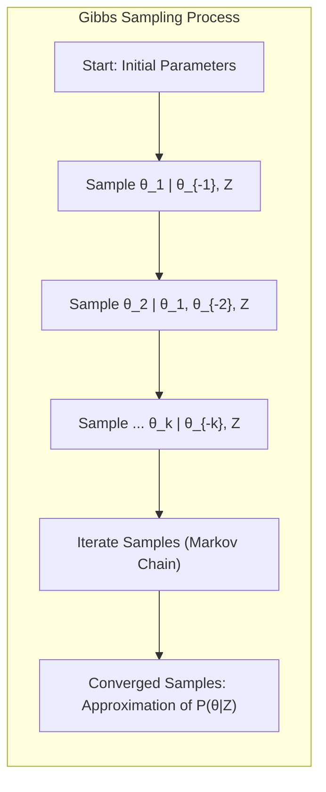
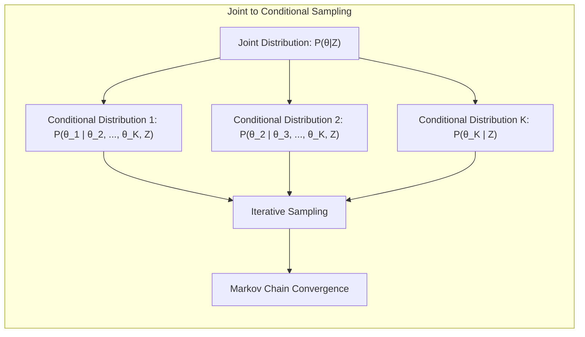
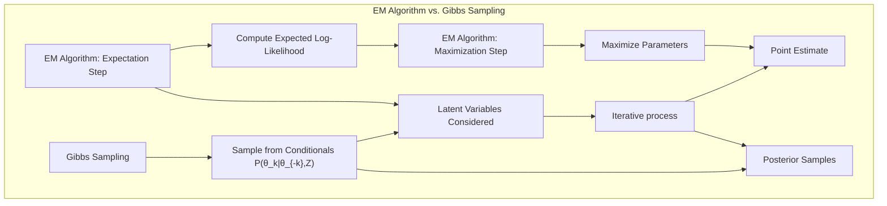
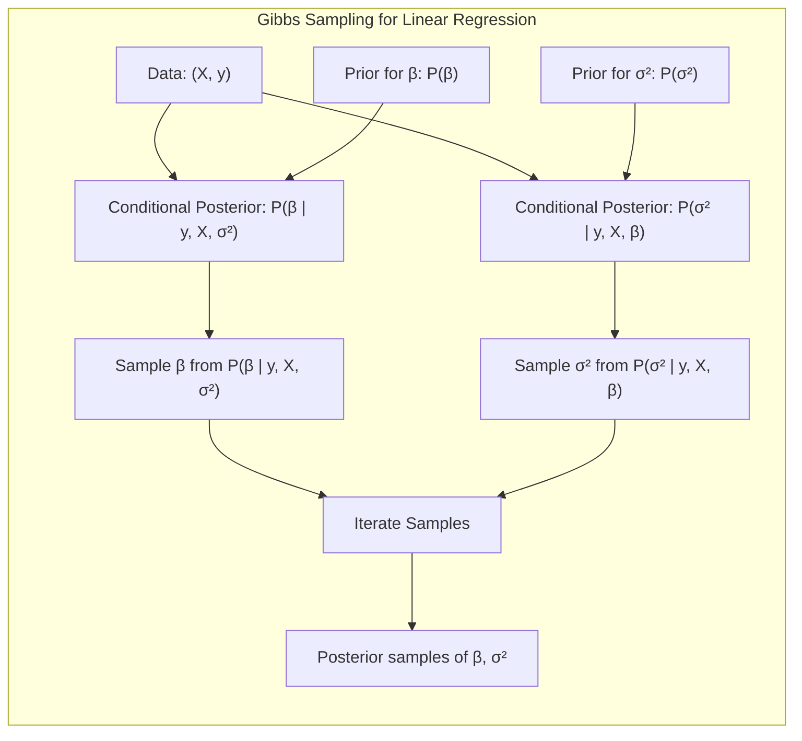
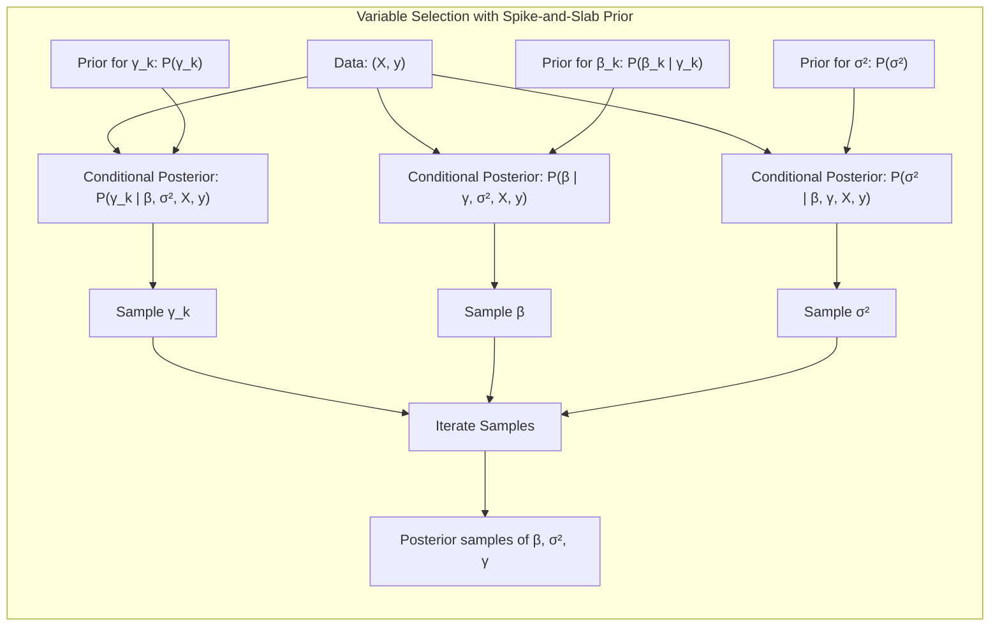
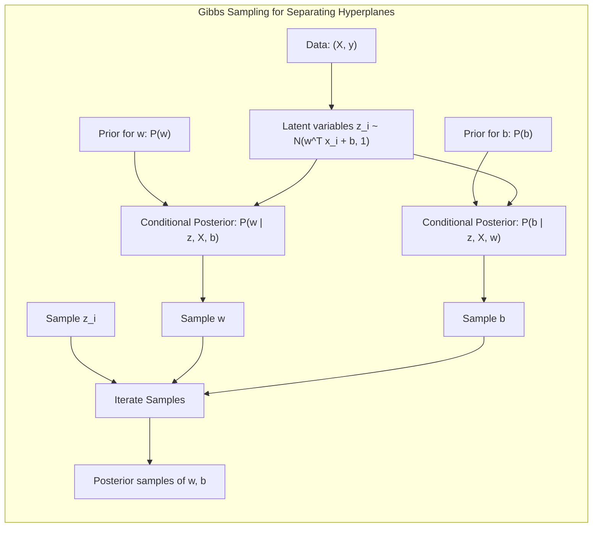

## Gibbs Sampling: A Deep Dive into Bayesian Computation


### Introdução
O **Gibbs Sampling**, um método de **Markov Chain Monte Carlo (MCMC)**, surge como uma ferramenta poderosa e versátil no contexto da inferência Bayesiana [^8.6]. Diferente de métodos de otimização que buscam um único ponto de máximo (como o EM Algorithm), o Gibbs Sampling visa gerar amostras da distribuição posterior, permitindo uma análise mais completa da incerteza associada aos parâmetros do modelo. Este capítulo explorará em detalhes o mecanismo do Gibbs Sampling, suas conexões com outros métodos computacionais, e sua relevância na obtenção de inferências Bayesianas robustas e confiáveis. O Gibbs Sampling se destaca por sua relativa simplicidade de implementação e por sua aplicabilidade a uma vasta gama de problemas, onde a obtenção direta da distribuição posterior é impraticável ou impossível.

### Conceitos Fundamentais
**Conceito 1:** *O problema da amostragem conjunta*. Em muitos problemas Bayesianos, estamos interessados em obter amostras da distribuição conjunta posterior, $Pr(\theta|Z)$, onde $\theta$ representa os parâmetros do modelo e $Z$ os dados observados [^8.6]. Contudo, a obtenção direta dessas amostras é muitas vezes complexa, pois a distribuição conjunta pode não ter uma forma analítica conhecida ou ser de alta dimensionalidade.

**Lemma 1:** *Decomposição da distribuição conjunta em distribuições condicionais*. O Gibbs Sampling explora a ideia de que, se é difícil amostrar da distribuição conjunta diretamente, é possível, em muitos casos, amostrar de distribuições condicionais, $Pr(\theta_k|\theta_{-k}, Z)$, onde $\theta_k$ é um componente do vetor de parâmetros $\theta$ e $\theta_{-k}$ representa todos os outros componentes [^8.6].

**Demonstração:** A distribuição conjunta $Pr(\theta|Z)$ pode ser escrita como o produto de distribuições condicionais. Para um vetor de parâmetros $\theta$ com $K$ componentes $\theta_1, \ldots, \theta_K$, podemos escrever:
$$ Pr(\theta | Z) = Pr(\theta_1 | \theta_2, \ldots, \theta_K, Z) \cdot Pr(\theta_2 | \theta_3, \ldots, \theta_K, Z) \cdot \ldots \cdot Pr(\theta_K | Z) $$
A amostragem dessas distribuições condicionais, em vez da conjunta, é o cerne do Gibbs Sampling. $\blacksquare$

> 💡 **Exemplo Numérico:**
> Suponha que temos dois parâmetros, $\theta_1$ e $\theta_2$, e queremos amostrar da distribuição conjunta $Pr(\theta_1, \theta_2 | Z)$.  Em vez de amostrar diretamente dessa distribuição, podemos amostrar alternadamente das condicionais:  $Pr(\theta_1 | \theta_2, Z)$ e $Pr(\theta_2 | \theta_1, Z)$. Se, por exemplo,  $Pr(\theta_1 | \theta_2, Z)$ é uma distribuição normal com média $\mu = 0.8\theta_2$ e desvio padrão $\sigma = 0.5$, e $Pr(\theta_2 | \theta_1, Z)$ é uma distribuição gama com parâmetros de forma $k = 2$ e escala $\lambda = 1/\theta_1$, podemos gerar uma cadeia de amostras da seguinte forma:
>
> 1.  Inicializamos com um valor arbitrário, por exemplo, $\theta_1^{(0)} = 1$ e $\theta_2^{(0)} = 0.5$.
> 2.  **Iteração 1:**
>     *   Amostramos $\theta_1^{(1)}$ de  $Pr(\theta_1 | \theta_2^{(0)}, Z) \sim \mathcal{N}(0.8 \cdot 0.5, 0.5^2)$, obtendo, digamos, $\theta_1^{(1)} = 0.6$.
>     *   Amostramos $\theta_2^{(1)}$ de  $Pr(\theta_2 | \theta_1^{(1)}, Z) \sim \text{Gamma}(2, 1/0.6)$, obtendo, digamos, $\theta_2^{(1)} = 0.8$.
> 3.  **Iteração 2:**
>    *   Amostramos $\theta_1^{(2)}$ de  $Pr(\theta_1 | \theta_2^{(1)}, Z) \sim \mathcal{N}(0.8 \cdot 0.8, 0.5^2)$, obtendo, digamos, $\theta_1^{(2)} = 0.9$.
>    *   Amostramos $\theta_2^{(2)}$ de  $Pr(\theta_2 | \theta_1^{(2)}, Z) \sim \text{Gamma}(2, 1/0.9)$, obtendo, digamos, $\theta_2^{(2)} = 0.7$.
>
>  Continuamos este processo iterativamente. Cada amostra $(\theta_1^{(t)}, \theta_2^{(t)})$ constitui um passo na cadeia de Markov. Após um número suficiente de iterações, as amostras convergem para a distribuição conjunta alvo $Pr(\theta_1, \theta_2 | Z)$.



**Conceito 2:** *Amostragem Iterativa e Cadeias de Markov*. O Gibbs Sampling é um processo iterativo [^8.6]. Em cada iteração $t$, amostramos cada componente $\theta_k$ de seu posterior condicional, usando os valores mais recentes dos outros componentes ($\theta_{-k}$) obtidos nas iterações anteriores. Desta forma, gera-se uma sequência de amostras $(\theta^{(1)}, \theta^{(2)}, \ldots)$, que formam uma Cadeia de Markov.

**Corolário 1:** *Convergência para a distribuição alvo*. Sob condições de regularidade, a cadeia de Markov gerada pelo Gibbs Sampling converge para uma distribuição estacionária que é igual à distribuição posterior $Pr(\theta|Z)$. Isso significa que, após um número suficiente de iterações, as amostras geradas se tornam amostras da distribuição posterior, e podemos usá-las para fazer inferências sobre os parâmetros do modelo.

**Conceito 3:** *Relação com o EM Algorithm*. O Gibbs Sampling tem uma conexão interessante com o EM Algorithm [^8.6]. No EM Algorithm, o passo de Expectation (E) calcula a esperança da log-verossimilhança completa (com dados latentes), e o passo de Maximização (M) maximiza essa esperança em relação aos parâmetros do modelo. No Gibbs Sampling, em vez de maximizar, amostramos dos condicionais posteriores, que também consideram os dados latentes como variáveis a serem amostradas.



### Regressão Linear e Mínimos Quadrados para Classificação


O Gibbs Sampling pode ser aplicado a diversos modelos Bayesianos, incluindo a regressão linear. Suponha que tenhamos um modelo de regressão linear, $y = X\beta + \epsilon$, com $\epsilon \sim \mathcal{N}(0, \sigma^2)$. No contexto Bayesiano, definimos *priors* para os parâmetros $\beta$ e $\sigma^2$. Com isso, o objetivo é amostrar da distribuição posterior $Pr(\beta, \sigma^2|y, X)$.

O processo do Gibbs Sampling para este modelo envolve os seguintes passos:

1.  **Inicialização:** Começamos com valores iniciais para $\beta$ e $\sigma^2$.
2.  **Amostragem de $\beta$:** Dado os dados $y, X$ e o valor atual de $\sigma^2$, amostramos de sua distribuição condicional posterior. Sob priors normais conjugados para $\beta$, a distribuição condicional posterior de $\beta$ é também normal, de modo que a amostragem é fácil:
    $$ Pr(\beta|y, X, \sigma^2) \sim \mathcal{N}(m, V) $$
     onde $m$ e $V$ são parâmetros que dependem dos *priors* e dos dados [^8.6].
3.  **Amostragem de $\sigma^2$:** Dado os dados e o valor atual de $\beta$, amostramos de sua distribuição condicional posterior. Sob um prior conjugado inverso-gama para $\sigma^2$, sua distribuição condicional posterior também é inverso-gama, facilitando a amostragem:
    $$ Pr(\sigma^2|y, X, \beta) \sim \text{Inv-Gamma}(a,b) $$
     onde $a$ e $b$ são parâmetros que dependem dos *priors* e dos dados [^8.6].
4.  **Iteração:** Repetimos os passos 2 e 3 por um número suficiente de iterações, até que a cadeia de Markov tenha convergido para a distribuição estacionária.

**Lemma 2:** *Conjugação em modelos lineares*. O uso de *priors conjugados* (normal para $\beta$ e inverso-gama para $\sigma^2$) simplifica enormemente o processo de amostragem no Gibbs Sampling, pois garantem que as distribuições condicionais posteriores sejam da mesma família do *prior*. Isso facilita a obtenção das amostras.

**Corolário 2:** *Inferência Bayesiana*. Após a convergência, as amostras geradas pelo Gibbs Sampling podem ser usadas para fazer inferências Bayesianas sobre os parâmetros do modelo, como calcular médias posteriores, intervalos de confiança, e fazer predições.

> 💡 **Exemplo Numérico:**
> Considere um modelo de regressão linear com um preditor, onde $y = X\beta + \epsilon$, e $\epsilon \sim \mathcal{N}(0, \sigma^2)$. Suponha que tenhamos os seguintes dados:
> ```python
> import numpy as np
> import scipy.stats as st
>
> X = np.array([[1], [2], [3], [4], [5]])
> y = np.array([2, 4, 5, 4, 5])
> ```
>
> Assumimos *priors* conjugados:
> *   $\beta \sim \mathcal{N}(0, 10)$ (prior normal com média 0 e variância 10)
> *   $\sigma^2 \sim \text{Inv-Gamma}(2, 2)$ (prior inverso-gama com parâmetros $a=2$ e $b=2$)
>
>  A distribuição condicional posterior para $\beta$ é $\mathcal{N}(m, V)$, onde
>
>  $V = (X^T X / \sigma^2 + 1/10)^{-1}$ e $m = V(X^T y / \sigma^2)$
>
>  A distribuição condicional posterior para $\sigma^2$ é  $\text{Inv-Gamma}(a', b')$, onde:
>
>   $a' = a + n/2$, com $n$ sendo o número de amostras.
>
>   $b' = b + 0.5 \sum_i (y_i - X_i\beta)^2$
>
>  Inicializamos o Gibbs Sampling com $\beta^{(0)} = 0.5$ e $\sigma^{2(0)} = 1$.
>
>  **Iteração 1:**
>  1. Amostrando $\beta^{(1)}$:
>   * Calculamos $V = ((X.T @ X) / \sigma^{2(0)} + 1/10)^{-1} = ((55)/1 + 0.1)^{-1} = 0.018$
>   * Calculamos $m = V(X.T @ y / \sigma^{2(0)}) =  0.018 * 47 / 1 = 0.846$.
>    *   Amostramos $\beta^{(1)}$ de  $\mathcal{N}(0.846, 0.018)$, obtendo, digamos, $\beta^{(1)} = 0.9$.
> 2. Amostrando $\sigma^{2(1)}$:
>    *   Calculamos $a' = 2 + 5/2 = 4.5$.
>    *   Calculamos $b' = 2 + 0.5 * \sum_i (y_i - X_i\beta^{(1)})^2 = 2 + 0.5 * ( (2-0.9)^2 + (4-1.8)^2 + (5-2.7)^2 + (4-3.6)^2 + (5-4.5)^2) = 2 + 0.5 * 6.24 = 5.12$
>    *  Amostramos $\sigma^{2(1)}$ de  $\text{Inv-Gamma}(4.5, 5.12)$, obtendo, digamos, $\sigma^{2(1)} = 1.2$.
>
> Repetimos o processo para várias iterações. As amostras obtidas de $\beta$ e $\sigma^2$ são usadas para calcular suas médias posteriores e intervalos de confiança.
>
> ```python
> def gibbs_sampling_linear_regression(X, y, iterations=1000, initial_beta=0.5, initial_sigma2=1, prior_beta_mean=0, prior_beta_var=10, prior_sigma2_a=2, prior_sigma2_b=2):
>    n = len(y)
>    beta_samples = np.zeros(iterations)
>    sigma2_samples = np.zeros(iterations)
>
>    beta_current = initial_beta
>    sigma2_current = initial_sigma2
>
>    for i in range(iterations):
>        # Amostra beta
>        V = np.linalg.inv((X.T @ X) / sigma2_current + 1/prior_beta_var)
>        m = V @ (X.T @ y / sigma2_current)
>        beta_current = np.random.normal(m, np.sqrt(V))
>
>        # Amostra sigma2
>        a_prime = prior_sigma2_a + n/2
>        b_prime = prior_sigma2_b + 0.5 * np.sum((y - X @ beta_current)**2)
>        sigma2_current = 1/np.random.gamma(a_prime, 1/b_prime)
>
>        beta_samples[i] = beta_current
>        sigma2_samples[i] = sigma2_current
>    return beta_samples, sigma2_samples
>
> beta_samples, sigma2_samples = gibbs_sampling_linear_regression(X, y)
>
> print(f"Posterior mean of beta: {np.mean(beta_samples)}")
> print(f"Posterior mean of sigma^2: {np.mean(sigma2_samples)}")
> ```

### Métodos de Seleção de Variáveis e Regularização em Classificação


O Gibbs Sampling pode ser adaptado para lidar com a seleção de variáveis no contexto de modelos Bayesianos. Isso é feito usando técnicas de *spike-and-slab prior*, onde um indicador binário determina se uma variável está ou não incluída no modelo.

1.  **Modelo base:** Considere um modelo linear, $y = X\beta + \epsilon$, com $\epsilon \sim \mathcal{N}(0, \sigma^2)$.
2.  **Prior spike-and-slab:** Para cada componente $\beta_k$ do vetor de parâmetros $\beta$, introduzimos um indicador binário $\gamma_k$, tal que:

    -   Se $\gamma_k = 1$, então $\beta_k \sim \mathcal{N}(0, \tau^2)$ (o "slab"), onde $\tau^2$ é uma variância.
    -   Se $\gamma_k = 0$, então $\beta_k = 0$ (o "spike").
    -   Adotamos um *prior* para $\gamma_k$, por exemplo, $Pr(\gamma_k = 1) = \pi$.
3.  **Gibbs sampling:** O algoritmo agora envolve a amostragem iterativa de:
    -   Os indicadores de inclusão $\gamma_k$, condicional a $\beta$ e $\sigma^2$.
    -   Os coeficientes $\beta_k$, condicional aos indicadores $\gamma$ e $\sigma^2$ .
    -   A variância $\sigma^2$, condicional a $\beta$ e aos dados.

**Lemma 3:** *Distribuição condicional para $\gamma_k$*. A distribuição condicional para $\gamma_k$ é de Bernoulli, com parâmetro que depende de $\beta_k$, dos dados e do *prior* [^8.6]. A amostragem de $\gamma_k$ decide se a variável está incluída ou não no modelo na iteração atual.

**Prova do Lemma 3:** A probabilidade condicional de inclusão $\gamma_k$, dado os dados e os demais parâmetros, é dada por:
$$Pr(\gamma_k=1| \beta, \sigma^2, X, y) = \frac{Pr(y|X,\beta, \sigma^2, \gamma_k=1)Pr(\beta_k|\gamma_k=1)Pr(\gamma_k=1)}{Pr(y|X,\beta, \sigma^2,\gamma_k=1)Pr(\beta_k|\gamma_k=1)Pr(\gamma_k=1) + Pr(y|X,\beta, \sigma^2,\gamma_k=0)Pr(\beta_k|\gamma_k=0)Pr(\gamma_k=0)}$$
Os termos de verossimilhança $Pr(y|X,\beta, \sigma^2, \gamma_k)$, as *priors* de $\beta_k$ (normal ou zero), e as *priors* de $\gamma_k$ (Bernoulli) permitem calcular essa probabilidade. $\blacksquare$

**Corolário 3:** *Inferência sobre a seleção de variáveis*. As amostras geradas pelos indicadores $\gamma_k$ podem ser utilizadas para avaliar a probabilidade posterior de cada variável estar incluída no modelo. Variáveis com alta probabilidade posterior têm maior probabilidade de estarem de fato relacionadas à resposta.

> 💡 **Exemplo Numérico:**
> Suponha que temos um modelo com dois preditores, $X_1$ e $X_2$, e queremos usar o *spike-and-slab prior* para selecionar variáveis.
>  Definimos que $y = X_1\beta_1 + X_2\beta_2 + \epsilon$, com $\epsilon \sim \mathcal{N}(0, \sigma^2)$.
>  Introduzimos os indicadores $\gamma_1$ e $\gamma_2$ para $X_1$ e $X_2$, respectivamente.
>  Vamos usar um prior $Pr(\gamma_k = 1) = 0.5$.
>  Assumimos que $\tau^2 = 1$.
>  Usando os mesmos dados anteriores e adicionando uma coluna para $X_2$:
> ```python
> import numpy as np
> import scipy.stats as st
>
> X = np.array([[1, 2], [2, 1], [3, 3], [4, 2], [5, 4]])
> y = np.array([2, 4, 5, 4, 5])
> ```
>
>  Inicializamos o Gibbs Sampling com $\beta^{(0)} = [0.5, 0.5]$, $\sigma^{2(0)} = 1$ e $\gamma^{(0)} = [1,1]$.
>
>  **Iteração 1:**
>  1.  Amostrando $\gamma_1^{(1)}$ e $\gamma_2^{(1)}$:
>    *  Para $\gamma_1$, calculamos a probabilidade de $\gamma_1 = 1$ usando os valores atuais de $\beta_1$, $\sigma^2$ e os dados, e amostramos de uma distribuição de Bernoulli. Suponha que amostramos $\gamma_1^{(1)} = 1$.
>    *   Fazemos o mesmo para $\gamma_2$, calculando a probabilidade de $\gamma_2 = 1$, e amostramos de uma distribuição de Bernoulli. Suponha que amostramos $\gamma_2^{(1)} = 0$.
> 2. Amostrando $\beta^{(1)}$:
>    * Se $\gamma_1 = 1$, amostramos $\beta_1$ de sua condicional posterior (normal), usando os dados e $\sigma^2$. Se $\gamma_1=0$, então $\beta_1=0$. Suponha que amostramos $\beta_1^{(1)} = 0.8$.
>   * Se $\gamma_2 = 1$, amostramos $\beta_2$ de sua condicional posterior (normal), usando os dados e $\sigma^2$. Se $\gamma_2=0$, então $\beta_2=0$. Suponha que amostramos $\beta_2^{(1)} = 0$.
>
> 3. Amostrando $\sigma^{2(1)}$:
>    * Amostramos $\sigma^{2(1)}$ de sua condicional posterior (inversa-gama), usando os dados e $\beta$. Suponha que amostramos $\sigma^{2(1)} = 1.1$.
>
> Após várias iterações, as amostras de $\gamma_1$ e $\gamma_2$ são usadas para calcular as probabilidades posteriores de cada variável ser incluída no modelo.
> ```python
> def gibbs_sampling_variable_selection(X, y, iterations=1000, prior_gamma_prob=0.5, tau2=1, initial_beta=None, initial_sigma2=1, prior_sigma2_a=2, prior_sigma2_b=2):
>    n, p = X.shape
>    beta_samples = np.zeros((iterations, p))
>    sigma2_samples = np.zeros(iterations)
>    gamma_samples = np.zeros((iterations, p))
>
>    if initial_beta is None:
>        initial_beta = np.zeros(p)
>
>    beta_current = initial_beta
>    sigma2_current = initial_sigma2
>    gamma_current = np.ones(p)
>
>    for i in range(iterations):
>        # Amostra gammas
>        for k in range(p):
>           X_k = X[:, k].reshape(-1, 1) # Transforma a coluna k de X em uma matriz coluna
>           if gamma_current[k] == 1:
>              likelihood_gamma1 = st.norm.pdf(y, X @ beta_current, np.sqrt(sigma2_current))
>           else:
>              likelihood_gamma1 = 1 # Likelihood is 1 if gamma_k = 0
>
>           likelihood_gamma0 = st.norm.pdf(y, X @ (beta_current * (1 - np.eye(p)[k])), np.sqrt(sigma2_current)) # Define beta_k as 0 if gamma_k=0
>
>           numerator = np.prod(likelihood_gamma1) * prior_gamma_prob
>           denominator = numerator + np.prod(likelihood_gamma0) * (1 - prior_gamma_prob)
>           prob_gamma1 = numerator / denominator
>           gamma_current[k] = np.random.binomial(1, prob_gamma1)
>
>        # Amostra beta
>        for k in range(p):
>            if gamma_current[k] == 1:
>              X_k = X[:, k].reshape(-1, 1)
>              V = np.linalg.inv(X_k.T @ X_k / sigma2_current + 1/tau2)
>              m = V @ (X_k.T @ (y - X @ (beta_current * (1 - np.eye(p)[k] )) )/ sigma2_current)
>              beta_current[k] = np.random.normal(m, np.sqrt(V))
>            else:
>                beta_current[k] = 0
>
>
>        # Amostra sigma2
>        a_prime = prior_sigma2_a + n/2
>        b_prime = prior_sigma2_b + 0.5 * np.sum((y - X @ beta_current)**2)
>        sigma2_current = 1/np.random.gamma(a_prime, 1/b_prime)
>
>        beta_samples[i] = beta_current
>        sigma2_samples[i] = sigma2_current
>        gamma_samples[i] = gamma_current
>    return beta_samples, sigma2_samples, gamma_samples
>
> beta_samples, sigma2_samples, gamma_samples = gibbs_sampling_variable_selection(X,y)
>
>
> print(f"Posterior mean of beta: {np.mean(beta_samples, axis=0)}")
> print(f"Posterior mean of sigma^2: {np.mean(sigma2_samples)}")
> print(f"Posterior probability of variable 1 inclusion: {np.mean(gamma_samples[:, 0])}")
> print(f"Posterior probability of variable 2 inclusion: {np.mean(gamma_samples[:, 1])}")
> ```

> ⚠️ **Ponto Crucial**: O uso do *spike-and-slab prior* permite realizar a seleção de variáveis diretamente no processo de inferência Bayesiana, sem a necessidade de testes de hipótese ou outros critérios de seleção.

### Separating Hyperplanes e Perceptrons


O Gibbs Sampling pode ser aplicado no contexto de *separating hyperplanes* para encontrar um hiperplano ótimo em modelos classificatórios lineares, em contextos onde o modelo é visto como uma distribuição de probabilidade sobre as classes, ao invés de apenas uma função discriminante.

1.  **Modelo:** Considere um modelo com hiperplanos definidos por $w^T x + b = 0$, onde $w$ é o vetor de pesos, $x$ é o vetor de *features* e $b$ é o *bias*.
2.  **Formulação probabilística:** Definimos a probabilidade de um ponto $x_i$ pertencer à classe 1 ou 0, com uma função sigmoide ou similar.
3.  **Introdução de variáveis latentes:** Para a aplicação do Gibbs Sampling, podemos introduzir variáveis latentes $z_i$, que indicam a probabilidade condicional de cada ponto $x_i$ pertencer a uma dada classe dado os parâmetros.
4.  **Processo iterativo:** Em cada iteração do Gibbs Sampling, amostramos:
    -   Os parâmetros $w$, dado as classes, os pontos e o *bias*, a partir de suas distribuições condicionais posteriores (normal ou similar)
    -   O *bias* $b$, dado as classes, os pontos e os pesos
    -   As variáveis latentes $z_i$, dado os parâmetros do hiperplano

**Teorema 1:** *Convergência do Gibbs Sampling para o problema do *separating hyperplane*.* Sob certas condições de regularidade (e com um *prior* razoável para $w$ e $b$), a sequência de amostras geradas pelo Gibbs Sampling converge para a distribuição posterior do hiperplano, condicionada aos dados.

> 💡 **Exemplo Numérico:**
> Suponha que temos um problema de classificação binária com dois *features*, onde as classes são separadas por um hiperplano. Queremos amostrar a distribuição posterior dos parâmetros do hiperplano usando Gibbs Sampling.
>  Os dados de entrada $X$ e os rótulos $y$ podem ser representados como:
> ```python
> import numpy as np
> import scipy.stats as st
>
> X = np.array([[1, 2], [2, 1], [3, 3], [4, 2], [5, 4], [1, 1], [2, 2], [3, 1], [4, 3], [5, 2]])
> y = np.array([1, 1, 1, 1, 1, 0, 0, 0, 0, 0])
> ```
>
> O hiperplano é definido por $w^T x + b = 0$. Usamos uma função sigmoide para calcular a probabilidade de um ponto pertencer à classe 1:
>  $P(y_i=1|x_i, w, b) = \frac{1}{1+exp(-(w^T x_i + b))}$.
>  Introduzimos as variáveis latentes $z_i$, onde $z_i \sim \mathcal{N}(w^T x_i + b, 1)$ para simular a função sigmoide.
>  Definimos *priors* para os parâmetros: $w \sim \mathcal{N}(0, \Sigma)$ e $b \sim \mathcal{N}(0, 1)$, onde $\Sigma$ é a matriz de covariância.
>  Inicializamos $w^{(0)} = [0.5, 0.5]$ e $b^{(0)} = 0.1$ e $z_i^{(0)}$ com valores arbitrários.
>
> **Iteração 1:**
> 1.  Amostrando $z_i$:
>      * Para cada ponto $x_i$, amostramos $z_i$ de sua distribuição condicional $z_i \sim \mathcal{N}(w^T x_i + b, 1)$. Suponha que amostramos $z^{(1)} = [1, 0.5, 1.2, 1.5, 1.1, -0.8, -0.4, -0.7, -0.2, -0.9]$.
> 2. Amostrando $w$:
>    *  Amostramos $w$ de sua distribuição condicional, que é uma distribuição normal com parâmetros dependentes de $z$, $b$ e $X$. Suponha que amostramos $w^{(1)} = [0.8, -0.6]$.
> 3.  Amostrando $b$:
>    * Amostramos $b$ de sua distribuição condicional, que também é uma normal com parâmetros dependentes de $z$ e $X$ e $w$. Suponha que amostramos $b^{(1)} = -0.2$.
>
> Este processo é repetido por várias iterações, e as amostras obtidas para $w$ e $b$ são usadas para fazer inferência sobre o hiperplano separador.
>
> ```python
> import numpy as np
> import scipy.stats as st
>
> def gibbs_sampling_separating_hyperplane(X, y, iterations=1000, prior_w_