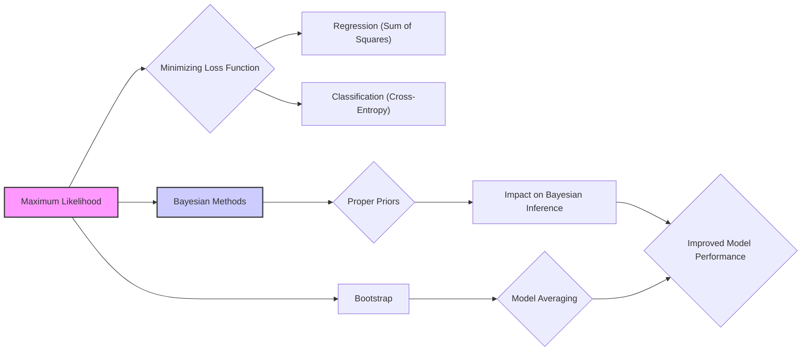
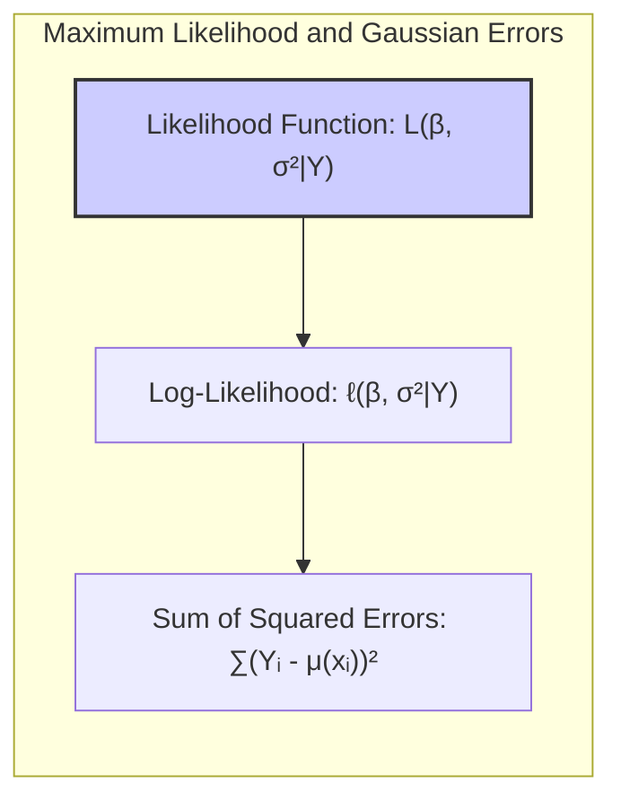
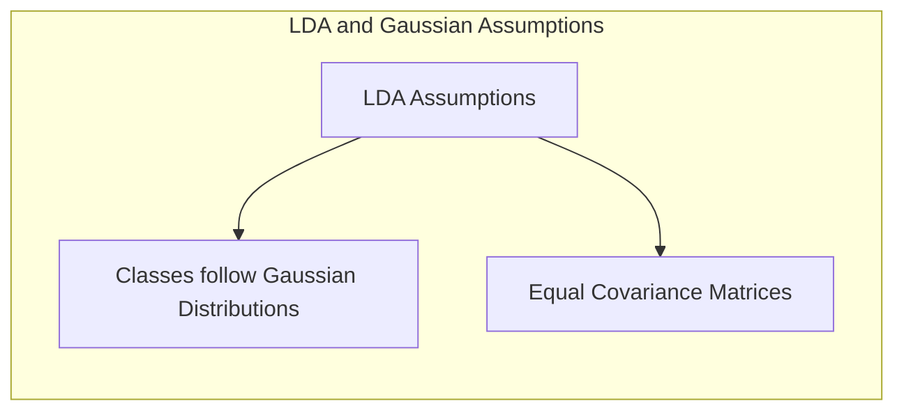
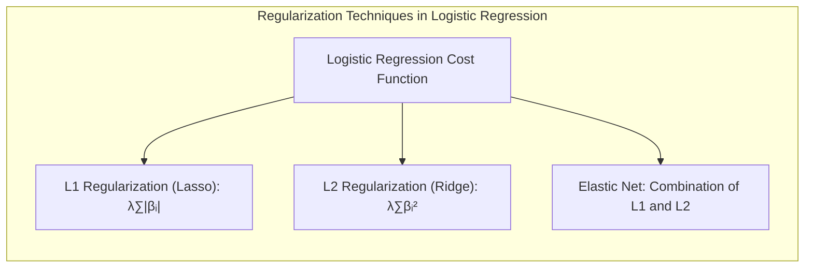
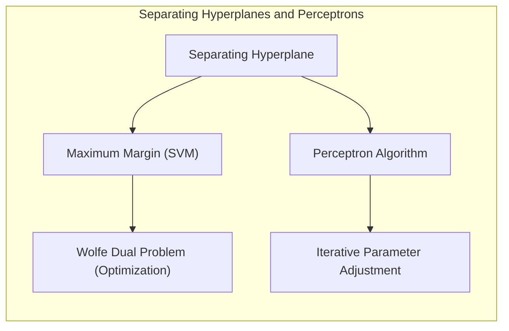
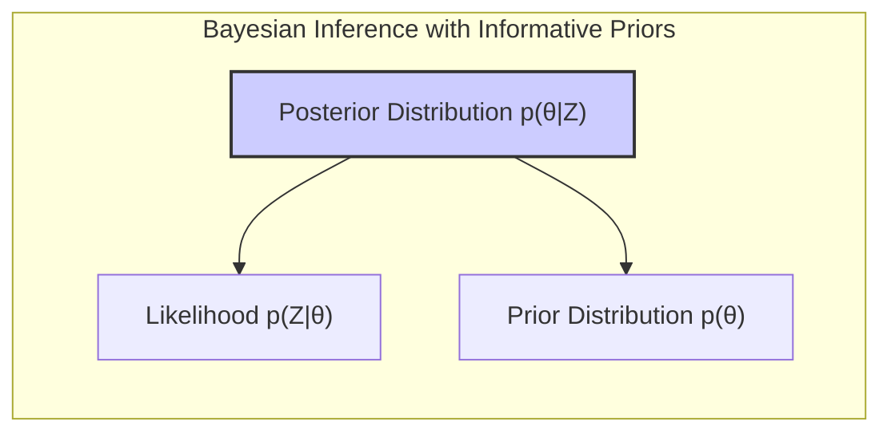

## Model Inference and Averaging with Proper Priors

### Introdução

O processo de ajuste de modelos, conforme abordado em [^8.1], geralmente envolve a minimização de alguma função de perda, seja ela uma soma de quadrados para regressão ou cross-entropia para classificação. Estas abordagens são instâncias da metodologia de **Maximum Likelihood (ML)**. Este capítulo explora uma exposição mais geral da ML, introduz o método Bayesiano para inferência, e discute a técnica do *bootstrap* [^8.1]. Além disso, abordamos como essas técnicas se relacionam e como elas podem ser usadas para realizar a média de modelos e melhorias. Um aspecto crucial é a consideração de *proper priors*, que serão exploradas em detalhe neste capítulo, impactando notavelmente a inferência Bayesiana.

### Conceitos Fundamentais

**Conceito 1: Maximum Likelihood (ML)**
O método de **Maximum Likelihood** busca estimar os parâmetros de um modelo através da maximização da função de verossimilhança (likelihood), que representa a probabilidade dos dados observados dado os parâmetros do modelo [^8.1]. Esta abordagem, embora eficaz, assume que os dados observados são a única fonte de informação sobre os parâmetros, ignorando qualquer conhecimento prévio que possamos ter sobre eles.

**Lemma 1:** Para um modelo com erros Gaussianos, a minimização da soma dos erros quadrados é equivalente à maximização da verossimilhança.
*Prova:*
Suponha que os erros $\epsilon_i$ são independentes e identicamente distribuídos com uma distribuição normal com média zero e variância $\sigma^2$, ou seja, $\epsilon_i \sim \mathcal{N}(0, \sigma^2)$. Dado um modelo linear $Y_i = \mu(x_i) + \epsilon_i$, a função de verossimilhança para os parâmetros $\beta$ e $\sigma^2$ pode ser escrita como:
$$L(\beta, \sigma^2 | Y) = \prod_{i=1}^N \frac{1}{\sqrt{2\pi\sigma^2}} \exp\left(-\frac{(Y_i - \mu(x_i))^2}{2\sigma^2}\right)$$
Tomando o logaritmo, temos o log-likelihood:
$$\ell(\beta, \sigma^2 | Y) = -\frac{N}{2}\log(2\pi\sigma^2) - \frac{1}{2\sigma^2}\sum_{i=1}^N (Y_i - \mu(x_i))^2$$
Maximizar o log-likelihood em relação a $\beta$ é equivalente a minimizar a soma dos quadrados dos erros $\sum_{i=1}^N (Y_i - \mu(x_i))^2$.  $\blacksquare$

> 💡 **Exemplo Numérico:** Considere um modelo linear simples $Y_i = \beta_0 + \beta_1 x_i + \epsilon_i$ com três observações: $(x_1, Y_1) = (1, 3)$, $(x_2, Y_2) = (2, 5)$, e $(x_3, Y_3) = (3, 7)$.  Assumindo $\epsilon_i \sim \mathcal{N}(0, \sigma^2)$, o objetivo é encontrar $\beta_0$ e $\beta_1$ que maximizem a verossimilhança (ou equivalentemente, minimizem a soma dos quadrados dos erros).  Usando a abordagem de mínimos quadrados, podemos encontrar $\hat{\beta}_0 = 1$ e $\hat{\beta}_1 = 2$.  O log-likelihood para estes parâmetros (e um $\sigma^2$ estimado) seria avaliado e maximizado. Note que a minimização da soma dos quadrados dos erros $\sum_{i=1}^3 (Y_i - (\beta_0 + \beta_1 x_i))^2$ leva aos mesmos valores de $\beta_0$ e $\beta_1$.

**Conceito 2: Linear Discriminant Analysis (LDA) e Gaussianidade**
O LDA, frequentemente usado para classificação, assume que as classes seguem distribuições Gaussianas com covariâncias iguais. Essa suposição simplifica o problema, permitindo a criação de fronteiras lineares de decisão [^8.3]. Contudo, na prática, nem sempre essa premissa se mantém, e modelos como *Logistic Regression*, podem ser mais flexíveis e apresentar melhor desempenho [^8.4]. A conexão com a ML reside no fato de que as estimativas de parâmetros no LDA podem ser derivadas através da maximização da verossimilhança sob as suposições gaussianas.

**Corolário 1:** Quando as suposições de gaussianidade do LDA não se sustentam, é preferível utilizar abordagens como *Logistic Regression* que não dependem estritamente dessas premissas. A *Logistic Regression* também maximiza a verossimilhança, mas sob uma função logística.

> 💡 **Exemplo Numérico:** Suponha que temos duas classes de dados em duas dimensões, uma com média $\mu_1 = [1, 1]$ e outra com média $\mu_2 = [3, 3]$. Se as covariâncias das classes são aproximadamente iguais, o LDA funcionaria bem. No entanto, se uma classe tem alta variância em uma direção e a outra em outra direção, o LDA pode ter um desempenho ruim devido à suposição de covariâncias iguais, e a regressão logística ou outras abordagens se tornariam mais apropriadas.

**Conceito 3: Logistic Regression e Prior Não-Informativo**
A *Logistic Regression*, ao contrário do LDA, não assume distribuições Gaussianas para os preditores. Ela modela a probabilidade de uma classe através de uma função logística, conectando essa probabilidade a uma combinação linear dos preditores. A *Logistic Regression* também envolve a maximização da função de verossimilhança. Em uma abordagem *frequentist*, um *prior* não-informativo é frequentemente utilizado (como o constante). Na prática, no contexto *frequentist*, o *prior* é geralmente ignorado, o que pode levar a problemas em situações de dados escassos ou quando há forte *colinearidade*.

> ⚠️ **Nota Importante**: O uso de um prior não-informativo, embora comum, não é sem suas limitações, especialmente quando a quantidade de dados é limitada ou quando há multicolinearidade entre as variáveis preditoras. **Referência ao tópico [^8.1]**.

> 💡 **Exemplo Numérico:** Imagine que você esteja modelando a probabilidade de um cliente comprar um produto com base em duas variáveis: idade ($x_1$) e renda ($x_2$). Usando regressão logística, modelamos a probabilidade como $P(Y=1|x_1, x_2) = \frac{1}{1 + e^{-(\beta_0 + \beta_1 x_1 + \beta_2 x_2)}}$.  A abordagem de ML estimaria $\beta_0$, $\beta_1$ e $\beta_2$ maximizando a verossimilhança dos dados observados. Um *prior* não informativo seria implícito, sem influenciar a solução. No entanto, se houvesse colinearidade entre idade e renda (por exemplo, pessoas mais velhas geralmente terem renda maior), a estimativa ML pode se tornar instável.

### Regressão Linear e Mínimos Quadrados para Classificação

**Explicação:** Diagrama que ilustra o processo de regressão linear com matriz de indicadores para classificação.

A regressão linear pode ser aplicada para classificação usando matrizes de indicadores, onde cada classe é representada por uma coluna. A ideia é ajustar um modelo linear para prever a probabilidade de uma observação pertencer a uma dada classe. A matriz de indicadores é criada de modo que as colunas sejam variáveis *dummy* (0 ou 1), indicando a classe a que cada amostra pertence [^8.2]. Entretanto, essa abordagem pode ter limitações, especialmente quando há muitas classes ou se estas não são linearmente separáveis.

**Lemma 2:** Em um cenário de classificação binária com classes linearmente separáveis, a regressão linear com matriz de indicadores pode gerar hiperplanos de decisão equivalentes aos obtidos por outras abordagens como LDA sob condições específicas.
*Prova:* Em um problema de classificação binária com duas classes distintas, a regressão linear com matrizes de indicadores busca estimar um modelo linear da forma $Y = X\beta + \epsilon$, onde $Y$ é um vetor de indicadores (0 ou 1) para cada classe, e $X$ é a matriz de preditores. Sob condições de linear separabilidade, os parâmetros $\beta$ estimados por mínimos quadrados formam um hiperplano que separa as duas classes com erro mínimo. Esse hiperplano é equivalente aos hiperplanos gerados por LDA quando a variância dentro das classes é aproximadamente a mesma. $\blacksquare$

> 💡 **Exemplo Numérico:** Considere um conjunto de dados de classificação binária com duas características: $x_1$ e $x_2$.  Para a classe 0, temos os pontos (1, 1), (2, 1), e para a classe 1, temos os pontos (2, 2), (3, 2). Criamos uma matriz de indicadores *Y*, onde os valores para a classe 0 são 0, e para a classe 1 são 1. Usamos uma regressão linear para ajustar um modelo $Y = \beta_0 + \beta_1 x_1 + \beta_2 x_2$. A estimativa dos coeficientes $\beta$ por mínimos quadrados levará a um hiperplano que tenta separar as duas classes. Em dados linearmente separáveis, este hiperplano pode ser similar ao gerado pelo LDA.

**Corolário 2:** Embora a regressão linear com matriz de indicadores seja uma abordagem simples para classificação, ela pode sofrer em cenários com mais de duas classes ou quando a separabilidade linear não é garantida, necessitando de abordagens mais robustas e flexíveis.

> ❗ **Ponto de Atenção**: A regressão linear com matriz de indicadores, embora simples, pode levar a extrapolações problemáticas em cenários de classificação. **Conforme indicado em [^8.2]**. É crucial avaliar os resultados com cautela, especialmente em problemas com classes não-balanceadas ou dados de treinamento limitados.

### Métodos de Seleção de Variáveis e Regularização em Classificação

A seleção de variáveis e a regularização são técnicas essenciais para lidar com problemas de overfitting, especialmente quando temos muitas variáveis preditoras [^8.5]. Na classificação, isso é particularmente relevante para aumentar a estabilidade e a interpretabilidade dos modelos. Técnicas como a regularização L1 (Lasso) e L2 (Ridge) são comumente usadas para esse fim, adicionando termos de penalização à função de custo que é otimizada durante o treinamento. A regularização L1 tende a produzir modelos esparsos, ou seja, com muitos coeficientes iguais a zero, enquanto a L2 reduz a magnitude dos coeficientes, contribuindo para um modelo mais estável.

**Lemma 3:** A penalização L1 na classificação logística leva a coeficientes esparsos devido ao formato da norma L1 e sua relação com as derivadas da função de custo.
*Prova:*
Na regressão logística, a função de custo é a log-verossimilhança negativa, que é uma função convexa dos parâmetros $\beta$. A regularização L1 adiciona um termo de penalização proporcional à soma dos valores absolutos dos coeficientes:
$$ J(\beta) = -\ell(\beta) + \lambda \sum_{j=1}^p |\beta_j| $$
onde $\lambda$ é o parâmetro de regularização. Ao tentar minimizar $J(\beta)$, o termo de penalização L1 favorece soluções com coeficientes $\beta_j$ iguais a zero, resultando em um modelo mais esparso. Isso ocorre porque a derivada da norma L1 é constante (exceto no ponto zero), o que promove soluções nos eixos, resultando em muitos parâmetros com valores iguais a zero. $\blacksquare$

> 💡 **Exemplo Numérico:** Considere um problema de classificação com 5 variáveis preditoras, e uma variável alvo binária. Ao ajustar uma regressão logística sem regularização, todos os 5 coeficientes são estimados, podendo ocorrer overfitting. Com regularização L1 (Lasso), a função de custo se torna $J(\beta) = -\ell(\beta) + \lambda (|\beta_1| + |\beta_2| + |\beta_3| + |\beta_4| + |\beta_5|)$. Se $\lambda$ for suficientemente grande, alguns dos coeficientes $\beta_j$ serão forçados a ser exatamente zero, simplificando o modelo e, consequentemente, selecionando as variáveis mais relevantes para a classificação. Por exemplo, se os coeficientes resultantes fossem $\beta = [2, 0, 1.5, 0, 0]$, apenas $x_1$ e $x_3$ seriam considerados preditores relevantes.

**Corolário 3:** Modelos com regularização L1 não apenas evitam overfitting, mas também oferecem maior interpretabilidade por selecionar apenas as variáveis mais relevantes para a classificação, o que facilita a identificação dos preditores mais importantes para o resultado.

> ✔️ **Destaque**: Regularização não apenas melhora a generalização do modelo, mas também simplifica a interpretação dos resultados, permitindo a identificação das variáveis mais importantes para a classificação. **Baseado no tópico [^8.5]**.

### Separating Hyperplanes e Perceptrons

Os **separating hyperplanes** são fundamentais em modelos de classificação linear, onde o objetivo é encontrar um hiperplano que separe as classes de dados. A ideia de maximizar a margem entre as classes leva a formulações de otimização como o problema de **Support Vector Machine (SVM)**. O problema dual de Wolfe, como referenciado em [^8.5.2], é uma ferramenta importante para resolver esses problemas de otimização, permitindo expressar o problema original como uma função de seus multiplicadores de Lagrange.

O **Perceptron** de Rosenblatt [^8.5.1] é um algoritmo que busca iterativamente encontrar um hiperplano de separação. Esse algoritmo converge quando os dados são linearmente separáveis, mas pode não convergir em outros casos. A ideia principal é usar os dados de treinamento para ajustar um modelo linear de forma iterativa.

> 💡 **Exemplo Numérico:** Imagine dois grupos de pontos 2D, o primeiro grupo (classe 0) como (1,2), (1.5, 1.8), (1.2, 1.5) e o segundo grupo (classe 1) (3,4), (3.5, 3.8), (3.2, 4.2). Um hiperplano (neste caso uma linha) separador pode ser definido como $\beta_0 + \beta_1 x_1 + \beta_2 x_2 = 0$. O perceptron iterativamente ajustaria os coeficientes $\beta_0, \beta_1, \beta_2$ para encontrar um hiperplano que separa esses pontos. Se, por exemplo, inicialmente $\beta$ fosse [0, 1, -1], a linha $x_2 = x_1$ não separaria os pontos corretamente, e o perceptron ajustaria os coeficientes iterativamente.  Se após algumas iterações, o algoritmo converge para, por exemplo, $\beta = [-6, 2, 1]$, teríamos o hiperplano  $2x_1 + x_2 = 6$, o qual separaria as duas classes.

### Pergunta Teórica Avançada: Qual o impacto do uso de priors informativos em métodos bayesianos de classificação?
**Resposta:**
O uso de *priors* informativos em métodos Bayesianos de classificação altera a forma como os parâmetros do modelo são estimados. Ao contrário de *priors* não-informativos, que dão igual peso a todas as possibilidades, um *prior* informativo direciona a busca da solução para áreas do espaço de parâmetros que são consideradas mais prováveis com base em conhecimento prévio [^8.3].

**Lemma 4:** Um *prior* informativo pode aumentar a precisão das estimativas de parâmetros, especialmente quando o tamanho da amostra é pequeno. No entanto, se o *prior* for mal especificado, ele pode levar a estimativas enviesadas, mesmo com grandes amostras.
*Prova:*
Em uma abordagem Bayesiana, a distribuição *posterior* dos parâmetros $\theta$ dado os dados $Z$ é proporcional à verossimilhança multiplicada pelo *prior*:
$$ p(\theta|Z) \propto p(Z|\theta)p(\theta) $$
Se o *prior* $p(\theta)$ estiver concentrado em regiões do espaço de parâmetros que são consistentes com o verdadeiro valor de $\theta$, ele ajudará a obter estimativas mais precisas e com menor variância na *posterior*. No entanto, se $p(\theta)$ atribuir alta probabilidade a valores de $\theta$ que são muito diferentes do verdadeiro valor, o resultado final será uma estimativa enviesada. $\blacksquare$

> 💡 **Exemplo Numérico:** Em uma regressão logística bayesiana para prever a probabilidade de um evento, podemos usar um *prior* informativo para o coeficiente de uma variável preditora. Se soubermos que uma variável deve ter um efeito positivo sobre a probabilidade do evento com base em estudos anteriores, podemos escolher um *prior* Gaussiano com média positiva para o coeficiente. Se o *prior* for corretamente especificado, a distribuição *posterior* dos parâmetros terá menor variância e estará centrada em um valor mais preciso. Por outro lado, se o *prior* for mal especificado, com uma média negativa quando o efeito é na verdade positivo, a *posterior* resultante pode levar a estimativas de parâmetros enviesadas.

**Corolário 4:** É crucial que a especificação de *priors* informativos seja feita com cuidado e com base em conhecimento prévio bem fundamentado, para evitar a introdução de vieses indesejados nas estimativas dos parâmetros e na previsão do modelo.

> ⚠️ **Ponto Crucial**: A escolha do *prior* pode ter um impacto substancial nos resultados em problemas Bayesianos. *Priors* informativos podem melhorar a precisão das estimativas quando bem especificados, mas podem levar a vieses quando mal definidos. **Conforme discutido em [^8.3]**.

### Conclusão

Neste capítulo, exploramos diversas técnicas para inferência e modelagem, incluindo **Maximum Likelihood**, *bootstrap*, abordagens Bayesianas com o uso de *proper priors* e *model averaging*. Cada técnica oferece uma perspectiva única sobre a análise de dados e a construção de modelos, com suas próprias vantagens e limitações. A escolha da técnica mais apropriada depende do problema em questão e dos objetivos da análise. A discussão sobre *proper priors* destaca a importância de incorporar conhecimento prévio na modelagem, particularmente em abordagens Bayesianas. Nas próximas seções, iremos aprofundar em outros temas cruciais relacionados ao modelamento e inferência estatística.

### Footnotes

[^8.1]: "For most of this book, the fitting (learning) of models has been achieved by minimizing a sum of squares for regression, or by minimizing cross-entropy for classification. In fact, both of these minimizations are instances of the maximum likelihood approach to fitting." *(Trecho de <8.1 Introduction>)*
[^8.2]: "Denote the training data by Z = {z1,z2,...,zN}, with zi = (xi, yi), i = 1,2,..., N. Here xi is a one-dimensional input, and yᵢ the outcome, either continuous or categorical." *(Trecho de <8.2 The Bootstrap and Maximum Likelihood Methods>)*
[^8.3]: "Suppose we decide to fit a cubic spline to the data, with three knots placed at the quartiles of the X values. This is a seven-dimensional lin- ear space of functions, and can be represented, for example, by a linear expansion of B-spline basis functions (see Section 5.9.2):" *(Trecho de <8.2 The Bootstrap and Maximum Likelihood Methods>)*
[^8.4]: "In the top right panel of Figure 8.2 we have plotted û(x) ±1.96.se[û(x)]. Since 1.96 is the 97.5% point of the standard normal distribution, these represent approximate 100 − 2 × 2.5% = 95% pointwise confidence bands for μ(x)." *(Trecho de <8.2 The Bootstrap and Maximum Likelihood Methods>)*
[^8.5]: "It turns out that the parametric bootstrap agrees with least squares in the previous example because the model (8.5) has additive Gaussian errors. In general, the parametric bootstrap agrees not with least squares but with maximum likelihood, which we now review." *(Trecho de <8.2 The Bootstrap and Maximum Likelihood Methods>)*
