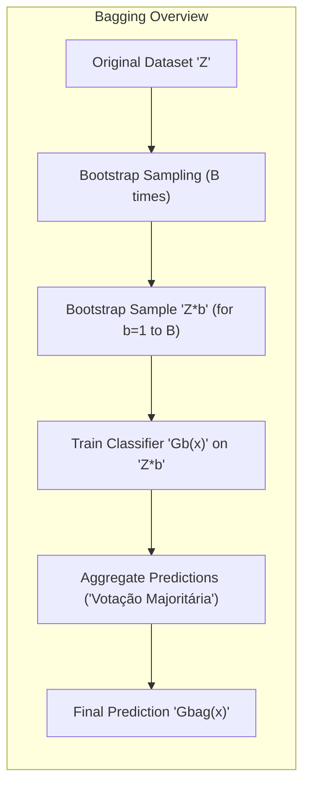
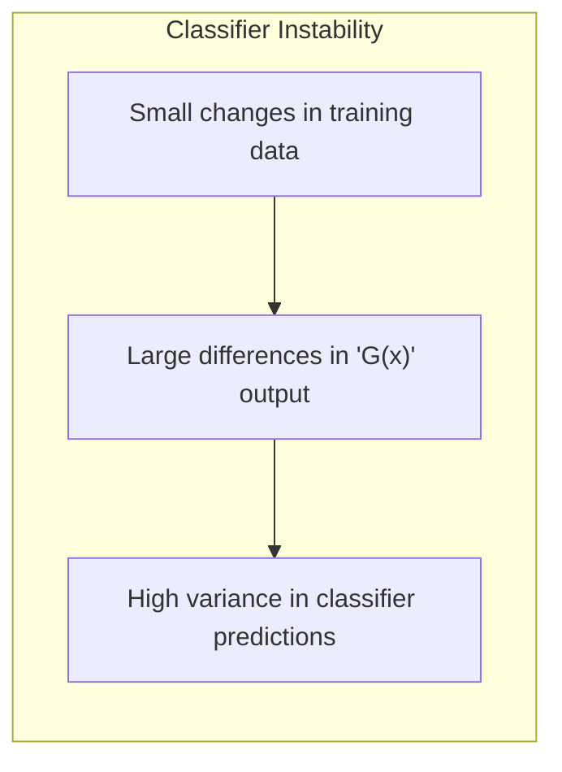
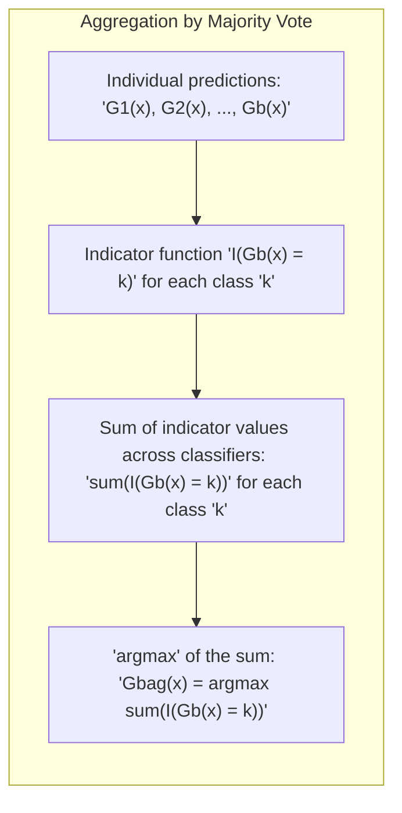
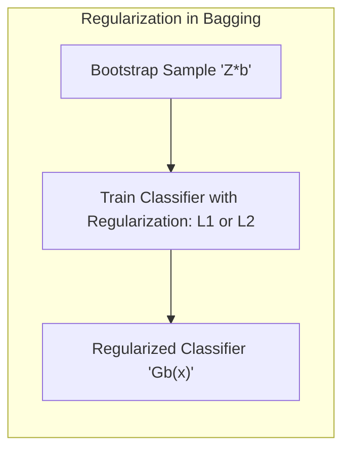
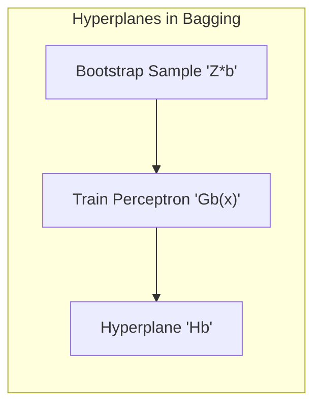
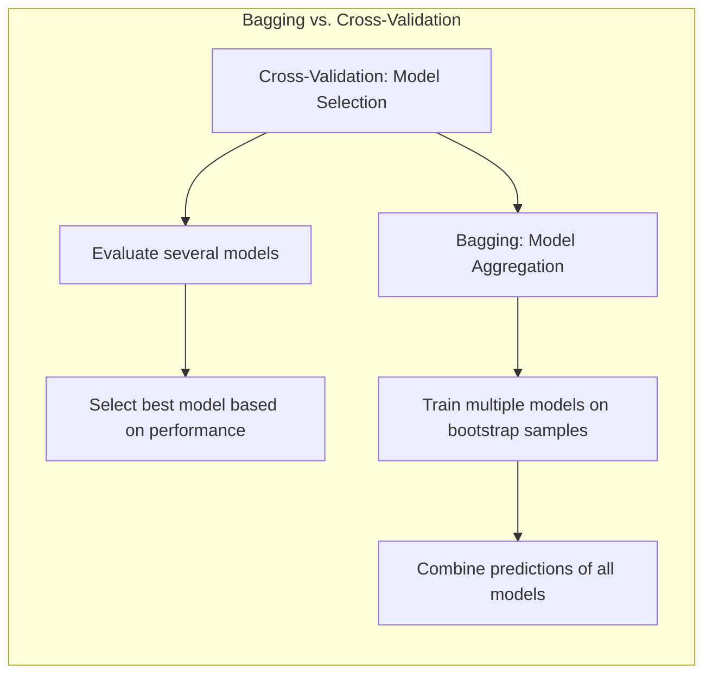

## Bagging para Classificação: Uma Análise Aprofundada



### Introdução

O conceito de **Bagging** (Bootstrap Aggregating), conforme brevemente mencionado em [^8.1] como uma técnica para *model averaging and improvement*, é uma metodologia poderosa para melhorar a precisão e a estabilidade de modelos de classificação, especialmente aqueles que são intrinsecamente instáveis. O objetivo principal do bagging é reduzir a variância de modelos de aprendizado de máquina, através da combinação de previsões de múltiplos modelos treinados em amostras bootstrap do conjunto de dados original. Este capítulo explorará em detalhes o mecanismo de bagging aplicado especificamente a problemas de classificação, comparando-o com outras técnicas de ensemble learning e discutindo suas limitações e vantagens. Os conceitos e resultados aqui apresentados serão fundamentados nos tópicos do documento fornecido [^8.1], [^8.2], [^8.7] e [^8.8] e seus subitens.

### Conceitos Fundamentais

Para compreender o funcionamento do bagging em problemas de classificação, é fundamental estabelecer alguns conceitos-chave:

**Conceito 1: Amostragem Bootstrap**

O bagging depende da geração de **amostras bootstrap**, que são amostras aleatórias do conjunto de dados original, obtidas com reposição [^8.2.1]. Formalmente, dado um conjunto de dados $Z = \{z_1, z_2, \ldots, z_N\}$, onde $z_i = (x_i, y_i)$, uma amostra bootstrap $Z^{*b}$ consiste em $N$ elementos amostrados de $Z$ com reposição.  Isso significa que cada amostra bootstrap terá o mesmo número de exemplos que o conjunto de dados original, mas com algumas instâncias repetidas e outras ausentes. A notação $b$ aqui indexa o número da amostra bootstrap, variando de $1$ a $B$, onde $B$ é o número total de amostras bootstrap que são geradas.

> 💡 **Exemplo Numérico:** Suponha que temos um conjunto de dados original com 5 instâncias: $Z = \{(x_1, y_1), (x_2, y_2), (x_3, y_3), (x_4, y_4), (x_5, y_5)\}$. Uma possível amostra bootstrap $Z^{*1}$ pode ser $\{(x_2, y_2), (x_4, y_4), (x_2, y_2), (x_1, y_1), (x_5, y_5)\}$, onde $x_2$ foi amostrado duas vezes e $x_3$ não foi amostrado. Uma segunda amostra $Z^{*2}$ pode ser $\{(x_1, y_1), (x_3, y_3), (x_5, y_5), (x_5, y_5), (x_2, y_2)\}$, com outras repetições.

**Lemma 1:** *Para um conjunto de dados finito, a probabilidade de uma instância específica não ser selecionada em uma amostra bootstrap de tamanho N é $(1 - \frac{1}{N})^N$, e essa probabilidade tende a $e^{-1} \approx 0.368$ conforme $N$ tende ao infinito.* Isso indica que cerca de 36.8% das amostras originais não são incluídas em uma dada amostra bootstrap. Essa propriedade garante a variabilidade entre as diferentes amostras bootstrap.

**Prova:**

A probabilidade de uma instância específica *ser* selecionada em uma amostra bootstrap é $\frac{1}{N}$. Portanto, a probabilidade de ela *não ser* selecionada em uma única amostragem é $1 - \frac{1}{N}$.  Se realizamos $N$ amostragem independentes, a probabilidade de que a instância nunca seja selecionada é $(1 - \frac{1}{N})^N$.  No limite, conforme $N \rightarrow \infty$, esta expressão tende para $e^{-1}$, que é aproximadamente $0.368$. $\blacksquare$

**Conceito 2: Classificadores Individuais**

Com cada amostra bootstrap $Z^{*b}$, treinamos um modelo de classificação individual $G_b(x)$. Este pode ser qualquer classificador de aprendizado de máquina, como árvores de decisão, regressão logística ou redes neurais [^8.7], embora o bagging seja mais eficaz quando aplicado a classificadores instáveis (i.e., aqueles cuja variação no conjunto de treinamento resulta em modelos bastante distintos). A instabilidade destes classificadores contribui para a eficácia do bagging.



**Corolário 1:** *A instabilidade de um classificador individual é um fator crucial para a eficácia do bagging.* Quanto mais sensível o classificador for a pequenas mudanças nos dados de treinamento, mais variados serão os modelos treinados em diferentes amostras bootstrap, o que é crucial para reduzir a variância do classificador de ensemble.

> 💡 **Exemplo Numérico:** Considere o uso de árvores de decisão como classificadores base. Árvores de decisão são conhecidas por serem instáveis; pequenas alterações no conjunto de treinamento (como as obtidas por bootstrap) podem levar a árvores de estrutura muito diferente. Se treinarmos uma árvore em $Z^{*1}$ e outra em $Z^{*2}$, elas podem gerar diferentes regras de decisão.

**Conceito 3: Agregação das Previsões**

A etapa final do bagging envolve a **agregação das previsões** dos classificadores individuais. No contexto da classificação, a agregação é geralmente realizada através da **votação majoritária**: para um dado exemplo $x$, a classe predita pelo ensemble é a classe mais frequentemente predita pelos classificadores individuais [^8.7]. Formalmente, a classificação final $G_{bag}(x)$ é dada por:

$$G_{bag}(x) = \underset{k}{\mathrm{argmax}} \sum_{b=1}^B I(G_b(x) = k)$$

onde $k$ é o índice da classe, $I(.)$ é a função indicadora, que é igual a 1 se a condição for verdadeira e 0 caso contrário. $G_b(x)$ é a classe predita pelo $b$-ésimo classificador.



> 💡 **Exemplo Numérico:** Suponha que tenhamos $B=5$ classificadores treinados por bagging e 3 classes possíveis: A, B, e C. Para um exemplo $x$, as predições são: $G_1(x) = A$, $G_2(x) = B$, $G_3(x) = A$, $G_4(x) = C$, e $G_5(x) = A$.  A classe A foi predita 3 vezes, B uma vez e C uma vez. A votação majoritária resulta em $G_{bag}(x) = A$.

> ⚠️ **Nota Importante:** A agregação de classificações por votação majoritária, em muitos casos, não produz estimativas de probabilidade adequadas, e a média direta das predições de probabilidade dos classificadores individuais pode levar a resultados menos viésados [^8.7].

### Regressão Linear e Mínimos Quadrados para Classificação: Analogia e Limitações

A regressão linear, aplicada a uma matriz de indicadores (onde cada coluna representa uma classe), é uma abordagem alternativa para problemas de classificação. A ligação entre a regressão de indicadores e métodos de classificação, como o Linear Discriminant Analysis (LDA) e a regressão logística, é notável, pois todos buscam encontrar uma fronteira de decisão linear. Contudo, essa analogia tem limitações importantes.

**Conexão com o Bagging**

Embora a regressão linear direta em uma matriz de indicadores não seja o método de classificação mais estável, ela pode ser usada como o classificador base dentro do framework do bagging. Cada modelo de regressão linear seria treinado em uma amostra bootstrap diferente, e as previsões poderiam ser combinadas (por exemplo, por votação majoritária) como em um problema de classificação usual.

**Lemma 2:** *Sob certas condições (quando as classes são bem separadas e há um número suficiente de amostras), a fronteira de decisão obtida pela regressão linear da matriz de indicadores pode se assemelhar àquela encontrada pelo LDA.* Isso é análogo ao fato de que, em situações ideais, ambos os modelos podem gerar classificadores lineares eficazes, embora suas formulações sejam bastante diferentes.

**Prova:**

Na regressão linear da matriz de indicadores, procuramos encontrar um modelo da forma $\hat{Y} = X\beta$, onde $X$ é a matriz de dados e $\beta$ são os parâmetros do modelo.  Cada coluna de $\hat{Y}$ representa as probabilidades de pertinência a uma dada classe, sendo que a classe predita é a que gera maior probabilidade.  O LDA, por sua vez, procura encontrar uma projeção linear para separar as classes com base em uma análise da matriz de covariância.   Em situações onde as classes são bem separadas e as variâncias dentro das classes são homogêneas, ambas as abordagens tendem a gerar fronteiras lineares similares, embora utilizem abordagens diferentes (mínimos quadrados na regressão linear, e análise de covariância no LDA). $\blacksquare$

> 💡 **Exemplo Numérico:** Considere um problema de classificação com três classes (A, B, C). A matriz de indicadores teria três colunas, onde cada linha representa uma instância e possui um '1' na coluna correspondente à sua classe e '0' nas outras. Por exemplo, uma instância da classe B seria representada por `[0, 1, 0]`. Uma regressão linear seria feita para prever cada coluna da matriz indicadora. Os outputs da regressão linear poderiam ser vistos como "scores" de pertinência à classe. A classe predita seria aquela que obtiver o maior score.

**Corolário 2:** *A principal limitação da regressão linear para classificação reside em sua tendência a extrapolar, gerando probabilidades fora do intervalo [0,1], o que a torna inadequada para estimativas de probabilidade.* Além disso, a regressão de indicadores não lida de forma robusta com a multicolinearidade e a não-linearidade dos dados [^8.2]. Essas limitações são atenuadas pelo bagging.

### Métodos de Seleção de Variáveis e Regularização em Classificação

A inclusão de métodos de seleção de variáveis e regularização na classificação é crucial para lidar com problemas de alta dimensionalidade e evitar o sobreajuste, [^8.7] e esses métodos podem ser usados em conjunto com o bagging.

**Regularização no Contexto do Bagging**

Dentro de um framework de bagging, regularização, como penalidades L1 e L2, podem ser aplicadas *a cada classificador individual* treinado em uma amostra bootstrap [^8.2]. As penalidades L1, por exemplo, induzem esparsidade, o que pode levar a modelos mais simples e interpretáveis. As penalidades L2, por sua vez, reduzem a magnitude dos coeficientes, aumentando a estabilidade.



**Lemma 3:** *O uso da penalidade L1 em conjunto com o bagging pode levar a modelos mais interpretáveis e robustos, selecionando as variáveis mais relevantes para a classificação.* A esparsidade induzida pela penalidade L1 simplifica a interpretação do modelo.

**Prova:**

A penalidade L1 adiciona um termo à função de perda, proporcional à soma dos valores absolutos dos coeficientes: $L(w) + \lambda ||w||_1$, onde $L(w)$ é a função de perda, $w$ são os parâmetros do modelo e $\lambda$ é um parâmetro de regularização. Essa penalização força alguns coeficientes a serem exatamente zero, realizando a seleção de variáveis e induzindo esparsidade.  Quando combinada com o bagging, essa abordagem ajuda a selecionar de forma mais estável as variáveis mais importantes, resultando em modelos mais interpretáveis. $\blacksquare$

> 💡 **Exemplo Numérico:** Em um problema de classificação com muitas variáveis (features), digamos 100, poderíamos utilizar uma regressão logística regularizada com L1 como classificador base no bagging. A penalidade L1 ($\lambda$) forçaria alguns coeficientes a serem zero, efetivamente selecionando um subconjunto das variáveis mais relevantes para cada amostra bootstrap. Ao agregarmos os resultados, as variáveis que forem selecionadas com mais frequência serão consideradas as mais importantes para a classificação final.
```python
import numpy as np
from sklearn.linear_model import LogisticRegression
from sklearn.model_selection import train_test_split
from sklearn.metrics import accuracy_score

# Simulação de dados com 100 features
np.random.seed(42)
X = np.random.rand(1000, 100)
y = np.random.randint(0, 2, 1000)

# Divisão em treino e teste
X_train, X_test, y_train, y_test = train_test_split(X, y, test_size=0.2, random_state=42)

# Função para treinar um classificador com regularização L1 em uma amostra bootstrap
def train_l1_classifier(X_train, y_train, lambda_val):
    n_samples = len(X_train)
    bootstrap_indices = np.random.choice(n_samples, size=n_samples, replace=True)
    X_bootstrap = X_train[bootstrap_indices]
    y_bootstrap = y_train[bootstrap_indices]
    
    model = LogisticRegression(penalty='l1', solver='liblinear', C=1/lambda_val, random_state=42)
    model.fit(X_bootstrap, y_bootstrap)
    return model

# Bagging com regularização L1
B = 10
lambda_val = 0.1
models = [train_l1_classifier(X_train, y_train, lambda_val) for _ in range(B)]

# Previsão por votação majoritária
def predict_bagging(X, models):
    predictions = np.array([model.predict(X) for model in models])
    ensemble_predictions = np.apply_along_axis(lambda x: np.argmax(np.bincount(x)), axis=0, arr=predictions)
    return ensemble_predictions

y_pred = predict_bagging(X_test, models)
accuracy = accuracy_score(y_test, y_pred)
print(f"Acurácia do bagging com regularização L1: {accuracy:.4f}")
```
**Corolário 3:** *A regularização L2 combinada com o bagging aumenta a estabilidade dos modelos, o que é crucial quando os classificadores individuais são instáveis.* A regularização L2 reduz a variância dos parâmetros do modelo.

> 💡 **Exemplo Numérico:** Similar ao exemplo anterior, usaríamos a penalidade L2 (Ridge regression no caso de regressão, ou regularização L2 na regressão logística). A penalidade L2 ($\lambda$) não induz esparsidade mas reduz a magnitude dos coeficientes. Isso estabiliza os coeficientes do classificador base em cada amostra bootstrap, resultando em modelos mais consistentes.

> ❗ **Ponto de Atenção:** O bagging não resolve problemas relacionados ao viés do modelo; portanto, modelos regularizados e selecionados corretamente ainda são necessários para garantir um bom desempenho geral da classificação. A combinação de regularização e bagging oferece uma solução mais completa.

### Separating Hyperplanes e Perceptrons: Paralelos e Diferenças

O conceito de **separating hyperplanes** surge de classificadores lineares como o Perceptron e o SVM (Support Vector Machines), que buscam definir uma superfície linear ótima que separa as classes. Embora o Perceptron não seja tão sofisticado quanto o SVM (especialmente em lidar com dados não linearmente separáveis), ele ilustra a busca por hiperplanos de decisão.

**Separating Hyperplanes no Contexto do Bagging**

Cada amostra bootstrap pode levar a um hiperplano de separação diferente se o classificador base for o Perceptron. O bagging pode ajudar a estabilizar esses hiperplanos por meio da combinação das previsões.


> 💡 **Exemplo Numérico:** Imagine um problema de classificação com duas classes visualizadas em um espaço bidimensional. Se usarmos o Perceptron como classificador base em um framework de bagging, cada amostra bootstrap pode levar a um hiperplano de separação ligeiramente diferente. Em algumas amostras, o hiperplano pode estar mais inclinado, enquanto em outras pode estar mais horizontal. Ao combinar as previsões desses perceptrons via votação majoritária, o bagging tende a gerar um classificador mais estável.

### Pergunta Teórica Avançada: Como o Bagging Difere da Seleção de Modelos Via Cross-Validation?

**Resposta:**

O bagging e a seleção de modelos por cross-validation abordam diferentes aspectos da modelagem. Enquanto a seleção de modelos via cross-validation busca selecionar o melhor modelo *entre* um conjunto de modelos candidatos [^8.2], o bagging não realiza seleção, mas sim combina *todos* os modelos treinados em amostras bootstrap.



**Lemma 4:** *Cross-validation é usada para avaliar e selecionar o melhor modelo, buscando um único modelo ótimo. O bagging combina múltiplos modelos, buscando reduzir a variância das predições. Ambos são úteis, mas abordam o problema de formas distintas.*

**Corolário 4:** *Enquanto a cross-validation busca reduzir o viés e encontrar o modelo com menor erro geral, o bagging visa reduzir a variância do modelo, o que é mais relevante quando o modelo base é instável.* Na prática, ambos podem ser complementares, onde a cross-validation pode ser usada para ajustar o modelo base e, em seguida, o bagging pode ser usado para aumentar a sua estabilidade.

> ⚠️ **Ponto Crucial:** A seleção de modelos é mais adequada quando há um número razoável de modelos claramente distinguíveis, enquanto o bagging é mais apropriado quando os modelos base são instáveis e a combinação de múltiplas previsões pode reduzir a variância geral.

> 💡 **Exemplo Numérico:** Para entender a diferença, imagine que temos 3 modelos de classificação diferentes: uma árvore de decisão simples, uma regressão logística e um SVM. Usando cross-validation, dividiríamos o dataset em k folds, treinaríamos cada modelo em k-1 folds e testaríamos em 1. No final, escolheríamos o modelo com melhor métrica de desempenho (acurácia, F1-score, etc.). Já o bagging, pegaria o mesmo modelo (digamos, uma árvore de decisão), criaria B amostras bootstrap e treinará uma árvore para cada amostra. No final, usaríamos um ensemble para prever novos dados. O cross-validation escolhe um modelo, enquanto o bagging combina as predições de muitos modelos do mesmo tipo.

### Conclusão

O bagging é uma técnica de ensemble learning robusta e versátil para problemas de classificação, especialmente quando aplicada a classificadores instáveis. Este capítulo apresentou uma análise aprofundada do conceito de bagging, explorando sua base teórica, suas conexões com outros métodos e suas limitações. A combinação do bagging com técnicas de regularização e seleção de variáveis, além de considerações sobre seus paralelos e diferenças com métodos como o Perceptron e a seleção de modelos por cross-validation, permite uma visão abrangente sobre esta poderosa ferramenta. O entendimento completo do mecanismo de bagging e suas nuances permite a aplicação informada desta técnica em uma variedade de problemas práticos.

<!-- END DOCUMENT -->
[^8.1]: "In this chapter we provide a general exposition of the maximum likelihood approach, as well as the Bayesian method for inference. The bootstrap, introduced in Chapter 7, is discussed in this context, and its relation to maximum likelihood and Bayes is described. Finally, we present some related techniques for model averaging and improvement, including com- mittee methods, bagging, stacking and bumping." *(Trecho de <8. Model Inference and Averaging>)*
[^8.2]: "The bootstrap method provides a direct computational way of assessing uncertainty, by sampling from the training data." *(Trecho de <8.2.1 A Smoothing Example>)*
[^8.7]: "Earlier we introduced the bootstrap as a way of assessing the accuracy of a parameter estimate or a prediction. Here we show how to use the bootstrap to improve the estimate or prediction itself.  Consider first the regression problem. Suppose we fit a model to our training data Z = {(x1, y1), (x2, y2), ..., (xN, yN)}, obtaining the prediction f(x) at input x. Bootstrap aggregation or bagging averages this prediction over a collection of bootstrap samples, thereby reducing its variance. The bagged estimate is the average prediction at x from these B trees. Now suppose our tree produces a classifier G(x) for a K-class response. Here it is useful to consider an underlying indicator-vector function f(x), with value a single one and K − 1 zeroes, such that Ĝ(x) = arg maxk f(x). Then the bagged estimate fbag(x) is a K-vector [p1(x), p2(x),..., pK(x)], with pk(x) equal to the proportion of trees predicting class k at x. The bagged classifier selects the class with the most “votes” from the B trees, Gbag(x) = arg maxk fbag(x). Often we require the class-probability estimates at x, rather than the classifications themselves. It is tempting to treat the voting proportions pk(x) as estimates of these probabilities. A simple two-class example shows that they fail in this regard. Suppose the true probability of class 1 at x is 0.75, and each of the bagged classifiers accurately predict a 1. Then p1(x) = 1, which is incorrect." *(Trechos de <8.7 Bagging>)*
[^8.8]: "Here we discuss Bayesian model averaging more generally. We have a set of candidate models Mm, m = 1,..., M for our training set Z. These models may be of the same type with different parameter values (e.g., subsets in linear regression), or different models for the same task (e.g., neural networks and regression trees)." *(Trecho de <8.8 Model Averaging and Stacking>)*
