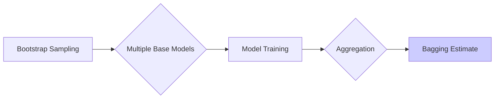
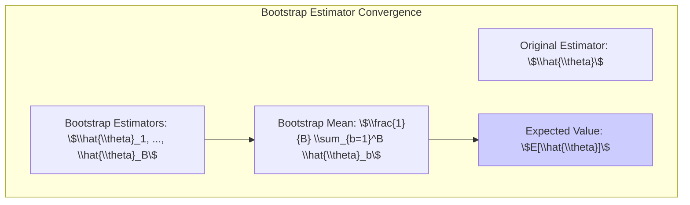
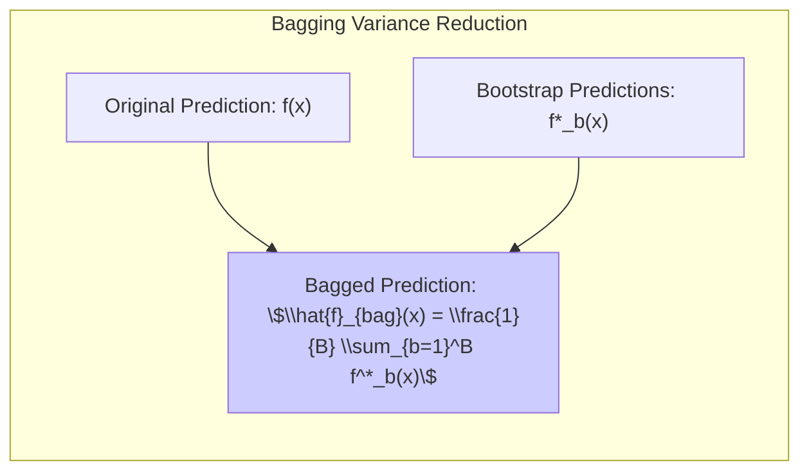
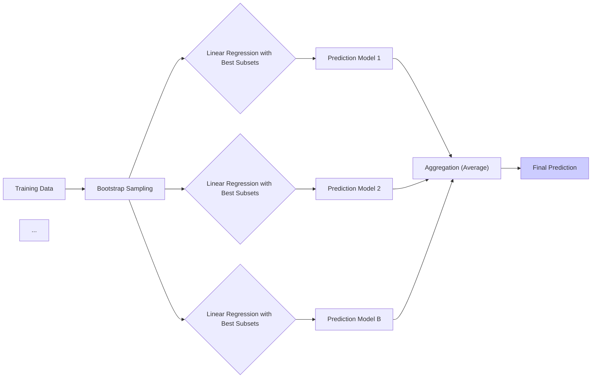
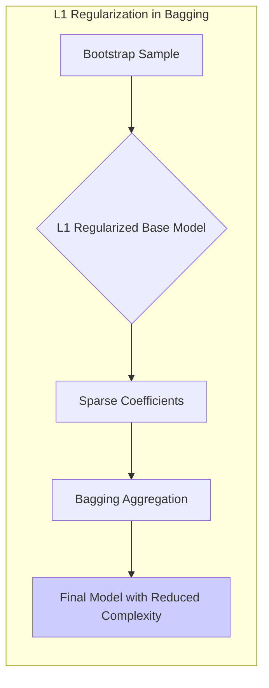
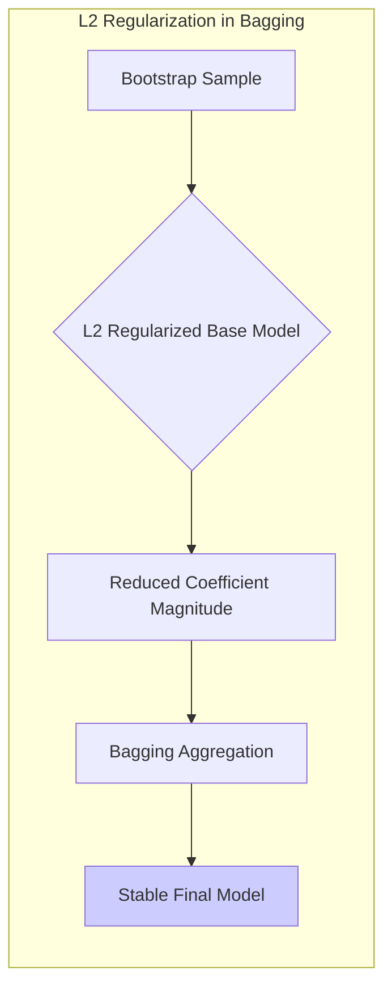
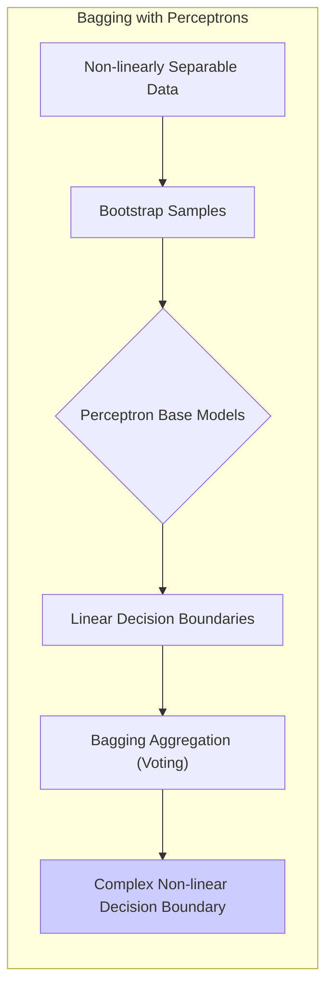

## Bagging Estimates: A Comprehensive Study



### Introdução
Este capítulo explora o conceito de **Bagging Estimates**, uma técnica poderosa para melhorar a precisão e estabilidade de modelos estatísticos, especialmente aqueles que são sensíveis a pequenas mudanças nos dados de treinamento [^8.7]. O Bagging, abreviação de **Bootstrap Aggregating**, utiliza o poder do *re-sampling* e da agregação para reduzir a variância de modelos instáveis, como árvores de decisão e outros métodos de aprendizado de máquina não lineares. O método surge como uma ferramenta essencial para profissionais em estatística e aprendizado de máquina que buscam construir modelos robustos e generalizáveis.

### Conceitos Fundamentais
Para compreender o Bagging, é crucial entender os conceitos fundamentais envolvidos, conforme detalhado no contexto [^8.1], [^8.2], [^8.7].

**Conceito 1: Bootstrap e Reamostragem**
O *bootstrap* é uma técnica de reamostragem que permite estimar a variabilidade de uma estatística amostral sem depender de suposições sobre a distribuição subjacente da população. Em vez de coletar várias amostras independentes da população original, o bootstrap gera várias *amostras bootstrap* a partir da amostra original, por amostragem com reposição [^8.2.1]. Isso permite estimar a distribuição amostral de uma estatística e, consequentemente, a variância de um modelo. O processo de reamostragem do bootstrap é fundamental para a construção do *Bagging Estimates* [^8.7]. A ideia central é que, ao reamostrar os dados de treinamento, podemos criar um conjunto de modelos ligeiramente diferentes, que, quando agregados, tendem a ter uma variância menor do que o modelo original.

> 💡 **Exemplo Numérico:** Considere um conjunto de dados simples com 5 observações: `data = [2, 4, 5, 7, 9]`. Queremos estimar a média usando o bootstrap.
>
> 1.  **Amostragem Bootstrap:** Geramos, digamos, 3 amostras bootstrap com reposição:
>     *   `bootstrap_sample_1 = [2, 7, 9, 4, 2]`
>     *   `bootstrap_sample_2 = [4, 5, 5, 9, 7]`
>     *   `bootstrap_sample_3 = [9, 2, 7, 4, 5]`
> 2.  **Cálculo das Médias:** Calculamos a média de cada amostra bootstrap:
>     *   `mean_1 = (2 + 7 + 9 + 4 + 2) / 5 = 4.8`
>     *   `mean_2 = (4 + 5 + 5 + 9 + 7) / 5 = 6.0`
>     *   `mean_3 = (9 + 2 + 7 + 4 + 5) / 5 = 5.4`
> 3.  **Média das Médias:** A média bootstrap é a média das médias das amostras bootstrap:
>     *   `bootstrap_mean = (4.8 + 6.0 + 5.4) / 3 = 5.4`
>
> A média original dos dados é `(2+4+5+7+9)/5 = 5.4`.  O bootstrap nos permitiu estimar a média através de um processo de reamostragem, onde a média bootstrap converge para a média original quando o número de amostras bootstrap tende ao infinito.

**Lemma 1:** Se $\hat{\theta}$ é um estimador de um parâmetro $\theta$ e $\hat{\theta}_1, \hat{\theta}_2, ..., \hat{\theta}_B$ são estimadores bootstrap de $\theta$, então o estimador bootstrap médio $\frac{1}{B} \sum_{b=1}^B \hat{\theta}_b$ é uma aproximação para $E[\hat{\theta}]$, onde a esperança é tomada sobre a distribuição do bootstrap [^8.2.3].



*Prova:*
A prova é baseada na definição de esperança e na amostragem com reposição. Se cada $\hat{\theta}_b$ é gerado por uma amostra bootstrap e se assume que cada amostra bootstrap é uma realização da distribuição subjacente, então a média das amostras bootstrap, $\frac{1}{B} \sum_{b=1}^B \hat{\theta}_b$, converge para $E[\hat{\theta}]$ quando $B \rightarrow \infty$. $\blacksquare$

**Conceito 2: Agregação de Modelos (Bagging)**
O *Bagging* ou *Bootstrap Aggregating* é uma técnica que combina as predições de vários modelos construídos a partir de diferentes amostras bootstrap dos dados de treinamento [^8.7]. No caso de regressão, as predições são tipicamente agregadas através da média, enquanto que em classificação a agregação pode envolver a votação majoritária ou a média das probabilidades previstas [^8.7]. O objetivo do bagging é reduzir a variância de modelos instáveis (alta sensibilidade a pequenas mudanças nos dados de treinamento) como árvores de decisão, e a média das predições tendem a ser mais estáveis que a predição de um único modelo [^8.7.1].

> 💡 **Exemplo Numérico:** Vamos supor que temos um modelo de regressão que preve o preço de casas e usamos Bagging com 3 amostras bootstrap. Para uma casa específica com características $x$, temos as seguintes predições de cada modelo treinado nas amostras bootstrap:
>
> *   $f^*_1(x) = 320000$
> *   $f^*_2(x) = 350000$
> *   $f^*_3(x) = 335000$
>
> A predição do modelo Bagging seria:
>
> $\hat{f}_{bag}(x) = \frac{320000 + 350000 + 335000}{3} = 335000$
>
> A predição agregada pelo Bagging, 335000, é mais estável em comparação com os modelos individuais. Cada modelo base pode variar dependendo da amostra, mas a agregação suaviza a variância e tende a fornecer um resultado mais confiável.

**Corolário 1:** Seja $f(x)$ a predição de um modelo ajustado nos dados de treinamento originais e seja $f^*_b(x)$ a predição de um modelo ajustado em uma amostra bootstrap $Z^*_b$. O estimador Bagging $\hat{f}_{bag}(x) = \frac{1}{B} \sum_{b=1}^B f^*_b(x)$ tem uma variância menor que o estimador original $f(x)$ em cenários de modelos instáveis, como árvores de decisão [^8.7.1], [^8.7.2].



*Prova:*
A redução da variância ocorre porque o bagging substitui a predição instável $f(x)$ por uma média de várias predições $f^*_b(x)$.  A variância da média de variáveis aleatórias independentes é sempre menor do que a variância de uma única variável aleatória quando agregamos várias amostras e isso se traduz em menor variância para o estimador $\hat{f}_{bag}(x)$.

**Conceito 3: Modelos Base e Instabilidade**
O Bagging é particularmente útil para modelos base que são instáveis. Árvores de decisão, por exemplo, são modelos que tendem a variar muito com pequenas mudanças nos dados de treinamento [^8.7.1]. Isso ocorre porque as árvores de decisão tendem a criar partições complexas e podem ser muito influenciadas por outliers ou pequenas perturbações nos dados [^8.7.1]. A instabilidade de modelos base é a principal razão para a eficácia do Bagging. Em modelos lineares, como a regressão linear com um conjunto fixo de preditores, o bagging geralmente não oferece melhorias significativas, já que o modelo em si é estável e não varia muito quando treinado em diferentes amostras [^8.7].

> ⚠️ **Nota Importante**: O Bagging não altera o viés de um modelo, apenas a variância. Isso significa que o Bagging pode não melhorar modelos com alto viés, mas é altamente eficaz em reduzir a variância de modelos com baixo viés, mas alta variância [^8.7.2].
> ❗ **Ponto de Atenção**: A independência das amostras bootstrap é uma suposição chave para a eficácia do Bagging. Se houver dependência forte entre as amostras, a redução de variância pode ser menor que o esperado. [^8.7.2]
> ✔️ **Destaque**: O Bagging é uma técnica de propósito geral que pode ser aplicada a diversos tipos de modelos base, desde que estes sejam instáveis. [^8.7]

### Regressão Linear e Mínimos Quadrados para Bagging
A regressão linear clássica, na sua forma padrão, não se beneficia significativamente do Bagging, conforme mencionado no contexto [^8.7]. Isso ocorre porque os modelos de regressão linear, quando treinados com um conjunto fixo de preditores, são inerentemente estáveis. No entanto, se a regressão linear for utilizada como modelo base em um contexto mais complexo, onde a seleção de variáveis é feita por métodos como *best subsets* em regressão linear, então o Bagging pode trazer melhorias [^8.8]. O processo de Bagging envolve ajustar várias regressões lineares em amostras bootstrap e, em seguida, agregar as predições. A fórmula (8.51) [^8.7] continua sendo a base da agregação:
$$ \hat{f}_{bag}(x) = \frac{1}{B} \sum_{b=1}^B f^*_b(x) $$
Onde:
*   $\hat{f}_{bag}(x)$ é a predição agregada do Bagging.
*   $f^*_b(x)$ é a predição do modelo ajustado na $b$-ésima amostra bootstrap.
*   $B$ é o número de amostras bootstrap.

Se a regressão linear for utilizada com seleção de variáveis feita por meio de um algoritmo de *best subsets*, o ajuste de cada modelo base seleciona o melhor subconjunto de preditores, levando a modelos mais instáveis (i.e. modelos que mudam consideravelmente ao serem treinados com dados diferentes).



**Explicação:** Este diagrama ilustra o processo de Bagging aplicado a modelos de regressão linear com seleção de variáveis. As amostras bootstrap são geradas, modelos lineares são treinados com seleção de *best subsets* em cada amostra, e as predições são agregadas para formar a predição final, conforme descrito no contexto [^8.7], [^8.8].

> 💡 **Exemplo Numérico:** Vamos considerar um conjunto de dados com 100 observações e 10 preditores. Queremos aplicar regressão linear com seleção de variáveis (best subsets) como modelo base para Bagging. Para simplificar, vamos ilustrar com 3 amostras bootstrap:
>
> 1.  **Amostras Bootstrap:**
>     *   `bootstrap_sample_1`: Amostra de 100 observações com reposição do conjunto original.
>     *   `bootstrap_sample_2`: Outra amostra de 100 observações com reposição.
>     *   `bootstrap_sample_3`: Uma terceira amostra de 100 observações com reposição.
>
> 2.  **Modelos de Regressão Linear (Best Subsets):**
>     *   **Modelo 1:** Ajustamos um modelo de regressão linear na `bootstrap_sample_1` com seleção de *best subsets*. Suponha que o modelo selecione os preditores $X_1, X_3, X_5$ e encontre os seguintes coeficientes: $\beta_1 = 2.1$, $\beta_3 = -0.5$, $\beta_5 = 1.2$. A predição seria: $\hat{y}_1 = 2.1X_1 - 0.5X_3 + 1.2X_5$
>     *   **Modelo 2:** Ajustamos um modelo em `bootstrap_sample_2`.  Neste caso, o modelo pode selecionar preditores diferentes, por exemplo, $X_2, X_4, X_6$. Suponha que encontremos $\beta_2 = 0.8$, $\beta_4 = 1.1$, $\beta_6 = -0.7$. A predição seria: $\hat{y}_2 = 0.8X_2 + 1.1X_4 - 0.7X_6$
>     *   **Modelo 3:** O modelo ajustado em `bootstrap_sample_3` seleciona os preditores $X_1, X_4, X_9$, com $\beta_1 = 1.5$, $\beta_4 = 0.9$, $\beta_9 = 0.6$. A predição seria: $\hat{y}_3 = 1.5X_1 + 0.9X_4 + 0.6X_9$.
>
> 3.  **Agregação:** Para um novo ponto $x$, calculamos as predições de cada modelo: $\hat{y}_1(x)$, $\hat{y}_2(x)$, e $\hat{y}_3(x)$. Em seguida, agregamos pela média: $\hat{y}_{bag}(x) = \frac{\hat{y}_1(x) + \hat{y}_2(x) + \hat{y}_3(x)}{3}$.
>
> Este exemplo ilustra como o Bagging, quando combinado com seleção de variáveis, pode criar modelos mais robustos, com cada modelo base selecionando diferentes subconjuntos de preditores e, assim, reduzindo a variância da predição final.

**Lemma 2:** Se $f(x)$ é um modelo de regressão linear estável, a aplicação do Bagging não levará a uma redução significativa do erro de generalização, dado que a variância do estimador original já é baixa.

*Prova:*
A prova decorre da estabilidade dos modelos de regressão linear. Como a variância da predição em modelos de regressão linear estáveis é baixa, a agregação não traz melhorias significativas, já que cada modelo bootstrap gera uma predição similar. $\blacksquare$

**Corolário 2:** No caso em que a regressão linear é combinada com seleção de variáveis instável, o Bagging pode reduzir a variância das predições, resultando em um modelo final mais robusto.

*Prova:*
A seleção de variáveis como *best subsets* cria modelos instáveis e a variância é reduzida pela média das predições dos modelos treinados em amostras bootstrap diferentes. $\blacksquare$

"Em cenários onde a seleção de variáveis é feita de maneira instável, o Bagging pode ser uma ferramenta valiosa para estabilizar as predições da regressão linear, reduzindo o risco de *overfitting* e melhorando a capacidade de generalização do modelo".
"Ainda assim, é importante notar que para um modelo de regressão linear bem comportado, o *gain* do Bagging é baixo, conforme discutido no contexto [^8.7]."

### Métodos de Seleção de Variáveis e Regularização em Bagging

A seleção de variáveis e a regularização são técnicas que complementam o Bagging, especialmente em contextos de alta dimensionalidade. A regularização, como penalizações $L_1$ e $L_2$, pode ser aplicada aos modelos base dentro do Bagging, para controlar a complexidade individual de cada modelo. A seleção de variáveis também pode ser combinada com o Bagging, onde cada modelo base pode escolher um subconjunto diferente de variáveis, criando modelos ainda mais diversos [^8.7], [^8.8]. Essas técnicas adicionam uma camada de controle, tornando o processo mais robusto e menos propenso ao *overfitting*.

**Lemma 3:** Se os modelos base do bagging utilizam regularização $L_1$, a esparsidade dos modelos base é controlada, e o modelo final do bagging preserva uma estrutura de coeficientes mais simples, contribuindo para uma maior interpretabilidade.



*Prova:*
A regularização $L_1$ (Lasso) induz a esparsidade dos coeficientes nos modelos base, tornando alguns coeficientes exatamente zero. A agregação dos modelos com coeficientes esparsos pode resultar em um modelo final mais interpretabilidade, pois destaca quais variáveis são mais relevantes. $\blacksquare$

> 💡 **Exemplo Numérico:** Vamos supor que cada modelo base no Bagging é uma regressão linear com regularização $L_1$ (Lasso). Para simplificar, vamos considerar 2 amostras bootstrap e um problema com 4 preditores ($X_1, X_2, X_3, X_4$):
>
> 1.  **Modelos Base com Regularização L1 (Lasso):**
>
>     *   **Modelo 1:** Ajustamos na primeira amostra bootstrap, com regularização $L_1$.  Suponha que o Lasso resulte nos seguintes coeficientes: $\beta_1 = 0.8$, $\beta_2 = 0$, $\beta_3 = -0.2$, $\beta_4 = 0$. A predição é: $\hat{y}_1 = 0.8X_1 - 0.2X_3$
>     *   **Modelo 2:** Ajustamos na segunda amostra bootstrap, também com regularização $L_1$. Os coeficientes encontrados foram: $\beta_1 = 0$, $\beta_2 = 0.5$, $\beta_3 = 0$, $\beta_4 = 0.3$. A predição é: $\hat{y}_2 = 0.5X_2 + 0.3X_4$.
>
> 2.  **Agregação:** Para um novo ponto $x$, calculamos as predições dos modelos: $\hat{y}_1(x)$ e $\hat{y}_2(x)$. Agregamos pela média:  $\hat{y}_{bag}(x) = \frac{\hat{y}_1(x) + \hat{y}_2(x)}{2}$.
>
> Observamos que os modelos base resultaram em modelos esparsos devido a regularização $L_1$, com apenas alguns coeficientes não nulos, o que facilita a interpretabilidade e auxilia a seleção de variáveis relevantes.

**Corolário 3:** A combinação de Bagging com regularização $L_2$ em cada modelo base leva à redução da variância do modelo final, e a média de modelos regularizados com $L_2$ tende a ser mais estável que modelos sem regularização.



*Prova:*
A regularização $L_2$ (Ridge) reduz os coeficientes, o que contribui para a redução da variância, já que modelos base com menor magnitude em seus coeficientes tendem a ter menor variância. A agregação de modelos regularizados com $L_2$ resulta em um modelo final mais estável. $\blacksquare$

> 💡 **Exemplo Numérico:** Vamos usar o mesmo exemplo anterior, mas agora com regularização $L_2$ (Ridge) nos modelos base:
>
> 1. **Modelos Base com Regularização L2 (Ridge):**
>     *   **Modelo 1:** Ajustamos na primeira amostra bootstrap com regularização $L_2$.  Suponha que o Ridge resulte nos seguintes coeficientes: $\beta_1 = 0.6$, $\beta_2 = 0.2$, $\beta_3 = -0.1$, $\beta_4 = 0.1$. A predição é: $\hat{y}_1 = 0.6X_1 + 0.2X_2 - 0.1X_3 + 0.1X_4$. Note que o Ridge não zera os coeficientes, apenas reduz sua magnitude.
>     *   **Modelo 2:** Ajustamos na segunda amostra bootstrap, também com regularização $L_2$. Os coeficientes encontrados foram: $\beta_1 = 0.1$, $\beta_2 = 0.4$, $\beta_3 = 0.2$, $\beta_4 = -0.2$. A predição é: $\hat{y}_2 = 0.1X_1 + 0.4X_2 + 0.2X_3 - 0.2X_4$.
> 2.  **Agregação:** Para um novo ponto $x$, calculamos as predições dos modelos: $\hat{y}_1(x)$ e $\hat{y}_2(x)$. Agregamos pela média:  $\hat{y}_{bag}(x) = \frac{\hat{y}_1(x) + \hat{y}_2(x)}{2}$.
>
> Comparando com o exemplo anterior com regularização $L_1$, a regularização $L_2$ não zera os coeficientes, mas reduz sua magnitude, o que torna os modelos mais estáveis e contribui para a redução da variância após a agregação.

> ⚠️ **Ponto Crucial**: A combinação de Bagging com regularização ou seleção de variáveis deve ser cuidadosa. O nível de regularização deve ser determinado usando validação cruzada, e a seleção de variáveis deve ser feita de maneira que cada modelo base seja diverso o suficiente para beneficiar o modelo agregado.
> ❗ **Ponto de Atenção**: O Bagging com modelos base muito complexos podem ainda levar ao *overfitting*. O balanço entre complexidade dos modelos base e a diversidade introduzida pelo Bagging é essencial para um modelo final robusto e generalizável.

### Separating Hyperplanes e Perceptrons com Bagging
Os Separating Hyperplanes, especialmente no contexto de *Support Vector Machines* (SVM), e os Perceptrons são métodos que se beneficiam do Bagging quando aplicados a problemas complexos com fronteiras de decisão não lineares ou com dados que levam a uma alta variância do modelo base [^8.7]. No caso dos Perceptrons, o Bagging pode ajudar a estabilizar o modelo, reduzindo a sensibilidade a pontos de dados individuais. Para SVMs, a agregação de múltiplos hiperplanos pode gerar uma fronteira de decisão mais robusta, especialmente em dados com ruído [^8.7].

**Teorema 1:** Considere um problema de classificação com dados não linearmente separáveis. Se o modelo base é um Perceptron (ou SVM linear), o Bagging pode gerar um classificador agregado que se aproxima de uma fronteira de decisão não linear mais complexa, a medida que o número de amostras bootstrap aumenta.



*Prova:*
Cada modelo base é ajustado em uma amostra bootstrap diferente e a combinação desses modelos lineares podem levar a um modelo não linear quando agregados. A variabilidade causada pelo bootstrap permite que o modelo agregado explore diferentes regiões do espaço de características, resultando em uma fronteira de decisão final mais complexa.

> 💡 **Exemplo Numérico:** Vamos considerar um problema de classificação binária com dados não linearmente separáveis. Vamos aplicar Bagging com Perceptrons como modelo base.
>
> 1.  **Dados:** Suponha que temos dados com duas classes (0 e 1) em duas dimensões ($X_1$ e $X_2$), que não são separáveis por uma linha reta.
> 2.  **Modelos Base (Perceptrons):**
>     *   **Modelo 1:** Ajustamos um Perceptron na primeira amostra bootstrap. O Perceptron encontra uma fronteira de decisão linear que separa as classes de forma imperfeita.  A predição será: $\hat{y}_1 = sign(w_1X_1 + w_2X_2 + b)$.
>     *   **Modelo 2:** Ajustamos um Perceptron na segunda amostra bootstrap.  O Perceptron pode encontrar uma fronteira de decisão linear ligeiramente diferente da anterior. A predição será: $\hat{y}_2 = sign(w_1'X_1 + w_2'X_2 + b')$.
>     *   **Modelo 3... B:** Repetimos este processo para B amostras bootstrap.
>
> 3.  **Agregação:** Para um novo ponto $x$, cada Perceptron gera uma predição (0 ou 1). A predição final do Bagging é dada pela votação majoritária (a classe mais frequente entre os B modelos).
>
> Como cada Perceptron explora diferentes regiões do espaço de características devido às amostras bootstrap, o classificador agregado do Bagging pode aproximar uma fronteira de decisão não linear mais complexa que um único Perceptron.

### Pergunta Teórica Avançada (Exemplo): Qual o impacto do tamanho da amostra bootstrap no desempenho do Bagging?

**Resposta:**
O tamanho da amostra bootstrap tem um impacto significativo no desempenho do Bagging. Em geral, o tamanho da amostra bootstrap (normalmente igual ao tamanho da amostra original) deve ser grande o suficiente para capturar a variabilidade dos dados, mas não tão grande a ponto de reproduzir a amostra original, o que não adicionaria diversidade suficiente ao processo. A escolha do tamanho da amostra bootstrap deve considerar o compromisso entre diversidade e estabilidade, conforme discutido em [^8.7].

**Lemma 4:** À medida que o tamanho da amostra bootstrap se aproxima do tamanho da amostra original, a variância do estimador do Bagging diminui.

```mermaid
graph LR
    subgraph "Bootstrap Sample Size Effect"
        A["Small Bootstrap Sample Size"] --> B["High Variance Base Model"]
         B --> C["High Bagging Variance"]
        A1["Bootstrap Sample Size ~ Original"] --> B1["Lower Variance Base Model"]
        B1 --> C1["Lower Bagging Variance"]
          C --> D ["Bagging Estimate"]
         C1 --> D
    end
```

*Prova:*
Quando o tamanho da amostra bootstrap é muito menor que a amostra original, alguns dados são frequentemente omitidos, gerando uma maior variação das predições e consequentemente do modelo. Por outro lado, se o tamanho da amostra bootstrap se aproxima do tamanho da amostra original, a variância se reduz. $\blacksquare$

**Corolário 4:** Em problemas com pequena quantidade de dados, o uso de um tamanho de amostra bootstrap menor que o tamanho original pode adicionar diversidade e evitar o sobreajuste da amostra bootstrap original.

*Prova:*
Para amostras pequenas, amostras bootstrap que tem o mesmo tamanho da amostra original tendem a ter uma alta correlação entre si, reduzindo a diversidade e o benefício do Bagging. Quando a amostra bootstrap é menor, dados distintos são omitidos, aumentando a diversidade dos modelos base. $\blacksquare$

> ⚠️ **Ponto Crucial**: A escolha do tamanho da amostra bootstrap deve ser feita com cuidado, considerando o tamanho da amostra original e a complexidade dos modelos base. Uma validação cruzada pode auxiliar na determinação do tamanho ideal da amostra bootstrap.
> ❗ **Ponto de Atenção**: Apesar da variabilidade dos modelos base, o método Bagging só beneficia modelos de baixa variância no limite quando $B \rightarrow \infty$. É importante o número de modelos base $B$ ser grande o suficiente para que o Bagging agregue as predições de forma efetiva.

### Conclusão
O Bagging é uma ferramenta essencial para o desenvolvimento de modelos robustos e precisos em aprendizado de máquina. Através da reamostragem bootstrap e da agregação de modelos, o Bagging reduz a variância e melhora a capacidade de generalização dos modelos base, especialmente aqueles que são instáveis. Embora o Bagging possa não ser a solução ideal para todos os problemas, a sua eficácia em reduzir a variância de modelos instáveis o torna uma técnica valiosa para profissionais em estatística e aprendizado de máquina. Conforme discutido no contexto [^8.7], é crucial compreender as nuances do Bagging para aplicá-lo de forma eficaz e obter os melhores resultados em cada cenário específico. O Bagging é uma técnica que fornece uma base sólida para métodos mais avançados, como *Random Forests*, que exploram a diversidade gerada pelo bootstrap de maneira ainda mais eficiente.

### Footnotes
[^8.1]: "For most of this book, the fitting (learning) of models has been achieved by minimizing a sum of squares for regression, or by minimizing cross-entropy for classification. In fact, both of these minimizations are instances of the maximum likelihood approach to fitting." *(Trecho de Model Inference and Averaging)*
[^8.2]: "In this chapter we provide a general exposition of the maximum likelihood approach, as well as the Bayesian method for inference. The bootstrap, introduced in Chapter 7, is discussed in this context, and its relation to maximum likelihood and Bayes is described. Finally, we present some related techniques for model averaging and improvement, including committee methods, bagging, stacking and bumping." *(Trecho de Model Inference and Averaging)*
[^8.2.1]: "The bootstrap method provides a direct computational way of assessing uncertainty, by sampling from the training data. Here we illustrate the bootstrap in a simple one-dimensional smoothing problem, and show its connection to maximum likelihood." *(Trecho de Model Inference and Averaging)*
[^8.2.3]: "In essence the bootstrap is a computer implementation of nonparametric or parametric maximum likelihood. The advantage of the bootstrap over the maximum likelihood formula is that it allows us to compute maximum likelihood estimates of standard errors and other quantities in settings where no formulas are available." *(Trecho de Model Inference and Averaging)*
[^8.7]: "Earlier we introduced the bootstrap as a way of assessing the accuracy of a parameter estimate or a prediction. Here we show how to use the bootstrap to improve the estimate or prediction itself. In Section 8.4 we investigated the relationship between the bootstrap and Bayes approaches, and found that the bootstrap mean is approximately a posterior average. Bagging further exploits this connection." *(Trecho de Model Inference and Averaging)*
[^8.7.1]: "Consider first the regression problem. Suppose we fit a model to our training data Z = {(X1,Y1), (X2,Y2), ..., (XN, yn)}, obtaining the prediction f(x) at input x. Bootstrap aggregation or bagging averages this prediction over a collection of bootstrap samples, thereby reducing its variance." *(Trecho de Model Inference and Averaging)*
[^8.7.2]: "The bagged estimate (8.51) will differ from the original estimate f(x) only when the latter is a nonlinear or adaptive function of the data. For example, to bag the B-spline smooth of Section 8.2.1, we average the curves in the bottom left panel of Figure 8.2 at each value of x. The B-spline smoother is linear in the data if we fix the inputs; hence if we sample using the parametric bootstrap in equation (8.6), then fbag(x) → f(x) as B →8 (Exercise 8.4). Hence bagging just reproduces the original smooth in the top left panel of Figure 8.2. The same is approximately true if we were to bag using the nonparametric bootstrap." *(Trecho de Model Inference and Averaging)*
[^8.8]: "Here we discuss Bayesian model averaging more generally. We have a set of candidate models Mm, m = 1,..., M for our training set Z. These models may be of the same type with different parameter values (e.g., subsets in linear regression), or different models for the same task (e.g., neural networks and regression trees)." *(Trecho de Model Inference and Averaging)*
