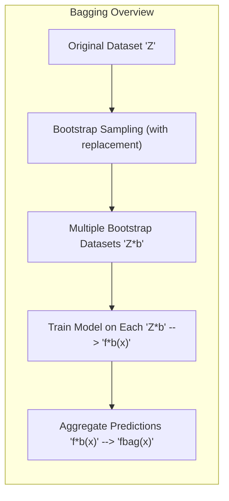
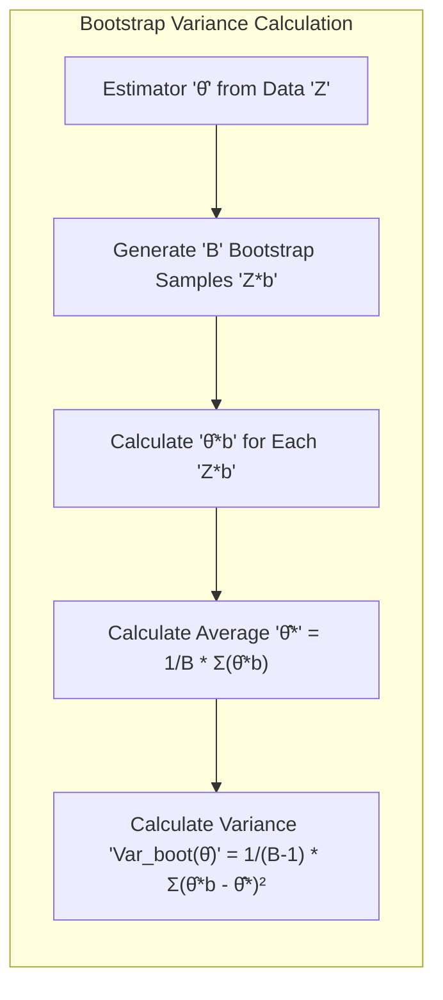
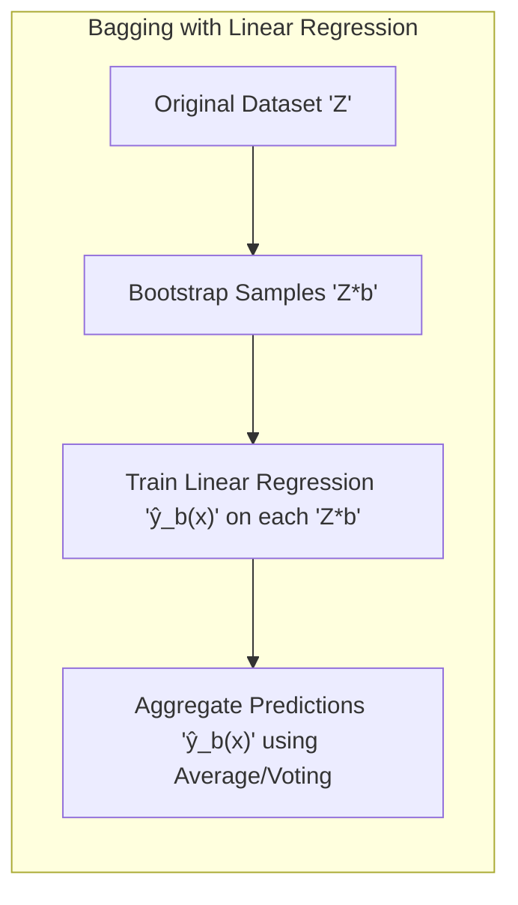
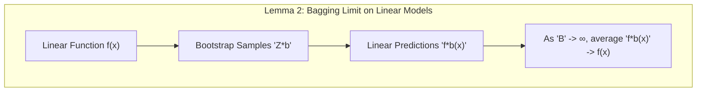
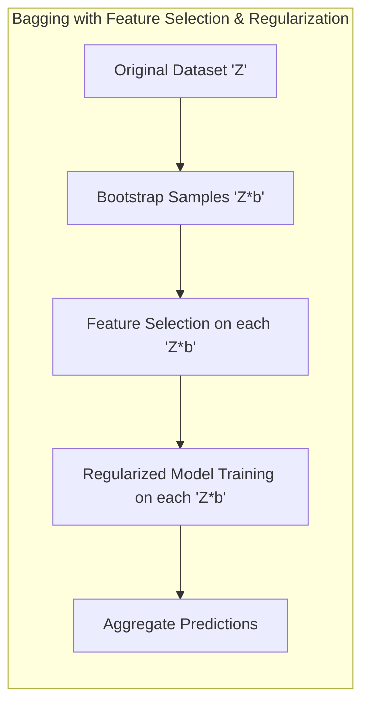
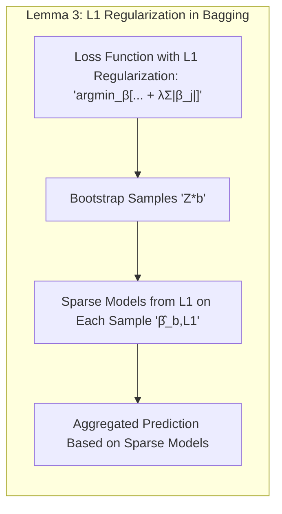
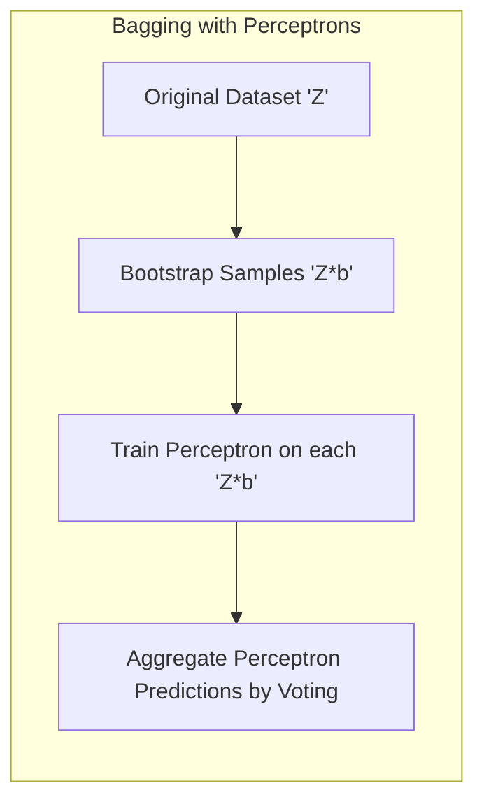
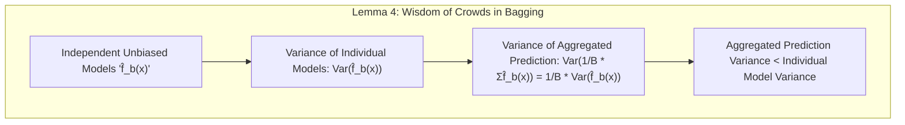

## Bootstrap Aggregation: Bagging

### Introdução

O conceito de **Bootstrap Aggregation**, ou **Bagging**, emerge como uma poderosa técnica no campo do aprendizado estatístico, com foco na melhoria da precisão e estabilidade de modelos preditivos [^8.1]. Este capítulo explora em profundidade o Bagging, sua relação com o método Bootstrap, e como ele se encaixa em um contexto mais amplo de inferência e média de modelos [^8.2]. O objetivo principal do Bagging é reduzir a variância de modelos instáveis, combinando as previsões de múltiplos modelos treinados em diferentes amostras de dados. Ao longo deste capítulo, examinaremos os fundamentos teóricos do Bagging, suas aplicações práticas e algumas das suas limitações.

### Conceitos Fundamentais

**Conceito 1: O Bootstrap e a Avaliação de Incerteza**

O método **Bootstrap** é uma técnica de reamostragem computacional que permite estimar a incerteza em uma estatística amostral, como a média ou um coeficiente de regressão. Essa técnica envolve a criação de múltiplas amostras (bootstrap samples) por amostragem com reposição a partir dos dados de treinamento [^8.2.1]. Cada amostra bootstrap tem o mesmo tamanho do conjunto de dados original, mas contém alguns dados repetidos e omite outros, permitindo uma avaliação da variabilidade da estatística de interesse.

*A utilização do Bootstrap para avaliar a incerteza reside na sua capacidade de simular a variabilidade que existiria se tivéssemos acesso a muitos conjuntos de dados diferentes, todos originados da mesma população*. O Bootstrap é essencial para a construção de intervalos de confiança e para a avaliação da precisão de modelos estatísticos [^8.1].

> 💡 **Exemplo Numérico:** Imagine que temos um conjunto de dados com as alturas de 5 estudantes (em cm): `[165, 170, 175, 180, 185]`. Queremos estimar a média da altura e sua incerteza utilizando o Bootstrap.
>
> 1. **Amostras Bootstrap:** Criamos, digamos, 3 amostras bootstrap:
>    - Amostra 1: `[170, 170, 180, 165, 185]`
>    - Amostra 2: `[185, 175, 165, 180, 175]`
>    - Amostra 3: `[165, 175, 170, 185, 170]`
> 2. **Estimativa em cada amostra:** Calculamos a média para cada amostra:
>    - Média da amostra 1: 174
>    - Média da amostra 2: 176
>    - Média da amostra 3: 173
> 3. **Estimativa da incerteza:** A variância das médias bootstrap pode ser calculada conforme o Lemma 1, e essa variância representa a incerteza na estimativa da média da altura.

**Lemma 1: Estimativa da Variância via Bootstrap**

Dado um estimador $\hat{\theta}$ de um parâmetro $\theta$ baseado em um conjunto de dados $Z = \{z_1, z_2, ..., z_N\}$, podemos usar o Bootstrap para estimar a variância de $\hat{\theta}$. Seja $\hat{\theta}^*_b$ o estimador de $\theta$ calculado sobre a *b-ésima* amostra bootstrap $Z^*_b$. A variância bootstrap de $\hat{\theta}$ é dada por:
$$Var_{boot}(\hat{\theta}) = \frac{1}{B-1}\sum_{b=1}^B (\hat{\theta}^*_b - \bar{\hat{\theta}^*})^2,$$
onde $\bar{\hat{\theta}^*} = \frac{1}{B}\sum_{b=1}^B \hat{\theta}^*_b$ e $B$ é o número de amostras bootstrap. Este lemma demonstra a utilidade prática do bootstrap para a estimação de variâncias, especialmente quando a forma analítica da variância é desconhecida ou muito complexa [^8.2.1]. $\blacksquare$

> 💡 **Exemplo Numérico (Continuando do exemplo anterior):**
>
> Usando as médias calculadas nas 3 amostras bootstrap: 174, 176 e 173.
>
> 1. **Média das médias bootstrap:** $\bar{\hat{\theta}^*} = (174 + 176 + 173) / 3 = 174.33$
> 2. **Variância bootstrap:** $Var_{boot}(\hat{\theta}) = \frac{1}{3-1} [ (174-174.33)^2 + (176-174.33)^2 + (173-174.33)^2] = \frac{1}{2} [0.11 + 2.78 + 1.78] = 2.335$
>
> A raiz quadrada da variância bootstrap, $\sqrt{2.335} \approx 1.53$, nos daria um desvio padrão bootstrap que indica a incerteza em nossa estimativa da média da altura.

**Conceito 2: Agregação por Bootstrap (Bagging)**

O **Bagging** é um método que utiliza o Bootstrap para melhorar o desempenho de modelos preditivos, especialmente aqueles que são instáveis ou sujeitos a alta variância [^8.7]. Em essência, o Bagging envolve:
1. Gerar múltiplos conjuntos de dados de treinamento, $Z^*_b$, por meio da amostragem com reposição dos dados originais $Z$ [^8.2.1].
2. Ajustar um modelo preditivo a cada conjunto de dados $Z^*_b$, obtendo uma coleção de preditores $f^*_b(x)$.
3. Agregar as predições individuais $f^*_b(x)$ para obter a predição final $f_{bag}(x)$. Para problemas de regressão, a agregação é feita por média, enquanto em problemas de classificação, pode ser por votação majoritária ou pela média das probabilidades de classe [^8.7].

O Bagging tem como principal objetivo reduzir a variância dos modelos preditivos, melhorando assim a precisão das predições. A ideia central é que ao agregar as predições de vários modelos, as oscilações individuais de cada um tendem a cancelar, levando a uma predição mais estável [^8.1].

**Corolário 1: Redução da Variância com Bagging**
A agregação de modelos realizada pelo Bagging tende a reduzir a variância das predições, conforme demonstrado no tópico [^8.7]. Ao combinarmos múltiplas predições, o erro total do modelo se torna mais estável e menos sensível a pequenas mudanças nos dados de treinamento. Este corolário estabelece a justificativa matemática para o uso do Bagging em problemas com modelos de alta variância.

**Conceito 3: Bagging e a Inferência Bayesiana**

Embora o Bagging seja uma técnica essencialmente frequentista, ele tem uma conexão interessante com a inferência bayesiana [^8.7]. Especificamente, a média bootstrap pode ser vista como uma aproximação da média *a posteriori* em uma análise bayesiana não paramétrica [^8.4]. Em modelos gaussianos, a análise bayesiana com priors não informativos tendem a concordar com o bootstrap paramétrico [^8.4].

> ⚠️ **Nota Importante:** *A relação entre Bootstrap e métodos bayesianos fornece uma visão interessante sobre a interpretação de resultados e construção de intervalos de confiança.* [^8.4]
>
> ❗ **Ponto de Atenção:** *Embora o Bagging geralmente reduza a variância, ele não é uma cura universal, e em alguns casos específicos pode não ser eficaz*. [^8.7]
>
> ✔️ **Destaque:** *Bagging tende a se beneficiar de modelos não lineares, como árvores de decisão, em comparação com modelos lineares.* [^8.7]

### Regressão Linear e Mínimos Quadrados para Classificação

A relação entre regressão linear e Bagging não é imediata, já que o Bagging é usado para melhorar modelos complexos, e regressão linear é um modelo simples. Contudo, é possível aplicar a regressão linear como um modelo base no Bagging. [^8.2.1] A regressão linear, quando utilizada como um modelo base no Bagging, tem a forma:
$$ \hat{y}_b(x) = \beta_0 + \beta_1x_1 + \beta_2x_2 + \ldots + \beta_px_p$$
onde $\hat{y}_b(x)$ é a previsão para a b-ésima amostra bootstrap, $x_1, x_2, \ldots, x_p$ são os preditores, e $\beta_0, \beta_1, \ldots, \beta_p$ são os coeficientes. Para problemas de classificação, uma abordagem seria aplicar a regressão linear sobre uma matriz de indicadores [^8.1] e depois usar o resultado da regressão para derivar uma decisão de classe. O Bagging, então, combina os resultados das várias regressões lineares feitas nas amostras bootstrap.

> 💡 **Exemplo Numérico:** Suponha que temos dados de classificação binária com uma variável preditora $x$ e uma variável alvo $y$ (0 ou 1):
>
> | $x$    | $y$    |
> | ------ | ------ |
> | 1      | 0      |
> | 2      | 0      |
> | 3      | 1      |
> | 4      | 1      |
> | 5      | 1      |
>
> 1. **Amostras Bootstrap:** Criamos 2 amostras bootstrap:
>  - Amostra 1: `[(2, 0), (4, 1), (1, 0), (5, 1), (3, 1)]`
>  - Amostra 2: `[(1, 0), (3, 1), (5, 1), (2, 0), (4, 1)]`
> 2. **Regressão Linear:** Ajustamos um modelo de regressão linear (utilizando Ordinary Least Squares - OLS) a cada amostra, convertendo a variável y em uma variável real.
>  - Modelo 1: Obtemos $\hat{y}_1(x) = -0.4 + 0.3x$.
>  - Modelo 2: Obtemos $\hat{y}_2(x) = -0.6 + 0.35x$.
> 3. **Agregação:** Para classificar um novo ponto, por exemplo, $x = 3.5$:
>   - Modelo 1: $\hat{y}_1(3.5) = -0.4 + 0.3 * 3.5 = 0.65$
>   - Modelo 2: $\hat{y}_2(3.5) = -0.6 + 0.35 * 3.5 = 0.625$
> 4. **Previsão Final:** Agregamos as previsões (por exemplo, fazendo a média):
> $\hat{y}_{bag}(3.5) = (0.65 + 0.625) / 2 = 0.6375$. Para classificar, poderíamos usar um limiar de 0.5: como 0.6375 > 0.5, a classe prevista seria 1.
>
> Note que este é um exemplo simplificado, com poucas amostras bootstrap e poucos dados.

O foco do Bagging reside no aumento da estabilidade, especialmente quando o modelo base (regressão linear, neste caso) é combinado com outros, o que é adequado para situações com alta variabilidade nos dados de entrada [^8.7]. Se os dados forem lineares e estáveis, o Bagging pode não trazer tantos benefícios em comparação com modelos mais complexos [^8.7].

**Lemma 2: Limitações do Bagging com Modelos Lineares**
Se a função de predição $f(x)$ é linear no dataset de treinamento, o Bagging utilizando o parametric bootstrap não vai alterar a predição final quando o número de amostras bootstrap vai para o infinito. Isso é porque as predições $f_b^*(x)$ serão quase iguais ao $f(x)$, e a média das predições vai convergir para $f(x)$ [^8.7].
$$\lim_{B \to \infty} \frac{1}{B}\sum_{b=1}^B f^*_b(x) = f(x)$$
Este lemma estabelece uma restrição quando se utiliza o Bagging em modelos lineares. $\blacksquare$

**Corolário 2: Benefícios do Bagging em Modelos Não-Lineares**
Contrariamente, o Bagging é mais eficiente em modelos não lineares, tais como árvores de decisão e redes neurais, porque nesses casos as predições variam consideravelmente entre as amostras bootstrap, e a agregação leva a resultados mais estáveis e precisos [^8.7]. Este corolário ressalta a importância de se escolher um modelo base adequado ao usar o Bagging.

"Em cenários onde a regressão linear é estável e os dados são bem comportados, o Bagging pode não trazer grande melhoria. No entanto, em datasets com alta variabilidade, a combinação de múltiplos modelos lineares pode reduzir o erro quadrático médio" [^8.7].

"É essencial avaliar a adequação do modelo base ao utilizar o Bagging; para modelos simples, o impacto será menor do que com modelos não-lineares, conforme apontado em [^8.7]".

### Métodos de Seleção de Variáveis e Regularização em Classificação

A seleção de variáveis e regularização são importantes para evitar o overfitting e melhorar a generalização de modelos de classificação. Em um contexto de Bagging, esses métodos podem ser aplicados em cada modelo base construído com uma amostra bootstrap [^8.7]. Por exemplo, na regressão logística, a regularização $L_1$ ou $L_2$ (ou ambas) pode ser incorporada para controlar a magnitude dos coeficientes e a complexidade do modelo [^8.2.1]. Essa regularização é aplicada *dentro* de cada modelo construído sobre uma amostra bootstrap, o que torna o processo de seleção mais robusto.

> 💡 **Exemplo Numérico:** Imagine que estamos construindo um modelo de regressão logística para classificar se um cliente vai comprar um produto (1) ou não (0), com base em duas variáveis: tempo de navegação no site ($x_1$) e número de visitas ($x_2$).
>
>1.  **Dados:** Suponha que temos um conjunto de dados original.
>2.  **Bootstrap Samples:** Criamos amostras bootstrap. Para cada amostra, aplicamos a regressão logística com regularização L1:
>
>    $\hat{\beta}_{b,L1} = \underset{\beta}{\operatorname{argmin}} \left[ -\sum_{i=1}^N y_i \log(\sigma(\beta^T x_i)) + (1-y_i)\log(1-\sigma(\beta^Tx_i)) + \lambda \sum_{j=1}^p|\beta_j| \right]$
>
>    Onde:
>    - $\sigma(\beta^Tx_i)$ é a função logística.
>    - $\lambda$ é o parâmetro de regularização (escolhemos $\lambda=0.1$).
>
>    Para cada amostra, encontramos coeficientes ($\beta_0, \beta_1, \beta_2$). Devido ao L1, alguns coeficientes podem ser exatamente 0.
>
>    - Amostra 1: $\beta_0 = -2.0$, $\beta_1 = 0.5$, $\beta_2 = 0$ (a variável $x_2$ não foi considerada importante neste modelo).
>    - Amostra 2: $\beta_0 = -1.5$, $\beta_1 = 0$, $\beta_2 = 0.6$ (a variável $x_1$ não foi considerada importante neste modelo).
>    - Amostra 3: $\beta_0 = -1.8$, $\beta_1 = 0.3$, $\beta_2 = 0.2$ (ambas as variáveis foram consideradas importantes).
>
>3. **Agregação:** Ao prever a probabilidade para um novo cliente com, por exemplo, $x_1 = 2$ e $x_2 = 3$, calculamos a probabilidade para cada modelo e agregamos (fazendo a média):
>
>    - Modelo 1: $\sigma(-2 + 0.5*2 + 0*3) = \sigma(-1) = 0.27$
>    - Modelo 2: $\sigma(-1.5 + 0*2 + 0.6*3) = \sigma(0.3) = 0.57$
>    - Modelo 3: $\sigma(-1.8 + 0.3*2 + 0.2*3) = \sigma(-0.6) = 0.35$
>    - Probabilidade Agregada: $(0.27+0.57+0.35)/3 = 0.397$. O cliente é classificado como não comprando (0), se usarmos um limiar de 0.5.
>
>   Note que em cada amostra, o modelo L1 pode selecionar um subconjunto de variáveis, o que leva a modelos mais esparsos. A agregação desses modelos resulta em uma predição robusta.

A incorporação de métodos de seleção de variáveis dentro do processo de bagging pode também ser feita, selecionando diferentes variáveis relevantes para cada amostra bootstrap. Esta abordagem pode levar a modelos base mais diversificados e robustos [^8.7].

**Lemma 3: Regularização e Esparsidade no Bagging**

Considerando uma regularização L1 no modelo base de regressão logística, a aplicação do Bagging com regularização L1 leva a um conjunto de modelos base esparsos, onde muitos coeficientes são nulos. A decisão final agregada será baseada em um conjunto de modelos com diferentes conjuntos de variáveis relevantes, que pode melhorar a interpretabilidade e precisão do modelo final [^8.4].
$$ \hat{\beta}_{b,L1} = \underset{\beta}{\operatorname{argmin}} \left[ -\sum_{i=1}^N y_i \log(\sigma(\beta^T x_i)) + (1-y_i)\log(1-\sigma(\beta^Tx_i)) + \lambda \sum_{j=1}^p|\beta_j| \right] $$
Este lemma estabelece como a regularização L1 contribui para a esparsidade dos modelos base dentro do framework do Bagging. $\blacksquare$

**Prova do Lemma 3:**
O termo de regularização L1, $\lambda \sum_{j=1}^p|\beta_j|$, penaliza a complexidade do modelo ao adicionar um termo que força os coeficientes a serem zero. Ao minimizar a função de custo, muitos coeficientes serão empurrados para zero, resultando em um modelo esparso. Aplicar o Bagging sobre esses modelos esparsos leva a um conjunto diversificado de variáveis selecionadas em diferentes amostras bootstrap, o que pode melhorar o poder de predição e a interpretabilidade do modelo final. A aplicação da regularização L1 nas amostras bootstrap garante modelos mais simples e robustos. [^8.4]. $\blacksquare$

**Corolário 3: Estabilidade e Interpretabilidade com Regularização L1 e L2**

A utilização de regularização (L1 ou L2 ou ambas) dentro do Bagging leva a modelos mais estáveis e, em alguns casos, mais interpretáveis. A regularização L2 reduz a variância dos coeficientes, enquanto a L1 promove a seleção de variáveis, levando a modelos mais robustos, como abordado em [^8.7]. A combinação de métodos de regularização e Bagging ajuda a criar modelos que generalizam melhor e têm menos propensão a overfitting.

> ⚠️ **Ponto Crucial:** *A combinação de L1 e L2 (Elastic Net) pode ser útil para balancear a seleção de variáveis e a redução de variância, levando a modelos mais estáveis e precisos. Conforme indicado em [^8.7]*.
>
### Separating Hyperplanes e Perceptrons

O conceito de hiperplanos separadores não está diretamente ligado ao Bagging da forma como os modelos não lineares estão. O Bagging é uma técnica de agregação de modelos instáveis. A ideia de *separating hyperplanes*, em si, já é um método estável para classificação linear. Entretanto, se tomarmos o Perceptron, um classificador linear, como modelo base, poderíamos aplicar o Bagging. O Bagging não altera a linearidade do modelo, mas combina as decisões de múltiplos Perceptrons treinados em dados de bootstrap, que podem levar a uma fronteira de decisão mais robusta [^8.7].

> 💡 **Exemplo Numérico:** Suponha que temos um problema de classificação binária com duas características ($x_1$ e $x_2$), onde queremos encontrar um hiperplano separador usando Perceptrons.
>
> 1. **Dados:** Temos um conjunto de dados não linearmente separável.
> 2. **Bootstrap Samples:** Criamos várias amostras bootstrap e para cada amostra treinamos um Perceptron.
>  - Perceptron 1 (Amostra 1): Encontra um hiperplano com pesos $w_1 = 0.5$, $w_2 = -0.3$, bias = -0.2
>  - Perceptron 2 (Amostra 2): Encontra um hiperplano com pesos $w_1 = 0.4$, $w_2 = -0.2$, bias = -0.3
>  - Perceptron 3 (Amostra 3): Encontra um hiperplano com pesos $w_1 = 0.6$, $w_2 = -0.4$, bias = -0.1
> 3.  **Agregação:** Para classificar um novo ponto, $x = (2, 1)$, cada Perceptron faz sua predição e agregamos usando uma votação majoritária:
>   - Perceptron 1: $0.5 * 2 - 0.3 * 1 - 0.2 = 0.5$. Classifica como classe 1
>   - Perceptron 2: $0.4 * 2 - 0.2 * 1 - 0.3 = 0.3$. Classifica como classe 1
>   - Perceptron 3: $0.6 * 2 - 0.4 * 1 - 0.1 = 0.7$. Classifica como classe 1
> 4.  **Previsão Final:** Como todos os modelos votaram na classe 1, a classe agregada é 1.
>
>  Ao agregar as decisões, podemos obter uma classificação mais robusta do que com apenas um Perceptron treinado no conjunto de dados completo.

A ideia central de hiperplanos separadores é encontrar um hiperplano que divida as classes em um espaço de características, e esse conceito não muda com o uso do Bagging [^8.7]. Entretanto, se o dataset não for linearmente separável, o uso do Perceptron e do Bagging pode trazer alguma melhora na precisão e estabilidade do modelo final.

### Pergunta Teórica Avançada: Qual a relação entre Bagging e a ideia de "Wisdom of Crowds"?

**Resposta:**
O conceito de **Wisdom of Crowds**, como mencionado em [^8.7], refere-se à ideia de que a agregação de múltiplas opiniões independentes leva a uma estimativa mais precisa do que qualquer opinião individual. O Bagging explora essa ideia no contexto de aprendizado de máquina: cada amostra bootstrap e modelo resultante podem ser vistos como uma opinião ou estimativa independente da função de predição. Ao agregar essas estimativas, o Bagging se beneficia da diversidade dos modelos, o que leva a uma redução da variância e melhora na precisão da predição final. Entretanto, o Bagging não garante a total independência dos modelos, como é o caso da sabedoria das multidões, dado que todos os modelos são treinados utilizando o mesmo dataset.

**Lemma 4:**  Em cenários ideais onde os modelos base são independentes e não enviesados, o erro da média das predições tende a ser menor do que o erro de qualquer modelo individual. [^8.7]. Isso pode ser demonstrado ao analisar a variância da média dos estimadores, que será menor do que a variância de cada estimador individual se eles forem independentes:
$$Var(\frac{1}{B} \sum_{b=1}^B \hat{f}_b(x)) = \frac{1}{B} Var(\hat{f}_b(x))$$
Esta fórmula demonstra como a variância é reduzida ao agregar múltiplos modelos independentes. $\blacksquare$

**Corolário 4:** O sucesso do Bagging depende de quão diversos são os modelos base. Modelos que são muito correlacionados não trazem tanto benefício da agregação. No entanto, o Bagging é uma forma eficiente de utilizar o poder da agregação para melhorar modelos que são instáveis e que possuem alta variância [^8.7].

> ⚠️ **Ponto Crucial**: A independência dos modelos base é um fator crucial para a eficácia do Bagging, o que justifica técnicas como o Random Forests, que visam a reduzir a correlação entre os modelos. [^8.7]

### Conclusão

O Bagging se apresenta como uma técnica poderosa para reduzir a variância de modelos preditivos, especialmente aqueles que são instáveis, tais como as árvores de decisão. Ao agregar as predições de modelos construídos em amostras bootstrap, o Bagging estabiliza o processo de predição e leva a resultados mais precisos e robustos. O Bagging é uma técnica que explora a sabedoria das multidões no contexto de aprendizado de máquina [^8.7], sendo útil em cenários onde há alta variância e necessita-se estabilidade no processo de predição. Ao longo deste capítulo, exploramos a fundo os conceitos teóricos e aplicações do Bagging, estabelecendo um fundamento sólido para sua compreensão e aplicação.

<!-- END DOCUMENT -->
### Footnotes
[^8.1]: "In this chapter we provide a general exposition of the maximum likeli-
hood approach, as well as the Bayesian method for inference. The boot-
strap, introduced in Chapter 7, is discussed in this context, and its relation
to maximum likelihood and Bayes is described. Finally, we present some
related techniques for model averaging and improvement, including com-
mittee methods, bagging, stacking and bumping." *(Trecho de <Model Inference and Averaging>)*
[^8.2]: "The bootstrap method provides a direct computational way of assessing
uncertainty, by sampling from the training data." *(Trecho de <Model Inference and Averaging>)*
[^8.2.1]: "Here we illustrate the
bootstrap in a simple one-dimensional smoothing problem, and show its
connection to maximum likelihood." *(Trecho de <Model Inference and Averaging>)*
[^8.7]: "Earlier we introduced the bootstrap as a way of assessing the accuracy of a
parameter estimate or a prediction. Here we show how to use the bootstrap
to improve the estimate or prediction itself. In Section 8.4 we investigated
the relationship between the bootstrap and Bayes approaches, and found
that the bootstrap mean is approximately a posterior average. Bagging
further exploits this connection." *(Trecho de <Model Inference and Averaging>)*
[^8.4]: "In essence the bootstrap is a computer implementation of nonparametric or
parametric maximum likelihood. The advantage of the bootstrap over the
maximum likelihood formula is that it allows us to compute maximum like-
lihood estimates of standard errors and other quantities in settings where
no formulas are available." *(Trecho de <Model Inference and Averaging>)*
