## Bagging para Regressão: Uma Análise Aprofundada
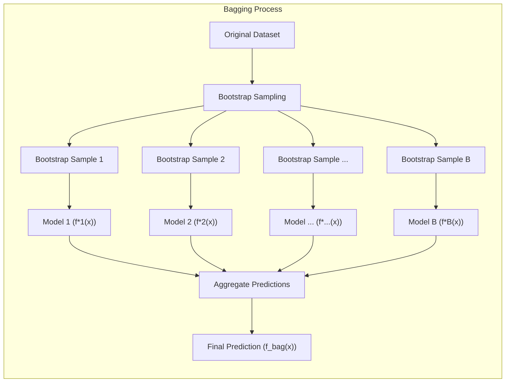

### Introdução
O conceito de **Bagging (Bootstrap Aggregating)** é uma técnica poderosa no campo do aprendizado de máquina, amplamente utilizada para aprimorar a precisão e a estabilidade de modelos preditivos, especialmente em regressão [^8.7]. Ao contrário dos métodos que se baseiam em um único modelo, o Bagging opera criando múltiplas versões de um modelo preditivo a partir de amostras bootstrap do conjunto de dados original, agregando-as para obter uma predição final mais robusta [^8.7]. Este capítulo explora em profundidade os fundamentos teóricos, as aplicações práticas e os nuances do Bagging para regressão, baseando-se em conceitos estatísticos e de aprendizado de máquina avançados.

### Conceitos Fundamentais
**Conceito 1: Amostragem Bootstrap**
A essência do Bagging reside na **amostragem bootstrap**, um método de reamostragem que cria múltiplos conjuntos de dados a partir de um único conjunto de dados original [^8.2.1]. Cada amostra bootstrap é obtida por amostragem aleatória com reposição do conjunto de dados original, o que significa que um mesmo ponto de dado pode aparecer várias vezes numa mesma amostra ou não aparecer. Esse processo gera conjuntos de dados que são ligeiramente diferentes entre si, mas preservam as características estatísticas do conjunto de dados original. O bootstrap é, essencialmente, uma ferramenta computacional para avaliar incertezas através da reamostragem dos dados de treinamento [^8.2.1].

> 💡 **Exemplo Numérico:** Suponha um conjunto de dados original com 5 amostras: $Z = \{(x_1, y_1), (x_2, y_2), (x_3, y_3), (x_4, y_4), (x_5, y_5)\}$. Uma possível amostra bootstrap $Z^{*1}$ poderia ser: $\{(x_1, y_1), (x_3, y_3), (x_1, y_1), (x_5, y_5), (x_2, y_2) \}$. Observe que $(x_1, y_1)$ aparece duas vezes e $(x_4, y_4)$ não aparece nesta amostra específica. Uma segunda amostra bootstrap $Z^{*2}$ poderia ser $\{(x_2, y_2), (x_2, y_2), (x_4, y_4), (x_5, y_5), (x_3, y_3) \}$, e assim por diante.

**Lemma 1: Propriedades do Bootstrap**
Dada uma amostra de dados $Z = \{z_1, z_2, \ldots, z_N\}$, onde $z_i = (x_i, y_i)$, e $B$ amostras bootstrap $Z^{*b}$ criadas, a distribuição empírica das amostras bootstrap converge para a distribuição da amostra original quando $N$ e $B$ tendem ao infinito. Isso garante que as análises feitas com as amostras bootstrap são representativas do conjunto de dados original [^8.2.1]. Formalmente:

$$ \lim_{N \to \infty} \frac{1}{B} \sum_{b=1}^{B} \mathbb{I}(Z^{*b} \in A) = P(Z \in A), $$
onde $\mathbb{I}$ é a função indicadora e $P(Z \in A)$ é a probabilidade de a amostra original estar em um conjunto $A$.
$\blacksquare$
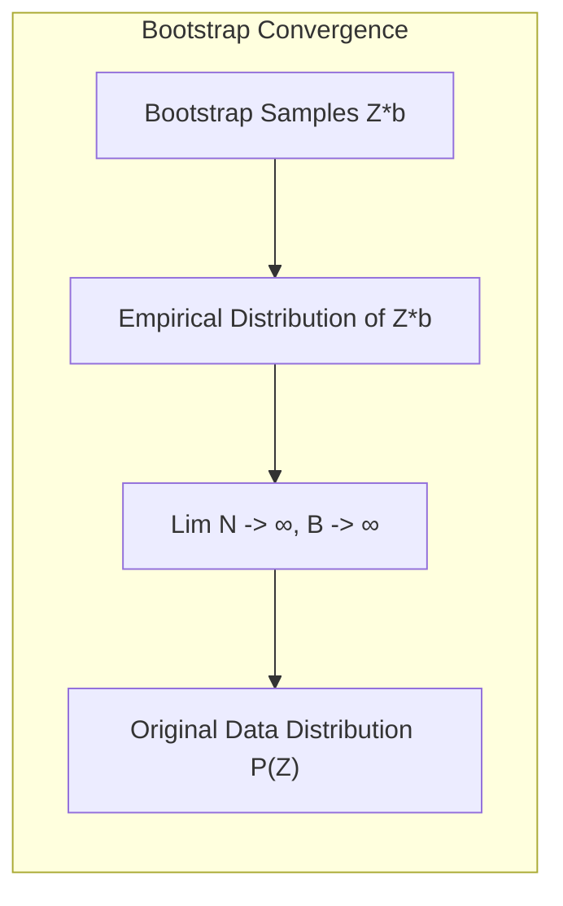
**Conceito 2: Agregação de Modelos**
Após a criação das amostras bootstrap, o próximo passo no Bagging é o treinamento de um modelo preditivo (como uma árvore de regressão ou outro regressor) em cada amostra bootstrap. Cada modelo preditivo, $f^{*b}(x)$, é treinado independentemente. A fase de agregação consiste em combinar as previsões desses modelos individuais para formar uma predição final mais robusta, $f_{bag}(x)$. Para regressão, essa agregação é tipicamente realizada pela média das previsões dos modelos individuais:

$$ f_{bag}(x) = \frac{1}{B} \sum_{b=1}^B f^{*b}(x) $$
Essa média reduz a variância da predição, tornando-a menos sensível a pequenas variações nos dados de treinamento [^8.7].

> 💡 **Exemplo Numérico:** Suponha que temos 3 modelos treinados em amostras bootstrap, e para um certo ponto $x$, suas previsões são $f^{*1}(x) = 2.3$, $f^{*2}(x) = 2.7$, e $f^{*3}(x) = 2.5$. A previsão agregada do Bagging seria: $f_{bag}(x) = (2.3 + 2.7 + 2.5) / 3 = 2.5$.

**Corolário 1: Redução da Variância**
A agregação de modelos via bagging resulta na redução da variância da previsão em comparação com um único modelo, pois ao fazer a média das predições, erros aleatórios tendem a se cancelar, e a estimativa de $f_{bag}(x)$ se torna mais estável e próxima do valor esperado do modelo. Isso é especialmente importante em modelos com alta variância [^8.7]. Formalmente:
$$ Var(f_{bag}(x)) \approx  \frac{1}{B} Var(f^*(x)) $$
onde $f^*(x)$ é a previsão de um modelo qualquer treinado em um conjunto bootstrap, e a aproximação se torna mais precisa quando os modelos são aproximadamente independentes.
$\blacksquare$
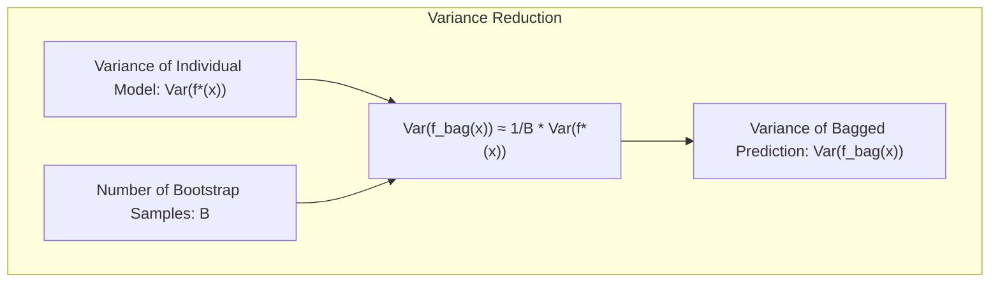
**Conceito 3: Bootstrap Paramétrico e Não Paramétrico**
No contexto do Bagging, podemos distinguir entre o bootstrap não paramétrico e o bootstrap paramétrico. No bootstrap **não paramétrico**, a reamostragem é feita diretamente nos dados de treinamento observados. No bootstrap **paramétrico**, simula-se novos dados de treinamento com base em uma distribuição probabilística assumida, usando parâmetros estimados a partir dos dados originais [^8.2.1]. Em modelos Gaussianos, o bootstrap paramétrico pode ser equivalente aos resultados dos mínimos quadrados, mas em geral, concorda com a máxima verossimilhança [^8.2.2].
> ⚠️ **Nota Importante**: O bootstrap não paramétrico usa os dados brutos e é mais "model-free", enquanto o paramétrico simula dados usando parâmetros ajustados, conforme discutido em [^8.2.1].
> ❗ **Ponto de Atenção**: O bootstrap paramétrico converge para a máxima verossimilhança, e não para os mínimos quadrados em geral [^8.2.2].
> ✔️ **Destaque**: Ambas as versões do bootstrap são úteis no contexto de bagging, para reduzir a variância das predições do modelo base [^8.7].

### Regressão Linear e Mínimos Quadrados com Bagging
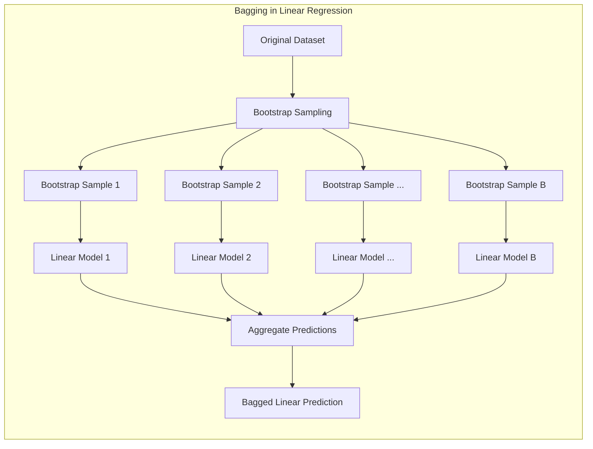

A regressão linear, por ser um modelo paramétrico com baixa variância, pode não se beneficiar tanto do Bagging quanto outros modelos [^8.7]. No entanto, ao aplicar o Bagging à regressão linear com matrizes de indicadores ou splines lineares, podemos obter melhorias sutis. A utilização de amostras bootstrap para treinar múltiplos modelos lineares, combinando as previsões através da média, pode levar a uma estimativa mais robusta dos parâmetros, reduzindo a sensibilidade a outliers.

**Lemma 2: Efeito do Bagging na Regressão Linear**
Para um modelo de regressão linear com parâmetros $\beta$ e função de predição $f(x) = h(x)^T \beta$, a previsão média dos modelos Bagging converge para a previsão do modelo linear original quando o bootstrap é paramétrico, e se os dados são amostrados sem reposição, ou quando a quantidade de amostras tende a infinito no caso não paramétrico. Formalmente:

$$ \lim_{B \to \infty} \frac{1}{B} \sum_{b=1}^{B} f^{*b}(x) \approx f(x) $$
Essa propriedade garante que, no caso da regressão linear, o viés não é significativamente alterado pelo Bagging [^8.7].
$\blacksquare$
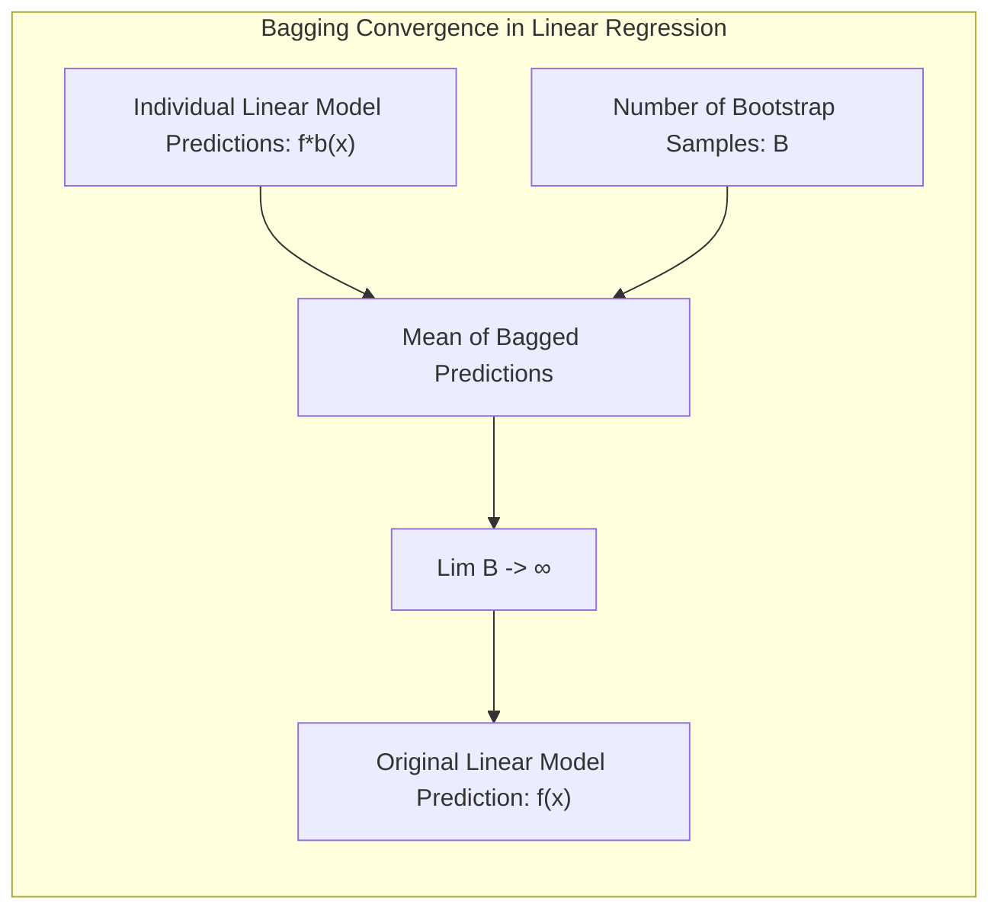

> 💡 **Exemplo Numérico:** Considere um modelo de regressão linear simples $y = \beta_0 + \beta_1 x$. Onde temos um dataset com 10 pontos $(x_i, y_i)$. Após aplicar o bagging, podemos obter vários modelos lineares, cada um treinado em uma amostra bootstrap, por exemplo:
>
>  - Modelo 1: $f^{*1}(x) = 1.1 + 2.1x$
>  - Modelo 2: $f^{*2}(x) = 0.9 + 1.9x$
>  - Modelo 3: $f^{*3}(x) = 1.0 + 2.0x$
>
>  A previsão agregada para um novo ponto $x=2$ seria:
>
>  - $f^{*1}(2) = 1.1 + 2.1 * 2 = 5.3$
>  - $f^{*2}(2) = 0.9 + 1.9 * 2 = 4.7$
>  - $f^{*3}(2) = 1.0 + 2.0 * 2 = 5.0$
>
>  A predição agregada seria $f_{bag}(2) = (5.3 + 4.7 + 5.0)/3 = 5.0$.

**Corolário 2: Redução da Variância em Regressão Linear Generalizada**
Mesmo que a previsão média não se modifique com o Bagging em um modelo linear, a variância da previsão é reduzida. Em um modelo linear generalizado (GLM) utilizando funções base, como splines, as estimativas de parâmetros se tornam mais robustas por conta da estabilização da variância através do processo do Bagging. Isto resulta em uma previsão final mais suave e generalizável [^8.7].

> ⚠️ **Ponto Crucial**: A regressão linear com Bagging se beneficia da redução da variância em cenários de alta complexidade ou com a presença de outliers, como em modelos com splines lineares. [^8.7].
> ❗ **Ponto de Atenção**: O ganho de performance da regressão linear com Bagging pode ser sutil em relação a outros modelos, devido a sua natureza paramétrica com baixa variância [^8.7].

### Métodos de Seleção de Variáveis e Regularização com Bagging
A combinação do Bagging com técnicas de seleção de variáveis e regularização pode levar a modelos de regressão ainda mais robustos e precisos. Ao treinar modelos individuais com regularização (como L1 ou L2) em diferentes amostras bootstrap, o efeito da regularização é estabilizado, levando a uma melhor capacidade de generalização [^8.7]. A penalização L1 (Lasso) pode levar a modelos mais esparsos, enquanto a penalização L2 (Ridge) pode melhorar a estabilidade das estimativas de parâmetros.
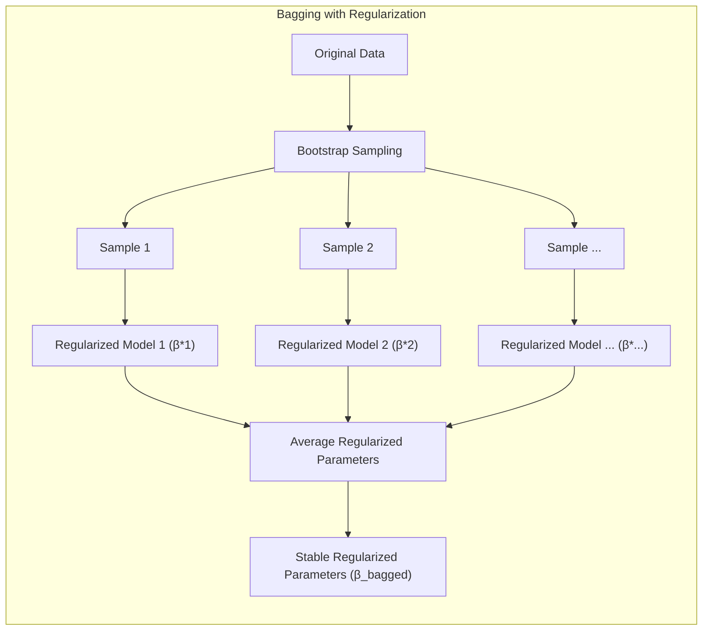

**Lemma 3: Estabilidade da Regularização com Bagging**
Quando aplicamos regularização L1 (Lasso), as estimativas de parâmetros podem variar muito entre as amostras bootstrap. Entretanto, ao agregar os modelos com o Bagging, as estimativas dos coeficientes tornam-se mais estáveis e próximas de uma solução regularizada mais robusta. Formalmente, se $\beta^{*b}$ são os parâmetros resultantes da regularização L1 em cada amostra bootstrap, então:

$$ \lim_{B \to \infty} \frac{1}{B} \sum_{b=1}^B \beta^{*b} \approx \hat{\beta}_{\text{bagged}} $$
onde $\hat{\beta}_{\text{bagged}}$ é um parâmetro mais estável do que o encontrado em uma amostra única de dados [^8.7].
$\blacksquare$
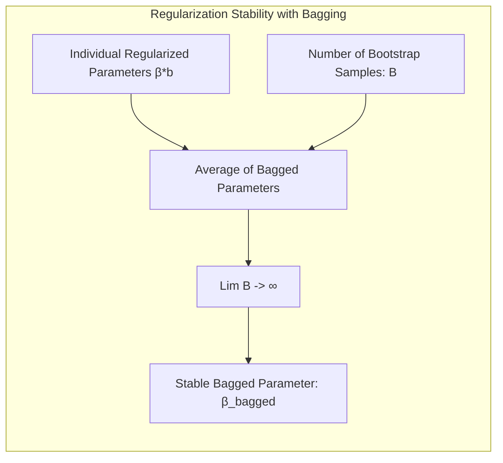
> 💡 **Exemplo Numérico:** Considere um modelo de regressão linear com regularização Lasso (L1) treinado em três amostras bootstrap. As estimativas dos parâmetros são $\beta^{*1} = [2.1, 0.2, -0.1]$, $\beta^{*2} = [1.9, 0.0, 0.0]$, e $\beta^{*3} = [2.0, 0.1, -0.2]$. A estimativa agregada dos coeficientes após o bagging é $\hat{\beta}_{\text{bagged}} = [(2.1+1.9+2.0)/3, (0.2+0.0+0.1)/3, (-0.1+0.0-0.2)/3] = [2.0, 0.1, -0.1]$. Note que, após o Bagging, os parâmetros se tornam mais estáveis, com o segundo parâmetro sendo próximo de zero, indicando uma possível seleção de variáveis.

**Corolário 3: Seleção de Variáveis por Bagging**
O Bagging também pode auxiliar na seleção de variáveis. Ao observar quais variáveis são frequentemente selecionadas em múltiplos modelos bootstrap, podemos obter *insights* sobre quais variáveis são mais relevantes para a predição [^8.7]. Isto leva a modelos mais interpretáveis e que mantém as variáveis mais importantes na predição.
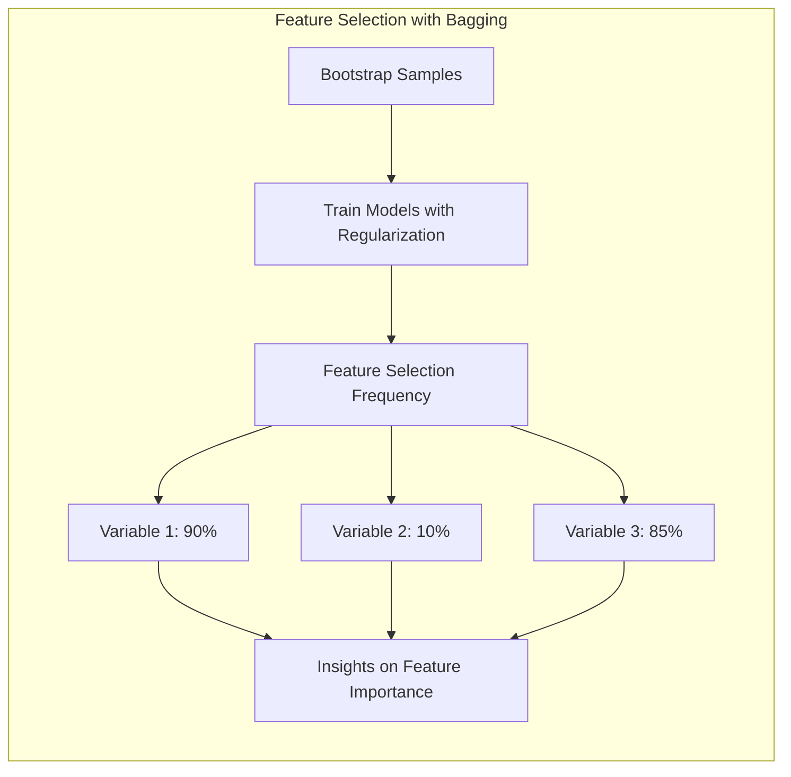

> 💡 **Exemplo Numérico:** Imagine que treinamos vários modelos com Lasso em diferentes amostras bootstrap. Observamos que a primeira e terceira variáveis são selecionadas em 90% e 85% das vezes, respectivamente, enquanto a segunda variável é selecionada em apenas 10% das vezes. Isso sugere que a segunda variável pode ser menos importante para a predição, e podemos simplificar o modelo removendo-a.

> | Variável   | Frequência de Seleção |
> |------------|----------------------|
> | Variável 1 | 90%                  |
> | Variável 2 | 10%                  |
> | Variável 3 | 85%                  |

> Este exemplo demonstra como o Bagging pode ser usado para obter *insights* sobre a importância das variáveis.

> ⚠️ **Ponto Crucial**: O Bagging estabiliza o efeito da regularização e auxilia na seleção de variáveis, levando a modelos mais precisos e generalizáveis [^8.7].

### Separating Hyperplanes e o Bagging
O conceito de separating hyperplanes (hiperplanos separadores) é central para métodos de classificação, mas pode ser aplicado para regressão com transformações adequadas do espaço de features. Quando usamos um método de regressão com Bagging, a predição do modelo é uma média de resultados de modelos individuais, o que pode resultar em um limite de decisão mais suave.

### Pergunta Teórica Avançada: Qual a relação entre o viés e a variância em modelos de regressão após a aplicação do Bagging?

**Resposta:**
O Bagging é uma técnica que visa principalmente reduzir a variância de um modelo, mantendo o viés aproximadamente constante. Isso ocorre porque ao treinar múltiplos modelos em amostras bootstrap e agregá-los, os erros aleatórios tendem a se cancelar, mas o padrão geral de previsão (viés) não é alterado [^8.7]. Em modelos como árvores de decisão, que tendem a ter alta variância e baixo viés, o Bagging é muito eficaz. Em modelos lineares, com baixa variância, o efeito do Bagging na variância é pequeno.
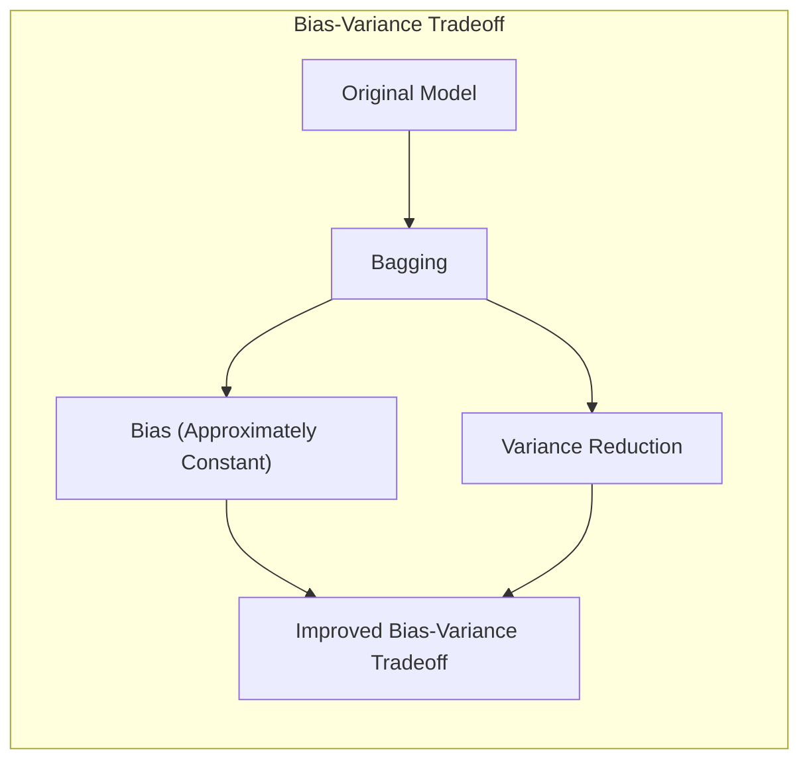

**Lemma 4: Decomposição do Erro em Viés e Variância com Bagging**
O erro médio quadrático de um modelo de regressão pode ser decomposto em viés e variância. Seja $f(x)$ o valor real da variável de resposta, e $f_{bag}(x)$ a previsão do modelo Bagging. O erro médio quadrático é:

$$ E[(f(x) - f_{bag}(x))^2] = [E[f_{bag}(x)] - f(x)]^2 + E[(f_{bag}(x) - E[f_{bag}(x)])^2] $$
onde o primeiro termo é o viés ao quadrado e o segundo é a variância. O Bagging reduz a variância, mas mantém o viés aproximadamente constante [^8.7].
$\blacksquare$
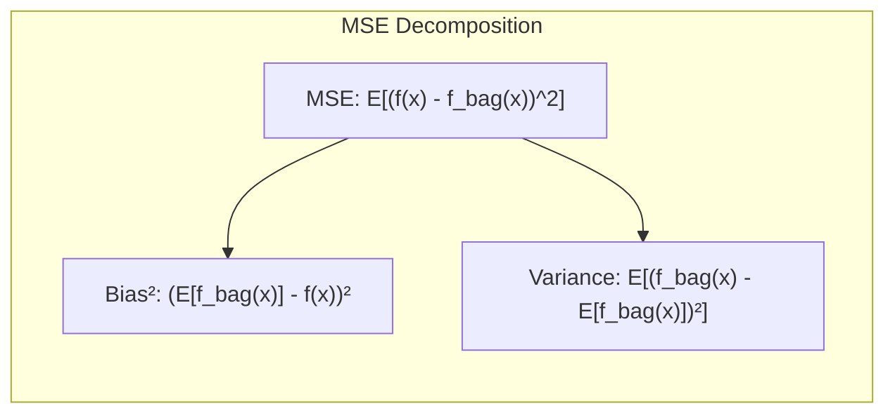

**Corolário 4: Impacto do Bagging no Trade-off Viés-Variância**
Ao reduzir a variância, o Bagging melhora o trade-off viés-variância, resultando em modelos com melhor capacidade de generalização. Este efeito é mais pronunciado em modelos com alta variância, como árvores de decisão [^8.7].
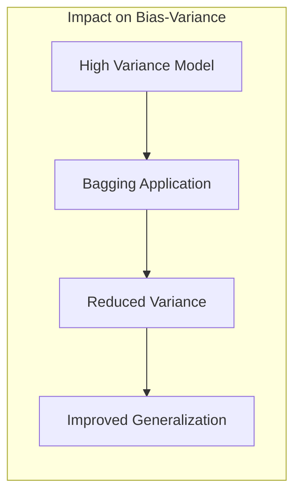

> 💡 **Exemplo Numérico:** Suponha um modelo com alta variância (como uma árvore de decisão profunda) que, em uma determinada previsão, tem um viés de 0.1 e uma variância de 0.9, resultando em um erro médio quadrático de $0.1^2 + 0.9 = 0.91$. Após aplicar o Bagging, o viés permanece aproximadamente o mesmo (0.1), mas a variância é reduzida, por exemplo, para 0.3. O novo erro médio quadrático seria de $0.1^2 + 0.3 = 0.31$. O bagging reduziu o erro ao reduzir a variância, enquanto o viés permaneceu o mesmo.

> ⚠️ **Ponto Crucial**: O Bagging reduz o erro de um modelo de regressão, especialmente em modelos de alta variância, atuando na variância, e mantendo o viés aproximadamente o mesmo, melhorando a sua capacidade de generalização [^8.7].

### Conclusão
O Bagging é uma técnica versátil e poderosa para melhorar a performance de modelos de regressão, principalmente através da redução da variância. Baseado em conceitos de amostragem bootstrap e agregação de modelos, o Bagging oferece uma maneira eficaz de construir modelos mais robustos e generalizáveis. Ao entender os fundamentos teóricos e as propriedades do Bagging, é possível aplicá-lo de forma otimizada em diversos problemas de regressão, tirando o máximo proveito de seus benefícios.

### Footnotes
[^8.1]: "For most of this book, the fitting (learning) of models has been achieved by minimizing a sum of squares for regression, or by minimizing cross-entropy for classification." *(Trecho de <Página 261>)*
[^8.2.1]: "The bootstrap method provides a direct computational way of assessing uncertainty, by sampling from the training data." *(Trecho de <Página 261>)*
[^8.2.2]: "It turns out that the parametric bootstrap agrees with least squares in the previous example because the model (8.5) has additive Gaussian errors. In general, the parametric bootstrap agrees not with least squares but with maximum likelihood, which we now review." *(Trecho de <Página 265>)*
[^8.7]: "Earlier we introduced the bootstrap as a way of assessing the accuracy of a parameter estimate or a prediction. Here we show how to use the bootstrap to improve the estimate or prediction itself." *(Trecho de <Página 282>)*
<!-- END DOCUMENT -->
