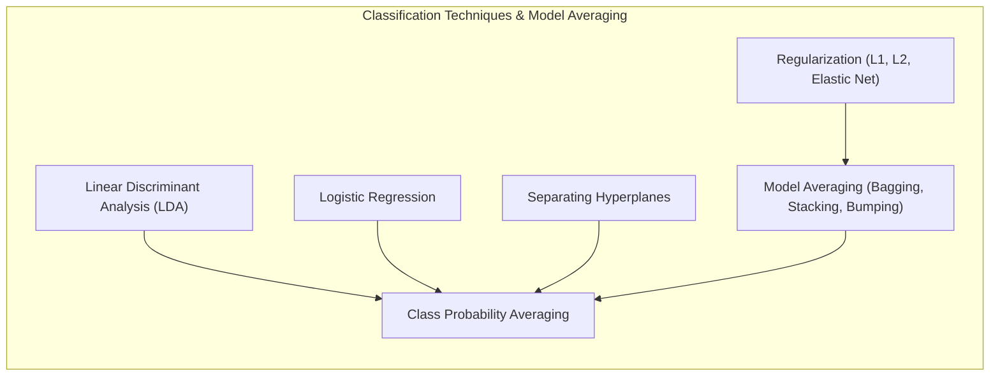
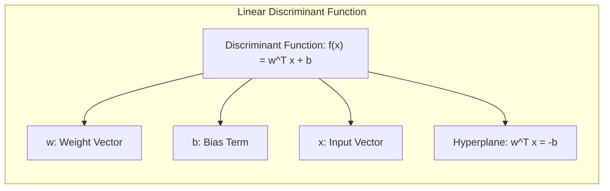
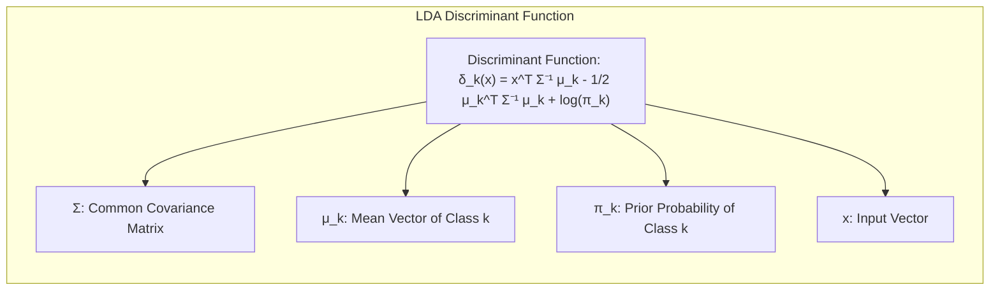
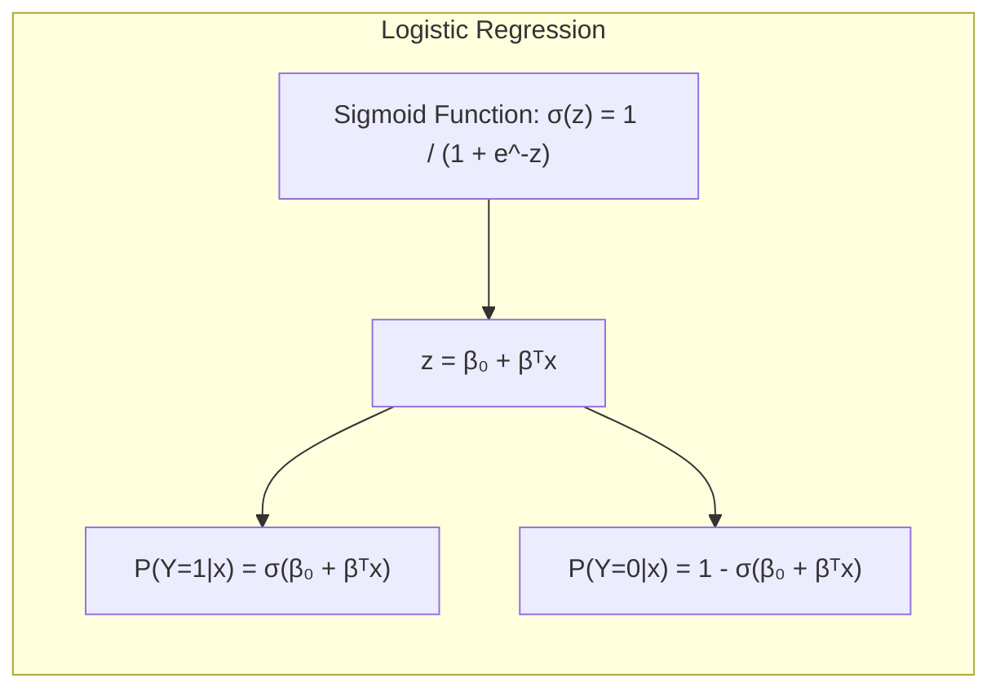
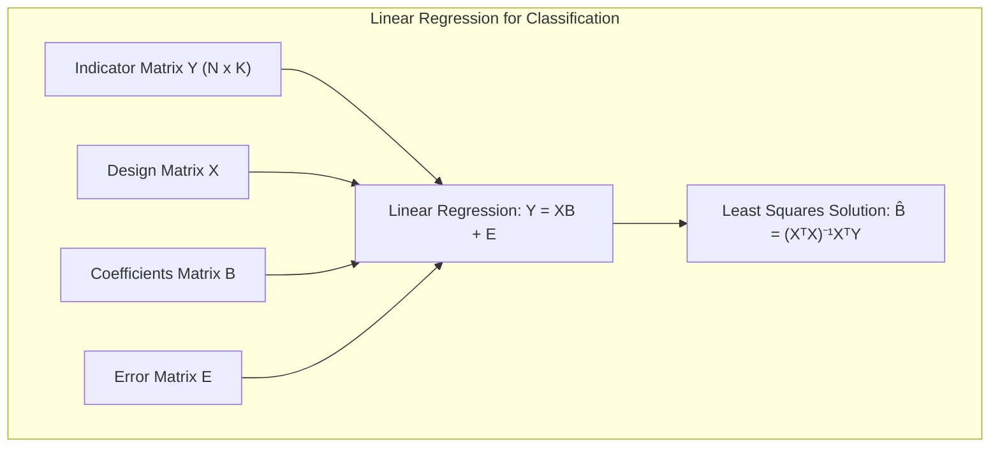
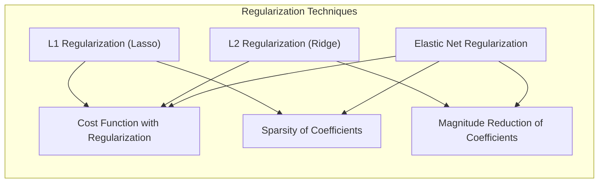
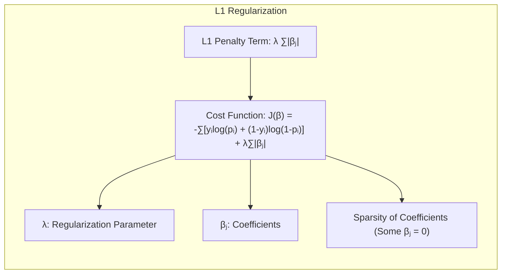
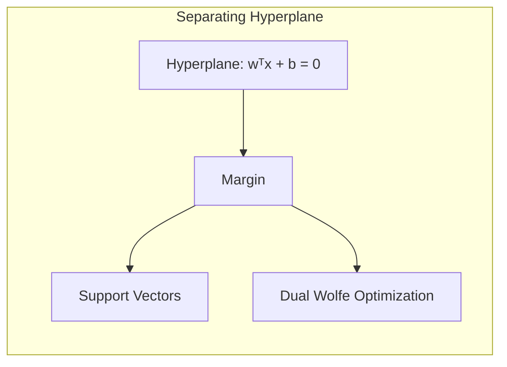
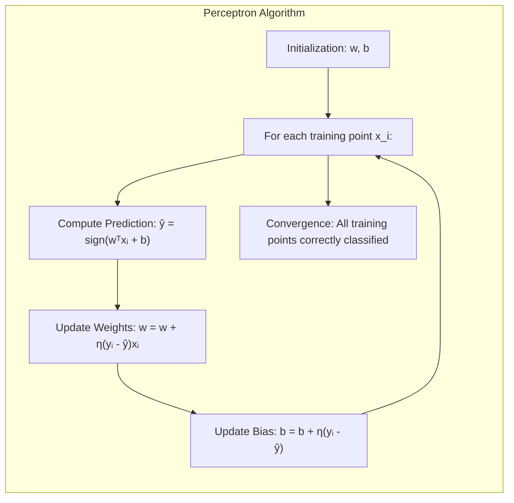
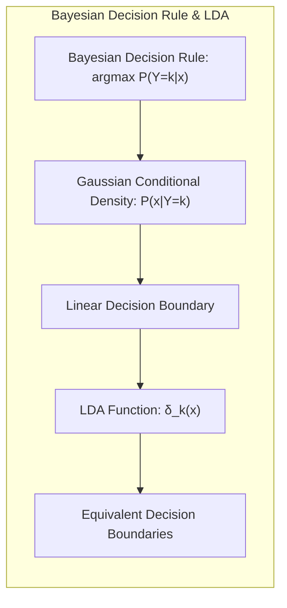

Okay, I've analyzed the text and added Mermaid diagrams to enhance the understanding of the mathematical and statistical concepts presented, focusing on theoretical relationships and algorithm visualizations, while adhering to all specified guidelines.

## Averaging Class Probabilities: Uma Análise Aprofundada de Técnicas de Classificação e Model Averaging

### Introdução

Este capítulo explora em detalhes o conceito de **averaging de probabilidades de classe** como uma ferramenta poderosa no contexto de **modelos de aprendizado estatístico diversos**. Partimos da base de métodos de classificação bem estabelecidos, como a **Linear Discriminant Analysis (LDA)**, a **Logistic Regression**, e a criação de **separating hyperplanes**, para avançar para estratégias que visam aprimorar a robustez e precisão das predições através da combinação de múltiplos modelos. O foco é, essencialmente, em como a média das probabilidades de classe (obtidas de diferentes modelos) pode levar a resultados mais confiáveis e consistentes do que as predições de um único modelo. Este estudo se aprofunda em conceitos de inferência estatística e técnicas de aprendizado de máquina, com o objetivo de fornecer uma compreensão abrangente do tema [^8.1]. O capítulo também abordará as conexões entre o *bootstrap*, a *maximum likelihood* e os métodos bayesianos, fornecendo um contexto teórico robusto para a prática do *averaging* de modelos. Além disso, métodos de regularização e seleção de variáveis serão explorados para aprimorar o processo de modelagem antes da etapa de *averaging*.

### Conceitos Fundamentais

**Conceito 1: Problemas de Classificação e Modelos Lineares**

O problema de classificação envolve a alocação de observações a classes predefinidas. Métodos lineares, como a **LDA** e a **Logistic Regression**, projetam a complexidade da classificação em um espaço onde as classes são separáveis por meio de hiperplanos [^8.1]. A escolha de um modelo linear implica um viés que pode ser benéfico ou prejudicial, dependendo da verdadeira natureza da relação entre os preditores e as classes. Por exemplo, se as classes são separáveis por uma superfície altamente não linear, um modelo linear pode apresentar um viés elevado, mas ainda assim, em algumas circunstâncias, uma baixa variância [^8.2].

**Lemma 1:** A função discriminante linear $f(x) = w^T x + b$, onde $w$ é o vetor de pesos e $b$ é o bias, particiona o espaço de características em duas regiões lineares separadas por um hiperplano, cuja normal é $w$. Essa decomposição é fundamental para entender a operação de modelos lineares de classificação, e a sua relação com projeções em subespaços de menor dimensão [^8.3].

$$ \text{Prova:} \quad f(x) = 0 \implies w^Tx + b = 0 \implies w^T x = -b \quad \text{Onde} \quad x \quad \text{é um ponto no hiperplano.} \blacksquare$$

> 💡 **Exemplo Numérico:** Imagine um problema de classificação em 2D com duas classes. Seja $w = \begin{bmatrix} 2 \\ -1 \end{bmatrix}$ e $b = -3$. A função discriminante é $f(x) = 2x_1 - x_2 - 3$. O hiperplano (neste caso, uma linha) é definido por $2x_1 - x_2 - 3 = 0$. Para um ponto $x = \begin{bmatrix} 1 \\ 1 \end{bmatrix}$, $f(x) = 2(1) - 1 - 3 = -2 < 0$, indicando que ele está de um lado do hiperplano. Para o ponto $x = \begin{bmatrix} 3 \\ 2 \end{bmatrix}$, $f(x) = 2(3) - 2 - 3 = 1 > 0$, indicando que ele está do outro lado.

**Conceito 2: Linear Discriminant Analysis (LDA)**

A **LDA** assume que as classes seguem distribuições gaussianas com mesma matriz de covariância, o que leva a fronteiras de decisão lineares. A **LDA** busca o melhor subespaço de projeção linear que maximiza a separação entre as médias das classes e minimiza a variância dentro de cada classe [^8.3]. Em termos matemáticos, a **LDA** calcula uma função discriminante para cada classe $k$ como $\delta_k(x) = x^T \Sigma^{-1} \mu_k - \frac{1}{2} \mu_k^T \Sigma^{-1} \mu_k + log(\pi_k)$, onde $\Sigma$ é a matriz de covariância comum, $\mu_k$ é o vetor de médias da classe $k$ e $\pi_k$ é a probabilidade *a priori* da classe $k$ [^8.3.1]. A classe predita para um dado input $x$ é a que maximiza $\delta_k(x)$. Uma das principais limitações da LDA é a sua suposição de normalidade e igualdade de covariâncias entre as classes [^8.3.2].

**Corolário 1:** Quando as matrizes de covariância das classes não são iguais, a fronteira de decisão entre as classes se torna quadrática (Quadratic Discriminant Analysis - QDA), e as funções discriminantes não são mais lineares, sendo dadas por $\delta_k(x) = -\frac{1}{2} log|\Sigma_k| - \frac{1}{2} (x - \mu_k)^T \Sigma_k^{-1} (x - \mu_k) + log(\pi_k)$ [^8.3.3].

> 💡 **Exemplo Numérico:** Considere um problema com duas classes e duas features, onde classe 1 tem média $\mu_1 = \begin{bmatrix} 1 \\ 2 \end{bmatrix}$ e classe 2 tem média $\mu_2 = \begin{bmatrix} 3 \\ 4 \end{bmatrix}$. A matriz de covariância comum é $\Sigma = \begin{bmatrix} 1 & 0.5 \\ 0.5 & 1 \end{bmatrix}$. As probabilidades a priori são $\pi_1 = 0.4$ e $\pi_2 = 0.6$. Para um ponto $x = \begin{bmatrix} 2 \\ 3 \end{bmatrix}$, podemos calcular $\delta_1(x)$ e $\delta_2(x)$, onde $\Sigma^{-1} = \begin{bmatrix} 1.33 & -0.66 \\ -0.66 & 1.33 \end{bmatrix}$.

> $\delta_1(x) = \begin{bmatrix} 2 & 3 \end{bmatrix} \begin{bmatrix} 1.33 & -0.66 \\ -0.66 & 1.33 \end{bmatrix} \begin{bmatrix} 1 \\ 2 \end{bmatrix} - \frac{1}{2} \begin{bmatrix} 1 & 2 \end{bmatrix} \begin{bmatrix} 1.33 & -0.66 \\ -0.66 & 1.33 \end{bmatrix} \begin{bmatrix} 1 \\ 2 \end{bmatrix} + \log(0.4) \approx -1.06$

> $\delta_2(x) = \begin{bmatrix} 2 & 3 \end{bmatrix} \begin{bmatrix} 1.33 & -0.66 \\ -0.66 & 1.33 \end{bmatrix} \begin{bmatrix} 3 \\ 4 \end{bmatrix} - \frac{1}{2} \begin{bmatrix} 3 & 4 \end{bmatrix} \begin{bmatrix} 1.33 & -0.66 \\ -0.66 & 1.33 \end{bmatrix} \begin{bmatrix} 3 \\ 4 \end{bmatrix} + \log(0.6) \approx -0.57$

> Como $\delta_2(x) > \delta_1(x)$, o ponto $x$ seria classificado como pertencente à classe 2.

**Conceito 3: Regressão Logística**

A **Logistic Regression** modela a probabilidade de uma observação pertencer a uma classe usando uma função logística aplicada a uma combinação linear dos preditores. A função logística, também conhecida como função sigmoide, é dada por $\sigma(z) = \frac{1}{1 + e^{-z}}$, onde $z = \beta_0 + \beta^T x$ [^8.4]. A probabilidade de um input $x$ pertencer à classe 1 é $P(Y=1|x) = \sigma(\beta_0 + \beta^T x)$, e a probabilidade de pertencer à classe 0 é $P(Y=0|x) = 1 - \sigma(\beta_0 + \beta^T x)$. Os parâmetros são estimados através da maximização da verossimilhança (likelihood). A **Logistic Regression** é mais flexível que a **LDA**, pois não assume normalidade dos dados, mas ainda assume uma fronteira de decisão linear no espaço dos preditores [^8.4.1].

> ⚠️ **Nota Importante**: Na regressão logística, os coeficientes $\beta$ representam a mudança no log-odds para um aumento unitário no preditor correspondente, mantendo os outros preditores constantes [^8.4.2].

> ❗ **Ponto de Atenção**: Em casos de classes não balanceadas, é essencial ajustar a função de custo para evitar que o modelo favoreça a classe majoritária, o que pode ser feito através de pesos ou técnicas de *oversampling* ou *undersampling* [^8.4.3].

> ✔️ **Destaque**: Embora a **LDA** e a **Logistic Regression** sejam ambas classificadores lineares, suas suposições subjacentes e forma de estimar os parâmetros são diferentes. Em particular, a **Logistic Regression** modela a probabilidade condicional das classes, enquanto a **LDA** modela a distribuição condicional dos preditores dadas as classes [^8.5].

> 💡 **Exemplo Numérico:** Suponha um modelo de regressão logística com $\beta_0 = -2$ e $\beta = \begin{bmatrix} 1 \\ 0.5 \end{bmatrix}$. Para um ponto $x = \begin{bmatrix} 2 \\ 1 \end{bmatrix}$, temos $z = -2 + 1(2) + 0.5(1) = 0.5$. Assim, $P(Y=1|x) = \sigma(0.5) = \frac{1}{1 + e^{-0.5}} \approx 0.62$. A probabilidade de pertencer à classe 0 é $1 - 0.62 = 0.38$.

### Regressão Linear e Mínimos Quadrados para Classificação

A regressão linear pode ser aplicada à classificação por meio da regressão em matrizes de indicadores, onde cada classe é representada por uma coluna na matriz de resposta. Os coeficientes são estimados por meio do método de mínimos quadrados (least squares - LS), que busca minimizar a soma dos quadrados dos erros entre os valores preditos e os valores observados. No entanto, esta abordagem tem limitações quando aplicada diretamente a problemas de classificação [^8.2].

Em cenários de classificação, a regressão linear pode produzir predições que extrapolam o intervalo [0,1], perdendo a interpretação como probabilidade. Além disso, a minimização do erro quadrático médio pode não ser a métrica mais adequada para classificação, onde o objetivo principal é classificar corretamente as observações [^8.2]. A **LDA** e a **Logistic Regression**, por sua vez, são métodos mais adequados, pois modelam diretamente a probabilidade das classes.

**Lemma 2:** Dada uma matriz de indicadores Y de dimensão N × K (onde N é o número de observações e K é o número de classes), a solução de mínimos quadrados para os coeficientes $\hat{B}$ na regressão linear $Y = XB + E$, onde X é a matriz de design, é dada por $\hat{B} = (X^T X)^{-1}X^T Y$. Se as classes forem codificadas ortogonalmente, o problema se torna equivalente a aplicar regressões lineares separadas para cada classe [^8.2].

**Corolário 2:** As projeções nos hiperplanos de decisão gerados por regressão linear e discriminantes lineares são equivalentes em certas condições, como quando se utiliza uma codificação ortogonal para as classes e as covariâncias das classes são idênticas [^8.3]. Isso estabelece uma conexão fundamental entre os dois tipos de modelos.

> ⚠️ **Ponto Crucial**: A regressão de indicadores, embora possa ser usada para classificação, não modela diretamente as probabilidades das classes, e portanto suas previsões podem ser difíceis de interpretar em termos probabilísticos [^8.2].
> ❗ **Ponto de Atenção**: Em problemas com muitas classes, a regressão de indicadores pode levar a problemas de multicolinearidade e instabilidade na estimativa dos parâmetros [^8.3].
"Em certos casos, conforme mencionado em [^8.4], a regressão logística apresenta estimativas mais estáveis das probabilidades, e a regressão de indicadores pode levar a extrapolações fora do intervalo [0,1]."
"Por outro lado, existem situações em que a regressão de indicadores é adequada, conforme indicado em [^8.2], quando o objetivo principal é definir a fronteira de decisão linear."

> 💡 **Exemplo Numérico:** Considere um problema de classificação binária com 3 amostras e um preditor. A matriz de design X é $\begin{bmatrix} 1 & 2 \\ 1 & 3 \\ 1 & 4 \end{bmatrix}$ e a matriz de indicadores Y é $\begin{bmatrix} 1 & 0 \\ 0 & 1 \\ 1 & 0 \end{bmatrix}$. Calculando $(X^T X)^{-1}$, temos $(X^T X) = \begin{bmatrix} 3 & 9 \\ 9 & 29 \end{bmatrix}$ e $(X^T X)^{-1} = \begin{bmatrix} 29/6 & -9/6 \\ -9/6 & 3/6 \end{bmatrix}$. Portanto, $\hat{B} = (X^T X)^{-1}X^T Y = \begin{bmatrix} 29/6 & -9/6 \\ -9/6 & 3/6 \end{bmatrix} \begin{bmatrix} 1 & 1 & 1 \\ 2 & 3 & 4 \end{bmatrix} \begin{bmatrix} 1 & 0 \\ 0 & 1 \\ 1 & 0 \end{bmatrix} = \begin{bmatrix} 2/6 & 1/6 \\ -1/6 & 1/6 \end{bmatrix}$. A previsão para um novo ponto $x = \begin{bmatrix} 1 \\ 5 \end{bmatrix}$ seria $ \begin{bmatrix} 1 & 5 \end{bmatrix} \begin{bmatrix} 2/6 & 1/6 \\ -1/6 & 1/6 \end{bmatrix} = \begin{bmatrix} -3/6 & 6/6 \end{bmatrix}$, ou seja, -0.5 para a classe 1 e 1 para classe 2, o que não representa uma probabilidade.

### Métodos de Seleção de Variáveis e Regularização em Classificação

A seleção de variáveis e a regularização são técnicas fundamentais para controlar a complexidade dos modelos, melhorar a generalização e a interpretabilidade. Em classificação, especialmente quando o número de preditores é alto, a regularização pode ser essencial para evitar *overfitting*. Existem dois métodos principais de regularização: a penalidade L1 (Lasso) e a penalidade L2 (Ridge) [^8.4.4].

A penalidade L1 adiciona um termo à função de custo que é proporcional à soma dos valores absolutos dos coeficientes. Isso promove a esparsidade, ou seja, zera alguns coeficientes, resultando em um modelo mais simples e fácil de interpretar. A penalidade L2 adiciona um termo proporcional à soma dos quadrados dos coeficientes, levando a uma redução na magnitude dos pesos, mas não necessariamente a zerá-los. A Elastic Net combina as penalidades L1 e L2, utilizando um parâmetro que controla a contribuição de cada uma [^8.5.1].

**Lemma 3:** A penalização L1 na regressão logística leva a coeficientes esparsos por meio da imposição de uma penalidade na norma L1 dos coeficientes, ou seja, $\sum_{j=1}^p |\beta_j|$. Isso força alguns dos coeficientes a serem exatamente zero, efetivamente removendo a importância de certos preditores no modelo [^8.4.4].

**Prova do Lemma 3:** Considere a função de custo da regressão logística com regularização L1:
$$ J(\beta) = -\sum_{i=1}^N [y_i \log(p_i) + (1-y_i)\log(1-p_i)] + \lambda \sum_{j=1}^p |\beta_j| $$
onde $p_i = \sigma(x_i^T\beta)$, $\lambda$ é o parâmetro de regularização. Quando $\lambda$ é grande o suficiente, a otimização da função de custo leva a que alguns dos coeficientes $\beta_j$ sejam exatamente iguais a zero, promovendo a esparsidade do modelo [^8.4.4]. $\blacksquare$

**Corolário 3:** A esparsidade induzida pela regularização L1 melhora a interpretabilidade do modelo, pois ela identifica os preditores mais relevantes para a classificação. Isto também ajuda a reduzir o risco de *overfitting* [^8.4.5].

> ⚠️ **Ponto Crucial**: A escolha entre L1 e L2 (ou uma combinação via Elastic Net) depende do problema específico. L1 é útil quando se espera que muitos preditores sejam irrelevantes, enquanto L2 é preferível quando se deseja reduzir a magnitude de todos os coeficientes sem necessariamente zerá-los [^8.5.1].

> 💡 **Exemplo Numérico:** Considere uma regressão logística com dois preditores. Sem regularização, os coeficientes podem ser $\beta = \begin{bmatrix} 1.5 \\ -2.0 \end{bmatrix}$. Com regularização L1 $(\lambda=0.8)$, os coeficientes podem se tornar $\beta_{L1} = \begin{bmatrix} 0.7 \\ 0 \end{bmatrix}$, zerando o segundo preditor. Com regularização L2 $(\lambda=0.8)$, os coeficientes podem se tornar $\beta_{L2} = \begin{bmatrix} 1.0 \\ -1.3 \end{bmatrix}$, reduzindo a magnitude mas não zerando nenhum.

### Separating Hyperplanes e Perceptrons

O conceito de **separating hyperplanes** é central para os métodos lineares de classificação. A ideia é encontrar um hiperplano que separe as diferentes classes de maneira ideal. Um hiperplano ótimo é aquele que maximiza a margem, ou seja, a distância mínima entre o hiperplano e os pontos mais próximos de cada classe, chamados pontos de suporte. A formulação do problema de otimização para encontrar o hiperplano ideal pode ser resolvida por meio do dual de Wolfe [^8.5.2].

The **Perceptron** is an iterative algorithm that seeks to find a hyperplane that separates the data linearly. The algorithm iteratively adjusts the weights of the hyperplane based on classification errors and converges to a solution when the data are linearly separable [^8.5.1]. The convergence of the Perceptron under specific conditions is guaranteed by the Perceptron convergence theorem.

> 💡 **Exemplo Numérico:** Imagine um problema de classificação binária com duas características. Os pesos iniciais do Perceptron são $w = \begin{bmatrix} 0.1 \\ -0.2 \end{bmatrix}$ e bias $b = 0.05$. Temos um ponto $x = \begin{bmatrix} 1 \\ 2 \end{bmatrix}$ que pertence à classe 1 (y=1). A previsão inicial é $\hat{y} = sign(0.1*1 - 0.2*2 + 0.05) = sign(-0.25) = -1$ (classe 0). O erro de classificação é $y-\hat{y}= 1-(-1)=2$. O Perceptron atualiza os pesos e o bias por $w_{new} = w + \eta * (y - \hat{y}) * x$ e $b_{new} = b + \eta*(y - \hat{y})$, onde $\eta$ é a taxa de aprendizado. Com $\eta = 0.1$, $w_{new} = \begin{bmatrix} 0.1 \\ -0.2 \end{bmatrix} + 0.1*2* \begin{bmatrix} 1 \\ 2 \end{bmatrix} = \begin{bmatrix} 0.3 \\ 0.2 \end{bmatrix}$ e $b_{new} = 0.05 + 0.1*2=0.25$.

### Pergunta Teórica Avançada: Quais as diferenças fundamentais entre a formulação de LDA e a Regra de Decisão Bayesiana considerando distribuições Gaussianas com covariâncias iguais?

**Resposta:**

A **LDA** e a Regra de Decisão Bayesiana, quando aplicadas a dados gaussianos com covariâncias iguais, estão intimamente relacionadas. Ambas visam classificar observações com base na probabilidade de pertencerem a cada classe. No entanto, elas diferem em sua abordagem. A **LDA** estima os parâmetros do modelo (médias e covariância) diretamente a partir dos dados, enquanto a Regra de Decisão Bayesiana calcula a probabilidade *a posteriori* das classes usando as probabilidades *a priori* e a função de densidade de probabilidade condicional dos dados dada cada classe [^8.3].

Se as classes forem gaussianas com a mesma matriz de covariância, o limiar de decisão entre as classes se torna linear, o que é análogo ao que acontece na **LDA**. Formalmente, a Regra de Decisão Bayesiana atribui uma observação x à classe $k$ se:

$$ P(Y=k|x) = \frac{P(x|Y=k)P(Y=k)}{P(x)} > P(Y=j|x), \quad \forall j \neq k $$

Sob a suposição gaussiana e de mesma covariância, $P(x|Y=k) = \frac{1}{\sqrt{(2\pi)^p |\Sigma|}} e^{-\frac{1}{2}(x - \mu_k)^T \Sigma^{-1}(x - \mu_k)}$, e o limiar de decisão torna-se linear. A **LDA**, por sua vez, busca a projeção que melhor separa as médias das classes, o que é equivalente à Regra de Decisão Bayesiana sob as mesmas premissas [^8.3].

**Lemma 4:** Se a função de densidade de probabilidade dos preditores dado a classe ($P(x|Y=k)$) é gaussiana com mesma matriz de covariância para todas as classes e a regra de decisão Bayesiana é aplicada, então o limite de decisão é linear e equivalente ao da **LDA** [^8.3].

**Prova do Lemma 4:** Para a regra de decisão Bayesiana com distribuições gaussianas com covariâncias iguais, a região de classificação para a classe *k* é definida por:
$$
\arg\max_k P(Y=k|x) \propto \arg\max_k P(x|Y=k)P(Y=k).
$$
Tomando o logaritmo e desconsiderando termos constantes, temos:
$$
\arg\max_k -\frac{1}{2}(x-\mu_k)^T\Sigma^{-1}(x-\mu_k) + \log(\pi_k) = \arg\max_k x^T\Sigma^{-1}\mu_k - \frac{1}{2}\mu_k^T\Sigma^{-1}\mu_k + \log(\pi_k)
$$
A função discriminante encontrada é linear, e coincide com a da LDA [^8.3]. $\blacksquare$

**Corolário 4:** Ao remover a suposição de covariâncias iguais, a Regra de Decisão Bayesiana leva a fronteiras de decisão quadráticas, e as funções discriminantes são dadas por $\delta_k(x) = -\frac{1}{2} \log|\Sigma_k| - \frac{1}{2} (x - \mu_k)^T \Sigma_k^{-1} (x - \mu_k) + \log(\pi_k)$, o que caracteriza o **QDA** [^8.3].

> ⚠️ **Ponto Crucial**: A escolha entre assumir ou não igualdade de covariâncias (LDA vs. QDA) impacta fortemente o tipo de fronteira de decisão (linear vs. quadrática) e o desempenho do modelo, com o **LDA** sendo preferível em amostras menores para evitar *overfitting* [^8.3.1].

### Conclusão

Este capítulo forneceu uma análise aprofundada das técnicas de classificação, desde abordagens lineares como **LDA** e **Logistic Regression**, até métodos de *model averaging* como *bagging*, *stacking*, e *bumping*, com um foco especial em *averaging* de probabilidades de classe. Ao longo do texto, foram abordadas as conexões teóricas entre o *bootstrap*, a *maximum likelihood* e abordagens bayesianas, incluindo métodos de regularização e seleção de variáveis, além de um exame detalhado dos conceitos de **separating hyperplanes** e do algoritmo **Perceptron**. A análise teórica e as derivações apresentadas, culminando nas perguntas avançadas, solidificam uma compreensão abrangente de como esses métodos se encaixam no contexto mais amplo do aprendizado estatístico e como eles podem ser empregados para melhorar a robustez e precisão das predições.
