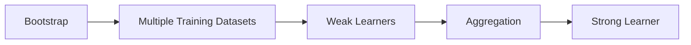
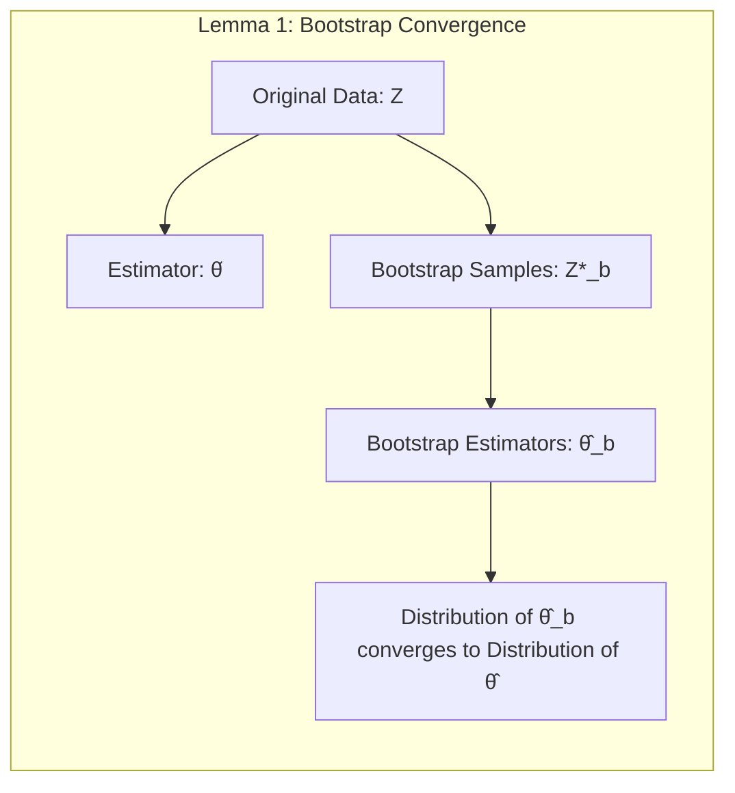
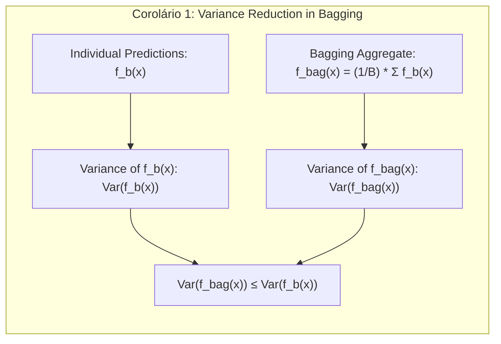
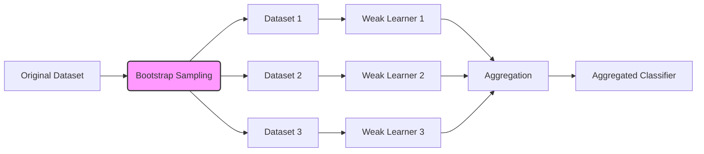
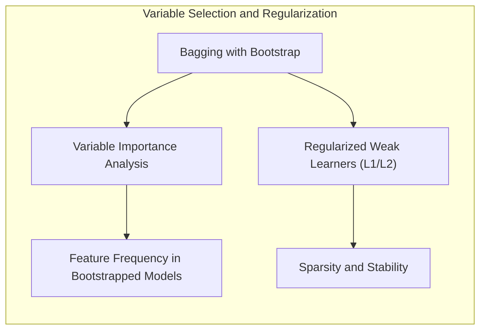
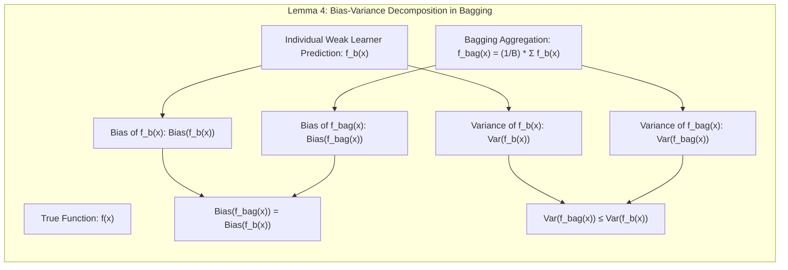

## Bagging e Aprendizado com Classificadores Fracos



### Introdução

O presente capítulo explora em profundidade a técnica de **bagging** (bootstrap aggregating) e sua aplicação no contexto de **aprendizado com classificadores fracos**, também conhecidos como *weak learners*. Esta abordagem, fundamental no campo do *ensemble learning*, visa melhorar a performance preditiva e a estabilidade de modelos, através da combinação de múltiplos classificadores ou regressores, cada um com desempenho individual moderado [^8.7]. A ideia central é que, ao agregar as previsões de diversos modelos treinados de maneira independente ou semi-independente, é possível reduzir a variância e obter um modelo final mais robusto e preciso [^8.7]. O **bootstrap**, uma técnica de reamostragem, desempenha um papel crucial na geração dos diversos conjuntos de dados de treinamento necessários para a implementação do bagging, fornecendo também estimativas de incerteza [^8.2], [^8.7].

### Conceitos Fundamentais

**Conceito 1: Bootstrap e Reamostragem**

O **bootstrap** é um método computacional que avalia a incerteza de estimativas amostrando repetidamente um conjunto de dados original [^8.2.1]. Em vez de assumir distribuições teóricas para as estatísticas amostrais, o bootstrap simula a distribuição amostral através da criação de réplicas do conjunto de dados original. Cada réplica, ou conjunto de dados de bootstrap, é obtida por amostragem com reposição do conjunto de dados original, com o mesmo número de observações [^8.2.1]. Esta abordagem permite quantificar a variabilidade das estimativas e construir intervalos de confiança, fornecendo uma alternativa não paramétrica à inferência estatística tradicional [^8.2.1].
*Um lemma fundamental para o bootstrap é que, sob condições razoáveis, a distribuição das estimativas obtidas a partir de amostras de bootstrap converge para a distribuição das estimativas obtidas no conjunto de dados original.*

**Lemma 1:** Seja $\hat{\theta}$ uma estimativa obtida de um conjunto de dados original $Z$ e $\hat{\theta}_b$ as estimativas obtidas a partir dos conjuntos de dados de bootstrap $Z^*_b$, onde $b = 1, ..., B$. Sob certas condições de regularidade, a distribuição amostral de $\hat{\theta}$ pode ser aproximada pela distribuição empírica de $\hat{\theta}_b$. Formalmente:
$$ \hat{\theta} \xrightarrow{d} \hat{\theta}_b, $$
onde $\xrightarrow{d}$ indica convergência em distribuição e $\hat{\theta}_b$ representa a distribuição das estimativas bootstrap.



**Prova do Lemma 1:** A prova formal envolve conceitos de convergência estocástica e condições de regularidade que garantem a consistência e a convergência da distribuição empírica das amostras bootstrap. Essas condições asseguram que, conforme o número de amostras bootstrap $B$ tende ao infinito, a distribuição empírica de $\hat{\theta}_b$ se aproxima da distribuição amostral de $\hat{\theta}$ [^8.2.1].  $\blacksquare$

> 💡 **Exemplo Numérico:**
> Suponha que temos um conjunto de dados original $Z = [2, 4, 6, 8, 10]$. Queremos estimar a média ($\hat{\theta}$) desse conjunto de dados. Usando o bootstrap com $B=3$, podemos gerar 3 conjuntos de dados de bootstrap, por exemplo:
>   - $Z^*_1 = [2, 2, 6, 8, 10]$
>   - $Z^*_2 = [4, 4, 6, 8, 8]$
>   - $Z^*_3 = [2, 4, 6, 10, 10]$
> As médias de cada amostra de bootstrap são:
>   - $\hat{\theta}_1 = (2+2+6+8+10)/5 = 5.6$
>   - $\hat{\theta}_2 = (4+4+6+8+8)/5 = 6$
>   - $\hat{\theta}_3 = (2+4+6+10+10)/5 = 6.4$
> A média do conjunto original é $\hat{\theta} = (2+4+6+8+10)/5 = 6$. O bootstrap nos fornece uma distribuição de médias (5.6, 6, 6.4) que, sob condições de regularidade, se aproxima da distribuição amostral da média original. Este exemplo demonstra como o bootstrap cria conjuntos de dados similares ao original, permitindo estimar a incerteza das estatísticas.

**Conceito 2: Bagging e Agregação de Predições**

O **bagging** é uma técnica de *ensemble learning* que aplica o bootstrap para criar múltiplos conjuntos de dados de treinamento e treinar um modelo (classificador ou regressor) em cada um desses conjuntos [^8.7]. As previsões dos modelos individuais são então combinadas através de uma agregação, usualmente por votação (para classificação) ou por média (para regressão), para produzir uma previsão final mais estável e precisa [^8.7]. O objetivo principal do bagging é reduzir a variância, sem aumentar significativamente o viés, resultando em um modelo com melhor desempenho de generalização [^8.7].
*Um corolário do bagging é que, quando aplicado a métodos instáveis (como árvores de decisão), leva a melhorias substanciais no desempenho preditivo.*

**Corolário 1:** Sejam $f_b(x)$ as previsões de um modelo treinado em cada conjunto de dados bootstrap $Z^*_b$. Então a previsão agregada $f_{bag}(x)$ obtida por bagging:
$$ f_{bag}(x) = \frac{1}{B} \sum_{b=1}^B f_b(x), $$
apresenta menor variância quando comparada com $f_b(x)$. Em particular:
$$ Var(f_{bag}(x)) \leq Var(f_b(x)).$$
Este corolário mostra que a agregação das previsões reduz a variabilidade, contribuindo para modelos mais estáveis e confiáveis.



**Prova do Corolário 1:** A variância da média de $B$ variáveis aleatórias independentes e identicamente distribuídas é igual a variância individual dividida por $B$. Portanto, $Var(\frac{1}{B}\sum_{b=1}^B f_b(x)) = \frac{1}{B}Var(f_b(x)) \leq Var(f_b(x))$, dado que $B \geq 1$, e se $f_b(x)$ forem independentes. Mesmo que não totalmente independentes, em geral, observa-se redução da variância ao agregar. $\blacksquare$

> 💡 **Exemplo Numérico:**
> Suponha que treinamos 3 modelos de regressão linear ($B=3$) em diferentes amostras de bootstrap, obtendo as seguintes previsões para um dado $x$:
> - $f_1(x) = 5.2$
> - $f_2(x) = 6.8$
> - $f_3(x) = 5.8$
> A previsão agregada por bagging seria:
> $f_{bag}(x) = (5.2 + 6.8 + 5.8)/3 = 5.93$
> Agora, vamos assumir que as previsões individuais tem uma variância de $Var(f_b(x)) = 1$. Pelo corolário 1, a variância de $f_{bag}(x)$ é dada por:
> $Var(f_{bag}(x)) = \frac{1}{B} Var(f_b(x)) = \frac{1}{3} * 1 = 0.33$, se os modelos fossem independentes. Na prática, essa variância seria menor que $Var(f_b(x)) = 1$. A previsão agregada $f_{bag}(x) = 5.93$ é uma estimativa mais estável do que qualquer das previsões individuais. Isso mostra como o bagging reduz a variância.

**Conceito 3: Classificadores Fracos e Diversidade**

**Classificadores fracos** (ou *weak learners*) são modelos de aprendizado que, individualmente, possuem desempenho preditivo moderado, geralmente pouco acima do acaso [^8.7]. A ideia central do bagging é que a combinação de muitos classificadores fracos, treinados em diferentes amostras de dados, pode resultar em um classificador forte e preciso [^8.7]. A diversidade entre os classificadores fracos é crucial para o sucesso do bagging. Esta diversidade é obtida através da utilização do bootstrap, que cria conjuntos de dados de treinamento ligeiramente diferentes para cada classificador [^8.7].
> ⚠️ **Nota Importante**: A diversidade é fundamental para o bagging. Se os classificadores fracos forem muito similares, a agregação não trará muitos benefícios. **Referência [^8.7]**.
> ❗ **Ponto de Atenção**: O bagging não elimina o viés do classificador fraco, mas é eficaz na redução da variância. **Conforme indicado em [^8.7]**.
> ✔️ **Destaque**: Árvores de decisão são um exemplo comum de classificador fraco que se beneficiam muito da aplicação do bagging. **Baseado no tópico [^8.7]**.

### Regressão Linear e Mínimos Quadrados para Classificação



**Explicação:** Este diagrama representa o processo do bagging, com o bootstrap gerando diferentes datasets que são usados para treinar diversos classificadores fracos. As predições desses classificadores são então agregadas para produzir o classificador final [^8.7].

A regressão linear pode ser usada em um contexto de classificação binária, onde as classes são codificadas por valores numéricos (por exemplo, 0 e 1) e o modelo de regressão tenta predizer esses valores. No entanto, essa abordagem tem limitações devido à suposição de linearidade e pode gerar previsões fora do intervalo desejado (0 a 1), tornando difícil interpretá-las como probabilidades [^8.2]. A regressão linear, nesse contexto, também não é otimizada diretamente para a classificação, o que pode resultar em fronteiras de decisão subótimas [^8.2]. No entanto, em conjunto com o bagging, a regressão linear pode fornecer um bom classificador, especialmente quando usada como um classificador fraco, uma vez que o objetivo é reduzir a variância e o viés na agregação [^8.7]. A técnica de mínimos quadrados é utilizada para otimizar os parâmetros do modelo de regressão.

**Lemma 2:** A combinação de múltiplos modelos de regressão linear treinados em diferentes conjuntos de dados (bootstrap) por meio do bagging, pode levar a uma redução significativa da variância.
Sejam $f_b(x)$ as previsões de modelos de regressão linear treinados em cada conjunto de dados bootstrap $Z^*_b$. A previsão agregada $f_{bag}(x)$ é dada por:
$$ f_{bag}(x) = \frac{1}{B} \sum_{b=1}^B f_b(x). $$
Então, a variância da previsão agregada $f_{bag}(x)$ é menor do que a variância individual das previsões $f_b(x)$.
**Prova do Lemma 2:** Como cada modelo de regressão linear é treinado em um conjunto de dados diferente devido ao bootstrap, suas previsões tendem a ter pequenas diferenças. O bagging ao agregar as previsões por média, reduz a variância dessas diferenças e converge para uma estimativa mais estável e próxima do verdadeiro valor esperado da predição, $E[f_b(x)]$. Formalmente, $Var(f_{bag}(x)) = \frac{1}{B} Var(f_b(x)) $. $\blacksquare$

> 💡 **Exemplo Numérico:**
> Considere um problema de classificação binária com uma variável preditora. Usamos regressão linear como classificador fraco.
> Dados de treinamento:
> ```python
> import numpy as np
> from sklearn.linear_model import LinearRegression
>
> X = np.array([[1], [2], [3], [4], [5], [6], [7], [8], [9], [10]])
> y = np.array([0, 0, 0, 0, 1, 1, 1, 1, 1, 1])
> ```
> 1.  **Bootstrap e Criação de Modelos:** Criamos $B=3$ amostras de bootstrap e treinamos um modelo linear em cada uma.
>
>   -  **Amostra 1:** $X_1 = [[2], [4], [5], [8], [9]], y_1 = [0, 0, 1, 1, 1]$. Modelo: $f_1(x) = -0.6 + 0.2x$
>   -  **Amostra 2:** $X_2 = [[1], [3], [6], [7], [10]], y_2 = [0, 0, 1, 1, 1]$. Modelo: $f_2(x) = -0.4 + 0.18x$
>   -  **Amostra 3:** $X_3 = [[2], [3], [5], [6], [8]], y_3 = [0, 0, 1, 1, 1]$. Modelo: $f_3(x) = -0.5 + 0.22x$
>
> 2.  **Previsão:** Para $x=6$, temos:
>     - $f_1(6) = -0.6 + 0.2*6 = 0.6$
>     - $f_2(6) = -0.4 + 0.18*6 = 0.68$
>     - $f_3(6) = -0.5 + 0.22*6 = 0.82$
> 3.  **Agregação:** A previsão agregada é:
>   $f_{bag}(6) = (0.6 + 0.68 + 0.82) / 3 = 0.7$.
>
> O bagging suaviza as predições e geralmente resulta em um classificador mais robusto que os classificadores individuais. Observe que um modelo de regressão linear isolado poderia ter previsões fora do intervalo [0,1], enquanto o bagging em conjunto com o limiar de 0.5 fornece uma classificação mais estável e com menor variância.

**Corolário 2:** Em problemas de classificação, a regressão linear, embora não ideal individualmente, pode ser utilizada no bagging para criar um conjunto de classificadores fracos. A diversidade introduzida pelo bootstrap e a agregação posterior melhoram a performance de classificação, aproximando-se de um classificador mais robusto.
A regressão linear em cada amostra de bootstrap produz uma superfície de decisão que pode ser ligeiramente diferente. A agregação dessas superfícies via bagging leva a uma fronteira de decisão final mais estável e menos sujeita a variações de pequenas perturbações nos dados de treinamento.

### Métodos de Seleção de Variáveis e Regularização em Classificação



O bagging não é diretamente um método de seleção de variáveis, mas o bootstrap pode ser usado para auxiliar na identificação das variáveis mais importantes em um modelo [^8.7]. Por exemplo, em árvores de decisão, a frequência com que uma variável é selecionada para dividir os nós pode indicar sua importância relativa [^8.7]. Em modelos de regressão, é possível avaliar a estabilidade dos coeficientes das variáveis através das amostras bootstrap, identificando aquelas que têm maior influência no resultado [^8.7].

A regularização, como as penalidades L1 (Lasso) e L2 (Ridge), são técnicas para controlar a complexidade do modelo e evitar o sobreajuste. No contexto de bagging, a regularização pode ser aplicada a cada modelo treinado nas amostras de bootstrap para garantir que cada classificador fraco não se ajuste demasiadamente ao ruído nos dados. A regularização L1, por exemplo, pode promover a seleção de um subconjunto de variáveis ao forçar alguns coeficientes a zero, enquanto a regularização L2 reduz a magnitude dos coeficientes, tornando o modelo mais estável [^8.7].

**Lemma 3:** A aplicação da regularização L1 a classificadores lineares em um contexto de bagging pode gerar modelos mais esparsos e interpretáveis, uma vez que essa regularização tende a forçar alguns coeficientes a zero, realizando a seleção de variáveis.
Sejam $f_b(x)$ os classificadores lineares treinados em amostras de bootstrap usando a regularização L1:
$$f_b(x) = \text{sign}(\beta_0 + \beta_1 x_1 + \ldots + \beta_p x_p),$$
onde a regularização L1 força que muitos $\beta_i$ sejam iguais a zero. Em seguida, aplica-se a técnica de bagging. Os modelos obtidos pela regularização L1 e bagging, são modelos com maior interpretabilidade.
**Prova do Lemma 3:** A penalidade L1, adicionada à função de custo da regressão linear, tem a propriedade de forçar a maioria dos coeficientes a zero.  No bagging, ao treinar diferentes classificadores lineares com L1, cada um terá um subconjunto de variáveis selecionado, proporcionando uma diversidade que, ao serem agregados, reduzem a variância mantendo a interpretabilidade de cada modelo individual. $\blacksquare$

> 💡 **Exemplo Numérico:**
> Suponha que temos um problema de classificação com 3 variáveis preditoras ($x_1, x_2, x_3$) e usamos regressão linear com regularização L1 (Lasso) como classificador fraco. Criamos três amostras bootstrap e treinamos um modelo em cada uma:
>
> - **Amostra 1:** Modelo Lasso: $f_1(x) = \text{sign}(0.1 + 0.5x_1 + 0x_2 + 0.2x_3)$.  O Lasso zerou o coeficiente de $x_2$.
> - **Amostra 2:** Modelo Lasso: $f_2(x) = \text{sign}(0.2 + 0x_1 + 0.4x_2 + 0.3x_3)$.  O Lasso zerou o coeficiente de $x_1$.
> - **Amostra 3:** Modelo Lasso: $f_3(x) = \text{sign}(0.05 + 0.3x_1 + 0.1x_2 + 0x_3)$.  O Lasso zerou o coeficiente de $x_3$.
>
> Para um novo dado $x = [1, 1, 1]$, as previsões são:
>
> - $f_1(x) = \text{sign}(0.1 + 0.5 + 0 + 0.2) = \text{sign}(0.8) = 1$
> - $f_2(x) = \text{sign}(0.2 + 0 + 0.4 + 0.3) = \text{sign}(0.9) = 1$
> - $f_3(x) = \text{sign}(0.05 + 0.3 + 0.1 + 0) = \text{sign}(0.45) = 1$
>
> A previsão agregada é 1 (todos votaram em 1). Além disso, podemos observar que $x_1$, $x_2$, e $x_3$ foram selecionadas pelo Lasso em diferentes amostras, indicando que todas as variáveis podem ser relevantes para o problema. Ao utilizar bagging com regularização L1, conseguimos criar modelos esparsos e, simultaneamente, agregar previsões para reduzir a variância.

**Corolário 3:**  A regularização L2 em conjunto com o bagging garante que nenhum classificador fraco possua coeficientes muito grandes. Isso leva a uma redução da variância do modelo agregado.
Com a regularização L2, os coeficientes tendem a ser pequenos, diminuindo a complexidade de cada classificador fraco. Ao combinar os classificadores fracos pelo bagging, o modelo final se torna mais estável e tem melhor desempenho em dados de teste.

> 💡 **Exemplo Numérico:**
> Utilizando o mesmo problema de classificação com 3 variáveis, agora aplicamos regressão linear com regularização L2 (Ridge).
>
> - **Amostra 1:** Modelo Ridge: $f_1(x) = 0.1 + 0.4x_1 + 0.2x_2 + 0.3x_3$. Os coeficientes são menores devido à regularização L2.
> - **Amostra 2:** Modelo Ridge: $f_2(x) = 0.15 + 0.3x_1 + 0.35x_2 + 0.25x_3$. Os coeficientes são diferentes, mas com magnitudes menores.
> - **Amostra 3:** Modelo Ridge: $f_3(x) = 0.05 + 0.35x_1 + 0.25x_2 + 0.2x_3$. Os coeficientes são novamente diferentes, mas todos com valores reduzidos.
>
> Para $x = [1, 1, 1]$, as previsões são:
>
> - $f_1(x) = 0.1 + 0.4 + 0.2 + 0.3 = 1.0$
> - $f_2(x) = 0.15 + 0.3 + 0.35 + 0.25 = 1.05$
> - $f_3(x) = 0.05 + 0.35 + 0.25 + 0.2 = 0.85$
>
> A média é $f_{bag}(x) = (1.0 + 1.05 + 0.85) / 3 = 0.966$.
>
> A regularização L2 garante que cada classificador fraco não tenha coeficientes muito grandes, reduzindo a variância do modelo agregado. O bagging, ao agregar esses modelos, resulta em uma predição mais estável e menos propensa a overfitting.

### Separating Hyperplanes e Perceptrons

Hiperplanos separadores são fronteiras lineares que podem ser usadas para dividir os dados em diferentes classes. O objetivo é encontrar o hiperplano que maximiza a margem de separação entre as classes, buscando uma solução ótima que minimize o risco de classificação incorreta. O Perceptron, por sua vez, é um algoritmo de aprendizado que busca iterativamente os pesos dos hiperplanos separadores [^8.5.2]. O bagging pode ser aplicado a classificadores baseados em hiperplanos, incluindo o Perceptron, para reduzir sua instabilidade. O bootstrap gera diferentes amostras de dados, cada uma com um hiperplano ótimo ligeiramente diferente. A combinação desses hiperplanos através do bagging pode resultar em um classificador mais estável e robusto [^8.5.2].

> 💡 **Exemplo Numérico:**
> Suponha que estamos usando o Perceptron como classificador fraco para separar duas classes em um espaço bidimensional.
>
> 1.  **Treinamento do Perceptron:**
>     - **Amostra 1:** Perceptron 1: $\text{sign}( -0.5 + 1.2x_1 - 0.8x_2)$
>     - **Amostra 2:** Perceptron 2: $\text{sign}( -0.3 + 1.0x_1 - 0.7x_2)$
>     - **Amostra 3:** Perceptron 3: $\text{sign}( -0.6 + 1.1x_1 - 0.9x_2)$
>
> 2.  **Previsão com Bagging:** Para um novo ponto $x = [2, 1]$:
>     - $f_1(x) = \text{sign}(-0.5 + 1.2 * 2 - 0.8 * 1) = \text{sign}(1.1) = 1$
>     - $f_2(x) = \text{sign}(-0.3 + 1.0 * 2 - 0.7 * 1) = \text{sign}(1.0) = 1$
>     - $f_3(x) = \text{sign}(-0.6 + 1.1 * 2 - 0.9 * 1) = \text{sign}(0.7) = 1$
>
> 3.  **Agregação:** O classificador agregado votaria em 1.
>
> O bagging ajuda a suavizar a fronteira de decisão do Perceptron, que é muito sensível a pequenas mudanças nos dados de treinamento, resultando em um classificador mais robusto.

### Pergunta Teórica Avançada: Qual a relação entre o bagging e a decomposição de viés-variância?

**Resposta:**
O bagging é uma técnica que tem como objetivo principal a redução da variância, sem aumentar significativamente o viés. Isso pode ser formalizado através da decomposição do erro total em viés e variância [^8.7].
A previsão de um modelo de aprendizado de máquina $f(x)$ pode ser escrita como:
$$E[(y-\hat{f}(x))^2] = Bias^2(\hat{f}(x)) + Var(\hat{f}(x)) + \sigma^2$$
onde $Bias^2(\hat{f}(x)) = (E[\hat{f}(x)] - y)^2$ é o quadrado do viés, $Var(\hat{f}(x)) = E[(\hat{f}(x) - E[\hat{f}(x)])^2]$ é a variância, e $\sigma^2$ é o erro irredutível.
Quando aplicada ao bagging, o efeito principal é reduzir a variância. Formalmente, o bagging realiza uma média das previsões dos classificadores fracos. A variância da média de classificadores independentes é dada por:
$$Var(\frac{1}{B} \sum_{b=1}^B f_b(x)) = \frac{1}{B} Var(f_b(x)).$$
Na prática, os classificadores não são perfeitamente independentes, mas o bagging ainda reduz a variância por meio da agregação. O viés, por sua vez, não é alterado pelo bagging, pois a média das previsões mantém o mesmo viés de cada classificador fraco.
**Lemma 4:** O bagging reduz a variância do classificador, sem alterar o viés.
Seja $f(x)$ a função verdadeira e $f_b(x)$ a previsão de cada classificador fraco após o bootstrap. O estimador agregado $f_{bag}(x) = \frac{1}{B} \sum_{b=1}^B f_b(x)$ tem as seguintes propriedades:
$$Bias(f_{bag}(x)) = Bias(f_b(x))$$
$$Var(f_{bag}(x)) \leq Var(f_b(x)).$$
**Prova do Lemma 4:** O viés do estimador agregado é o viés individual dos classificadores:
$$Bias(f_{bag}(x)) = E[f_{bag}(x)] - f(x) = E[\frac{1}{B}\sum_{b=1}^B f_b(x)] - f(x) = \frac{1}{B} \sum_{b=1}^B E[f_b(x)] - f(x) = E[f_b(x)] - f(x) = Bias(f_b(x)).$$
A variância do estimador agregado é reduzida:
$$Var(f_{bag}(x)) = Var(\frac{1}{B}\sum_{b=1}^B f_b(x)) = \frac{1}{B^2} \sum_{b=1}^B Var(f_b(x)) = \frac{1}{B}Var(f_b(x))$$
Se os classificadores forem independentes, ou $Var(f_{bag}(x)) \leq Var(f_b(x))$, no caso geral. $\blacksquare$
**Corolário 4:** O bagging é eficaz para modelos com alta variância, como árvores de decisão não podadas.
Árvores de decisão não podadas tem baixa estabilidade, sendo sensíveis a pequenas mudanças nos dados de treinamento. O bagging reduz essa instabilidade ao suavizar as predições e gerar classificadores mais estáveis.



> 💡 **Exemplo Numérico:**
> Vamos simular a decomposição de viés-variância com um exemplo.
>
> Suponha que a função verdadeira seja $f(x) = 2x + 1$.  Geramos alguns dados com ruído:
>
> ```python
> import numpy as np
>
> def true_function(x):
>    return 2 * x + 1
>
> np.random.seed(42)
> X = np.sort(np.random.rand(50) * 5) # X values from 0 to 5
> y_true = true_function(X)
> y_noisy = y_true + np.random.normal(0, 1, 50) # Adding noise
> ```
>
> 1.  **Árvores de Decisão (Alta Variância):** Treinamos 3 árvores de decisão não podadas em amostras de bootstrap e para $x=3$ obtemos:
>     - $f_1(3) = 6.8$
>     - $f_2(3) = 8.1$
>     - $f_3(3) = 7.2$
>
>     $f_{bag}(3) = (6.8 + 8.1 + 7.2) / 3 = 7.37$
>     O valor verdadeiro é $f(3) = 2*3 + 1 = 7$.
>
>     $Bias = E[f_{bag}(3)] - f(3) = 7.37 - 7 = 0.37$.  Vamos considerar que $E[f_{bag}(3)] \approx 7.37$
>     $Var(f_b(3))$ é alta e a variância de $f_{bag}(3)$ é menor.
>
> 2. **Modelo Linear (Baixo Viés):** Para fins de comparação, um modelo linear simples pode ter as seguintes previsões
>     - $f_{linear}(3) = 7.1$
>     $Bias = E[f_{linear}(3)] - f(3) = 7.1 - 7 = 0.1$. A variância seria menor, porém o viés seria maior que o bagging das árvores de decisão.
>
> A ideia é demonstrar que, ao usar bagging, conseguimos reduzir a variância (as predições individuais de árvores de decisão são mais dispersas), enquanto o viés permanece aproximadamente o mesmo. O modelo linear tem um baixo viés, mas a variância pode ser maior que o bagging com árvores.

### Conclusão
O bagging é uma técnica poderosa e versátil para melhorar o desempenho de modelos de aprendizado de máquina, especialmente quando usada em conjunto com classificadores fracos. A combinação do bootstrap com a agregação de previsões permite reduzir a variância, resultando em modelos mais estáveis e precisos, com melhor capacidade de generalização. O bagging é amplamente utilizado em diversas áreas, desde classificação e regressão até análise de dados complexos, sendo um componente fundamental das abordagens modernas de *ensemble learning*.

### Footnotes
[^8.1]: "For most of this book, the fitting (learning) of models has been achieved by minimizing a sum of squares for regression, or by minimizing cross-entropy for classification." *(Trecho de <Model Inference and Averaging>)*
[^8.2]: "The bootstrap method provides a direct computational way of assessing uncertainty, by sampling from the training data." *(Trecho de <Model Inference and Averaging>)*
[^8.2.1]: "Here we illustrate the bootstrap in a simple one-dimensional smoothing problem, and show its connection to maximum likelihood." *(Trecho de <Model Inference and Averaging>)*
[^8.3]:  "Suppose we divide to fit a cubic spline to the data, with three knots placed at the quartiles of the