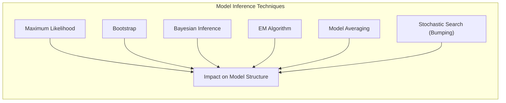
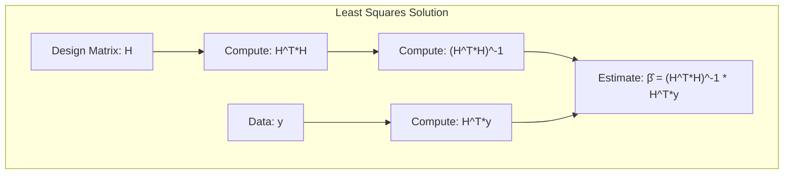
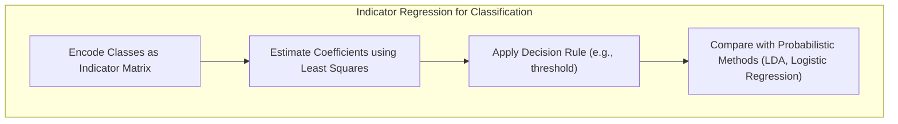
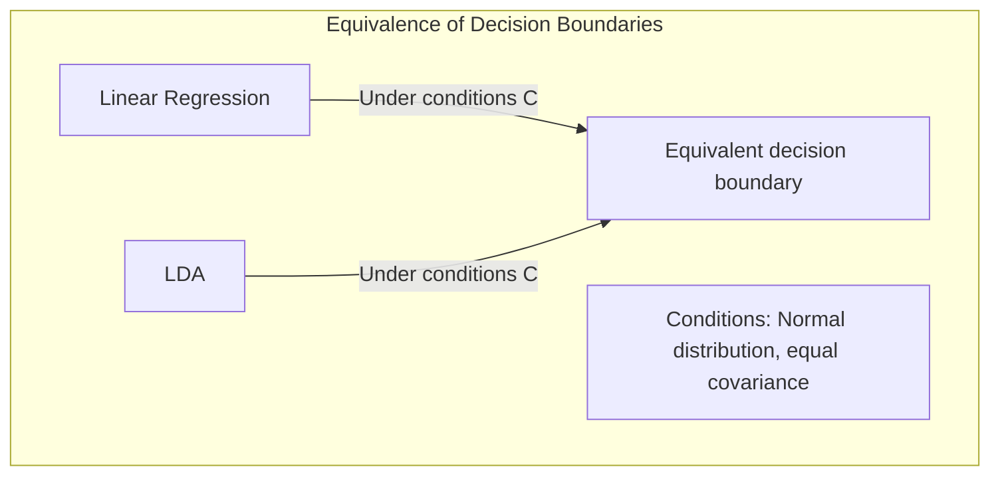
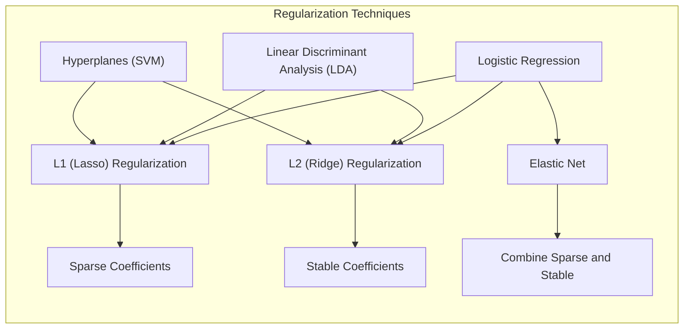
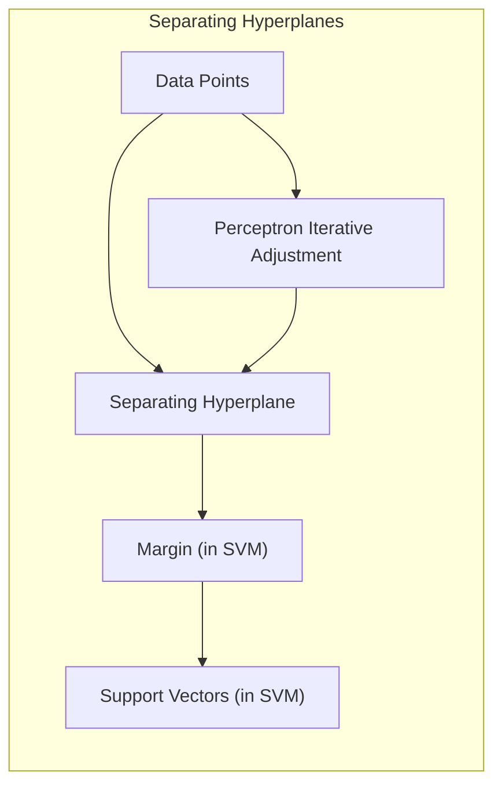
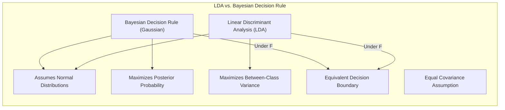
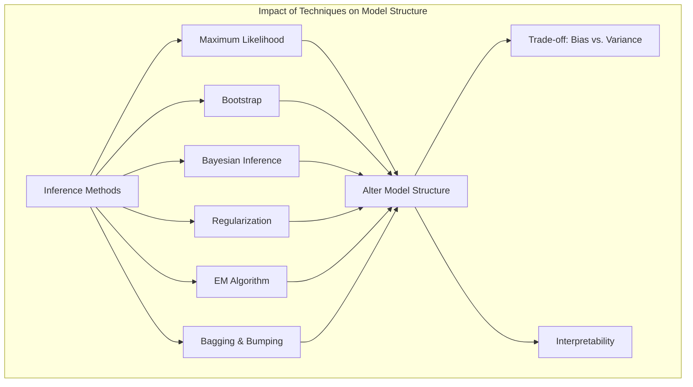

## Model Inference and Averaging: Loss of Model Structure

<imagem: Mapa mental conectando Bootstrap, Maximum Likelihood, Bayesian Inference, EM Algorithm e Model Averaging, destacando como cada técnica pode afetar a estrutura original do modelo.>

### Introdução

A construção de modelos estatísticos geralmente envolve um equilíbrio delicado entre complexidade e interpretabilidade. Métodos como **maximum likelihood** [^8.1], **bootstrap** [^8.2], e **inferência Bayesiana** [^8.3] são ferramentas poderosas para ajuste e análise de modelos, mas seu uso pode levar à perda da estrutura original do modelo. Este capítulo explora como essas técnicas afetam a estrutura dos modelos, especialmente quando aplicadas em contextos de inferência, estimação de parâmetros e **model averaging** [^8.8]. Examinaremos o impacto de **stochastic search** [^8.9] via bumping e como abordagens como o **EM algorithm** [^8.5] influenciam a complexidade final do modelo, com exemplos que ilustram os trade-offs envolvidos. Exploraremos, também, como as propriedades de um modelo podem ser alteradas ao longo do processo, resultando em uma representação que, embora possa apresentar melhor performance preditiva, carece de interpretabilidade direta em relação à sua formulação inicial.

### Conceitos Fundamentais

Para compreender como a estrutura do modelo pode ser afetada, é essencial definir alguns conceitos fundamentais.

**Conceito 1:** O problema da classificação e da regressão muitas vezes envolve a otimização de funções de perda [^8.1], como **sum of squares** para regressão ou **cross-entropy** para classificação. O objetivo é encontrar os parâmetros que minimizem essas funções, resultando em um modelo que se ajusta aos dados disponíveis. A utilização de abordagens lineares, como **linear regression** ou **linear discriminant analysis**, pode introduzir vieses específicos, mas também pode simplificar a interpretação. Métodos como o **least squares** [^8.2] estimam os parâmetros do modelo minimizando a soma dos erros quadráticos, enquanto o **maximum likelihood estimation** procura os parâmetros que maximizam a verossimilhança dos dados observados [^8.2.2]. O **bootstrap** [^8.2.1] oferece uma forma de avaliar a incerteza dessas estimativas através de reamostragem dos dados. Em um problema de *smoothing* simples, por exemplo, o bootstrap pode gerar réplicas do modelo, cada uma com pequenas variações, permitindo avaliar a incerteza das predições [^8.2.1]. A escolha entre abordagens lineares e não-lineares, e entre métodos que buscam a máxima verossimilhança ou a minimização do erro quadrático, influencia tanto o viés quanto a variância do modelo final, com o **trade-off** entre essas medidas ditando a estrutura e a interpretabilidade do modelo.

> 💡 **Exemplo Numérico:** Considere um problema de regressão linear onde temos dados com uma variável independente $x$ e uma variável dependente $y$. Os dados são: $x = [1, 2, 3, 4, 5]$ e $y = [2.1, 3.9, 6.1, 8.3, 9.8]$. Usando o método de mínimos quadrados, o objetivo é encontrar os parâmetros $\beta_0$ (intercepto) e $\beta_1$ (inclinação) que minimizem a soma dos erros quadráticos. Podemos usar a fórmula matricial $\hat{\beta} = (H^TH)^{-1}H^Ty$, onde $H$ é a matriz de design.  A matriz de design $H$ é:
>
> $$ H = \begin{bmatrix} 1 & 1 \\ 1 & 2 \\ 1 & 3 \\ 1 & 4 \\ 1 & 5 \end{bmatrix} $$
>
> E o vetor $y$ é:
>
> $$ y = \begin{bmatrix} 2.1 \\ 3.9 \\ 6.1 \\ 8.3 \\ 9.8 \end{bmatrix} $$
>
> Calculando $H^TH$:
>
> $$ H^TH = \begin{bmatrix} 5 & 15 \\ 15 & 55 \end{bmatrix} $$
>
> Calculando a inversa $(H^TH)^{-1}$:
>
> $$ (H^TH)^{-1} = \begin{bmatrix} 1.1 & -0.3 \\ -0.3 & 0.1 \end{bmatrix} $$
>
> Calculando $H^Ty$:
>
> $$ H^Ty = \begin{bmatrix} 30.2 \\ 121.5 \end{bmatrix} $$
>
> Finalmente, calculando $\hat{\beta}$:
>
> $$ \hat{\beta} = (H^TH)^{-1}H^Ty = \begin{bmatrix} 1.1 & -0.3 \\ -0.3 & 0.1 \end{bmatrix} \begin{bmatrix} 30.2 \\ 121.5 \end{bmatrix} = \begin{bmatrix} 0.17 \\ 1.97 \end{bmatrix} $$
>
> Assim, o modelo linear estimado é $y = 0.17 + 1.97x$.  Este exemplo demonstra como os parâmetros são estimados usando mínimos quadrados, minimizando a soma dos erros quadráticos entre os valores observados de $y$ e os valores preditos pelo modelo. Um modelo linear simples, como este, pode ser facilmente interpretado, mas sua estrutura linear pode não ser adequada para dados mais complexos.

**Lemma 1:** Em modelos lineares ajustados por mínimos quadrados, a solução para os parâmetros $\beta$ pode ser expressa como $\hat{\beta} = (H^TH)^{-1}H^Ty$, onde $H$ é a matriz de design e $y$ é o vetor de respostas [^8.2]. Este resultado tem profundas implicações na estrutura do modelo, pois demonstra que as estimativas dos parâmetros são uma combinação linear das respostas observadas.

$$
    \hat{\beta} = (H^TH)^{-1}H^Ty
$$

Essa solução é fundamental para entender como os dados afetam as estimativas dos parâmetros e como as decisões de classe são formadas, especialmente quando aplicado a matrizes de indicadores, conforme mencionado em [^8.2]. $\blacksquare$

**Conceito 2:** A **Linear Discriminant Analysis (LDA)** [^4.3] é um método de classificação que busca projetar os dados em um subespaço de menor dimensão, maximizando a separação entre as classes [^4.3.1]. A LDA assume que os dados em cada classe seguem uma distribuição normal com covariâncias iguais [^4.3]. As fronteiras de decisão geradas pela LDA são lineares, o que simplifica a interpretação do modelo, mas pode não ser suficiente para dados complexos com interações não-lineares entre as variáveis [^4.3.2]. A estrutura da LDA é tal que o discriminante linear é obtido através da maximização da razão de *between-class variance* para *within-class variance*, o que leva a um espaço projetado no qual as classes estão melhor separadas. A forma exata da fronteira de decisão depende das médias e covariâncias de cada classe [^4.3.3].

> 💡 **Exemplo Numérico:** Suponha que temos duas classes de dados, com médias $\mu_1 = [1, 1]$ e $\mu_2 = [3, 3]$, e uma matriz de covariância comum $\Sigma = \begin{bmatrix} 1 & 0.5 \\ 0.5 & 1 \end{bmatrix}$.  O vetor de pesos $w$ no discriminante linear da LDA é dado por $w = \Sigma^{-1}(\mu_1 - \mu_2)$. Primeiro, calculamos $(\mu_1 - \mu_2) = [-2, -2]$.
>
> A inversa da matriz de covariância é:
>
> $$ \Sigma^{-1} = \frac{1}{(1*1 - 0.5*0.5)} \begin{bmatrix} 1 & -0.5 \\ -0.5 & 1 \end{bmatrix} = \frac{4}{3} \begin{bmatrix} 1 & -0.5 \\ -0.5 & 1 \end{bmatrix} = \begin{bmatrix} 1.33 & -0.67 \\ -0.67 & 1.33 \end{bmatrix} $$
>
> Agora, calculamos o vetor de pesos:
>
> $$ w = \begin{bmatrix} 1.33 & -0.67 \\ -0.67 & 1.33 \end{bmatrix} \begin{bmatrix} -2 \\ -2 \end{bmatrix} = \begin{bmatrix} -1.32 \\ -1.32 \end{bmatrix} $$
>
> O intercepto $b$ dependerá das probabilidades a priori de cada classe. Se assumirmos que as classes são equiprováveis, o intercepto é determinado pela média das projeções das médias de classe no vetor $w$. Este exemplo demonstra como a estrutura da LDA depende das médias e covariâncias das classes, levando a um discriminante linear que maximiza a separação entre as classes.

**Corolário 1:** O discriminante linear da LDA, denotado como $f(x) = w^Tx + b$, pode ser expresso em termos das médias de classe ($\mu_k$) e da matriz de covariância comum ($Σ$) através de $w = Σ^{-1}(\mu_1 - \mu_2)$. O intercepto $b$ depende das probabilidades a priori das classes e das médias de classe [^4.3.1]. Este corolário demonstra como a estrutura do discriminante linear é diretamente ligada às propriedades estatísticas dos dados e como a escolha de um modelo linear impõe certas restrições na representação dos dados.

**Conceito 3:** A **Logistic Regression** [^4.4] é outro método de classificação, que modela a probabilidade de pertencimento a uma classe através de uma função logística [^4.4.1]. Ao contrário da LDA, a Logistic Regression não assume a normalidade dos dados, usando, ao invés disso, o *logit* para modelar a probabilidade de pertencimento à classe positiva [^4.4.2]. A otimização dos parâmetros na Logistic Regression é feita por meio da maximização da verossimilhança [^4.4.3], o que pode levar a estimativas diferentes das obtidas pela LDA. A escolha da Logistic Regression, em vez da LDA, pode ser mais adequada para problemas onde as premissas da LDA não são satisfeitas, mas impõe também um formato diferente para a fronteira de decisão. A capacidade da Logistic Regression de lidar com casos onde as classes não são balanceadas é uma vantagem sobre a LDA em certas aplicações [^4.4.4], juntamente com o uso de técnicas de regularização como L1 e L2 para lidar com multicolinearidade e reduzir a complexidade do modelo [^4.4.5].

> 💡 **Exemplo Numérico:** Considere um problema de classificação binária com duas variáveis preditoras $x_1$ e $x_2$, e uma variável de resposta $y \in \{0, 1\}$. Após o treinamento de um modelo de regressão logística, obtivemos os seguintes coeficientes: $\beta_0 = -2$, $\beta_1 = 1.5$, e $\beta_2 = 0.8$. A probabilidade de um dado $x = [x_1, x_2]$ pertencer à classe 1 é dada por:
>
> $$ P(y=1|x) = \frac{1}{1 + e^{-(\beta_0 + \beta_1 x_1 + \beta_2 x_2)}} $$
>
> Para o ponto $x = [1, 2]$, temos:
>
> $$ P(y=1|x=[1,2]) = \frac{1}{1 + e^{-(-2 + 1.5(1) + 0.8(2))}} = \frac{1}{1 + e^{-(-2 + 1.5 + 1.6)}} = \frac{1}{1 + e^{-1.1}} \approx 0.75 $$
>
>  Este resultado significa que para esse ponto específico, a regressão logística estima uma probabilidade de aproximadamente 75% de pertencimento à classe 1.  Se a probabilidade estimada for maior que 0.5, geralmente classificamos a observação como pertencente à classe 1. A estrutura da regressão logística é tal que ela mapeia os valores preditores através de uma função sigmoide, o que permite modelar probabilidades de pertencimento à classe.

> ⚠️ **Nota Importante**: A aplicação de **regularização** na Logistic Regression, através de penalidades L1 ou L2, leva a modelos mais simples com coeficientes menores ou até mesmo zerados, alterando a estrutura do modelo para favorecer interpretabilidade e generalização. **Referência ao tópico [^4.4.4]**.

> ❗ **Ponto de Atenção**: Em cenários de classes não balanceadas, a Logistic Regression é mais robusta, pois a abordagem do *logit* lida melhor com as diferenças na cardinalidade das classes do que o método da LDA, que é mais sensível ao balanceamento das classes. **Conforme indicado em [^4.4.2]**.

> ✔️ **Destaque**: Apesar das diferenças na formulação, a LDA e a Logistic Regression são frequentemente semelhantes na prática quando aplicadas a problemas de classificação linear. Os coeficientes estimados por ambos os métodos são relacionados, especialmente quando os dados seguem as premissas da LDA. **Baseado no tópico [^4.5]**.

### Regressão Linear e Mínimos Quadrados para Classificação

<imagem: Diagrama com Mermaid mostrando o fluxo de regressão de indicadores para classificação, ligando codificação de classes, estimação de coeficientes via mínimos quadrados, aplicação de regra de decisão e comparação com métodos probabilísticos.>

A **regressão linear** pode ser aplicada para classificação através da codificação das classes em uma matriz de indicadores [^8.2]. Cada classe é representada por uma coluna na matriz, com 1 indicando pertencimento e 0 caso contrário. O modelo de regressão linear é então ajustado usando mínimos quadrados [^8.2]. Embora essa abordagem possa ser usada para encontrar uma fronteira de decisão linear, ela apresenta algumas limitações. As estimativas dos parâmetros podem extrapolar fora do intervalo [0, 1], o que dificulta a interpretação como probabilidade. Além disso, a regressão linear não considera a covariância entre as classes, o que pode levar a resultados subótimos, como o “masking problem” [^4.3]. Para ilustrar isso, considere um cenário de classificação binária onde a regressão linear, ao invés de produzir uma função discriminante que separa as classes diretamente, cria um ajuste contínuo, cujo limiar é usado como regra de decisão. Essa abordagem pode funcionar bem se a resposta for aproximadamente linear nos dados, mas quando há comportamentos não lineares, ou quando classes estão sobrepostas ou mal balanceadas, a aplicação direta da regressão linear pode levar a classificações incorretas e a perda de estrutura em relação aos discriminantes lineares da LDA ou da Logistic Regression.

> 💡 **Exemplo Numérico:** Considere um problema de classificação binária com duas classes (0 e 1) e uma única variável preditora $x$. Temos os seguintes dados:
>
> | x   | y |
> | --- | - |
> | 1   | 0 |
> | 2   | 0 |
> | 3   | 1 |
> | 4   | 1 |
> | 5   | 1 |
>
> Codificando as classes como 0 e 1, ajustamos um modelo de regressão linear: $\hat{y} = \beta_0 + \beta_1 x$. Usando o método dos mínimos quadrados, podemos encontrar os parâmetros $\beta_0$ e $\beta_1$. Após os cálculos, obtemos aproximadamente $\hat{\beta_0} = -0.6$ e $\hat{\beta_1} = 0.4$.  Portanto, o modelo de regressão linear para classificação é: $\hat{y} = -0.6 + 0.4x$. Para classificar novos dados, podemos usar um limiar de 0.5; se $\hat{y} \geq 0.5$, classificamos como classe 1, caso contrário como classe 0. Por exemplo, para $x = 2$, temos $\hat{y} = -0.6 + 0.4(2) = 0.2$, que seria classificado como 0, e para $x = 4$, temos $\hat{y} = -0.6 + 0.4(4) = 1.0$, que seria classificado como 1. Apesar de funcionar para esses dados, a regressão linear não garante que os valores preditos $\hat{y}$ estarão sempre entre 0 e 1, o que dificulta sua interpretação como probabilidade. Além disso, essa abordagem não considera a estrutura de classes como a LDA ou Logistic Regression fazem.

**Lemma 2:** Em certas condições, as projeções nos hiperplanos de decisão geradas por regressão linear e discriminantes lineares são equivalentes. Especificamente, quando as classes têm covariâncias iguais e uma distribuição normal, a regressão linear, se usada para a tarefa de classificação, produz uma fronteira de decisão idêntica à LDA [^4.2].

$$ \text{Fronteira LDA} \equiv \text{Fronteira Regressão Linear (em condições específicas)}$$

**Corolário 2:** Este resultado implica que, em certas situações, o uso da regressão linear em vez da LDA não levará a uma perda de desempenho, e, na verdade, pode simplificar a análise e implementação do modelo. No entanto, essa equivalência depende de suposições que nem sempre se aplicam aos dados do mundo real [^4.3]. A derivação da equivalência entre os dois métodos ressalta a íntima ligação entre as abordagens de regressão e classificação linear quando as premissas são satisfeitas.

"Em alguns cenários, conforme apontado em [^4.4], a regressão logística pode fornecer estimativas mais estáveis de probabilidade, enquanto a regressão de indicadores pode levar a extrapolações fora de [0,1]."

"No entanto, há situações em que a regressão de indicadores, de acordo com [^4.2], é suficiente e até mesmo vantajosa quando o objetivo principal é a fronteira de decisão linear.”

### Métodos de Seleção de Variáveis e Regularização em Classificação

<imagem: Mapa mental mostrando como a regularização conecta LDA, Logistic Regression e Hyperplanes, destacando o uso de penalizações L1 e L2 e Elastic Net em contextos de classificação.>

A seleção de variáveis e a regularização são técnicas importantes para lidar com modelos complexos e evitar *overfitting*. Na Logistic Regression, a **penalização L1** [^4.4.4] (Lasso) promove a esparsidade dos coeficientes, levando a modelos mais simples e interpretáveis, pois alguns coeficientes são zerados [^4.5]. A **penalização L2** (Ridge) reduz os valores dos coeficientes, aumentando a estabilidade do modelo e prevenindo multicolinearidade [^4.5.1]. A combinação de ambas, conhecida como **Elastic Net**, aproveita as vantagens de ambas as penalidades [^4.5]. No contexto de LDA, regularização pode ser aplicada através da regularização da matriz de covariância, ou usando técnicas similares para induzir esparsidade nos discriminantes. Regularização introduz um *trade-off* entre viés e variância.

> 💡 **Exemplo Numérico:** Suponha que temos um problema de classificação com Logistic Regression e três variáveis preditoras: $x_1$, $x_2$ e $x_3$. Sem regularização, o modelo poderia ser:
> $$ \text{logit}(p) = -0.5 + 1.2x_1 + 0.9x_2 - 0.7x_3 $$
>
> Agora, aplicamos a regularização L1 (Lasso), onde um parâmetro $\lambda$ controla a força da penalidade. Após o ajuste, o modelo pode se tornar:
> $$ \text{logit}(p) = -0.3 + 0.8x_1 + 0.2x_2 + 0x_3 $$
>
> Observe que o coeficiente de $x_3$ foi zerado, indicando que essa variável foi considerada menos importante pelo modelo. Isso simplifica o modelo e o torna mais interpretável.  Agora, vamos usar a regularização L2 (Ridge). O modelo ajustado pode ter os seguintes parâmetros:
>
>  $$ \text{logit}(p) = -0.4 + 0.9x_1 + 0.6x_2 - 0.4x_3 $$
>
>  Perceba que os coeficientes são menores em magnitude do que no modelo original, mas nenhum é zerado. L2 tende a reduzir a magnitude, sem zerar os coeficientes. Usando Elastic Net, podemos obter uma combinação de L1 e L2, que pode gerar um modelo onde algumas variáveis são eliminadas (coeficiente igual a zero), enquanto os coeficientes das variáveis restantes são reduzidos. A escolha entre L1, L2 ou Elastic Net dependerá do objetivo de cada problema e da natureza das variáveis preditoras.

**Lemma 3:** A penalização L1 em classificação logística leva a coeficientes esparsos devido à forma do problema de otimização, que inclui um termo de penalidade proporcional à soma dos valores absolutos dos coeficientes. A otimização desse problema leva a soluções onde alguns coeficientes são exatamente zero [^4.4.4].

**Prova do Lemma 3:** O problema de otimização com penalização L1 pode ser expresso como:
$$
    \hat{\beta} = \arg\max_{\beta} \left( \sum_{i=1}^N \left[ y_i \log(p_i) + (1-y_i) \log(1-p_i) \right] - \lambda \sum_{j=1}^p |\beta_j| \right)
$$
O termo $\lambda \sum_{j=1}^p |\beta_j|$ incentiva soluções com muitos $\beta_j$ iguais a zero, dado que o valor absoluto introduz não diferenciabilidade na origem, empurrando algumas estimativas de parâmetros para zero. Isso contrasta com a penalização L2, que apenas reduz o tamanho dos coeficientes sem zerá-los completamente [^4.4.3]. $\blacksquare$

**Corolário 3:** A esparsidade dos coeficientes resultante da penalização L1 melhora a interpretabilidade dos modelos classificatórios, pois identifica as variáveis mais relevantes para a decisão, simplificando a estrutura do modelo e auxiliando no entendimento do problema [^4.4.5].

> ⚠️ **Ponto Crucial**: L1 e L2 podem ser combinadas (Elastic Net) para aproveitar vantagens de ambos os tipos de regularização. A Elastic Net é útil quando há multicolinearidade nos dados e a esparsidade da L1 é desejada, combinada com a estabilidade da L2. **Conforme discutido em [^4.5]**.

### Separating Hyperplanes e Perceptrons

A ideia de **separating hyperplanes** busca encontrar uma superfície linear que divida os dados em diferentes classes de forma ótima. O conceito de maximização da margem de separação leva à formulação de um problema de otimização, que é resolvido, no caso dos **Support Vector Machines** (SVMs), através do uso do dual de Wolfe. A solução é expressa como uma combinação linear dos **support vectors**, ou seja, os pontos mais próximos da fronteira de decisão [^4.5.2]. O **Perceptron de Rosenblatt** [^4.5.1] é um algoritmo mais simples para encontrar hiperplanos separadores, que converge sob certas condições de linear separabilidade. A estrutura do perceptron é tal que os pesos do discriminante são iterativamente ajustados até que todos os pontos de treino sejam corretamente classificados, assumindo que existe uma solução linear. Tanto o método dos hiperplanos de máxima margem (SVMs) quanto o Perceptron, tentam encontrar uma fronteira de decisão linear, mas diferem na forma de realizar essa tarefa. A escolha de um desses métodos sobre outros pode ser feita com base no tipo de problema, linearidade dos dados, e nos objetivos de cada tarefa.

> 💡 **Exemplo Numérico:** Suponha que temos um conjunto de dados bidimensional e queremos separá-los em duas classes usando um Perceptron. Inicializamos os pesos $w$ com valores aleatórios (e.g., $w = [0.1, -0.2]$) e o bias $b$ como zero. O perceptron é definido por $\hat{y} = sign(w^Tx + b)$, onde sign(z) é 1 se z > 0 e -1 se z <= 0. O Perceptron itera sobre os pontos de dados:
>
> 1. **Ponto de dados (1, 2) com rótulo +1:**
>    - Previsão inicial: $\hat{y} = sign(0.1 * 1 - 0.2 * 2 + 0) = sign(-0.3) = -1$.
>    - Como a previsão está errada, atualizamos os pesos: $w_{novo} = w_{antigo} + \alpha * y * x$, onde $\alpha$ é a taxa de aprendizado (e.g., $\alpha = 0.1$).
>   - $w_{novo} = [0.1, -0.2] + 0.1 * 1 * [1, 2] = [0.2, 0]$.
>   - Atualizamos o bias $b$ também: $b_{novo} = b_{antigo} + \alpha * y = 0 + 0.1 * 1 = 0.1$.
>
> 2. **Ponto de dados (3, 1) com rótulo -1:**
>   - Previsão inicial: $\hat{y} = sign(0.2 * 3 + 0 * 1 + 0.1) = sign(0.7) = 1$.
>  -  Como a previsão está errada, atualizamos os pesos: $w_{novo} = [0.2, 0] + 0.1 * -1 * [3, 1] = [-0.1, -0.1]$.
>   -  Atualizamos o bias $b$: $b_{novo} = 0.1 + 0.1 * -1 = 0$.
>
> Esse processo continua até que todos os dados sejam corretamente classificados.  Ao longo das iterações, a estrutura do Perceptron (os pesos e bias) é ajustada de forma a encontrar um hiperplano que separa as classes.

### Pergunta Teórica Avançada: Quais as diferenças fundamentais entre a formulação de LDA e a Regra de Decisão Bayesiana considerando distribuições Gaussianas com covariâncias iguais?

**Resposta:**

A **Regra de Decisão Bayesiana** com distribuições Gaussianas assume que as classes seguem distribuições normais e atribui cada observação à classe com a maior probabilidade *a posteriori* [^4.3]. Quando as covariâncias são iguais, a Regra Bayesiana leva a uma fronteira de decisão linear, similar à LDA. A LDA, por sua vez, busca diretamente uma projeção linear que maximize a separabilidade das classes, baseando-se em uma estimativa das médias e covariâncias. Sob a premissa de covariâncias iguais, as fronteiras de decisão resultantes dos dois métodos são equivalentes, sendo a LDA um caso particular da Regra de Decisão Bayesiana [^4.3.3].

**Lemma 4:** Quando as distribuições das classes são Gaussianas com covariâncias iguais, o discriminante linear da LDA, quando derivado da maximização da razão *between-class variance* e *within-class variance*, é equivalente ao discriminante obtido através da Regra de Decisão Bayesiana [^4.3].
$$ \text{Discriminante LDA} \equiv \text{Discriminante Bayesiano (covariâncias iguais)}$$

**Corolário 4:** Ao relaxar a hipótese de covariâncias iguais, a Regra Bayesiana leva a fronteiras quadráticas (QDA), pois a forma do discriminante passa a ser uma função quadrática da variável de entrada [^4.3]. Isso demonstra que a estrutura do modelo de decisão é diretamente afetada pelas suposições sobre as covariâncias das classes.

> ⚠️ **Ponto Crucial**: A adoção ou não de covariâncias iguais impacta fortemente o tipo de fronteira de decisão (linear vs. quadrática). A escolha entre LDA e QDA depende da adequação da suposição de covariâncias iguais aos dados. **Conforme discutido em [^4.3.1]**.

As perguntas devem ser altamente relevantes, **avaliar a compreensão profunda de conceitos teóricos-chave**, podem envolver derivações matemáticas e provas, e focar em análises teóricas.

### Conclusão

Neste capítulo, exploramos como diferentes técnicas de inferência e modelagem podem alterar a estrutura dos modelos estatísticos. Vimos que métodos como o bootstrap, maximum likelihood, e inferência Bayesiana oferecem ferramentas para ajuste e análise de modelos, mas podem simplificar ou alterar a complexidade da estrutura original. A discussão sobre o trade-off entre viés e variância, e sobre a importância da regularização na busca por modelos generalizáveis, demonstra como o uso dessas técnicas exige uma compreensão aprofundada de suas implicações. Métodos como o EM algorithm, e técnicas como bagging e bumping, também impactam a estrutura do modelo, com bagging e bumping atuando na variância e estabilidade dos modelos, enquanto o EM algorithm se concentra na estimação de parâmetros em problemas de incomplete data. Ao longo do texto, ficou claro que, ao construir e ajustar modelos, é fundamental considerar não apenas a performance preditiva, mas também o impacto nas propriedades originais e a interpretabilidade da estrutura do modelo.

### Footnotes

[^8.1]: "For most of this book, the fitting (learning) of models has been achieved by minimizing a sum of squares for regression, or by minimizing cross-entropy for classification. In fact, both of these minimizations are instances of the maximum likelihood approach to fitting." *(Trecho de <Model Inference and Averaging>)*
[^8.2]: "In this chapter we provide a general exposition of the maximum likeli- hood approach, as well as the Bayesian method for inference. The boot- strap, introduced in Chapter 7, is discussed in this context, and its relation to maximum likelihood and Bayes is described. Finally, we present some related techniques for model averaging and improvement, including com- mittee methods, bagging, stacking and bumping." *(Trecho de <Model Inference and Averaging>)*
[^8.3]: "In the Bayesian approach to inference, we specify a sampling model Pr(Z|0) (density or probability mass function) for our data given the parameters, and a prior distribution for the parameters Pr(0) reflecting our knowledge about @ before we see the data." *(Trecho de <Model Inference and Averaging>)*
[^8.2.1]: "The bootstrap method provides a direct computational way of assessing uncertainty, by sampling from the training data. Here we illustrate the bootstrap in a simple one-dimensional smoothing problem, and show its connection to maximum likelihood." *(Trecho de <Model Inference and Averaging>)*
[^8.2.2]: "Maximum likelihood is based on the likelihood function, given by L(0; Z) = Π  g0(zi), the probability of the observed data under the model ge." *(Trecho de <Model Inference and Averaging>)*
[^4.3]:  "Linear discriminant analysis (LDA) is a method for classifying data into groups (classes). It is a linear method for which the decision boundaries are straight