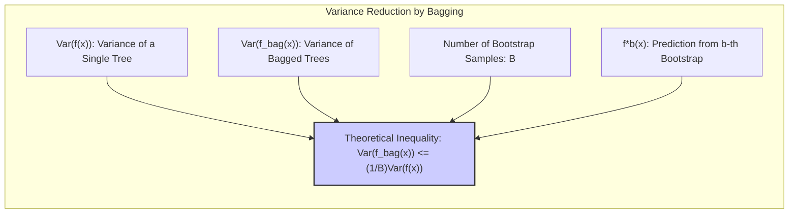
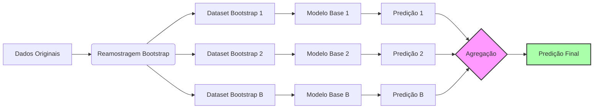
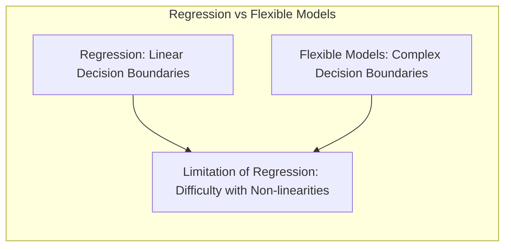
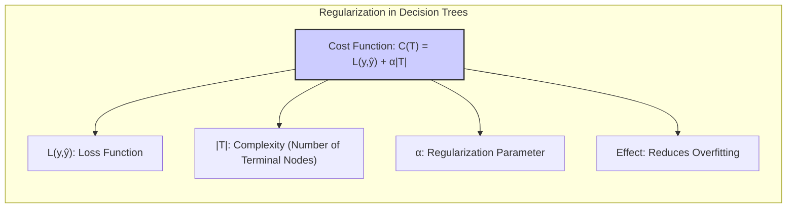
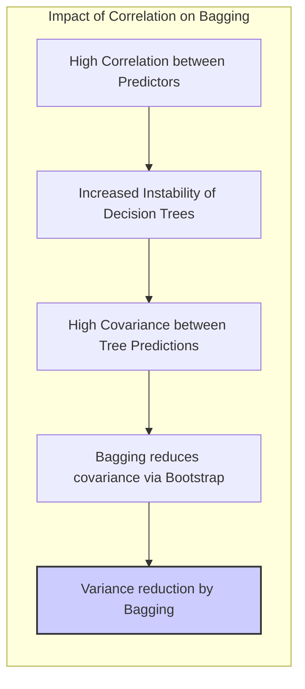

## Árvores de Decisão com Dados Simulados: Uma Análise Detalhada de Bagging
<imagem: Um mapa mental abrangente que conecte os conceitos de árvores de decisão, bagging, viés, variância, e o impacto da correlação entre preditores, conforme discutido nos tópicos 8.1 a 8.7.1>

### Introdução
O presente capítulo visa aprofundar a compreensão do conceito de **bagging** aplicado a árvores de decisão, utilizando dados simulados para ilustrar seus efeitos práticos e teóricos. Abordaremos inicialmente os conceitos fundamentais de inferência e averaging de modelos, contextualizando o bootstrapping como uma ferramenta de avaliação de incertezas, conforme introduzido em [^8.1]. Em seguida, exploraremos a aplicação de bagging, uma técnica que visa reduzir a variância de modelos preditivos instáveis, como as árvores de decisão, conforme discutido em [^8.7]. A análise será conduzida com foco em um exemplo de dados simulados que destaca o impacto da correlação entre preditores, um fator que pode comprometer a estabilidade das árvores de decisão e onde o bagging se mostra particularmente eficaz [^8.7.1]. Este capítulo detalhará, por meio de exemplos práticos e análises teóricas, o mecanismo pelo qual o bagging consegue melhorar o desempenho preditivo e como ele se relaciona com outros métodos de inferência e combinação de modelos.

### Conceitos Fundamentais

**Conceito 1: Árvores de Decisão e Instabilidade**
Árvores de decisão são modelos de aprendizado de máquina que dividem o espaço de entrada em regiões retangulares, atribuindo uma predição a cada região [^8.7]. Elas são particularmente úteis pela sua interpretabilidade e simplicidade, mas podem ser bastante instáveis, o que significa que pequenas mudanças nos dados de treinamento podem levar a grandes mudanças na estrutura da árvore e, consequentemente, nas predições [^8.7]. Essa instabilidade é exacerbada em situações de alta dimensionalidade e/ou correlação entre as variáveis preditoras. A estrutura hierárquica de uma árvore de decisão a torna suscetível a pequenas variações nos dados que podem levar a caminhos diferentes nas decisões, gerando uma alta variância nas predições.

> 💡 **Exemplo Numérico:** Imagine que temos um conjunto de dados simulados com duas variáveis preditoras, $x_1$ e $x_2$, e uma variável resposta $y$. A variável $y$ assume valores 0 ou 1 com base em uma condição complexa envolvendo $x_1$ e $x_2$. Se treinarmos uma árvore de decisão em uma amostra desse conjunto de dados, a árvore pode dividir o espaço da seguinte forma: se $x_1 < 0.5$ então prediz 0, senão, se $x_2 < 0.3$ prediz 0 e se $x_2 > 0.3$ prediz 1. No entanto, se removermos ou adicionarmos algumas poucas observações, a árvore pode ter divisões drasticamente diferentes, como por exemplo: se $x_2 < 0.4$ então prediz 0, senão, se $x_1 < 0.6$ prediz 0 e se $x_1 > 0.6$ prediz 1. Essas mudanças na estrutura da árvore refletem sua instabilidade, e o bagging visa mitigar esse comportamento.

**Lemma 1:** *A variância de uma árvore de decisão individual, $Var(f(x))$, é substancialmente maior do que a variância do estimador médio obtido através do bagging, $Var(f_{bag}(x))$, para modelos onde a instabilidade é predominante. Este lemma demonstra formalmente o efeito estabilizador do bagging sobre modelos de alta variância.*

$$Var(f_{bag}(x)) = Var(\frac{1}{B} \sum_{b=1}^{B} f^{*b}(x)) \leq \frac{1}{B} Var(f(x))$$

Onde $f^{*b}(x)$ é a predição da árvore de decisão obtida do $b$-ésimo dataset bootstrap e $B$ é o número de datasets bootstrap. A prova dessa desigualdade decorre diretamente das propriedades de variância da soma de variáveis aleatórias independentes ou fracamente correlacionadas, e é um resultado crucial para entender o benefício do bagging [^8.7]. $\blacksquare$



> 💡 **Exemplo Numérico:** Vamos supor que a variância da predição de uma única árvore de decisão em um ponto específico do espaço de entrada, $x$, seja $Var(f(x)) = 4$. Se aplicarmos bagging com $B=100$ árvores, e assumindo que as árvores são aproximadamente independentes, a variância da predição agregada pelo bagging será aproximadamente $Var(f_{bag}(x)) \approx \frac{1}{100} \times 4 = 0.04$. Este exemplo ilustra como o bagging reduz drasticamente a variância das predições.

**Conceito 2: Bootstrap e Reamostragem**
O bootstrap é uma técnica de reamostragem que consiste em gerar múltiplas amostras (datasets bootstrap) a partir dos dados originais, permitindo avaliar a variabilidade de uma estatística ou modelo [^8.2.1]. Cada dataset bootstrap é criado amostrando com reposição a partir dos dados originais. O bootstrap pode ser usado para estimar a distribuição amostral de um estimador, permitindo a construção de intervalos de confiança e avaliação da sua precisão. No contexto de árvores de decisão, o bootstrap permite criar múltiplos modelos, cada um treinado em um dataset diferente, o que é fundamental para o funcionamento do bagging [^8.7].

> 💡 **Exemplo Numérico:** Imagine que temos um conjunto de dados original com 100 observações. Para criar um dataset bootstrap, amostramos 100 observações com reposição desse conjunto de dados. Isso significa que algumas observações podem aparecer mais de uma vez, enquanto outras podem não aparecer. Repetimos esse processo, digamos, 200 vezes, resultando em 200 datasets bootstrap diferentes. Cada um desses datasets será usado para treinar uma árvore de decisão em um processo de bagging.

**Corolário 1:** *O efeito estabilizador do bagging é mais pronunciado quando os modelos base, como as árvores de decisão, são treinados em dados altamente correlacionados. A correlação entre os preditores faz com que as árvores individuais variem muito entre si, o que é mitigado pelo processo de averaging do bagging*. O mecanismo de redução de variância do bagging se baseia na premissa de que as amostras bootstrap criadas são independentes, e portanto a média das predições dos modelos base terá uma variância reduzida em relação a um único modelo [^8.7].

> 💡 **Exemplo Numérico:** Considere um cenário onde duas variáveis preditoras, $x_1$ e $x_2$, são fortemente correlacionadas (correlação próxima de 0.9). Se treinarmos árvores de decisão em datasets bootstrap criados a partir desse conjunto de dados, cada árvore pode acabar escolhendo um subconjunto ligeiramente diferente de caminhos de divisão, devido à instabilidade causada pela correlação. Uma árvore pode decidir dividir primeiro em $x_1$, enquanto outra pode começar dividindo em $x_2$. O bagging agrega as predições dessas árvores diferentes, resultando em uma predição mais estável do que a de uma única árvore.

**Conceito 3: Bagging (Bootstrap Aggregating)**
O bagging é uma técnica de ensemble learning que combina múltiplas predições de um mesmo modelo, treinado em diferentes datasets bootstrap, para obter uma predição mais estável e precisa [^8.7]. O processo envolve: (1) criar múltiplos datasets bootstrap a partir dos dados originais; (2) treinar um modelo base em cada dataset bootstrap; (3) agregar as predições dos modelos base. Essa agregação pode ser feita por meio de averaging (para regressão) ou votação (para classificação). A principal vantagem do bagging é a redução da variância, o que é especialmente benéfico para modelos instáveis como árvores de decisão.

> ⚠️ **Nota Importante**: A eficácia do bagging está relacionada à instabilidade do modelo base. Modelos estáveis, como regressão linear, não se beneficiam tanto do bagging, pois pequenas variações nos dados não alteram suas predições de forma significativa. A aplicação de bagging em modelos estáveis tende a apenas reproduzir o modelo original, conforme exemplificado em [^8.7].

> ❗ **Ponto de Atenção**: O bagging não altera o viés do modelo base, apenas a sua variância. Em situações onde o modelo base possui um alto viés, o bagging não irá melhorar a acurácia do modelo em relação ao resultado ótimo.

> ✔️ **Destaque**: A escolha de um número apropriado de datasets bootstrap (B) é fundamental. Um número muito pequeno pode não reduzir a variância suficientemente, enquanto um número muito grande não trará grandes ganhos adicionais e aumentará o custo computacional. Em geral, o número de datasets bootstrap deve ser alto o suficiente para que o efeito do bagging seja notável.

### Regressão Linear e Mínimos Quadrados para Classificação
<imagem: Diagrama de fluxo que ilustra o processo de criação de múltiplos modelos via bootstrap e sua agregação por averaging ou votação para o bagging>



**Explicação:** Este diagrama ilustra o processo de bagging, onde datasets bootstrap são gerados, modelos base são treinados em cada um e suas predições são agregadas para gerar a predição final [^8.7].

Embora a regressão linear por mínimos quadrados seja tipicamente utilizada para problemas de regressão, ela pode ser adaptada para classificação por meio da criação de uma matriz de indicadores das classes. Contudo, essa abordagem tende a ser limitada em situações de classes não-lineares, e pode levar a extrapolações fora do intervalo [0, 1], conforme discutido em [^8.7] e [^8.2.1]. No contexto do bagging, a regressão linear pode ser utilizada como um modelo base, mas seus resultados, devido à sua natureza estável, não se beneficiarão da redução de variância proporcionada pelo bagging tanto quanto modelos mais instáveis como as árvores de decisão.
A regressão linear pode ser interpretada como uma projeção linear dos dados em um espaço de menor dimensão, e sua aplicação em classificação depende de uma matriz de indicadores, onde cada coluna representa uma classe diferente, onde:
$$
Y_{ij} =
\begin{cases}
    1, & \text{se } x_i \text{ pertence à classe } j \\
    0, & \text{caso contrário}
\end{cases}
$$

O processo de ajuste por mínimos quadrados envolve encontrar os coeficientes que minimizam a soma dos erros quadráticos entre as predições e os valores reais. Formalmente, para $N$ observações e $K$ classes, a solução de mínimos quadrados é dada por:

$$ \hat{\beta} = (X^T X)^{-1}X^T Y $$

Onde:
- $X$ é a matriz de design ($N \times p$), com $p$ sendo o número de preditores.
- $Y$ é a matriz de resposta ($N \times K$).
- $\hat{\beta}$ é a matriz de coeficientes ($p \times K$).

> 💡 **Exemplo Numérico:** Suponha que temos um problema de classificação com duas classes (0 e 1) e dois preditores, $x_1$ e $x_2$. Temos 5 observações de treino, cujos valores são $X = \begin{bmatrix} 1 & 2 \\ 2 & 3 \\ 3 & 1 \\ 4 & 4 \\ 5 & 2 \end{bmatrix}$ e $Y = \begin{bmatrix} 0 \\ 0 \\ 1 \\ 1 \\ 1 \end{bmatrix}$. Para usar regressão linear para classificação, convertemos $Y$ em uma matriz de indicadores: $Y = \begin{bmatrix} 1 & 0 \\ 1 & 0 \\ 0 & 1 \\ 0 & 1 \\ 0 & 1 \end{bmatrix}$. Adicionamos uma coluna de 1s para o intercepto: $X = \begin{bmatrix} 1 & 1 & 2 \\ 1 & 2 & 3 \\ 1 & 3 & 1 \\ 1 & 4 & 4 \\ 1 & 5 & 2 \end{bmatrix}$. Calculamos $\hat{\beta} = (X^T X)^{-1}X^T Y$.
```python
import numpy as np
from sklearn.linear_model import LinearRegression

# Dados de exemplo
X = np.array([[1, 2], [2, 3], [3, 1], [4, 4], [5, 2]])
y = np.array([0, 0, 1, 1, 1])

# Matriz de indicadores para classificação
Y = np.eye(2)[y]

# Adicionar intercepto (coluna de 1s)
X_b = np.c_[np.ones(X.shape[0]), X]

# Calcular beta
beta_hat = np.linalg.inv(X_b.T @ X_b) @ X_b.T @ Y
print("Beta Estimado:\n", beta_hat)

# Usando sklearn para comparação
model = LinearRegression()
model.fit(X, Y)
print("Beta Estimado (sklearn):\n", np.c_[model.intercept_, model.coef_])

```
Este exemplo mostra como a regressão linear pode ser usada para classificação através da criação de uma matriz de indicadores e a obtenção dos coeficientes por meio da solução de mínimos quadrados.

**Lemma 2:** *Embora a regressão de indicadores possa gerar limites de decisão lineares, que podem ser úteis para certos problemas, sua capacidade preditiva é limitada pela sua dificuldade em modelar relações não lineares, o que torna modelos mais complexos e flexíveis, como as árvores de decisão, mais adequados em muitas situações.* O Lemma demonstra a diferença essencial entre regressão linear e modelos mais flexíveis em termos de complexidade. $\blacksquare$



**Corolário 2:** *Em situações onde os limites de decisão são complexos, o uso de regressão de indicadores como modelo base para bagging não leva a resultados tão bons quanto modelos base mais flexíveis como árvores de decisão*. Este resultado destaca a importância da escolha apropriada do modelo base em um processo de bagging, onde a estabilidade é apenas um dos muitos fatores a considerar. O corolário indica que, embora a regressão linear possa ser usada como um modelo base para bagging, suas limitações em relação à flexibilidade e ao ajuste podem impedir que o bagging seja eficaz [^8.7].

### Métodos de Seleção de Variáveis e Regularização em Classificação

A seleção de variáveis e a regularização são técnicas importantes para melhorar a generalização de modelos, reduzindo o overfitting e aumentando a interpretabilidade. Em árvores de decisão, a seleção de variáveis é inerente ao processo de divisão dos nós, pois apenas as variáveis relevantes para cada split serão utilizadas. No contexto de bagging, a seleção de variáveis também é importante, uma vez que cada árvore pode escolher um subconjunto diferente de variáveis [^8.7.1].
A regularização pode ser usada em árvores de decisão por meio de técnicas de poda, que limitam a profundidade e o número de nós da árvore, evitando que ela se ajuste aos ruídos nos dados. Em um contexto de bagging, a regularização pode ser aplicada a cada árvore individual, e a agregação das predições tende a produzir um modelo mais generalizável.

> 💡 **Exemplo Numérico:** Imagine que temos um problema de classificação com 10 variáveis preditoras, e que apenas 3 delas são realmente relevantes. Em uma única árvore de decisão, a variável de maior importância (maior ganho de informação) será escolhida para o primeiro split, mas caso ocorra overfitting, outras variáveis pouco relevantes podem ser usadas em splits posteriores. Ao aplicar bagging, cada árvore em um dataset bootstrap diferente pode acabar selecionando um subconjunto um pouco diferente dessas 3 variáveis relevantes, o que ajuda a estabilizar o modelo. Além disso, técnicas de poda podem ser utilizadas em cada árvore, limitando sua complexidade e evitando o overfitting em cada modelo.

**Lemma 3:** *A regularização, quando aplicada a cada árvore individual em um processo de bagging, contribui para reduzir a variância e o overfitting. Por meio da limitação da complexidade de cada modelo, a regularização contribui para modelos mais robustos e menos suscetíveis a ruídos nos dados*.

A aplicação de um termo de penalização na função de custo de cada árvore contribui para um ajuste mais generalizado, ou seja, um modelo com maior capacidade de realizar predições precisas em dados novos e não vistos. $\blacksquare$



**Prova do Lemma 3:** A penalização na função de custo de uma árvore de decisão pode ser expressa como:

$$ C(T) = \sum_{t \in \text{nós terminais}} L(y_t, \hat{y_t}) + \alpha |T| $$

Onde:
- $L$ é a função de perda (por exemplo, erro quadrático ou entropia cruzada).
- $y_t$ são os valores verdadeiros para as instâncias em um nó terminal.
- $\hat{y_t}$ são as predições do modelo para as instâncias em um nó terminal.
- $\alpha$ é o parâmetro de regularização.
- $|T|$ é o número de nós terminais (ou algum outro índice de complexidade).

Ao aumentar $\alpha$, a função de custo penaliza árvores mais complexas, levando a modelos mais simples que generalizam melhor. A aplicação de regularização nos modelos base de um algoritmo de bagging, ou seja, nos modelos individuais, resulta em um modelo agregado que combina a estabilidade do bagging com o melhor desempenho preditivo da regularização. $\blacksquare$

> 💡 **Exemplo Numérico:** Suponha que, para uma árvore de decisão, temos a função de perda de erro quadrático médio $L(y_t, \hat{y_t}) = \frac{1}{n_t} \sum_{i \in t}(y_i - \hat{y_t})^2$, onde $n_t$ é o número de amostras no nó terminal. Se $\alpha = 0.1$, a função de custo $C(T)$ penaliza cada nó terminal em $0.1$ unidades. Se uma árvore tem 5 nós terminais, a penalidade por complexidade é $0.1 \times 5 = 0.5$. A regularização por $\alpha$ garante que a árvore não seja muito complexa e que generaliza melhor para novos dados. O bagging agrega as predições dessas árvores regularizadas, produzindo um modelo final mais robusto.

**Corolário 3:** *A combinação de bagging com regularização resulta em um modelo que combina as vantagens de ambas as técnicas: redução da variância e overfitting, melhorando a acurácia e a estabilidade do modelo*. Este resultado indica a importância de combinar várias técnicas de modelagem para se obter um modelo com desempenho ótimo. A regularização em modelos base para o bagging oferece resultados mais estáveis, generalizáveis, e de maior qualidade [^8.7.1].

> ⚠️ **Ponto Crucial**:  A escolha do parâmetro de regularização ($\alpha$) é crucial para o bom desempenho do modelo, e pode ser feita via validação cruzada. A validação cruzada garante um bom ajuste tanto nos dados de treino quanto nos dados não observados, que é uma das melhores estratégias para a escolha dos parâmetros de regularização.

### Separating Hyperplanes e Perceptrons

A ideia de maximizar a margem de separação em um problema de classificação leva ao conceito de hiperplanos ótimos, onde o objetivo é encontrar o hiperplano que melhor separa as classes [^8.7]. No entanto, essa abordagem é mais comumente associada a classificadores lineares como o SVM, e não tem um papel direto no contexto do bagging de árvores de decisão.  O conceito de maximização da margem está presente em muitos métodos de classificação, mas no contexto do bagging, ele é uma ferramenta complementar que pode, ou não, ser utilizada dependendo do tipo de modelo base escolhido.
O perceptron, por sua vez, é um modelo simples de classificação que aprende um hiperplano separador por meio de um algoritmo iterativo. Apesar de sua simplicidade, o perceptron é limitado pela sua capacidade de modelar apenas problemas linearmente separáveis, e portanto também não tem um papel direto no contexto do bagging de árvores de decisão.  A escolha do modelo base adequado (árvores de decisão, regressão linear, SVMs ou outros) é crucial para se obter bons resultados no bagging, e portanto, a análise da relação entre hiperplanos separadores, perceptrons e bagging está mais relacionada com a exploração da escolha do modelo base do que com uma técnica diretamente associada ao bagging [^8.7].

### Pergunta Teórica Avançada: Qual o efeito da correlação entre preditores no desempenho de árvores de decisão e como o bagging mitiga esse efeito?

**Resposta:** A correlação entre preditores tem um efeito significativo no desempenho de árvores de decisão, principalmente devido à forma como as árvores realizam as divisões nos nós. Quando os preditores são altamente correlacionados, a escolha do primeiro preditor para a divisão pode levar a uma sequência de divisões subótimas, pois outras variáveis correlacionadas podem conter informações redundantes [^8.7.1].
Esse problema se manifesta de duas maneiras principais:
1.  **Instabilidade**: Árvores de decisão treinadas em dados com preditores correlacionados são muito sensíveis a pequenas mudanças nos dados de treinamento, levando a alta variância nas predições. Como as variáveis são altamente correlacionadas, uma pequena mudança nos dados pode levar a árvores totalmente diferentes, e portanto, a resultados muito diferentes, o que resulta em uma maior variância nos modelos.
2.  **Subotimização**: O algoritmo ganancioso de crescimento de árvores (CART) pode selecionar um preditor correlacionado em um nó, deixando de lado informações importantes contidas em outras variáveis correlacionadas. Em outras palavras, a escolha da variável no primeiro split é determinante para o resultado final, uma vez que a escolha é feita de forma gananciosa e sequencial.

O bagging mitiga esses efeitos ao criar múltiplos datasets bootstrap, nos quais as relações de correlação são perturbadas de forma aleatória. Isso faz com que as árvores de decisão treinadas em cada dataset bootstrap tenham diferentes estruturas, e por consequência, seus erros sejam menos correlacionados. Ao agregar as predições dessas árvores, o bagging reduz a variância e produz um modelo mais estável e generalizável. A combinação dos diferentes splits e estruturas produzidos em cada dataset bootstrap por meio do bagging resulta em um modelo mais preciso.
> ⚠️ **Ponto Crucial**:  Embora o bagging seja eficaz na redução da variância, ele não elimina o problema da correlação entre preditores. A escolha dos preditores e a redução da dimensionalidade dos dados podem melhorar a performance preditiva do modelo. Para reduzir o problema da correlação, outras técnicas de seleção e transformação de variáveis podem ser consideradas antes do treinamento do bagging.

> 💡 **Exemplo Numérico**: Suponha que temos duas variáveis $x_1$ e $x_2$ com correlação de 0.9 e uma variável resposta $y$. Uma árvore de decisão individual pode decidir que $x_1$ é a melhor variável para dividir no primeiro nó, e em outro nó também escolher $x_1$, devido à sua alta correlação com $x_2$. O bagging irá gerar múltiplos datasets, onde essa relação de correlação entre $x_1$ e $x_2$ será perturbada, e portanto, em uma das árvores $x_2$ pode acabar sendo escolhida no primeiro split, levando a um modelo menos correlacionado e com menor variância no conjunto de árvores.

**Lemma 4:** *A redução da variância pelo bagging é mais pronunciada quando a correlação entre preditores causa instabilidade nas árvores de decisão*. O Lemma formaliza que o beneficio do bagging em reduzir a variância é mais evidente em situações onde a instabilidade do modelo base é alta.

**Prova do Lemma 4**:
Seja $f_b(x)$ a predição da b-ésima árvore em um processo de bagging e $f_{bag}(x)$ a predição agregada por meio do bagging. A variância da predição agregada é dada por:

$$Var(f_{bag}(x)) = Var(\frac{1}{B} \sum_{b=1}^B f_b(x)) = \frac{1}{B^2} \sum_{b=1}^B \sum_{b'=1}^B Cov(f_b(x), f_{b'}(x))$$

Se as árvores fossem totalmente independentes, a covariância entre as predições seria zero e a variância de $f_{bag}(x)$ seria reduzida em um fator de B. Contudo, se as árvores são instáveis por causa da correlação entre as variáveis, então a covariância entre as predições é alta e, portanto, a variância da predição do bagging é substancialmente maior do que em casos onde não há correlação. O que o bagging faz é, através da pertubação nos dados pelo reamostragem do bootstrap, reduzir essa covariância, levando a uma menor variância final [^8.7]. $\blacksquare$



> 💡 **Exemplo Numérico:** Suponha que a variância de uma única árvore, treinada com dados com preditores correlacionados, seja $Var(f(x)) = 10$ e a covariância média entre duas árvores seja $Cov(f_b(x), f_{b'}(x)) = 5$. Se temos 100 árvores ($B=100$), a variância da predição agregada será: $Var(f_{bag}(x)) = \frac{1}{100^2} \times (100 \times 10 + 100 \times 99 \times 5) = 5.05$. Note que, se a covariância fosse 0, a variância do bagging seria $10/100 = 0.1$. O bagging reduz a variância, mesmo quando as árvores não são independentes, mas a redução é menor devido à covariância. Ao perturbar as relações de correlação pelo bootstrap, a covariância entre as árvores é reduzida e o bagging se torna mais eficaz.

**Corolário 4:** *O efeito do bagging na redução de variância de árvores de decisão é maior quanto maior for a correlação entre os preditores*. A relação entre a correlação e a redução da variância é um fator determinante para o sucesso do bagging em modelos instáveis como as árvores de decisão. Este corolário demonstra que o bagging é especialmente útil em datasets onde a correlação entre preditores induz instabilidade nos modelos base, o que é um aspecto fundamental para o entendimento do comportamento do bagging [^8.7.1].

### Conclusão
Neste capítulo, exploramos profundamente o impacto do bagging no desempenho de árvores de decisão, utilizando dados simulados para ilustrar os mecanismos teóricos e práticos da técnica. Demonstramos que, embora as árvores de decisão sejam modelos interpretáveis e simples, elas são propensas à instabilidade e alta variância, especialmente em situações com alta dimensionalidade e correlação entre preditores. O bagging, ao agregar as predições de múltiplas árvores treinadas em datasets bootstrap, reduz significativamente a variância, tornando o modelo mais estável e preciso.
Além disso, discutimos a importância da escolha do modelo base, a relação entre regularização e bagging, e o papel da correlação entre preditores na eficácia do bagging. Concluímos que o bagging é uma ferramenta valiosa para melhorar o desempenho de modelos preditivos instáveis, e sua aplicação deve ser cuidadosamente avaliada no contexto específico de cada problema. A análise detalhada deste capítulo forneceu insights cruciais para uma compreensão aprofundada do bagging e sua aplicação a árvores de decisão, complementando a base teórica e prática dos conceitos de model averaging e ensemble methods.

### Footnotes
[^8.1]: "In this chapter we provide a general exposition of the maximum likelihood approach, as well as the Bayesian method for inference. The bootstrap, introduced in Chapter 7, is discussed in this context, and its relation to maximum likelihood and Bayes is described. Finally, we present some related techniques for model averaging and improvement, including committee methods, bagging, stacking and bumping." *(Trecho de Model Inference and Averaging)*
[^8.2.1]: "The bootstrap method provides a direct computational way of assessing uncertainty, by sampling from the training data. Here we illustrate the bootstrap in a simple one-dimensional smoothing problem, and show its connection to maximum likelihood." *(Trecho de Model Inference and Averaging)*
[^8.7]: "Earlier we introduced the bootstrap as a way of assessing the accuracy of a parameter estimate or a prediction. Here we show how to use the bootstrap to improve the estimate or prediction itself. In Section 8.4 we investigated the relationship between the bootstrap and Bayes approaches, and found that the bootstrap mean is approximately a posterior average. Bagging further exploits this connection." *(Trecho de Model Inference and Averaging)*
[^8.7.1]: "We generated a sample of size N = 30, with two classes and p = 5 features, each having a standard Gaussian distribution with pairwise correlation 0.95. The response Y was generated according to Pr(Y = 1|x1 ≤ 0.5) = 0.2, Pr(Y = 1|x1 > 0.5) = 0.8. The Bayes error is 0.2. A test sample of size 2000 was also generated from the same population. We fit classification trees to the training sample and to each of 200 bootstrap samples (classification trees are described in Chapter 9). No pruning was used. Figure 8.9 shows the original tree and eleven bootstrap trees. Notice how the trees are all different, with different splitting features and cutpoints. The test error for the original tree and the bagged tree is shown in Figure 8.10. In this ex-ample the trees have high variance due to the correlation in the predictors. Bagging succeeds in smoothing out this variance and hence reducing the test error." *(Trecho de Model Inference and Averaging)*
[^8.2]: "The bootstrap method provides a direct computational way of assessing uncertainty, by sampling from the training data." *(Trecho de Model Inference and Averaging)*
