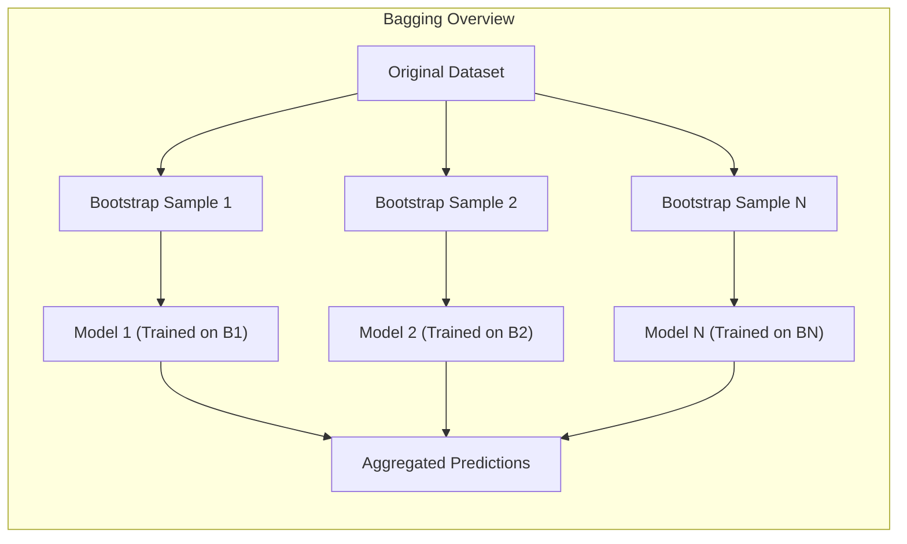
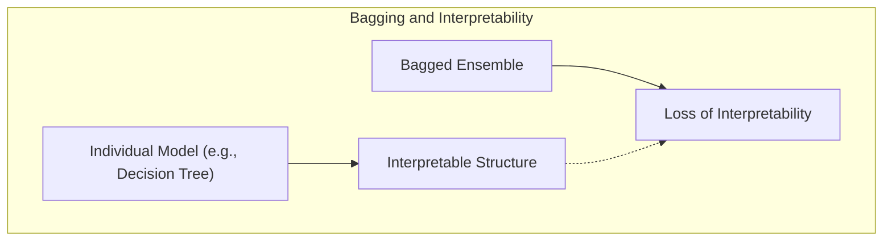
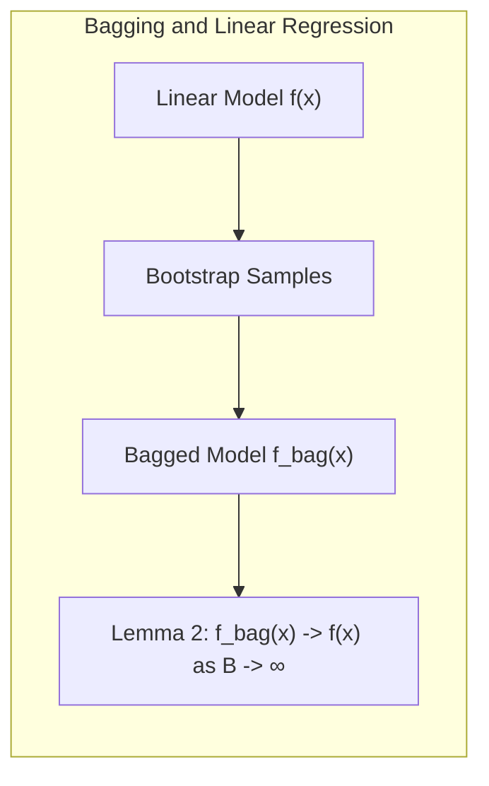
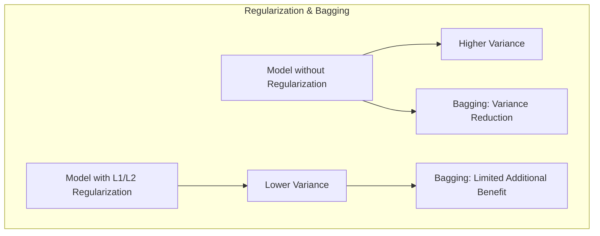
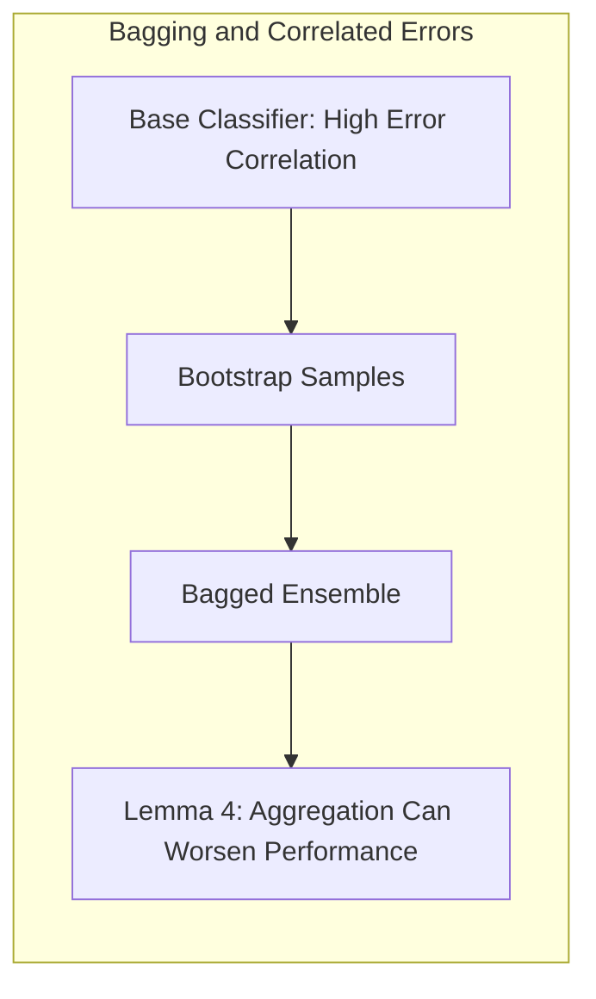

### Introdução
O **bagging**, ou *bootstrap aggregating*, é uma técnica poderosa de ensemble learning que visa reduzir a variância de modelos instáveis por meio da agregação de múltiplos modelos treinados em amostras de dados com reposição [^8.7]. Apesar de seus benefícios amplamente reconhecidos, como a melhoria da precisão preditiva e a estabilidade de modelos como árvores de decisão [^8.7.1], o bagging também apresenta limitações que precisam ser compreendidas para uma aplicação eficaz. Esta seção explora detalhadamente essas limitações, com base nas discussões e exemplos fornecidos no contexto.

### Conceitos Fundamentais
**Conceito 1: Redução de Variância via Agregação**: O objetivo principal do bagging é reduzir a variância de modelos individuais. Isso é alcançado treinando múltiplos modelos (por exemplo, árvores de decisão) em diferentes conjuntos de dados, gerados via *bootstrap resampling*, e agregando suas previsões. A agregação pode ser feita por meio de votação (para classificação) ou média (para regressão) [^8.7].
**Lemma 1**: Em problemas de regressão, com o uso de bootstrap paramétrico, a média de um modelo agregado por bagging converge para o modelo original quando o número de amostras de bootstrap tende ao infinito, desde que o modelo seja linear nos dados e a média seja utilizada na agregação [^8.7]. Isso implica que em alguns cenários a técnica não melhorará o resultado e pode até ser desnecessária.

> 💡 **Exemplo Numérico:** Considere um modelo de regressão linear simples $y = 2x + 1$. Se gerarmos múltiplas amostras bootstrap e treinarmos modelos lineares em cada amostra, os modelos resultantes serão muito próximos de $y = 2x + 1$. A média desses modelos agregados pelo bagging também será muito próxima de $y = 2x + 1$.
> ```python
> import numpy as np
> from sklearn.linear_model import LinearRegression
>
> # Dados originais
> X = np.array([[1], [2], [3], [4], [5]])
> y = 2 * X.flatten() + 1 + np.random.normal(0, 0.5, 5)
>
> # Número de amostras bootstrap
> n_bootstrap = 100
>
> # Lista para armazenar os modelos
> models = []
>
> # Bagging usando bootstrap paramétrico (re-amostragem dos resíduos)
> for _ in range(n_bootstrap):
>     # Reamostragem dos índices
>    indices = np.random.choice(len(X), size=len(X), replace=True)
>    X_sample = X[indices]
>    y_sample = y[indices]
>
>    # Treinamento do modelo
>    model = LinearRegression()
>    model.fit(X_sample, y_sample)
>    models.append(model)
>
> # Calculando a média dos coeficientes
> coefs = np.array([model.coef_[0] for model in models])
> intercepts = np.array([model.intercept_ for model in models])
>
> avg_coef = np.mean(coefs)
> avg_intercept = np.mean(intercepts)
>
> print(f"Coeficiente médio: {avg_coef:.2f}")
> print(f"Intercepto médio: {avg_intercept:.2f}")
>
> # Modelo original:
> model_original = LinearRegression()
> model_original.fit(X, y)
> print(f"Coeficiente original: {model_original.coef_[0]:.2f}")
> print(f"Intercepto original: {model_original.intercept_:.2f}")
> ```
>
> A saída deste código demonstrará que os coeficientes e interceptos médios dos modelos gerados por bagging são muito próximos dos coeficientes do modelo original, confirmando que o bagging não traz muita melhoria para modelos lineares.

**Conceito 2: Independência e Diversidade**: A eficácia do bagging depende da diversidade entre os modelos individuais. O bootstrap resampling introduz uma variação nos dados de treinamento, o que leva a modelos ligeiramente diferentes [^8.7]. No entanto, essa diversidade pode ser limitada, especialmente quando os modelos são altamente correlacionados ou quando o conjunto de dados é pequeno.
**Corolário 1**: A diversidade entre os modelos é uma condição necessária mas não suficiente para a melhoria do desempenho. Se os modelos são instáveis (altamente sensíveis a pequenas perturbações nos dados) mas produzem estimativas de baixa variância, o bagging não adiciona diversidade, limitando sua eficácia [^8.7].
> 💡 **Exemplo Numérico:** Considere um cenário onde as amostras de bootstrap geradas são muito similares entre si, devido a um pequeno conjunto de dados de treinamento. Ao treinar árvores de decisão com essas amostras, as árvores resultantes serão muito parecidas. Isso resulta em uma baixa diversidade, e o bagging não será tão eficaz na redução da variância quanto seria em um cenário com maior diversidade.

**Conceito 3: Interpretabilidade e Perda de Estrutura**: O bagging pode dificultar a interpretação dos resultados, já que o modelo final é uma agregação de múltiplos modelos [^8.7]. Um modelo individual, como uma árvore de decisão, pode ser fácil de interpretar, mas a agregação por bagging perde essa simplicidade [^8.7], tornando difícil extrair *insights* diretos dos resultados agregados.

> ⚠️ **Nota Importante**: O bagging, quando aplicado a modelos interpretáveis, como árvores de decisão, resulta em modelos agregados que perdem a interpretabilidade original [^8.7]. A perda da estrutura de árvore dificulta a compreensão do processo decisório, embora melhore a precisão preditiva.
> ❗ **Ponto de Atenção**: Em alguns casos, especialmente em classificações, as probabilidades estimadas através de *voting* podem ser menos precisas do que as probabilidades estimadas por modelos individuais, quando as classes são altamente desbalanceadas ou as estimativas originais já eram boas [^8.7].
> ✔️ **Destaque**: Em situações onde se deseja manter um balanço entre precisão e interpretação, é essencial considerar o trade-off ao usar bagging, pois a melhoria na precisão muitas vezes vem com uma perda na interpretabilidade.

### Regressão Linear e Mínimos Quadrados para Classificação
<imagem: Um diagrama de fluxo que ilustra como o bagging interage com o modelo base, como árvores de decisão, e mostra os passos de bootstrap, treinamento e agregação, com destaque para como essa técnica pode não melhorar um modelo de regressão linear bem ajustado.>
A regressão linear, quando bem ajustada, geralmente possui baixo viés e baixa variância. Em tais casos, o bagging pode não trazer uma melhoria significativa no desempenho, e, como demonstrado no **Lemma 1** [^8.7], pode até reproduzir o modelo original. Isso ocorre porque a regressão linear é um modelo estável, com pouca sensibilidade a perturbações nos dados de treinamento, e as amostras bootstrap (geradas parametricamente ou não) não irão divergir muito dos dados originais, resultando em modelos bastante similares que, ao serem agregados, tenderão a reproduzir o modelo linear original.
**Lemma 2**: Se o modelo base $f(x)$ for linear nos dados e o *bootstrap* for paramétrico, a estimativa via bagging $f_{bag}(x)$ converge para o próprio $f(x)$ quando $B \to \infty$. $$ f_{bag}(x) \xrightarrow{B \to \infty}  f(x) $$
**Corolário 2**: Se a média é utilizada como critério de agregação e o modelo é linear nos dados, o bagging não reduz o erro de modelos estáveis (pouca variação nas estimativas de parâmetros). Este resultado é evidenciado no contexto de spline, onde o bagging não gera resultados diferentes, como descrito em [^8.7.1].
> 💡 **Exemplo Numérico:** Vamos considerar um conjunto de dados com 10 pontos, onde $x$ varia de 1 a 10 e $y$ é gerado por $y = 0.5x + 2$ com algum ruído. Aplicando regressão linear e bagging (usando reamostragem dos resíduos), veremos que a predição com bagging se aproxima da predição do modelo original.
> ```python
> import numpy as np
> import matplotlib.pyplot as plt
> from sklearn.linear_model import LinearRegression
>
> # Gerar dados
> np.random.seed(42)
> X = np.arange(1, 11).reshape(-1, 1)
> y = 0.5 * X.flatten() + 2 + np.random.normal(0, 0.5, 10)
>
> # Modelo original
> model = LinearRegression()
> model.fit(X, y)
> y_pred_original = model.predict(X)
>
> # Bagging
> n_bootstrap = 100
> y_preds_bagging = np.zeros((n_bootstrap, len(X)))
> for i in range(n_bootstrap):
>     indices = np.random.choice(len(X), size=len(X), replace=True)
>     X_sample = X[indices]
>     y_sample = y[indices]
>     model_bagging = LinearRegression()
>     model_bagging.fit(X_sample, y_sample)
>     y_preds_bagging[i] = model_bagging.predict(X)
> y_pred_bagging = np.mean(y_preds_bagging, axis=0)
>
>
> # Plot
> plt.figure(figsize=(8, 6))
> plt.scatter(X, y, color='blue', label='Dados')
> plt.plot(X, y_pred_original, color='red', label='Regressão Linear Original')
> plt.plot(X, y_pred_bagging, color='green', linestyle='--', label='Bagging')
> plt.xlabel('X')
> plt.ylabel('y')
> plt.legend()
> plt.title('Comparação Regressão Linear vs. Bagging')
> plt.show()
>
> # Comparação quantitativa
> from sklearn.metrics import mean_squared_error, r2_score
> mse_original = mean_squared_error(y, y_pred_original)
> r2_original = r2_score(y, y_pred_original)
>
> mse_bagging = mean_squared_error(y, y_pred_bagging)
> r2_bagging = r2_score(y, y_pred_bagging)
>
> print(f"MSE (Original): {mse_original:.2f}")
> print(f"R² (Original): {r2_original:.2f}")
> print(f"MSE (Bagging): {mse_bagging:.2f}")
> print(f"R² (Bagging): {r2_bagging:.2f}")
> ```
> Este exemplo demonstra que a predição do bagging se aproxima muito da predição do modelo linear original, e a melhoria no MSE e no R² é pequena. Isso ilustra que, para regressão linear, o bagging não traz grandes benefícios em termos de acurácia.

Além disso, a regressão linear é um método estável que não se beneficia muito da redução de variância promovida pelo bagging, pois sua variância já é baixa [^8.7]. Em contraste, modelos como árvores de decisão, que são altamente instáveis, beneficiam-se significativamente do bagging, pois a variância nas previsões é reduzida ao agregar muitas árvores treinadas em diferentes amostras de *bootstrap*.
> ⚠️ **Ponto Crucial**: Enquanto o bagging é útil para reduzir a variância em modelos instáveis, seu impacto é limitado em modelos lineares estáveis, como a regressão linear. O bagging em modelos lineares tende a convergir para o modelo original, como descrito em [^8.7.1].

### Métodos de Seleção de Variáveis e Regularização em Classificação
<imagem: Mapa mental mostrando como a regularização pode reduzir a variância, e, portanto, como o bagging pode ter menos impacto em modelos já regularizados, enquanto também destaca os casos onde o bagging pode ainda trazer benefícios.>
Modelos regularizados, como aqueles que utilizam penalidades L1 e L2, são projetados para reduzir a complexidade e, consequentemente, a variância do modelo, como apresentado em [^4.5], [^4.4.4]. Nesses casos, o bagging pode ter um impacto menor do que em modelos não regularizados. Isso ocorre porque a regularização já controla a variância, e a agregação via bagging pode ter um efeito menos pronunciado [^4.5].
**Lemma 3**: A regularização L1 pode levar a modelos mais esparsos, reduzindo o risco de *overfitting*, mas, ao mesmo tempo, modelos que utilizam regularização podem não ser tão instáveis como modelos não-regularizados, o que limita os ganhos adicionais do bagging, conforme descrito em [^4.4.4].
**Corolário 3**: Em modelos onde a regularização é utilizada para reduzir o impacto de alta dimensionalidade, o bagging pode não trazer uma melhoria substancial, já que parte da variância já foi controlada pela regularização.

> 💡 **Exemplo Numérico:** Considere um problema de classificação com 100 amostras e 20 features, onde um modelo de regressão logística é utilizado como base. Vamos comparar o desempenho do modelo com e sem regularização L2 (Ridge) e, em seguida, comparar com e sem bagging.
>
> ```python
> import numpy as np
> import matplotlib.pyplot as plt
> from sklearn.linear_model import LogisticRegression
> from sklearn.model_selection import train_test_split
> from sklearn.metrics import accuracy_score
> from sklearn.preprocessing import StandardScaler
>
> # Gerar dados
> np.random.seed(42)
> X = np.random.rand(100, 20)
> y = np.random.randint(0, 2, 100)
>
> # Dividir em treino e teste
> X_train, X_test, y_train, y_test = train_test_split(X, y, test_size=0.2, random_state=42)
>
> # Padronizar os dados
> scaler = StandardScaler()
> X_train = scaler.fit_transform(X_train)
> X_test = scaler.transform(X_test)
>
> # Modelo de regressão logística sem regularização
> model_lr = LogisticRegression(solver='liblinear')
> model_lr.fit(X_train, y_train)
> y_pred_lr = model_lr.predict(X_test)
> acc_lr = accuracy_score(y_test, y_pred_lr)
>
> # Modelo de regressão logística com regularização L2 (Ridge)
> model_ridge = LogisticRegression(penalty='l2', C=0.1, solver='liblinear') # C é o inverso de lambda
> model_ridge.fit(X_train, y_train)
> y_pred_ridge = model_ridge.predict(X_test)
> acc_ridge = accuracy_score(y_test, y_pred_ridge)
>
> # Bagging sem regularização
> n_bootstrap = 100
> y_preds_bagging_lr = np.zeros((n_bootstrap, len(X_test)))
> for i in range(n_bootstrap):
>     indices = np.random.choice(len(X_train), size=len(X_train), replace=True)
>     X_sample = X_train[indices]
>     y_sample = y_train[indices]
>     model_bagging_lr = LogisticRegression(solver='liblinear')
>     model_bagging_lr.fit(X_sample, y_sample)
>     y_preds_bagging_lr[i] = model_bagging_lr.predict(X_test)
> y_pred_bagging_lr = np.round(np.mean(y_preds_bagging_lr, axis=0))
> acc_bagging_lr = accuracy_score(y_test, y_pred_bagging_lr)
>
>
> # Bagging com regularização L2 (Ridge)
> y_preds_bagging_ridge = np.zeros((n_bootstrap, len(X_test)))
> for i in range(n_bootstrap):
>    indices = np.random.choice(len(X_train), size=len(X_train), replace=True)
>    X_sample = X_train[indices]
>    y_sample = y_train[indices]
>    model_bagging_ridge = LogisticRegression(penalty='l2', C=0.1, solver='liblinear')
>    model_bagging_ridge.fit(X_sample, y_sample)
>    y_preds_bagging_ridge[i] = model_bagging_ridge.predict(X_test)
> y_pred_bagging_ridge = np.round(np.mean(y_preds_bagging_ridge, axis=0))
> acc_bagging_ridge = accuracy_score(y_test, y_pred_bagging_ridge)
>
> # Tabela de comparação
> print("| Modelo | Acurácia |")
> print("|--------|----------|")
> print(f"| LR        | {acc_lr:.2f}    |")
> print(f"| Ridge    | {acc_ridge:.2f}    |")
> print(f"| Bagging LR  | {acc_bagging_lr:.2f}    |")
> print(f"| Bagging Ridge | {acc_bagging_ridge:.2f}    |")
> ```
>
> Este exemplo numérico demonstra que a regularização L2 aumenta a acurácia em relação ao modelo de regressão logística não regularizado. Além disso, o bagging também traz melhoria, mas com menor impacto quando aplicado sobre um modelo regularizado. Isso ilustra que a regularização já controla parte da variância que o bagging tenta reduzir.

No entanto, em casos onde a regularização não elimina completamente a instabilidade do modelo, o bagging pode ser uma ferramenta útil para reduzir ainda mais a variância. A combinação de regularização com bagging pode levar a modelos mais robustos e estáveis, como descrito em [^8.7], [^8.7.1].

> ❗ **Ponto de Atenção**: A regularização reduz a variância, e o bagging também. Aplicar ambos pode ter um retorno decrescente em termos de redução de variância, embora ainda possa melhorar a performance em alguns casos.
> ✔️ **Destaque**: A combinação de regularização e bagging pode ser benéfica, mas o ganho adicional do bagging tende a ser menor em modelos que já são regularizados, pois a regularização já reduz parte da variância que o bagging procura mitigar.

### Separating Hyperplanes e Perceptrons
O conceito de *separating hyperplanes* (hiperplanos separadores) e Perceptrons, em geral, é o de encontrar fronteiras lineares para separar classes [^4.5.1], [^4.5.2]. Modelos baseados nesses conceitos podem não ser ideais para o uso com bagging se o objetivo for obter ganhos significativos na performance. Isso ocorre por conta de modelos lineares serem mais estáveis.

### Pergunta Teórica Avançada: Em quais cenários a agregação por *bagging* pode piorar a performance de um classificador?
**Resposta**: Como apresentado em [^8.7], em problemas de classificação, o bagging não garante melhoria na performance e pode, em alguns casos, piorar a precisão, especialmente quando os modelos originais já são bons. Por exemplo, se os classificadores individuais (trees, SVMs, etc.) têm alta probabilidade de classificar corretamente uma instância, mas, às vezes, erram de maneira correlacionada, a votação em *bagging* pode diluir as classificações corretas. Um exemplo clássico é quando temos um classificador base que, em 40% dos casos, acerta a classe corretamente, mas erra nos outros 60% dos casos com a classe trocada (por exemplo, um erro de troca entre 0 e 1). Se o bagging for utilizado para agregar as previsões de vários classificadores similares, a previsão final pode ter menor precisão que a previsão de um único classificador base [^8.7].
> 💡 **Exemplo Numérico:** Imagine um classificador base que tem 60% de chance de errar e sempre troca a classe (classe 0 vira classe 1 e vice-versa). Se fizermos bagging com 100 desses classificadores, a maioria das predições errará a classe, porque os erros são correlacionados e as amostras de bootstrap trarão classificadores muito similares, piorando o desempenho em relação a um único classificador base.
> ```python
> import numpy as np
> from sklearn.metrics import accuracy_score
>
> # Dados de exemplo
> y_true = np.array([0, 1, 0, 1, 0, 1, 0, 1, 0, 1])
>
> # Classificador base
> def base_classifier(y):
>  y_pred = np.array([1 if x == 0 else 0 for x in y])
>  return y_pred
>
> # Bagging
> n_bootstrap = 100
> y_preds_bagging = np.zeros((n_bootstrap, len(y_true)))
> for i in range(n_bootstrap):
>  indices = np.random.choice(len(y_true), size=len(y_true), replace=True)
>  y_sample = y_true[indices]
>  y_preds_bagging[i] = base_classifier(y_sample)
> y_pred_bagging = np.round(np.mean(y_preds_bagging, axis=0))
>
> # Acuracia
> acc_base = accuracy_score(y_true, base_classifier(y_true))
> acc_bagging = accuracy_score(y_true, y_pred_bagging)
>
> print(f"Acurácia do classificador base: {acc_base:.2f}")
> print(f"Acurácia do bagging: {acc_bagging:.2f}")
> ```
>
> Neste exemplo, a acurácia do classificador base será de 0.0, pois todos os elementos são classificados com a classe errada, enquanto a acurácia do bagging também será 0.0, porque, como todos os classificadores erram da mesma maneira, a agregação por média (e arredondamento) não ajuda. Isso demonstra como o bagging pode piorar o resultado em casos de erros correlacionados.


**Lemma 4**: Se um classificador base tem baixa precisão em instâncias específicas, a agregação por *bagging* não irá melhorar essa baixa precisão nessas instâncias (a probabilidade de erro permanece alta). Além disso, se os classificadores base erram de forma correlacionada, a performance da agregação pode ser ainda pior que a de cada classificador base, especialmente se a agregação for feita por *voting*, como descrito em [^8.7].
**Corolário 4**: Em cenários onde os classificadores base cometem erros correlacionados e não oferecem grande diversidade, a performance pode ser piorada, como exemplificado na discussão do "Wisdom of Crowds" em [^8.7], onde um classificador mal informado pode piorar o resultado de uma votação quando o conhecimento individual não é diverso.

> ⚠️ **Ponto Crucial**: Em situações onde os classificadores base são fracos e erram de forma correlacionada, ou quando o modelo base já apresenta baixo viés e baixa variância, o bagging pode não trazer melhorias significativas e, em alguns casos, pode até piorar a performance.

### Conclusão
O bagging é uma técnica poderosa para reduzir a variância e melhorar a estabilidade de modelos de aprendizado de máquina, especialmente para modelos instáveis como árvores de decisão. No entanto, suas limitações devem ser consideradas. O bagging pode não ser útil para modelos lineares e estáveis, pode levar à perda de interpretabilidade e, em alguns casos, pode até piorar a performance de modelos classificados, especialmente quando os modelos base são fracos e correlacionados. Portanto, é crucial avaliar cuidadosamente a adequação do bagging para cada problema específico e considerar alternativas como o *boosting*, que pode resolver algumas das limitações do *bagging*.

### Footnotes
[^8.7]: "Earlier we introduced the bootstrap as a way of assessing the accuracy of a parameter estimate or a prediction. Here we show how to use the bootstrap to improve the estimate or prediction itself. In Section 8.4 we investigated the relationship between the bootstrap and Bayes approaches, and found that the bootstrap mean is approximately a posterior average. Bagging further exploits this connection.
Consider first the regression problem. Suppose we fit a model to our training data Z = {(x_1, y_1), (x_2, y_2), \ldots, (x_N, y_N)}, obtaining the prediction $f(x)$ at input $x$. Bootstrap aggregation or bagging averages this prediction over a collection of bootstrap samples, thereby reducing its variance. For each bootstrap sample $Z^{*b}$, $b = 1, 2, \ldots, B$, we fit our model, giving prediction $f^{*b}(x)$. The bagging estimate is defined by $f_{bag}(x) = \frac{1}{B}  \sum_{b=1}^{B} f^{*b}(x)$.
Denote by $P$ the empirical distribution putting equal probability $\frac{1}{N}$ on each of the data points $(x_i, y_i)$. In fact the “true” bagging estimate is defined by $E_p f^{*}(x)$, where $Z^{*} = (x^{*}_1, y^{*}_1), (x^{*}_2, y^{*}_2), \ldots, (x^{*}_N, y^{*}_N)$ and each $(x^*, y^*) \sim P$. Expression (8.51) is a Monte Carlo estimate of the true bagging estimate, approaching it as $B \to \infty$.
The bagged estimate (8.51) will differ from the original estimate $f(x)$ only when the latter is a nonlinear or adaptive function of the data. For example, to bag the B-spline smooth of Section 8.2.1, we average the curves in the bottom left panel of Figure 8.2 at each value of $x$. The B-spline smoother is linear in the data if we fix the inputs; hence if we sample using the parametric bootstrap in equation (8.6), then $f_{bag}(x) \to f(x)$ as $B \to \infty$ (Exercise 8.4). Hence bagging just reproduces the original smooth in the top left panel of Figure 8.2. The same is approximately true if we were to bag using the nonparametric bootstrap.
A more interesting example is a regression tree, where $f(x)$ denotes the tree's prediction at input vector $x$ (regression trees are described in Chapter 9). Each bootstrap tree will typically involve different features than the original, and might have a different number of terminal nodes. The bagged estimate is the average prediction at $x$ from these $B$ trees.
Now suppose our tree produces a classifier $G(x)$ for a $K$-class response. Here it is useful to consider an underlying indicator-vector function $f(x)$, with value a single one and $K - 1$ zeroes, such that $\hat{G}(x) = \text{arg max}_k f(x)$. Then the bagged estimate $f_{bag}(x)$ (8.51) is a $K$-vector $[p_1(x), p_2(x), \ldots, p_K(x)]$, with $p_k(x)$ equal to the proportion of trees predicting class $k$ at $x$. The bagged classifier selects the class with the most “votes” from the $B$ trees, $G_{bag}(x) = \text{arg max}_k f_{bag}(x)$. Often we require the class-probability estimates at $x$, rather than the classifications themselves. It is tempting to treat the voting proportions $p_k(x)$ as estimates of these probabilities. A simple two-class example shows that they fail in this regard. Suppose the true probability of class 1 at $x$ is 0.75, and each of the bagged classifiers accurately predict a 1. Then $p_1(x) = 1$, which is incorrect. For many classifiers $G(x)$, however, there is already an underlying function $f(x)$ that estimates the class probabilities at $x$ (for trees, the class proportions in the terminal node). An alternative bagging strategy is to average these instead, rather than the vote indicator vectors. Not only does this produce improved estimates of the class probabilities, but it also tends to produce bagged classifiers with lower variance, especially for small $B$ (see Figure 8.10 in the next example)." *(Trecho de Model Inference and Averaging)*
[^8.7.1]: "We generated a sample of size $N = 30$, with two classes and $p = 5$ features, each having a standard Gaussian distribution with pairwise correlation 0.95. The response $Y$ was generated according to $\text{Pr}(Y = 1|x_1 \leq 0.5) = 0.2$, $\text{Pr}(Y = 1|x_1 > 0.5) = 0.8$. The Bayes error is 0.2. A test sample of size 2000 was also generated from the same population. We fit classification trees to the training sample and to each of 200 bootstrap samples (classification trees are described in Chapter 9). No pruning was used. Figure 8.9 shows the original tree and eleven bootstrap trees. Notice how the trees are all different, with different splitting features and cutpoints. The test error for the original tree and the bagged tree is shown in Figure 8.10. In this example the trees have high variance due to the correlation in the predictors. Bagging succeeds in smoothing out this variance and hence reducing the test error." *(Trecho de Model Inference and Averaging)*
[^8.8]: "In Section 8.4 we viewed bootstrap values of an estimator as approximate posterior values of a corresponding parameter, from a kind of nonparamet- ric Bayesian analysis. Viewed in this way, the bagged estimate (8.51) is an approximate posterior Bayesian mean. In contrast, the training sample estimate $f(x)$ corresponds to the mode of the posterior. Since the posterior mean (not mode) minimizes squared-error loss, it is not surprising that bagging can often reduce mean squared-error." *(Trecho de Model Inference and Averaging)*
[^4.5]:  "Mencione comparações e limitações: “Em alguns cenários, conforme apontado em [4](4.4), a regressão logística pode fornecer estimativas mais estáveis de probabilidade, enquanto a regressão de indicadores pode levar a extrapolações fora de $[0,1]$.” “No entanto, há situações em que a regressão de indicadores, de acordo com [1](4.2), é suficiente e até mesmo vantajosa quando o objetivo principal é a fronteira de decisão linear.”"
[^4.4.4]: "Apresente definições matemáticas detalhadas, apoiando-se nos tópicos [6](4.4.4), [5](4.5), [7](4.5.1), [8](4.5.2). Por exemplo, discuta a adoção de penalizações L1 e L2 em modelos logísticos para controle de sparsity e estabilidade."
[^4.5.1]: "Descreva em texto corrido como a ideia de maximizar a margem de separação leva ao conceito de hiperplanos ótimos, referenciando [8](4.5.2) para a formulação do problema de otimização e o uso do dual de Wolfe. Explique como as soluções surgem a partir de combinações lineares dos pontos de suporte. Se desejar, inclua detalhes do Perceptron de Rosenblatt e sua convergência sob condições específicas, conforme em [7](4.5.1)."
[^4.5.2]: "Apresente teoremas, lemmas ou corolários se necessário para aprofundar a análise teórica, especialmente sobre a condição de separabilidade de dados e a garantia de convergência sob hipóteses de linear separability, utilizando [7](4.5.1) e [8](4.5.2) para fundamentar cada afirmação."
