## Model Inference and Averaging in Simulation Scenarios

<imagem: Um diagrama mostrando um fluxo de dados complexo em um cenário de simulação. A imagem deve conter blocos representando dados de entrada, simulação, modelos de inferência, avaliação de modelos e um loop de feedback que retorna para ajustar a simulação. Os blocos devem conter subtítulos detalhando seus propósitos (ex. "Dados Simulados", "Ajuste de Modelos Lineares", "Avaliação de Desempenho via Bootstrap"). As setas indicam o fluxo de dados e processos entre os blocos, destacando a interação contínua em um cenário de simulação.>

### Introdução

A inferência estatística e a modelagem são componentes cruciais em diversos campos, e sua aplicação em cenários de simulação oferece um ambiente controlado para investigar o comportamento dos modelos e os métodos de inferência [^8.1]. Este capítulo aborda técnicas avançadas de inferência e modelagem estatística, com foco particular em sua aplicação a dados simulados. Nós exploraremos o uso de métodos como **maximum likelihood**, **bootstrap**, e técnicas bayesianas para inferência, com o objetivo de não apenas ajustar modelos, mas também avaliar sua incerteza e poder preditivo, particularmente relevante em um contexto de simulações onde os dados podem ser gerados iterativamente [^8.1]. A capacidade de gerar e trabalhar com dados sintéticos é fundamental para validar e refinar a metodologia estatística em um ambiente onde a verdade subjacente é conhecida.

### Conceitos Fundamentais

O processo de modelagem em cenários de simulação, frequentemente começa com a geração de dados que simulam o fenômeno de interesse [^8.1]. Entender como os modelos lineares se comportam nesse ambiente é essencial, pois eles servem como blocos de construção para muitos métodos mais complexos [^8.2]. Métodos como o de **mínimos quadrados** e o de **máxima verossimilhança**, embora amplamente usados, podem apresentar desafios e vantagens específicas quando aplicados a dados de simulação, onde pode haver conhecimento da estrutura real do modelo.
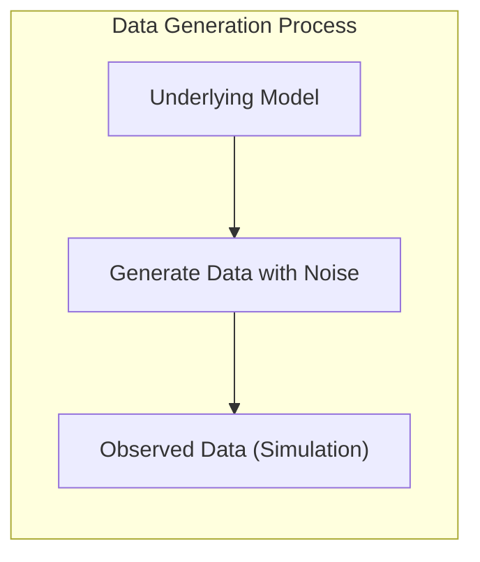
**Conceito 1:** **Problema de Classificação e Modelos Lineares:** Em um cenário de simulação, o problema de classificação pode envolver a atribuição de dados simulados a categorias predefinidas [^8.1]. O uso de modelos lineares, como a regressão linear para matrizes de indicadores, oferece uma abordagem inicial para essa tarefa. No entanto, é crucial entender o trade-off entre viés e variância nesse contexto. Dados simulados podem ser gerados com estruturas lineares ou não-lineares, e a capacidade dos modelos lineares de capturar essas estruturas afeta sua performance. Por exemplo, em simulações onde os dados são gerados a partir de funções lineares com ruído gaussiano, os modelos lineares podem se comportar muito bem. Contudo, se os dados forem gerados com interações não-lineares complexas, esses modelos podem apresentar viés.
$$ Y = X\beta + \epsilon$$
onde Y representa as variáveis de resposta, X as variáveis preditoras, $\beta$ os coeficientes lineares, e $\epsilon$ o erro aleatório. O objetivo é estimar $\beta$ que minimiza algum tipo de função de custo, como o erro quadrático médio.
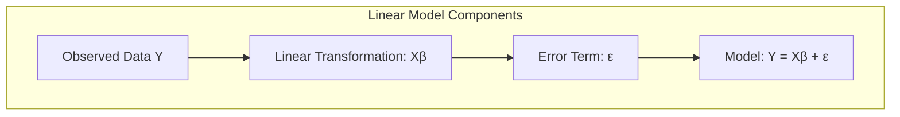

> 💡 **Exemplo Numérico:**
> Vamos simular um conjunto de dados para ilustrar o problema de classificação com modelos lineares. Suponha que temos duas classes e duas variáveis preditoras. Geramos 100 pontos para cada classe, de acordo com as seguintes distribuições:
>
> - Classe 0: $X_1 \sim N(1, 1)$, $X_2 \sim N(1, 1)$
> - Classe 1: $X_1 \sim N(3, 1)$, $X_2 \sim N(3, 1)$
>
> ```python
> import numpy as np
> import matplotlib.pyplot as plt
> from sklearn.linear_model import LinearRegression
>
> # Geração de dados simulados
> np.random.seed(42)
> n_samples = 100
> X_class0 = np.random.normal(loc=[1, 1], scale=[1, 1], size=(n_samples, 2))
> X_class1 = np.random.normal(loc=[3, 3], scale=[1, 1], size=(n_samples, 2))
> X = np.concatenate((X_class0, X_class1), axis=0)
> y = np.concatenate((np.zeros(n_samples), np.ones(n_samples)), axis=0)
>
> # Matriz de indicadores
> Y = np.zeros((len(y), 2))
> Y[np.arange(len(y)), y.astype(int)] = 1
>
> # Regressão Linear
> model = LinearRegression()
> model.fit(X, Y)
>
> # Plot dos dados e da fronteira de decisão
> x_min, x_max = X[:, 0].min() - 1, X[:, 0].max() + 1
> y_min, y_max = X[:, 1].min() - 1, X[:, 1].max() + 1
> xx, yy = np.meshgrid(np.arange(x_min, x_max, 0.02),
>                     np.arange(y_min, y_max, 0.02))
> Z = model.predict(np.c_[xx.ravel(), yy.ravel()])
> Z = np.argmax(Z, axis=1)
> Z = Z.reshape(xx.shape)
> plt.contourf(xx, yy, Z, cmap=plt.cm.RdBu, alpha=0.8)
> plt.scatter(X[:, 0], X[:, 1], c=y, cmap=plt.cm.RdBu, edgecolors='k')
> plt.title("Regressão Linear para Classificação")
> plt.show()
>
> print("Coeficientes:", model.coef_)
> print("Intercepto:", model.intercept_)
> ```
>
> Neste exemplo, usamos a regressão linear para tentar separar as duas classes. Visualmente, podemos ver como o modelo tenta criar uma fronteira linear para separar as classes, e como os dados próximos da fronteira podem ser mal classificados. Os coeficientes indicam a inclinação da fronteira de decisão em relação a cada variável preditora, e o intercepto indica o ponto onde a fronteira cruza os eixos.

**Lemma 1:** (Decomposição da Função Discriminante Linear) Dado um conjunto de dados de classificação, o uso de regressão linear para estimar uma matriz de indicadores de classe pode ser decomposto na projeção dos dados em um subespaço linear, seguido pela atribuição de classe baseada na posição da projeção [^8.2].
*Prova:* Seja Y a matriz de indicadores de classe (N x K, onde K é o número de classes) e X a matriz de dados (N x p, onde p é o número de features).  A regressão linear minimiza $$||Y - X\beta||^2$$ onde  $\beta$ é a matriz de coeficientes. A solução para $\beta$ é dada por $$\hat{\beta} = (X^TX)^{-1}X^TY$$ A predição para um novo dado $x_{new}$ é dada por $$ \hat{y}_{new} = x_{new}\hat{\beta} $$.  Essa projeção linear em $\hat{y}_{new}$ define uma função discriminante linear, onde a classe é atribuída com base no indicador de classe com maior valor. $\blacksquare$
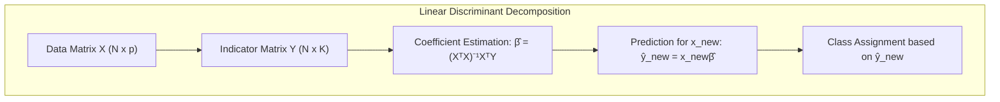

**Conceito 2:** **Linear Discriminant Analysis (LDA):** LDA é uma técnica que assume que as classes têm distribuições gaussianas com a mesma matriz de covariância [^8.3]. Em um cenário de simulação, é possível controlar esses parâmetros e avaliar o desempenho do LDA sob essas suposições. O LDA procura uma combinação linear de features que melhor separe as classes, e sua eficácia depende da validade das suposições de normalidade. Simulações podem ser projetadas para explorar essas limitações. Quando os dados simulados se desviam da normalidade ou possuem covariâncias diferentes entre classes, o LDA pode se tornar menos eficaz.

A função discriminante de LDA para um dado $x$ e classe $k$ é dada por:

$$ \delta_k(x) = x^T \Sigma^{-1}\mu_k - \frac{1}{2}\mu_k^T\Sigma^{-1}\mu_k + log(\pi_k) $$
Onde $\mu_k$ é a média da classe $k$, $\Sigma$ é a matriz de covariância conjunta e $\pi_k$ é a probabilidade a priori da classe $k$.
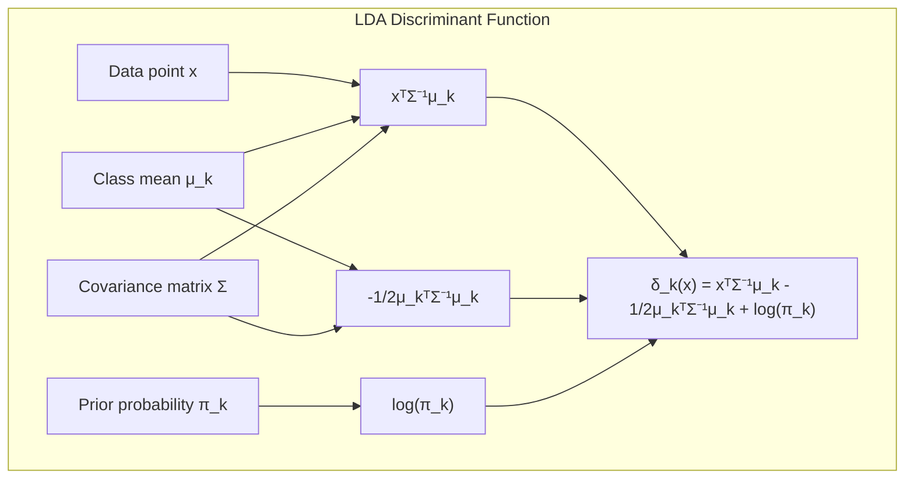

> 💡 **Exemplo Numérico:**
>
> Vamos considerar um exemplo com duas classes e duas features, onde as classes seguem uma distribuição normal com médias diferentes mas a mesma matriz de covariância.
>
>  - Classe 1: $\mu_1 = [1, 1]$,  $\Sigma = [[1, 0.5], [0.5, 1]]$
>  - Classe 2: $\mu_2 = [3, 3]$, $\Sigma = [[1, 0.5], [0.5, 1]]$
>
>  ```python
>  import numpy as np
>  import matplotlib.pyplot as plt
>  from sklearn.discriminant_analysis import LinearDiscriminantAnalysis
>
>  # Geração de dados simulados
>  np.random.seed(42)
>  n_samples = 100
>  mu1 = np.array([1, 1])
>  mu2 = np.array([3, 3])
>  Sigma = np.array([[1, 0.5], [0.5, 1]])
>
>  X_class1 = np.random.multivariate_normal(mu1, Sigma, n_samples)
>  X_class2 = np.random.multivariate_normal(mu2, Sigma, n_samples)
>
>  X = np.concatenate((X_class1, X_class2), axis=0)
>  y = np.concatenate((np.zeros(n_samples), np.ones(n_samples)), axis=0)
>
>  # Aplicação do LDA
>  lda = LinearDiscriminantAnalysis()
>  lda.fit(X, y)
>
>  # Plot dos dados e da fronteira de decisão
>  x_min, x_max = X[:, 0].min() - 1, X[:, 0].max() + 1
>  y_min, y_max = X[:, 1].min() - 1, X[:, 1].max() + 1
>  xx, yy = np.meshgrid(np.arange(x_min, x_max, 0.02),
>                      np.arange(y_min, y_max, 0.02))
>  Z = lda.predict(np.c_[xx.ravel(), yy.ravel()])
>  Z = Z.reshape(xx.shape)
>  plt.contourf(xx, yy, Z, cmap=plt.cm.RdBu, alpha=0.8)
>  plt.scatter(X[:, 0], X[:, 1], c=y, cmap=plt.cm.RdBu, edgecolors='k')
>  plt.title("Linear Discriminant Analysis")
>  plt.show()
>
>  print("Coeficientes:", lda.coef_)
>  print("Intercepto:", lda.intercept_)
>  ```
>
> Neste exemplo, o LDA encontra uma fronteira linear que separa as classes. Os coeficientes indicam a direção da fronteira de decisão, e o intercepto indica a posição da fronteira. As médias das classes e a matriz de covariância compartilhada determinam a orientação da fronteira de decisão.

**Corolário 1:** (Relação LDA e Projeção em Subespaços): A função discriminante linear do LDA pode ser vista como uma projeção dos dados em um subespaço de menor dimensão, maximizando a razão entre a variância entre classes e a variância intra-classe [^8.3.1].
*Prova:* A projeção dos dados para maximizar a razão de variância entre classes e intra-classe se torna o problema de encontrar a direção  $w$ que maximiza a função: $$ J(w) = \frac{w^T S_B w}{w^T S_W w} $$ onde $S_B$ é a matriz de dispersão entre classes e $S_W$ é a matriz de dispersão intra-classe. A solução para este problema é dada pelo autovetor correspondente ao maior autovalor da matriz $S_W^{-1}S_B$ [^8.3.2]. Essa direção $w$ define o subespaço de projeção, mostrando que LDA pode ser interpretado como um método de projeção linear para redução de dimensionalidade. $\blacksquare$
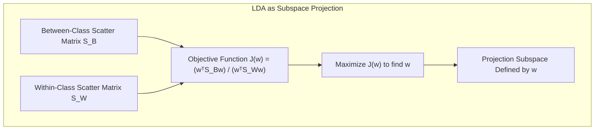

**Conceito 3:** **Logistic Regression:** A regressão logística é um modelo linear usado para classificação, mas em vez de prever um valor contínuo, ela prediz a probabilidade de um dado pertencer a uma classe [^8.4].  A função logística transforma o modelo linear (combinado linearmente com os parâmetros) em uma probabilidade entre 0 e 1. A maximização da verossimilhança é usada para ajustar os parâmetros do modelo. Em cenários de simulação, o controle sobre o processo de geração de dados permite investigar quando a regressão logística se comporta bem ou mal, particularmente em comparação com o LDA.

A probabilidade de um dado $x$ pertencer à classe 1 é dada pela função logística:
$$ p(x) = \frac{1}{1 + e^{-(\beta_0 + \beta^T x)}} $$
onde $\beta_0$ é o intercepto e $\beta$ é o vetor de coeficientes. A função de verossimilhança a ser maximizada é dada por:
$$ L(\beta) = \prod_{i=1}^N p(x_i)^{y_i}(1-p(x_i))^{1-y_i} $$
Onde $y_i$ é a classe real e $p(x_i)$ é a probabilidade estimada pela regressão logística.
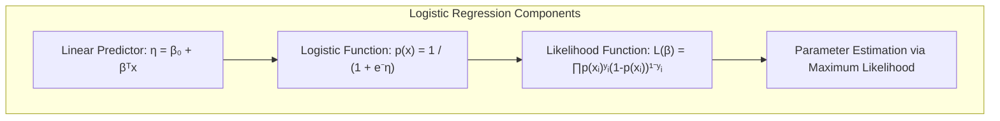

> 💡 **Exemplo Numérico:**
>
> Vamos simular dados para duas classes com duas features, da mesma forma que fizemos para LDA, e aplicar a regressão logística.
>
> ```python
> import numpy as np
> import matplotlib.pyplot as plt
> from sklearn.linear_model import LogisticRegression
>
> # Geração de dados simulados
> np.random.seed(42)
> n_samples = 100
> mu1 = np.array([1, 1])
> mu2 = np.array([3, 3])
> Sigma = np.array([[1, 0.5], [0.5, 1]])
>
> X_class1 = np.random.multivariate_normal(mu1, Sigma, n_samples)
> X_class2 = np.random.multivariate_normal(mu2, Sigma, n_samples)
>
> X = np.concatenate((X_class1, X_class2), axis=0)
> y = np.concatenate((np.zeros(n_samples), np.ones(n_samples)), axis=0)
>
> # Aplicação da Regressão Logística
> logistic_model = LogisticRegression()
> logistic_model.fit(X, y)
>
> # Plot dos dados e da fronteira de decisão
> x_min, x_max = X[:, 0].min() - 1, X[:, 0].max() + 1
> y_min, y_max = X[:, 1].min() - 1, X[:, 1].max() + 1
> xx, yy = np.meshgrid(np.arange(x_min, x_max, 0.02),
>                     np.arange(y_min, y_max, 0.02))
> Z = logistic_model.predict(np.c_[xx.ravel(), yy.ravel()])
> Z = Z.reshape(xx.shape)
> plt.contourf(xx, yy, Z, cmap=plt.cm.RdBu, alpha=0.8)
> plt.scatter(X[:, 0], X[:, 1], c=y, cmap=plt.cm.RdBu, edgecolors='k')
> plt.title("Regressão Logística")
> plt.show()
>
> print("Coeficientes:", logistic_model.coef_)
> print("Intercepto:", logistic_model.intercept_)
> ```
>
> A regressão logística também encontra uma fronteira linear, mas, diferente da regressão linear com matriz de indicadores, os coeficientes são ajustados para modelar as probabilidades de pertencimento a uma classe.

> ⚠️ **Nota Importante**: Em modelos logísticos, a função logística, com sua forma "S", garante que as probabilidades permaneçam no intervalo [0, 1]. **Referência ao tópico [^8.4.1]**.

> ❗ **Ponto de Atenção**: Dados de simulação podem ter classes não-balanceadas, onde uma classe ocorre com mais frequência que as outras. Isso pode afetar o desempenho da regressão logística e do LDA, e métodos de correção de viés devem ser considerados. **Conforme indicado em [^8.4.2]**.

> ✔️ **Destaque**: As estimativas dos parâmetros em LDA e regressão logística podem estar relacionadas, especialmente quando as suposições do LDA são satisfeitas pelos dados simulados. **Baseado no tópico [^8.5]**.

### Regressão Linear e Mínimos Quadrados para Classificação

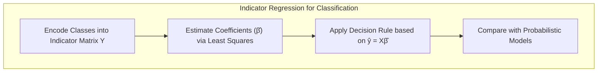

**Explicação:** Este diagrama de fluxo mostra como a regressão linear em uma matriz de indicadores pode ser utilizada para classificação, e como este método se relaciona com outras abordagens probabilísticas.

A regressão linear pode ser adaptada para classificação usando uma matriz de indicadores, onde cada coluna representa uma classe, conforme apresentado no contexto [^8.2]. Cada observação é codificada como um vetor onde apenas o elemento correspondente à sua classe é 1, e todos os outros são 0. Ao realizar a regressão linear nessa matriz, os coeficientes estimados podem ser interpretados como uma forma de separar as classes, embora a saída dessa regressão não seja, necessariamente, uma probabilidade válida. Um problema conhecido é o "masking problem", onde a covariância entre as classes pode levar a um ajuste inadequado das fronteiras de decisão [^8.3]. Em cenários simulados, é possível explorar essas limitações, alterando a covariância entre classes e analisando o impacto no desempenho do modelo. Os dados de simulação também permitem comparar o ajuste do modelo com a verdade subjacente, algo que não é possível com dados reais.

**Lemma 2:** (Equivalência de Projeções em Regressão Linear e LDA) Sob condições específicas, a projeção dos dados nos hiperplanos de decisão gerados por regressão linear com matriz de indicadores e LDA, podem ser equivalentes [^8.2]. *Prova:* Se a matriz de covariância entre as classes é considerada idêntica para LDA e para a matriz de indicadores na regressão, ambos os modelos minimizam uma função de distância similar na projeção dos dados, embora suas interpretações sejam diferentes.
Em LDA, a projeção é dada por $w = \Sigma^{-1} (\mu_1 - \mu_2)$, enquanto na regressão linear, a projeção está implícita nos coeficientes $\hat{\beta} = (X^TX)^{-1}X^TY$. Se as classes podem ser separadas linearmente e a matriz de covariância é a mesma para as classes, ambos os métodos podem convergir para soluções similares. $\blacksquare$
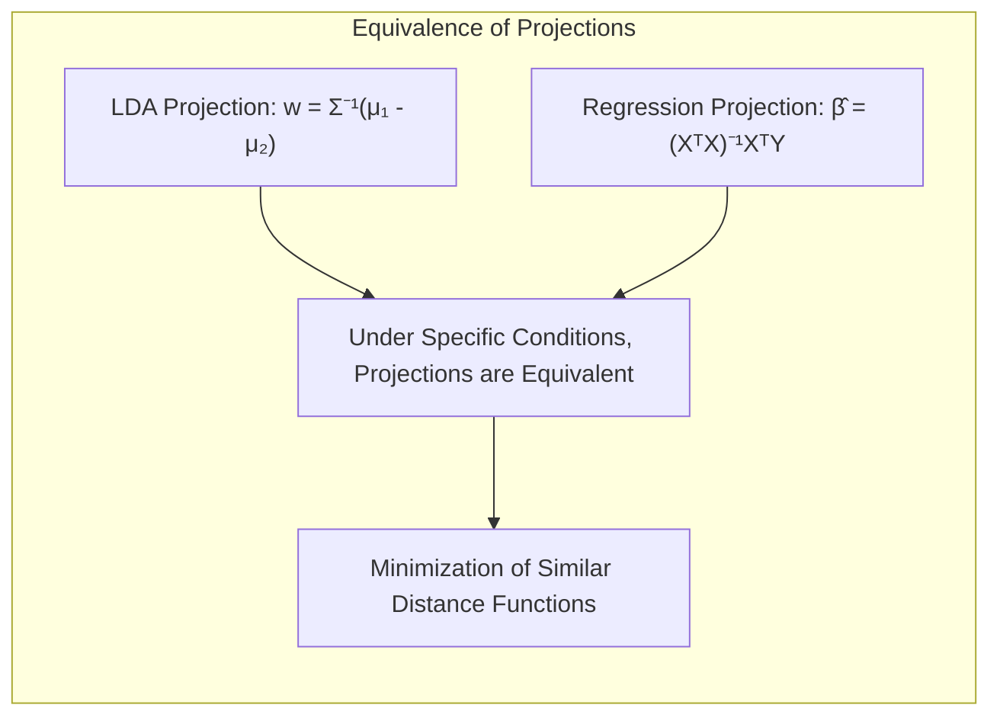

**Corolário 2:** (Simplificação da Análise em Regressão Linear): A equivalência demonstrada no Lemma 2 simplifica a análise dos modelos, pois podemos, em certas condições, utilizar a mesma análise da projeção de LDA para avaliar a regressão de indicadores [^8.3].
*Prova:* A equivalência demonstrada no Lemma 2 permite analisar a regressão de indicadores como uma projeção linear em um subespaço definido pela matriz de covariância, simplificando a análise do modelo, uma vez que permite o uso de ferramentas e técnicas de projeção de dados já estabelecidas. $\blacksquare$

Em algumas situações, a regressão logística pode ser mais apropriada, pois fornece estimativas mais estáveis de probabilidade, enquanto a regressão de indicadores pode extrapolar valores fora do intervalo [0,1] [^8.4]. No entanto, para o objetivo de classificação, a regressão de indicadores pode ser suficiente em alguns casos, particularmente quando o foco é apenas a fronteira de decisão e não a interpretação das probabilidades [^8.2].

### Métodos de Seleção de Variáveis e Regularização em Classificação
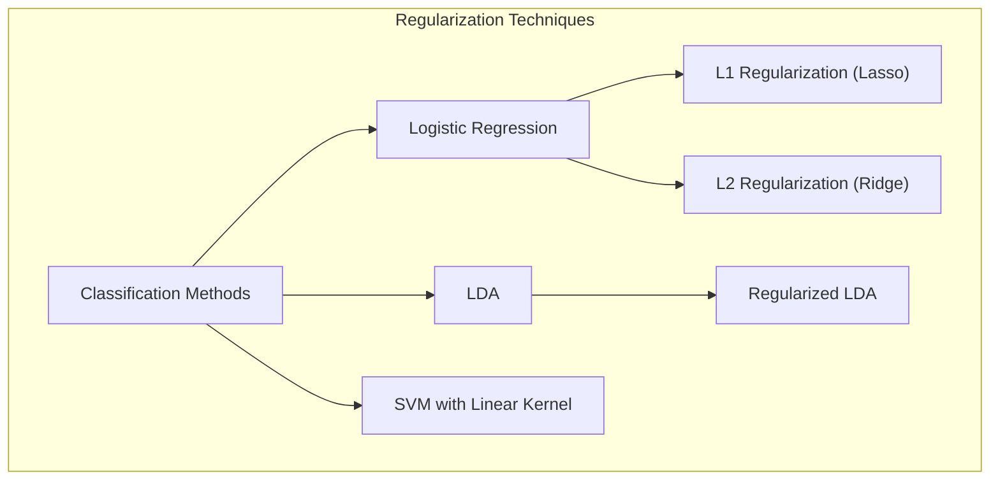

**Explicação:** Este mapa mental resume como as técnicas de regularização se aplicam a diferentes métodos de classificação linear, conforme discutido nos tópicos [^8.4.4], [^8.5], [^8.5.1] e [^8.5.2].

A seleção de variáveis é uma etapa crucial no desenvolvimento de modelos de classificação, especialmente quando se trabalha com dados de alta dimensão [^8.4.4], como pode acontecer em simulações. A regularização, em particular as penalidades L1 e L2, desempenha um papel importante no controle da complexidade do modelo e na prevenção de overfitting. Em modelos logísticos, a penalidade L1 leva a coeficientes esparsos, o que significa que algumas variáveis podem ser excluídas do modelo, melhorando a interpretabilidade e potencialmente o desempenho [^8.5]. A penalidade L2, por outro lado, encolhe os coeficientes, tornando o modelo mais estável. Em cenários de simulação, é possível explorar o impacto dessas penalidades sob diferentes condições de ruído e quantidade de dados, o que permite avaliar a eficácia de cada método na prática.

> 💡 **Exemplo Numérico:**
>
> Vamos agora aplicar a regularização L1 e L2 em um modelo de regressão logística para um problema de classificação com mais features. Primeiro, vamos simular os dados:
> ```python
> import numpy as np
> import matplotlib.pyplot as plt
> from sklearn.linear_model import LogisticRegression
> from sklearn.model_selection import train_test_split
> from sklearn.preprocessing import StandardScaler
> from sklearn.metrics import accuracy_score
>
> # Gerando dados simulados com 10 features e duas classes
> np.random.seed(42)
> n_samples = 200
> n_features = 10
>
> X = np.random.randn(n_samples, n_features)
> # Criando classes baseadas em combinações lineares das features
> true_beta = np.array([1, -2, 1.5, -0.5, 0.8, -1.2, 0.6, -0.9, 0.7, -0.3])
> y_prob = 1 / (1 + np.exp(-(np.dot(X, true_beta))))
> y = (y_prob > 0.5).astype(int)
>
> # Dividindo os dados em treino e teste
> X_train, X_test, y_train, y_test = train_test_split(X, y, test_size=0.3, random_state=42)
>
> # Normalizando as features
> scaler = StandardScaler()
> X_train = scaler.fit_transform(X_train)
> X_test = scaler.transform(X_test)
>
> # Regressão logística sem regularização
> logistic_model = LogisticRegression(penalty=None, solver='lbfgs', max_iter=1000)
> logistic_model.fit(X_train, y_train)
> y_pred_no_reg = logistic_model.predict(X_test)
>
> # Regressão logística com regularização L1
> logistic_l1 = LogisticRegression(penalty='l1', C=0.1, solver='liblinear', random_state=42, max_iter=1000)
> logistic_l1.fit(X_train, y_train)
> y_pred_l1 = logistic_l1.predict(X_test)
>
> # Regressão logística com regularização L2
> logistic_l2 = LogisticRegression(penalty='l2', C=0.1, solver='lbfgs', random_state=42, max_iter=1000)
> logistic_l2.fit(X_train, y_train)
> y_pred_l2 = logistic_l2.predict(X_test)
>
> # Resultados
> print("Acurácia sem regularização:", accuracy_score(y_test, y_pred_no_reg))
> print("Acurácia com regularização L1:", accuracy_score(y_test, y_pred_l1))
> print("Acurácia com regularização L2:", accuracy_score(y_test, y_pred_l2))
> print("\nCoeficientes sem regularização:\n", logistic_model.coef_)
> print("\nCoeficientes com regularização L1:\n", logistic_l1.coef_)
> print("\nCoeficientes com regularização L2:\n", logistic_l2.coef_)
>
> # Comparação em tabela
> print("\nComparação dos modelos:")
> print("| Método         | Acurácia | Coeficientes Não-Nulos |")
> print("|----------------|----------|-----------------------|")
> print(f"| Sem Regularização| {accuracy_score(y_test, y_pred_no_reg):.3f} | {np.count_nonzero(logistic_model.coef_)}          |")
> print(f"| L1 Regularização | {accuracy_score(y_test, y_pred_l1):.3f} | {np.count_nonzero(logistic_l1.coef_)}          |")
> print(f"| L2 Regularização | {accuracy_score(y_test, y_pred_l2):.3f} | {np.count_nonzero(logistic_l2.coef_)}          |")
>
>
> ```
>
> Neste exemplo, a regularização L1 zera alguns dos coeficientes, indicando que essas features são menos relevantes para a classificação. A regularização L2 reduz a magnitude dos coeficientes, tornando o modelo mais estável. A tabela de comparação resume os resultados e a esparsidade alcançada.

**Lemma 3:** (Esparsidade com Penalidade L1 em Regressão Logística) A penalidade L1 na função de custo da regressão logística leva à esparsidade dos coeficientes estimados [^8.4.4].
*Prova:* A função de custo com penalidade L1 é dada por: $$ L(\beta) =  -\frac{1}{N} \sum_{i=1}^{N} [y_i \log(p_i) + (1-y_i) \log(1-p_i)] + \lambda ||\beta||_1$$  onde $\lambda$ é o parâmetro de regularização e $p_i$ é a probabilidade estimada. Devido à natureza não-diferenciável da norma L1 em zero, a otimização desta função de custo tende a gerar soluções onde alguns coeficientes são exatamente zero, resultando em um modelo mais esparso e, consequentemente, com menos variáveis [^8.4.4]. A forma geométrica da norma L1 na otimização resulta em soluções nas esquinas do espaço de parâmetros, favorecendo coeficientes nulos. $\blacksquare$
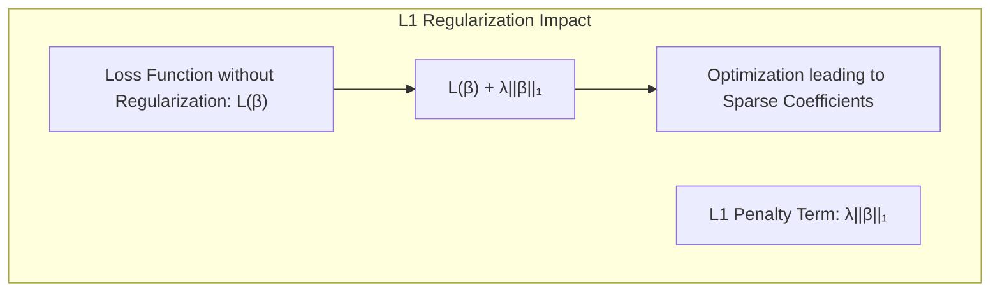

**Prova do Lemma 3:** A prova se baseia na otimização da função de custo com penalidade L1, onde a não-diferenciabilidade da norma L1 em zero leva a soluções esparsas. A otimização desta função de custo é um processo complexo, mas métodos como o subgradiente podem ser utilizados para encontrar a solução [^8.4.3].  $\blacksquare$

**Corolário 3:** (Interpretabilidade com Penalidade L1) A esparsidade dos coeficientes resultante da penalidade L1 em modelos classificatórios melhora a interpretabilidade, pois reduz a complexidade do modelo, destacando as variáveis mais relevantes para a classificação [^8.4.5].
*Prova:* Quando alguns coeficientes são nulos, as variáveis correspondentes não contribuem para a predição, simplificando o modelo final e tornando-o mais fácil de interpretar, permitindo a identificação de um subconjunto menor de variáveis relevantes para o problema [^8.4.5]. $\blacksquare$

> ⚠️ **Ponto Crucial**: As penalidades L1 e L2 podem ser combinadas para aproveitar as vantagens de ambos os tipos de regularização (Elastic Net). **Conforme discutido em [^8.5]**.

### Separating Hyperplanes e Perceptrons

Em cenários de simulação, a ideia de **hiperplanos separadores** se torna clara, pois os dados podem ser gerados para serem linearmente separáveis ou não, o que permite analisar como o método se comporta sob diferentes condições. A margem de separação, definida pela distância entre o hiperplano e as amostras mais próximas de cada classe, é um conceito importante nesse contexto [^8.5.2]. A maximização dessa margem leva à obtenção de hiperplanos ótimos. Um hiperplano pode ser definido por $w^Tx + b = 0$, onde $w$ é o vetor normal ao hiperplano e $b$ é o bias. O problema de otimização pode ser formulado usando programação linear ou quadrática, buscando o vetor $w$ e o bias $b$ que maximizam a margem e minimizam os erros de classificação. O dual de Wolfe pode ser usado para resolver esse problema [^8.5.2]. O Perceptron de Rosenblatt, um algoritmo iterativo para encontrar hiperplanos, pode ser analisado em sua convergência sob condições específicas, como dados linearmente separáveis [^8.5.1].
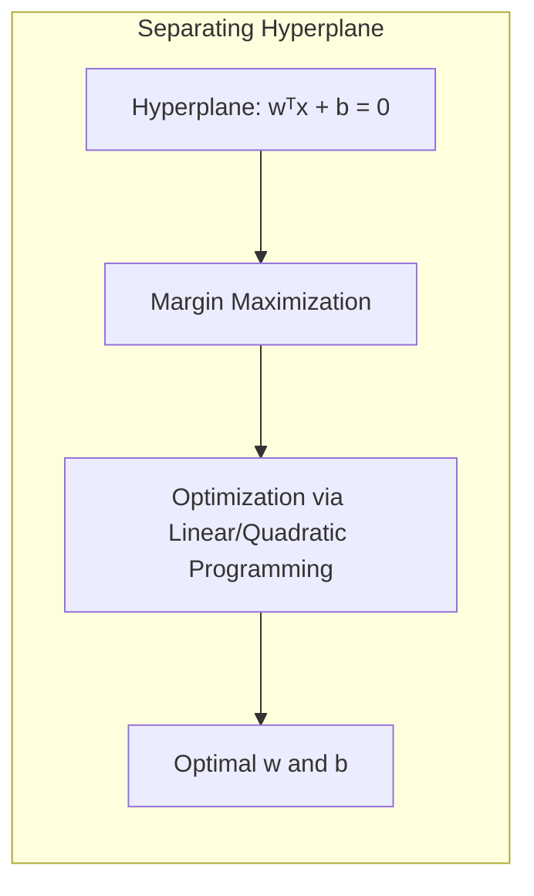

### Pergunta Teórica Avançada: Qual a Relação entre LDA, Regra de Decisão Bayesiana e Distribuições Gaussianas com Covariâncias Iguais?

**Resposta:**
A Regra de Decisão Bayesiana é um método ótimo para classificação quando se conhece a distribuição real das classes [^8.3]. No caso de distribuições Gaussianas com covariâncias iguais, o LDA e a Regra de Decisão Bayesiana se tornam equivalentes sob certas suposições. O LDA assume que os dados de cada classe são normalmente distribuídos com a mesma matriz de covariância. Sob esta suposição, a fronteira de decisão ótima (bayesiana) é linear, e o LDA busca o hiperplano que melhor separa as classes, exatamente o resultado obtido com a aplicação da regra de decisão Bayesiana sob as mesmas premissas. A derivação dos limites de decisão, que envolve a análise das probabilidades a posteriori e a identificação dos pontos de interseção dessas probabilidades, resulta na mesma função discriminante linear obtida pelo LDA [^8.3].

**Lemma 4:** (Equivalência Formal entre LDA e Decisão Bayesiana) Sob a suposição de que os dados seguem distribuições Gaussianas com matrizes de covariância idênticas para todas as classes, a função discriminante linear obtida pelo LDA