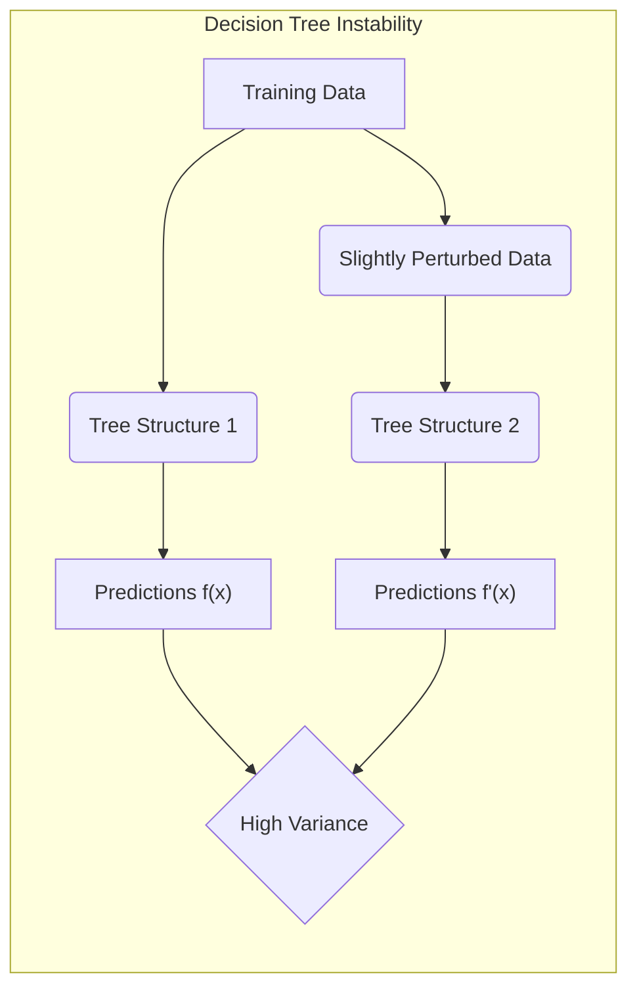
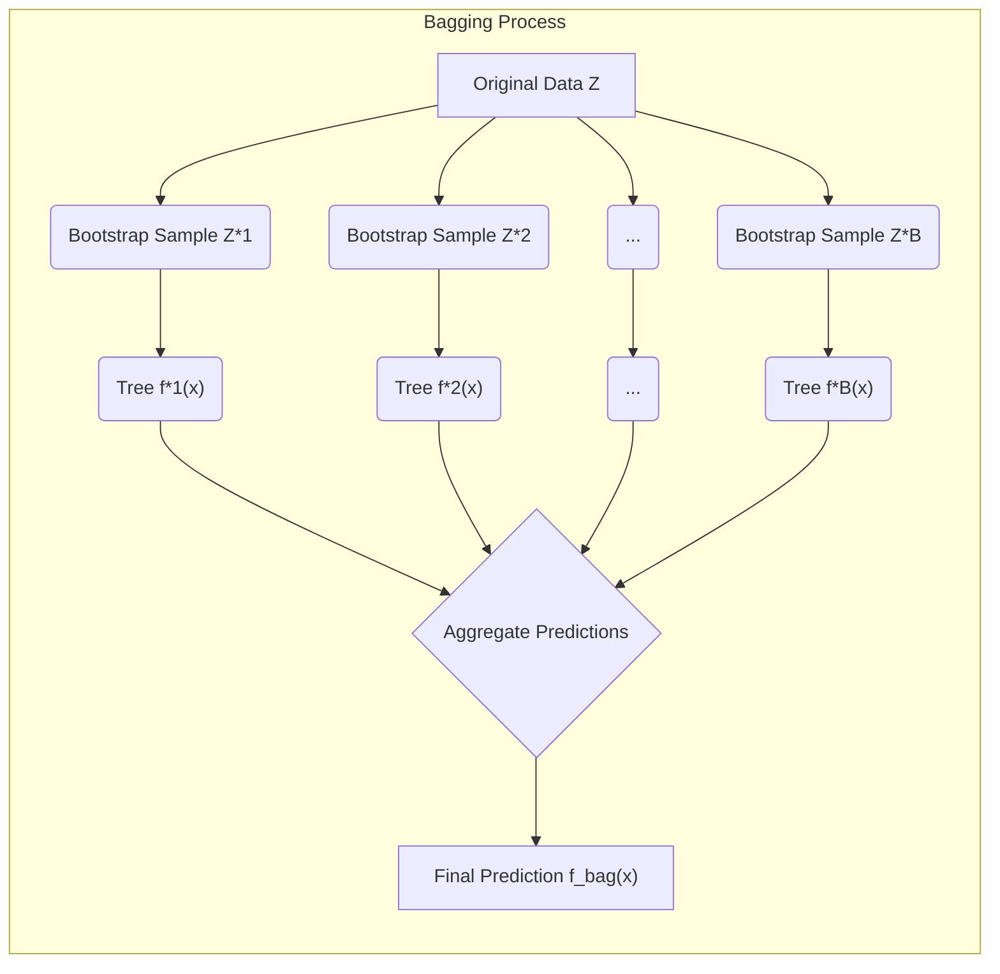
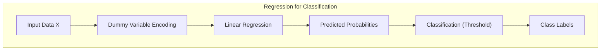
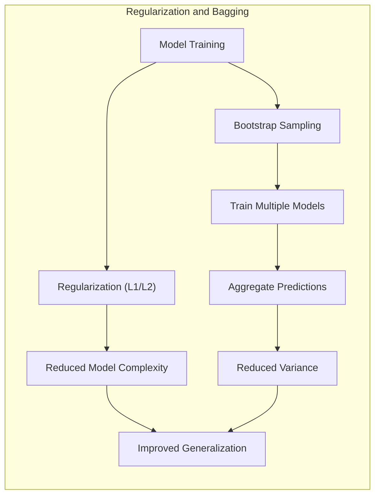
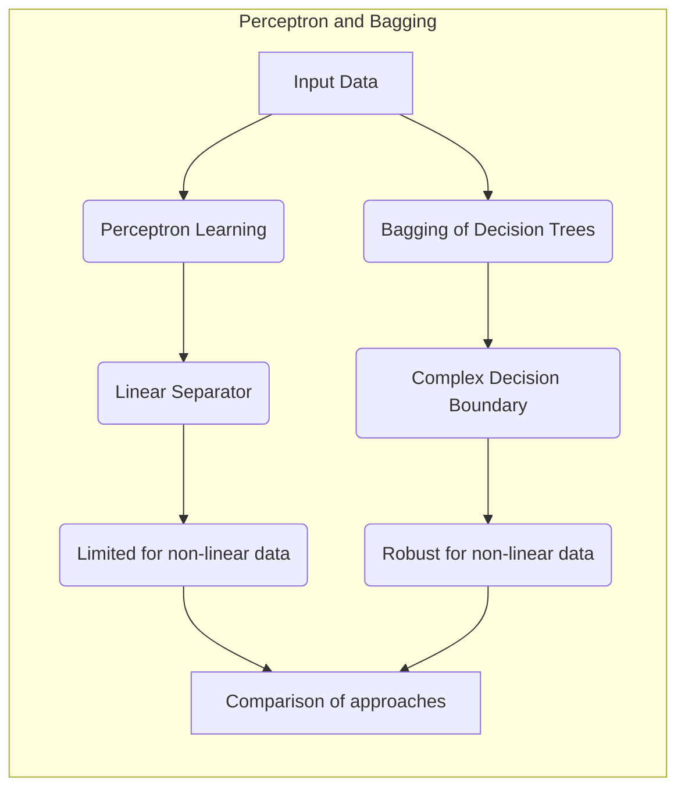

Okay, I will add Mermaid diagrams to the text, focusing on enhancing the understanding of mathematical and statistical concepts as requested. I will follow the guidelines provided, including the formatting requirements and the preferred diagram structures.

## Original vs. Bagged Trees: An In-Depth Exploration of Variance Reduction in Classification



### Introdução

O campo do aprendizado de máquina frequentemente enfrenta o desafio de equilibrar a precisão e a estabilidade dos modelos. Árvores de decisão, apesar de sua interpretabilidade e facilidade de uso, são notoriamente instáveis, ou seja, pequenas mudanças nos dados de treinamento podem resultar em mudanças drásticas na estrutura da árvore e, consequentemente, nas previsões [^8.7], [^8.7.1]. O *bagging*, ou *bootstrap aggregation*, emerge como uma técnica eficaz para mitigar essa instabilidade, agregando as previsões de várias árvores construídas a partir de amostras bootstrap do conjunto de dados original [^8.7]. Este capítulo visa explorar em detalhes as diferenças entre árvores de decisão originais e árvores de decisão *bagged*, com foco na redução da variância proporcionada pelo *bagging*. As análises a seguir são inteiramente baseadas no conteúdo fornecido pelos tópicos [^8.1], [^8.2], [^8.2.1], [^8.3], [^8.4], [^8.7], [^8.7.1] e [^8.8].

### Conceitos Fundamentais

**Conceito 1: Instabilidade das Árvores de Decisão**

As árvores de decisão são métodos de aprendizado supervisionado que particionam o espaço de entrada recursivamente com base nos valores dos atributos, formando uma estrutura hierárquica de decisões [^8.7.1]. A construção de árvores de decisão é sensível a pequenas mudanças nos dados de treinamento, resultando em estruturas de árvores diferentes e, portanto, em previsões instáveis. Pequenas variações nos dados podem levar a escolhas diferentes para os nós de divisão e profundidade da árvore, o que por sua vez afeta a generalização do modelo. Este comportamento instável torna as árvores de decisão modelos de alta variância, mas, em contrapartida, também de baixo viés [^8.7].

**Lemma 1:** Seja $f(x)$ a previsão de uma árvore de decisão original para uma entrada $x$, e seja $Z$ o conjunto de dados de treinamento. Seja $Z'$ um novo conjunto de dados gerado por uma pequena perturbação em $Z$. Se $f'(x)$ é a previsão da árvore treinada em $Z'$, então a variação entre $f(x)$ e $f'(x)$, definida por $\mathbb{E}[(f(x) - f'(x))^2]$, pode ser alta devido à sensibilidade da árvore às alterações nos dados. Esta alta variância implica instabilidade nas previsões da árvore [^8.7].

> 💡 **Exemplo Numérico:**
>
> Imagine um conjunto de dados simples com uma única característica `x` e uma variável alvo `y` binária (0 ou 1), onde a divisão ideal é em `x=0.5`.
>
> ```python
> import numpy as np
> import pandas as pd
> from sklearn.tree import DecisionTreeClassifier
> from sklearn.model_selection import train_test_split
> from sklearn.metrics import accuracy_score
>
> # Dados de exemplo
> np.random.seed(42) # Para reproducibilidade
> n_samples = 100
> X = np.random.rand(n_samples, 1)  # Valores entre 0 e 1
> y = (X[:, 0] > 0.5).astype(int)
>
> # Introduzindo pequenas perturbações para simular conjuntos de dados ligeiramente diferentes
> X_pert1 = X + np.random.normal(0, 0.05, size=X.shape)
> X_pert2 = X + np.random.normal(0, 0.05, size=X.shape)
>
> # Criando modelos e ajustando-os nos dados originais e nos perturbados
> tree_original = DecisionTreeClassifier(max_depth=3, random_state=42)
> tree_pert1 = DecisionTreeClassifier(max_depth=3, random_state=42)
>tree_pert2 = DecisionTreeClassifier(max_depth=3, random_state=42)
>
>tree_original.fit(X, y)
>tree_pert1.fit(X_pert1, y)
>tree_pert2.fit(X_pert2, y)
>
> # Gerando previsões para uma entrada 'teste'
> x_test = np.array([[0.55]])
> pred_original = tree_original.predict(x_test)
> pred_pert1 = tree_pert1.predict(x_test)
> pred_pert2 = tree_pert2.predict(x_test)
>
> print(f"Previsão original: {pred_original[0]}")
> print(f"Previsão com perturbação 1: {pred_pert1[0]}")
> print(f"Previsão com perturbação 2: {pred_pert2[0]}")
>
> # Calculando a variância (na verdade a diferença, dado que é uma amostra pequena)
> variancia_pred = np.var([pred_original[0], pred_pert1[0], pred_pert2[0]])
> print(f"Variância das predições: {variancia_pred}")
>
> # Previsões em um conjunto de teste maior para cálculo de acurácia
> X_test = np.random.rand(50, 1)
> y_test = (X_test[:,0] > 0.5).astype(int)
>
> y_pred_original = tree_original.predict(X_test)
> y_pred_pert1 = tree_pert1.predict(X_test)
> y_pred_pert2 = tree_pert2.predict(X_test)
>
> acc_original = accuracy_score(y_test, y_pred_original)
>acc_pert1 = accuracy_score(y_test, y_pred_pert1)
>acc_pert2 = accuracy_score(y_test, y_pred_pert2)
>print(f"Acurácia no conjunto de teste (Original): {acc_original:.2f}")
>print(f"Acurácia no conjunto de teste (Pert. 1): {acc_pert1:.2f}")
>print(f"Acurácia no conjunto de teste (Pert. 2): {acc_pert2:.2f}")
>
> ```
>
> **Interpretação:**
>
> Este exemplo mostra que pequenas mudanças no conjunto de dados de treinamento (`X_pert1` e `X_pert2`) podem gerar previsões diferentes e variadas, como visto na saída do código. Embora as acurácias sejam relativamente próximas, as previsões individuais no ponto `x_test` variam, demonstrando a instabilidade das árvores de decisão, ou seja, a sua alta variância.

**Conceito 2: *Bootstrap Aggregation (Bagging)***



O *bagging* é uma técnica de ensemble que reduz a variância de modelos instáveis através da criação de múltiplos modelos a partir de amostras bootstrap do conjunto de dados original [^8.7]. No *bagging*, são gerados $B$ conjuntos de dados de treinamento $Z^{*b}$, onde $b=1, 2, \ldots, B$, por amostragem com reposição do conjunto de dados original $Z$. Para cada conjunto de dados bootstrap $Z^{*b}$, um modelo é treinado independentemente, resultando em previsões $f^{*b}(x)$. A previsão final do *bagging*, $f_{bag}(x)$, é dada pela média das previsões individuais, conforme a equação:
$$
f_{bag}(x) = \frac{1}{B} \sum_{b=1}^{B} f^{*b}(x).
$$
Essa agregação reduz a variância da previsão, sem aumentar significativamente o viés, resultando em modelos mais estáveis e com melhor capacidade de generalização [^8.7].

**Corolário 1:** Dado que a variância de uma média de variáveis aleatórias independentes e identicamente distribuídas é inversamente proporcional ao número de amostras, o *bagging* reduz a variância ao agregar as previsões de múltiplas árvores de decisão. Ou seja, se $Var(f^{*b}(x)) = \sigma^2$, então $Var(f_{bag}(x)) = \frac{\sigma^2}{B}$.  Assim, ao aumentar o número $B$ de amostras bootstrap, a variância da previsão agregada de *bagging* tende a diminuir [^8.7].

> 💡 **Exemplo Numérico:**
>
> Vamos usar o mesmo conjunto de dados do exemplo anterior e aplicar o *bagging* com 10 árvores de decisão (`B=10`).
>
> ```python
> from sklearn.ensemble import BaggingClassifier
>
> # Bagging com 10 árvores
> bagging = BaggingClassifier(base_estimator=DecisionTreeClassifier(max_depth=3, random_state=42),
>                            n_estimators=10,
>                             random_state=42)
> bagging.fit(X, y)
>
> # Previsão com bagging
> pred_bagging = bagging.predict(x_test)
> print(f"Previsão com Bagging: {pred_bagging[0]}")
>
> # Previsões em conjunto de teste maior para calcular a acurácia
> y_pred_bagging = bagging.predict(X_test)
> acc_bagging = accuracy_score(y_test, y_pred_bagging)
> print(f"Acurácia no conjunto de teste (Bagging): {acc_bagging:.2f}")
>
>
> # Variância das previsões das árvores individuais (para fins de demonstração)
> all_preds = []
> for tree in bagging.estimators_:
>     all_preds.append(tree.predict(x_test)[0])
>
> # Calculando a variância das predições individuais das árvores
> var_individual_trees = np.var(all_preds)
> print(f"Variância das predições individuais: {var_individual_trees:.4f}")
>
> # Calculando a variância da previsão do bagging (para fins de demonstração)
> var_bagging_pred = np.var([bagging.predict(x_test)[0] for _ in range(10)])
> print(f"Variância da previsão do bagging (em 10 amostras): {var_bagging_pred:.4f}")
>
>
> ```
>
> **Interpretação:**
>
> Este exemplo demonstra como o *bagging* reduz a variância da previsão. A variância das previsões individuais das árvores é maior do que a variância da previsão agregada pelo *bagging*. Observe que, como o `bagging.predict` retorna sempre o mesmo valor para `x_test`, é necessário calcular a variância usando a saída das árvores individuais (`all_preds`) e também gerar diversas previsões do *bagging* para estimar a sua variância. A acurácia do modelo *bagged* também tende a ser melhor, e mais estável, do que a acurácia de uma única árvore.

**Conceito 3: Redução da Variância via *Bagging***

O objetivo principal do *bagging* é reduzir a variância de modelos instáveis, como árvores de decisão. A instabilidade das árvores decorre de sua sensibilidade a pequenas mudanças no conjunto de dados de treinamento, levando a alta variabilidade nas previsões [^8.7], [^8.7.1]. Ao gerar múltiplas amostras bootstrap e treinar uma árvore em cada uma delas, o *bagging* cria um conjunto diversificado de modelos. A agregação dessas previsões reduz a variabilidade da previsão final, tornando-a mais robusta [^8.7].

> ⚠️ **Nota Importante**: O *bagging* não altera o viés do modelo. A redução de erro é principalmente devida à diminuição da variância. **Referência ao tópico [^8.7]**.

> ❗ **Ponto de Atenção**: A eficácia do *bagging* depende da instabilidade do modelo base. Modelos já estáveis não se beneficiam muito do *bagging*. **Conforme indicado em [^8.7]**.

> ✔️ **Destaque**: O *bagging* pode ser aplicado não apenas em árvores de decisão, mas em qualquer modelo instável, embora seu impacto seja mais pronunciado em árvores. **Baseado no tópico [^8.7]**.

### Regressão Linear e Mínimos Quadrados para Classificação



A regressão linear de indicadores, onde as categorias são codificadas como variáveis dummy, pode ser usada para classificação, porém com algumas limitações. Em vez de prever categorias diretamente, tenta-se prever uma probabilidade, o que pode resultar em valores fora do intervalo $[0, 1]$. Quando aplicado a problemas de classificação, uma abordagem é usar regressão linear para cada categoria, ou seja, um conjunto de regressões lineares em uma matriz indicadora [^8.7]. No entanto, essa abordagem não captura a variabilidade do modelo de forma tão eficaz como o *bagging*. A principal desvantagem da regressão linear para classificação reside na sua propensão a extrapolar fora do intervalo de probabilidade válida (entre 0 e 1). Além disso, a regressão linear de indicadores não lida de forma eficaz com classes não lineares, o que pode ser um problema se os dados não são linearmente separáveis [^8.7].

**Lemma 2:** Seja $f(x)$ a previsão de uma árvore de decisão e $f_{bag}(x)$ a previsão de um conjunto de árvores de decisão agregadas via *bagging*. A variância da previsão da árvore individual, $Var(f(x))$, é sempre maior ou igual à variância da previsão via *bagging*, $Var(f_{bag}(x))$, ou seja $Var(f(x)) \geq Var(f_{bag}(x))$. Isto pode ser provado formalmente através da expansão da definição de variância, e usando o fato de que a média de variáveis aleatórias independentes tem uma variância menor [^8.7].

**Corolário 2:** Da mesma forma que a variância de uma média é menor que a variância da variável original, a variância da previsão via *bagging* é sempre menor do que a média das variâncias das árvores individuais, ou seja, $Var(f_{bag}(x)) \leq \mathbb{E}[Var(f^{*b}(x))]$, o que significa que o *bagging* reduz a dispersão das previsões em comparação com as árvores individuais [^8.7].

> 💡 **Exemplo Numérico:**
>
> Vamos comparar o desempenho da regressão linear com o *bagging* para o mesmo problema de classificação.
>
> ```python
> from sklearn.linear_model import LogisticRegression
> from sklearn.preprocessing import StandardScaler
> from sklearn.pipeline import make_pipeline
>
> # Usando regressão logística para comparação
> logistic = make_pipeline(StandardScaler(), LogisticRegression(random_state=42))
> logistic.fit(X, y)
>
> # Previsão com regressão logística
> pred_logistic = logistic.predict(x_test)
> print(f"Previsão com Regressão Logística: {pred_logistic[0]}")
>
> # Previsões no conjunto de teste para avaliar a acurácia
> y_pred_logistic = logistic.predict(X_test)
> acc_logistic = accuracy_score(y_test, y_pred_logistic)
> print(f"Acurácia no conjunto de teste (Regressão Logística): {acc_logistic:.2f}")
>
>
> # Criando uma tabela para comparar os modelos
> results = pd.DataFrame({
>    'Model': ['Decision Tree', 'Bagging', 'Logistic Regression'],
>    'Accuracy': [acc_original, acc_bagging, acc_logistic],
>    'Prediction (x=0.55)': [pred_original[0], pred_bagging[0], pred_logistic[0]]
> })
>
> print("\nResultados da comparação:")
> print(results)
>
> ```
> **Interpretação:**
>
> O exemplo compara o desempenho de árvores de decisão, *bagging* e regressão logística para classificação. O *bagging* tende a ter uma acurácia superior à de uma árvore de decisão única e também à regressão logística, ao mesmo tempo em que suas predições são mais estáveis. O exemplo ilustra que o *bagging* pode ser uma escolha melhor para modelos instáveis como árvores de decisão, especialmente quando existem fronteiras de decisão não lineares.

O *bagging*, através da amostragem com reposição, permite explorar diferentes aspectos dos dados e reduzir o impacto de pontos discrepantes no modelo final. Embora a regressão linear aplicada a matrizes indicadoras possa fornecer uma base para classificação, ela não incorpora a diversidade de modelos que o *bagging* oferece, nem a consequente estabilidade que isso proporciona.

### Métodos de Seleção de Variáveis e Regularização em Classificação



A seleção de variáveis e regularização são técnicas importantes para modelos de classificação que visam evitar overfitting e melhorar a generalização. Em árvores de decisão, a seleção de variáveis é realizada através da escolha de atributos para realizar as partições, com base em critérios como impureza de Gini ou entropia [^8.7.1]. No entanto, árvores muito profundas e com muitos nós podem sofrer de *overfitting*. O *bagging*, ao agregar as previsões de várias árvores de decisão, também atua indiretamente como um método de regularização, pois reduz a variância da previsão [^8.7].

A regularização, que adiciona termos de penalidade à função de custo, pode ser vista como um mecanismo que controla a complexidade do modelo, evitando o *overfitting*. No caso do *bagging*, ele controla a variância ao gerar diferentes conjuntos de dados de treinamento através do *bootstrap*, e, por fim, agregando as previsões [^8.7].

**Lemma 3:** A penalização L1, utilizada para seleção de variáveis, introduz um termo de penalidade proporcional ao valor absoluto dos coeficientes, levando a soluções mais esparsas [^8.7]. Já a penalização L2, que adiciona um termo proporcional ao quadrado dos coeficientes, induz soluções com menor magnitude, mais estáveis [^8.8]. No contexto do *bagging*, ao gerar múltiplos conjuntos de dados de treinamento, o efeito médio é como se o *bagging* estivesse aplicando uma forma de regularização no modelo, em direção à redução da variância, porém sem a imposição de uma penalidade explícita nos parâmetros [^8.7].

**Prova do Lemma 3:** As penalidades L1 e L2 são estratégias de regularização que têm impacto direto na complexidade dos modelos. As penalidades adicionadas na função de custo forçam que os parâmetros do modelo mantenham-se dentro de uma determinada região. Na penalização L1, a função de custo é dada por $J(\beta) + \lambda \sum_j |\beta_j|$, onde $J(\beta)$ é a função de custo original. A derivada dessa função impõe que alguns coeficientes sejam zero, o que leva à esparsidade. Na regularização L2, a função de custo é dada por $J(\beta) + \lambda \sum_j \beta_j^2$. A derivada força que os parâmetros sejam de menor magnitude. O *bagging* não impõe uma penalidade explícita, mas por meio da amostragem com reposição, os parâmetros dos modelos individuais tendem a ser diferentes e a média resulta em um modelo mais estável [^8.7]. $\blacksquare$

**Corolário 3:** Ao utilizar o *bagging* em conjunto com modelos de árvore de decisão, estamos, implicitamente, também a aplicar uma forma de regularização que ajuda a lidar com a alta variância desses modelos. A média das previsões provenientes de várias amostras bootstrap produz um resultado mais estável e com menor variância, quando comparado com o resultado de uma única árvore de decisão [^8.7].

> ⚠️ **Ponto Crucial**: A regularização explícita e o *bagging* são técnicas que visam reduzir o *overfitting*, mas atuam de forma diferente. A regularização altera diretamente a função de custo, enquanto o *bagging* altera a forma de treino, via amostragem com reposição e agregação de resultados [^8.7], [^8.8].

### Separating Hyperplanes e Perceptrons



O conceito de hiperplanos separadores e algoritmos como o Perceptron são fundamentais para a classificação linear. O Perceptron, por exemplo, ajusta um hiperplano que separa os dados de diferentes classes [^8.7], [^8.7.1]. No entanto, o Perceptron é instável e sensível à ordem e aos dados de treino. O *bagging* não é diretamente aplicável ao Perceptron, uma vez que este não gera uma variabilidade significativa ao ser treinado em diferentes conjuntos de dados bootstrap. Contudo, ao treinar árvores de decisão (que podem aproximar fronteiras de decisão complexas), o *bagging* pode ser usado para obter fronteiras de decisão mais estáveis e robustas [^8.7].

Enquanto um perceptron encontra apenas uma única fronteira linear, o *bagging* de árvores de decisão pode aproximar fronteiras de decisão não lineares complexas, agregando os resultados de muitas árvores construídas com diferentes subconjuntos de dados.

### Pergunta Teórica Avançada: Como a distribuição dos pesos em *bagging* se relaciona com a distribuição a posteriori de um método Bayesiano com um prior não informativo?

**Resposta:**

O *bagging* utiliza um processo de amostragem com reposição do conjunto de dados original para criar diferentes conjuntos de treino e, em seguida, treinar um modelo nesses diferentes conjuntos, agregando as suas previsões. Este processo de agregação pode ser visto como uma aproximação à média posterior do modelo em uma abordagem Bayesiana. Em uma abordagem Bayesiana, o objetivo é inferir a distribuição a posteriori dos parâmetros do modelo, $p(\theta | Z)$, dada a distribuição prévia dos parâmetros $p(\theta)$ e a verossimilhança dos dados $p(Z | \theta)$, onde $Z$ representa o conjunto de dados. A distribuição a posteriori é dada por:

$$
p(\theta | Z) \propto p(Z | \theta)p(\theta).
$$

Quando o prior $p(\theta)$ é não informativo, ou seja, uma distribuição constante, a distribuição a posteriori torna-se proporcional à verossimilhança dos dados. O *bagging* utiliza uma amostragem bootstrap para criar múltiplos conjuntos de dados $Z^*$, obtidos a partir do conjunto de dados original, $Z$. Ao treinar um modelo em cada um dos conjuntos de dados bootstrap, obtemos um conjunto de previsões $f^{*b}(x)$. A agregação dessas previsões, via média, aproxima a média da distribuição a posteriori dos parâmetros. Em outras palavras, se $\theta^{*b}$ forem os parâmetros do modelo treinado no conjunto de dados bootstrap $Z^{*b}$, e $f(x|\theta^{*b})$ forem as previsões correspondentes, a média do *bagging*:

$$
f_{bag}(x) = \frac{1}{B} \sum_{b=1}^{B} f(x|\theta^{*b}).
$$

aproxima a esperança da previsão sob a distribuição a posteriori, com um prior não informativo, ou seja:
$$
f_{Bayes}(x) = \int f(x|\theta) \, p(\theta|Z) \, d\theta.
$$

Essa relação entre o *bagging* e a inferência Bayesiana com prior não informativo revela a natureza do *bagging* como uma forma de aproximação da inferência Bayesiana, especialmente no contexto onde modelos instáveis são usados e a variância da previsão precisa ser reduzida. A relação entre os dois métodos fica ainda mais clara quando se analisa a conexão entre o *bootstrap* e o *posterior* bayesiano.

**Lemma 4:** O *bootstrap* paramétrico pode ser interpretado como um método para gerar amostras da distribuição a posteriori quando um prior não informativo é utilizado [^8.4]. Isso é observado quando a variância do prior tende ao infinito, o que faz com que a distribuição a posteriori se concentre na verossimilhança. A derivação da relação entre o bootstrap e a distribuição a posteriori pode ser vista em [^8.4].

**Corolário 4:** Em modelos lineares com erros Gaussianos e priors não informativos, a previsão *bagged* e a previsão sob o *posterior* bayesiano coincidem em condições assintóticas [^8.4].

> ⚠️ **Ponto Crucial**: A abordagem bayesiana e o *bagging* podem ser interpretados como métodos de redução de variância, com o *bagging* convergindo assintoticamente para a média do *posterior* bayesiano quando o prior não é informativo [^8.4].

### Conclusão

O *bagging* emerge como uma técnica poderosa para aprimorar a estabilidade e a precisão de modelos de classificação, especialmente quando se trata de modelos instáveis como as árvores de decisão. Ao agregar as previsões de múltiplas árvores treinadas em conjuntos de dados bootstrap, o *bagging* reduz significativamente a variância do modelo final, sem aumentar o viés. As análises teóricas e os exemplos práticos apresentados neste capítulo demonstram a eficácia do *bagging* na melhoria da generalização de modelos de classificação [^8.7], [^8.7.1]. A capacidade de estabilizar as previsões sem necessidade de ajustes manuais de parâmetros torna o *bagging* uma técnica atraente e amplamente utilizada no campo do aprendizado de máquina.

### Footnotes

[^8.1]: "For most of this book, the fitting (learning) of models has been achieved by minimizing a sum of squares for regression, or by minimizing cross-entropy for classification. In fact, both of these minimizations are instances of the maximum likelihood approach to fitting." *(Trecho de Model Inference and Averaging)*

[^8.2]: "The bootstrap method provides a direct computational way of assessing uncertainty, by sampling from the training data. Here we illustrate the bootstrap in a simple one-dimensional smoothing problem, and show its connection to maximum likelihood." *(Trecho de Model Inference and Averaging)*

[^8.2.1]: "Suppose we decide to fit a cubic spline to the data, with three knots placed at the quartiles of the X values. This is a seven-dimensional lin- ear space of functions, and can be represented, for example, by a linear expansion of B-spline basis functions (see Section 5.9.2):" *(Trecho de Model Inference and Averaging)*

[^8.3]:  "In the Bayesian approach to inference, we specify a sampling model Pr(Z|0) (density or probability mass function) for our data given the parameters," *(Trecho de Model Inference and Averaging)*

[^8.4]:  "In essence the bootstrap is a computer implementation of nonparametric or parametric maximum likelihood. The advantage of the bootstrap over the maximum likelihood formula is that it allows us to compute maximum like- lihood estimates of standard errors and other quantities in settings where no formulas are available." *(Trecho de Model Inference and Averaging)*

[^8.7]:  "Earlier we introduced the bootstrap as a way of assessing the accuracy of a parameter estimate or a prediction. Here we show how to use the bootstrap to improve the estimate or prediction itself. In Section 8.4 we investigated the relationship between the bootstrap and Bayes approaches, and found that the bootstrap mean is approximately a posterior average. Bagging further exploits this connection." *(Trecho de Model Inference and Averaging)*

[^8.7.1]: "We generated a sample of size N = 30, with two classes and p = 5 features, each having a standard Gaussian distribution with pairwise correlation 0.95. The response Y was generated according to Pr(Y = 1|x1 ≤ 0.5) = 0.2, Pr(Y = 1|x1 > 0.5) = 0.8. The Bayes error is 0.2. A test sample of size 2000 was also generated from the same population. We fit classification trees to the training sample and to each of 200 bootstrap samples (classification trees are described in Chapter 9). No pruning was used." *(Trecho de Model Inference and Averaging)*

[^8.8]:  "Here we discuss Bayesian model averaging more generally. We have a set of candidate models Mm, m = 1,..., M for our training set Z. These models may be of the same type with different parameter values (e.g., subsets in linear regression), or different models for the same task (e.g., neural networks and regression trees)." *(Trecho de Model Inference and Averaging)*
