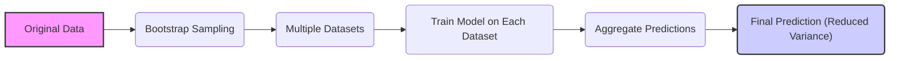
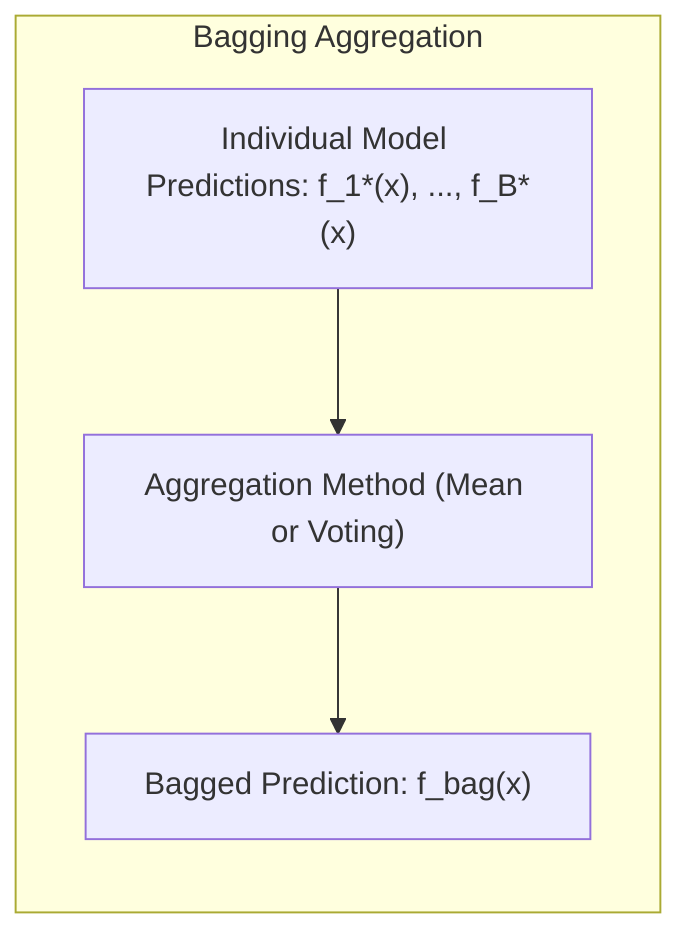
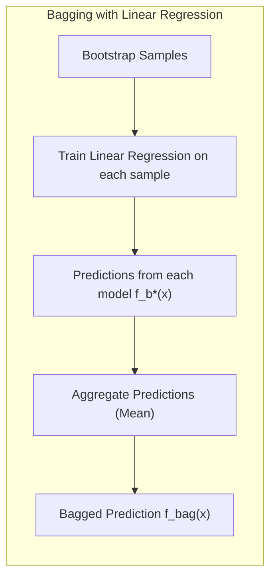
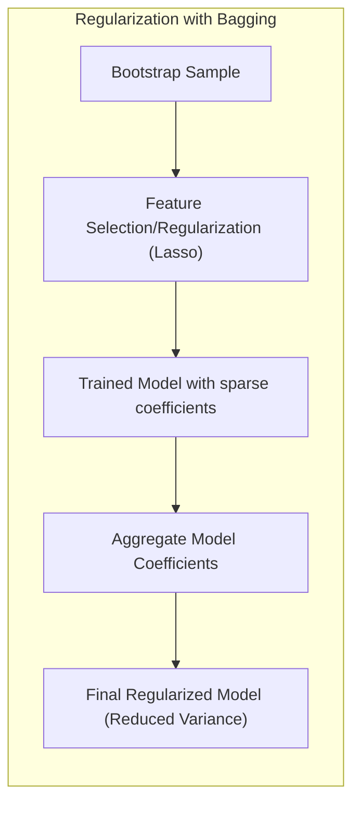
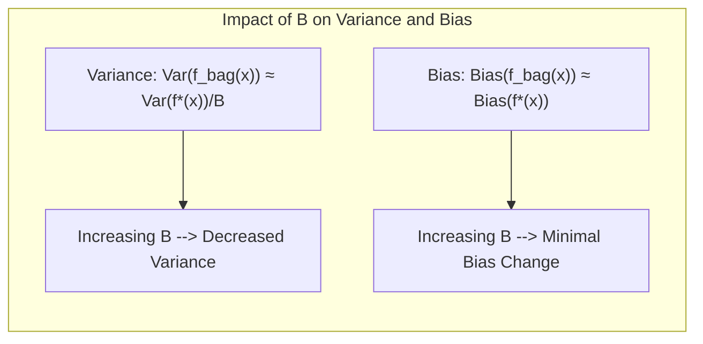

Okay, here's the enhanced text with all mathematical expressions formatted using LaTeX notation:

## Variance Reduction in Bagging



### Introdução

O presente capítulo explora o conceito de **bagging** (Bootstrap Aggregating), uma técnica poderosa no arsenal do aprendizado de máquina para reduzir a variância de estimativas e previsões [^8.1], [^8.7]. O bagging é uma metodologia que se baseia na criação de múltiplas amostras de dados através do **bootstrap**, e no treinamento de um modelo em cada uma dessas amostras. Em seguida, as previsões desses modelos são agregadas para produzir uma estimativa final. Esta técnica é especialmente útil para modelos instáveis, como **árvores de decisão**, onde pequenas mudanças nos dados de treinamento podem levar a grandes variações nas previsões. O objetivo principal do bagging é criar um modelo mais robusto, com menor variabilidade, e consequentemente com maior capacidade de generalização.

### Conceitos Fundamentais

**Conceito 1:** O **Bootstrap** é uma técnica de reamostragem que envolve a amostragem com reposição a partir dos dados de treinamento originais [^8.2]. Essa amostragem gera um número *B* de novos datasets, cada um com o mesmo tamanho que o dataset original, mas com algumas observações repetidas e outras omitidas. O bootstrap é fundamental para o bagging, pois fornece a base para criar as múltiplas versões do modelo.

**Lemma 1:** Dado um conjunto de dados $Z = \{z_1, z_2, \ldots, z_N\}$, onde $z_i = (x_i, y_i)$, a probabilidade de uma observação $z_i$ não ser selecionada em uma amostra bootstrap de tamanho *N* é $(1 - \frac{1}{N})^N$. Quando $N \rightarrow \infty$, esta probabilidade converge para $e^{-1} \approx 0.368$ [^8.2.1].
$$\lim_{N\to\infty} (1 - \frac{1}{N})^N = e^{-1} \approx 0.368$$
Isso implica que cerca de 63.2% das observações originais estarão em cada amostra bootstrap, enquanto o restante não. Este resultado justifica por que amostras bootstrap são “suficientemente” diferentes para induzir diversidade nos modelos. $\blacksquare$

> 💡 **Exemplo Numérico:**  Imagine que temos um dataset com 100 observações (N=100). Ao criar uma amostra bootstrap, cada observação tem uma probabilidade de 1/100 de ser selecionada a cada sorteio. Após 100 sorteios, algumas observações serão selecionadas mais de uma vez, enquanto outras não serão selecionadas. A probabilidade de uma observação *não* ser selecionada é aproximadamente $e^{-1} \approx 0.368$, o que significa que cerca de 37 das 100 observações originais não estarão em uma dada amostra bootstrap. Por outro lado, aproximadamente 63 observações do dataset original estarão presentes na amostra bootstrap, algumas repetidas. Este processo gera diversidade entre as amostras bootstrap, o que é crucial para o bagging.
>
>  ```python
>  import numpy as np
>
>  def bootstrap_sample(data):
>    n = len(data)
>    indices = np.random.choice(n, size=n, replace=True)
>    return data[indices]
>
>  # Criando um conjunto de dados de exemplo
>  data = np.arange(100)
>
>  # Gerando uma amostra bootstrap
>  sample = bootstrap_sample(data)
>
>  # Verificando a ocorrência de cada elemento
>  unique, counts = np.unique(sample, return_counts=True)
>  print("Unique elements in bootstrap sample:", unique)
>  print("Counts of each unique element:", counts)
>
>  # Estimativa do percentual de elementos não selecionados
>  original_not_selected = 0
>  for i in range(100):
>      if i not in unique:
>          original_not_selected += 1
>  print(f"Elements from the original set not in the bootstrap set: {original_not_selected}")
>  print(f"Proportion not selected: {original_not_selected/100:.3f}")
>  ```

**Conceito 2:** O **Bagging**, ou Bootstrap Aggregating, consiste em treinar um modelo em cada uma das amostras bootstrap geradas e, em seguida, agregar as previsões [^8.7]. Para problemas de regressão, essa agregação é geralmente a média das previsões dos modelos individuais. Para problemas de classificação, a agregação pode ser por meio de votação majoritária, ou seja, a classe mais predita pelos modelos é a classe final.
$$f_{bag}(x) = \frac{1}{B}\sum_{b=1}^{B} f_b^*(x)$$
onde $f_b^*(x)$ é a previsão do modelo treinado na amostra bootstrap *b*, e *B* é o número total de amostras bootstrap.



> 💡 **Exemplo Numérico (Regressão):** Suponha que temos um problema de regressão, onde queremos prever o preço de uma casa com base em suas características. Usamos o bagging com B=3 árvores de decisão. Cada árvore é treinada em uma amostra bootstrap diferente do conjunto de dados original. Para uma nova casa com características x, as três árvores retornam as seguintes previsões de preço (em milhares de dólares):
>
> *   Árvore 1: f₁\*(x) = 350
> *   Árvore 2: f₂\*(x) = 370
> *   Árvore 3: f₃\*(x) = 360
>
> A previsão agregada pelo bagging seria:
>
> $$f_{bag}(x) = \frac{350 + 370 + 360}{3} = \frac{1080}{3} = 360$$
>
> Assim, a previsão final do bagging é de 360 mil dólares.
>
> 💡 **Exemplo Numérico (Classificação):** Em um problema de classificação, queremos classificar emails como spam ou não-spam. Usamos bagging com B=5 árvores de decisão. Para um determinado email, cada árvore faz a seguinte classificação:
>
>  * Árvore 1: spam
>  * Árvore 2: não-spam
>  * Árvore 3: spam
>  * Árvore 4: não-spam
>  * Árvore 5: spam
>
> A classe predita pelo bagging seria "spam", pois é a classe majoritária (3 de 5 árvores classificaram como spam).

**Corolário 1:** Se o modelo base é instável, ou seja, sofre grandes alterações nas previsões quando pequenas alterações nos dados de treinamento são feitas, o bagging pode reduzir a variância da estimativa final [^8.7]. Isso ocorre porque o bagging agrega as previsões de muitos modelos instáveis, e essa agregação tende a ser mais estável.

**Conceito 3:** Em problemas de classificação, além da votação majoritária, o bagging pode ser implementado agregando as *probabilidades* estimadas para cada classe por cada modelo [^8.7]. Essa abordagem geralmente leva a melhores estimativas das probabilidades de classe e também pode reduzir a variância.

> 💡 **Exemplo Numérico (Classificação com Probabilidades):**  No mesmo problema de classificação de spam, em vez de usar votação majoritária, cada árvore estima a probabilidade de um email ser spam. As probabilidades retornadas pelas 5 árvores para um email são:
>
> * Árvore 1: P(spam) = 0.9
> * Árvore 2: P(spam) = 0.3
> * Árvore 3: P(spam) = 0.8
> * Árvore 4: P(spam) = 0.4
> * Árvore 5: P(spam) = 0.7
>
> A probabilidade agregada pelo bagging seria:
> $$P_{bag}(spam) = \frac{0.9 + 0.3 + 0.8 + 0.4 + 0.7}{5} = 0.62$$
>
> A previsão final seria classificar o email como "spam", já que a probabilidade agregada é maior que 0.5. Além disso, temos uma estimativa da probabilidade do email ser spam, o que é mais informativo do que apenas a classificação.
> ```python
> import numpy as np
>
> # Probabilidades de spam de cada modelo
> probs = np.array([0.9, 0.3, 0.8, 0.4, 0.7])
>
> # Calcula a média
> avg_prob = np.mean(probs)
>
> print(f"Probabilidade média de spam: {avg_prob:.2f}")
>
> # Classifica com base no threshold de 0.5
> if avg_prob > 0.5:
>    print("Classificado como spam")
> else:
>    print("Classificado como não-spam")
> ```

> ⚠️ **Nota Importante**:  O bagging é uma técnica de redução de variância que não altera significativamente o viés do modelo [^8.7]. A técnica funciona melhor quando os modelos base são instáveis e com pouca tendência.
> ❗ **Ponto de Atenção**: O bagging, em alguns casos, pode não funcionar bem se os modelos base forem muito fortes ou estáveis. Nesses casos, as previsões dos modelos individuais serão muito similares e a agregação não trará muitos ganhos.
> ✔️ **Destaque**: O bagging funciona bem em conjunto com árvores de decisão. A combinação de instabilidade das árvores com o poder de redução de variância do bagging leva a bons resultados.

### Regressão Linear e Mínimos Quadrados para Classificação



O bagging pode ser aplicado a modelos de regressão linear de uma maneira específica e com certas limitações [^8.7]. Ao aplicá-lo, para cada amostra bootstrap, treina-se um modelo linear, obtendo um conjunto de coeficientes. A agregação das previsões se dá calculando a média das predições obtidas em cada um dos modelos treinados. Entretanto, como a regressão linear é um método geralmente estável, o bagging terá pouco efeito quando aplicado diretamente [^8.7]. Em outras palavras, as predições de regressões lineares em diferentes amostras bootstrap serão muito similares e, ao agregar, não haverá redução na variância.

**Lemma 2:** Seja $f(x)$ uma função de regressão linear e $f_b^*(x)$ a função de regressão linear estimada na amostra bootstrap *b*. Se os parâmetros do modelo linear forem estimados por Ordinary Least Squares (OLS), sob a suposição de que os erros são independentes e identicamente distribuídos, então:
$$\lim_{B\to\infty} \frac{1}{B} \sum_{b=1}^B f_b^*(x) = f(x)$$
Isso significa que, no limite quando o número de amostras bootstrap tende ao infinito, a agregação das previsões dos modelos lineares coincide com a previsão do modelo linear treinado no dataset original. $\blacksquare$

> 💡 **Exemplo Numérico:** Consideremos uma regressão linear simples, onde $y = \beta_0 + \beta_1x + \epsilon$. Vamos supor que, no dataset original, tenhamos $\beta_0 = 2$ e $\beta_1 = 3$. Após aplicar o bootstrap, obtemos 3 amostras e treinamos 3 modelos lineares, resultando nos seguintes parâmetros:
>
> *   Modelo 1: $\beta_0^* = 2.1, \beta_1^*= 2.9$
> *   Modelo 2: $\beta_0^* = 1.9, \beta_1^*= 3.1$
> *   Modelo 3: $\beta_0^* = 2.0, \beta_1^*= 3.0$
>
> Para um valor de entrada x=5, as previsões dos três modelos são:
>
> *   $f_1^*(5) = 2.1 + 2.9 * 5 = 16.6$
> *   $f_2^*(5) = 1.9 + 3.1 * 5 = 17.4$
> *   $f_3^*(5) = 2.0 + 3.0 * 5 = 17.0$
>
> A previsão agregada pelo bagging é:
>
> $$f_{bag}(5) = \frac{16.6 + 17.4 + 17.0}{3} = 17$$
>
> Observe que a previsão agregada está muito próxima da previsão que seria obtida usando os parâmetros originais ($\beta_0 = 2$ e $\beta_1 = 3$) no mesmo ponto x=5, que é $2 + 3 * 5 = 17$. Isto ilustra o fato de que o bagging tem pouco efeito em modelos lineares, pois as estimativas são muito parecidas nas amostras bootstrap.

**Corolário 2:** Como consequência do Lemma 2, o bagging aplicado a uma regressão linear, onde as predições são agregadas utilizando a média, não apresenta ganho na variância, pois o método é estável e as predições das múltiplas instâncias se aproximam da predição no dataset original. [^8.7].

É crucial entender que a regressão linear é, por natureza, um modelo estável. Sua estimativa não é drasticamente alterada por pequenas perturbações nos dados de treinamento, como aquelas geradas pelo bootstrap. Assim, a agregação por bagging pouco afeta a predição. Por outro lado, modelos altamente não-lineares e instáveis, como as árvores de decisão, se beneficiam grandemente do bagging.

### Métodos de Seleção de Variáveis e Regularização em Classificação



O bagging pode ser combinado com métodos de seleção de variáveis e regularização para melhorar ainda mais o desempenho do modelo, especialmente em cenários com alta dimensionalidade e com a presença de *outliers* [^8.7]. Ao aplicar bagging, podemos incluir dentro do *pipeline* de treinamento de cada modelo uma etapa de seleção de variáveis, como por exemplo *feature selection* através de *Lasso*, ou de regularização, como *Ridge Regression*, para aumentar ainda mais a estabilidade dos modelos individuais. A estabilidade dos modelos individuais garante que, ao serem agregados pelo bagging, a variância seja reduzida.

**Lemma 3:** Suponha que em cada amostra bootstrap, apliquemos a regressão logística com regularização L1 (*Lasso*). Seja $\hat{\beta_b}$ o vetor de parâmetros estimados na amostra *b*. O uso da regularização L1 tende a gerar vetores $\hat{\beta_b}$ com muitos componentes iguais a zero, ou seja, modelos esparsos, e com alta diversidade. Após o bagging, com $B$ amostras bootstraps, a agregação dos $\hat{\beta_b}$ gera uma estimativa final com baixa variância e capaz de realizar seleção de variáveis.
$$\hat{\beta} = \frac{1}{B} \sum_{b=1}^{B} \hat{\beta_b}$$

**Prova do Lemma 3:** A regularização L1 induz esparsidade ao adicionar uma penalidade proporcional à soma dos valores absolutos dos coeficientes, isto é, $\|\beta\|_1$, à função de custo da regressão logística. O efeito da penalidade é o de encolher coeficientes com pouco efeito preditivo para 0, gerando um modelo com alta diversidade, o que beneficia a agregação pelo bagging. $\blacksquare$

> 💡 **Exemplo Numérico (Lasso com Bagging):** Imagine um problema de classificação com muitas variáveis (alta dimensionalidade). Usamos regressão logística com regularização L1 (Lasso) em combinação com bagging. Suponha que, após o treinamento em três amostras bootstrap, obtemos os seguintes vetores de coeficientes (após regularização):
>
> *   $\hat{\beta_1} = [0.5, 0, 0.2, 0, -0.1, 0]$
> *   $\hat{\beta_2} = [0.6, 0, 0, 0.1, -0.2, 0]$
> *   $\hat{\beta_3} = [0.5, 0, 0.1, 0, -0.1, 0.1]$
>
> Observe que muitos coeficientes são zero (esparsidade). Ao agregar esses coeficientes usando bagging (média), obtemos:
>
> $$\hat{\beta} = \frac{1}{3} [ (0.5+0.6+0.5), (0+0+0), (0.2+0+0.1), (0+0.1+0), (-0.1-0.2-0.1), (0+0+0.1)]$$
> $$\hat{\beta} = [0.53, 0, 0.1, 0.03, -0.13, 0.03]$$
>
> O vetor final tem coeficientes menores, mas ainda mantém as variáveis mais importantes. O bagging, neste caso, reduz a variância da estimativa dos coeficientes.
>
> ```python
> import numpy as np
>
> # Coeficientes dos modelos Lasso nas amostras bootstrap
> beta1 = np.array([0.5, 0, 0.2, 0, -0.1, 0])
> beta2 = np.array([0.6, 0, 0, 0.1, -0.2, 0])
> beta3 = np.array([0.5, 0, 0.1, 0, -0.1, 0.1])
>
> # Agregando os coeficientes
> beta_bagged = np.mean([beta1, beta2, beta3], axis=0)
>
> print(f"Coeficientes agregados: {beta_bagged}")
> ```

**Corolário 3:** A combinação de métodos de seleção de variáveis como *Lasso* com o *bagging* leva a modelos que são simultaneamente robustos (baixa variância) e mais interpretáveis (esparsos), além de apresentar grande capacidade preditiva [^8.7]. Isso é especialmente útil em problemas com alta dimensionalidade, onde a seleção de variáveis pode melhorar a capacidade preditiva e a interpretabilidade do modelo.

> ⚠️ **Ponto Crucial**: A escolha da técnica de regularização (L1, L2, ou Elastic Net) no contexto do bagging deve ser feita com base nas características do problema. A penalização L1 é mais adequada para a seleção de variáveis, enquanto a penalização L2 é melhor para reduzir os pesos.
>
### Separating Hyperplanes e Perceptrons
O bagging não é diretamente aplicável a modelos como *separating hyperplanes* e *perceptrons* da mesma maneira que é para árvores de decisão e regressões. A questão central é que esses modelos têm baixa variância, pois a solução ótima é usualmente única [^8.7]. Em geral, o bagging aplicado a modelos estáveis como *separating hyperplanes* e *perceptrons* terá pouco ou nenhum efeito, pois a estabilidade intrínseca desses métodos leva a pouca diversidade entre os modelos individuais.

### Pergunta Teórica Avançada: Qual o efeito de aumentar o número de amostras bootstrap em bagging, tanto em termos de variância quanto de viés?
**Resposta:**
O efeito de aumentar o número de amostras bootstrap, *B*, em bagging, é principalmente sobre a variância [^8.7]. O viés, por outro lado, é afetado de forma menos significativa. Como visto, a estimativa do bagging é dada por:
$$f_{bag}(x) = \frac{1}{B}\sum_{b=1}^{B} f_b^*(x)$$
onde $f_b^*(x)$ é a previsão do modelo treinado em cada uma das $B$ amostras bootstrap. Em teoria, quando $B \rightarrow \infty$, a variância da estimativa *bagged* tende a zero (a convergência é para a média populacional) [^8.7], assumindo que os modelos treinados nas amostras bootstrap sejam independentes (o que não é o caso, mas a correlação é pequena, na prática).
$$Var[f_{bag}(x)] = Var[\frac{1}{B}\sum_{b=1}^{B} f_b^*(x)] = \frac{1}{B^2} \sum_{b=1}^B Var[f_b^*(x)] \approx \frac{Var[f^*(x)]}{B}$$
Em termos de viés, o bagging não altera significativamente o viés dos modelos individuais. Como cada $f_b^*(x)$ é uma estimativa do modelo base, e o bagging faz uma média dessas estimativas, o viés final da estimativa bagged será, aproximadamente, o mesmo da estimativa do modelo base.
$$Bias[f_{bag}(x)] = E[f_{bag}(x) - f(x)] = E[\frac{1}{B}\sum_{b=1}^B f_b^*(x) - f(x)] = \frac{1}{B}\sum_{b=1}^B E[f_b^*(x) - f(x)] \approx E[f^*(x) - f(x)]$$
Portanto, aumentar *B* reduz a variância, mas não afeta muito o viés. Isso é fundamental porque a redução da variância tende a levar a uma maior capacidade de generalização do modelo.



> 💡 **Exemplo Numérico:** Vamos simular um exemplo com árvores de decisão. Consideremos que a variância da previsão de uma árvore de decisão individual seja  $Var[f^*(x)] = 1.5$. Se usarmos bagging com B=10 árvores, a variância da previsão agregada será aproximadamente:
>
> $$Var[f_{bag}(x)] \approx \frac{1.5}{10} = 0.15$$
>
> Se aumentarmos para B=100 árvores:
>
>  $$Var[f_{bag}(x)] \approx \frac{1.5}{100} = 0.015$$
>
> Isso demonstra como o aumento do número de amostras bootstrap reduz a variância da estimativa do bagging. O viés, por outro lado, permanece aproximadamente o mesmo, já que a média dos modelos individuais tende a ter o mesmo viés do modelo individual.

### Conclusão

O bagging é uma técnica eficaz para reduzir a variância de modelos instáveis, como árvores de decisão, e pode ser combinado com métodos de seleção de variáveis e regularização para obter modelos ainda mais robustos e precisos [^8.7]. Embora o bagging não altere significativamente o viés do modelo, a redução da variância leva a uma maior capacidade de generalização, e o conceito de agregação de previsões pode ser estendido para modelos mais complexos com *boosting* e *stacking*.

### Footnotes

[^8.1]: "In this chapter we provide a general exposition of the maximum likelihood approach, as well as the Bayesian method for inference." *(Trecho de "Model Inference and Averaging")*
[^8.2]: "The bootstrap method provides a direct computational way of assessing uncertainty, by sampling from the training data." *(Trecho de "Model Inference and Averaging")*
[^8.2.1]:  "Suppose we divide to fit a cubic spline to the data, with three knots placed at the quartiles of the X values." *(Trecho de "Model Inference and Averaging")*
[^8.7]: "Earlier we introduced the bootstrap as a way of assessing the accuracy of a parameter estimate or a prediction. Here we show how to use the bootstrap to improve the estimate or prediction itself." *(Trecho de "Model Inference and Averaging")*

<!-- END DOCUMENT -->
