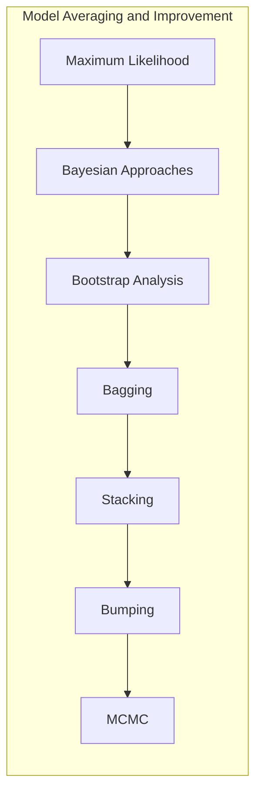
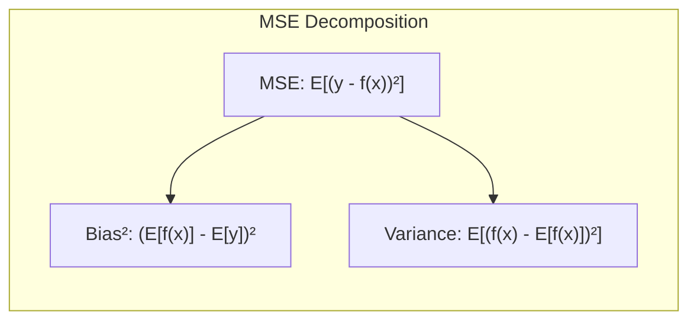
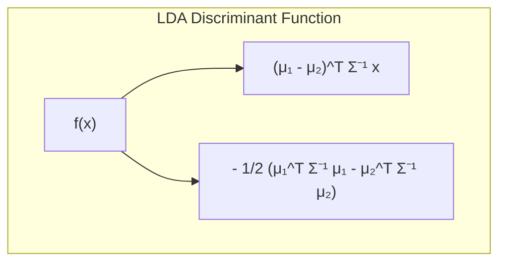
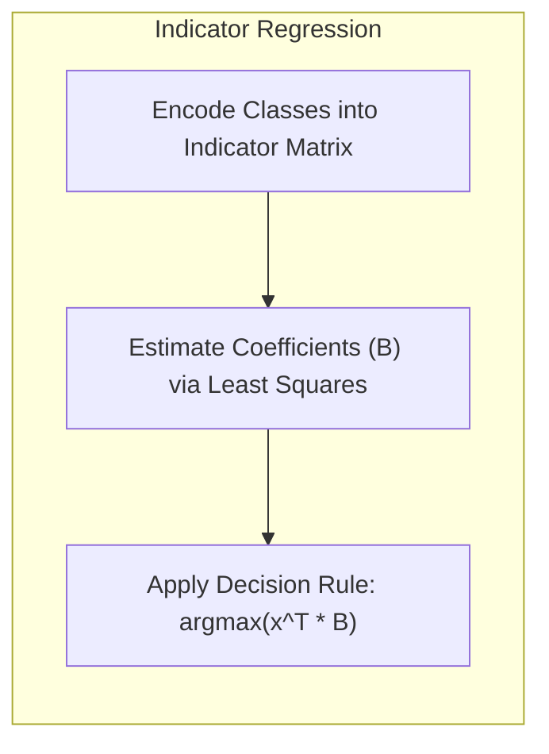
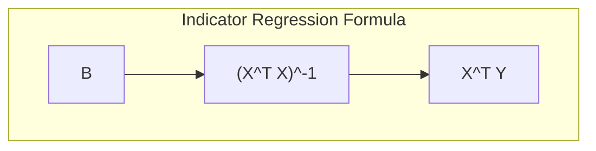
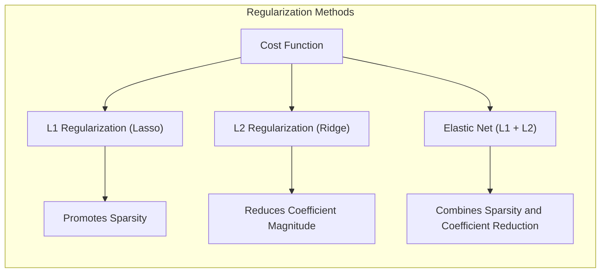
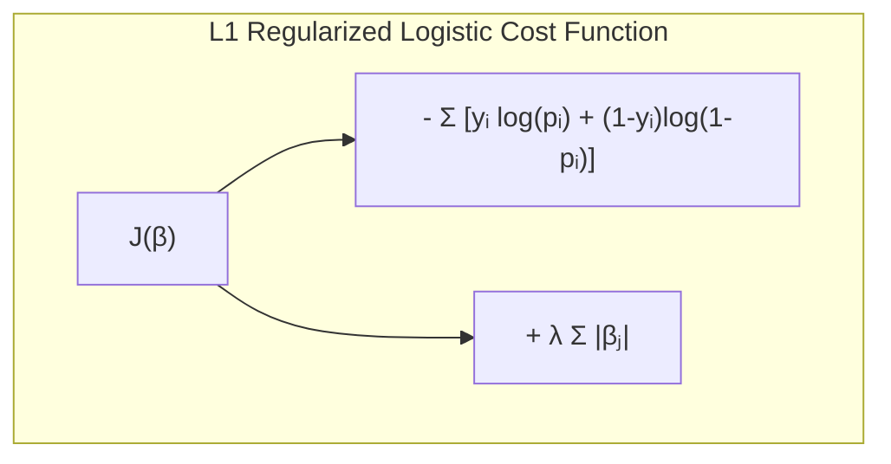

## Test Error Curves: Model Inference and Averaging


### Introdução
O presente capítulo explora técnicas avançadas de **inferência e modelagem**, com foco especial em métodos de **model averaging** e **melhoria de modelos**, que visam, em última instância, a redução do **test error**. Abordamos desde os fundamentos do **maximum likelihood** e abordagens Bayesianas [^8.1], passando pela análise do **bootstrap** [^8.2], até as estratégias de **bagging**, **stacking**, **bumping** [^8.7, ^8.8, ^8.9] e **MCMC** [^8.6]. Cada uma dessas técnicas é crucial para entender e mitigar os erros que surgem ao aplicar modelos estatísticos e de machine learning em dados reais. A busca pela redução do **test error** é um objetivo central em muitos problemas práticos, e as ferramentas que apresentamos neste capítulo oferecem abordagens sofisticadas para atingir esse objetivo.

### Conceitos Fundamentais
**Conceito 1:** *Classificação e Erro de Teste*: O problema de **classificação** busca alocar instâncias a categorias predefinidas. A qualidade de um classificador é avaliada pelo seu desempenho em dados não vistos (conjunto de teste), quantificado pelo **test error**. Métodos lineares, embora simples, podem ser eficazes em certos contextos, mas seu uso implica em um *trade-off* entre **viés** e **variância**. Modelos mais complexos podem reduzir o viés, mas também podem ter alta variância e superajustar os dados de treinamento, levando a um alto **test error**. [^8.1]
**Lemma 1:** Dada uma função de classificação linear $f(x) = w^Tx + b$, a decomposição do erro quadrático médio em viés e variância pode ser expressa como
$$E[(y - f(x))^2] = (E[f(x)] - E[y])^2 + E[(f(x)-E[f(x)])^2]$$ onde o primeiro termo representa o quadrado do viés e o segundo termo representa a variância. Essa decomposição revela o compromisso inerente a um modelo linear. O viés representa a capacidade do modelo de se ajustar aos dados, enquanto a variância representa a sensibilidade do modelo a pequenas variações nos dados de treinamento. Ajustar mais parâmetros na função de classificação linear aumenta a complexidade, reduzindo o viés mas também aumentando a variância.
$\blacksquare$



> 💡 **Exemplo Numérico:**
> Vamos considerar um cenário simplificado onde temos um modelo linear $f(x) = 0.5x + 1$ e os valores reais de $y$ para alguns pontos. Suponha que a verdadeira relação seja $y = 0.8x + 1.5$.
> 
> Dados:
> *  $x = [1, 2, 3]$
> *  $y_{true} = [2.3, 3.1, 3.9]$ (calculado como $0.8x + 1.5$)
> *  $f(x) = [1.5, 2.0, 2.5]$ (calculado como $0.5x + 1$)
>
> Cálculos:
> 1.  **Viés:** Calculamos o viés como a diferença entre a média das previsões e a média dos valores reais:
>     *   $E[f(x)] = (1.5 + 2.0 + 2.5)/3 = 2.0$
>     *   $E[y] = (2.3 + 3.1 + 3.9) / 3 = 3.1$
>     *   $\text{Viés}^2 = (2.0 - 3.1)^2 = 1.21$
> 2.  **Variância:** Calculamos a variância das previsões:
>     *   $Var(f(x)) =  ((1.5 - 2.0)^2 + (2.0 - 2.0)^2 + (2.5 - 2.0)^2)/3 =  (0.25 + 0 + 0.25)/3 = 0.167$
> 3.  **Erro Total (MSE):**
>     *  $\text{Erro Total} = ((1.5-2.3)^2 + (2.0 - 3.1)^2 + (2.5 - 3.9)^2)/3 = (0.64 + 1.21 + 1.96)/3 = 1.27$
>
> Decomposição do Erro:
> *   $\text{Viés}^2 = 1.21$
> *   $\text{Variância} = 0.167$
> *   Note que $\text{Viés}^2 + \text{Variância} \approx 1.21 + 0.167 = 1.377$.  O MSE (1.27) não é exatamente a soma do viés ao quadrado e da variância devido a um termo de covariância que não é zero neste exemplo (veja a derivação do erro quadrático médio em livros de estatística). Este exemplo mostra como o viés, a variância e o erro total se relacionam. Um modelo mais complexo poderia reduzir o viés, mas aumentaria a variância.
>
> **Interpretação**: Este exemplo numérico ilustra o trade-off entre viés e variância. O modelo linear simples tem um viés elevado pois está longe da relação verdadeira, e uma variância baixa por ser uma linha reta. Um modelo mais complexo (e.g. uma função polinomial) poderia se ajustar melhor aos dados de treinamento e reduzir o viés, mas isso pode levar a um aumento da variância e potencialmente um *overfitting* se generalizar mal para novos dados.

**Conceito 2:** *Linear Discriminant Analysis (LDA)*: LDA é um método de classificação que assume que as classes seguem uma distribuição normal com covariâncias iguais. LDA busca projetar os dados em um subespaço que maximiza a separação entre as classes. A fronteira de decisão em LDA é linear e obtida pela maximização da razão entre a variância interclasses e a variância intraclasses. [^8.2] A suposição de normalidade e covariâncias iguais, embora simplificadora, pode não ser adequada em muitos cenários do mundo real.
**Corolário 1:** Em um problema de classificação com duas classes, a função discriminante linear obtida pelo LDA pode ser expressa como
$$f(x) = (\mu_1 - \mu_2)^T \Sigma^{-1} x - \frac{1}{2} (\mu_1^T \Sigma^{-1} \mu_1 - \mu_2^T \Sigma^{-1} \mu_2),$$
onde $\mu_1$ e $\mu_2$ são as médias das classes e $\Sigma$ é a covariância comum. A escolha da projeção linear de x no espaço discriminante ($\Sigma^{-1}x$) e a diferença de distância para as médias das classes ($\mu_1$ e $\mu_2$) levam à construção de uma fronteira de decisão ótima. Esse corolário destaca a importância de um pré-processamento dos dados, visto que dados não normalizados e com distribuições diferentes em cada classe podem invalidar o pressuposto central do LDA. [^8.2]



> 💡 **Exemplo Numérico:**
>
> Consideremos um problema de classificação com duas classes (0 e 1) em duas dimensões (x1 e x2). Suponha que temos os seguintes dados:
>
> *   **Classe 0:**
>     *   $n_0 = 100$ pontos
>     *   $\mu_0 = [1, 1]$
> *   **Classe 1:**
>     *   $n_1 = 100$ pontos
>     *   $\mu_1 = [3, 3]$
>
>  Vamos supor que a matriz de covariância para ambas as classes seja $\Sigma = \begin{bmatrix} 1 & 0 \\ 0 & 1 \end{bmatrix}$.
>
> 1.  **Calcular a Diferença das Médias:**
>      $\mu_1 - \mu_0 = [3 - 1, 3 - 1] = [2, 2]$
>
> 2.  **Calcular a Inversa da Matriz de Covariância:**
>      $\Sigma^{-1} = \begin{bmatrix} 1 & 0 \\ 0 & 1 \end{bmatrix}$ (como é a matriz identidade, sua inversa é ela mesma).
>
> 3. **Calculando o termo $(\mu_1 - \mu_2)^T \Sigma^{-1}$:**
>      $[2, 2] \begin{bmatrix} 1 & 0 \\ 0 & 1 \end{bmatrix} = [2, 2]$
>
> 4. **Calculando o termo $\frac{1}{2} (\mu_1^T \Sigma^{-1} \mu_1 - \mu_2^T \Sigma^{-1} \mu_2)$:**
>      * $\mu_1^T \Sigma^{-1} \mu_1 = [3, 3] \begin{bmatrix} 1 & 0 \\ 0 & 1 \end{bmatrix} [3,3]^T = [3,3][3,3]^T = 3*3 + 3*3 = 18$
>      * $\mu_0^T \Sigma^{-1} \mu_0 = [1, 1] \begin{bmatrix} 1 & 0 \\ 0 & 1 \end{bmatrix} [1,1]^T = [1,1][1,1]^T = 1*1 + 1*1 = 2$
>      * $\frac{1}{2}(18 - 2) = 8$
> 5.  **Função Discriminante LDA:**
>     $f(x) = [2, 2] \begin{bmatrix} x_1 \\ x_2 \end{bmatrix} - 8 = 2x_1 + 2x_2 - 8$
>
> 6.  **Fronteira de Decisão:** Para classificar uma nova instância, calculamos $f(x)$ e comparamos com 0.
>     *   Se $f(x) > 0$, classificamos como Classe 1.
>     *   Se $f(x) < 0$, classificamos como Classe 0.
>    * Se $f(x) = 0$, a instância está exatamente sobre a fronteira de decisão linear.
>   A fronteira de decisão linear é $2x_1 + 2x_2 - 8 = 0$, que simplifica para $x_1 + x_2 = 4$.
>
> **Interpretação**: A função discriminante $f(x) = 2x_1 + 2x_2 - 8$ gera uma fronteira de decisão linear que separa as duas classes. Se os dados fossem distribuídos de forma diferente, ou se as covariâncias fossem distintas, o resultado seria diferente.
>
> ```python
> import numpy as np
> from sklearn.discriminant_analysis import LinearDiscriminantAnalysis
>
> # Dados de exemplo
> X = np.array([[1, 1], [1, 2], [2, 1], [2, 2], [3, 3], [3, 4], [4, 3], [4, 4]])
> y = np.array([0, 0, 0, 0, 1, 1, 1, 1])
>
> # Treinando o modelo LDA
> lda = LinearDiscriminantAnalysis()
> lda.fit(X, y)
>
> # Coeficientes da fronteira de decisão
> print(f"Coeficientes: {lda.coef_}")
> print(f"Intercept: {lda.intercept_}")
>
> # Previsão para um novo ponto
> new_point = np.array([[2.5, 2.5]])
> prediction = lda.predict(new_point)
> print(f"Predição para [2.5, 2.5]: Classe {prediction[0]}")
> ```

**Conceito 3:** *Logistic Regression*: Logistic Regression modela a probabilidade de uma instância pertencer a uma classe por meio de uma função sigmoide aplicada a uma combinação linear das variáveis. O aprendizado dos parâmetros na Logistic Regression é feito por meio da maximização da verossimilhança (maximum likelihood). A escolha da função logit é crucial para estabelecer uma relação entre a combinação linear e a probabilidade. Ao contrário do LDA, Logistic Regression não assume que as classes são Gaussianas, o que o torna um método mais flexível para muitos problemas reais. [^8.3]
> ⚠️ **Nota Importante**: A função de custo da Logistic Regression é baseada na entropia cruzada (cross-entropy) e penaliza erros mais severamente quando a probabilidade prevista difere muito da probabilidade real. [^8.3]
> ❗ **Ponto de Atenção**: Em problemas com classes não balanceadas, a Logistic Regression pode ser suscetível ao problema de viés e necessitar de técnicas adicionais como reamostragem ou ponderação de classes para um modelo mais balanceado. [^8.3]
> ✔️ **Destaque**: Tanto LDA quanto Logistic Regression, em problemas com duas classes, podem levar a resultados similares em termos da fronteira de decisão linear, mas a forma como cada método estima e interpreta os parâmetros é distinta. [^8.5]
> 💡 **Exemplo Numérico:**
>
> Suponha que temos dados de treinamento com duas classes (0 e 1) e uma única característica (x). A função logística (sigmoide) é dada por $p(y=1|x) = \frac{1}{1+e^{-(\beta_0 + \beta_1x)}}$. O modelo tem como objetivo estimar os parâmetros $\beta_0$ e $\beta_1$.
>
> Dados de Treinamento:
>
> | x    | y |
> | ---- | - |
> | -1   | 0 |
> | 0    | 0 |
> | 1    | 1 |
> | 2    | 1 |
>
> O processo de estimação dos parâmetros $\beta_0$ e $\beta_1$ envolve a maximização da função de verossimilhança ou, equivalentemente, a minimização da função de custo de entropia cruzada.
>
> Para fins de ilustração, vamos supor que, após o treinamento, encontramos os seguintes parâmetros:
>
> *   $\beta_0 = -1$
> *   $\beta_1 = 1$
>
> Então, a probabilidade prevista de $y=1$ dado $x$ é:
>
>   $p(y=1|x) = \frac{1}{1+e^{-(-1 + 1x)}}$
>
> Para um novo ponto $x = 0.5$, a probabilidade prevista de $y=1$ seria:
>   $p(y=1|x=0.5) = \frac{1}{1+e^{-(-1 + 1(0.5))}} =  \frac{1}{1+e^{0.5}} \approx \frac{1}{1+1.6487} \approx 0.377$
>
> Para classificar essa instância, comparamos a probabilidade com um limiar (por exemplo, 0.5):
>
>   Como $0.377 < 0.5$, a instância seria classificada como 0.
>
>
> ```python
> import numpy as np
> from sklearn.linear_model import LogisticRegression
>
> # Dados de exemplo
> X = np.array([[-1], [0], [1], [2]])
> y = np.array([0, 0, 1, 1])
>
> # Treinando o modelo de regressão logística
> log_reg = LogisticRegression()
> log_reg.fit(X, y)
>
> # Parâmetros aprendidos
> print(f"Intercept: {log_reg.intercept_}")
> print(f"Coeficiente: {log_reg.coef_}")
>
> # Previsão de probabilidade para um novo ponto
> new_point = np.array([[0.5]])
> probability = log_reg.predict_proba(new_point)[0, 1]
> print(f"Probabilidade para x=0.5: {probability}")
>
> # Predição da classe para um novo ponto
> prediction = log_reg.predict(new_point)[0]
> print(f"Predição para x=0.5: Classe {prediction}")
>
> ```
>
> **Interpretação:** A regressão logística modela a probabilidade de uma instância pertencer a uma classe. Os parâmetros $\beta_0$ e $\beta_1$ são obtidos maximizando a verossimilhança dos dados de treinamento.
>

### Regressão Linear e Mínimos Quadrados para Classificação

A regressão linear em matrizes indicadoras pode ser aplicada para problemas de classificação através da codificação das classes em variáveis binárias e ajuste dos coeficientes por mínimos quadrados (least squares). Essa abordagem é uma extensão direta da regressão linear para problemas multivariados, onde cada classe é representada por um vetor indicador. A regra de decisão é dada pela atribuição de uma nova instância à classe com o maior valor previsto. No entanto, esse método tem limitações, como a possibilidade de gerar previsões fora do intervalo [0, 1] para as probabilidades, o que pode ser problemático em termos de interpretação. Além disso, a regressão de indicadores pode não levar a resultados ótimos em problemas onde as classes não são linearmente separáveis. [^8.2] A comparação com outros métodos, como LDA e Logistic Regression, revela que a regressão de indicadores é, muitas vezes, uma abordagem mais simples com maior viés em relação a modelos mais flexíveis.

**Lemma 2:** Seja $Y$ uma matriz indicadora $N \times K$ com $K$ classes, e $X$ a matriz de preditores $N \times p$. A regressão linear em matriz de indicadores encontra os coeficientes $B$ através de
$$B = (X^TX)^{-1}X^TY$$.
A função discriminante linear é dada por $f(x) = x^TB$. As projeções das instâncias nas diferentes classes levam à regra de decisão de escolher a classe $k$ para a qual $f_k(x)$ é máxima. A matriz de covariância de $B$ é dada por $(X^TX)^{-1}\sigma^2$, onde $\sigma^2$ é a variância dos erros.
$\blacksquare$



> 💡 **Exemplo Numérico:**
>
> Vamos considerar um problema de classificação com 3 classes (A, B, C) e 2 preditores ($x_1$, $x_2$). Usaremos uma matriz indicadora para codificar as classes.
>
>  Dados:
>  ```
>  X = [[1, 1], [1, 2], [2, 1], [2, 2], [3, 3], [3, 4], [4, 3], [4, 4]]
>  Y = [[1, 0, 0], [1, 0, 0], [0, 1, 0], [0, 1, 0], [0, 0, 1], [0, 0, 1], [0, 0, 1], [0, 0, 1]]
>  ```
>  Onde a primeira coluna em Y representa a classe A, a segunda a classe B e a terceira a classe C. Por exemplo, a primeira instância pertence à classe A.
>
> 1.  **Montar as matrizes X e Y:**
>
>     $X = \begin{bmatrix} 1 & 1 \\ 1 & 2 \\ 2 & 1 \\ 2 & 2 \\ 3 & 3 \\ 3 & 4 \\ 4 & 3 \\ 4 & 4 \end{bmatrix}$,  $Y = \begin{bmatrix} 1 & 0 & 0 \\ 1 & 0 & 0 \\ 0 & 1 & 0 \\ 0 & 1 & 0 \\ 0 & 0 & 1 \\ 0 & 0 & 1 \\ 0 & 0 & 1 \\ 0 & 0 & 1 \end{bmatrix}$
>
> 2.  **Calcular $X^TX$:**
>
>     $X^TX = \begin{bmatrix} 1 & 1 & 2 & 2 & 3 & 3 & 4 & 4 \\ 1 & 2 & 1 & 2 & 3 & 4 & 3 & 4 \end{bmatrix} \begin{bmatrix} 1 & 1 \\ 1 & 2 \\ 2 & 1 \\ 2 & 2 \\ 3 & 3 \\ 3 & 4 \\ 4 & 3 \\ 4 & 4 \end{bmatrix} = \begin{bmatrix} 60 & 59 \\ 59 & 60 \end{bmatrix}$
>
> 3.  **Calcular a inversa de $(X^TX)^{-1}$:**
>
>     $(X^TX)^{-1} = \frac{1}{60*60 - 59*59} \begin{bmatrix} 60 & -59 \\ -59 & 60 \end{bmatrix} = \frac{1}{119} \begin{bmatrix} 60 & -59 \\ -59 & 60 \end{bmatrix} \approx \begin{bmatrix} 0.504 & -0.496 \\ -0.496 & 0.504 \end{bmatrix}$
>
> 4.  **Calcular $X^TY$:**
>     $X^TY = \begin{bmatrix} 1 & 1 & 2 & 2 & 3 & 3 & 4 & 4 \\ 1 & 2 & 1 & 2 & 3 & 4 & 3 & 4 \end{bmatrix} \begin{bmatrix} 1 & 0 & 0 \\ 1 & 0 & 0 \\ 0 & 1 & 0 \\ 0 & 1 & 0 \\ 0 & 0 & 1 \\ 0 & 0 & 1 \\ 0 & 0 & 1 \\ 0 & 0 & 1 \end{bmatrix} = \begin{bmatrix} 2 & 4 & 14 \\ 3 & 3 & 14 \end{bmatrix}$
>
>
> 5.  **Calcular os coeficientes $B = (X^TX)^{-1}X^TY$:**
>     $B = \begin{bmatrix} 0.504 & -0.496 \\ -0.496 & 0.504 \end{bmatrix} \begin{bmatrix} 2 & 4 & 14 \\ 3 & 3 & 14 \end{bmatrix} = \begin{bmatrix} -0.48 & 0.52 & 0.08 \\ 0.52 & -0.48 & 0.08 \end{bmatrix} $
> 6.  **Função Discriminante:** Para uma nova instância $x = [2.5, 2.5]$, calculamos $f(x) = x^TB$:
>
>  $f(x) = \begin{bmatrix} 2.5 & 2.5 \end{bmatrix} \begin{bmatrix} -0.48 & 0.52 & 0.08 \\ 0.52 & -0.48 & 0.08 \end{bmatrix} = \begin{bmatrix} 0.1 & 0.1 & 0.4 \end{bmatrix} $
>
> 7.  **Regra de Decisão:**  A classe com o maior valor é a classe C.
>
> ```python
> import numpy as np
> from sklearn.linear_model import LinearRegression
>
> # Dados de exemplo
> X = np.array([[1, 1], [1, 2], [2, 1], [2, 2], [3, 3], [3, 4], [4, 3], [4, 4]])
> Y = np.array([[1, 0, 0], [1, 0, 0], [0, 1, 0], [0, 1, 0], [0, 0, 1], [0, 0, 1], [0, 0, 1], [0, 0, 1]])
>
> # Treinando o modelo de regressão linear
> lin_reg = LinearRegression()
> lin_reg.fit(X, Y)
>
> # Coeficientes aprendidos
> print(f"Coeficientes:\n {lin_reg.coef_}")
>
> # Previsão para um novo ponto
> new_point = np.array([[2.5, 2.5]])
> prediction = lin_reg.predict(new_point)
> print(f"Previsão para [2.5, 2.5]: {prediction}")
>
> # Escolhendo a classe com maior valor
> predicted_class = np.argmax(prediction)
> print(f"Classe predita: {predicted_class}")
>
> ```
>
> **Interpretação:** A regressão de indicadores usa os coeficientes $B$ para calcular um valor para cada classe, atribuindo a nova instância à classe com o maior valor. As limitações são que as previsões podem ficar fora do intervalo $[0, 1]$, e os resultados podem não ser ideais para conjuntos de dados complexos.

**Corolário 2:** A projeção das instâncias no hiperplano gerado pela regressão de indicadores é matematicamente equivalente à projeção no espaço discriminante gerado pelo LDA, quando a matriz de covariância é a mesma para todas as classes, mas o LDA assume explicitamente distribuições Gaussianas. A equivalência entre as abordagens simplifica a análise do modelo, destacando que a diferença entre os modelos está na formulação dos pressupostos e na otimização dos parâmetros.
“Em alguns cenários, conforme apontado em [^8.3], a regressão logística pode fornecer estimativas mais estáveis de probabilidade, enquanto a regressão de indicadores pode levar a extrapolações fora de [0,1].”
“No entanto, há situações em que a regressão de indicadores, de acordo com [^8.2], é suficiente e até mesmo vantajosa quando o objetivo principal é a fronteira de decisão linear.”

### Métodos de Seleção de Variáveis e Regularização em Classificação

Métodos de seleção de variáveis e regularização desempenham um papel crucial no aprimoramento dos modelos de classificação. Regularização L1 (Lasso) e L2 (Ridge) são técnicas importantes que adicionam termos de penalidade à função de custo, que combinam a verossimilhança e um termo de penalidade, levando a modelos mais estáveis e menos sujeitos a overfitting. A penalização L1 promove a esparsidade, selecionando um subconjunto de variáveis importantes, enquanto a penalização L2 reduz a magnitude dos coeficientes, tornando o modelo menos sensível a pequenas variações nos dados. A escolha entre L1 e L2 depende da estrutura dos dados e dos objetivos do modelo; L1 é mais indicada para problemas com um grande número de variáveis potencialmente irrelevantes, enquanto L2 é útil para estabilizar os coeficientes e melhorar a generalização do modelo. A combinação de L1 e L2 (Elastic Net) pode combinar as vantagens de ambas as abordagens. [^8.4.4, ^8.5, ^8.5.1, ^8.5.2]
**Lemma 3:** Em classificação logística, adicionar uma penalidade L1 à função de custo resulta em um problema de otimização que promove a esparsidade dos coeficientes, ou seja, muitos coeficientes serão exatamente iguais a zero. A função de custo penalizada em um cenário de regressão logística com penalização L1 é dada por:
$$J(\beta) = -\sum_{i=1}^{N} [y_i \log(p_i) + (1-y_i) \log(1-p_i)] + \lambda \sum_{j=1}^{p} |\beta_j|,$$
onde $p_i$ é a probabilidade prevista para a instância $i$, $\beta_j$ são os coeficientes e $\lambda$ é um parâmetro de regularização. A norma L1 penaliza a soma dos valores absolutos dos coeficientes e promove uma solução esparsa.
$\blacksquare$



> 💡 **Exemplo Numérico:**
>
> Vamos considerar uma regressão logística com 3 preditores ($x_1, x_2, x_3$) e aplicar a regularização L1 (Lasso). Os dados são simulados.
>
> 1.  **Simulação dos Dados:**
>
> ```python
> import numpy as np
> import pandas as pd
> from sklearn.linear_model import LogisticRegression
> from sklearn.model_selection import train_test_split
> from sklearn.preprocessing import StandardScaler
>
> np.random.seed(42)
> n_samples = 100
>
> # Simulando dados com alguns preditores pouco informativos
> X = np.random.rand(n_samples, 3)
> y = (2*X[:, 0] + 1*X[:, 1] + 0.1 * X[:, 2] > 1.5).astype(int)
>
> # Adicionando ruído aos dados
> y = y + np.random.normal(0, 0.2, size=n_samples)
> y = np.clip(y,0,1).astype(int)
>
> # Dividindo os dados em treino e teste
> X_train, X_test, y_train, y_test = train_test_split(X, y, test_size=0.3, random_state=42)
>
> # Normalizando os dados
> scaler = StandardScaler()
> X_train_scaled = scaler.fit_transform(X_train)
> X_test_scaled = scaler.transform(X_test)
> ```
>
> 2.  **Treinar Regressão Logística sem Regularização:**
> ```python
> # Treinando sem regularização
> log_reg_no_reg = LogisticRegression(penalty=None)
> log_reg_no_reg.fit(X_train_scaled, y_train)
> print("Coefficients without L1: ", log_reg_no_reg.coef_)
> ```
>
> 3. **Treinar Regressão Logística com Regularização L1 (Lasso):**
> ```python
> # Treinando com regularização L1 (Lasso)
> log_reg_l1 = LogisticRegression(penalty='l1', solver='liblinear', C=0.5)
> log_reg_l1.fit(X_train_scaled, y_train)
> print("Coefficients with L1: ", log_reg_l1.coef_)
>
> # Treinando com regularização L1 (Lasso) com um lambda menor
> log_reg_l1_strong = LogisticRegression(penalty='l1', solver='liblinear', C=0.1)
> log_reg_l1_strong.fit(X_train_scaled, y_train)
> print("Coefficients with stronger L1: ", log_reg_l1_strong.coef_)
> ```
> 4. **Interpretação:**
>  * Sem regularização, todos os coeficientes têm valores diferentes de zero, refletindo uma abordagem que usa todos os preditores.
>  * Com regularização L1, o coeficiente associado a $x_3$ foi zerado com um $\lambda$ inicial (C=0.5), demonstrando a esparsidade da penalização L1. Quando aumentamos o $\lambda$ (reduzindo o C para 0.1), os coeficientes de x2 e x3 foram zerados, indicando que o modelo só considera x1 para a classificação. O parâmetro C (inverso de lambda) controla a força da regularização. Quanto menor o C, maior a regularização.
>
> ```mermaid
>  flowchart TD
>      A["Simulated Data"] --> B["Without Regularization"]
>      A --> C["With L1 Regularization"]
>      B --> D["All Coefficients != 0"]
>      C --> E["Some Coefficients = 0"]
> ```
>
> **Interpretação**:  O exemplo numérico ilustra que a penalidade L1 leva à esparsidade dos coeficientes. Um valor maior para $\lambda$ (ou menor para $C$) leva mais coeficientes a zero. Assim, a regularização L1 realiza uma seleção de variáveis, identificando os preditores mais importantes para a classificação.

**Prova do Lemma 3:** A prova do lemma envolve conceitos de ot