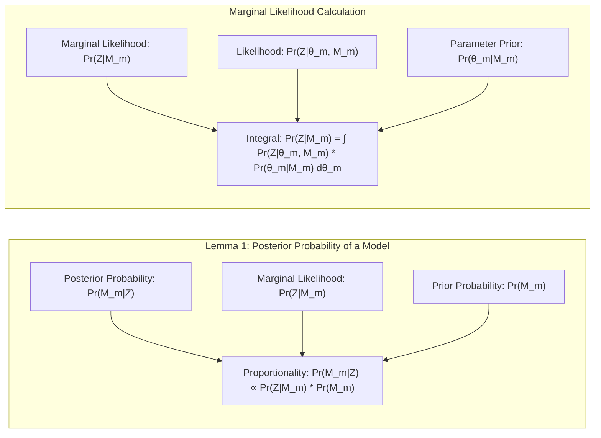
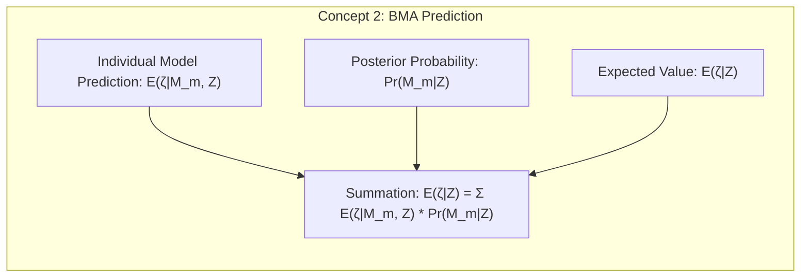
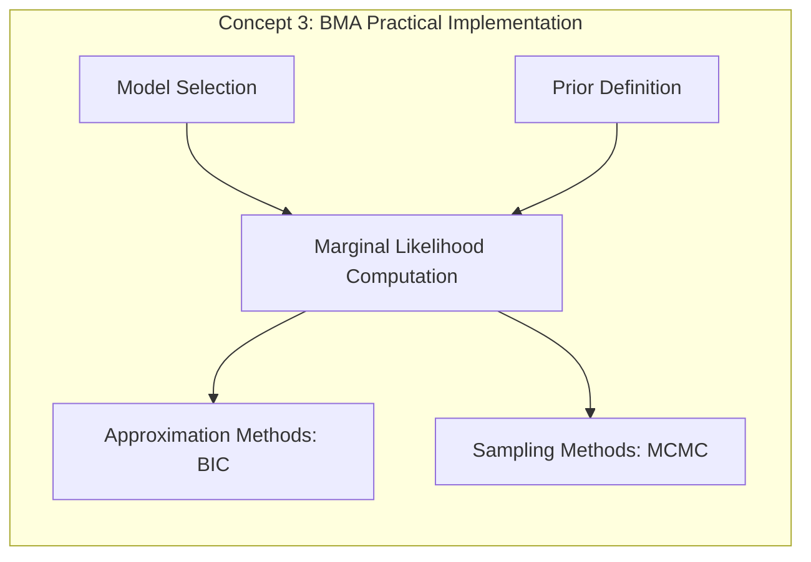
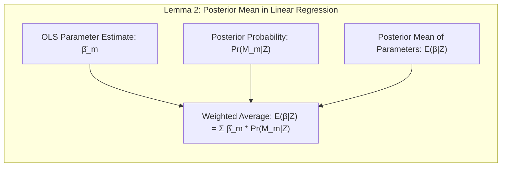
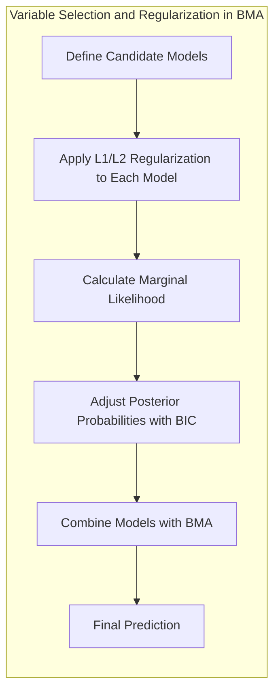
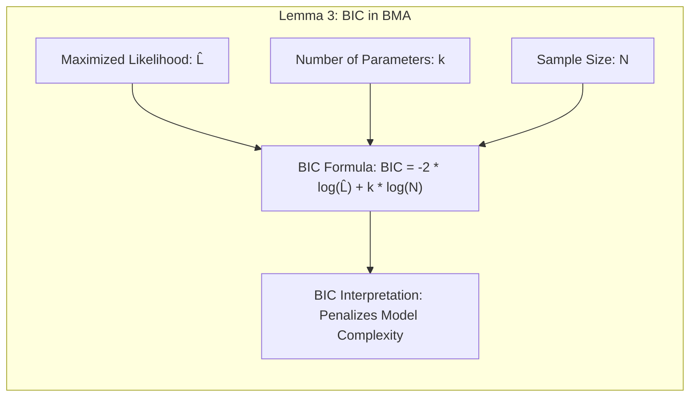
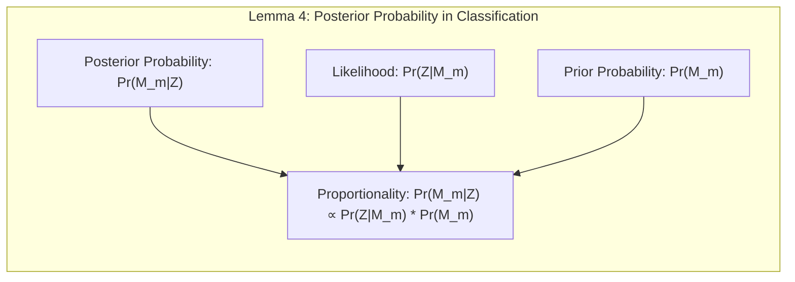

## Bayesian Model Averaging: A Deep Dive

```mermaid
graph LR
    subgraph "Bayesian Model Averaging Process"
        direction TB
        A["Model Candidates: M1, M2, ..., Mn"]
        B["Parameters: θ1, θ2, ..., θn"]
        C["Likelihoods: Pr(Z|θ1), Pr(Z|θ2), ..., Pr(Z|θn)"]
        D["Priors: Pr(θ1), Pr(θ2), ..., Pr(θn)"]
        E["Posterior Distribution: Pr(θ|Z)"]
        F["Combined Prediction"]

        A --> B
        B --> C
        C --> D
        D --> E
        E --> F
    end
```

### Introdução
O **Bayesian Model Averaging (BMA)** é uma técnica poderosa para lidar com a incerteza inerente na escolha de modelos estatísticos e de machine learning [^8.1]. Em vez de selecionar um único modelo como a melhor representação dos dados, o BMA combina as previsões de múltiplos modelos, ponderando-os de acordo com a sua plausibilidade, conforme expresso pelas suas probabilidades posteriores [^8.8]. Este capítulo explora os fundamentos teóricos e práticos do BMA, com foco em técnicas estatísticas e de aprendizado de máquina avançadas. O BMA se destaca por fornecer previsões mais robustas e precisas, especialmente quando há incerteza sobre qual modelo é o mais adequado [^8.8]. As seções seguintes aprofundam os conceitos, técnicas, e análises matemáticas que fundamentam o BMA, culminando numa discussão sobre a sua implementação e limitações.

### Conceitos Fundamentais
**Conceito 1:** O **problema da seleção de modelos** surge quando temos múltiplas representações possíveis (modelos) dos dados, cada um com seus próprios parâmetros e suposições [^8.1]. O BMA se propõe a resolver esse problema, combinando as previsões de todos os modelos candidatos, levando em consideração suas incertezas. A abordagem tradicional de selecionar o "melhor" modelo pode levar a uma superestimação da confiança nas previsões, especialmente se a escolha do modelo for feita com base nos mesmos dados usados para ajuste dos parâmetros [^8.8].  O BMA evita essa armadilha ao fornecer uma previsão combinada que reflete a incerteza sobre qual modelo é o verdadeiro [^8.8]. O processo envolve: definição dos modelos candidatos, determinação de priors sobre esses modelos e seus parâmetros, cálculo das verossimilhanças, e computação das probabilidades posteriores.

**Lemma 1:** *A probabilidade posterior de um modelo, dado os dados, é proporcional à verossimilhança marginal do modelo, multiplicada pela sua probabilidade a priori*. Matematicamente, isto é expresso como:
$$ Pr(M_m|Z) \propto Pr(Z|M_m)Pr(M_m) $$, onde $M_m$ representa o modelo m-ésimo, Z são os dados observados, $Pr(Z|M_m)$ é a verossimilhança marginal do modelo e $Pr(M_m)$ é a probabilidade a priori do modelo [^8.8]. A verossimilhança marginal é calculada integrando a verossimilhança sobre os parâmetros do modelo: $$ Pr(Z|M_m) = \int Pr(Z|\theta_m, M_m)Pr(\theta_m|M_m)d\theta_m $$, onde $\theta_m$ são os parâmetros do modelo $M_m$ [^8.8]. $\blacksquare$

> 💡 **Exemplo Numérico:** Suponha que temos dois modelos, $M_1$ e $M_2$, para ajustar um conjunto de dados $Z$. As verossimilhanças marginais são $Pr(Z|M_1) = 0.02$ e $Pr(Z|M_2) = 0.08$. Além disso, as probabilidades a priori dos modelos são $Pr(M_1) = 0.6$ e $Pr(M_2) = 0.4$. Calculando as probabilidades posteriores não normalizadas, temos:
>
> $\qquad Pr(M_1|Z) \propto 0.02 \times 0.6 = 0.012$
>
> $\qquad Pr(M_2|Z) \propto 0.08 \times 0.4 = 0.032$
>
> Para obter as probabilidades posteriores normalizadas, somamos as probabilidades não normalizadas ($0.012 + 0.032 = 0.044$) e dividimos cada uma pelo total:
>
> $\qquad Pr(M_1|Z) = \frac{0.012}{0.044} \approx 0.273$
>
> $\qquad Pr(M_2|Z) = \frac{0.032}{0.044} \approx 0.727$
>
> Isso significa que, após observar os dados, o modelo $M_2$ é cerca de 2.67 vezes mais plausível que o modelo $M_1$, apesar de ter um prior menor.

**Conceito 2:** A **probabilidade posterior** ($Pr(M_m|Z)$) quantifica a plausibilidade de cada modelo após observar os dados [^8.8]. A forma de computar a probabilidade posterior depende da forma de calcular a verossimilhança marginal, como demostrado no Lemma 1.  O BMA utiliza essas probabilidades posteriores para ponderar as previsões de cada modelo, gerando uma previsão final mais robusta e que leva em consideração a incerteza inerente ao processo de modelagem. Isso é, a previsão final $\mathbb{E}(\zeta|Z)$, onde $\zeta$ é a quantidade de interesse, é calculada como uma média ponderada das previsões de cada modelo, onde cada previsão é ponderada pela probabilidade posterior do seu modelo correspondente [^8.8]. Matematicamente: $$ \mathbb{E}(\zeta|Z) = \sum_{m=1}^M \mathbb{E}(\zeta|M_m,Z) Pr(M_m|Z) $$, onde M é o número total de modelos candidatos,  $\mathbb{E}(\zeta|M_m,Z)$ é a previsão de $\zeta$ dado o modelo $M_m$ e os dados $Z$, e  $Pr(M_m|Z)$ é a probabilidade posterior do modelo $M_m$ [^8.8].

> 💡 **Exemplo Numérico:** Continuando o exemplo anterior, suponha que o modelo $M_1$ preveja um valor de $\zeta$ igual a 10 e o modelo $M_2$ preveja um valor igual a 15. A previsão do BMA é:
>
> $\qquad \mathbb{E}(\zeta|Z) = (10 \times 0.273) + (15 \times 0.727) \approx 2.73 + 10.905 = 13.635$
>
> A previsão final do BMA é uma média ponderada das previsões dos modelos, onde o modelo $M_2$, mais provável, tem maior peso.

**Corolário 1:** *A previsão do BMA é uma média ponderada das previsões de cada modelo, e o peso de cada modelo é a sua probabilidade posterior*. Assim, modelos com maior suporte pelos dados terão maior influência na previsão final, enquanto modelos com baixo suporte terão influência reduzida [^8.8]. Isso implica que o BMA tem a capacidade de adaptar-se à complexidade dos dados, favorecendo modelos mais adequados e penalizando os menos adequados [^8.8].

**Conceito 3:** A **implementação prática do BMA** envolve a escolha dos modelos candidatos, a definição de priors para os modelos e seus parâmetros, e a computação das verossimilhanças marginais, que podem ser computacionalmente desafiadoras [^8.8]. Em muitos casos, utiliza-se aproximações para a computação das verossimilhanças, como o Bayesian Information Criterion (BIC) [^8.8]. O BIC aproxima a probabilidade posterior dos modelos, baseando-se na verossimilhança maximizada e em um termo de penalização para a complexidade dos modelos [^8.8]. Isso evita a necessidade de integrar a verossimilhança sobre o espaço de parâmetros do modelo. Além disso, técnicas de amostragem Markov Chain Monte Carlo (MCMC) podem ser usadas para obter amostras da distribuição posterior, permitindo uma aproximação mais precisa das probabilidades posteriores [^8.6].

> ⚠️ **Nota Importante**: A escolha dos priors é crucial para o BMA. Priors não informativos podem levar a resultados semelhantes aos obtidos por métodos frequentistas, enquanto priors informativos podem melhorar a acurácia das previsões, especialmente com dados limitados. **Referência ao tópico [^8.3]**.

> ❗ **Ponto de Atenção**: O BMA é computacionalmente mais intensivo que a seleção de um único modelo, e suas vantagens só se tornam aparentes em cenários onde a incerteza sobre o modelo é significativa. **Conforme indicado em [^8.8]**.

> ✔️ **Destaque**: O BMA é uma abordagem formal para lidar com a incerteza sobre os modelos, fornecendo previsões mais robustas e confiáveis do que a escolha de um único modelo. **Baseado no tópico [^8.8]**.

### Regressão Linear e Média Posterior em Modelos Lineares

A regressão linear é uma ferramenta poderosa para modelagem de relações lineares entre variáveis, e o BMA pode ser usado para combinar diferentes modelos de regressão linear, cada um usando diferentes variáveis ou transformações [^8.8]. O processo envolve determinar a probabilidade posterior de cada modelo de regressão linear e usar essa probabilidade para ponderar as suas previsões. Se o número de modelos de regressão linear for grande, pode-se usar o BIC para aproximar as probabilidades posteriores, tornando o processo mais tratável [^8.8].

**Lemma 2:** *Em modelos de regressão linear com erros Gaussianos, a média posterior dos parâmetros é uma média ponderada das estimativas de mínimos quadrados, onde cada estimativa é ponderada pela probabilidade posterior do modelo*. Matematicamente, se $\hat{\beta}_m$ é a estimativa dos parâmetros do modelo $m$ usando mínimos quadrados, então a média posterior dos parâmetros pode ser expressa como:  $$ \mathbb{E}(\beta|Z) = \sum_{m=1}^M \hat{\beta}_m Pr(M_m|Z) $$ , onde $Pr(M_m|Z)$ é a probabilidade posterior do modelo $m$.  $\blacksquare$

> 💡 **Exemplo Numérico:** Considere dois modelos de regressão linear, $M_1$ e $M_2$. O modelo $M_1$ usa apenas uma variável preditora $x_1$ e tem um vetor de coeficientes $\hat{\beta}_1 = [2, 3]$, onde 2 é o intercepto e 3 é o coeficiente de $x_1$. O modelo $M_2$ usa duas variáveis preditoras, $x_1$ e $x_2$, e tem um vetor de coeficientes $\hat{\beta}_2 = [1, 2, 4]$, onde 1 é o intercepto, 2 é o coeficiente de $x_1$ e 4 é o coeficiente de $x_2$.
>
> Suponha que, após observar os dados, as probabilidades posteriores são $Pr(M_1|Z) = 0.3$ e $Pr(M_2|Z) = 0.7$. A média posterior dos parâmetros será:
>
> Para o intercepto:
>  $\qquad \mathbb{E}(\beta_0|Z) = (2 \times 0.3) + (1 \times 0.7) = 0.6 + 0.7 = 1.3$
>
> Para o coeficiente de $x_1$:
>  $\qquad \mathbb{E}(\beta_1|Z) = (3 \times 0.3) + (2 \times 0.7) = 0.9 + 1.4 = 2.3$
>
> Para o coeficiente de $x_2$ (que é 0 para o modelo 1):
>  $\qquad \mathbb{E}(\beta_2|Z) = (0 \times 0.3) + (4 \times 0.7) = 0 + 2.8 = 2.8$
>
> O modelo combinado resulta em um modelo que inclui ambas as variáveis, com coeficientes que são uma média ponderada dos coeficientes de cada modelo individual, com o modelo 2, mais provável, tendo maior peso.

**Corolário 2:** *Quando a incerteza sobre o modelo é alta, o BMA tende a combinar modelos diferentes, reduzindo a variância da previsão*. Isso é, o BMA pode reduzir a instabilidade na previsão, causada por modelos específicos com alta variância. Isso é particularmente útil quando o conjunto de dados é pequeno ou quando existem várias variáveis com efeitos similares [^8.8].

"Em alguns cenários, a regressão linear com um número reduzido de variáveis pode ter menor variância, enquanto modelos mais complexos podem ter menor viés. O BMA combina as vantagens de ambos, conforme apontado em [^8.8]."

"Em outros cenários, se modelos candidatos forem muito similares, a combinação pelo BMA pode não gerar grandes melhorias em comparação com a utilização de um único modelo, de acordo com [^8.8]."

### Métodos de Seleção de Variáveis e Regularização em BMA

O BMA não só pode combinar diferentes modelos com diferentes variáveis, mas também pode incluir métodos de regularização para melhorar a estabilidade dos modelos [^8.8]. A regularização (L1 ou L2) pode ser aplicada a cada modelo candidato, e as probabilidades posteriores podem ser ajustadas usando o BIC ou outras técnicas que levam em consideração a complexidade do modelo [^8.8].

**Lemma 3:** *A utilização do BIC no contexto do BMA é equivalente a aplicar um prior sobre os modelos que penaliza a complexidade dos modelos, favorecendo modelos mais parcimoniosos*. O BIC é definido como: $$ BIC = -2 \cdot \log(\hat{L}) + k \cdot \log(N) $$ , onde $\hat{L}$ é a verossimilhança maximizada, $k$ é o número de parâmetros e $N$ é o tamanho da amostra [^8.8]. Ao minimizar o BIC, estamos maximizando uma aproximação da probabilidade posterior do modelo, que penaliza modelos com muitos parâmetros [^8.8]. $\blacksquare$

> 💡 **Exemplo Numérico:** Considere dois modelos, $M_1$ com 2 parâmetros e $M_2$ com 5 parâmetros. Suponha que, após ajustar os modelos a um conjunto de dados de tamanho $N=100$, as verossimilhanças maximizadas são $\hat{L_1} = 150$ e $\hat{L_2} = 180$. Os BIC's para cada modelo são:
>
> $\qquad BIC_1 = -2 \cdot \log(150) + 2 \cdot \log(100) \approx -2 \times 5.01 + 2 \times 4.61 \approx -10.02 + 9.22 \approx -0.8$
>
> $\qquad BIC_2 = -2 \cdot \log(180) + 5 \cdot \log(100) \approx -2 \times 5.19 + 5 \times 4.61 \approx -10.38 + 23.05 \approx 12.67$
>
> Observe que o modelo 2, apesar de apresentar uma verossimilhança maior, tem um BIC maior devido à penalidade por complexidade. No contexto do BMA, o modelo 1, com um BIC menor, será favorecido.
>
> No contexto do BMA, para transformar o BIC em probabilidades, podemos usar uma aproximação, por exemplo, $Pr(M_m|Z) \propto exp(-BIC_m/2)$, então temos:
>
> $\qquad Pr(M_1|Z) \propto exp(-(-0.8)/2) \approx exp(0.4) \approx 1.49$
>
> $\qquad Pr(M_2|Z) \propto exp(-(12.67)/2) \approx exp(-6.335) \approx 0.00177$
>
> Normalizando as probabilidades, temos:
>
> $\qquad Pr(M_1|Z) \approx \frac{1.49}{1.49+0.00177} \approx 0.9988$
>
> $\qquad Pr(M_2|Z) \approx \frac{0.00177}{1.49+0.00177} \approx 0.0012$
>
> O BIC penaliza o modelo 2 (mais complexo) drasticamente, dando quase toda probabilidade posterior ao modelo 1.

**Prova do Lemma 3:** O BIC pode ser interpretado como uma aproximação da probabilidade marginal de um modelo. Considere o seguinte: $$ Pr(Z|M) = \int Pr(Z|\theta, M) Pr(\theta|M) d\theta $$. Utilizando a aproximação de Laplace, que envolve expandir a log-verossimilhança em torno do seu máximo $\hat{\theta}$, temos: $$  Pr(Z|M) \approx Pr(Z|\hat{\theta}, M) (2 \pi)^{k/2} |I(\hat{\theta})|^{-1/2} $$. Onde $I(\hat{\theta})$ é a matriz de informação de Fisher. Tomando o logaritmo e usando uma aproximação para o determinante da matriz de informação, chegamos a: $$ \log(Pr(Z|M)) \approx \log(Pr(Z|\hat{\theta}, M)) - \frac{k}{2} \log(N) $$. Multiplicando por -2 e usando $\hat{L} = Pr(Z|\hat{\theta}, M)$, obtemos o BIC, que penaliza a complexidade do modelo. $\blacksquare$

**Corolário 3:** *Modelos com regularização podem ter uma probabilidade posterior mais alta, caso a regularização melhore a capacidade preditiva do modelo e sua generalização*. A regularização pode levar a modelos mais estáveis e que generalizam melhor para dados não observados, conforme discutido em [^8.8].

> ⚠️ **Ponto Crucial**: L1 e L2 podem ser usadas dentro de cada modelo para controlar a complexidade e promover a parcimônia, conforme discutido em [^8.8].

### Separating Hyperplanes e BMA para Classificação

O BMA pode ser aplicado a problemas de classificação combinando as previsões de múltiplos modelos de classificação, tais como modelos lineares que produzem separating hyperplanes [^8.8]. O processo é análogo ao BMA para regressão, envolvendo a determinação da probabilidade posterior de cada modelo e sua utilização para ponderar as previsões. Em modelos de classificação, cada modelo pode dar uma previsão de probabilidade para cada classe, e o BMA combina essas probabilidades para obter uma previsão final [^8.8].

**Lemma 4:** *A probabilidade posterior de cada modelo de classificação é proporcional à verossimilhança dos dados, dado o modelo, multiplicada pelo seu prior*. A probabilidade posterior quantifica o quão plausível é um modelo em relação a outros modelos, dado os dados observados [^8.8].

> 💡 **Exemplo Numérico:**  Suponha que temos dois modelos de classificação, $M_1$ e $M_2$, que preveem a probabilidade de uma instância pertencer a uma classe positiva. Dado um conjunto de dados $Z$, as verossimilhanças são $Pr(Z|M_1) = 0.1$ e $Pr(Z|M_2) = 0.3$. Os priors são $Pr(M_1) = 0.6$ e $Pr(M_2) = 0.4$. Calculando as probabilidades posteriores não normalizadas:
>
>$\qquad Pr(M_1|Z) \propto 0.1 \times 0.6 = 0.06$
>
>$\qquad Pr(M_2|Z) \propto 0.3 \times 0.4 = 0.12$
>
>As probabilidades posteriores normalizadas são:
>
>$\qquad Pr(M_1|Z) = \frac{0.06}{0.06 + 0.12} = 0.33$
>
>$\qquad Pr(M_2|Z) = \frac{0.12}{0.06 + 0.12} = 0.67$

**Corolário 4:** *Em modelos de classificação, a previsão do BMA é uma combinação das previsões de cada modelo, ponderada pela probabilidade posterior*. Isso leva a uma previsão mais robusta e que leva em consideração a incerteza sobre qual modelo é o mais adequado [^8.8].

> 💡 **Exemplo Numérico:** Continuando o exemplo anterior, se o modelo $M_1$ prevê que a probabilidade de uma instância ser da classe positiva é 0.4 e o modelo $M_2$ prevê que é 0.8, a probabilidade prevista pelo BMA é:
>
> $\qquad \mathbb{E}(\text{probabilidade positiva}|Z) = (0.4 \times 0.33) + (0.8 \times 0.67) = 0.132 + 0.536 = 0.668$
>
> A previsão final do BMA é uma média ponderada das previsões dos modelos individuais.

> ⚠️ **Ponto Crucial**: A utilização de BMA em classificação permite reduzir o risco de overfitting ao combinar múltiplos modelos com diferentes complexidades, o que pode resultar em uma melhor generalização para dados não observados [^8.8].

### Pergunta Teórica Avançada: Como a escolha dos priors em modelos de regressão linear afeta a combinação das previsões em BMA?
**Resposta:**

A escolha dos priors sobre os parâmetros do modelo (e, em menor grau, sobre os modelos) tem um impacto significativo sobre as probabilidades posteriores dos modelos e, portanto, na combinação das previsões do BMA. *Priors não informativos* levam a uma maior dependência dos dados na determinação das probabilidades posteriores, enquanto *priors informativos* incorporam informações prévias sobre os parâmetros [^8.3]. Em modelos de regressão linear, por exemplo, usar um prior não informativo para os coeficientes de regressão pode levar a resultados semelhantes aos obtidos por métodos frequentistas, como mínimos quadrados, enquanto usar priors informativos pode levar a estimativas mais estáveis e precisas, especialmente em situações com poucos dados ou com variáveis altamente correlacionadas.

Priors informativos podem ser usados para regularizar os coeficientes, evitando que modelos com alta complexidade tenham pesos excessivos. Por exemplo, utilizar um prior Gaussian para os coeficientes com uma variância pequena pode penalizar coeficientes muito grandes, reduzindo o risco de overfitting. A combinação de priors informativos com o uso do BIC para aproximar as probabilidades posteriores pode levar a uma combinação robusta e precisa das previsões [^8.8].

A influência dos priors é mais forte quando a quantidade de dados é pequena. À medida que o tamanho da amostra aumenta, a influência dos priors diminui e a verossimilhança passa a dominar as probabilidades posteriores, resultando em uma convergência para as mesmas previsões independentemente da escolha dos priors. É crucial, portanto, entender o impacto dos priors na combinação das previsões e escolher priors que reflitam o conhecimento prévio sobre o problema e que levem a resultados mais estáveis e confiáveis.

**Lemma 5:** *Com um prior não informativo sobre os modelos (isto é, probabilidades a priori iguais para todos os modelos), o BMA tende a favorecer os modelos que melhor se ajustam aos dados, ou seja, modelos com maior verossimilhança*.
**Corolário 5:** *A utilização de priors informativos sobre os modelos (diferentes probabilidades a priori) permite incorporar o conhecimento prévio sobre a relevância dos modelos, penalizando modelos menos plausíveis independentemente do seu ajuste aos dados*.
**Ponto Crucial:** *A escolha dos priors sobre os modelos (e não só sobre os parâmetros) pode ser usada para reduzir a influência de modelos menos plausíveis, mesmo que eles apresentem um bom ajuste aos dados, permitindo que o BMA se adapte melhor ao problema*.

### Conclusão
O Bayesian Model Averaging (BMA) oferece uma abordagem formal e flexível para lidar com a incerteza inerente na escolha de modelos. Ao combinar as previsões de múltiplos modelos ponderados pelas suas probabilidades posteriores, o BMA fornece previsões mais robustas e precisas do que a seleção de um único modelo [^8.8]. As técnicas e conceitos explorados neste capítulo oferecem uma base sólida para a aplicação do BMA em uma variedade de problemas em estatística e machine learning. O BMA é uma técnica poderosa quando há incerteza sobre qual modelo é mais apropriado, e a sua aplicação pode levar a uma melhor tomada de decisão.

<!-- END DOCUMENT -->
[^8.1]: "In this chapter we provide a general exposition of the maximum likelihood approach, as well as the Bayesian method for inference." *(Trecho de Model Inference and Averaging)*
[^8.8]: "Here we discuss Bayesian model averaging more generally. We have a set of candidate models Mm, m = 1,..., M for our training set Z...This Bayesian prediction is a weighted average of the individual predictions, with weights proportional to the posterior probability of each model." *(Trecho de Model Inference and Averaging)*
[^8.3]:  "The second ingredient we need is a prior distribution." *(Trecho de Model Inference and Averaging)*
[^8.6]: "In this section we discuss the Markov chain Monte Carlo (MCMC) approach to posterior sampling." *(Trecho de Model Inference and Averaging)*
