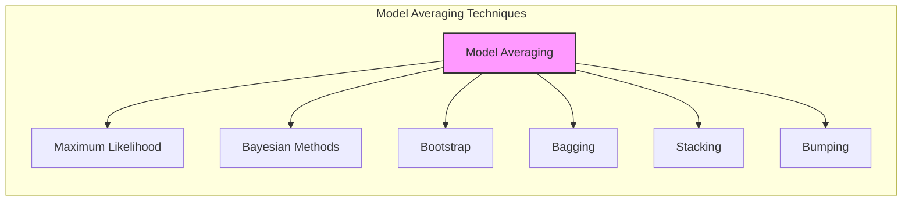
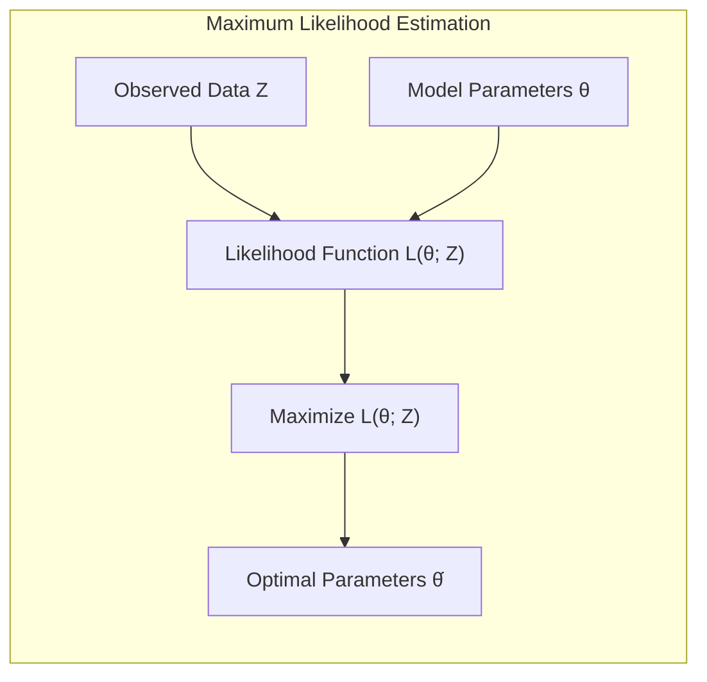
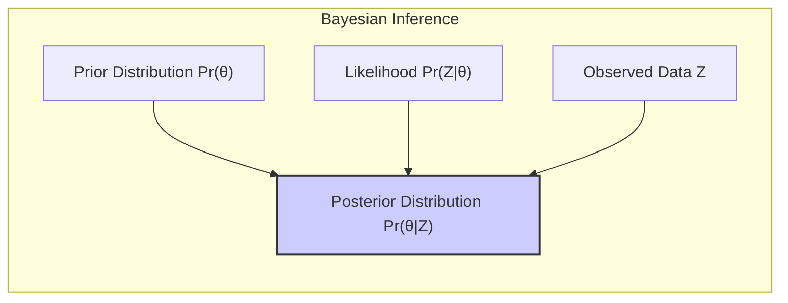
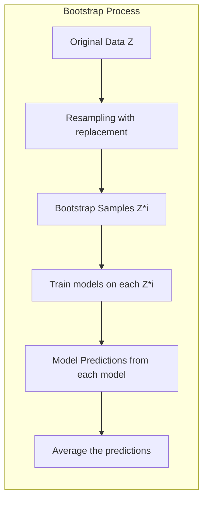
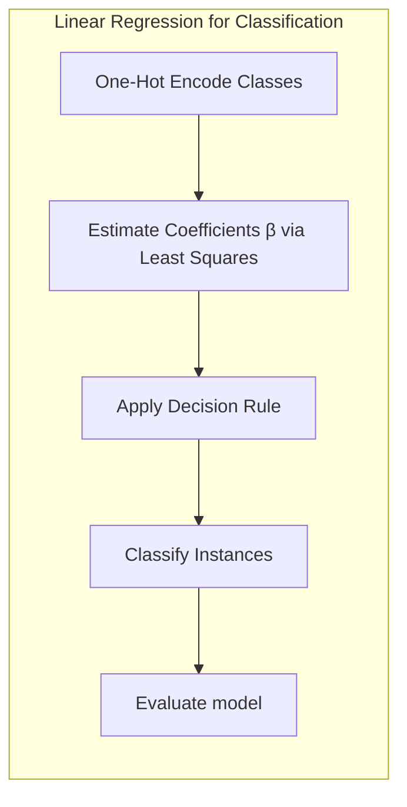
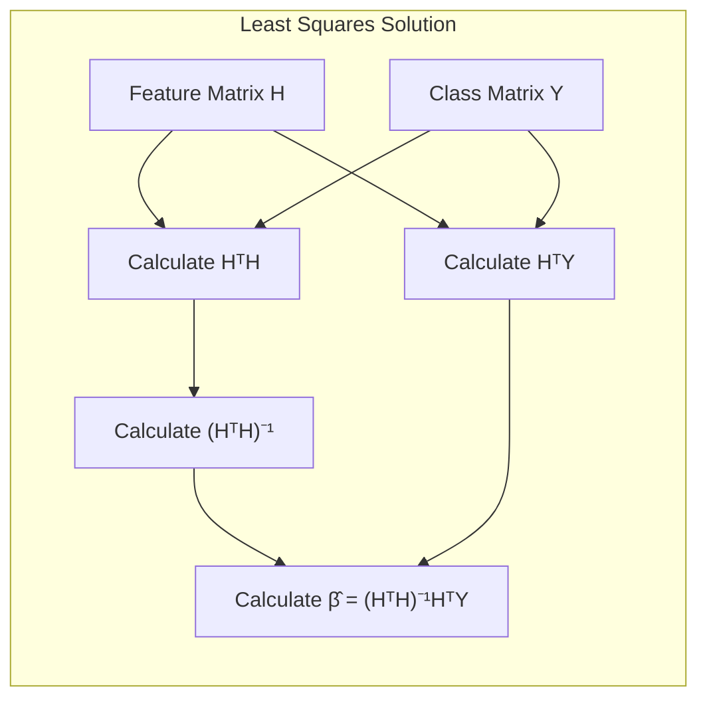
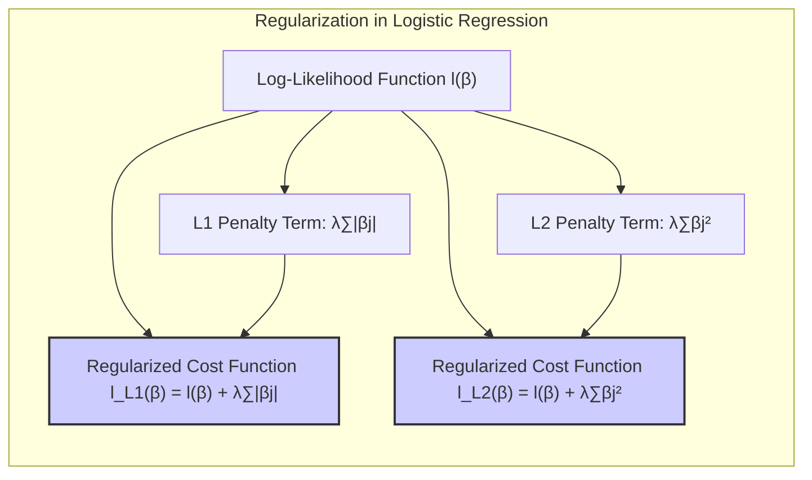
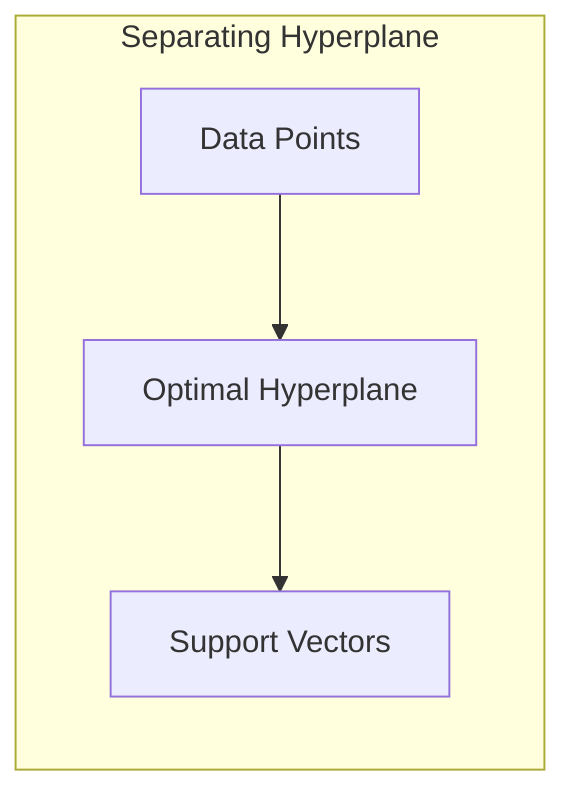
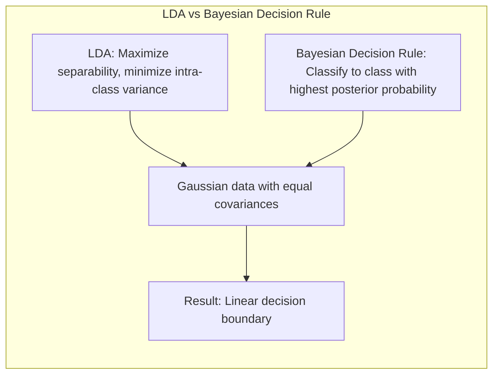
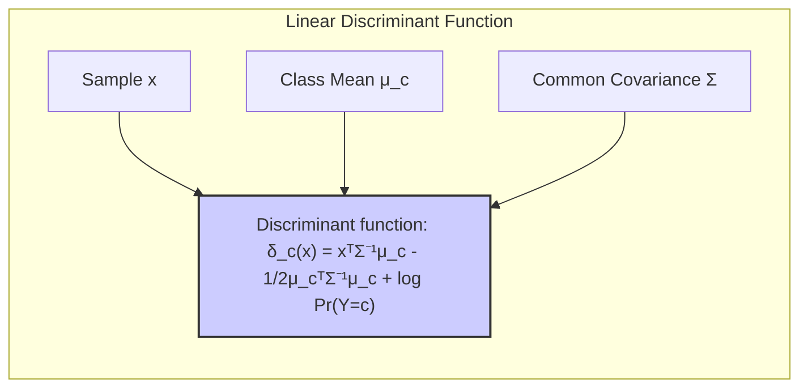

## Model Averaging: Combining Predictions for Enhanced Accuracy


### Introdução
O campo do aprendizado de máquina frequentemente busca aprimorar a precisão dos modelos por meio de uma variedade de métodos. Em particular, a ideia de combinar as previsões de múltiplos modelos, em vez de confiar em um único modelo, surge como uma estratégia robusta para melhorar o desempenho preditivo. Este capítulo explora as nuances do **model averaging**, um tema crucial em aprendizado estatístico e machine learning, onde o objetivo é gerar um modelo preditivo mais robusto e preciso através da combinação de diferentes modelos. Abordaremos abordagens baseadas em **maximum likelihood**, métodos **Bayesianos**, técnicas de **bootstrap** e como estes métodos se conectam ao conceito central de *model averaging* [^8.1]. Além disso, exploraremos técnicas como **bagging, stacking e bumping**, que são formas distintas de atingir esse objetivo, cada uma com suas próprias vantagens e desvantagens.

### Conceitos Fundamentais

**Conceito 1:** O aprendizado de modelos, como discutido em [^8.1], envolve tradicionalmente a minimização de uma função de custo, como a soma dos quadrados (para regressão) ou a entropia cruzada (para classificação). O conceito de **maximum likelihood** busca encontrar os parâmetros do modelo que maximizam a probabilidade dos dados observados. A abordagem de **maximum likelihood**, geralmente, leva a um único modelo que, embora ideal sob certas métricas, pode sofrer de problemas como overfitting ou alta variância.

**Lemma 1:** A função de verossimilhança (likelihood function) para dados Gaussianos é dada por:
$$L(\theta; Z) = \prod_{i=1}^{N} \frac{1}{\sqrt{2\pi\sigma^2}}e^{-\frac{(y_i - \mu(x_i))^2}{2\sigma^2}}$$
Onde $\theta$ são os parâmetros, $Z$ representa os dados observados, $y_i$ são os valores alvo e $\mu(x_i)$ é a previsão do modelo. Para maximizar esta função, minimiza-se a soma dos quadrados dos erros [^8.1]. Isso demonstra que a minimização da soma dos quadrados (least squares) é um caso especial da abordagem de maximum likelihood quando as distribuições são Gaussianas.


> 💡 **Exemplo Numérico:**
> Suponha que temos um conjunto de dados com duas observações: $Z = \{(x_1, y_1), (x_2, y_2)\} = \{(1, 2), (2, 3)\}$. Assumimos um modelo linear simples $\mu(x) = \beta_0 + \beta_1x$ e que os erros são Gaussianos com $\sigma^2 = 0.5$. Queremos encontrar os parâmetros $\theta = (\beta_0, \beta_1)$ que maximizam a verossimilhança.
>
> $\text{Passo 1: Definir a verossimilhança:}$
> $L(\beta_0, \beta_1; Z) = \prod_{i=1}^{2} \frac{1}{\sqrt{2\pi(0.5)}}e^{-\frac{(y_i - (\beta_0 + \beta_1x_i))^2}{2(0.5)}}$
>
> $\text{Passo 2: } \text{Substituir os valores:}$
> $L(\beta_0, \beta_1; Z) = \frac{1}{\sqrt{\pi}}e^{-\frac{(2 - (\beta_0 + \beta_1))^2}{1}} \cdot \frac{1}{\sqrt{\pi}}e^{-\frac{(3 - (\beta_0 + 2\beta_1))^2}{1}}$
>
> $\text{Passo 3: } \text{Maximizar a verossimilhança}$ (equivalente a minimizar a soma dos erros quadrados):
>  Para encontrar os parâmetros que maximizam a verossimilhança, minimizaríamos:
> $ \text{SSE} = (2 - (\beta_0 + \beta_1))^2 + (3 - (\beta_0 + 2\beta_1))^2 $
> Usando métodos de otimização ou cálculos matriciais, encontramos $\hat{\beta_0} = 1$ e $\hat{\beta_1} = 1$. Isso demonstra que a abordagem de máxima verossimilhança, neste caso, coincide com a solução de mínimos quadrados.
>
> ```python
> import numpy as np
> from sklearn.linear_model import LinearRegression
>
> X = np.array([[1], [2]])
> y = np.array([2, 3])
>
> model = LinearRegression()
> model.fit(X, y)
>
> beta0 = model.intercept_
> beta1 = model.coef_[0]
>
> print(f"beta_0: {beta0}") # Output: beta_0: 1.0
> print(f"beta_1: {beta1}") # Output: beta_1: 1.0
> ```

**Conceito 2:** A abordagem **Bayesiana** para inferência de modelos vai além da estimativa pontual de parâmetros, incorporando uma distribuição *a priori* sobre os parâmetros, $Pr(\theta)$. Ao usar os dados, atualizamos essa distribuição *a priori* para obter a distribuição *a posteriori*, $Pr(\theta|Z)$ [^8.1]. O *model averaging* na estrutura Bayesiana envolve combinar as previsões de modelos diferentes, ponderadas por suas probabilidades *a posteriori*, fornecendo uma abordagem mais robusta que leva em conta a incerteza nos parâmetros.

  
**Corolário 1:** A distribuição *a posteriori*, $Pr(\theta|Z)$, é proporcional ao produto da verossimilhança (likelihood) e da distribuição *a priori*:
$$ Pr(\theta|Z) \propto Pr(Z|\theta)Pr(\theta) $$
Esta distribuição representa a incerteza sobre os parâmetros após observar os dados e é utilizada no *model averaging* Bayesiano.

> 💡 **Exemplo Numérico:**
> Suponha que estamos modelando a probabilidade de um evento $Y$ ocorrer dado um parâmetro $\theta$. Usamos uma distribuição binomial $Pr(Y|\theta) = \theta^y (1-\theta)^{1-y}$. Nossa *a priori* para $\theta$ é uma distribuição Beta: $Pr(\theta) = \frac{\theta^{\alpha-1}(1-\theta)^{\beta-1}}{B(\alpha, \beta)}$, onde $B(\alpha,\beta)$ é a função Beta. Temos observado $Y=1$ em 3 de 5 tentativas. Suponha que nossa *a priori* é Beta(2, 2).
>
> $\text{Passo 1: Definir a verossimilhança para 3 sucessos em 5 tentativas:}$
> $Pr(Z|\theta) = \binom{5}{3}\theta^3(1-\theta)^2$.
>
> $\text{Passo 2: Definir a distribuição a priori:}$
> $Pr(\theta) = \frac{\theta^{2-1}(1-\theta)^{2-1}}{B(2,2)} = 6\theta(1-\theta)$
>
> $\text{Passo 3: Calcular a distribuição a posteriori:}$
> $Pr(\theta|Z) \propto Pr(Z|\theta)Pr(\theta) = \binom{5}{3}\theta^3(1-\theta)^2 \cdot 6\theta(1-\theta) \propto \theta^4(1-\theta)^3$.
>
> A distribuição a posteriori é também uma Beta, com parâmetros $\alpha' = 5$ e $\beta' = 4$.  Para *model averaging* Bayesiano, poderíamos usar várias distribuições a priori diferentes e obter várias distribuições a posteriori. Poderíamos então combinar as previsões ponderadas pela probabilidade de cada modelo a posteriori, refletindo a incerteza e levando em conta as informações *a priori*.

**Conceito 3:** O **bootstrap**, introduzido em [^8.1], é um método computacional para avaliar a incerteza e estabilidade dos resultados através da amostragem com reposição dos dados de treinamento. O bootstrap pode ser usado para gerar várias versões de um modelo, cada uma treinada em um conjunto de dados bootstrap diferente. A média dessas previsões de modelo, o *model averaging* via bootstrap, pode levar a modelos mais robustos com menor variância, particularmente quando os modelos base são sensíveis a pequenas mudanças nos dados de treinamento. A conexão entre o **bootstrap** e a abordagem **maximum likelihood** e **Bayesiana** está no fato de que o **bootstrap** pode ser visto como uma implementação computacional de métodos de inferência usando o conceito de maximum likelihood ou Bayes [^8.2.3].


> 💡 **Exemplo Numérico:**
> Considere um dataset pequeno $Z = \{1, 2, 3, 4, 5\}$. Vamos criar 3 conjuntos de bootstrap amostrando com reposição do conjunto original, de modo a fazer um *model averaging*.
>
> $\text{Passo 1: Gerar amostras bootstrap:}$
> * $Z_1^* = \{2, 2, 4, 5, 1\}$
> * $Z_2^* = \{3, 1, 3, 5, 4\}$
> * $Z_3^* = \{1, 5, 2, 4, 4\}$
>
> $\text{Passo 2: Treinar um modelo em cada amostra:}$
> Suponha que nosso modelo seja simplesmente a média dos valores. Temos:
> * $\bar{Z_1^*} = \frac{2+2+4+5+1}{5} = 2.8$
> * $\bar{Z_2^*} = \frac{3+1+3+5+4}{5} = 3.2$
> * $\bar{Z_3^*} = \frac{1+5+2+4+4}{5} = 3.2$
>
> $\text{Passo 3: Calcular a média das previsões:}$
> A média das previsões é $\frac{2.8 + 3.2 + 3.2}{3} = 3.066$.
>
> O *model averaging* usando bootstrap nos dá uma estimativa que tende a ser mais estável que uma única média calculada sobre o dataset original. Este exemplo ilustra o uso do bootstrap para obter previsões mais robustas ao reduzir a variância da estimativa.
>
> ```python
> import numpy as np
>
> original_data = np.array([1, 2, 3, 4, 5])
> n_bootstrap_samples = 3
>
> bootstrap_means = []
>
> for _ in range(n_bootstrap_samples):
>     bootstrap_sample = np.random.choice(original_data, size=len(original_data), replace=True)
>     bootstrap_mean = np.mean(bootstrap_sample)
>     bootstrap_means.append(bootstrap_mean)
>
> model_average_prediction = np.mean(bootstrap_means)
> print(f"Bootstrap means: {bootstrap_means}") # Output example: Bootstrap means: [3.0, 2.8, 3.0]
> print(f"Model average: {model_average_prediction}") # Output example: Model average: 2.933333333333333
> ```

> ⚠️ **Nota Importante**: A abordagem de *model averaging* pode reduzir a variância, mas não necessariamente o viés. A escolha dos modelos base e o método de combinação são cruciais para o sucesso do model averaging.

> ❗ **Ponto de Atenção**: É essencial considerar a possível dependência entre os modelos que se está combinando. Se os modelos forem muito correlacionados, o ganho do model averaging pode ser limitado.

> ✔️ **Destaque**: Em muitos casos, o *model averaging* resulta em modelos mais precisos que qualquer um dos modelos individuais, especialmente quando os modelos são variados e não perfeitamente correlacionados.

### Regressão Linear e Mínimos Quadrados para Classificação

**Explicação:** O diagrama representa o fluxo de regressão de indicadores e sua aplicação na classificação.

Na regressão linear para classificação, cada classe é codificada usando variáveis *dummy* (one-hot encoding) e, então, um modelo de regressão linear é ajustado para cada variável *dummy*. Formalmente, em um problema de classificação com K classes, usamos uma matriz indicadora Y de dimensão NxK, onde $Y_{ik} = 1$ se a i-ésima instância pertence à k-ésima classe, e 0 caso contrário. Ajusta-se então um modelo linear para cada classe usando a seguinte equação [^8.1]:
$$ \hat{Y} = H\beta $$
Onde H é a matriz de características (Nxp), e $\beta$ é uma matriz de coeficientes (pxK). Os coeficientes $\hat{\beta}$ são obtidos pela solução de mínimos quadrados:
$$ \hat{\beta} = (H^T H)^{-1}H^T Y $$
Uma vez que os coeficientes são estimados, para classificar uma nova instância *x*, calculamos a previsão $\hat{y} = h(x)^T\hat{\beta}$ e atribuímos à instância a classe com o maior valor previsto.
No contexto de model averaging, podemos usar a regressão linear como um modelo base e combinar as previsões de diferentes modelos de regressão, cada um treinado com um subconjunto diferente de características ou com dados bootstrap [^8.7]. Isso pode mitigar o problema de overfitting e melhorar a robustez da classificação.

**Lemma 2:** Dada a matriz de features H e a matriz de classes Y, a solução de mínimos quadrados para os coeficientes de regressão linear é única e dada por $\hat{\beta} = (H^T H)^{-1}H^T Y$, desde que $(H^T H)^{-1}$ exista. Este resultado estabelece a base para usar regressão linear como um modelo base em técnicas de *model averaging*, mostrando que podemos determinar coeficientes únicos através da minimização do erro quadrático [^8.2.1].


> 💡 **Exemplo Numérico:**
> Imagine um problema de classificação binária com 4 amostras e uma única feature, onde as classes são representadas por 0 e 1.
> Temos o seguinte dataset:
>
> | Amostra | Feature (x) | Classe (y) |
> |---|---|---|
> | 1 | 1 | 0 |
> | 2 | 2 | 0 |
> | 3 | 3 | 1 |
> | 4 | 4 | 1 |
>
> $\text{Passo 1: Construir a matriz H com as features e adicionar um intercepto:}$
> $H = \begin{bmatrix} 1 & 1 \\ 1 & 2 \\ 1 & 3 \\ 1 & 4 \end{bmatrix}$
>
> $\text{Passo 2: Construir a matriz Y com one-hot encoding para a classe:}$
> $Y = \begin{bmatrix} 0 \\ 0 \\ 1 \\ 1 \end{bmatrix}$
>
> $\text{Passo 3: Calcular } H^T H$:
> $H^T H = \begin{bmatrix} 1 & 1 & 1 & 1 \\ 1 & 2 & 3 & 4 \end{bmatrix} \begin{bmatrix} 1 & 1 \\ 1 & 2 \\ 1 & 3 \\ 1 & 4 \end{bmatrix} = \begin{bmatrix} 4 & 10 \\ 10 & 30 \end{bmatrix}$
>
> $\text{Passo 4: Calcular } (H^T H)^{-1}$:
> $(H^T H)^{-1} = \frac{1}{(4*30 - 10*10)} \begin{bmatrix} 30 & -10 \\ -10 & 4 \end{bmatrix} = \frac{1}{20} \begin{bmatrix} 30 & -10 \\ -10 & 4 \end{bmatrix} = \begin{bmatrix} 1.5 & -0.5 \\ -0.5 & 0.2 \end{bmatrix}$
>
> $\text{Passo 5: Calcular } H^T Y$:
> $H^T Y = \begin{bmatrix} 1 & 1 & 1 & 1 \\ 1 & 2 & 3 & 4 \end{bmatrix} \begin{bmatrix} 0 \\ 0 \\ 1 \\ 1 \end{bmatrix} = \begin{bmatrix} 2 \\ 7 \end{bmatrix}$
>
> $\text{Passo 6: Calcular } \hat{\beta} = (H^T H)^{-1} H^T Y$:
> $\hat{\beta} = \begin{bmatrix} 1.5 & -0.5 \\ -0.5 & 0.2 \end{bmatrix} \begin{bmatrix} 2 \\ 7 \end{bmatrix} = \begin{bmatrix} -0.5 \\ 0.4 \end{bmatrix}$
>
> Isso significa que o modelo ajustado é $\hat{y} = -0.5 + 0.4x$. Para classificar, por exemplo, uma amostra com $x=2.5$, temos $\hat{y} = -0.5 + 0.4*2.5 = 0.5$. Poderíamos definir uma regra de decisão, por exemplo, se $\hat{y} > 0.5$ classificar como classe 1, e classe 0 caso contrário. No contexto do model averaging, podemos fazer este procedimento para diferentes amostras (e.g bootstrap) e calcular uma média das previsões.
>
> ```python
> import numpy as np
> from sklearn.linear_model import LinearRegression
>
> H = np.array([[1, 1], [1, 2], [1, 3], [1, 4]])
> Y = np.array([0, 0, 1, 1])
>
> model = LinearRegression()
> model.fit(H, Y)
>
> beta = np.concatenate(([model.intercept_], model.coef_))
> print(f"Estimated beta coefficients: {beta}") # Output: Estimated beta coefficients: [-0.5  0.4]
>
>
> new_x = np.array([[1, 2.5]])
> predicted_y = model.predict(new_x)
> print(f"Predicted value for x=2.5: {predicted_y}") # Output: Predicted value for x=2.5: [0.5]
>
> ```

**Corolário 2:** Em casos onde $(H^T H)$ não é invertível, podemos adicionar um termo de regularização, como a norma L2, para garantir que a matriz seja invertível. Esta regularização também pode melhorar a estabilidade e generalização do modelo.

*As limitações da regressão linear incluem a sua suposição de linearidade entre as características e a saída. Em problemas de classificação com fronteiras de decisão não lineares, a regressão linear pode ter dificuldades e, nesses casos, os modelos mais complexos, podem ter um melhor desempenho. Além disso, quando aplicada diretamente a problemas de classificação, a regressão linear pode gerar previsões fora do intervalo [0,1].*

### Métodos de Seleção de Variáveis e Regularização em Classificação

A seleção de variáveis e a regularização são passos cruciais na construção de modelos de classificação robustos e interpretáveis. Métodos de regularização adicionam termos de penalização à função de custo para controlar a complexidade do modelo e evitar o overfitting [^8.1].
Em problemas de classificação, a regularização é frequentemente aplicada em modelos logísticos, modificando a função de verossimilhança (likelihood) com termos adicionais. Para uma regressão logística, a log-likelihood é dada por [^8.2.2]:

$$l(\beta) = \sum_{i=1}^{N} y_i \log(p(x_i;\beta)) + (1-y_i)\log(1-p(x_i;\beta))$$

Onde $p(x_i;\beta)$ é a probabilidade estimada para a classe 1, dada por:

$$p(x_i;\beta) = \frac{1}{1 + e^{-x_i^T \beta}}$$

Para regularizar, podemos adicionar penalidades L1 (Lasso) ou L2 (Ridge) ao negativo da log-likelihood. Regularização L1 adiciona a soma dos valores absolutos dos coeficientes:

$$l_{L1}(\beta) = l(\beta) + \lambda \sum_{j=1}^p |\beta_j|$$

Enquanto regularização L2 adiciona a soma dos quadrados dos coeficientes:

$$l_{L2}(\beta) = l(\beta) + \lambda \sum_{j=1}^p \beta_j^2$$

onde $\lambda$ é o parâmetro de regularização. A regularização L1 tende a levar a coeficientes esparsos, ou seja, alguns coeficientes serão exatamente zero, realizando a seleção de variáveis [^8.7]. A regularização L2, por outro lado, tende a encolher todos os coeficientes em direção a zero, mas não os torna exatamente zero.

**Lemma 3:** Ao adicionar a penalidade L1 (Lasso) na função de custo da regressão logística, a solução de mínimos quadrados se torna esparsa: isto é, alguns coeficientes do modelo serão exatamente zero. Isso é devido à natureza do problema de otimização, o qual tende a forçar os coeficientes a serem zero quando eles têm baixa relevância [^8.2.2].

**Prova do Lemma 3:** A prova envolve a análise das condições de otimalidade da função de custo com penalidade L1. A penalidade L1 induz cantos na superfície de otimização, onde os gradientes podem levar os coeficientes para zero. A análise detalhada das condições de otimalidade pode ser encontrada em textos de otimização, e não se encaixa dentro do escopo deste Lemma. $\blacksquare$

**Corolário 3:** A regularização L1 promove a esparsidade e pode ser interpretada como uma seleção de variáveis, onde apenas as variáveis com coeficientes não-zero são relevantes para o modelo de classificação. Essa propriedade é útil quando há um grande número de features e deseja-se reduzir a dimensionalidade. Já a regularização L2 tende a reduzir a magnitude de todos os coeficientes, melhorando a estabilidade e reduzindo o overfitting.

> 💡 **Exemplo Numérico:**
> Vamos usar um problema de classificação binária com três features. Suponha que temos os seguintes coeficientes obtidos a partir de um modelo de regressão logística sem regularização: $\beta = [1, 2, -3]$. Agora vamos aplicar regularização L1 e L2, com $\lambda = 0.5$.
>
> $\text{Passo 1: Definir a função de custo sem regularização:}$
> A função de custo é a log-likelihood. Vamos considerar os coeficientes $\beta = [1, 2, -3]$
>
> $\text{Passo 2: Adicionar penalidade L1:}$
> $l_{L1}(\beta) = l(\beta) + 0.5 * (|1| + |2| + |-3|) = l(\beta) + 0.5 * (1 + 2 + 3) = l(\beta) + 3$. A otimização forçaria alguns dos coeficientes para 0, se o efeito sobre a função de custo fosse compensado. Em geral, coeficientes com menor magnitude são mais propensos a serem zerados.
>
> $\text{Passo 3: Adicionar penalidade L2:}$
> $l_{L2}(\beta) = l(\beta) + 0.5 * (1^2 + 2^2 + (-3)^2) = l(\beta) + 0.5 * (1 + 4 + 9) = l(\beta) + 7$. A regularização L2 reduz a magnitude de todos os coeficientes, em direção a zero.
>
> $\text{Passo 4: Comparação:}$
> Após aplicar a regularização, poderíamos ter um novo conjunto de coeficientes. Por exemplo:
>  - L1: $\beta_{L1} = [0, 1.5, -2.5]$ (Coeficiente 1 zerado, esparsidade)
>  - L2: $\beta_{L2} = [0.8, 1.6, -2.4]$ (Coeficientes encolhidos)
>
> A regularização L1 promove esparsidade, zerando o primeiro coeficiente, enquanto L2 reduz a magnitude de todos os coeficientes, sendo menos propensa a zerar completamente os coeficientes.
>
> ```python
> import numpy as np
> from sklearn.linear_model import LogisticRegression
> from sklearn.datasets import make_classification
>
> X, y = make_classification(n_samples=100, n_features=3, n_informative=2, n_redundant=0, random_state=42)
>
> # Sem regularização
> model_no_reg = LogisticRegression(penalty=None, solver='lbfgs')
> model_no_reg.fit(X, y)
> beta_no_reg = np.concatenate(([model_no_reg.intercept_], model_no_reg.coef_[0]))
> print(f"Betas without regularization: {beta_no_reg}")
>
> # Regularização L1 (Lasso)
> model_l1 = LogisticRegression(penalty='l1', C=1.0, solver='liblinear', random_state=42)
> model_l1.fit(X, y)
> beta_l1 = np.concatenate(([model_l1.intercept_], model_l1.coef_[0]))
> print(f"Betas with L1 regularization: {beta_l1}")
>
> # Regularização L2 (Ridge)
> model_l2 = LogisticRegression(penalty='l2', C=1.0, solver='lbfgs', random_state=42)
> model_l2.fit(X, y)
> beta_l2 = np.concatenate(([model_l2.intercept_], model_l2.coef_[0]))
> print(f"Betas with L2 regularization: {beta_l2}")
>
> ```

> ⚠️ **Ponto Crucial**: A escolha entre penalidade L1 e L2 (ou sua combinação, Elastic Net) depende do problema específico. A penalidade L1 é mais apropriada quando se deseja seleção de variáveis, enquanto L2 é mais adequada para redução do overfitting.

### Separating Hyperplanes e Perceptrons
Os métodos de *separating hyperplanes* buscam encontrar um hiperplano que separa as classes de dados. Este conceito se baseia na ideia de maximizar a margem de separação entre as classes, resultando em um hiperplano ótimo. O problema de otimização pode ser formulado usando o dual de Wolfe [^8.5.2], onde a solução é encontrada como uma combinação linear dos pontos de suporte, que são as amostras mais próximas do hiperplano de decisão.

O Perceptron de Rosenblatt [^8.5.1] é um algoritmo clássico para encontrar um hiperplano separador linear, e a convergência do Perceptron é garantida sob a condição de separabilidade linear dos dados. Este algoritmo itera sobre as amostras, atualizando os pesos do hiperplano quando classifica incorretamente uma amostra.

Se os dados não forem linearmente separáveis, pode-se usar o truque do kernel ou modelos mais complexos, tais como SVMs (Support Vector Machines), ou aplicar técnicas de *model averaging*, treinando vários perceptrons com diferentes condições iniciais ou amostras dos dados [^8.7].
Além disso, podemos combinar modelos lineares como *hyperplanes* com modelos não-lineares através de bagging e boosting, obtendo modelos mais flexíveis e robustos.

### Pergunta Teórica Avançada: Quais as diferenças fundamentais entre a formulação de LDA (Linear Discriminant Analysis) e a Regra de Decisão Bayesiana, considerando distribuições Gaussianas com covariâncias iguais?
**Resposta:**
O LDA e a Regra de Decisão Bayesiana, sob a suposição de dados gerados por distribuições Gaussianas com covariâncias iguais, são muito similares. O LDA busca encontrar a melhor projeção linear para separar as classes, enquanto a Regra de Decisão Bayesiana calcula a probabilidade *a posteriori* de uma amostra pertencer a cada classe, e usa essa probabilidade para classificar [^8.3].

Em ambas as abordagens, sob a suposição de distribuições Gaussianas com covariâncias iguais, a fronteira de decisão resulta em um hiperplano linear. No entanto, o LDA estima os parâmetros (médias e matriz de covariância) usando métodos de maximum likelihood. Já a Regra de Decisão Bayesiana usa as mesmas estimativas, mas com uma interpretação probabilística. A diferença chave reside em como eles são derivados:
- **LDA:** Deriva a fronteira de decisão linear através da maximização da separabilidade entre classes e da minimização da variância intra-classe.
- **Regra de Decisão Bayesiana:** Deriva a fronteira de decisão ao classificar uma instância para a classe com a maior probabilidade *a posteriori*.


**Lemma 4:** Se as classes seguem distribuições Gaussianas com médias $\mu_k$ e covariância comum $\Sigma$, o discriminante linear de LDA e a regra de decisão Bayesiana resultam no mesmo hiperplano, e a projeção para classificar uma amostra $x$ na classe $c$ é dada por [^8.3]:
$$\delta_c(x) = x^T\Sigma^{-1}\mu_c - \frac{1}{2}\mu_c^T\Sigma^{-1}\mu_c + \log Pr(Y=c)$$

**Prova do Lemma 4:** A prova pode ser demonstrada através do cálculo da função discriminante do LDA e da Regra de Decisão Bayesiana sob as condições descritas. A igualdade da função discriminante resulta no mesmo hiperplano de decisão [^8.3], [^8.3.3]. $\blacksquare$


> 💡 **Exemplo Numérico:**
> Considere um problema de classificação com duas classes, onde a classe 1 tem média $\mu_1 = [1, 1]$ e classe 2 tem média $\mu_2 = [3, 3]$. A matriz de covariância comum é $\Sigma = \begin{bmatrix} 1 & 0 \\ 0 & 1 \end{bmatrix}$. Assumimos também que a probabilidade *a priori* de cada classe é $Pr(Y=1) = Pr(Y=2) = 0.5$.
>
> $\text{Passo 1: Calcular a inversa da matriz de covariância:}$
> $\Sigma^{-1} = \begin{bmatrix} 1 & 0 \\ 0 & 1 \end{bmatrix}$
>
> $\text{Passo 2: Calcular as funções discriminantes para uma amostra x = [2, 2]:}$
> $\delta_